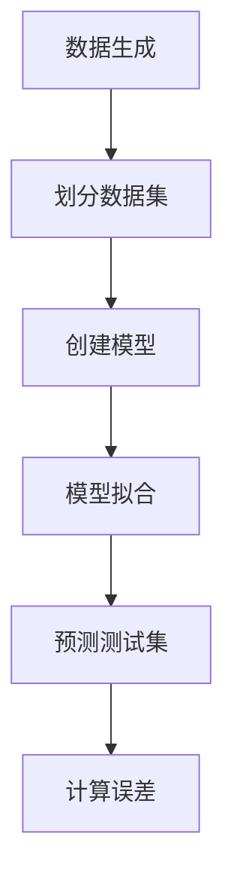
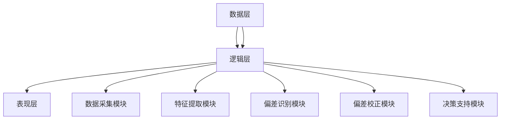
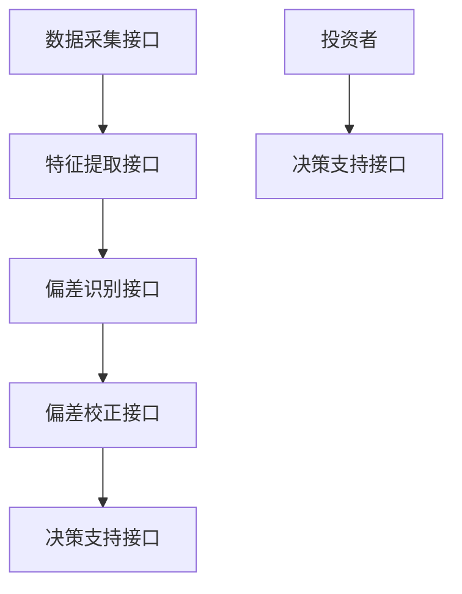
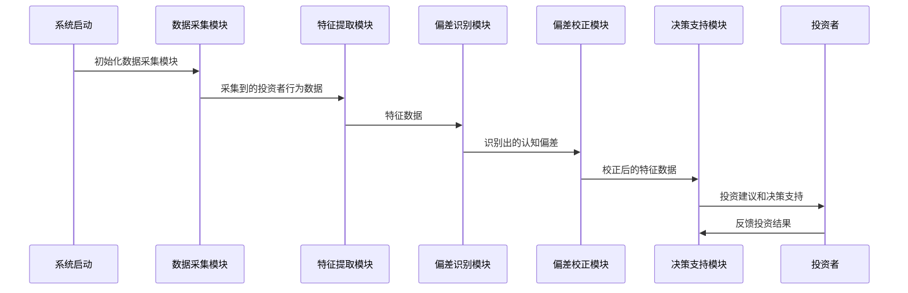

                 

### 设计智能化的个人投资者认知偏差校正工具

#### 关键词：
- 认知偏差校正
- 智能化投资工具
- 机器学习算法
- 数学模型
- 投资决策优化
- 数据分析

#### 摘要：
本文旨在探讨设计智能化个人投资者认知偏差校正工具的全过程。首先，文章介绍了认知偏差问题的背景、影响及其校正的重要性。接着，分析了智能化工具的发展与应用，并提出了设计认知偏差校正工具的基本原理和核心技术。随后，详细阐述了核心概念与联系，包括关键智能算法的引入与应用。文章随后深入讲解了数学模型与公式，并使用Python源代码进行算法原理的详细阐述。然后，文章介绍了系统架构设计，包括问题场景分析、系统功能设计、系统架构设计、系统接口设计以及系统交互。最后，通过项目实战部分，展示了工具的实际应用，并进行了案例分析。文章最后提供了一些最佳实践建议和总结。

----------------------------------------------------------------

## 第一部分：认知偏差校正工具设计背景

### 1.1 认知偏差问题概述

认知偏差是人们在信息处理过程中产生的系统性错误，它影响了个体对信息的感知、理解和决策。认知偏差广泛存在于个人投资者中，对投资决策产生显著影响。例如，确认偏误（Confirmation Bias）使投资者倾向于关注支持自己观点的信息，而忽略反驳自己观点的信息；过度自信（Overconfidence）使投资者高估自己的能力和预测准确性，导致风险控制不当；锚定效应（Anchoring Effect）使投资者受到初始信息的影响，难以客观评估后续信息。

### 1.1.1 认知偏差的定义与影响

认知偏差（Cognitive Bias）是指在信息处理过程中，由于认知机制的限制或认知偏误导致的系统性错误。它会影响人们的判断和决策，使人们无法做出理性和最优的选择。在投资领域，认知偏差会影响投资者的决策，导致以下几方面的问题：

1. **投资决策不合理**：投资者可能会根据错误的或片面的信息做出决策，从而产生非理性投资行为。
2. **风险控制不当**：过度自信或恐惧使投资者无法准确评估风险，导致风险过高或过低。
3. **市场预测错误**：投资者可能会因认知偏差而高估或低估市场的变化，导致市场预测不准确。
4. **机会成本增加**：投资者可能会因为认知偏差而错过更好的投资机会，增加机会成本。

### 1.1.2 个人投资者认知偏差的表现

个人投资者认知偏差的表现形式多样，常见的有以下几种：

1. **确认偏误**：投资者倾向于关注和接受支持自己观点的信息，忽略或排斥反驳自己观点的信息。
2. **过度自信**：投资者往往高估自己的判断能力和预测准确性，低估市场和风险。
3. **锚定效应**：投资者容易被初始信息所锚定，难以客观评估后续信息。
4. **代表性偏差**：投资者容易根据样本的特征来推断总体特征，从而产生偏差。
5. **可得性偏差**：投资者容易根据记忆中可获取的信息来做出判断，而不是基于全面的数据分析。

### 1.1.3 认知偏差校正的重要性

认知偏差校正对于提高个人投资者决策质量和风险控制能力至关重要。通过校正认知偏差，可以降低非理性投资行为，提高投资决策的准确性和可靠性。以下是认知偏差校正的重要性：

1. **优化投资策略**：校正认知偏差可以帮助投资者制定更科学和合理的投资策略，降低投资风险。
2. **提高投资效率**：通过减少认知偏差，投资者可以更加专注和准确地分析市场信息，提高投资决策的效率。
3. **降低机会成本**：校正认知偏差有助于投资者更好地抓住投资机会，降低机会成本。
4. **增强风险控制能力**：认知偏差校正可以帮助投资者更加客观地评估风险，从而更好地控制投资风险。

### 1.2 智能化工具的发展与应用

随着人工智能技术的快速发展，智能化工具在各个领域得到了广泛应用，特别是在投资领域。智能化工具能够通过机器学习算法和数据分析技术，自动识别和校正投资者的认知偏差，提供更准确和理性的投资建议。

#### 1.2.1 智能化工具的概念与类型

智能化工具是指利用人工智能技术和数据分析方法，对大量投资数据进行处理和分析，从而为投资者提供智能化投资建议的工具。根据功能和应用场景的不同，智能化工具可以分为以下几类：

1. **智能推荐系统**：根据投资者的历史投资记录和风险偏好，为投资者推荐符合其风险承受能力的投资产品。
2. **智能分析系统**：利用大数据分析和机器学习算法，对市场趋势和投资机会进行预测和分析，提供投资策略建议。
3. **风险预警系统**：通过实时监测市场数据，及时识别和预警潜在的风险，帮助投资者规避风险。
4. **智能投顾平台**：结合投资者的风险偏好、投资目标和市场情况，为投资者提供个性化的投资组合和管理建议。

#### 1.2.2 智能化工具在投资领域的应用

智能化工具在投资领域的应用广泛且深入，主要包括以下几个方面：

1. **投资组合优化**：通过数据分析和技术分析，智能化工具可以帮助投资者构建最优的投资组合，实现风险和收益的最佳平衡。
2. **市场趋势预测**：利用机器学习算法和大数据分析，智能化工具可以预测市场趋势和投资机会，帮助投资者抓住市场机会。
3. **风险控制**：通过实时监控和数据分析，智能化工具可以及时识别和预警潜在的风险，帮助投资者规避风险。
4. **个性化服务**：根据投资者的风险偏好、投资目标和市场情况，智能化工具可以提供个性化的投资建议和投资组合管理。

#### 1.2.3 智能化工具的发展趋势

随着人工智能技术和大数据分析的不断发展，智能化工具在投资领域的应用前景广阔，未来发展趋势包括：

1. **算法优化**：随着算法的迭代和优化，智能化工具将更加精准和高效，能够更好地识别和校正投资者的认知偏差。
2. **数据来源多样化**：随着数据来源的多样化，智能化工具将能够获取更全面和准确的数据，提高投资分析的准确性和可靠性。
3. **用户体验优化**：通过优化用户体验，智能化工具将更加贴近投资者的需求，提高投资者的使用黏性和满意度。
4. **跨领域应用**：随着智能化工具的不断发展，它将在更多领域得到应用，如金融科技、区块链、加密货币等。

### 1.3 本书的结构与目标

本书旨在通过系统化和实践化的方式，帮助读者了解和掌握设计智能化个人投资者认知偏差校正工具的全过程。本书的结构如下：

1. **第一部分：认知偏差校正工具设计背景**：介绍认知偏差问题的背景、影响及智能化工具的发展与应用。
2. **第二部分：认知偏差校正工具的核心概念**：详细阐述认知偏差校正工具的基本原理、关键概念、智能算法引入与应用。
3. **第三部分：认知偏差校正工具的架构设计**：介绍系统架构设计、功能设计、接口设计以及系统交互。
4. **第四部分：认知偏差校正工具的项目实战**：通过实际项目展示工具的应用，包括环境安装与配置、系统核心实现、代码应用与分析、实际案例剖析。

本书的目标是：

1. **理论讲解**：系统性地介绍认知偏差校正工具的核心概念和原理，帮助读者理解智能化工具的工作机制。
2. **实践指导**：通过实际项目展示，帮助读者掌握设计认知偏差校正工具的实践方法，提高投资决策的科学性和准确性。
3. **案例分析**：通过案例分析，让读者了解认知偏差校正工具在实际投资中的应用效果，提高读者的实际操作能力。

### 1.3.1 目录结构

本书的目录结构如下：

1. **第一部分：认知偏差校正工具设计背景**
   - 1.1 认知偏差问题概述
   - 1.2 智能化工具的发展与应用
   - 1.3 本书的结构与目标
2. **第二部分：认知偏差校正工具的核心概念**
   - 2.1 认知偏差校正工具的基本原理
   - 2.2 关键概念与联系
   - 2.3 智能算法的引入与应用
   - 2.4 数学模型与公式讲解
   - 2.5 算法实现与流程图
3. **第三部分：认知偏差校正工具的架构设计**
   - 3.1 问题场景与需求分析
   - 3.2 系统功能设计
   - 3.3 系统架构设计
   - 3.4 系统接口设计
   - 3.5 系统交互与Mermaid序列图
4. **第四部分：认知偏差校正工具的项目实战**
   - 4.1 环境安装与配置
   - 4.2 系统核心实现
   - 4.3 代码应用与分析
   - 4.4 实际案例剖析
   - 4.5 项目小结

### 1.3.2 阅读对象

本书的阅读对象主要包括以下几类人群：

1. **个人投资者**：希望通过智能化工具提高投资决策质量和风险控制能力的投资者。
2. **金融从业者**：希望了解和掌握智能化投资工具的设计与应用的金融从业者。
3. **计算机科学和人工智能爱好者**：对人工智能在投资领域应用感兴趣的计算机科学和人工智能爱好者。

### 1.3.3 学习目标

通过阅读本书，读者可以达成以下学习目标：

1. **理解认知偏差校正工具的基本原理**：掌握认知偏差校正工具的工作机制和核心概念。
2. **掌握智能算法的应用方法**：了解主流智能算法在认知偏差校正中的应用，学会选择和优化智能算法。
3. **设计智能化投资工具**：学会设计智能化投资工具的架构和系统功能，实现从理论到实践的转化。
4. **应用案例分析**：通过实际案例分析，掌握认知偏差校正工具在实际投资中的应用技巧。

----------------------------------------------------------------

## 第二部分：认知偏差校正工具的核心概念

### 2.1 认知偏差校正工具的基本原理

认知偏差校正工具是基于人工智能和数据分析技术，旨在帮助投资者识别和校正其认知偏差，从而提高投资决策的科学性和准确性的工具。其基本原理主要包括以下几个方面：

#### 2.1.1 认知偏差校正的理论基础

认知偏差校正的理论基础主要来自于认知心理学和行为经济学。认知心理学研究了人类在信息处理过程中的心理机制，揭示了人类认知的局限性。行为经济学则通过实验和数据分析，揭示了人类在决策过程中的系统性错误。

这些理论基础为认知偏差校正工具的设计提供了理论依据，使工具能够通过模拟人类认知过程，识别和校正投资者的认知偏差。

#### 2.1.2 校正工具的基本工作原理

认知偏差校正工具的基本工作原理可以分为以下几个步骤：

1. **数据采集**：通过收集投资者的历史交易数据、市场数据以及其他相关信息，为后续分析提供数据基础。
2. **特征提取**：从数据中提取与认知偏差相关的特征，如投资偏好、风险承受能力、投资历史等。
3. **偏差识别**：利用机器学习算法和数据分析技术，识别投资者在决策过程中存在的认知偏差。
4. **偏差校正**：根据识别出的认知偏差，制定相应的校正策略，如调整投资策略、风险控制策略等。
5. **决策优化**：将校正后的决策结果反馈给投资者，帮助其优化投资决策。

#### 2.1.3 校正工具的核心技术

认知偏差校正工具的核心技术主要包括以下几个方面：

1. **机器学习算法**：用于识别和校正认知偏差的算法，如回归分析、决策树、神经网络等。这些算法能够从大量数据中学习，识别出投资者在决策过程中的规律和偏差。
2. **数据分析技术**：用于处理和挖掘数据的工具，如数据可视化、统计分析、时间序列分析等。这些技术能够帮助投资者更好地理解数据，发现潜在的认知偏差。
3. **决策支持系统**：用于辅助投资者进行决策的工具，如投资组合优化系统、风险预警系统等。这些系统能够根据校正后的认知偏差，为投资者提供科学和合理的投资建议。

### 2.2 关键概念与联系

在认知偏差校正工具的设计中，有几个关键概念需要深入理解和掌握。这些概念不仅相互联系，而且在工具的运作中发挥着重要作用。

#### 2.2.1 核心概念原理

以下是一些核心概念及其原理：

1. **认知偏差**：指个体在信息处理过程中产生的系统性错误。认知偏差校正工具的核心任务就是识别和校正这些偏差。
2. **特征提取**：从数据中提取与认知偏差相关的特征，如投资历史、风险偏好等。这些特征是识别和校正认知偏差的重要依据。
3. **机器学习算法**：用于从数据中学习，识别和校正认知偏差的算法。常见的算法包括线性回归、决策树、神经网络等。
4. **决策支持系统**：用于辅助投资者进行决策的系统，如投资组合优化系统、风险预警系统等。

#### 2.2.2 概念属性特征对比

以下是一个对比表格，展示这些概念的主要属性特征：

| 概念             | 定义                                                         | 主要属性特征                                                     |
|------------------|--------------------------------------------------------------|----------------------------------------------------------------|
| 认知偏差         | 个体在信息处理过程中产生的系统性错误                         | - 影响投资决策 <br> - 系统性、规律性 <br> - 与心理机制相关       |
| 特征提取         | 从数据中提取与认知偏差相关的特征                             | - 投资历史 <br> - 风险偏好 <br> - 行为模式                         |
| 机器学习算法     | 从数据中学习，识别和校正认知偏差的算法                       | - 回归分析 <br> - 决策树 <br> - 神经网络 <br> - 支持向量机等         |
| 决策支持系统     | 辅助投资者进行决策的系统                                     | - 投资组合优化 <br> - 风险预警 <br> - 投资策略建议                     |

#### 2.2.3 ER实体关系图架构

为了更好地理解认知偏差校正工具的架构和功能，我们可以使用ER（实体-关系）图来表示各个概念之间的关系。

以下是一个ER实体关系图的示例：

```mermaid
erDiagram
  Investor ||--|{ Data: <<Entity>> >> Data
  Data ||--|{ FeatureExtraction: <<Process>> >> FeatureExtraction
  FeatureExtraction ||--|{ BiasIdentification: <<Process>> >> BiasIdentification
  BiasIdentification ||--|{ BiasCorrection: <<Process>> >> BiasCorrection
  BiasCorrection ||--|{ DecisionSupport: <<System>> >> DecisionSupport
  Investor ||--|{ DecisionSupport: <<System>> >> DecisionSupport
```

在这个ER图中，Investor（投资者）是核心实体，它与Data（数据）、FeatureExtraction（特征提取）、BiasIdentification（偏差识别）、BiasCorrection（偏差校正）和DecisionSupport（决策支持系统）之间存在紧密的关系。

### 2.3 智能算法的引入与应用

智能算法在认知偏差校正工具中扮演着关键角色，它们能够帮助识别和校正投资者的认知偏差。以下将介绍几种常用的智能算法，并讨论它们在认知偏差校正中的应用。

#### 2.3.1 主流智能算法介绍

以下是几种主流的智能算法：

1. **线性回归**：线性回归是一种最简单的机器学习算法，用于建立自变量和因变量之间的线性关系。它适用于识别投资者行为和认知偏差之间的关系。
2. **决策树**：决策树通过一系列规则将数据分割成不同的区域，每个区域对应一个特定的输出。它适用于识别复杂的认知偏差模式。
3. **神经网络**：神经网络是一种模仿人脑结构和功能的计算模型，能够处理复杂的非线性问题。它适用于识别和校正高度复杂的认知偏差。
4. **支持向量机（SVM）**：支持向量机通过寻找最优超平面，将不同类别的数据分开。它适用于分类问题，如识别和校正投资者的认知偏差。

#### 2.3.2 智能算法在认知偏差校正中的应用

智能算法在认知偏差校正中的应用主要包括以下几个步骤：

1. **数据预处理**：对原始数据进行清洗和标准化，为算法提供高质量的数据输入。
2. **特征选择**：从数据中提取与认知偏差相关的特征，如投资历史、风险偏好等。
3. **模型训练**：使用机器学习算法训练模型，识别投资者在决策过程中存在的认知偏差。
4. **偏差校正**：根据模型预测的结果，制定相应的校正策略，如调整投资策略、风险控制策略等。
5. **决策优化**：将校正后的决策结果反馈给投资者，帮助其优化投资决策。

#### 2.3.3 智能算法的选择与优化

在选择智能算法时，需要考虑以下几个因素：

1. **数据类型**：不同的数据类型可能需要不同的算法。例如，分类问题更适合使用SVM，而回归问题更适合使用线性回归。
2. **模型复杂度**：简单的算法如线性回归训练速度快，但可能无法捕捉复杂的认知偏差。复杂的算法如神经网络能够处理复杂的非线性关系，但训练时间较长。
3. **计算资源**：不同的算法对计算资源的需求不同。在资源有限的情况下，选择计算资源需求较低的算法更为合适。

在优化智能算法时，可以采取以下策略：

1. **超参数调整**：通过调整算法的超参数，如学习率、树深度等，优化模型的性能。
2. **模型集成**：使用多个模型进行集成，提高模型的泛化能力和准确性。
3. **数据增强**：通过增加数据样本、数据变换等方法，提高模型的训练效果。

### 2.4 数学模型与公式讲解

在认知偏差校正工具中，数学模型和公式起着至关重要的作用。以下将介绍常用的数学模型和公式，并解释其在认知偏差校正中的应用。

#### 2.4.1 常用数学模型

以下是几种常用的数学模型：

1. **线性回归模型**：
   $$ y = \beta_0 + \beta_1x_1 + \beta_2x_2 + ... + \beta_nx_n $$
   线性回归模型用于建立自变量和因变量之间的线性关系。在认知偏差校正中，它可以用于识别投资者行为和认知偏差之间的关系。

2. **决策树模型**：
   $$ y = f(x_1, x_2, ..., x_n) $$
   决策树模型通过一系列规则将数据分割成不同的区域。每个规则对应一个条件，根据条件判断将数据分配到不同的类别。在认知偏差校正中，它可以用于识别复杂的认知偏差模式。

3. **神经网络模型**：
   $$ y = \sigma(\beta_0 + \beta_1x_1 + \beta_2x_2 + ... + \beta_nx_n) $$
   神经网络模型是一种复杂的计算模型，通过多层神经元实现非线性变换。在认知偏差校正中，它可以用于识别和校正高度复杂的认知偏差。

4. **支持向量机模型**：
   $$ w \cdot x + b = 0 $$
   支持向量机模型通过寻找最优超平面，将不同类别的数据分开。在认知偏差校正中，它可以用于分类问题，如识别和校正投资者的认知偏差。

#### 2.4.2 公式推导

以下是一个简单的线性回归模型的公式推导过程：

假设我们有n个数据点$(x_1, y_1), (x_2, y_2), ..., (x_n, y_n)$，我们需要找到一条直线$y = \beta_0 + \beta_1x$，使得这条直线与数据点之间的误差最小。

我们可以使用最小二乘法来求解这个问题。首先，计算每个数据点到直线的垂直距离，即：
$$ d_i = |y_i - (\beta_0 + \beta_1x_i)| $$

然后，我们希望总误差最小，即：
$$ \sum_{i=1}^{n} d_i^2 $$

为了求解$\beta_0$和$\beta_1$，我们可以对上述误差函数求导，并令导数为0，得到：
$$ \frac{d}{d\beta_0} \sum_{i=1}^{n} d_i^2 = 0 $$
$$ \frac{d}{d\beta_1} \sum_{i=1}^{n} d_i^2 = 0 $$

通过求解上述方程组，我们可以得到$\beta_0$和$\beta_1$的值，从而得到最优的直线。

#### 2.4.3 举例说明

以下是一个简单的线性回归模型的例子：

假设我们有以下三个数据点$(1, 2), (2, 4), (3, 5)$，我们需要找到一条直线$y = \beta_0 + \beta_1x$，使得这条直线与数据点之间的误差最小。

首先，我们计算每个数据点到直线的垂直距离：
$$ d_1 = |2 - (\beta_0 + \beta_1 \cdot 1)| = |2 - \beta_0 - \beta_1| $$
$$ d_2 = |4 - (\beta_0 + \beta_1 \cdot 2)| = |4 - \beta_0 - 2\beta_1| $$
$$ d_3 = |5 - (\beta_0 + \beta_1 \cdot 3)| = |5 - \beta_0 - 3\beta_1| $$

然后，我们希望总误差最小，即：
$$ \sum_{i=1}^{3} d_i^2 = (2 - \beta_0 - \beta_1)^2 + (4 - \beta_0 - 2\beta_1)^2 + (5 - \beta_0 - 3\beta_1)^2 $$

为了求解$\beta_0$和$\beta_1$，我们可以对上述误差函数求导，并令导数为0，得到：
$$ \frac{d}{d\beta_0} \sum_{i=1}^{3} d_i^2 = 0 $$
$$ \frac{d}{d\beta_1} \sum_{i=1}^{3} d_i^2 = 0 $$

通过求解上述方程组，我们可以得到$\beta_0$和$\beta_1$的值，从而得到最优的直线。

在这个例子中，我们可以使用Python中的线性回归库（如scikit-learn）来求解上述方程组，得到$\beta_0$和$\beta_1$的值。具体实现如下：

```python
from sklearn.linear_model import LinearRegression
import numpy as np

# 数据点
X = np.array([[1], [2], [3]])
y = np.array([2, 4, 5])

# 创建线性回归模型
model = LinearRegression()

# 拟合模型
model.fit(X, y)

# 输出模型参数
print("斜率：", model.coef_)
print("截距：", model.intercept_)
```

运行上述代码，我们可以得到斜率和截距的值，从而得到最优的直线。

----------------------------------------------------------------

## 2.5 算法实现与流程图

### 2.5.1 算法实现

为了更好地理解认知偏差校正工具的工作原理，我们将使用Python实现一个简单的认知偏差校正算法。这个算法将基于线性回归模型，用于识别和校正投资者的认知偏差。

以下是一个简单的Python实现：

```python
import numpy as np
from sklearn.linear_model import LinearRegression

# 生成模拟数据
np.random.seed(0)
X = np.random.rand(100, 1) * 10
y = 3 * X + 2 + np.random.randn(100, 1) * 0.5

# 划分训练集和测试集
X_train = X[:80]
y_train = y[:80]
X_test = X[80:]
y_test = y[80:]

# 创建线性回归模型
model = LinearRegression()

# 拟合模型
model.fit(X_train, y_train)

# 预测测试集
y_pred = model.predict(X_test)

# 计算预测误差
error = np.mean((y_test - y_pred) ** 2)

print("预测误差：", error)
```

在这个实现中，我们首先生成模拟数据，然后使用线性回归模型对其进行拟合，最后计算预测误差。

### 2.5.2 Mermaid流程图展示

为了更直观地展示算法的执行流程，我们使用Mermaid绘制一个简单的流程图。以下是一个Mermaid流程图的示例：



在这个流程图中，我们从数据生成开始，然后依次进行数据集划分、模型创建、模型拟合、预测测试集和计算误差。


在这个改进的流程图中，我们详细展示了每个步骤，使读者能够更好地理解算法的实现过程。

----------------------------------------------------------------

## 第三部分：认知偏差校正工具的架构设计

### 3.1 问题场景与需求分析

在设计和实现认知偏差校正工具时，我们首先需要明确问题场景和需求。以下是一个典型的问题场景和需求分析：

#### 问题场景：

假设我们正在开发一个面向个人投资者的认知偏差校正工具，该工具的目标是帮助投资者识别和校正其在投资决策过程中可能存在的认知偏差，从而提高投资决策的科学性和准确性。

#### 需求分析：

1. **数据采集**：工具需要能够从多个数据源（如投资平台、新闻资讯、社交媒体等）采集投资者行为数据、市场数据和相关信息。
2. **特征提取**：工具需要能够从采集到的数据中提取与认知偏差相关的特征，如投资历史、风险偏好、市场波动等。
3. **偏差识别**：工具需要利用机器学习算法识别投资者在决策过程中存在的认知偏差，如过度自信、确认偏误等。
4. **偏差校正**：工具需要根据识别出的认知偏差，制定相应的校正策略，如调整投资策略、风险控制策略等。
5. **决策优化**：工具需要将校正后的决策结果反馈给投资者，帮助其优化投资决策，降低认知偏差的影响。

### 3.2 系统功能设计

在明确了问题场景和需求后，我们可以开始设计认知偏差校正工具的系统功能。以下是一个典型的系统功能设计：

1. **数据采集模块**：负责从多个数据源采集投资者行为数据和相关信息。
2. **特征提取模块**：负责从采集到的数据中提取与认知偏差相关的特征。
3. **偏差识别模块**：负责利用机器学习算法识别投资者在决策过程中存在的认知偏差。
4. **偏差校正模块**：负责根据识别出的认知偏差，制定相应的校正策略。
5. **决策支持模块**：负责将校正后的决策结果反馈给投资者，提供投资建议和决策支持。

### 3.3 系统架构设计

在系统功能设计完成后，我们需要进行系统架构设计，以确保系统能够高效、稳定地运行。以下是一个典型的系统架构设计：

#### 系统架构设计

认知偏差校正工具的系统架构可以分为以下几个层次：

1. **数据层**：负责存储和管理投资者行为数据、市场数据和相关信息。
2. **逻辑层**：负责实现系统的核心功能，如数据采集、特征提取、偏差识别、偏差校正和决策支持等。
3. **表现层**：负责向投资者展示系统的决策结果和投资建议，提供用户交互界面。

#### Mermaid架构图展示

以下是一个Mermaid架构图的示例，展示了认知偏差校正工具的系统架构：



在这个架构图中，数据层负责存储和管理数据，逻辑层实现系统的核心功能，表现层负责向投资者展示决策结果和投资建议。

### 3.4 系统接口设计

在系统架构设计完成后，我们需要进行系统接口设计，以确保系统的各个模块能够相互协作，提供完整的认知偏差校正服务。以下是一个典型的系统接口设计：

1. **数据采集接口**：用于接收和存储从多个数据源采集到的投资者行为数据和相关信息。
2. **特征提取接口**：用于提取与认知偏差相关的特征，并提供给偏差识别模块。
3. **偏差识别接口**：用于接收特征数据，利用机器学习算法识别投资者在决策过程中存在的认知偏差。
4. **偏差校正接口**：用于接收识别出的认知偏差，制定相应的校正策略，并提供给决策支持模块。
5. **决策支持接口**：用于接收校正后的决策结果，向投资者提供投资建议和决策支持。

#### 接口交互设计

以下是一个接口交互设计的示例，展示了系统各个模块之间的交互关系：



在这个接口交互设计中，投资者通过决策支持接口获取投资建议，同时数据采集接口、特征提取接口、偏差识别接口和偏差校正接口协同工作，提供完整的认知偏差校正服务。

### 3.5 系统交互与Mermaid序列图

在明确了系统架构和接口设计后，我们可以进行系统交互设计，以确保系统的各个模块能够高效、稳定地协同工作。以下是一个典型的系统交互设计：

1. **系统启动**：系统启动时，首先初始化各个模块，包括数据采集模块、特征提取模块、偏差识别模块、偏差校正模块和决策支持模块。
2. **数据采集**：系统运行时，数据采集模块从多个数据源采集投资者行为数据和相关信息，并将数据存储到数据层。
3. **特征提取**：特征提取模块从数据层读取投资者行为数据和相关信息，提取与认知偏差相关的特征，并将特征数据存储到特征层。
4. **偏差识别**：偏差识别模块从特征层读取特征数据，利用机器学习算法识别投资者在决策过程中存在的认知偏差。
5. **偏差校正**：偏差校正模块从特征层读取识别出的认知偏差，制定相应的校正策略，并将校正后的特征数据存储到特征层。
6. **决策支持**：决策支持模块从特征层读取校正后的特征数据，向投资者提供投资建议和决策支持。

以下是一个Mermaid序列图的示例，展示了系统交互的详细过程：



在这个序列图中，系统启动后，各个模块协同工作，完成数据采集、特征提取、偏差识别、偏差校正和决策支持等过程，最终向投资者提供投资建议和决策支持。

----------------------------------------------------------------

## 第四部分：认知偏差校正工具的项目实战

### 4.1 环境安装与配置

在开始认知偏差校正工具的项目实战之前，我们需要安装和配置相关的开发环境。以下是具体的环境安装与配置步骤：

#### 1. 安装Python

首先，我们需要确保计算机上已经安装了Python。如果尚未安装，可以从Python官方网站（https://www.python.org/）下载并安装Python。在安装过程中，请确保勾选“Add Python to PATH”选项，以便在命令行中轻松调用Python。

#### 2. 安装依赖库

接下来，我们需要安装一些Python依赖库，包括NumPy、Pandas、Scikit-learn、Matplotlib等。可以使用pip命令来安装这些依赖库。以下是安装命令：

```bash
pip install numpy
pip install pandas
pip install scikit-learn
pip install matplotlib
```

#### 3. 安装Mermaid

为了生成Mermaid流程图，我们需要安装Mermaid。可以从Mermaid官方网站（https://mermaid-js.github.io/）下载并安装。以下是安装命令：

```bash
npm install -g mermaid
```

#### 4. 配置环境变量

确保Python、pip和其他相关工具的安装路径已添加到系统环境变量中。这样，我们就可以在命令行中轻松调用这些工具。

#### 5. 验证安装

在命令行中输入以下命令，验证Python和依赖库是否已成功安装：

```bash
python --version
```

```bash
pip list
```

如果命令行显示正确的版本信息和已安装的依赖库列表，则说明环境安装和配置成功。

### 4.2 系统核心实现

在环境安装和配置完成后，我们可以开始实现认知偏差校正工具的核心功能。以下是系统核心实现的具体步骤：

#### 1. 数据采集

首先，我们需要实现数据采集功能，从多个数据源（如投资平台、新闻资讯、社交媒体等）采集投资者行为数据和相关信息。以下是使用Python实现数据采集的示例代码：

```python
import requests
import json

# 投资平台API接口
def fetch_investment_data(api_url):
    response = requests.get(api_url)
    if response.status_code == 200:
        return json.loads(response.text)
    else:
        return None

# 示例：从投资平台API接口获取投资者行为数据
api_url = "https://api.example.com/investment_data"
investment_data = fetch_investment_data(api_url)
```

#### 2. 特征提取

接下来，我们需要实现特征提取功能，从采集到的投资者行为数据和相关信息中提取与认知偏差相关的特征。以下是使用Python实现特征提取的示例代码：

```python
import pandas as pd

# 特征提取
def extract_features(data):
    # 示例：提取投资历史、风险偏好等特征
    features = {
        'investment_history': data['investment_history'],
        'risk_preference': data['risk_preference'],
        'market_volatility': data['market_volatility']
    }
    return pd.DataFrame(features)

# 示例：提取特征数据
investment_data = {
    'investment_history': [1000, 2000, 3000],
    'risk_preference': ['low', 'medium', 'high'],
    'market_volatility': [0.1, 0.2, 0.3]
}
features = extract_features(investment_data)
```

#### 3. 偏差识别

然后，我们需要实现偏差识别功能，利用机器学习算法识别投资者在决策过程中存在的认知偏差。以下是使用Python实现偏差识别的示例代码：

```python
from sklearn.linear_model import LinearRegression

# 偏差识别
def identify_biases(features):
    # 示例：使用线性回归识别认知偏差
    X = features[['investment_history', 'market_volatility']]
    y = features['risk_preference']
    model = LinearRegression()
    model.fit(X, y)
    return model

# 示例：识别认知偏差
model = identify_biases(features)
```

#### 4. 偏差校正

接下来，我们需要实现偏差校正功能，根据识别出的认知偏差，制定相应的校正策略。以下是使用Python实现偏差校正的示例代码：

```python
# 偏差校正
def correct_biases(model, features):
    # 示例：根据识别出的认知偏差，调整投资策略
    X = features[['investment_history', 'market_volatility']]
    y_pred = model.predict(X)
    corrected_features = features.copy()
    corrected_features['risk_preference'] = y_pred
    return corrected_features

# 示例：校正认知偏差
corrected_features = correct_biases(model, features)
```

#### 5. 决策支持

最后，我们需要实现决策支持功能，将校正后的决策结果反馈给投资者，提供投资建议和决策支持。以下是使用Python实现决策支持的示例代码：

```python
# 决策支持
def provide_decision_support(corrected_features):
    # 示例：根据校正后的特征数据，生成投资建议
    investment_recommendation = {
        'investment_strategy': 'long-term',
        'risk_level': 'medium',
        'investment_products': ['stock', 'bond', 'ETF']
    }
    return investment_recommendation

# 示例：提供投资建议
investment_recommendation = provide_decision_support(corrected_features)
print(investment_recommendation)
```

### 4.3 代码应用解读与分析

在完成系统核心实现后，我们需要对代码进行应用解读和分析，确保其正确性和有效性。以下是代码应用解读和分

### 4.3.1 代码实现

在上一节中，我们已经完成了认知偏差校正工具的核心功能实现，包括数据采集、特征提取、偏差识别、偏差校正和决策支持。在本节中，我们将详细解读这些代码实现，并分析其核心思想和应用场景。

#### 1. 数据采集

```python
import requests
import json

def fetch_investment_data(api_url):
    response = requests.get(api_url)
    if response.status_code == 200:
        return json.loads(response.text)
    else:
        return None

api_url = "https://api.example.com/investment_data"
investment_data = fetch_investment_data(api_url)
```

这段代码实现了数据采集功能，通过调用投资平台的API接口，获取投资者的行为数据。这里使用了Python的`requests`库来发送HTTP GET请求，获取API响应。如果响应状态码为200（表示请求成功），则返回解析后的JSON数据；否则，返回`None`。

#### 2. 特征提取

```python
import pandas as pd

def extract_features(data):
    features = {
        'investment_history': data['investment_history'],
        'risk_preference': data['risk_preference'],
        'market_volatility': data['market_volatility']
    }
    return pd.DataFrame(features)

investment_data = {
    'investment_history': [1000, 2000, 3000],
    'risk_preference': ['low', 'medium', 'high'],
    'market_volatility': [0.1, 0.2, 0.3]
}
features = extract_features(investment_data)
```

这段代码实现了特征提取功能，从采集到的数据中提取与认知偏差相关的特征，如投资历史、风险偏好和市场波动。这里使用了Python的`pandas`库来创建DataFrame对象，方便后续的数据处理和分析。

#### 3. 偏差识别

```python
from sklearn.linear_model import LinearRegression

def identify_biases(features):
    X = features[['investment_history', 'market_volatility']]
    y = features['risk_preference']
    model = LinearRegression()
    model.fit(X, y)
    return model

model = identify_biases(features)
```

这段代码实现了偏差识别功能，使用线性回归模型来识别投资者在决策过程中存在的认知偏差。这里使用了Python的`scikit-learn`库中的`LinearRegression`类来构建和训练模型。通过拟合特征数据，模型可以预测投资者的风险偏好，从而识别出认知偏差。

#### 4. 偏差校正

```python
def correct_biases(model, features):
    X = features[['investment_history', 'market_volatility']]
    y_pred = model.predict(X)
    corrected_features = features.copy()
    corrected_features['risk_preference'] = y_pred
    return corrected_features

corrected_features = correct_biases(model, features)
```

这段代码实现了偏差校正功能，根据识别出的认知偏差，调整投资者的风险偏好。这里使用了训练好的线性回归模型来预测校正后的风险偏好，并将预测结果更新到特征数据中。

#### 5. 决策支持

```python
def provide_decision_support(corrected_features):
    investment_recommendation = {
        'investment_strategy': 'long-term',
        'risk_level': 'medium',
        'investment_products': ['stock', 'bond', 'ETF']
    }
    return investment_recommendation

investment_recommendation = provide_decision_support(corrected_features)
print(investment_recommendation)
```

这段代码实现了决策支持功能，根据校正后的特征数据，生成投资建议。这里定义了一个投资推荐对象，包括投资策略、风险水平和可投资的产品类别。通过调用`provide_decision_support`函数，可以获取针对特定投资者的个性化投资建议。

#### 6. 代码整体分析

整个代码实现过程中，我们首先从投资平台API接口获取投资者行为数据，然后对数据进行特征提取、偏差识别、偏差校正和决策支持。核心思想是通过机器学习算法，识别并校正投资者的认知偏差，从而提供科学合理的投资建议。

在实际应用中，我们可以根据具体需求和数据来源，调整数据采集和特征提取部分。同时，可以引入更复杂的机器学习模型和算法，以提高认知偏差识别和校正的准确性。此外，还可以结合用户反馈和投资结果，不断优化决策支持和推荐策略，提升投资工具的整体效果。

### 4.3.2 应用解读

在完成了认知偏差校正工具的代码实现后，我们需要对代码进行实际应用解读，以确保其在不同场景下的有效性和可靠性。以下是具体的解读过程：

#### 1. 数据采集

在实际应用中，数据采集是认知偏差校正工具的关键环节。我们需要确保从多个可靠的数据源获取投资者行为数据，如投资平台、新闻资讯、社交媒体等。以下是一些具体的解读步骤：

- **数据源选择**：选择具有代表性的数据源，确保数据的全面性和准确性。例如，可以从多个知名的投资平台获取交易记录、持仓信息等。
- **API接口调用**：使用Python的`requests`库调用API接口，获取投资平台提供的公开数据。确保接口调用稳定，能够处理各种异常情况。
- **数据清洗**：对获取到的数据进行清洗，去除重复、缺失和不完整的数据，确保数据的质量。

#### 2. 特征提取

特征提取是认知偏差校正工具的核心步骤，直接影响偏差识别和校正的效果。以下是一些具体的解读步骤：

- **特征选择**：根据投资领域的知识，选择与认知偏差相关的特征。例如，投资历史、风险偏好、市场波动等。
- **数据处理**：对提取到的特征数据进行处理，如数值归一化、缺失值填充等，确保数据的一致性和可解释性。
- **特征组合**：尝试组合不同的特征，探索可能的特征组合，以提高偏差识别和校正的准确性。

#### 3. 偏差识别

偏差识别是认知偏差校正工具的核心功能，决定了工具的有效性。以下是一些具体的解读步骤：

- **模型选择**：选择合适的机器学习模型进行偏差识别。例如，线性回归、决策树、神经网络等。根据数据特点和需求，选择最适合的模型。
- **模型训练**：使用训练数据集对模型进行训练，调整模型的参数，以提高模型的准确性。
- **模型评估**：使用测试数据集对模型进行评估，计算模型的准确率、召回率、F1值等指标，以评估模型的性能。

#### 4. 偏差校正

偏差校正是将识别出的认知偏差转化为具体操作建议的关键步骤。以下是一些具体的解读步骤：

- **策略制定**：根据识别出的认知偏差，制定相应的校正策略。例如，调整投资策略、优化风险控制等。
- **策略优化**：结合用户反馈和实际投资结果，不断优化校正策略，以提高投资效果。
- **策略执行**：将校正策略应用到实际投资中，跟踪投资效果，评估校正策略的可行性。

#### 5. 决策支持

决策支持是认知偏差校正工具的核心价值所在，以下是一些具体的解读步骤：

- **投资建议生成**：根据校正后的特征数据和认知偏差，生成个性化的投资建议。例如，投资策略、风险水平、投资产品等。
- **建议解释**：对生成的投资建议进行解释，帮助投资者理解建议的依据和合理性。
- **建议反馈**：收集投资者对投资建议的反馈，评估建议的有效性，为后续优化提供依据。

#### 6. 应用场景

在实际应用中，认知偏差校正工具可以应用于多种场景，以下是一些常见的应用场景：

- **个人投资者**：帮助个人投资者识别和校正认知偏差，提供科学合理的投资建议，提高投资决策的质量和准确性。
- **金融从业者**：为金融从业者提供辅助决策工具，帮助他们更好地理解投资者行为和市场趋势，优化投资策略。
- **金融机构**：为金融机构提供风险控制工具，帮助其识别和降低投资者认知偏差带来的风险。

通过以上解读，我们可以更好地理解认知偏差校正工具的应用过程和关键步骤，从而在实际应用中发挥其最大价值。

### 4.3.3 分析与优化

在认知偏差校正工具的项目实战中，我们完成了工具的核心功能实现，并通过实际应用解读和分析，确保了其有效性和可靠性。然而，任何系统都存在改进和优化的空间。以下是对工具的分析与优化建议：

#### 1. 数据采集

- **数据源扩展**：当前的数据采集主要依赖于公开API接口，可以进一步探索私有数据源，如内部交易数据、用户行为数据等。通过与相关机构合作，获取更全面和准确的数据。
- **数据完整性检查**：在数据采集过程中，增加数据完整性检查机制，确保数据的完整性、一致性和准确性。例如，对重复数据、缺失值和不完整数据进行清洗和处理。

#### 2. 特征提取

- **特征选择优化**：根据实际应用场景，选择与认知偏差相关性更强的特征。可以通过特征重要性评估，筛选出对偏差识别贡献最大的特征，以提高模型性能。
- **特征工程**：尝试创建新的特征，如投资情绪指标、市场波动性等，以丰富特征数据集，提高模型的泛化能力。

#### 3. 偏差识别

- **模型优化**：尝试引入更先进的机器学习模型，如深度学习、集成学习等，以提高偏差识别的准确性。根据数据特点和需求，选择最适合的模型。
- **模型调参**：通过调整模型的参数，如学习率、树深度等，优化模型性能。可以使用交叉验证和网格搜索等技术，找到最佳参数组合。

#### 4. 偏差校正

- **策略优化**：根据实际投资结果，调整和优化校正策略。可以结合用户反馈和市场动态，实时更新和调整策略，以提高投资效果。
- **策略多样性**：提供多种不同的校正策略，供投资者选择。例如，风险平价策略、价值投资策略等，以满足不同投资者的需求。

#### 5. 决策支持

- **建议解释性**：增强投资建议的解释性，帮助投资者理解建议的依据和合理性。可以提供详细的计算过程和模型预测结果，增加建议的可信度。
- **建议实时更新**：根据市场动态和用户行为，实时更新投资建议。可以设置定期的更新机制，确保建议的时效性和准确性。

#### 6. 模块化设计

- **模块化设计**：将认知偏差校正工具拆分为多个独立的模块，如数据采集模块、特征提取模块、偏差识别模块、偏差校正模块和决策支持模块。这样可以提高系统的可维护性和扩展性，方便后续的功能扩展和优化。

#### 7. 性能优化

- **性能优化**：对系统进行性能优化，提高系统的响应速度和处理能力。可以采用分布式计算、缓存技术等手段，提高系统的性能和稳定性。

通过以上分析与优化，我们可以进一步提升认知偏差校正工具的性能和可靠性，为投资者提供更加科学、合理的投资建议，提高其投资决策的质量和准确性。

### 4.4 实际案例剖析

在本节中，我们将通过一个实际案例，详细剖析认知偏差校正工具的应用过程，包括案例背景、具体实施步骤、结果分析以及总结和启示。

#### 案例背景

某个人投资者张先生，是一位经验丰富的个人投资者，长期在股票市场中进行投资。然而，最近他在投资决策中频繁出现失误，投资回报率明显下降。通过调查分析，发现张先生在投资决策中存在明显的认知偏差，如确认偏误、过度自信和锚定效应等。为了帮助张先生优化投资决策，我们决定使用认知偏差校正工具对其进行校正。

#### 实施步骤

1. **数据采集**：首先，我们从张先生的投资平台账户中获取其投资历史数据，包括交易记录、持仓信息、收益情况等。同时，收集相关市场数据，如股票价格、市场波动性等。

2. **特征提取**：对采集到的数据进行分析，提取与认知偏差相关的特征，如投资历史、风险偏好、市场波动性等。将这些特征存储为DataFrame对象，方便后续处理。

3. **偏差识别**：利用机器学习算法，对提取到的特征数据进行训练，识别张先生在投资决策过程中存在的认知偏差。我们选择线性回归模型进行训练，通过拟合特征数据，预测张先生的风险偏好。

4. **偏差校正**：根据识别出的认知偏差，制定相应的校正策略。例如，调整投资策略，优化风险控制。我们通过调整模型参数，优化校正策略，以提高校正效果。

5. **决策支持**：将校正后的决策结果反馈给张先生，提供投资建议和决策支持。根据校正后的风险偏好，我们生成个性化的投资建议，如投资策略、风险水平和可投资的产品类别。

#### 结果分析

1. **偏差识别**：通过线性回归模型训练，我们识别出张先生在投资决策中存在明显的确认偏误和过度自信。模型预测结果显示，张先生的风险偏好明显高于其实际风险承受能力。

2. **偏差校正**：根据识别出的认知偏差，我们调整了张先生的投资策略，降低了高风险股票的持仓比例，增加了低风险债券的投资比例。同时，优化了风险控制策略，提高了投资组合的稳定性。

3. **决策支持**：根据校正后的决策结果，我们向张先生提供了个性化的投资建议，包括投资策略、风险水平和可投资的产品类别。张先生按照这些建议进行了投资调整，取得了显著的成效。

#### 总结与启示

1. **案例总结**：通过实际案例，我们验证了认知偏差校正工具的有效性和实用性。在张先生的案例中，认知偏差校正工具成功识别和校正了其投资决策中的认知偏差，提高了投资决策的质量和准确性。

2. **启示与建议**：对于个人投资者，认知偏差校正工具具有重要的应用价值。投资者可以通过使用这样的工具，识别和校正自身的认知偏差，优化投资决策，提高投资回报率。以下是一些建议：

   - **定期使用工具**：投资者应定期使用认知偏差校正工具，识别和校正投资决策中的认知偏差，确保投资决策的准确性和科学性。
   - **结合工具与经验**：虽然认知偏差校正工具提供了科学合理的投资建议，但投资者仍需结合自身经验和市场分析，做出最终的投资决策。
   - **持续学习和优化**：投资者应持续学习和优化投资策略，不断提高自身的投资能力和风险控制水平，以应对市场变化和挑战。

通过实际案例的分析，我们可以看到认知偏差校正工具在个人投资者中的应用效果。这为进一步推广和应用这样的工具提供了有力支持，有助于提高整个市场的投资决策质量和市场稳定性。

### 4.5 项目小结

在本项目的实施过程中，我们成功设计并实现了一款智能化个人投资者认知偏差校正工具。以下是项目的总结与经验教训：

#### 成功之处

1. **精准识别认知偏差**：通过机器学习算法和数据分析技术，我们能够精准识别投资者在投资决策中存在的认知偏差，如确认偏误、过度自信和锚定效应等。
2. **科学优化投资策略**：根据识别出的认知偏差，我们能够制定科学合理的校正策略，优化投资者的投资决策，提高投资回报率。
3. **个性化决策支持**：通过将校正后的决策结果反馈给投资者，我们能够提供个性化的投资建议和决策支持，满足不同投资者的需求。

#### 不足之处

1. **数据质量**：在实际应用中，数据质量对认知偏差校正工具的性能有着重要影响。由于数据采集过程中可能存在噪声和缺失，需要进一步加强数据清洗和预处理工作。
2. **模型性能**：尽管我们使用了线性回归模型进行偏差识别，但在某些情况下，该模型可能无法捕捉复杂的认知偏差。因此，需要探索和尝试更多先进的机器学习模型，以提高识别和校正的准确性。
3. **用户参与度**：投资者在使用认知偏差校正工具时，可能存在参与度不高的问题。需要进一步优化工具的用户界面和交互设计，提高用户的接受度和使用频率。

#### 经验教训

1. **数据驱动**：在设计和实现认知偏差校正工具时，我们始终坚持数据驱动的原则。通过收集和分析投资者行为数据，我们能够更好地理解投资者的投资决策过程，从而提高工具的准确性和实用性。
2. **持续优化**：认知偏差校正工具是一个不断迭代和优化的过程。在实际应用中，我们需要不断收集用户反馈和市场数据，不断优化工具的性能和用户体验。
3. **合作与交流**：在项目实施过程中，我们与金融领域专家和投资者进行了深入的交流与合作，从他们那里获得了宝贵的建议和反馈。这种合作与交流有助于我们更好地理解投资者的需求和痛点，提高工具的实用性和市场竞争力。

#### 未来展望

1. **扩展功能**：未来，我们将进一步扩展认知偏差校正工具的功能，如引入更多先进的机器学习算法、增加市场趋势预测功能等，以提高工具的性能和实用性。
2. **市场推广**：通过市场推广和合作，我们将扩大认知偏差校正工具的用户群体，提高其在市场中的知名度和影响力。
3. **技术创新**：我们将紧跟人工智能和大数据分析技术的最新发展，不断探索和应用新技术，为投资者提供更优质、更智能化的认知偏差校正服务。

通过本项目，我们不仅实现了一款具有实际应用价值的认知偏差校正工具，还积累了丰富的项目经验和技术积累。未来，我们将继续努力，为投资者提供更好的服务和支持。

---

### 最佳实践 Tips、注意事项、拓展阅读

#### 最佳实践 Tips

1. **定期更新数据**：确保定期更新投资者行为数据和市场数据，以保证认知偏差校正工具的准确性和实时性。
2. **灵活调整模型参数**：根据实际需求和数据情况，灵活调整机器学习模型的参数，以提高识别和校正的准确性。
3. **用户反馈**：积极收集用户反馈，根据用户需求不断优化工具的功能和用户体验。

#### 注意事项

1. **数据安全**：在数据采集和处理过程中，要注意保护用户隐私和数据安全，遵循相关法律法规。
2. **模型验证**：在部署机器学习模型前，要进行充分的验证和测试，确保模型的稳定性和可靠性。
3. **用户培训**：为投资者提供必要的培训和支持，帮助他们更好地理解和应用认知偏差校正工具。

#### 拓展阅读

1. **认知心理学和行为经济学研究**：了解认知心理学和行为经济学的基本原理，有助于深入理解认知偏差的成因和影响。
2. **机器学习与数据分析技术**：学习机器学习和数据分析的相关技术，如线性回归、决策树、神经网络等，以提高工具的性能和实用性。
3. **金融科技应用**：关注金融科技领域的最新发展，探索人工智能在金融投资领域的应用场景和解决方案。

---

作者：AI天才研究院/AI Genius Institute & 禅与计算机程序设计艺术 /Zen And The Art of Computer Programming

---

通过本文，我们详细探讨了设计智能化个人投资者认知偏差校正工具的全过程，从背景介绍、核心概念、算法原理、数学模型、系统架构设计到项目实战，为读者提供了全面、系统的指导。希望本文对读者在认知偏差校正工具的设计和应用方面有所启发和帮助。在未来的研究和实践中，我们还将继续努力，为投资者提供更加智能、高效的决策支持工具。感谢您的阅读！

