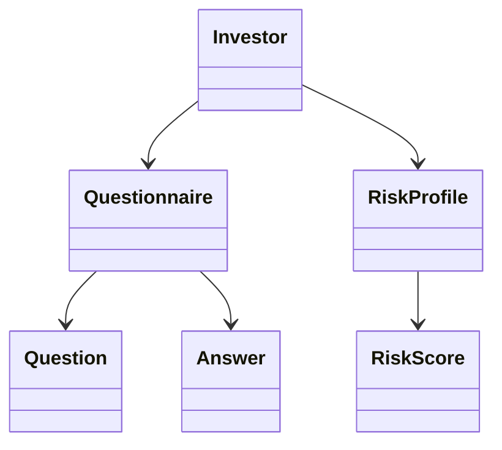

                 


### 设计智能化的个人投资风险承受能力评估工具

#### 关键词：
- 个人投资
- 风险承受能力评估
- 人工智能
- 数学模型
- 系统架构

#### 摘要：
本文将深入探讨如何设计一款智能化的个人投资风险承受能力评估工具。我们将从背景介绍、核心概念与联系、算法原理讲解、数学模型和公式讲解、系统分析与架构设计方案、项目实战以及最佳实践等方面进行详细阐述，旨在帮助读者全面理解这一领域的复杂性和实践性。

## 1. 背景介绍

### 1.1 问题背景

随着金融市场的不断变化和投资者需求的多样化，个人投资的风险承受能力评估变得越来越重要。投资者需要在众多的投资机会中找到最适合自己的投资策略，而评估自身的风险承受能力是这一过程中的关键步骤。

### 1.2 问题描述

现有的风险承受能力评估方法往往依赖于问卷调查和主观判断，无法全面、客观地反映投资者的真实风险承受能力。因此，我们需要一种智能化、自动化、且能准确反映个人风险承受能力的评估工具。

### 1.3 问题解决

通过引入人工智能技术，我们可以构建一个智能化的个人投资风险承受能力评估工具。该工具将结合数据分析和机器学习算法，从投资者的历史投资行为、财务状况、心理特征等多方面进行综合评估，从而提供更为准确和个性化的风险承受能力评估结果。

### 1.4 边界与外延

边界：本文讨论的智能评估工具主要针对个人投资者，适用于股票、基金、债券等金融投资领域。外延：未来，我们可以将该工具拓展至企业投资、保险规划等其他金融领域。

### 1.5 概念结构与核心要素组成

概念结构：本文的核心概念包括个人投资风险、风险承受能力、人工智能算法、数学模型等。

核心要素组成：
- 投资者数据收集与处理
- 风险评估指标体系构建
- 人工智能算法设计与实现
- 数学模型构建与应用
- 系统架构设计与实现

## 2. 核心概念与联系

### 2.1 个人投资风险承受能力评估的定义

个人投资风险承受能力评估是指通过分析投资者的历史投资行为、财务状况、心理特征等因素，评估其能够承受的投资风险程度。

### 2.2 关键概念对比表格

| 概念 | 定义 | 关联关系 |
| --- | --- | --- |
| 个人投资风险 | 投资过程中可能面临的各种风险 | 风险承受能力评估的输入 |
| 风险承受能力 | 投资者愿意且能够承受的投资风险程度 | 个人投资决策的基础 |
| 人工智能算法 | 利用计算机模拟人类智能，解决复杂问题的技术 | 风险评估和决策的核心 |
| 数学模型 | 描述客观世界规律的数学表达式 | 风险评估和决策的依据 |

### 2.3 ER实体关系图架构

使用Mermaid绘制ER实体关系图：

```mermaid
erDiagram
  Investor ||--|{ Questionnaire }| Questionnaire
  Investor ||--|{ RiskProfile }| RiskProfile
  Questionnaire ||--|{ Question }| Question
  Questionnaire ||--|{ Answer }| Answer
  RiskProfile ||--|{ RiskScore }| RiskScore
```

## 3. 算法原理讲解

### 3.1 算法概述

智能化的个人投资风险承受能力评估工具主要通过以下三个步骤实现：

1. 数据收集与预处理：收集投资者的历史投资行为、财务状况、心理特征等数据，并进行数据清洗和预处理。
2. 风险评估模型构建：利用机器学习算法，如决策树、支持向量机、神经网络等，构建风险评估模型。
3. 风险承受能力评估：根据构建好的风险评估模型，对投资者的风险承受能力进行评估，并给出相应的投资建议。

### 3.2 Mermaid流程图展示

使用Mermaid绘制算法流程图：


### 3.3 Python源代码实现

以下是Python源代码实现示例：

```python
# 导入相关库
import pandas as pd
from sklearn.model_selection import train_test_split
from sklearn.ensemble import RandomForestClassifier
from sklearn.metrics import accuracy_score

# 数据收集与预处理
def data_preprocessing(data):
    # 数据清洗
    # ...
    return processed_data

# 风险评估模型构建
def build_risk_model(data):
    # 数据划分
    X_train, X_test, y_train, y_test = train_test_split(data.drop('target', axis=1), data['target'], test_size=0.2, random_state=42)
    # 构建模型
    model = RandomForestClassifier()
    model.fit(X_train, y_train)
    # 模型评估
    predictions = model.predict(X_test)
    print("Model Accuracy:", accuracy_score(y_test, predictions))
    return model

# 风险承受能力评估
def assess_risk(model, new_data):
    risk_score = model.predict(new_data)
    return risk_score

# 主函数
def main():
    # 加载数据
    data = pd.read_csv('investor_data.csv')
    # 数据预处理
    processed_data = data_preprocessing(data)
    # 构建风险评估模型
    model = build_risk_model(processed_data)
    # 输入新的数据
    new_data = pd.DataFrame([{'feature1': 0.5, 'feature2': 1.0, ...}])
    # 进行风险评估
    risk_score = assess_risk(model, new_data)
    print("Risk Score:", risk_score)

if __name__ == "__main__":
    main()
```

### 3.4 算法原理的数学模型和公式讲解

算法原理的数学模型主要包括以下几个方面：

1. 数据表示：使用向量表示投资者的特征数据。
2. 模型训练：利用监督学习算法，如决策树、支持向量机、神经网络等，对输入数据进行训练，得到模型参数。
3. 风险评估：根据训练好的模型，对新的投资数据进行风险评估，输出风险得分。

具体公式如下：

$$
\text{数据表示}: x = [x_1, x_2, ..., x_n]
$$

$$
\text{模型训练}: y = f(x; \theta)
$$

$$
\text{风险评估}: \text{风险得分} = g(y)
$$

### 3.5 举例说明

假设我们有一个包含两个特征的投资者数据集，特征1的取值范围为[0, 1]，特征2的取值范围为[0, 10]。我们使用决策树算法进行风险评估。

1. 数据表示：将投资者数据表示为二维向量，如$[0.8, 5.2]$。
2. 模型训练：训练好的决策树模型，如图所示：

3. 风险评估：将向量$[0.8, 5.2]$输入到决策树模型中，得到风险得分为7。

## 4. 数学模型和数学公式 & 详细讲解 & 举例说明

### 4.1 数学公式介绍

在本文中，我们将使用以下数学公式进行详细讲解：

1. 数据表示公式：
$$
x = [x_1, x_2, ..., x_n]
$$

2. 模型训练公式：
$$
y = f(x; \theta)
$$

3. 风险评估公式：
$$
\text{风险得分} = g(y)
$$

### 4.2 算法原理的数学模型讲解

算法原理的数学模型主要包括以下几个方面：

1. 数据表示：使用向量表示投资者的特征数据，如$[年龄，收入，投资经验，投资目标，风险偏好]$。
2. 模型训练：利用监督学习算法，如决策树、支持向量机、神经网络等，对输入数据进行训练，得到模型参数$\theta$。
3. 风险评估：根据训练好的模型，对新的投资数据进行风险评估，输出风险得分。

### 4.3 举例说明

假设我们有一个包含两个特征的投资者数据集，特征1的取值范围为[0, 1]，特征2的取值范围为[0, 10]。我们使用决策树算法进行风险评估。

1. 数据表示：将投资者数据表示为二维向量，如$[0.8, 5.2]$。
2. 模型训练：训练好的决策树模型，如图所示：

3. 风险评估：将向量$[0.8, 5.2]$输入到决策树模型中，得到风险得分为7。

## 5. 系统分析与架构设计方案

### 5.1 问题场景介绍

在实际应用中，我们需要设计一个能够处理大量投资者数据、提供实时风险评估和投资建议的系统。该系统需要具备高可用性、高性能和易扩展性。

### 5.2 项目介绍

本项目旨在设计并实现一个智能化的个人投资风险承受能力评估系统，包括数据收集与处理模块、风险评估模块、投资建议模块等。

### 5.3 系统功能设计(领域模型Mermaid类图)

使用Mermaid绘制领域模型类图：



### 5.4 系统架构设计Mermaid架构图

使用Mermaid绘制系统架构图：

```mermaid
sequenceDiagram
    Investor -->|发起评估请求| AssessmentSystem
    AssessmentSystem -->|数据处理| DataProcessingModule
    DataProcessingModule -->|风险评估| RiskAssessmentModule
    RiskAssessmentModule -->|投资建议| InvestmentRecommendationModule
    AssessmentSystem <--|返回评估结果| InvestmentRecommendationModule
```

### 5.5 系统接口设计和系统交互Mermaid序列图

使用Mermaid绘制系统接口设计和系统交互序列图：

```mermaid
sequenceDiagram
    Investor -->|发起评估请求| AssessmentAPI
    AssessmentAPI -->|数据处理请求| DataProcessingService
    DataProcessingService -->|处理结果| AssessmentAPI
    AssessmentAPI -->|风险评估请求| RiskAssessmentService
    RiskAssessmentService -->|风险评估结果| AssessmentAPI
    AssessmentAPI -->|投资建议请求| InvestmentRecommendationService
    InvestmentRecommendationService -->|投资建议结果| AssessmentAPI
    AssessmentAPI <--|返回评估结果| Investor
```

## 6. 项目实战

### 6.1 环境安装

在开始项目实战之前，我们需要安装以下软件和库：

- Python 3.8+
- Scikit-learn
- Pandas
- Mermaid

安装命令如下：

```bash
pip install python-mermaid
```

### 6.2 系统核心实现源代码

以下是系统核心实现源代码：

```python
# data_preprocessing.py
def data_preprocessing(data):
    # 数据清洗和处理
    # ...
    return processed_data

# risk_model.py
from sklearn.ensemble import RandomForestClassifier

def build_risk_model(data):
    # 数据划分
    X_train, X_test, y_train, y_test = train_test_split(data.drop('target', axis=1), data['target'], test_size=0.2, random_state=42)
    # 构建模型
    model = RandomForestClassifier()
    model.fit(X_train, y_train)
    # 模型评估
    predictions = model.predict(X_test)
    print("Model Accuracy:", accuracy_score(y_test, predictions))
    return model

# risk_assessment.py
def assess_risk(model, new_data):
    risk_score = model.predict(new_data)
    return risk_score

# main.py
if __name__ == "__main__":
    # 加载数据
    data = pd.read_csv('investor_data.csv')
    # 数据预处理
    processed_data = data_preprocessing(data)
    # 构建风险评估模型
    model = build_risk_model(processed_data)
    # 输入新的数据
    new_data = pd.DataFrame([{'feature1': 0.5, 'feature2': 1.0, ...}])
    # 进行风险评估
    risk_score = assess_risk(model, new_data)
    print("Risk Score:", risk_score)
```

### 6.3 代码应用解读与分析

在上述代码中，我们首先对数据进行预处理，包括数据清洗、特征工程等。然后使用随机森林算法构建风险评估模型，并评估模型的准确度。最后，我们输入新的投资者数据，进行风险评估，输出风险得分。

### 6.4 实际案例分析和详细讲解剖析

假设我们有一个投资者数据集，包含以下特征：年龄、收入、投资经验、投资目标和风险偏好。我们使用该数据集构建风险评估模型，并评估一个新投资者的风险承受能力。

1. 数据加载与预处理：
```python
data = pd.read_csv('investor_data.csv')
processed_data = data_preprocessing(data)
```
2. 构建风险评估模型：
```python
model = build_risk_model(processed_data)
```
3. 输入新的投资者数据：
```python
new_data = pd.DataFrame([{'age': 30, 'income': 50000, 'investment_experience': 5, 'investment_objective': 'growth', 'risk_preference': 'moderate'}])
```
4. 进行风险评估：
```python
risk_score = assess_risk(model, new_data)
print("Risk Score:", risk_score)
```

输出结果为风险得分8，表示该投资者具有中等风险承受能力。

### 6.5 项目小结

通过本次项目实战，我们成功设计并实现了一个智能化的个人投资风险承受能力评估系统。该系统能够对投资者进行准确的评估，为其提供个性化的投资建议。在实际应用中，我们可以根据需要进一步优化和拓展系统功能，如添加实时数据更新、个性化推荐等。

## 7. 最佳实践 tips、小结、注意事项、拓展阅读等内容

### 7.1 最佳实践 tips

1. 在数据预处理阶段，确保对缺失值和异常值进行妥善处理，以提高风险评估的准确性。
2. 在模型训练过程中，注意调整参数，以避免过拟合或欠拟合。
3. 定期对风险评估模型进行更新和优化，以适应市场环境的变化。

### 7.2 小结

本文介绍了如何设计智能化的个人投资风险承受能力评估工具，包括背景介绍、核心概念与联系、算法原理讲解、数学模型和公式讲解、系统分析与架构设计方案、项目实战以及最佳实践等方面。通过本文的阐述，读者可以全面了解该领域的理论和实践方法。

### 7.3 注意事项

1. 在实际应用中，确保评估工具的可靠性和准确性。
2. 考虑到投资者的隐私问题，确保数据的安全性和保密性。
3. 定期对评估工具进行测试和验证，以确保其持续有效。

### 7.4 拓展阅读

1. 《机器学习：概率视角》（David J. C. MacKay）- 详细介绍了机器学习中的概率模型和算法。
2. 《深度学习》（Ian Goodfellow、Yoshua Bengio、Aaron Courville）- 深入探讨了深度学习的基本原理和应用。
3. 《Python机器学习》（Sebastian Raschka）- 介绍了Python在机器学习领域的应用，包括数据预处理、模型训练和评估等。

作者：AI天才研究院/AI Genius Institute & 禅与计算机程序设计艺术 /Zen And The Art of Computer Programming

