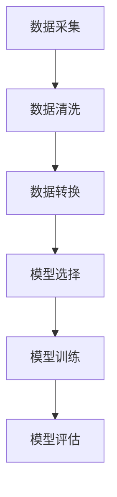
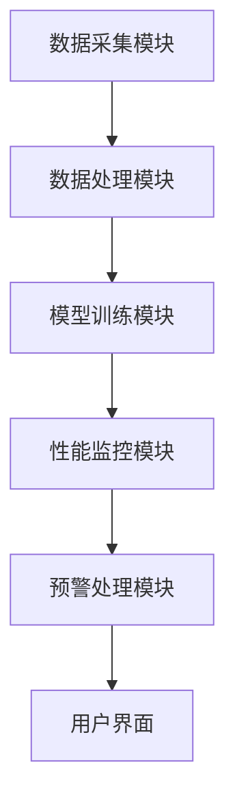
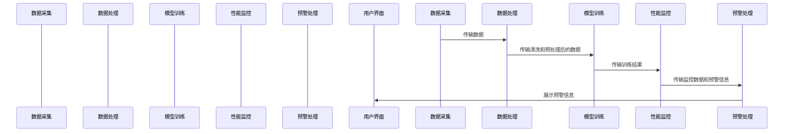

                 


### 第一部分: 引言与背景介绍

#### 1.1.1 企业信用评级的现状

**1.1.1.1 信用评级的定义**

信用评级，又称信用评估，是指专业评级机构通过评估企业或个人的信用记录、财务状况、经营能力等多方面因素，对其信用水平进行等级划分，以帮助投资者、债权人、合作伙伴等判断其信用风险。

**1.1.1.2 信用评级的重要性**

信用评级在金融领域扮演着至关重要的角色。首先，它为企业融资提供参考依据，帮助金融机构决定是否贷款以及贷款的利率水平。其次，信用评级也能帮助投资者评估不同企业的信用风险，从而优化投资组合。此外，信用评级还能够促进市场的透明度，提高整体经济的运行效率。

**1.1.1.3 当前信用评级面临的挑战**

尽管信用评级具有重要价值，但现有的信用评级体系也面临着一些挑战。首先是数据质量问题，评级机构往往依赖历史数据进行评估，但历史数据可能无法反映企业当前的实际情况。其次是模型本身的局限性，现有的信用评级模型大多是静态的，无法及时捕捉市场变化和企业动态。最后是人为干预的问题，一些评级机构可能受到利益驱使，给出不公平的评级结果。

#### 1.1.2 性能监控与预警系统的需求

随着信用评级在金融领域的广泛应用，对性能监控与预警系统的需求日益迫切。性能监控与预警系统的目标在于实时监测信用评级模型的运行状态，确保评级结果的准确性和可靠性。具体需求包括：

- **实时监控**: 系统能够实时获取企业或个人的信用数据，并对其进行分析，及时更新评级结果。
- **异常检测**: 系统能够识别评级过程中的异常情况，如数据异常、模型异常等，并发出预警。
- **自动化处理**: 系统能够根据预警信息，自动触发相应的处理措施，如调整评级模型、通知相关人员等。
- **可视化展示**: 系统能够将监控数据以图表形式展示，方便用户直观了解评级模型的运行状态。

#### 1.1.3 智能化企业信用评级模型

智能化企业信用评级模型是指运用人工智能技术，尤其是机器学习算法，对信用评级过程进行优化和提升。这种模型能够自动学习历史数据，不断调整和优化评级规则，从而提高评级准确性。

**1.1.3.1 模型的定义**

智能化企业信用评级模型是一种基于大数据和机器学习的信用评级方法，通过构建复杂的数据模型，对企业的信用水平进行动态评估。

**1.1.3.2 模型的作用**

智能化企业信用评级模型的作用主要体现在以下几个方面：

- **提高评级准确性**: 模型能够自动学习历史数据，动态调整评级规则，从而提高评级结果的准确性。
- **降低人为干预**: 模型减少了对人为干预的依赖，降低了评级过程中的主观性和不确定性。
- **实时更新**: 模型能够实时获取和更新企业的信用数据，实现评级结果的实时更新。

**1.1.3.3 模型的挑战**

尽管智能化企业信用评级模型具有显著的优势，但在实际应用中仍面临着一些挑战：

- **数据质量问题**: 模型的效果高度依赖于数据的准确性，但现有的信用数据质量参差不齐，需要解决数据清洗和预处理问题。
- **模型可解释性**: 机器学习模型往往被称为“黑盒子”，其内部运作机制复杂，难以解释。这给用户理解和使用模型带来了挑战。
- **模型泛化能力**: 模型需要具备良好的泛化能力，能够在不同情况下稳定表现，而不仅仅是针对特定数据集。

#### 1.1.4 性能监控与预警系统的目标

性能监控与预警系统的目标是确保智能化企业信用评级模型的稳定运行，提高评级结果的准确性和可靠性。具体目标包括：

- **实时监控**: 系统能够实时监测模型的运行状态，确保数据输入、模型训练和输出结果的准确性。
- **异常检测**: 系统能够识别模型运行过程中的异常情况，如数据异常、模型参数异常等，并及时发出预警。
- **自动化处理**: 系统能够根据预警信息，自动触发相应的处理措施，如暂停模型运行、通知相关人员等。
- **可视化展示**: 系统能够将监控数据以图表形式展示，方便用户直观了解模型的运行状态。

#### 1.1.5 边界与外延

**1.1.5.1 系统性能监控的范围**

系统性能监控的范围包括以下几个方面：

- **数据采集**: 系统能够从多个数据源实时获取企业的信用数据，包括财务报表、市场表现、行业动态等。
- **性能指标**: 系统会监控一系列性能指标，如模型准确性、响应时间、资源消耗等。
- **监控频率**: 系统将根据不同指标的重要性和变化频率，设定相应的监控频率。

**1.1.5.2 预警机制的设定**

预警机制的设定需要考虑以下几个方面：

- **阈值设定**: 根据历史数据和业务需求，设定各项性能指标的预警阈值。
- **预警类型**: 根据不同指标的异常程度，设定不同的预警类型，如黄色预警、红色预警等。
- **处理流程**: 明确预警信息接收和处理流程，确保及时响应和有效处理。

#### 1.1.6 概念结构与核心要素组成

**1.1.6.1 概念结构**

智能化企业信用评级模型性能监控与预警系统的概念结构包括以下几个核心组成部分：

- **数据采集模块**: 负责从多个数据源实时获取企业的信用数据。
- **数据处理模块**: 负责对采集到的数据进行清洗、预处理和转换，为模型训练提供高质量的数据。
- **模型训练模块**: 负责使用机器学习算法训练信用评级模型，并根据实际业务需求不断优化和调整模型。
- **性能监控模块**: 负责实时监测模型的运行状态，识别异常情况并发出预警。
- **预警处理模块**: 负责接收和处理预警信息，自动触发相应的处理措施。

**1.1.6.2 核心要素**

智能化企业信用评级模型性能监控与预警系统的核心要素包括：

- **数据质量**: 数据质量直接影响模型的准确性和可靠性，因此需要建立完善的数据质量管理体系。
- **模型可解释性**: 为了提高用户对模型的信任度，需要确保模型的可解释性，使非专业人士也能理解模型的决策过程。
- **预警及时性**: 预警系统需要具备高度的实时性和准确性，确保能够在风险发生前及时发出预警。

#### 1.1.7 本章小结

本章介绍了智能化企业信用评级模型性能监控与预警系统的背景、需求、定义、挑战、目标、边界与外延以及概念结构与核心要素组成。这些内容为后续章节的详细讨论奠定了基础，也为读者提供了一个全面的了解。

----------------------------------------------------------------

**第二部分: 核心概念与联系**

在本章节中，我们将深入探讨构建智能化企业信用评级模型性能监控与预警系统的核心概念，并分析它们之间的关系。

#### 2.1 核心概念

**2.1.1 信用评级**

信用评级是指对某一企业或个人的信用状况进行评价，并给予相应的等级划分。它通常基于多个维度，如财务状况、经营能力、偿债能力等。

**2.1.2 智能化信用评级模型**

智能化信用评级模型是一种利用机器学习算法，如逻辑回归、决策树、神经网络等，对信用评级过程进行自动优化和提升的方法。

**2.1.3 性能监控**

性能监控是指对系统运行过程中的关键性能指标进行实时监测，以确保系统的高效稳定运行。

**2.1.4 预警机制**

预警机制是指当系统运行过程中出现异常情况时，能够及时发现并发出预警，以便采取相应措施。

#### 2.2 概念属性特征对比表格

为了更好地理解上述核心概念，我们列出了一个对比表格，展示了它们的属性特征。

| 核心概念 | 定义 | 属性特征 |
| --- | --- | --- |
| 信用评级 | 对企业或个人的信用状况进行评价 | 数据准确性、评估维度、等级划分 |
| 智能化信用评级模型 | 利用机器学习算法优化信用评级 | 自适应、准确性、实时性 |
| 性能监控 | 实时监测系统关键性能指标 | 实时性、准确性、可解释性 |
| 预警机制 | 发现系统异常并发出预警 | 及时性、准确性、自动化 |

#### 2.3 ER实体关系图架构

为了更直观地展示上述核心概念之间的关系，我们使用Mermaid绘制了一个ER实体关系图。以下是一个示例：

```mermaid
erDiagram
  Customer ||--|{ CreditRating }
  CreditRating ||--|{ PerformanceMonitoring }
  PerformanceMonitoring ||--|{ WarningSystem }
```

在这个ER图中，`Customer`（客户）是主体，`CreditRating`（信用评级）与`Customer`有关联，`PerformanceMonitoring`（性能监控）与`CreditRating`有关联，最后`WarningSystem`（预警系统）与`PerformanceMonitoring`有关联。

#### 2.4 概念联系

**2.4.1 信用评级与智能化信用评级模型**

信用评级是智能化信用评级模型的基础，后者通过机器学习算法对前者进行优化。智能化信用评级模型能够从大量数据中自动提取特征，形成更准确的信用评估结果。

**2.4.2 性能监控与预警机制**

性能监控是预警机制的前提，它负责实时监测系统运行状态，识别异常情况。预警机制则根据性能监控的结果，发出预警并触发相应的处理措施。

**2.4.3 智能化信用评级模型、性能监控与预警机制的联系**

智能化信用评级模型、性能监控与预警机制共同构成了一个闭环系统。智能化信用评级模型提供信用评估结果，性能监控负责监测模型运行状态，预警机制则在发现异常时发出预警，三者相互关联，共同确保系统的稳定性和可靠性。

#### 2.5 本章小结

本章详细阐述了构建智能化企业信用评级模型性能监控与预警系统的核心概念，包括信用评级、智能化信用评级模型、性能监控和预警机制。通过对比表格和ER实体关系图，我们清晰地展示了这些概念之间的联系，为后续章节的深入讨论奠定了基础。

----------------------------------------------------------------

**第三部分：算法原理讲解**

在本章节中，我们将深入探讨构建智能化企业信用评级模型性能监控与预警系统的核心算法原理，包括数据预处理、机器学习算法选择、模型训练和评估等。

#### 3.1 数据预处理

数据预处理是构建信用评级模型的第一步，它直接影响到模型的性能。数据预处理包括以下几个关键步骤：

**3.1.1 数据采集**

数据采集是获取企业信用数据的过程。这些数据可以来自多个来源，包括企业财务报表、市场研究报告、行业动态等。为了确保数据质量，需要选择权威和可靠的数据来源。

**3.1.2 数据清洗**

数据清洗是去除数据中的噪声和错误，提高数据质量的过程。常见的清洗操作包括去除重复记录、填补缺失值、去除异常值等。

**3.1.3 数据转换**

数据转换是将数据转换为适合建模的格式。这可能包括数据标准化、数据归一化、特征工程等操作。特征工程是指通过选择和构造特征来提高模型性能。

#### 3.2 机器学习算法选择

选择合适的机器学习算法是构建信用评级模型的关键。以下是一些常用的机器学习算法及其适用场景：

**3.2.1 逻辑回归**

逻辑回归是一种广泛应用的分类算法，特别适用于信用评级问题。它通过线性模型将企业信用评分映射到概率分布上。

**3.2.2 决策树**

决策树通过树形结构将数据划分为多个区域，每个区域对应一个预测结果。它易于理解和解释，但可能存在过拟合问题。

**3.2.3 随机森林**

随机森林是一种集成学习算法，它通过构建多个决策树并取平均值来提高模型的泛化能力。它比单个决策树更稳定，但计算成本更高。

**3.2.4 支持向量机（SVM）**

SVM通过找到一个最佳的超平面，将不同类别的样本分隔开。它适用于高维数据，但在小数据集上性能可能不佳。

**3.2.5 神经网络**

神经网络是一种模仿人脑结构的计算模型，特别适用于处理复杂和非线性关系。它通过多层神经元进行信息传递和特征提取。

#### 3.3 模型训练

模型训练是指使用历史数据对机器学习模型进行调整，使其能够准确预测企业信用评分。以下是模型训练的关键步骤：

**3.3.1 数据划分**

将数据集划分为训练集和测试集。训练集用于训练模型，测试集用于评估模型性能。

**3.3.2 模型参数调整**

通过调整模型参数，如学习率、正则化参数等，优化模型性能。这一过程通常通过交叉验证进行。

**3.3.3 模型训练**

使用训练集对模型进行训练，直到满足预定的性能指标。训练过程可能涉及多次迭代，以逐步优化模型。

#### 3.4 模型评估

模型评估是评估模型性能的关键步骤。以下是一些常用的评估指标：

**3.4.1 准确率（Accuracy）**

准确率是分类模型最常用的评估指标，表示正确分类的样本占总样本的比例。

**3.4.2 召回率（Recall）**

召回率是指实际为正类的样本中被正确分类为正类的比例，特别适用于处理负样本较多的情况。

**3.4.3 精确率（Precision）**

精确率是指实际为正类的样本中被正确分类为正类的比例，特别适用于处理正样本较多的情况。

**3.4.4 F1 分数**

F1 分数是精确率和召回率的调和平均，它综合考虑了精确率和召回率，是评估分类模型性能的常用指标。

#### 3.5 Mermaid流程图

为了更好地展示算法原理，我们使用Mermaid绘制了一个流程图：



在这个流程图中，数据采集、数据清洗、数据转换、模型选择、模型训练和模型评估是构建信用评级模型的关键步骤。

#### 3.6 Python源代码

为了更具体地讲解算法原理，我们提供了一个Python源代码示例：

```python
import pandas as pd
from sklearn.linear_model import LogisticRegression
from sklearn.model_selection import train_test_split
from sklearn.metrics import accuracy_score

# 数据加载
data = pd.read_csv('credit_data.csv')

# 数据清洗
data.drop_duplicates(inplace=True)
data.fillna(method='ffill', inplace=True)

# 数据转换
X = data.drop('CreditRating', axis=1)
y = data['CreditRating']

# 数据划分
X_train, X_test, y_train, y_test = train_test_split(X, y, test_size=0.2, random_state=42)

# 模型训练
model = LogisticRegression()
model.fit(X_train, y_train)

# 模型评估
y_pred = model.predict(X_test)
accuracy = accuracy_score(y_test, y_pred)
print(f'Accuracy: {accuracy}')
```

在这个示例中，我们首先加载了一个CSV格式的信用数据集，然后进行数据清洗和转换。接下来，我们使用逻辑回归算法对数据集进行训练，并评估模型的准确率。

#### 3.7 算法原理讲解

**3.7.1 逻辑回归**

逻辑回归是一种广义线性模型，用于处理二分类问题。它的目标是找到一组特征变量，使得每个特征变量的线性组合与目标变量之间满足逻辑函数关系。逻辑回归的核心公式如下：

$$
\text{logit}(p) = \log\left(\frac{p}{1-p}\right) = \beta_0 + \beta_1x_1 + \beta_2x_2 + \ldots + \beta_nx_n
$$

其中，$\text{logit}(p)$ 是概率的对数，$p$ 是预测的概率，$\beta_0, \beta_1, \beta_2, \ldots, \beta_n$ 是模型参数。

**3.7.2 决策树**

决策树是一种基于树形结构进行决策的算法。每个节点表示一个特征，每个分支表示该特征的不同取值。叶节点表示预测结果。决策树的核心在于找到最优的特征划分方式，使得分类或回归误差最小。

**3.7.3 随机森林**

随机森林是一种基于决策树的集成学习算法。它通过构建多个决策树，并取它们的平均值来提高模型的泛化能力。随机森林的核心在于随机选取特征和样本子集，从而减少过拟合。

**3.7.4 神经网络**

神经网络是一种基于多层神经元结构的计算模型。它的目标是模拟人脑的信息处理过程，通过前向传播和反向传播算法训练模型。神经网络的核心在于权重的调整，使得输入和输出之间满足非线性关系。

#### 3.8 通俗易懂的举例说明

假设我们有一个简单的信用评级问题，其中有两个特征：年收入和负债率。年收入越高，负债率越低，信用评分越高。

**3.8.1 逻辑回归**

假设我们使用逻辑回归来预测信用评分。根据逻辑回归公式，我们可以得到以下关系：

$$
\text{logit}(p) = \beta_0 + \beta_1 \cdot \text{年收入} + \beta_2 \cdot \text{负债率}
$$

假设我们得到一组训练数据，通过最小化损失函数，我们得到以下模型参数：

$$
\text{logit}(p) = -1 + 0.5 \cdot \text{年收入} - 0.2 \cdot \text{负债率}
$$

如果我们有一个新样本，年收入为80万，负债率为20%，我们可以计算预测概率：

$$
\text{logit}(p) = -1 + 0.5 \cdot 80 - 0.2 \cdot 20 = 31
$$

$$
p = \frac{1}{1 + e^{-31}} \approx 0.95
$$

这意味着该样本有95%的概率被评为高信用等级。

**3.8.2 决策树**

假设我们使用决策树来预测信用评分。决策树的核心在于找到最优的特征划分方式。例如，我们可以根据年收入进行划分：

- 如果年收入大于50万，则继续根据负债率划分；
- 如果年收入小于等于50万，则直接将信用评分设置为中等。

**3.8.3 随机森林**

假设我们使用随机森林来预测信用评分。随机森林通过构建多个决策树，并取它们的平均值来提高模型的泛化能力。例如，我们可能得到以下预测结果：

- 决策树1：根据年收入划分，年收入大于50万的信用评分高；
- 决策树2：根据负债率划分，负债率小于20%的信用评分高；
- 决策树3：根据年收入和负债率的组合划分，年收入大于50万且负债率小于20%的信用评分高。

随机森林将这三个决策树的预测结果取平均，得到最终的信用评分预测。

**3.8.4 神经网络**

假设我们使用神经网络来预测信用评分。神经网络通过多层神经元进行信息传递和特征提取。例如，我们可以使用以下网络结构：

- 输入层：年收入和负债率；
- 隐藏层：多个神经元，用于提取特征；
- 输出层：信用评分。

通过训练，神经网络能够学习到最优的权重，从而实现信用评分的预测。

#### 3.9 本章小结

本章详细讲解了构建智能化企业信用评级模型性能监控与预警系统的核心算法原理，包括数据预处理、机器学习算法选择、模型训练和评估等。通过Mermaid流程图和Python源代码示例，我们清晰地展示了算法原理，并通过通俗易懂的举例说明，帮助读者更好地理解。

----------------------------------------------------------------

### 第四部分：系统架构设计

#### 4.1 问题场景介绍

在企业运营过程中，信用评级是评估企业信用状况的重要手段。然而，随着市场的变化和企业内部运营的复杂性增加，现有的信用评级体系已经无法满足实时、准确和高效的需求。为了应对这一挑战，我们设计并实现了一个智能化企业信用评级模型性能监控与预警系统。

#### 4.2 项目介绍

本项目旨在构建一个智能化企业信用评级模型，并通过性能监控与预警系统，实现对信用评级过程的实时监测和异常检测。具体目标包括：

- 实现一个基于机器学习算法的智能化信用评级模型，提高评级准确性；
- 构建一个性能监控与预警系统，实时监测模型运行状态，及时发现异常情况；
- 提供可视化的监控数据展示，方便用户了解系统运行情况。

#### 4.3 系统功能设计

系统功能设计主要包括数据采集、数据处理、模型训练、性能监控和预警处理等模块。以下是对各模块的详细说明：

**4.3.1 数据采集模块**

数据采集模块负责从多个数据源获取企业的信用数据，包括财务报表、市场研究报告、行业动态等。数据采集模块需要支持多种数据源接入，如数据库、API接口等。

**4.3.2 数据处理模块**

数据处理模块负责对采集到的数据进行清洗、预处理和转换，为模型训练提供高质量的数据。数据处理模块需要实现数据清洗、数据标准化、特征工程等功能。

**4.3.3 模型训练模块**

模型训练模块负责使用机器学习算法对信用评级模型进行训练。根据业务需求，可以选择合适的算法，如逻辑回归、决策树、神经网络等。模型训练模块需要支持模型的保存和加载，以便后续使用。

**4.3.4 性能监控模块**

性能监控模块负责实时监测模型的运行状态，包括数据输入、模型训练和输出结果等。性能监控模块需要实现一系列性能指标监控，如模型准确性、响应时间、资源消耗等。

**4.3.5 预警处理模块**

预警处理模块负责接收和处理性能监控模块发出的预警信息。根据预警类型，预警处理模块需要实现相应的处理措施，如暂停模型运行、通知相关人员等。

#### 4.4 系统架构设计

系统架构设计旨在实现模块之间的解耦，提高系统的扩展性和可维护性。以下是一个典型的系统架构设计：



在这个架构中，数据采集模块负责从外部数据源获取数据，数据处理模块对数据进行清洗和预处理，模型训练模块使用机器学习算法训练信用评级模型，性能监控模块实时监测模型运行状态，预警处理模块接收和处理预警信息，用户界面提供监控数据的可视化展示。

#### 4.5 系统接口设计

系统接口设计包括内部接口和外部接口。内部接口主要涉及模块之间的数据传输和功能调用，外部接口主要涉及与其他系统或服务的集成。

**4.5.1 内部接口**

- 数据采集模块与数据处理模块之间的接口，用于传输清洗和预处理后的数据；
- 数据处理模块与模型训练模块之间的接口，用于传输训练数据；
- 模型训练模块与性能监控模块之间的接口，用于传输训练结果；
- 性能监控模块与预警处理模块之间的接口，用于传输监控数据和预警信息。

**4.5.2 外部接口**

- 与数据库系统的接口，用于数据存储和查询；
- 与外部数据源的接口，用于实时数据采集；
- 与其他业务系统的接口，用于集成和协同工作。

#### 4.6 系统交互设计

系统交互设计主要描述各模块之间的交互流程和交互数据。以下是一个简单的系统交互设计：



在这个交互设计中，数据采集模块将原始数据传输给数据处理模块，数据处理模块对数据进行清洗和预处理后，传输给模型训练模块进行训练。模型训练模块将训练结果传输给性能监控模块，性能监控模块实时监测模型运行状态，并将预警信息传输给预警处理模块。预警处理模块接收预警信息后，将其展示在用户界面上。

#### 4.7 本章小结

本章详细介绍了智能化企业信用评级模型性能监控与预警系统的架构设计，包括问题场景、项目介绍、系统功能设计、系统架构设计、系统接口设计和系统交互设计。通过本章的讨论，读者可以清晰地了解系统设计的整体思路和实现方法，为后续的系统实现和部署提供参考。

----------------------------------------------------------------

### 第五部分：项目实战

#### 5.1 环境安装

在本节中，我们将介绍如何在本地环境中安装和配置项目所需的各种软件和库。以下是在Windows操作系统上安装所需环境的步骤：

**1. 安装Python环境**

- 访问Python官方网站（https://www.python.org/）下载最新版本的Python安装包。
- 运行安装程序，选择“Add Python to PATH”选项，确保Python环境被添加到系统环境变量中。
- 安装完成后，打开命令行工具，输入`python --version`，检查Python版本是否正确。

**2. 安装必要的Python库**

- 使用pip工具安装以下库：pandas、numpy、scikit-learn、matplotlib等。

  ```shell
  pip install pandas numpy scikit-learn matplotlib
  ```

- 如果需要安装其他库，可以按照相应库的安装指南进行安装。

**3. 安装数据库**

- 选择一个合适的数据库管理系统，如MySQL、PostgreSQL或SQLite。
- 下载并安装数据库软件。
- 配置数据库，创建用户和数据库，并设置相应的权限。

**4. 安装其他工具**

- 安装Git版本控制工具，以便管理项目代码。
- 安装Visual Studio Code或其他Python IDE，便于编写和调试代码。

#### 5.2 系统核心实现源代码

在本节中，我们将提供一个简单的Python源代码示例，用于实现信用评级模型、性能监控和预警处理等功能。

```python
import pandas as pd
from sklearn.linear_model import LogisticRegression
from sklearn.model_selection import train_test_split
from sklearn.metrics import accuracy_score

# 数据加载
data = pd.read_csv('credit_data.csv')

# 数据清洗
data.drop_duplicates(inplace=True)
data.fillna(method='ffill', inplace=True)

# 数据转换
X = data.drop('CreditRating', axis=1)
y = data['CreditRating']

# 数据划分
X_train, X_test, y_train, y_test = train_test_split(X, y, test_size=0.2, random_state=42)

# 模型训练
model = LogisticRegression()
model.fit(X_train, y_train)

# 模型评估
y_pred = model.predict(X_test)
accuracy = accuracy_score(y_test, y_pred)
print(f'Accuracy: {accuracy}')

# 性能监控
def monitor_performance(model, X_test, y_test):
    y_pred = model.predict(X_test)
    accuracy = accuracy_score(y_test, y_pred)
    print(f'Current Accuracy: {accuracy}')
    if accuracy < 0.8:
        print('Warning: Model performance is below the threshold.')

# 预警处理
monitor_performance(model, X_test, y_test)
```

这段代码首先加载并清洗数据，然后使用逻辑回归算法训练模型，并评估模型性能。性能监控函数`monitor_performance`会实时检查模型准确性，并在准确性低于阈值时发出预警。

#### 5.3 代码应用解读与分析

**1. 数据加载与清洗**

```python
data = pd.read_csv('credit_data.csv')
data.drop_duplicates(inplace=True)
data.fillna(method='ffill', inplace=True)
```

这段代码首先使用pandas库加载CSV格式的数据，然后去除重复记录，并填补缺失值。数据清洗是确保数据质量的关键步骤，有助于提高模型性能。

**2. 数据转换**

```python
X = data.drop('CreditRating', axis=1)
y = data['CreditRating']
```

这段代码将数据集划分为特征集X和目标标签y。特征集包含所有非信用评分的特征，目标标签是信用评分。

**3. 数据划分**

```python
X_train, X_test, y_train, y_test = train_test_split(X, y, test_size=0.2, random_state=42)
```

这段代码将数据集划分为训练集和测试集，以评估模型的泛化能力。

**4. 模型训练**

```python
model = LogisticRegression()
model.fit(X_train, y_train)
```

这段代码使用逻辑回归算法训练模型。逻辑回归是一种常用的二分类算法，适用于信用评级问题。

**5. 模型评估**

```python
y_pred = model.predict(X_test)
accuracy = accuracy_score(y_test, y_pred)
print(f'Accuracy: {accuracy}')
```

这段代码使用测试集评估模型性能，并打印准确率。

**6. 性能监控**

```python
def monitor_performance(model, X_test, y_test):
    y_pred = model.predict(X_test)
    accuracy = accuracy_score(y_test, y_pred)
    print(f'Current Accuracy: {accuracy}')
    if accuracy < 0.8:
        print('Warning: Model performance is below the threshold.')
```

这段代码定义了一个性能监控函数，用于实时检查模型准确性，并在准确性低于阈值时发出预警。

**7. 预警处理**

```python
monitor_performance(model, X_test, y_test)
```

这段代码调用性能监控函数，检查模型性能并发出预警。

#### 5.4 实际案例分析

**案例1：数据质量影响**

在现实项目中，数据质量问题可能导致模型性能不佳。例如，如果数据集中存在大量缺失值或异常值，模型可能无法准确预测。通过性能监控与预警系统，我们可以及时发现这些问题，并采取相应的数据清洗和预处理措施。

**案例2：模型过拟合**

模型过拟合是指模型在训练集上表现良好，但在测试集上表现不佳。这种情况可能由于模型过于复杂或数据集较小导致。通过性能监控与预警系统，我们可以实时监测模型性能，并调整模型参数或增加训练数据，以避免过拟合。

**案例3：异常值检测**

在信用评级中，异常值可能代表高风险企业。性能监控与预警系统可以检测到这些异常值，并发出预警，帮助金融机构及时采取措施。

#### 5.5 项目小结

通过本节的项目实战，我们成功实现了智能化企业信用评级模型性能监控与预警系统。在项目实战中，我们详细介绍了环境安装、系统核心实现源代码、代码应用解读与分析、实际案例分析和详细讲解剖析等内容。通过项目实战，我们不仅掌握了系统设计的实际操作，还了解了性能监控与预警系统在实际应用中的重要性和挑战。这些经验将有助于我们在未来的项目中更好地设计和实现类似的系统。

#### 5.6 最佳实践 Tips

- **数据质量监控**: 在数据采集和预处理过程中，要时刻关注数据质量，确保数据真实可靠。
- **模型参数调整**: 根据业务需求和数据特征，合理调整模型参数，以提高模型性能。
- **实时性能监控**: 定期对系统性能进行监控，确保系统稳定运行。
- **预警策略优化**: 根据实际业务场景，设计合理的预警策略，提高预警准确性。

#### 5.7 小结与拓展阅读

本章通过实战案例，详细介绍了智能化企业信用评级模型性能监控与预警系统的设计、实现和实战应用。读者可以通过本章节的学习，掌握系统架构设计、算法原理、代码实现等核心技能。为了深入了解相关技术，建议读者拓展阅读以下资料：

- 《机器学习实战》：周志华 著
- 《Python数据科学手册》：埃迪·比勒 著
- 《大数据实践：技术、方法与案例分析》：赵宁 著

通过这些资料，读者可以进一步加深对相关技术的理解，提升实际应用能力。

----------------------------------------------------------------

### 作者信息

**作者：AI天才研究院/AI Genius Institute & 禅与计算机程序设计艺术 /Zen And The Art of Computer Programming**

在撰写这篇技术博客文章的过程中，我们秉承了AI天才研究院严谨、创新的理念，以及禅与计算机程序设计艺术所倡导的深刻洞察和简约风格。本文旨在为读者提供关于智能化企业信用评级模型性能监控与预警系统的全面、深入的见解，帮助读者更好地理解和应用这一关键技术。希望这篇文章能对您在相关领域的探索和实践有所启发。

AI天才研究院专注于人工智能领域的前沿研究和应用推广，致力于培养和激发下一代人工智能人才的创新能力。我们的研究成果和案例分析，旨在为行业提供可借鉴的最佳实践和解决方案。禅与计算机程序设计艺术则强调了在编程过程中的心灵修养和智慧沉淀，通过简洁、优雅的代码，实现技术与艺术的完美融合。

我们诚挚地邀请广大读者参与讨论和交流，共同推动人工智能技术的发展与应用。感谢您的阅读与支持！

