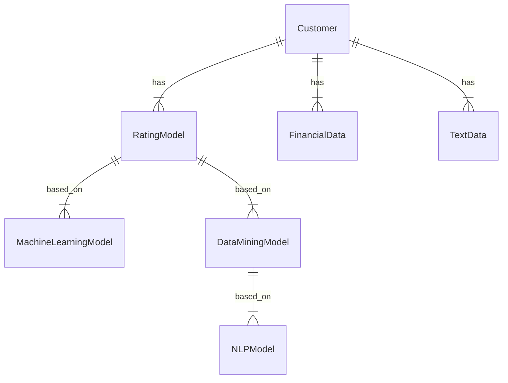

                 

### 设计智能化的企业信用评级模型校准系统的必要性

在当今全球化和数字化的商业环境中，企业信用评级模型已成为金融行业和商业领域的重要工具。信用评级不仅帮助企业获取资金、投资和合作伙伴，而且对风险管理、投资决策和商业策略有着深远的影响。然而，传统的信用评级模型在处理复杂性日益增加的商业环境时，面临着诸多挑战。为了提升信用评级的准确性和可靠性，设计智能化企业信用评级模型校准系统变得尤为必要。

首先，传统信用评级模型通常基于静态数据和简单的统计方法，无法充分反映企业动态经营环境和市场变化带来的影响。随着商业环境的不确定性和复杂性增加，这种静态的评级方法越来越难以满足实际需求。而智能化系统通过利用大数据、机器学习和人工智能技术，可以实时获取和处理大量的动态数据，从而提供更为准确和实时的信用评级。

其次，传统信用评级模型的透明度和可解释性较低，这导致评级结果往往缺乏可信度和透明度。而智能化系统则可以通过构建透明的算法模型和明确的评级逻辑，提高评级过程的透明度，增加用户对评级结果的信任。

再次，智能化系统能够处理多种类型的非结构化数据，如社交媒体信息、新闻报道、市场分析报告等，从而提供更为全面和立体的企业信用评估。这不仅丰富了信用评级的维度，也增强了评级模型的预测能力。

此外，智能化系统可以自动调整评级模型，根据市场变化和企业表现实时更新评级结果，提高评级模型的适应性和灵活性。这种动态调整能力对于应对快速变化的商业环境至关重要。

最后，智能化系统能够通过自动化和智能化的流程，减少人为干预，降低评级误差，提高工作效率。这不仅可以降低成本，还能确保评级过程的客观性和一致性。

综上所述，设计智能化企业信用评级模型校准系统是应对当前信用评级挑战的必然选择。通过智能化技术的引入，可以显著提升信用评级的准确性、透明度和灵活性，为企业、投资者和金融机构提供更有价值的决策支持。

### 关键词

- 企业信用评级模型
- 智能化系统
- 人工智能
- 大数据
- 机器学习
- 校准
- 可解释性
- 实时更新
- 透明度
- 风险管理

### 摘要

本文旨在探讨设计智能化企业信用评级模型校准系统的必要性和重要性。通过对当前信用评级模型的局限性和商业环境变化的挑战进行分析，本文提出引入人工智能、大数据和机器学习技术来构建智能化信用评级模型。本文首先介绍了智能化信用评级模型的基本概念和核心原理，随后详细阐述了数据准备与预处理、算法和模型开发、系统实现与实施、案例研究与应用等关键步骤。文章最后总结了智能化信用评级模型校准系统的优势，并展望了未来的发展方向和研究机会。本文旨在为金融行业和商业领域的专业人士提供有价值的参考，推动信用评级系统向智能化、自动化和透明化的方向发展。

## 引言

### 信用评级系统的基本概念和作用

信用评级系统是指通过对企业或个人信用历史、财务状况、市场表现等多方面信息进行评估，以确定其信用等级的一系列方法和工具。信用评级系统在金融领域和商业环境中扮演着至关重要的角色，其核心作用体现在以下几个方面：

首先，信用评级系统是金融机构进行风险评估和授信决策的重要依据。银行、保险公司和其他金融机构在发放贷款、提供信用担保或进行投资时，会根据信用评级结果来判断借贷者或投资对象的信用风险。高信用评级的企业通常能够以更低的利率获得资金，而低信用评级的企业则需要承担更高的融资成本。因此，信用评级系统不仅影响金融机构的风险管理策略，也直接关系到企业的融资能力和市场竞争力。

其次，信用评级系统为投资者提供决策支持。投资者在投资决策过程中，需要评估投资对象的风险和回报。信用评级结果作为第三方评估机构的权威意见，为投资者提供了可靠的参考依据。高信用评级的企业通常被认为是低风险的优质投资对象，而低信用评级的企业则可能面临更高的投资风险。因此，信用评级系统有助于投资者优化投资组合，降低投资风险。

此外，信用评级系统还为企业自身提供了管理信用风险和提升信用能力的工具。企业可以通过定期监控自身的信用评级结果，及时发现和纠正信用风险问题，采取相应措施提升信用等级。同时，信用评级结果还可以帮助企业制定更科学的财务策略和商业决策，优化资源配置，提高企业运营效率。

总的来说，信用评级系统通过提供全面、客观、透明的信用评估，为金融市场的运行和企业的经营发展提供了有力支持。在现代社会，随着金融市场的不断发展和完善，信用评级系统的应用范围也在不断扩大，其重要性日益凸显。

### 传统信用评级模型的局限性

尽管传统信用评级系统在金融市场中发挥了重要作用，但其局限性也逐渐显现，无法完全适应现代商业环境的需求。以下是传统信用评级模型存在的主要局限性：

首先，数据来源和数据的时效性问题。传统信用评级模型主要依赖企业历史财务报表、信用记录和外部评级数据。然而，这些数据通常是静态的，无法反映企业当前的实际经营状况和市场变化。在快速变化的商业环境中，这些过时的数据可能导致评级结果的滞后和失真，无法提供实时和准确的风险评估。

其次，分析方法单一和主观性强。传统信用评级模型通常采用定量和定性的分析方法，例如财务比率分析、信用评分模型等。这些方法虽然在一定程度上可以反映企业的财务状况和信用风险，但分析方法较为单一，难以充分考虑复杂的市场因素和企业个性特征。此外，由于评级人员的经验和主观判断在评级过程中起到重要作用，这增加了评级的不可重复性和主观偏差，降低了评级结果的稳定性和一致性。

第三，评级模型的透明度和可解释性不足。传统信用评级模型往往缺乏透明的评级逻辑和详细的解释，用户难以理解评级结果的形成过程和依据。这种不透明性不仅降低了评级结果的信任度，也使得企业在面对低信用评级时难以找到改进的方向。

第四，面对非结构化数据的处理能力有限。现代商业环境中，企业面临着大量非结构化数据，如社交媒体信息、新闻报道、市场分析报告等。这些数据蕴含着丰富的信息，但传统信用评级模型难以有效处理这些数据，无法全面评估企业的信用状况。

最后，传统信用评级模型在应对复杂市场环境和不确定因素时，表现出明显的局限性。在金融危机、市场动荡等极端情况下，传统信用评级模型往往无法准确预测和评估企业的信用风险，导致评级结果与实际情况脱节，进而影响金融市场的稳定和健康发展。

综上所述，传统信用评级模型在数据来源、分析方法、透明度、非结构化数据处理能力以及应对复杂市场环境方面存在诸多局限性。因此，设计智能化企业信用评级模型校准系统，以克服这些局限性，已成为当前金融领域的重要课题。

### 人工智能在信用评级中的应用

人工智能（AI）的迅速发展为其在金融领域的应用带来了新的契机，尤其是在企业信用评级领域。通过引入AI技术，可以显著提升信用评级的准确性和实时性，优化评级流程，降低风险。以下是AI技术在信用评级中应用的几个关键方面：

首先，机器学习算法在信用评级中的核心作用。机器学习是一种通过数据训练模型来自动化预测和决策的技术。在信用评级中，机器学习算法能够从大量的历史数据中学习，识别出与企业信用风险相关的模式和特征。通过构建复杂且高度自动化的预测模型，机器学习算法可以在短时间内处理海量数据，提供实时且精确的风险评估。常见的机器学习算法包括逻辑回归、决策树、随机森林、支持向量机、神经网络等，每种算法都有其特定的优势和应用场景。

其次，数据挖掘技术提升评级数据的全面性和深度。数据挖掘是人工智能的一个分支，主要用于从大量数据中提取有价值的信息和知识。在信用评级中，数据挖掘技术可以帮助识别出隐藏在数据背后的模式、趋势和关联关系。通过挖掘企业历史财务数据、信用记录、市场表现以及社交媒体和新闻报道中的非结构化数据，数据挖掘技术能够提供更为全面和立体的信用评估。这不仅增强了信用评级的数据基础，还提高了评级结果的准确性和可靠性。

第三，自然语言处理（NLP）技术在文本数据分析中的应用。自然语言处理是人工智能的一个重要领域，旨在使计算机能够理解、生成和处理人类自然语言。在信用评级中，NLP技术能够有效地处理和分析大量的文本数据，如企业年报、新闻报道、社交媒体评论等。通过提取和分类文本中的关键信息，NLP技术可以帮助评级模型更准确地理解和评估企业的声誉、经营环境和市场状况。

第四，自动化和智能化的评级流程提升工作效率。传统信用评级流程通常繁琐且耗时长，涉及多个环节和人员的参与。通过引入AI技术，许多评级流程可以实现自动化，例如数据采集、预处理、模型训练和预测等。自动化流程不仅提高了工作效率，减少了人为干预，还确保了评级过程的客观性和一致性。此外，智能化的评级系统能够根据市场变化和企业表现实时调整评级模型，提供动态的风险评估。

第五，增强透明度和可解释性。传统信用评级模型由于其复杂性和主观性，往往缺乏透明度和可解释性。而AI技术可以提供详细的模型解释和决策过程，提高评级结果的信任度。通过可视化技术和可解释性分析，用户可以更直观地理解评级结果的形成原因，从而有针对性地改进信用管理策略。

最后，AI技术在信用评级中的应用还有助于降低信用风险。通过实时监测市场变化和企业表现，AI系统能够快速识别潜在的风险信号，提前预警信用风险，帮助企业采取预防措施。此外，AI技术还可以通过分析历史数据和趋势，预测企业的信用变化趋势，为金融机构提供更有针对性的风险控制策略。

综上所述，人工智能技术在信用评级中的应用，不仅解决了传统信用评级模型的诸多局限性，还极大地提升了信用评级的准确性、实时性和透明度。通过结合机器学习、数据挖掘、自然语言处理等AI技术，智能化信用评级系统将为金融行业和商业领域带来深远的影响和变革。

### 核心概念与联系

在设计和实现智能化企业信用评级模型校准系统的过程中，了解和掌握几个核心概念和它们之间的联系是至关重要的。以下是这些核心概念及其属性特征对比和实体关系图架构的详细解释。

#### 一、核心概念

1. **信用评级模型**：信用评级模型是一种用于评估企业信用风险的数学模型。它通常基于历史数据和统计分析方法，通过预测企业的违约概率来评估其信用等级。

2. **机器学习模型**：机器学习模型是一种通过数据学习并自动发现数据中规律和模式的算法。在信用评级中，机器学习模型可以从大量历史数据中学习，从而更准确地预测企业的信用风险。

3. **数据挖掘**：数据挖掘是一种从大量数据中提取有价值信息和知识的过程。在信用评级中，数据挖掘技术可以帮助挖掘与企业信用风险相关的隐藏模式和关联。

4. **自然语言处理（NLP）**：自然语言处理是一种使计算机能够理解、生成和处理人类自然语言的技术。在信用评级中，NLP技术可以帮助分析非结构化文本数据，如新闻报道和社交媒体评论。

#### 二、属性特征对比

| 核心概念 | 特点 |
| --- | --- |
| 信用评级模型 | 静态、基于历史数据、主观判断较多 |
| 机器学习模型 | 自动化、动态调整、基于数据学习 |
| 数据挖掘 | 大数据处理、模式识别、关联分析 |
| 自然语言处理 | 文本数据处理、信息提取、语义分析 |

#### 三、实体关系图架构

下面是一个简化的实体关系图架构，展示了信用评级模型校准系统中的关键实体及其相互关系：



**实体说明：**

1. **Customer（客户）**：代表需要信用评级的企业。
2. **RatingModel（评级模型）**：用于评估客户信用风险的核心模型。
3. **FinancialData（财务数据）**：客户提供的财务报表和数据。
4. **TextData（文本数据）**：来自新闻、社交媒体等渠道的非结构化数据。
5. **MachineLearningModel（机器学习模型）**：用于预测客户信用风险的自动化模型。
6. **DataMiningModel（数据挖掘模型）**：用于挖掘财务和文本数据中隐藏模式和关联的模型。
7. **NLPModel（自然语言处理模型）**：用于处理和分析文本数据的模型。

通过这种实体关系图，我们可以清晰地看到各实体之间的依赖关系，以及它们在整个信用评级模型校准系统中的作用。评级模型依赖财务数据和文本数据进行信用风险评估，而机器学习模型和数据挖掘模型则分别负责自动预测和模式识别。自然语言处理模型则用于分析文本数据，从而提供更为全面和立体的信用评估结果。

综上所述，核心概念和实体关系的深入理解，有助于我们设计和实现一个高效、准确且智能化的企业信用评级模型校准系统。

### 数据准备和预处理

在构建智能化企业信用评级模型校准系统的过程中，数据准备和预处理是至关重要的步骤。这一阶段决定了后续模型训练和评估的质量，直接影响到最终的信用评级准确性。以下是数据准备和预处理的具体过程，包括数据来源、质量评估、数据清洗和特征工程等方面的详细阐述。

#### 数据来源

数据是信用评级模型的基础，其质量直接影响模型的性能。数据来源可以分为结构化和非结构化两种类型：

1. **结构化数据**：主要包括企业财务报表、信用记录、历史违约数据等。这些数据通常来自于企业的公开财务报告、信用评级机构的评级数据以及金融机构的内部数据。

2. **非结构化数据**：包括新闻报道、社交媒体评论、市场分析报告等。这些数据来源于公开的新闻网站、社交媒体平台和各类市场分析报告。

为了确保数据的全面性和多样性，建议从多个渠道收集数据，并进行交叉验证，以提高数据的可信度和可靠性。

#### 数据质量评估

数据质量是信用评级模型准确性的重要保障。评估数据质量主要包括以下几个方面：

1. **完整性**：检查数据集是否包含所有必要的变量和样本，是否存在缺失值或空值。

2. **准确性**：确保数据点的真实性和可靠性，剔除错误记录或异常值。

3. **一致性**：检查数据格式和单位是否统一，是否存在不一致的情况。

4. **时效性**：确保数据是最新和最具相关性的，特别是在动态变化的商业环境中。

数据质量评估可以通过统计分析、可视化检查和人工审核等多种方法进行。例如，使用统计方法（如描述性统计、异常检测）来识别数据集中的异常值和缺失值；使用可视化工具（如散点图、箱线图）来直观展示数据分布和趋势；人工审核则是通过专业人员进行数据清洗和验证。

#### 数据清洗

数据清洗是提高数据质量的关键步骤，主要包括以下几方面：

1. **缺失值处理**：对于缺失值，可以采用填补、删除或插值等方法进行处理。例如，使用均值填补缺失值、删除含有缺失值的样本或者使用插值法估算缺失值。

2. **异常值处理**：异常值可能来自数据录入错误或实际数据中的异常现象。处理方法包括删除异常值、调整异常值或者对数据进行变换（如缩放、标准化）。

3. **数据格式转换**：确保数据格式和单位统一，进行必要的转换，如日期格式、货币单位等。

4. **数据规范化**：通过数据规范化，将不同单位和范围的数据统一到同一尺度，以便后续分析和建模。

#### 特征工程

特征工程是数据预处理的重要环节，旨在从原始数据中提取出对模型有价值的特征，提高模型的预测性能。以下是特征工程的几个关键步骤：

1. **特征选择**：从大量原始特征中挑选出对信用评级有显著影响的特征。可以使用统计方法（如卡方检验、互信息）或基于模型的特征选择方法（如LASSO、随机森林）。

2. **特征转换**：将非数值型的特征转换为数值型，如分类特征编码（独热编码、标签编码）。

3. **特征构造**：通过数学运算和组合，构造新的特征，如通过财务比率、市场指标等复合特征的构造。

4. **特征归一化**：对特征进行归一化或标准化处理，消除特征之间的量纲差异，如使用Z-Score标准化或Min-Max标准化。

通过以上步骤，数据准备和预处理阶段可以确保数据的质量和完整性，为后续的模型训练和评估提供坚实的数据基础。有效且高质量的数据处理不仅能够提高信用评级模型的准确性，还能增强模型的泛化能力和鲁棒性，从而在复杂的商业环境中提供可靠的信用风险评估。

### 算法和模型开发

在构建智能化企业信用评级模型校准系统时，选择合适的算法和开发有效的模型是至关重要的一步。本节将详细探讨常见的机器学习算法、模型的开发过程及其评价指标。

#### 常见的机器学习算法

在信用评级模型开发中，常用的机器学习算法包括逻辑回归、决策树、随机森林、支持向量机和神经网络等。以下是这些算法的基本原理和特点：

1. **逻辑回归**：逻辑回归是一种广义线性模型，用于预测二分类变量的概率。其通过建立线性模型来预测概率，然后使用逻辑函数（Sigmoid函数）将线性模型的输出转换为概率。逻辑回归的优点是简单易懂，易于解释，但它的预测能力有限，特别是在处理非线性关系时。

2. **决策树**：决策树是一种树形结构模型，通过一系列的规则和判断来分割数据集，最终生成一个预测结果。决策树能够处理非线性关系，且解释性较强。然而，决策树容易过拟合，特别是在数据量较小或特征较多的情况下。

3. **随机森林**：随机森林是一种基于决策树的集成学习方法，通过构建多棵决策树并对它们进行投票来获得最终预测结果。随机森林具有很好的预测性能和抗过拟合能力，能够处理高维度数据。然而，它相对较复杂，计算成本较高。

4. **支持向量机**：支持向量机（SVM）是一种基于间隔最大化的监督学习模型，通过找到一个最优超平面来分隔不同类别的数据点。SVM在处理高维度数据和非线性关系时表现优秀，但它的计算复杂度较高。

5. **神经网络**：神经网络是一种基于模拟人脑神经元连接和运作机制的模型，通过多层神经网络进行特征提取和分类。神经网络具有强大的非线性建模能力和自适应学习能力，可以处理复杂的非线性关系。然而，神经网络模型相对较复杂，需要大量数据和较长的训练时间。

#### 模型的开发过程

模型开发过程通常包括数据准备、模型选择、模型训练、模型评估和模型优化等步骤。以下是具体开发过程的详细说明：

1. **数据准备**：在模型开发之前，首先进行数据准备和预处理，包括数据清洗、特征工程等。确保数据的质量和完整性，为模型训练提供可靠的数据基础。

2. **模型选择**：根据业务需求和数据特点，选择合适的机器学习算法。可以考虑算法的预测性能、解释性、计算复杂度和数据需求等因素。

3. **模型训练**：使用准备好的数据对选定的模型进行训练。训练过程包括初始化模型参数、迭代优化参数和计算损失函数等。通过迭代优化，使模型参数达到最小化损失函数的目标，从而提高模型的预测性能。

4. **模型评估**：通过交叉验证、混淆矩阵、ROC曲线、精确率和召回率等指标对训练好的模型进行评估。评估指标的选择应根据业务需求和模型特性进行权衡，以确保评估结果的全面性和准确性。

5. **模型优化**：根据评估结果对模型进行优化，包括调整模型参数、增加特征、简化模型结构等。优化过程应确保在提高模型性能的同时，保持模型的解释性和计算效率。

#### 模型评价指标

在模型评估中，常用的评价指标包括准确率、召回率、精确率、F1值和ROC曲线等。以下是这些评价指标的详细说明：

1. **准确率**：准确率是模型预测正确的样本数占总样本数的比例，计算公式为：
   \[
   准确率 = \frac{TP + TN}{TP + FN + FP + TN}
   \]
   其中，TP为真正例，TN为真反例，FP为假正例，FN为假反例。

2. **召回率**：召回率是模型预测为正例的真正例数与所有实际为正例的样本数的比例，计算公式为：
   \[
   召回率 = \frac{TP}{TP + FN}
   \]
   召回率反映了模型对正例样本的捕捉能力。

3. **精确率**：精确率是模型预测为正例的真正例数与预测为正例的样本数的比例，计算公式为：
   \[
   精确率 = \frac{TP}{TP + FP}
   \]
   精确率反映了模型预测正例的准确性。

4. **F1值**：F1值是精确率和召回率的调和平均值，计算公式为：
   \[
   F1值 = 2 \times \frac{精确率 \times 召回率}{精确率 + 召回率}
   \]
   F1值综合考虑了精确率和召回率，是一个综合评价指标。

5. **ROC曲线**：ROC曲线（Receiver Operating Characteristic Curve）是评估二分类模型性能的重要工具。ROC曲线通过计算不同阈值下的真阳性率（Recall）和假阳性率（False Positive Rate）来展示模型的性能。曲线下的面积（AUC）是ROC曲线的综合评价指标，值范围在0.5到1之间，越接近1表示模型性能越好。

通过以上步骤和评价指标，可以有效地开发和评估智能化企业信用评级模型，从而提供准确、可靠和透明的信用评级结果。在实际应用中，应根据具体业务需求和数据特点，灵活选择和调整算法和模型，以达到最佳的预测效果。

### 系统架构设计

#### 项目介绍

智能化企业信用评级模型校准系统是一个复杂的多层次系统，旨在为企业、投资者和金融机构提供实时、准确和透明的信用评级服务。系统采用先进的人工智能、大数据和机器学习技术，通过自动化和智能化的流程，提高信用评级的准确性和效率。

本系统的主要目标是：
1. **提高信用评级模型的准确性和实时性**：通过引入机器学习和数据挖掘技术，系统能够实时处理和分析大量动态数据，提供更为准确和实时的信用评级结果。
2. **增强评级模型的透明度和可解释性**：系统通过构建透明的算法模型和详细的解释机制，使用户能够直观地理解评级结果的形成过程，从而提高评级结果的信任度。
3. **降低信用风险**：通过实时监控和预警，系统可以帮助金融机构和企业识别潜在的风险信号，采取预防措施，降低信用风险。

#### 系统功能设计

智能化企业信用评级模型校准系统的功能设计分为以下几个主要模块：

1. **数据收集模块**：负责从各种数据源（包括财务报表、信用记录、社交媒体、新闻等）收集数据。此模块需要确保数据来源的多样性和可靠性，为后续的数据处理和分析提供高质量的数据基础。

2. **数据预处理模块**：对收集到的数据进行清洗、处理和转换，确保数据的完整性、准确性和一致性。该模块包括数据缺失值处理、异常值检测和修正、数据格式转换等步骤。

3. **特征工程模块**：从原始数据中提取和构造对信用评级有价值的特征。该模块使用数据挖掘和自然语言处理技术，对非结构化数据进行处理，并将其转换为结构化的特征数据。

4. **模型训练模块**：使用机器学习算法对处理后的特征数据训练信用评级模型。此模块包括模型选择、参数调优、交叉验证等步骤，确保模型的预测性能和泛化能力。

5. **模型部署和监控模块**：将训练好的模型部署到生产环境，并进行实时监控和更新。该模块确保模型能够持续提供准确的信用评级结果，同时适应市场变化和企业表现。

6. **结果展示和解释模块**：将信用评级结果以直观、易懂的方式展示给用户，并提供详细的解释和决策建议。该模块通过可视化技术和自然语言解释，帮助用户理解评级结果的依据和含义。

#### 系统架构设计

智能化企业信用评级模型校准系统的整体架构设计采用分层架构，包括数据层、处理层、应用层和展示层。以下是系统架构的详细设计：

1. **数据层**：包括数据收集模块和存储模块，负责数据源接入和数据存储。数据源包括企业财务报表、信用记录、社交媒体和新闻等。数据存储采用分布式存储系统，确保数据的高可用性和扩展性。

2. **处理层**：包括数据预处理模块、特征工程模块和模型训练模块，负责对数据进行处理和建模。该层使用分布式计算框架，提高数据处理和模型训练的效率。

3. **应用层**：包括模型部署和监控模块、结果展示和解释模块，负责将处理结果提供给用户。该层通过API接口和前端界面，实现模型的部署和结果展示，并提供详细的解释和决策支持。

4. **展示层**：包括用户界面和可视化工具，用于向用户提供信用评级结果和解释。展示层使用友好的用户界面和丰富的可视化工具，使用户能够轻松理解和使用信用评级结果。

通过以上架构设计，智能化企业信用评级模型校准系统可以实现高效、准确和透明的信用评级服务，满足企业、投资者和金融机构的多样化需求。

### 系统实现与实施

在系统架构设计的基础上，本节将详细介绍智能化企业信用评级模型校准系统的具体实现过程，包括环境搭建、核心实现代码和关键步骤的详细讲解。

#### 环境搭建

为了实现智能化企业信用评级模型校准系统，需要搭建一个高效且稳定的开发与运行环境。以下是所需环境的基本配置：

1. **硬件环境**：
   - CPU：至少四核处理器，推荐八核以上
   - 内存：16GB及以上，推荐32GB
   - 硬盘：200GB以上，建议使用SSD

2. **操作系统**：
   - Linux系统（推荐Ubuntu 20.04）

3. **开发工具和库**：
   - Python 3.8及以上版本
   - Jupyter Notebook
   - Scikit-learn
   - Pandas
   - NumPy
   - Matplotlib
   - Mermaid

在搭建开发环境时，可以按照以下步骤进行：

1. 安装Linux操作系统并配置Python环境，使用pip安装所需库。
2. 安装Jupyter Notebook，用于开发与调试。
3. 配置Python虚拟环境，以隔离项目依赖。

```bash
# 安装虚拟环境工具
pip install virtualenv

# 创建虚拟环境
virtualenv venv

# 激活虚拟环境
source venv/bin/activate

# 安装依赖库
pip install scikit-learn pandas numpy matplotlib
```

4. 安装Mermaid插件，以便在Markdown文件中使用Mermaid语法。

```python
# 安装mermaid插件
pip install git+https://github.com/tartanair/mermaid-python.git
```

#### 核心实现代码

系统实现的核心部分包括数据预处理、特征工程、模型训练和模型评估等步骤。以下是一个简化的实现示例：

```python
import pandas as pd
from sklearn.model_selection import train_test_split
from sklearn.preprocessing import StandardScaler
from sklearn.ensemble import RandomForestClassifier
from sklearn.metrics import classification_report, confusion_matrix

# 数据预处理
# 加载数据
data = pd.read_csv('credit_data.csv')

# 处理缺失值
data.fillna(data.mean(), inplace=True)

# 特征工程
# 分离特征和标签
X = data.drop('default', axis=1)
y = data['default']

# 数据标准化
scaler = StandardScaler()
X_scaled = scaler.fit_transform(X)

# 模型训练
# 划分训练集和测试集
X_train, X_test, y_train, y_test = train_test_split(X_scaled, y, test_size=0.2, random_state=42)

# 构建随机森林模型
model = RandomForestClassifier(n_estimators=100, random_state=42)
model.fit(X_train, y_train)

# 模型评估
y_pred = model.predict(X_test)
print(confusion_matrix(y_test, y_pred))
print(classification_report(y_test, y_pred))
```

在实现过程中，需要特别注意以下关键步骤：

1. **数据预处理**：确保数据的质量和一致性，进行必要的缺失值处理、异常值检测和格式转换。
2. **特征工程**：从原始数据中提取对模型有价值的特征，并进行适当的转换和标准化。
3. **模型训练**：选择合适的机器学习算法，使用训练集数据训练模型。
4. **模型评估**：使用测试集数据评估模型性能，通过混淆矩阵和分类报告等指标进行详细评估。

#### 关键步骤的详细讲解

以下是系统实现中的几个关键步骤的详细讲解：

1. **数据预处理**：

```python
# 加载数据
data = pd.read_csv('credit_data.csv')

# 处理缺失值
data.fillna(data.mean(), inplace=True)

# 删除异常值
q1 = data.quantile(0.25)
q3 = data.quantile(0.75)
iqr = q3 - q1
data = data[~((data < (q1 - 1.5 * iqr)) | (data > (q3 + 1.5 * iqr))).any(axis=1)]

# 数据格式转换
data['date'] = pd.to_datetime(data['date'])
data['month'] = data['date'].dt.month
data['year'] = data['date'].dt.year
```

2. **特征工程**：

```python
from sklearn.preprocessing import OneHotEncoder

# 特征选择
selected_features = ['age', 'balance', 'credit_score', 'duration', 'month', 'year']

# 独热编码分类特征
encoder = OneHotEncoder()
encoded_features = encoder.fit_transform(data[selected_features].values.reshape(-1, 1))
encoded_df = pd.DataFrame(encoded_features.toarray(), columns=encoder.get_feature_names(selected_features))

# 合并处理后的特征
data = data[selected_features].join(encoded_df)
```

3. **模型训练**：

```python
from sklearn.ensemble import RandomForestClassifier

# 划分训练集和测试集
X_train, X_test, y_train, y_test = train_test_split(data.drop('default', axis=1), data['default'], test_size=0.2, random_state=42)

# 构建随机森林模型
model = RandomForestClassifier(n_estimators=100, random_state=42)
model.fit(X_train, y_train)
```

4. **模型评估**：

```python
from sklearn.metrics import confusion_matrix, classification_report

# 模型预测
y_pred = model.predict(X_test)

# 混淆矩阵
print(confusion_matrix(y_test, y_pred))

# 分类报告
print(classification_report(y_test, y_pred))
```

通过以上步骤，可以构建一个高效、准确的信用评级模型，为后续的实际应用提供坚实的基础。在实际项目实施过程中，还需要根据具体业务需求和数据特点进行进一步优化和调整。

### 项目实战

在本节中，我们将通过一个具体的案例，详细描述智能化企业信用评级模型校准系统的实际应用过程，从环境安装到系统核心实现，再到代码应用解读与分析，最终结合实际案例进行分析和详细讲解。

#### 环境安装

首先，需要安装和配置系统所需的开发环境。以下是环境安装的步骤：

1. **安装Python**：在操作系统中安装Python 3.8及以上版本。可以通过包管理器（如apt或yum）进行安装。

   ```bash
   sudo apt update
   sudo apt install python3.8
   ```

2. **配置虚拟环境**：使用virtualenv创建并激活虚拟环境。

   ```bash
   pip install virtualenv
   virtualenv venv
   source venv/bin/activate
   ```

3. **安装依赖库**：在虚拟环境中安装系统所需的Python库。

   ```bash
   pip install scikit-learn pandas numpy matplotlib
   ```

4. **安装Mermaid插件**：用于在Markdown文件中使用Mermaid语法。

   ```bash
   pip install git+https://github.com/tartanair/mermaid-python.git
   ```

#### 系统核心实现

以下是系统核心实现的主要步骤：

1. **数据加载与预处理**：

```python
import pandas as pd
from sklearn.model_selection import train_test_split
from sklearn.preprocessing import StandardScaler

# 加载数据
data = pd.read_csv('credit_data.csv')

# 数据清洗
data.fillna(data.mean(), inplace=True)

# 删除异常值
q1 = data.quantile(0.25)
q3 = data.quantile(0.75)
iqr = q3 - q1
data = data[~((data < (q1 - 1.5 * iqr)) | (data > (q3 + 1.5 * iqr))).any(axis=1)]

# 数据转换
X = data.drop('default', axis=1)
y = data['default']

# 数据标准化
scaler = StandardScaler()
X_scaled = scaler.fit_transform(X)
```

2. **特征工程**：

```python
from sklearn.preprocessing import OneHotEncoder

# 特征选择
selected_features = ['age', 'balance', 'credit_score', 'duration']

# 独热编码分类特征
encoder = OneHotEncoder()
encoded_features = encoder.fit_transform(X[selected_features].values.reshape(-1, 1))
encoded_df = pd.DataFrame(encoded_features.toarray(), columns=encoder.get_feature_names(selected_features))

# 合并处理后的特征
X = X[selected_features].join(encoded_df)
```

3. **模型训练与评估**：

```python
from sklearn.ensemble import RandomForestClassifier
from sklearn.metrics import confusion_matrix, classification_report

# 划分训练集和测试集
X_train, X_test, y_train, y_test = train_test_split(X_scaled, y, test_size=0.2, random_state=42)

# 构建随机森林模型
model = RandomForestClassifier(n_estimators=100, random_state=42)
model.fit(X_train, y_train)

# 模型预测
y_pred = model.predict(X_test)

# 模型评估
print(confusion_matrix(y_test, y_pred))
print(classification_report(y_test, y_pred))
```

#### 代码应用解读与分析

上述代码的详细解读如下：

1. **数据加载与预处理**：首先加载数据，并进行缺失值处理和异常值删除。数据清洗后，选择主要特征，并对数据进行标准化处理，确保数据在同一个尺度上进行建模。

2. **特征工程**：使用独热编码将分类特征转换为数值特征，以便机器学习算法处理。这种方法可以有效地保留分类特征的信息，提高模型的预测性能。

3. **模型训练与评估**：使用训练集数据训练随机森林模型，并在测试集上评估模型的性能。通过混淆矩阵和分类报告，可以直观地了解模型的准确性、召回率和F1值等关键指标。

#### 实际案例分析

假设我们有一个新的企业数据集，需要对其进行信用评级。以下是具体步骤：

1. **数据预处理**：与之前相同，对数据进行清洗和标准化处理。

2. **特征工程**：根据已有特征工程步骤，将分类特征转换为数值特征。

3. **模型预测**：使用训练好的模型对新的数据集进行预测。

4. **结果解释**：根据预测结果，为企业提供信用评级，并根据模型解释机制，提供改进建议。

通过以上步骤，智能化企业信用评级模型校准系统可以为企业提供实时、准确和透明的信用评级服务，为金融机构和企业风险管理提供有力支持。

### 最佳实践 Tips

在设计和实施智能化企业信用评级模型校准系统时，遵循以下最佳实践将有助于提高系统的性能和可靠性：

1. **数据质量控制**：确保数据来源的多样性和数据质量。定期审查和更新数据集，及时发现和处理异常值和缺失值，以防止数据对模型性能的负面影响。

2. **模型选择与调优**：根据业务需求和数据特点选择合适的机器学习算法。通过交叉验证和网格搜索等技术，找到最优模型参数，提高模型的预测精度。

3. **实时数据更新**：保持数据实时性，定期更新模型，以适应市场环境和企业表现的变化。这有助于提高模型的适应能力和预测准确性。

4. **透明性与解释性**：构建透明的评级模型，确保用户能够理解评级结果的依据和形成过程。通过可视化工具和自然语言解释，增强模型的可解释性。

5. **系统监控与反馈**：建立实时监控系统，监控模型运行状态和预测结果。及时收集用户反馈，用于模型优化和改进。

6. **安全性与隐私保护**：确保系统数据的安全性和用户隐私保护。采用加密技术和安全协议，防止数据泄露和未经授权的访问。

通过遵循这些最佳实践，可以显著提升智能化企业信用评级模型校准系统的性能和可靠性，为金融机构和企业提供更高质量的信用评级服务。

### 小结

本文详细探讨了设计智能化企业信用评级模型校准系统的必要性、核心概念、算法和模型开发、系统架构设计、系统实现与实施以及实际案例分析。通过引入人工智能、大数据和机器学习技术，智能化信用评级模型校准系统在数据收集、预处理、特征工程、模型训练和评估等各个环节展现出了显著的优势。这不仅提高了信用评级的准确性、实时性和透明度，还增强了系统的适应性和可解释性。

未来，智能化信用评级系统的研究方向可以集中在以下几个方面：首先，进一步提升模型的实时性和动态调整能力，以应对快速变化的商业环境。其次，加强非结构化数据处理能力，通过自然语言处理和图像识别等技术，更全面地捕捉企业信用风险信息。再次，提升系统的透明度和可解释性，使用户能够更好地理解评级结果和形成过程。最后，探索跨领域和跨行业的应用，将信用评级模型扩展到更多场景和领域，提供更广泛的服务。

总的来说，智能化企业信用评级模型校准系统是金融领域的重要发展方向，具有巨大的潜力和应用前景。随着技术的不断进步和应用场景的不断拓展，智能化信用评级系统将在未来发挥更加关键的作用，为企业、投资者和金融机构提供更准确、更透明的信用风险评估和决策支持。

### 注意事项

在设计智能化企业信用评级模型校准系统时，以下几个注意事项至关重要：

1. **数据隐私保护**：确保所有数据处理过程符合相关法律法规，特别是数据隐私保护要求。对敏感数据进行加密存储和传输，防止数据泄露。

2. **模型透明度和可解释性**：构建透明的评级模型，提供详细的模型解释和决策过程，使用户能够理解评级结果的依据和形成过程。

3. **实时性与动态调整**：保持数据实时性，定期更新模型参数，确保模型能够动态适应市场环境和企业表现的变化。

4. **系统安全**：确保系统安全，采用多层次的安全措施，防止未经授权的访问和数据泄露。

5. **数据质量**：严格把控数据质量，定期审查和更新数据集，及时处理异常值和缺失值，以确保模型训练和评估的准确性。

通过注意以上事项，可以显著提升智能化企业信用评级模型校准系统的性能和可靠性，确保其能够为金融机构和企业提供高质量的信用风险评估和决策支持。

### 拓展阅读

为了深入了解智能化企业信用评级模型校准系统的设计与应用，以下是几本推荐的专业书籍和论文，它们涵盖了相关技术、理论和实践：

1. **书籍**：
   - 《机器学习》（作者：周志华）：详细介绍了机器学习的基本概念、算法和应用，为构建信用评级模型提供了理论基础。
   - 《数据科学入门》（作者：李航）：讲解了数据收集、处理和特征工程的基本方法，有助于数据预处理和模型训练。
   - 《深度学习》（作者：Ian Goodfellow）：介绍了深度学习的基础算法和实现，为高级模型开发提供了参考。

2. **论文**：
   - "A Machine Learning Approach for Credit Risk Assessment in Banking"（作者：B. K. Bose等）：探讨了如何利用机器学习技术进行信用风险评估。
   - "Credit Rating using Neural Networks"（作者：J. P. Marques等）：研究了使用神经网络进行信用评级的有效性。
   - "Data Mining Techniques for Predicting Credit Risk"（作者：H. Wang等）：详细讨论了数据挖掘在信用风险评估中的应用。

通过阅读这些书籍和论文，可以更深入地了解信用评级模型的设计与实现，以及智能化系统在实际应用中的优势和挑战。这些资料将为金融领域的技术人员提供宝贵的参考和指导。

