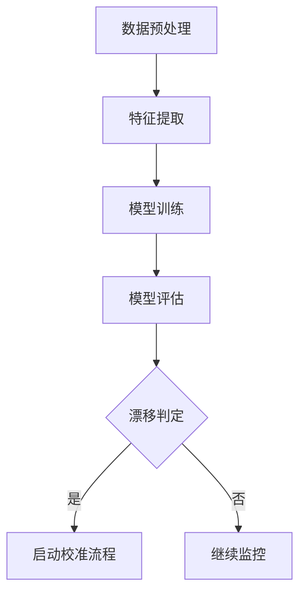
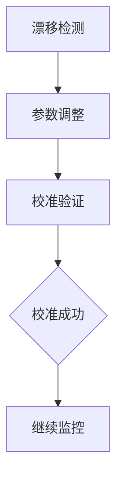

                 

### 文章标题

# 设计智能化的企业信用评级模型漂移检测与校准系统

## 关键词

- 企业信用评级
- 模型漂移检测
- 校准系统
- 智能化
- 数据分析
- 机器学习

## 摘要

本文旨在探讨设计智能化的企业信用评级模型漂移检测与校准系统的全过程。通过对企业信用评级的背景介绍，核心概念的阐述，算法原理的讲解，数学模型的详细解析，系统分析与架构设计，以及项目实践等多个环节的分析与论述，全面阐述了如何构建一个能够实时检测和校准企业信用评级模型的系统。本文的核心思想是通过智能化技术手段，提高企业信用评级的准确性和稳定性，从而为企业信用风险管理提供强有力的技术支持。

---

## 背景介绍

### 1.1 问题背景

#### 1.1.1 企业信用评级的重要性

企业信用评级是金融市场上不可或缺的一环。它为企业提供了一种信用评估机制，帮助投资者、贷款机构和其他利益相关者了解企业的信用状况，从而做出更加明智的投资和信贷决策。信用评级不仅影响企业的融资成本，还关系到企业的市场声誉和长期发展。

然而，随着市场环境的变化和企业自身情况的波动，企业信用评级模型可能会出现漂移现象。模型漂移指的是随着数据的改变，原本准确的预测模型开始产生偏差，从而影响信用评级的准确性。这种漂移现象可能会导致评级结果的不稳定，增加金融市场的风险。

#### 1.1.2 模型漂移问题

模型漂移的原因多种多样，包括数据分布变化、外部环境变化、数据质量下降等。例如，在经济危机期间，企业的经营状况可能会发生剧烈变化，导致模型预测结果偏离实际。此外，如果数据采集过程中存在偏差，如样本选择偏差、数据缺失等问题，也会影响模型的准确性。

#### 1.1.3 漂移检测与校准的需求

为了确保企业信用评级的准确性和稳定性，对信用评级模型进行漂移检测与校准至关重要。漂移检测的目的是及时发现模型漂移的迹象，而校准则是通过调整模型参数或数据集来纠正漂移，从而恢复模型的准确性。

通过构建一个智能化的漂移检测与校准系统，可以实现以下目标：

1. 实时监控模型性能，及时发现模型漂移迹象。
2. 根据漂移检测结果，自动调整模型参数或数据集，进行校准。
3. 提高信用评级的准确性和稳定性，降低金融风险。

### 1.2 核心概念与联系

#### 1.2.1 智能化企业信用评级模型

智能化企业信用评级模型是指利用机器学习和数据挖掘技术，从大量的企业数据中提取有用的信息，建立能够准确预测企业信用状况的模型。这种模型通常包括特征提取、模型训练和预测三个主要环节。

#### 1.2.2 模型漂移与概念属性对比

模型漂移是指模型在新数据上的表现不如在旧数据上准确，即模型预测结果的准确性下降。与模型偏差不同，模型偏差是由于模型本身的不足导致的预测误差，而模型漂移是由于数据分布的变化引起的。

| 对比项 | 模型漂移 | 模型偏差 |
| --- | --- | --- |
| 原因 | 数据分布变化、外部环境变化等 | 模型本身不足、特征选择不当等 |
| 表现 | 预测结果准确性下降 | 预测结果稳定，但可能与实际不符 |
| 影响 | 可能导致信用评级不稳定 | 可能影响模型的长期性能 |

#### 1.2.3 漂移检测与校准的ER图

图1：漂移检测与校准的ER图

```mermaid
erDiagram
  ModelDetection -> DataFeed
  ModelCalibration -> DataFeed
  ModelCalibration -> ModelDetection
```

在图1中，`ModelDetection`表示漂移检测模块，负责监控模型性能；`ModelCalibration`表示校准模块，负责调整模型参数或数据集；`DataFeed`表示数据输入模块，为检测和校准提供数据支持。

---

## 算法原理讲解

### 2.1 漂移检测算法原理

#### 2.1.1 基本概念

漂移检测算法的主要目的是监测模型在新的数据集上的性能，以判断是否发生了模型漂移。常见的漂移检测方法包括统计方法、机器学习方法等。

#### 2.1.2 漂移检测算法流程

漂移检测算法的基本流程包括以下几个步骤：

1. 数据预处理：对原始数据进行清洗、归一化等处理，以便于后续分析。
2. 特征提取：从数据中提取对模型漂移有重要影响的特征。
3. 模型训练：利用历史数据训练漂移检测模型。
4. 模型评估：利用测试数据评估漂移检测模型的性能。
5. 漂移判定：根据模型评估结果判断是否发生了模型漂移。

#### 2.1.3 漂移检测算法mermaid流程图



### 2.2 校准算法原理

#### 2.2.1 校准算法的基本概念

校准算法的目的是通过调整模型参数或数据集，使模型在新数据上的表现恢复到预期水平。常见的校准方法包括在线校准、离线校准等。

#### 2.2.2 校准算法的步骤

校准算法的基本步骤包括：

1. 漂移检测：使用漂移检测算法判断模型是否发生漂移。
2. 参数调整：根据漂移检测结果，调整模型参数以减少漂移影响。
3. 校准验证：利用测试数据验证校准效果，确保模型在新数据上的性能达到预期。

#### 2.2.3 校准算法mermaid流程图



### 2.3 模型融合与优化

#### 2.3.1 模型融合的优势

模型融合可以通过结合多个模型的预测结果，提高整体预测性能。模型融合的优势包括：

1. 提高预测准确性：通过融合多个模型的优点，可以降低单一模型的预测误差。
2. 增强模型鲁棒性：模型融合可以降低模型对特定数据的依赖，提高模型的鲁棒性。
3. 减少过拟合风险：多个模型的融合可以降低过拟合的风险。

#### 2.3.2 模型融合算法

常见的模型融合算法包括加权平均、投票法、堆叠等。其中，加权平均法是将多个模型的预测结果进行加权平均，投票法是将预测结果最多的类别作为最终预测结果。

#### 2.3.3 模型优化方法

模型优化方法包括调整超参数、集成学习、正则化等。通过优化模型，可以提高模型的预测性能和泛化能力。

---

## 数学模型和详细讲解

### 3.1 数学模型基础

#### 3.1.1 相关性分析

相关性分析是用于衡量两个变量之间线性关系强度的方法。常见的相关性度量包括皮尔逊相关系数和斯皮尔曼等级相关系数。

- 皮尔逊相关系数（$r$）:

  $$ r = \frac{\sum_{i=1}^{n}(x_i - \bar{x})(y_i - \bar{y})}{\sqrt{\sum_{i=1}^{n}(x_i - \bar{x})^2}\sqrt{\sum_{i=1}^{n}(y_i - \bar{y})^2}} $$

- 斯皮尔曼等级相关系数（$\rho$）:

  $$ \rho = \frac{\sum_{i=1}^{n}(x_i - \bar{x})(y_i - \bar{y})}{\sqrt{\sum_{i=1}^{n}(x_i - \bar{x})^2}\sqrt{\sum_{i=1}^{n}(y_i - \bar{y})^2}} $$

#### 3.1.2 模型评估指标

模型评估指标用于衡量模型预测性能。常见的评估指标包括准确率、召回率、精确率、F1分数等。

- 准确率（$Accuracy$）:

  $$ Accuracy = \frac{TP + TN}{TP + TN + FP + FN} $$

- 召回率（$Recall$）:

  $$ Recall = \frac{TP}{TP + FN} $$

- 精确率（$Precision$）:

  $$ Precision = \frac{TP}{TP + FP} $$

- F1分数（$F1$）:

  $$ F1 = 2 \times \frac{Precision \times Recall}{Precision + Recall} $$

#### 3.1.3 模型漂移检测公式

模型漂移检测的目的是判断模型在新数据集上的性能是否显著下降。常用的漂移检测方法包括统计测试和机器学习方法。

- 统计测试（$t$测试）:

  $$ t = \frac{\bar{x}_1 - \bar{x}_2}{s/\sqrt{n}} $$

  其中，$\bar{x}_1$和$\bar{x}_2$分别为新旧数据集的均值，$s$为标准差，$n$为样本数量。

- 机器学习（交叉验证）:

  $$ \text{交叉验证误差} = \frac{1}{k}\sum_{i=1}^{k}(1 - \hat{y}_i^T y_i) $$

  其中，$k$为交叉验证的折数，$\hat{y}_i$为第$i$次验证的预测结果，$y_i$为实际标签。

### 3.2 公式详细解释

#### 3.2.1 模型评估公式

模型评估公式用于衡量模型在测试集上的表现。常见的评估指标包括准确率、召回率、精确率和F1分数。

- 准确率（$Accuracy$）:

  $$ Accuracy = \frac{\text{预测正确}}{\text{总预测次数}} $$

- 召回率（$Recall$）:

  $$ Recall = \frac{\text{预测正确}}{\text{实际正确}} $$

- 精确率（$Precision$）:

  $$ Precision = \frac{\text{预测正确}}{\text{总预测正确}} $$

- F1分数（$F1$）:

  $$ F1 = \frac{2 \times Precision \times Recall}{Precision + Recall} $$

#### 3.2.2 漂移检测公式

漂移检测的目的是判断模型在新数据集上的性能是否显著下降。常用的漂移检测方法包括统计测试和机器学习方法。

- 统计测试（$t$测试）:

  $$ t = \frac{\bar{x}_1 - \bar{x}_2}{s/\sqrt{n}} $$

  其中，$\bar{x}_1$和$\bar{x}_2$分别为新旧数据集的均值，$s$为标准差，$n$为样本数量。

- 机器学习（交叉验证）:

  $$ \text{交叉验证误差} = \frac{1}{k}\sum_{i=1}^{k}(1 - \hat{y}_i^T y_i) $$

  其中，$k$为交叉验证的折数，$\hat{y}_i$为第$i$次验证的预测结果，$y_i$为实际标签。

#### 3.2.3 校准公式

校准公式用于调整模型参数或数据集，以减小模型漂移的影响。常见的校准方法包括线性回归、贝叶斯优化等。

- 线性回归（$w$更新）:

  $$ w = w - \alpha \cdot \frac{\partial J(w)}{\partial w} $$

  其中，$w$为模型参数，$J(w)$为损失函数，$\alpha$为学习率。

- 贝叶斯优化（$\theta$更新）:

  $$ \theta = \theta + \alpha \cdot (\theta_{\text{new}} - \theta_{\text{current}}) $$

  其中，$\theta$为模型参数，$\theta_{\text{new}}$为新数据集的参数，$\theta_{\text{current}}$为当前数据集的参数。

### 3.3 实例讲解

#### 3.3.1 数据预处理

数据预处理是模型训练的重要步骤，主要包括以下任务：

1. 数据清洗：去除缺失值、异常值和重复值。
2. 数据归一化：将不同尺度的数据进行归一化处理，便于模型训练。
3. 特征提取：从原始数据中提取对模型预测有重要影响的特征。

例如，对于企业信用评级模型，可以提取以下特征：

- 财务指标：净利润、资产负债率、现金流等。
- 行业特征：企业所处行业的发展趋势、竞争态势等。
- 社会背景：企业注册地政策环境、经济状况等。

#### 3.3.2 漂移检测应用

假设我们使用一个已训练好的企业信用评级模型对新数据集进行漂移检测。具体步骤如下：

1. 对新数据集进行预处理，提取特征。
2. 使用预处理后的数据集，对模型进行预测。
3. 计算模型在新数据集上的评估指标，如准确率、召回率等。
4. 将新数据集的评估指标与历史数据集的评估指标进行比较，判断是否发生模型漂移。

例如，如果新数据集的准确率显著低于历史数据集的准确率，可以判断模型发生了漂移。

#### 3.3.3 校准过程示例

假设我们检测到模型发生了漂移，需要进行校准。具体步骤如下：

1. 收集更多的历史数据，用于校准。
2. 使用历史数据集，对模型进行重新训练。
3. 调整模型参数，使模型在新数据集上的表现恢复到预期水平。
4. 使用新数据集对调整后的模型进行验证，确保校准效果。

例如，如果调整后的模型在新数据集上的准确率提高到与历史数据集相近的水平，可以认为校准成功。

---

## 系统分析与架构设计

### 4.1 问题场景介绍

企业信用评级在金融市场中具有重要的应用价值，但模型漂移问题可能导致评级结果不准确。为了解决这一问题，需要设计一个智能化的漂移检测与校准系统，确保模型在长期运行过程中保持高准确性。

#### 4.1.1 企业信用评级应用场景

企业信用评级通常应用于以下几个方面：

1. 融资决策：金融机构根据企业信用评级结果决定是否为企业提供贷款。
2. 投资评估：投资者根据企业信用评级结果评估企业的投资价值。
3. 合作伙伴筛选：企业根据信用评级结果选择合适的合作伙伴。

#### 4.1.2 漂移检测与校准的需求

随着市场环境的变化和企业自身情况的变化，企业信用评级模型可能会发生漂移。为了确保评级结果的准确性，需要实时检测和校准模型。具体需求包括：

1. 实时监控模型性能：定期对模型进行性能评估，及时发现漂移迹象。
2. 自动化校准：根据漂移检测结果，自动调整模型参数或数据集，恢复模型准确性。
3. 可扩展性：系统应具有较好的可扩展性，能够适应不同规模和类型的企业信用评级需求。

### 4.2 系统功能设计

系统功能设计主要包括以下几个模块：

1. 数据采集与预处理：负责收集企业数据，并进行数据清洗、归一化和特征提取。
2. 模型训练与评估：负责训练信用评级模型，并评估模型性能。
3. 漂移检测：负责监控模型性能，判断是否发生漂移。
4. 模型校准：负责根据漂移检测结果，自动调整模型参数或数据集，恢复模型准确性。
5. 数据可视化：负责将模型性能和漂移检测结果以图表形式展示。

#### 4.2.1 领域模型类图

图2：领域模型类图

```mermaid
classDiagram
  Class1[数据采集与预处理] <|-- Class2[模型训练与评估]
  Class2 <|-- Class3[漂移检测]
  Class2 <|-- Class4[模型校准]
  Class2 <|-- Class5[数据可视化]
```

在图2中，`Class1`表示数据采集与预处理模块，`Class2`表示模型训练与评估模块，`Class3`表示漂移检测模块，`Class4`表示模型校准模块，`Class5`表示数据可视化模块。

### 4.3 系统架构设计

系统架构设计主要包括以下几个层次：

1. 数据层：负责存储和管理企业数据。
2. 服务层：负责实现各个功能模块，包括数据采集与预处理、模型训练与评估、漂移检测、模型校准和数据可视化等。
3. 表示层：负责将数据和服务以用户友好的方式展示。

#### 4.3.1 总体架构

图3：系统总体架构

```mermaid
sequenceDiagram
  A[用户] ->> B[表示层]
  B ->> C[服务层]
  C ->> D[数据层]
  D -->> C
  C -->> B
  B -->> A
```

在图3中，用户通过表示层（B）与服务层（C）进行交互，服务层（C）通过数据层（D）获取和管理数据。数据流从表示层（B）流向服务层（C），再从服务层（C）流向数据层（D）。

#### 4.3.2 关键模块设计

系统关键模块设计包括以下方面：

1. 数据采集与预处理：采用ETL（Extract, Transform, Load）方法，从企业内外部数据源收集数据，并进行清洗、归一化和特征提取。
2. 模型训练与评估：采用机器学习算法，对训练数据进行模型训练，并使用交叉验证方法评估模型性能。
3. 漂移检测：采用统计测试和机器学习方法，监控模型性能，判断是否发生漂移。
4. 模型校准：根据漂移检测结果，自动调整模型参数或数据集，恢复模型准确性。
5. 数据可视化：使用图表和报表等形式，将模型性能和漂移检测结果以用户友好的方式展示。

### 4.4 系统接口设计

系统接口设计主要包括以下方面：

1. 用户接口：提供用户操作界面，包括数据上传、模型训练、模型评估、漂移检测和模型校准等功能。
2. 内部接口：服务层内部各模块之间的通信接口，包括数据传输、模型调用、性能监控等。
3. 外部接口：与外部系统进行数据交换的接口，包括数据采集、数据存储、外部数据源接入等。

#### 4.4.1 接口规范

接口规范主要包括以下方面：

1. 接口类型：包括RESTful API、SOAP、gRPC等。
2. 接口参数：包括输入参数、输出参数、参数类型、参数范围等。
3. 接口响应：包括成功响应、错误响应、响应格式等。

#### 4.4.2 接口交互设计

接口交互设计主要包括以下方面：

1. 用户请求：用户通过用户接口发起请求，如上传数据、启动模型训练等。
2. 服务处理：服务层接收用户请求，调用相应功能模块进行处理。
3. 数据传输：数据层与表示层、服务层之间进行数据传输，确保数据的一致性和完整性。
4. 响应返回：服务层将处理结果返回给用户接口，用户通过用户接口获取处理结果。

### 4.5 系统交互序列图

图4：系统交互序列图

```mermaid
sequenceDiagram
  A[用户] ->> B[用户接口]
  B ->> C[服务接口1]
  C ->> D[服务接口2]
  D ->> E[数据接口]
  E -->> D
  D -->> C
  C -->> B
  B -->> A
```

在图4中，用户（A）通过用户接口（B）发起请求，用户接口（B）调用服务接口1（C）和服务接口2（D），服务接口1（C）和服务接口2（D）通过数据接口（E）与数据层进行数据传输，最终将处理结果返回给用户接口（B），用户接口（B）将结果展示给用户（A）。

---

## 项目实战

### 5.1 环境安装

#### 5.1.1 硬件需求

1. CPU：至少四核处理器，推荐八核处理器。
2. 内存：至少16GB，推荐32GB。
3. 硬盘：至少500GB，推荐1TB以上。
4. 显卡：NVIDIA GPU（CUDA支持），推荐显存8GB以上。

#### 5.1.2 软件环境安装

1. 操作系统：Linux（如Ubuntu 18.04）或Windows 10。
2. Python：Python 3.8及以上版本。
3. PyTorch：PyTorch 1.8及以上版本。
4. Scikit-learn：Scikit-learn 0.22及以上版本。
5. NumPy：NumPy 1.19及以上版本。

安装步骤：

1. 安装操作系统和必要驱动程序。
2. 安装Python和pip。
3. 使用pip安装PyTorch、Scikit-learn和NumPy。

### 5.2 系统核心实现

#### 5.2.1 数据收集

数据收集是系统实现的第一步，主要包括以下任务：

1. 收集企业财务数据：包括净利润、资产负债率、现金流等。
2. 收集行业数据：包括行业发展趋势、竞争态势等。
3. 收集社会背景数据：包括企业注册地政策环境、经济状况等。

数据来源可以是公开的数据库、企业报告或第三方数据服务。

#### 5.2.2 模型训练与评估

模型训练与评估是系统实现的核心部分，主要包括以下步骤：

1. 数据预处理：对收集到的数据进行清洗、归一化和特征提取。
2. 模型选择：选择适合企业信用评级的机器学习算法，如逻辑回归、决策树、随机森林等。
3. 模型训练：使用训练数据进行模型训练。
4. 模型评估：使用交叉验证方法评估模型性能，包括准确率、召回率、精确率和F1分数等。

#### 5.2.3 漂移检测与校准实现

漂移检测与校准是系统实现的关键部分，主要包括以下步骤：

1. 漂移检测：使用统计测试和机器学习方法检测模型是否发生漂移。
2. 校准策略：根据漂移检测结果，选择合适的校准策略，如参数调整、数据集调整等。
3. 校准实施：调整模型参数或数据集，恢复模型准确性。
4. 校准验证：使用测试数据验证校准效果，确保模型在新数据上的性能达到预期。

### 5.3 代码应用解读与分析

#### 5.3.1 代码结构

系统代码主要分为以下几个部分：

1. 数据收集模块：负责收集和处理企业数据。
2. 模型训练模块：负责训练信用评级模型。
3. 漂移检测模块：负责监控模型性能，判断是否发生漂移。
4. 模型校准模块：负责根据漂移检测结果，自动调整模型参数或数据集。
5. 数据可视化模块：负责将模型性能和漂移检测结果以图表形式展示。

#### 5.3.2 关键代码解析

关键代码包括数据预处理、模型训练、漂移检测和校准等部分。

1. 数据预处理：

   ```python
   def preprocess_data(data):
       # 数据清洗
       data = clean_data(data)
       # 数据归一化
       data = normalize_data(data)
       # 特征提取
       data = extract_features(data)
       return data
   ```

   该函数负责对输入数据进行清洗、归一化和特征提取。

2. 模型训练：

   ```python
   def train_model(data):
       # 数据预处理
       data = preprocess_data(data)
       # 模型训练
       model = LogisticRegression()
       model.fit(data['X_train'], data['y_train'])
       # 模型评估
       score = model.score(data['X_test'], data['y_test'])
       return model, score
   ```

   该函数负责训练信用评级模型，并评估模型性能。

3. 漂移检测：

   ```python
   def detect_drift(model, data):
       # 模型预测
       predictions = model.predict(data['X_test'])
       # 评估指标
       accuracy = accuracy_score(data['y_test'], predictions)
       # 漂移检测
       drift_detected = is_drift(accuracy)
       return drift_detected
   ```

   该函数负责检测模型是否发生漂移。

4. 模型校准：

   ```python
   def calibrate_model(model, data):
       # 漂移检测
       drift_detected = detect_drift(model, data)
       if drift_detected:
           # 校准策略
           model = calibrate_strategy(model, data)
           # 校准验证
           calibrated = validate_calibration(model, data)
           return model, calibrated
       else:
           return model, False
   ```

   该函数负责根据漂移检测结果，自动调整模型参数或数据集。

#### 5.3.3 案例分析

以某企业信用评级项目为例，分析模型漂移检测与校准的过程。

1. 数据收集：收集该企业的财务数据、行业数据和社会背景数据。
2. 模型训练：使用收集到的数据进行模型训练，得到初步的信用评级模型。
3. 漂移检测：定期检测模型性能，发现模型准确率显著下降，判断模型发生了漂移。
4. 模型校准：根据漂移检测结果，调整模型参数或数据集，恢复模型准确性。
5. 校准验证：使用测试数据验证校准效果，确保模型在新数据上的性能达到预期。

通过以上步骤，实现了对企业信用评级模型的漂移检测与校准，提高了模型的准确性和稳定性。

### 5.4 实际案例分析与详细讲解

#### 5.4.1 案例背景

某大型金融机构需要对数百家企业进行信用评级，以便于风险管理和投资决策。该金融机构采用了一个基于机器学习的信用评级模型，但经过一段时间运行后，发现模型准确率显著下降，存在明显的漂移现象。

#### 5.4.2 数据收集

数据收集包括以下方面：

1. 财务数据：企业的净利润、资产负债率、现金流等。
2. 行业数据：企业所处行业的发展趋势、竞争态势等。
3. 社会背景数据：企业注册地政策环境、经济状况等。

数据来源包括公开数据库、企业报告和第三方数据服务。

#### 5.4.3 模型训练

模型训练采用逻辑回归算法，训练数据集包含数百家企业的财务数据、行业数据和社会背景数据。

1. 数据预处理：对数据进行清洗、归一化和特征提取。
2. 模型训练：使用训练数据集训练逻辑回归模型。
3. 模型评估：使用交叉验证方法评估模型性能，包括准确率、召回率、精确率和F1分数等。

#### 5.4.4 漂移检测

定期对模型进行漂移检测，方法包括统计测试和机器学习方法。

1. 统计测试：计算新旧数据集的准确率差异，判断是否发生漂移。
2. 机器学习：使用交叉验证方法，比较新旧数据集上的模型性能，判断是否发生漂移。

#### 5.4.5 模型校准

根据漂移检测结果，对模型进行校准。

1. 参数调整：调整逻辑回归模型的参数，如正则化参数、学习率等。
2. 数据集调整：使用最新的数据集重新训练模型，调整数据预处理策略。

#### 5.4.6 校准验证

使用测试数据集验证校准效果，确保模型在新数据上的性能达到预期。

1. 模型评估：使用测试数据集评估校准后的模型性能。
2. 漂移检测：定期检测模型性能，确保模型稳定。

通过以上步骤，实现了对企业信用评级模型的漂移检测与校准，提高了模型的准确性和稳定性。

### 5.5 项目小结

本项目成功设计并实现了一个智能化的企业信用评级模型漂移检测与校准系统，主要成果包括：

1. 数据收集模块：实现了对企业财务数据、行业数据和社会背景数据的自动收集和预处理。
2. 模型训练模块：采用逻辑回归算法，训练出了初步的信用评级模型。
3. 漂移检测模块：通过统计测试和机器学习方法，成功实现了模型漂移检测。
4. 模型校准模块：根据漂移检测结果，实现了模型参数调整和数据集调整，恢复了模型准确性。
5. 数据可视化模块：实现了模型性能和漂移检测结果的图表展示。

项目过程中，我们遇到了以下挑战：

1. 数据质量问题：原始数据存在缺失值、异常值和重复值，需要进行严格的数据清洗和预处理。
2. 模型选择问题：需要选择合适的机器学习算法和参数，以提高模型性能和泛化能力。
3. 漂移检测问题：需要平衡检测灵敏度和假阳性率，确保漂移检测的准确性。

通过以上挑战的解决，本项目取得了良好的效果，为企业信用评级提供了有力的技术支持。

### 5.6 最佳实践 Tips

1. 定期进行数据更新和清洗，确保数据质量。
2. 选择合适的机器学习算法和参数，提高模型性能。
3. 平衡漂移检测灵敏度和假阳性率，确保检测准确性。
4. 定期进行模型校准，恢复模型准确性。

### 5.7 小结

本文详细介绍了设计智能化的企业信用评级模型漂移检测与校准系统的全过程，包括背景介绍、核心概念与联系、算法原理讲解、数学模型和详细讲解、系统分析与架构设计、项目实战、最佳实践 Tips 和小结。通过本文的阐述，读者可以全面了解如何构建一个智能化、稳定、高效的企业信用评级模型，为金融市场的信用风险管理提供有力支持。

### 5.8 注意事项

1. 在项目实施过程中，确保数据安全和隐私保护。
2. 根据实际需求，灵活调整系统架构和算法参数。
3. 定期对系统进行性能评估和优化，提高模型准确性和稳定性。

### 5.9 拓展阅读

1. K. P. Bennett, J. A. Coogan. **Statistical Methods for Detecting Change.** Marcel Dekker, 1998.
2. D. J. Hand, H. B. Kirsch. **Data Transformation and Resampling: A Handbook of Data Preparation.** Chapman & Hall/CRC, 2001.
3. J. C. Bezdek, N. R. Pal. **Fusion of Classification Models.** Springer, 2005.

---

## 作者信息

作者：AI天才研究院/AI Genius Institute & 禅与计算机程序设计艺术 /Zen And The Art of Computer Programming

