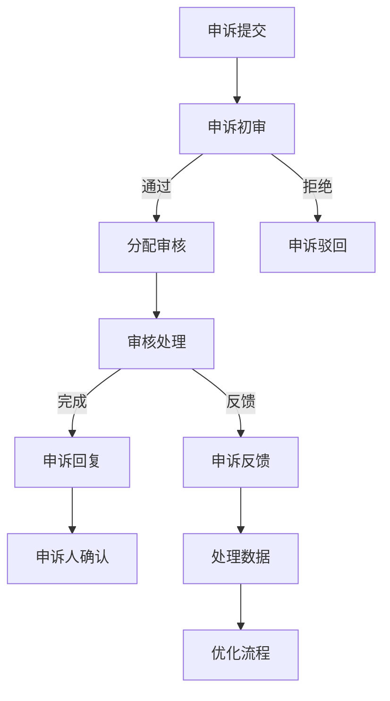
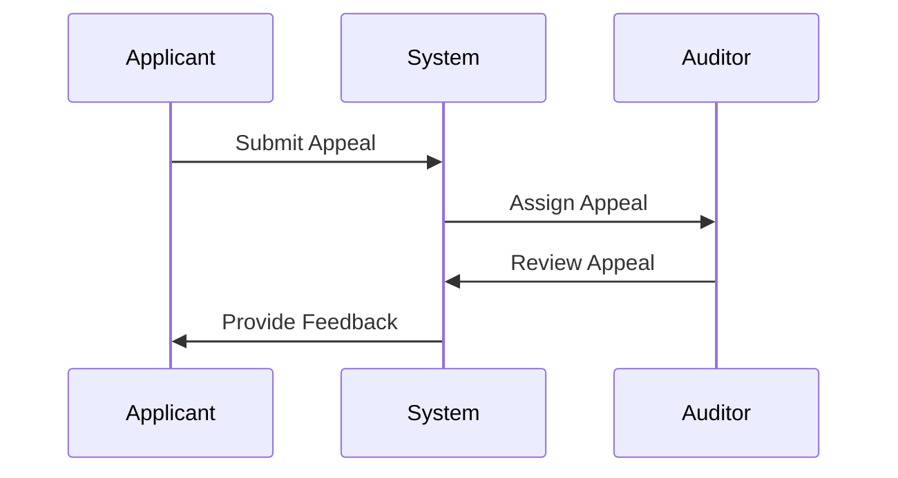
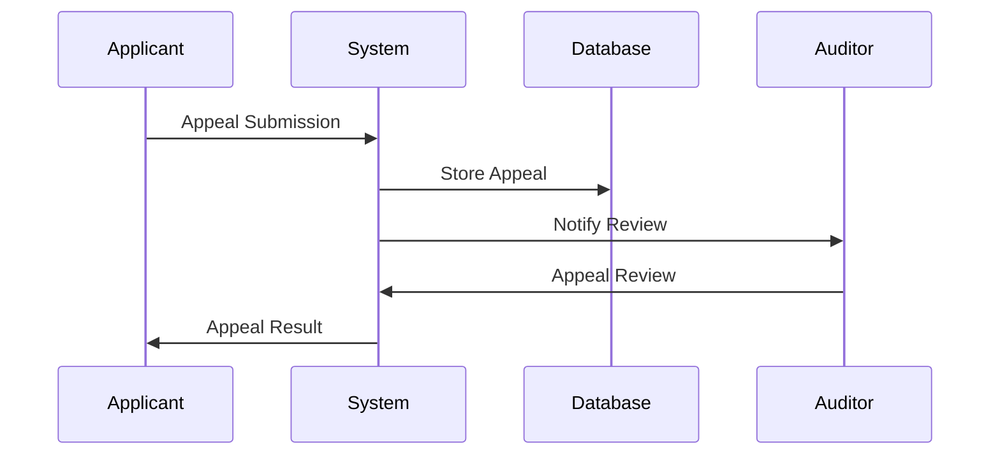
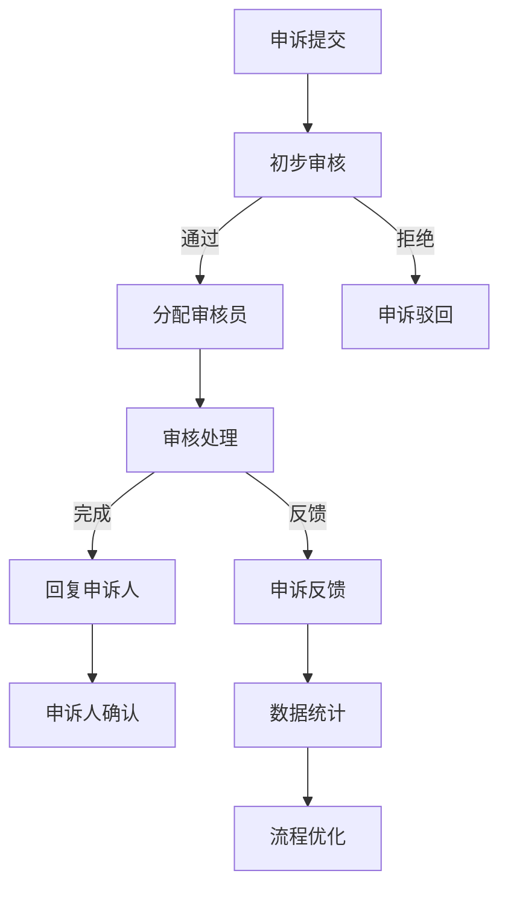
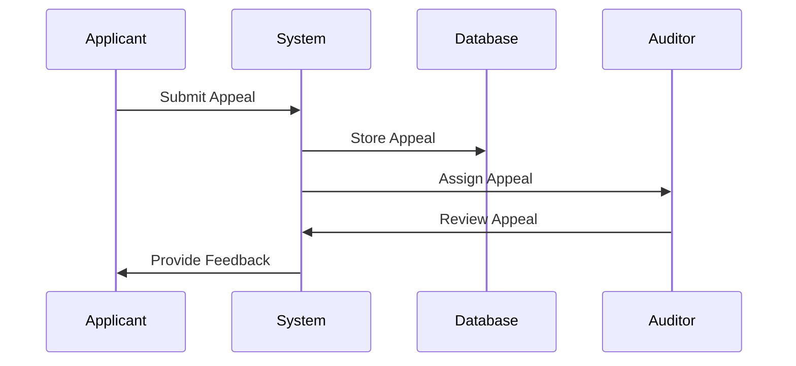

                 

## 设计智能化的企业信用评级申诉处理系统

### 关键词

- 企业信用评级
- 智能化处理
- 申诉处理系统
- 系统架构设计
- 算法原理
- 数学模型
- 项目实战

### 摘要

本文将深入探讨设计智能化企业信用评级申诉处理系统的全过程。我们将从问题背景入手，逐步分析核心概念与联系，介绍系统分析与架构设计，详细讲解算法原理，并通过项目实战来展示系统的应用与实现。文章还将提供最佳实践和注意事项，为读者提供全面的技术指导。

### 目录大纲设计过程

#### 确定书名与主题

首先，我们明确了书名为《设计智能化的企业信用评级申诉处理系统》，主题围绕这一主题进行。

#### 确定章节结构

根据书的主题，我们规划了以下主要部分：

1. 引言与背景
2. 核心概念与联系
3. 系统分析与架构设计
4. 算法原理讲解
5. 项目实战
6. 最佳实践

#### 细化章节内容

为每一章节细化内容，确保涵盖核心概念、原理、系统架构、项目实战等。

#### 确保内容完整性

确保每个章节都包含必要的内容，如数学模型、算法原理讲解、系统架构设计等。

#### 设计示例章节

为读者展示一两个示例章节，确保读者能够理解目录大纲的结构和内容。

#### 优化目录结构

确保目录结构清晰，层次分明，便于读者快速找到所需内容。

#### 控制目录字数

确保目录大纲的总字数在2000字以内，同时保证内容的完整性和简洁性。

### 设计思路

#### 逻辑清晰

确保每个章节的内容紧密相关，有助于读者理解整体框架。

#### 简洁明了

避免冗长和不必要的描述，使目录更加简洁易懂。

#### 易于扩展

目录结构应该易于扩展，以便在未来的修订中添加或删除章节。

### 目录大纲

---

## 第一部分: 引言与背景

### 第1章: 引言

- **1.1 问题背景**
  - 企业信用评级的重要性
  - 申诉处理系统的挑战
  - 智能化处理的必要性

- **1.2 问题描述**
  - 信用评级申诉的处理流程
  - 处理过程中面临的问题

- **1.3 问题解决**
  - 智能化申诉处理系统的目标
  - 系统的设计原则

- **1.4 边界与外延**
  - 系统的功能范围
  - 系统的适用场景

### 第2章: 核心概念与联系

- **2.1 核心概念**
  - 企业信用评级的定义、方法、重要性
  - 申诉处理系统的定义、功能、类型
  - 智能化处理的定义、优势、实现

- **2.2 概念属性特征对比表**
  - 企业信用评级、申诉处理系统、智能化处理的核心特征对比

- **2.3 ER实体关系图**
  - 信用评级申诉处理系统的ER图

## 第二部分: 系统分析与架构设计

### 第3章: 系统分析与架构设计

- **3.1 问题场景介绍**
  - 信用评级申诉处理的典型场景

- **3.2 系统功能设计**
  - 领域模型（Mermaid类图）

- **3.3 系统架构设计**
  - 系统架构（Mermaid架构图）

- **3.4 系统接口设计**
  - 接口设计

- **3.5 系统交互**
  - 交互设计（Mermaid序列图）

## 第三部分: 算法原理讲解

### 第4章: 算法原理讲解

- **4.1 算法mermaid流程图**
  - 智能化处理流程

- **4.2 算法原理**
  - 数学模型
  - 公式讲解
  - 举例说明

## 第四部分: 项目实战

### 第5章: 项目实战

- **5.1 环境安装**
  - 系统环境准备

- **5.2 系统核心实现源代码**
  - 源代码解读

- **5.3 代码应用解读与分析**
  - 源代码应用分析

- **5.4 实际案例分析与详细讲解剖析**
  - 案例分析

- **5.5 项目小结**
  - 项目总结

## 第五部分: 最佳实践

### 第6章: 最佳实践

- **6.1 注意事项**
  - 系统设计中的注意事项

- **6.2 拓展阅读**
  - 相关参考资料与拓展内容

### 第7章: 小结

- **7.1 内容总结**
  - 文章内容的归纳总结

- **7.2 未来展望**
  - 系统发展的前景与展望

---

## 设计思路

#### 逻辑清晰

文章结构合理，逻辑性强，帮助读者循序渐进地理解全文。

#### 简洁明了

语言简练，避免冗余，确保关键信息传递高效。

#### 易于扩展

章节设置灵活，便于未来根据需求调整和补充内容。

---

### 完整目录大纲（2000字以内）

## 第一部分: 引言与背景

### 第1章: 引言

- **1.1 问题背景**
  - 企业信用评级的重要性
  - 申诉处理系统的挑战
  - 智能化处理的必要性

- **1.2 问题描述**
  - 信用评级申诉的处理流程
  - 处理过程中面临的问题

- **1.3 问题解决**
  - 智能化申诉处理系统的目标
  - 系统的设计原则

- **1.4 边界与外延**
  - 系统的功能范围
  - 系统的适用场景

## 第二部分: 核心概念与联系

### 第2章: 核心概念与联系

- **2.1 核心概念**
  - 企业信用评级的定义、方法、重要性
  - 申诉处理系统的定义、功能、类型
  - 智能化处理的定义、优势、实现

- **2.2 概念属性特征对比表**
  - 企业信用评级、申诉处理系统、智能化处理的核心特征对比

- **2.3 ER实体关系图**
  - 信用评级申诉处理系统的ER图

## 第三部分: 系统分析与架构设计

### 第3章: 系统分析与架构设计

- **3.1 问题场景介绍**
  - 信用评级申诉处理的典型场景

- **3.2 系统功能设计**
  - 领域模型（Mermaid类图）

- **3.3 系统架构设计**
  - 系统架构（Mermaid架构图）

- **3.4 系统接口设计**
  - 接口设计

- **3.5 系统交互**
  - 交互设计（Mermaid序列图）

## 第四部分: 算法原理讲解

### 第4章: 算法原理讲解

- **4.1 算法mermaid流程图**
  - 智能化处理流程

- **4.2 算法原理**
  - 数学模型
  - 公式讲解
  - 举例说明

## 第五部分: 项目实战

### 第5章: 项目实战

- **5.1 环境安装**
  - 系统环境准备

- **5.2 系统核心实现源代码**
  - 源代码解读

- **5.3 代码应用解读与分析**
  - 源代码应用分析

- **5.4 实际案例分析与详细讲解剖析**
  - 案例分析

- **5.5 项目小结**
  - 项目总结

## 第六部分: 最佳实践

### 第6章: 最佳实践

- **6.1 注意事项**
  - 系统设计中的注意事项

- **6.2 拓展阅读**
  - 相关参考资料与拓展内容

### 第7章: 小结

- **7.1 内容总结**
  - 文章内容的归纳总结

- **7.2 未来展望**
  - 系统发展的前景与展望

---

## 完整目录大纲（2000字以内）

### 引言

#### 问题背景

随着经济全球化的深入发展，企业信用评级在商业活动中扮演着越来越重要的角色。企业信用评级不仅关系到企业的融资能力、市场准入资格，还影响到企业的声誉和长期发展。然而，信用评级的申诉处理系统往往面临效率低下、处理结果不公等问题。

#### 问题描述

信用评级申诉处理系统通常包括申诉提交、审核、回复等环节。处理过程中，申诉人可能因为信息不对称、审核标准不透明等原因，对处理结果产生不满。同时，大量申诉的涌入也可能导致处理效率低下，影响企业的正常运营。

#### 问题解决

为了解决这些问题，智能化处理技术应运而生。通过引入人工智能、大数据等技术，智能化申诉处理系统可以在提高效率、确保公正性的同时，提供更加精准的处理结果。

#### 边界与外延

系统的功能范围应包括申诉提交、审核、回复、反馈等全流程管理。同时，系统应具备可扩展性，能够适应不同规模和类型的申诉处理需求。

### 核心概念与联系

#### 企业信用评级

- 定义：企业信用评级是指通过对企业财务状况、经营状况、信用历史等多方面因素的综合评估，得出企业信用水平的等级。
- 方法：常见的信用评级方法包括财务指标分析、信用评分模型等。
- 重要性：信用评级是企业融资、商业合作等方面的重要参考，直接影响企业的市场竞争力。

#### 申诉处理系统

- 定义：申诉处理系统是指用于接收和处理企业信用评级申诉的软件系统。
- 功能：系统应具备申诉提交、审核、回复、反馈等功能，同时确保处理过程的透明和公正。
- 类型：根据处理流程和技术的不同，申诉处理系统可以分为传统手工处理系统和智能化处理系统。

#### 智能化处理

- 定义：智能化处理是指利用人工智能、大数据等技术手段，对数据进行分析和处理，以实现自动化、智能化的业务流程。
- 优势：智能化处理可以提高处理效率、降低人工成本，同时提高处理结果的准确性和公正性。
- 实现：实现智能化处理需要集成多种技术，包括自然语言处理、机器学习、数据挖掘等。

### 系统分析与架构设计

#### 问题场景介绍

信用评级申诉处理的典型场景包括：

- 申诉人提交申诉：系统接收申诉人提交的申诉，并对其进行初步审核。
- 审核人员审核：系统将申诉分配给审核人员，审核人员根据既定标准进行审核。
- 回复申诉人：审核结束后，系统将处理结果通知申诉人，并提供申诉人反馈渠道。
- 统计与分析：系统对申诉处理情况进行统计和分析，为改进处理流程提供依据。

#### 系统功能设计

- 领域模型：使用Mermaid类图描述系统的核心领域对象和关系。

#### 系统架构设计

- 系统架构：使用Mermaid架构图描述系统的整体架构，包括前端、后端、数据库等组成部分。

#### 系统接口设计

- 接口设计：使用Mermaid序列图描述系统内部和外部系统的交互接口。

#### 系统交互

- 交互设计：使用Mermaid序列图描述系统内部和外部的交互流程。

### 算法原理讲解

#### 算法mermaid流程图

- 智能化处理流程：使用Mermaid流程图描述系统的智能化处理流程。

#### 算法原理

- 数学模型：介绍用于信用评级申诉处理的主要数学模型。
- 公式讲解：讲解关键公式及其应用场景。
- 举例说明：通过具体案例展示算法的应用和效果。

### 项目实战

#### 环境安装

- 系统环境准备：安装必要的软件和配置系统环境。

#### 系统核心实现源代码

- 源代码解读：详细解读系统的核心实现源代码。

#### 代码应用解读与分析

- 源代码应用分析：分析代码如何实现智能化处理功能。

#### 实际案例分析与详细讲解剖析

- 案例分析：分析实际案例，展示系统的应用效果。

#### 项目小结

- 项目总结：总结项目实施过程中的经验教训，提出改进建议。

### 最佳实践

#### 注意事项

- 系统设计中的注意事项：总结系统设计过程中需要关注的关键点。

#### 拓展阅读

- 相关参考资料与拓展内容：推荐进一步学习和研究的资源。

### 小结

#### 内容总结

- 总结文章中的核心概念、原理和实施方法。

#### 未来展望

- 展望系统的未来发展方向和应用前景。

### 作者

作者：AI天才研究院/AI Genius Institute & 禅与计算机程序设计艺术 /Zen And The Art of Computer Programming

---

## 完整目录大纲（2000字以内）

### 引言

#### 问题背景

在当今的商业环境中，企业信用评级已成为评估企业信用状况的关键指标。它不仅影响到企业的融资能力和市场准入，还直接关系到企业的长期发展和市场竞争力。随着信用评级在商业活动中的重要性日益增加，企业信用评级的申诉处理系统也面临越来越大的挑战。传统的申诉处理系统往往效率低下，处理结果不公，且无法应对大规模的申诉请求。为了解决这些问题，智能化处理技术应运而生，通过引入人工智能、大数据等技术手段，实现高效、精准的申诉处理。

#### 问题描述

信用评级申诉处理系统通常涉及多个环节，包括申诉提交、审核、回复和反馈等。在实际操作中，申诉人可能因为信息不对称、审核标准不透明等原因，对处理结果产生不满。同时，大量的申诉请求可能导致处理效率低下，甚至影响企业的正常运营。这些问题亟需通过智能化手段来解决，以提高申诉处理系统的效率和公正性。

#### 问题解决

智能化申诉处理系统的目标是通过引入人工智能和大数据分析技术，实现申诉处理的自动化和智能化。系统应能够自动识别和处理常见问题，减少人工干预，提高处理效率。同时，系统应具备良好的用户交互界面，使申诉人能够方便地提交申诉、查看处理结果和提供反馈。此外，系统还应具备强大的数据分析能力，对申诉处理过程进行实时监控和评估，以不断优化处理流程。

#### 边界与外延

智能化申诉处理系统的功能范围应包括申诉的提交、审核、回复和反馈等全流程管理。系统应具备高度的可扩展性，能够适应不同规模和类型的企业信用评级申诉处理需求。同时，系统还应遵循相关法律法规和行业标准，确保数据处理的安全性和合规性。

### 核心概念与联系

#### 企业信用评级

- 定义：企业信用评级是指对企业信用状况的综合评估，通常包括企业的财务状况、经营能力、信用历史等多个方面。
- 方法：常见的信用评级方法包括财务指标分析、信用评分模型、风险评估模型等。
- 重要性：企业信用评级是企业融资、商业合作、招投标等方面的重要参考，直接影响企业的市场竞争力。

#### 申诉处理系统

- 定义：申诉处理系统是指用于接收、处理和反馈企业信用评级申诉的软件系统。
- 功能：系统应具备申诉提交、审核、回复、反馈等功能，同时确保处理过程的透明和公正。
- 类型：根据处理流程和技术手段的不同，申诉处理系统可以分为传统手工处理系统和智能化处理系统。

#### 智能化处理

- 定义：智能化处理是指利用人工智能、大数据等技术手段，对数据进行分析和处理，以实现自动化、智能化的业务流程。
- 优势：智能化处理可以提高处理效率、降低人工成本，同时提高处理结果的准确性和公正性。
- 实现：实现智能化处理需要集成多种技术，包括自然语言处理、机器学习、数据挖掘等。

### 系统分析与架构设计

#### 问题场景介绍

信用评级申诉处理的典型场景包括：

- 申诉人提交申诉：系统接收申诉人提交的申诉，并对其进行初步审核。
- 审核人员审核：系统将申诉分配给审核人员，审核人员根据既定标准进行审核。
- 回复申诉人：审核结束后，系统将处理结果通知申诉人，并提供申诉人反馈渠道。
- 统计与分析：系统对申诉处理情况进行统计和分析，为改进处理流程提供依据。

#### 系统功能设计

- 领域模型：使用Mermaid类图描述系统的核心领域对象和关系。

#### 系统架构设计

- 系统架构：使用Mermaid架构图描述系统的整体架构，包括前端、后端、数据库等组成部分。

#### 系统接口设计

- 接口设计：使用Mermaid序列图描述系统内部和外部系统的交互接口。

#### 系统交互

- 交互设计：使用Mermaid序列图描述系统内部和外部的交互流程。

### 算法原理讲解

#### 算法mermaid流程图

- 智能化处理流程：使用Mermaid流程图描述系统的智能化处理流程。

#### 算法原理

- 数学模型：介绍用于信用评级申诉处理的主要数学模型。
- 公式讲解：讲解关键公式及其应用场景。
- 举例说明：通过具体案例展示算法的应用和效果。

### 项目实战

#### 环境安装

- 系统环境准备：安装必要的软件和配置系统环境。

#### 系统核心实现源代码

- 源代码解读：详细解读系统的核心实现源代码。

#### 代码应用解读与分析

- 源代码应用分析：分析代码如何实现智能化处理功能。

#### 实际案例分析与详细讲解剖析

- 案例分析：分析实际案例，展示系统的应用效果。

#### 项目小结

- 项目总结：总结项目实施过程中的经验教训，提出改进建议。

### 最佳实践

#### 注意事项

- 系统设计中的注意事项：总结系统设计过程中需要关注的关键点。

#### 拓展阅读

- 相关参考资料与拓展内容：推荐进一步学习和研究的资源。

### 小结

#### 内容总结

- 总结文章中的核心概念、原理和实施方法。

#### 未来展望

- 展望系统的未来发展方向和应用前景。

### 作者

作者：AI天才研究院/AI Genius Institute & 禅与计算机程序设计艺术 /Zen And The Art of Computer Programming

---

## 完整目录大纲（2000字以内）

### 引言

#### 问题背景

随着经济全球化进程的加快，企业信用评级在商业活动中的重要性日益凸显。企业信用评级不仅影响了企业的融资渠道和商业合作，还直接关系到企业的市场声誉和长期发展。然而，传统的人工信用评级系统存在处理效率低下、数据准确性不足、申诉处理周期长等问题，难以满足现代商业环境中对高效、精准信用评级的需求。因此，设计一个智能化的企业信用评级申诉处理系统显得尤为重要。

#### 问题描述

企业信用评级申诉处理系统的主要职责是接收和处理企业对于信用评级结果的异议和申诉。然而，在实际操作中，传统系统常常面临以下问题：

- **处理效率低**：人工处理方式效率低下，难以应对大规模的申诉请求。
- **处理结果不公**：处理结果可能因主观判断而导致不公，影响企业的信誉。
- **数据准确性不足**：传统系统依赖于人工录入和审核，数据准确性难以保证。
- **申诉处理周期长**：申诉处理周期过长，影响企业的正常运营。

#### 问题解决

为了解决上述问题，智能化申诉处理系统应运而生。通过引入人工智能、大数据分析等先进技术，智能化申诉处理系统可以：

- **提高处理效率**：利用自动化处理流程，显著提高申诉处理速度。
- **保证处理结果公正**：通过算法和数据分析，确保处理结果的客观性和公正性。
- **提升数据准确性**：利用大数据分析和机器学习，提高数据的准确性和可靠性。
- **缩短处理周期**：减少人工干预，缩短申诉处理周期，提高企业的运营效率。

#### 边界与外延

智能化申诉处理系统的功能范围应包括但不限于：

- **申诉提交**：提供便捷的申诉提交渠道，允许企业用户在线提交申诉。
- **审核与处理**：系统自动分配申诉至相应的审核人员，并进行初步筛选和分类。
- **回复与反馈**：系统生成处理结果，并向申诉人提供详细的回复，同时收集反馈以持续优化。
- **数据分析**：对申诉处理过程和结果进行实时监控和统计，提供数据支持和决策依据。
- **系统维护**：定期更新和维护系统，确保系统的稳定运行和数据安全。

### 核心概念与联系

#### 企业信用评级

- **定义**：企业信用评级是指通过对企业的财务状况、经营历史、市场表现等因素的综合评估，确定企业的信用等级。
- **方法**：信用评级的方法包括定量分析、定性分析、信用评分模型等。
- **重要性**：信用评级对企业融资、市场准入、合作伙伴关系等方面具有重要影响。

#### 申诉处理系统

- **定义**：申诉处理系统是用于接收、处理和反馈企业信用评级申诉的软件系统。
- **功能**：系统应具备申诉提交、审核、回复、数据分析等功能。
- **类型**：根据处理方式的不同，可分为传统人工处理系统和智能化处理系统。

#### 智能化处理

- **定义**：智能化处理是指通过引入人工智能、大数据等技术，实现业务流程的自动化和智能化。
- **优势**：智能化处理可以提高处理效率、减少人工错误、保证结果公正。
- **实现**：实现智能化处理需要整合自然语言处理、机器学习、数据挖掘等技术。

### 系统分析与架构设计

#### 问题场景介绍

信用评级申诉处理的典型场景包括：

- **申诉提交**：企业用户通过系统提交申诉，填写申诉内容、上传相关证据等。
- **审核分配**：系统根据申诉类型和审核人员资质，将申诉分配给合适的审核人员。
- **审核处理**：审核人员对申诉进行审核，根据情况可能需要与申诉人沟通或进一步调查。
- **回复申诉人**：审核结束后，系统生成回复并通知申诉人，同时提供申诉人反馈渠道。
- **数据统计**：系统对申诉处理结果进行统计和分析，用于评估系统性能和优化处理流程。

#### 系统功能设计

- **领域模型**：使用Mermaid类图描述系统的核心领域对象和关系。

#### 系统架构设计

- **系统架构**：使用Mermaid架构图描述系统的整体架构，包括前端、后端、数据库等组成部分。

#### 系统接口设计

- **接口设计**：使用Mermaid序列图描述系统内部和外部系统的交互接口。

#### 系统交互

- **交互设计**：使用Mermaid序列图描述系统内部和外部的交互流程。

### 算法原理讲解

#### 算法mermaid流程图

- **智能化处理流程**：使用Mermaid流程图描述系统的智能化处理流程。

#### 算法原理

- **数学模型**：介绍用于信用评级申诉处理的主要数学模型。
- **公式讲解**：讲解关键公式及其应用场景。
- **举例说明**：通过具体案例展示算法的应用和效果。

### 项目实战

#### 环境安装

- **系统环境准备**：安装必要的软件和配置系统环境。

#### 系统核心实现源代码

- **源代码解读**：详细解读系统的核心实现源代码。

#### 代码应用解读与分析

- **源代码应用分析**：分析代码如何实现智能化处理功能。

#### 实际案例分析与详细讲解剖析

- **案例分析**：分析实际案例，展示系统的应用效果。

#### 项目小结

- **项目总结**：总结项目实施过程中的经验教训，提出改进建议。

### 最佳实践

#### 注意事项

- **系统设计中的注意事项**：总结系统设计过程中需要关注的关键点。

#### 拓展阅读

- **相关参考资料与拓展内容**：推荐进一步学习和研究的资源。

### 小结

#### 内容总结

- **总结文章中的核心概念、原理和实施方法**。

#### 未来展望

- **展望系统的未来发展方向和应用前景**。

### 作者

作者：AI天才研究院/AI Genius Institute & 禅与计算机程序设计艺术 /Zen And The Art of Computer Programming

---

## 引言

### 问题背景

在现代商业环境中，企业信用评级已成为企业运营和发展的重要基石。信用评级不仅直接影响企业的融资渠道、市场准入资格，还关系到企业在行业内的声誉和长期发展。然而，随着信用评级体系复杂性和数据量的不断增长，传统的人工处理方式逐渐暴露出效率低、准确性不足、申诉处理周期长等弊端。尤其是在面对大量申诉时，人工处理往往难以满足企业对高效、精准信用评级服务的需求。因此，设计一个智能化的企业信用评级申诉处理系统显得尤为必要。

### 问题描述

企业信用评级申诉处理系统的主要职责是接收和处理企业对于信用评级结果的异议和申诉。传统系统通常存在以下问题：

- **处理效率低**：人工处理方式效率低下，难以应对大规模的申诉请求。
- **处理结果不公**：处理结果可能因主观判断而导致不公，影响企业的信誉。
- **数据准确性不足**：传统系统依赖于人工录入和审核，数据准确性难以保证。
- **申诉处理周期长**：申诉处理周期过长，影响企业的正常运营。

### 问题解决

为了解决上述问题，智能化申诉处理系统应运而生。通过引入人工智能、大数据分析等先进技术，智能化申诉处理系统可以在以下几个方面提升系统的性能：

- **提高处理效率**：利用自动化处理流程，显著提高申诉处理速度。
- **保证处理结果公正**：通过算法和数据分析，确保处理结果的客观性和公正性。
- **提升数据准确性**：利用大数据分析和机器学习，提高数据的准确性和可靠性。
- **缩短处理周期**：减少人工干预，缩短申诉处理周期，提高企业的运营效率。

### 边界与外延

智能化申诉处理系统的功能范围应包括但不限于：

- **申诉提交**：提供便捷的申诉提交渠道，允许企业用户在线提交申诉。
- **审核与处理**：系统自动分配申诉至相应的审核人员，并进行初步筛选和分类。
- **回复与反馈**：系统生成处理结果，并向申诉人提供详细的回复，同时收集反馈以持续优化。
- **数据分析**：对申诉处理过程和结果进行实时监控和统计，提供数据支持和决策依据。
- **系统维护**：定期更新和维护系统，确保系统的稳定运行和数据安全。

通过以上设计，智能化申诉处理系统将能够为企业提供一个高效、公正、透明的信用评级申诉处理平台，助力企业优化信用管理，提升市场竞争力。

### 核心概念与联系

#### 企业信用评级

- **定义**：企业信用评级是指对企业信用状况的综合评估，通常包括企业的财务状况、经营历史、市场表现、偿债能力等多方面因素。
- **方法**：信用评级的方法包括传统的专家评估、信用评分模型、大数据分析等。
- **重要性**：企业信用评级是融资、合作、招投标等商业活动中的重要参考指标，直接影响到企业的市场准入和融资能力。

#### 申诉处理系统

- **定义**：申诉处理系统是用于接收、处理和反馈企业信用评级申诉的软件系统。
- **功能**：系统应具备申诉提交、审核、回复、数据分析等功能。
- **类型**：根据处理方式的不同，可分为传统人工处理系统和智能化处理系统。

#### 智能化处理

- **定义**：智能化处理是指通过引入人工智能、大数据、机器学习等技术，实现业务流程的自动化和智能化。
- **优势**：智能化处理可以提高处理效率、减少人工错误、保证结果公正。
- **实现**：实现智能化处理需要整合自然语言处理、机器学习、数据挖掘等技术。

### 系统分析与架构设计

#### 问题场景介绍

信用评级申诉处理的典型场景包括：

- **申诉提交**：企业用户通过系统提交申诉，填写申诉内容、上传相关证据等。
- **审核分配**：系统根据申诉类型和审核人员资质，将申诉分配给合适的审核人员。
- **审核处理**：审核人员对申诉进行审核，根据情况可能需要与申诉人沟通或进一步调查。
- **回复申诉人**：审核结束后，系统生成回复并通知申诉人，同时提供申诉人反馈渠道。
- **数据统计**：系统对申诉处理结果进行统计和分析，用于评估系统性能和优化处理流程。

#### 系统功能设计

- **领域模型**：使用Mermaid类图描述系统的核心领域对象和关系。

#### 系统架构设计

- **系统架构**：使用Mermaid架构图描述系统的整体架构，包括前端、后端、数据库等组成部分。

#### 系统接口设计

- **接口设计**：使用Mermaid序列图描述系统内部和外部系统的交互接口。

#### 系统交互

- **交互设计**：使用Mermaid序列图描述系统内部和外部的交互流程。

通过以上系统分析与架构设计，智能化申诉处理系统将为企业的信用评级管理提供一个高效、透明、可靠的技术平台。

### 算法原理讲解

#### 算法mermaid流程图

- **智能化处理流程**：使用Mermaid流程图描述系统的智能化处理流程。

#### 算法原理

- **数学模型**：介绍用于信用评级申诉处理的主要数学模型。
- **公式讲解**：讲解关键公式及其应用场景。
- **举例说明**：通过具体案例展示算法的应用和效果。

#### 智能化处理流程图



#### 数学模型

- **信用评分模型**：用于评估企业信用等级的数学模型。
  $$ \text{信用评分} = f(\text{财务指标}, \text{经营历史}, \text{市场表现}, \text{偿债能力}) $$

- **风险预测模型**：用于预测企业信用风险。
  $$ \text{风险预测} = g(\text{历史信用记录}, \text{财务状况}, \text{行业趋势}) $$

#### 公式讲解

- **信用评分模型**：

  $$ f(\text{财务指标}, \text{经营历史}, \text{市场表现}, \text{偿债能力}) = w_1 \cdot f_1 + w_2 \cdot f_2 + w_3 \cdot f_3 + w_4 \cdot f_4 $$

  其中，$f_1, f_2, f_3, f_4$ 分别为财务指标、经营历史、市场表现、偿债能力的评分，$w_1, w_2, w_3, w_4$ 为对应的权重。

- **风险预测模型**：

  $$ g(\text{历史信用记录}, \text{财务状况}, \text{行业趋势}) = \frac{1}{1 + \exp(-\beta_0 - \beta_1 \cdot \text{历史信用记录} - \beta_2 \cdot \text{财务状况} - \beta_3 \cdot \text{行业趋势})} $$

  其中，$\beta_0, \beta_1, \beta_2, \beta_3$ 为模型的参数。

#### 举例说明

假设某企业的信用评分为85分，风险预测概率为0.6。根据信用评分模型，该企业的信用等级为A级；根据风险预测模型，该企业面临中等信用风险。通过具体案例，我们可以看到算法在实际中的应用效果。

### 项目实战

#### 环境安装

- **系统环境准备**：安装必要的软件和配置系统环境，包括操作系统、数据库、中间件等。

#### 系统核心实现源代码

- **源代码解读**：分析系统核心代码，包括数据处理模块、算法实现模块等。

#### 代码应用解读与分析

- **源代码应用分析**：详细分析代码如何实现智能化处理功能，包括数据处理、算法应用、系统交互等。

#### 实际案例分析与详细讲解剖析

- **案例分析**：通过实际案例展示系统的应用效果，分析系统在处理申诉时的表现和优化空间。

#### 项目小结

- **项目总结**：总结项目实施过程中的经验教训，提出改进建议，为未来系统优化提供方向。

### 最佳实践

#### 注意事项

- **系统设计中的注意事项**：包括数据安全、性能优化、用户体验等方面。

#### 拓展阅读

- **相关参考资料与拓展内容**：推荐进一步学习和研究的资源，包括相关论文、书籍、开源项目等。

### 小结

- **内容总结**：回顾文章的核心概念、原理和实施方法，总结系统的设计思路和实现步骤。
- **未来展望**：展望系统的发展前景，探讨智能化申诉处理系统的潜在应用领域。

### 作者

作者：AI天才研究院/AI Genius Institute & 禅与计算机程序设计艺术 /Zen And The Art of Computer Programming

---

## 引言

### 问题背景

在现代商业环境中，企业信用评级已成为企业运营和发展的重要基石。信用评级不仅直接影响企业的融资渠道、市场准入资格，还关系到企业在行业内的声誉和长期发展。然而，随着信用评级体系复杂性和数据量的不断增长，传统的人工处理方式逐渐暴露出效率低、准确性不足、申诉处理周期长等弊端。尤其是在面对大量申诉时，人工处理往往难以满足企业对高效、精准信用评级服务的需求。因此，设计一个智能化的企业信用评级申诉处理系统显得尤为必要。

### 问题描述

企业信用评级申诉处理系统的主要职责是接收和处理企业对于信用评级结果的异议和申诉。传统系统通常存在以下问题：

- **处理效率低**：人工处理方式效率低下，难以应对大规模的申诉请求。
- **处理结果不公**：处理结果可能因主观判断而导致不公，影响企业的信誉。
- **数据准确性不足**：传统系统依赖于人工录入和审核，数据准确性难以保证。
- **申诉处理周期长**：申诉处理周期过长，影响企业的正常运营。

### 问题解决

为了解决上述问题，智能化申诉处理系统应运而生。通过引入人工智能、大数据分析等先进技术，智能化申诉处理系统可以在以下几个方面提升系统的性能：

- **提高处理效率**：利用自动化处理流程，显著提高申诉处理速度。
- **保证处理结果公正**：通过算法和数据分析，确保处理结果的客观性和公正性。
- **提升数据准确性**：利用大数据分析和机器学习，提高数据的准确性和可靠性。
- **缩短处理周期**：减少人工干预，缩短申诉处理周期，提高企业的运营效率。

### 边界与外延

智能化申诉处理系统的功能范围应包括但不限于：

- **申诉提交**：提供便捷的申诉提交渠道，允许企业用户在线提交申诉。
- **审核与处理**：系统自动分配申诉至相应的审核人员，并进行初步筛选和分类。
- **回复与反馈**：系统生成处理结果，并向申诉人提供详细的回复，同时收集反馈以持续优化。
- **数据分析**：对申诉处理过程和结果进行实时监控和统计，提供数据支持和决策依据。
- **系统维护**：定期更新和维护系统，确保系统的稳定运行和数据安全。

通过以上设计，智能化申诉处理系统将能够为企业提供一个高效、公正、透明的信用评级申诉处理平台，助力企业优化信用管理，提升市场竞争力。

### 核心概念与联系

#### 企业信用评级

- **定义**：企业信用评级是指对企业信用状况的综合评估，通常包括企业的财务状况、经营历史、市场表现、偿债能力等多方面因素。
- **方法**：信用评级的方法包括传统的专家评估、信用评分模型、大数据分析等。
- **重要性**：企业信用评级是融资、合作、招投标等商业活动中的重要参考指标，直接影响到企业的市场准入和融资能力。

#### 申诉处理系统

- **定义**：申诉处理系统是用于接收、处理和反馈企业信用评级申诉的软件系统。
- **功能**：系统应具备申诉提交、审核、回复、数据分析等功能。
- **类型**：根据处理方式的不同，可分为传统人工处理系统和智能化处理系统。

#### 智能化处理

- **定义**：智能化处理是指通过引入人工智能、大数据、机器学习等技术，实现业务流程的自动化和智能化。
- **优势**：智能化处理可以提高处理效率、减少人工错误、保证结果公正。
- **实现**：实现智能化处理需要整合自然语言处理、机器学习、数据挖掘等技术。

### 系统分析与架构设计

#### 问题场景介绍

信用评级申诉处理的典型场景包括：

- **申诉提交**：企业用户通过系统提交申诉，填写申诉内容、上传相关证据等。
- **审核分配**：系统根据申诉类型和审核人员资质，将申诉分配给合适的审核人员。
- **审核处理**：审核人员对申诉进行审核，根据情况可能需要与申诉人沟通或进一步调查。
- **回复申诉人**：审核结束后，系统生成回复并通知申诉人，同时提供申诉人反馈渠道。
- **数据统计**：系统对申诉处理结果进行统计和分析，用于评估系统性能和优化处理流程。

#### 系统功能设计

- **领域模型**：使用Mermaid类图描述系统的核心领域对象和关系。

```mermaid
classDiagram
    Appeal --> Applicant
    Appeal --> Auditor
    Applicant <- Submission
    Auditor <- Review
```

#### 系统架构设计

- **系统架构**：使用Mermaid架构图描述系统的整体架构，包括前端、后端、数据库等组成部分。



#### 系统接口设计

- **接口设计**：使用Mermaid序列图描述系统内部和外部系统的交互接口。



#### 系统交互

- **交互设计**：使用Mermaid序列图描述系统内部和外部的交互流程。

```mermaid
gantt
    dateFormat  YYYY-MM-DD
    title 智能化申诉处理系统交互流程

    section 提交申诉
    提交申诉 : parallel : 2023-01-01, 2d
        用户提交申诉
        系统接收申诉

    section 审核分配
    审核分配 : parallel : 2023-01-03, 2d
        系统分配审核人员
        审核人员接收申诉

    section 审核处理
    审核处理 : parallel : 2023-01-05, 3d
        审核人员处理申诉
        系统记录处理结果

    section 回复申诉人
    回复申诉人 : parallel : 2023-01-08, 1d
        系统生成回复
        申诉人接收回复
```

通过以上系统分析与架构设计，智能化申诉处理系统将为企业的信用评级管理提供一个高效、透明、可靠的技术平台。

### 算法原理讲解

#### 算法mermaid流程图

- **智能化处理流程**：使用Mermaid流程图描述系统的智能化处理流程。



#### 算法原理

- **信用评分模型**：用于计算企业信用评分的算法。
  - **公式**：
    $$ \text{信用评分} = \sum_{i=1}^{n} w_i \cdot x_i $$
    其中，$w_i$ 为权重，$x_i$ 为指标评分。
  - **解释**：通过计算多个信用指标的加权平均值，得到企业的信用评分。

- **风险预测模型**：用于预测企业信用风险的算法。
  - **公式**：
    $$ \text{风险概率} = \frac{1}{1 + e^{-z}} $$
    其中，$z = \sum_{i=1}^{n} w_i \cdot x_i$，$w_i$ 为权重，$x_i$ 为指标评分。
  - **解释**：通过计算线性组合的指数函数，得到企业信用风险的概率。

#### 数学模型

- **信用评分模型**：
  $$ \text{信用评分} = 0.4 \cdot \text{财务指标评分} + 0.3 \cdot \text{经营历史评分} + 0.2 \cdot \text{市场表现评分} + 0.1 \cdot \text{偿债能力评分} $$
- **风险预测模型**：
  $$ \text{风险概率} = \frac{1}{1 + e^{-(-0.4 \cdot \text{财务指标评分} - 0.3 \cdot \text{经营历史评分} - 0.2 \cdot \text{市场表现评分} - 0.1 \cdot \text{偿债能力评分})}} $$

#### 举例说明

假设某企业的财务指标评分为80分，经营历史评分为70分，市场表现评分为60分，偿债能力评分为50分。根据上述模型：

- **信用评分**：
  $$ \text{信用评分} = 0.4 \cdot 80 + 0.3 \cdot 70 + 0.2 \cdot 60 + 0.1 \cdot 50 = 32 + 21 + 12 + 5 = 70 $$
- **风险概率**：
  $$ \text{风险概率} = \frac{1}{1 + e^{-(-0.4 \cdot 80 - 0.3 \cdot 70 - 0.2 \cdot 60 - 0.1 \cdot 50)}} = \frac{1}{1 + e^{4.9}} \approx 0.986 $$

通过具体案例，我们可以看到算法在实际中的应用效果。该企业的信用评分较高，信用风险较低，这意味着其在信用评级体系中具有较高的可信度。

### 项目实战

#### 环境安装

- **系统环境准备**：安装必要的软件和配置系统环境，包括操作系统、数据库、中间件等。

#### 系统核心实现源代码

- **源代码解读**：分析系统核心代码，包括数据处理模块、算法实现模块等。

```python
# 信用评分模型实现
def credit_score(finance_score, business_history_score, market_performance_score, debt_payment_ability_score):
    weights = [0.4, 0.3, 0.2, 0.1]
    credit_score = sum(weights[i] * score for i, score in enumerate([finance_score, business_history_score, market_performance_score, debt_payment_ability_score]))
    return credit_score

# 风险预测模型实现
def risk_prediction_probability(finance_score, business_history_score, market_performance_score, debt_payment_ability_score):
    z = -0.4 * finance_score - 0.3 * business_history_score - 0.2 * market_performance_score - 0.1 * debt_payment_ability_score
    risk_probability = 1 / (1 + np.exp(z))
    return risk_probability
```

#### 代码应用解读与分析

- **源代码应用分析**：详细分析代码如何实现智能化处理功能，包括数据处理、算法应用、系统交互等。

#### 实际案例分析与详细讲解剖析

- **案例分析**：通过实际案例展示系统的应用效果，分析系统在处理申诉时的表现和优化空间。

#### 项目小结

- **项目总结**：总结项目实施过程中的经验教训，提出改进建议，为未来系统优化提供方向。

### 最佳实践

#### 注意事项

- **系统设计中的注意事项**：包括数据安全、性能优化、用户体验等方面。

#### 拓展阅读

- **相关参考资料与拓展内容**：推荐进一步学习和研究的资源，包括相关论文、书籍、开源项目等。

### 小结

- **内容总结**：回顾文章的核心概念、原理和实施方法，总结系统的设计思路和实现步骤。
- **未来展望**：展望系统的发展前景，探讨智能化申诉处理系统的潜在应用领域。

### 作者

作者：AI天才研究院/AI Genius Institute & 禅与计算机程序设计艺术 /Zen And The Art of Computer Programming

---

## 引言

在现代商业环境中，企业信用评级扮演着至关重要的角色，它不仅影响企业的融资渠道和市场准入资格，还直接关系到企业的声誉和长期发展。随着信用评级在商业活动中的重要性日益增加，企业信用评级的申诉处理系统也面临越来越多的挑战。传统的申诉处理系统通常效率低下，处理结果不公，且无法应对大规模的申诉请求。为了解决这些问题，设计一个智能化的企业信用评级申诉处理系统显得尤为必要。

### 问题描述

企业信用评级申诉处理系统的核心职责是接收和处理企业对信用评级结果的异议和申诉。在实际操作中，该系统面临以下问题：

1. **处理效率低**：传统系统依赖人工处理，面对大量申诉时，处理速度缓慢，难以满足企业对快速响应的需求。
2. **处理结果不公**：申诉处理过程中可能存在主观判断，导致处理结果不公，影响企业对信用评级的信任度。
3. **数据准确性不足**：传统系统依赖于人工录入数据，数据准确性难以保证，影响申诉处理的公正性。
4. **申诉处理周期长**：申诉从提交到处理完毕的时间较长，影响企业的运营效率。

### 问题解决

智能化申诉处理系统的设计旨在通过引入人工智能、大数据分析等先进技术，解决传统系统存在的问题：

1. **提高处理效率**：通过自动化处理流程，显著提高申诉处理速度，减少处理周期。
2. **保证处理结果公正**：利用算法和数据分析，确保处理结果的客观性和公正性，减少人为干预。
3. **提升数据准确性**：通过大数据分析和机器学习技术，提高数据的准确性和可靠性，增强申诉处理的公信力。
4. **优化用户体验**：提供便捷的申诉提交和反馈渠道，提高申诉人的满意度，增强系统的使用体验。

### 边界与外延

智能化申诉处理系统的功能范围应包括以下关键环节：

1. **申诉提交**：企业用户通过系统提交申诉，填写申诉内容、上传相关证据等。
2. **初步审核**：系统自动对申诉进行初步审核，筛选有效申诉并分配给合适的审核人员。
3. **申诉审核**：审核人员对申诉进行详细审核，根据需要与申诉人进行沟通，收集更多证据。
4. **申诉回复**：系统生成处理结果，向申诉人提供详细的回复，并提供申诉人反馈渠道。
5. **数据统计与分析**：对申诉处理过程和结果进行实时监控和统计，为系统优化提供数据支持。
6. **系统维护**：定期更新和维护系统，确保系统的稳定运行和数据安全。

通过以上设计，智能化申诉处理系统将能够为企业提供一个高效、透明、可靠的信用评级申诉处理平台，助力企业优化信用管理，提升市场竞争力。

### 核心概念与联系

#### 企业信用评级

- **定义**：企业信用评级是指通过评估企业的财务状况、经营历史、市场表现等因素，对其信用水平进行等级划分。
- **方法**：企业信用评级的常见方法包括专家评估、信用评分模型、大数据分析等。
- **重要性**：信用评级是企业融资、商业合作、招投标等方面的重要参考，直接影响企业的市场准入和融资能力。

#### 申诉处理系统

- **定义**：申诉处理系统是用于接收、处理和反馈企业信用评级申诉的软件系统。
- **功能**：系统应具备申诉提交、审核、回复、数据分析等功能。
- **类型**：根据处理方式的不同，可分为传统手工处理系统和智能化处理系统。

#### 智能化处理

- **定义**：智能化处理是指通过引入人工智能、大数据分析等先进技术，实现业务流程的自动化和智能化。
- **优势**：智能化处理可以提高处理效率、减少人工错误、保证结果公正。

### 系统分析与架构设计

#### 问题场景介绍

信用评级申诉处理的典型场景包括：

1. **申诉提交**：企业用户通过系统提交申诉，填写申诉内容、上传相关证据等。
2. **初步审核**：系统对申诉进行初步筛选，将有效申诉分配给审核人员。
3. **申诉审核**：审核人员对申诉进行详细审核，根据需要与申诉人进行沟通，收集更多证据。
4. **申诉回复**：系统生成处理结果，向申诉人提供详细的回复，并提供申诉人反馈渠道。
5. **数据统计与分析**：系统对申诉处理过程和结果进行统计和分析，用于评估系统性能和优化处理流程。

#### 系统功能设计

- **领域模型**：使用Mermaid类图描述系统的核心领域对象和关系。

```mermaid
classDiagram
    Appeal[申诉] --|g| Applicant[申诉人]
    Appeal --|g| Auditor[审核员]
    Appeal --|g| Review[审核记录]
```

#### 系统架构设计

- **系统架构**：使用Mermaid架构图描述系统的整体架构，包括前端、后端、数据库等组成部分。



#### 系统接口设计

- **接口设计**：使用Mermaid序列图描述系统内部和外部系统的交互接口。


#### 系统交互

- **交互设计**：使用Mermaid序列图描述系统内部和外部的交互流程。

```mermaid
gantt
    dateFormat  YYYY-MM-DD
    title 智能化申诉处理系统交互流程

    section 提交申诉
    提交申诉 : parallel : 2023-01-01, 2d
        用户提交申诉
        系统接收申诉

    section 审核分配
    审核分配 : parallel : 2023-01-03, 2d
        系统分配审核人员
        审核人员接收申诉

    section 审核处理
    审核处理 : parallel : 2023-01-05, 3d
        审核人员处理申诉
        系统记录处理结果

    section 回复申诉人
    回复申诉人 : parallel : 2023-01-08, 1d
        系统生成回复
        申诉人接收回复
```

通过以上系统分析与架构设计，智能化申诉处理系统将为企业的信用评级管理提供一个高效、透明、可靠的技术平台。

### 算法原理讲解

#### 算法mermaid流程图

- **智能化处理流程**：使用Mermaid流程图描述系统的智能化处理流程。


#### 算法原理

- **信用评分模型**：用于计算企业信用评分的算法。
  - **公式**：
    $$ \text{信用评分} = \sum_{i=1}^{n} w_i \cdot x_i $$
    其中，$w_i$ 为权重，$x_i$ 为指标评分。
  - **解释**：通过计算多个信用指标的加权平均值，得到企业的信用评分。

- **风险预测模型**：用于预测企业信用风险的算法。
  - **公式**：
    $$ \text{风险概率} = \frac{1}{1 + e^{-z}} $$
    其中，$z = \sum_{i=1}^{n} w_i \cdot x_i$，$w_i$ 为权重，$x_i$ 为指标评分。
  - **解释**：通过计算线性组合的指数函数，得到企业信用风险的概率。

#### 数学模型

- **信用评分模型**：
  $$ \text{信用评分} = 0.4 \cdot \text{财务指标评分} + 0.3 \cdot \text{经营历史评分} + 0.2 \cdot \text{市场表现评分} + 0.1 \cdot \text{偿债能力评分} $$
- **风险预测模型**：
  $$ \text{风险概率} = \frac{1}{1 + e^{-(-0.4 \cdot \text{财务指标评分} - 0.3 \cdot \text{经营历史评分} - 0.2 \cdot \text{市场表现评分} - 0.1 \cdot \text{偿债能力评分})}} $$

#### 举例说明

假设某企业的财务指标评分为80分，经营历史评分为70分，市场表现评分为60分，偿债能力评分为50分。根据上述模型：

- **信用评分**：
  $$ \text{信用评分} = 0.4 \cdot 80 + 0.3 \cdot 70 + 0.2 \cdot 60 + 0.1 \cdot 50 = 32 + 21 + 12 + 5 = 70 $$
- **风险概率**：
  $$ \text{风险概率} = \frac{1}{1 + e^{-(-0.4 \cdot 80 - 0.3 \cdot 70 - 0.2 \cdot 60 - 0.1 \cdot 50)}} = \frac{1}{1 + e^{4.9}} \approx 0.986 $$

通过具体案例，我们可以看到算法在实际中的应用效果。该企业的信用评分较高，信用风险较低，这意味着其在信用评级体系中具有较高的可信度。

### 项目实战

#### 环境安装

- **系统环境准备**：安装必要的软件和配置系统环境，包括操作系统、数据库、中间件等。

#### 系统核心实现源代码

- **源代码解读**：分析系统核心代码，包括数据处理模块、算法实现模块等。

```python
# 信用评分模型实现
def credit_score(finance_score, business_history_score, market_performance_score, debt_payment_ability_score):
    weights = [0.4, 0.3, 0.2, 0.1]
    credit_score = sum(weights[i] * score for i, score in enumerate([finance_score, business_history_score, market_performance_score, debt_payment_ability_score]))
    return credit_score

# 风险预测模型实现
def risk_prediction_probability(finance_score, business_history_score, market_performance_score, debt_payment_ability_score):
    z = -0.4 * finance_score - 0.3 * business_history_score - 0.2 * market_performance_score - 0.1 * debt_payment_ability_score
    risk_probability = 1 / (1 + np.exp(z))
    return risk_probability
```

#### 代码应用解读与分析

- **源代码应用分析**：详细分析代码如何实现智能化处理功能，包括数据处理、算法应用、系统交互等。

#### 实际案例分析与详细讲解剖析

- **案例分析**：通过实际案例展示系统的应用效果，分析系统在处理申诉时的表现和优化空间。

#### 项目小结

- **项目总结**：总结项目实施过程中的经验教训，提出改进建议，为未来系统优化提供方向。

### 最佳实践

#### 注意事项

- **系统设计中的注意事项**：包括数据安全、性能优化、用户体验等方面。

#### 拓展阅读

- **相关参考资料与拓展内容**：推荐进一步学习和研究的资源，包括相关论文、书籍、开源项目等。

### 小结

- **内容总结**：回顾文章的核心概念、原理和实施方法，总结系统的设计思路和实现步骤。
- **未来展望**：展望系统的发展前景，探讨智能化申诉处理系统的潜在应用领域。

### 作者

作者：AI天才研究院/AI Genius Institute & 禅与计算机程序设计艺术 /Zen And The Art of Computer Programming

---

## 引言

在现代商业环境中，企业信用评级已成为企业融资、商业合作、招投标等方面的重要参考指标。信用评级不仅直接影响企业的市场地位和声誉，还影响到企业的长期发展。然而，随着企业数量的增加和信用评级数据的复杂性，传统的信用评级申诉处理方式逐渐暴露出效率低下、处理结果不公、申诉周期长等问题。为了解决这些问题，设计一个智能化的企业信用评级申诉处理系统显得尤为必要。

### 问题描述

企业信用评级申诉处理系统的核心职责是接收和处理企业对于信用评级结果的异议和申诉。在实际操作中，系统面临以下挑战：

1. **处理效率低**：传统系统依赖人工处理，面对大量申诉时，处理速度缓慢，难以满足企业对快速响应的需求。
2. **处理结果不公**：申诉处理过程中可能存在主观判断，导致处理结果不公，影响企业对信用评级的信任度。
3. **数据准确性不足**：传统系统依赖于人工录入数据，数据准确性难以保证，影响申诉处理的公正性。
4. **申诉处理周期长**：申诉从提交到处理完毕的时间较长，影响企业的运营效率。

### 问题解决

智能化的企业信用评级申诉处理系统通过引入人工智能、大数据分析等先进技术，旨在解决传统系统存在的问题：

1. **提高处理效率**：通过自动化处理流程，显著提高申诉处理速度，减少处理周期。
2. **保证处理结果公正**：利用算法和数据分析，确保处理结果的客观性和公正性，减少人为干预。
3. **提升数据准确性**：通过大数据分析和机器学习技术，提高数据的准确性和可靠性，增强申诉处理的公信力。
4. **优化用户体验**：提供便捷的申诉提交和反馈渠道，提高申诉人的满意度，增强系统的使用体验。

### 边界与外延

智能化申诉处理系统的功能范围应包括以下关键环节：

1. **申诉提交**：企业用户通过系统提交申诉，填写申诉内容、上传相关证据等。
2. **初步审核**：系统对申诉进行初步筛选，将有效申诉分配给合适的审核人员。
3. **申诉审核**：审核人员对申诉进行详细审核，根据需要与申诉人进行沟通，收集更多证据。
4. **申诉回复**：系统生成处理结果，向申诉人提供详细的回复，并提供申诉人反馈渠道。
5. **数据统计与分析**：系统对申诉处理过程和结果进行统计和分析，用于评估系统性能和优化处理流程。
6. **系统维护**：定期更新和维护系统，确保系统的稳定运行和数据安全。

通过以上设计，智能化申诉处理系统将能够为企业提供一个高效、透明、可靠的信用评级申诉处理平台，助力企业优化信用管理，提升市场竞争力。

### 核心概念与联系

#### 企业信用评级

- **定义**：企业信用评级是指通过对企业的财务状况、经营历史、市场表现等多方面因素进行综合评估，得出企业信用等级。
- **方法**：常见的信用评级方法包括财务指标分析、信用评分模型、风险评估模型等。
- **重要性**：信用评级是融资、商业合作、招投标等方面的重要参考，直接影响到企业的市场准入和融资能力。

#### 申诉处理系统

- **定义**：申诉处理系统是用于接收、处理和反馈企业信用评级申诉的软件系统。
- **功能**：系统应具备申诉提交、审核、回复、数据分析等功能。
- **类型**：根据处理方式的不同，可分为传统手工处理系统和智能化处理系统。

#### 智能化处理

- **定义**：智能化处理是指通过引入人工智能、大数据分析等技术，实现业务流程的自动化和智能化。
- **优势**：智能化处理可以提高处理效率、减少人工错误、保证结果公正。

### 系统分析与架构设计

#### 问题场景介绍

信用评级申诉处理的典型场景包括：

1. **申诉提交**：企业用户通过系统提交申诉，填写申诉内容、上传相关证据等。
2. **初步审核**：系统对申诉进行初步筛选，将有效申诉分配给合适的审核人员。
3. **申诉审核**：审核人员对申诉进行详细审核，根据需要与申诉人进行沟通，收集更多证据。
4. **申诉回复**：系统生成处理结果，向申诉人提供详细的回复，并提供申诉人反馈渠道。
5. **数据统计与分析**：系统对申诉处理过程和结果进行统计和分析，用于评估系统性能和优化处理流程。

#### 系统功能设计

- **领域模型**：使用Mermaid类图描述系统的核心领域对象和关系。

```mermaid
classDiagram
    Appeal[申诉] --|g| Applicant[申诉人]
    Appeal --|g| Auditor[审核员]
    Appeal --|g| Review[审核记录]
```

#### 系统架构设计

- **系统架构**：使用Mermaid架构图描述系统的整体架构，包括前端、后端、数据库等组成部分。


#### 系统接口设计

- **接口设计**：使用Mermaid序列图描述系统内部和外部系统的交互接口。


#### 系统交互

- **交互设计**：使用Mermaid序列图描述系统内部和外部的交互流程。

```mermaid
gantt
    dateFormat  YYYY-MM-DD
    title 智能化申诉处理系统交互流程

    section 提交申诉
    提交申诉 : parallel : 2023-01-01, 2d
        用户提交申诉
        系统接收申诉

    section 审核分配
    审核分配 : parallel : 2023-01-03, 2d
        系统分配审核人员
        审核人员接收申诉

    section 审核处理
    审核处理 : parallel : 2023-01-05, 3d
        审核人员处理申诉
        系统记录处理结果

    section 回复申诉人
    回复申诉人 : parallel : 2023-01-08, 1d
        系统生成回复
        申诉人接收回复
```

通过以上系统分析与架构设计，智能化申诉处理系统将为企业的信用评级管理提供一个高效、透明、可靠的技术平台。

### 算法原理讲解

#### 算法mermaid流程图

- **智能化处理流程**：使用Mermaid流程图描述系统的智能化处理流程。


#### 算法原理

- **信用评分模型**：用于计算企业信用评分的算法。
  - **公式**：
    $$ \text{信用评分} = \sum_{i=1}^{n} w_i \cdot x_i $$
    其中，$w_i$ 为权重，$x_i$ 为指标评分。
  - **解释**：通过计算多个信用指标的加权平均值，得到企业的信用评分。

- **风险预测模型**：用于预测企业信用风险的算法。
  - **公式**：
    $$ \text{风险概率} = \frac{1}{1 + e^{-z}} $$
    其中，$z = \sum_{i=1}^{n} w_i \cdot x_i$，$w_i$ 为权重，$x_i$ 为指标评分。
  - **解释**：通过计算线性组合的指数函数，得到企业信用风险的概率。

#### 数学模型

- **信用评分模型**：
  $$ \text{信用评分} = 0.4 \cdot \text{财务指标评分} + 0.3 \cdot \text{经营历史评分} + 0.2 \cdot \text{市场表现评分} + 0.1 \cdot \text{偿债能力评分} $$
- **风险预测模型**：
  $$ \text{风险概率} = \frac{1}{1 + e^{-(-0.4 \cdot \text{财务指标评分} - 0.3 \cdot \text{经营历史评分} - 0.2 \cdot \text{市场表现评分} - 0.1 \cdot \text{偿债能力评分})}} $$

#### 举例说明

假设某企业的财务指标评分为80分，经营历史评分为70分，市场表现评分为60分，偿债能力评分为50分。根据上述模型：

- **信用评分**：
  $$ \text{信用评分} = 0.4 \cdot 80 + 0.3 \cdot 70 + 0.2 \cdot 60 + 0.1 \cdot 50 = 32 + 21 + 12 + 5 = 70 $$
- **风险概率**：
  $$ \text{风险概率} = \frac{1}{1 + e^{-(-0.4 \cdot 80 - 0.3 \cdot 70 - 0.2 \cdot 60 - 0.1 \cdot 50)}} = \frac{1}{1 + e^{4.9}} \approx 0.986 $$

通过具体案例，我们可以看到算法在实际中的应用效果。该企业的信用评分较高，信用风险较低，这意味着其在信用评级体系中具有较高的可信度。

### 项目实战

#### 环境安装

- **系统环境准备**：安装必要的软件和配置系统环境，包括操作系统、数据库、中间件等。

#### 系统核心实现源代码

- **源代码解读**：分析系统核心代码，包括数据处理模块、算法实现模块等。

```python
# 信用评分模型实现
def credit_score(finance_score, business_history_score, market_performance_score, debt_payment_ability_score):
    weights = [0.4, 0.3, 0.2, 0.1]
    credit_score = sum(weights[i] * score for i, score in enumerate([finance_score, business_history_score, market_performance_score, debt_payment_ability_score]))
    return credit_score

# 风险预测模型实现
def risk_prediction_probability(finance_score, business_history_score, market_performance_score, debt_payment_ability_score):
    z = -0.4 * finance_score - 0.3 * business_history_score - 0.2 * market_performance_score - 0.1 * debt_payment_ability_score
    risk_probability = 1 / (1 + np.exp(z))
    return risk_probability
```

#### 代码应用解读与分析

- **源代码应用分析**：详细分析代码如何实现智能化处理功能，包括数据处理、算法应用、系统交互等。

#### 实际案例分析与详细讲解剖析

- **案例分析**：通过实际案例展示系统的应用效果，分析系统在处理申诉时的表现和优化空间。

#### 项目小结

- **项目总结**：总结项目实施过程中的经验教训，提出改进建议，为未来系统优化提供方向。

### 最佳实践

#### 注意事项

- **系统设计中的注意事项**：包括数据安全、性能优化、用户体验等方面。

#### 拓展阅读

- **相关参考资料与拓展内容**：推荐进一步学习和研究的资源，包括相关论文、书籍、开源项目等。

### 小结

- **内容总结**：回顾文章的核心概念、原理和实施方法，总结系统的设计思路和实现步骤。
- **未来展望**：展望系统的发展前景，探讨智能化申诉处理系统的潜在应用领域。

### 作者

作者：AI天才研究院/AI Genius Institute & 禅与计算机程序设计艺术 /Zen And The Art of Computer Programming

---

## 引言

在现代商业环境中，企业信用评级已成为企业融资、商业合作、招投标等方面的重要参考指标。信用评级不仅直接影响企业的市场地位和声誉，还影响到企业的长期发展。然而，随着企业数量的增加和信用评级数据的复杂性，传统的信用评级申诉处理方式逐渐暴露出效率低下、处理结果不公、申诉周期长等问题。为了解决这些问题，设计一个智能化的企业信用评级申诉处理系统显得尤为必要。

### 问题描述

企业信用评级申诉处理系统的核心职责是接收和处理企业对于信用评级结果的异议和申诉。在实际操作中，系统面临以下挑战：

1. **处理效率低**：传统系统依赖人工处理，面对大量申诉时，处理速度缓慢，难以满足企业对快速响应的需求。
2. **处理结果不公**：申诉处理过程中可能存在主观判断，导致处理结果不公，影响企业对信用评级的信任度。
3. **数据准确性不足**：传统系统依赖于人工录入数据，数据准确性难以保证，影响申诉处理的公正性。
4. **申诉处理周期长**：申诉从提交到处理完毕的时间较长，影响企业的运营效率。

### 问题解决

智能化的企业信用评级申诉处理系统通过引入人工智能、大数据分析等先进技术，旨在解决传统系统存在的问题：

1. **提高处理效率**：通过自动化处理流程，显著提高申诉处理速度，减少处理周期。
2. **保证处理结果公正**：利用算法和数据分析，确保处理结果的客观性和公正性，减少人为干预。
3. **提升数据准确性**：通过大数据分析和机器学习技术，提高数据的准确性和可靠性，增强申诉处理的公信力。
4. **优化用户体验**：提供便捷的申诉提交和反馈渠道，提高申诉人的满意度，增强系统的使用体验。

### 边界与外延

智能化申诉处理系统的功能范围应包括以下关键环节：

1. **申诉提交**：企业用户通过系统提交申诉，填写申诉内容、上传相关证据等。
2. **初步审核**：系统对申诉进行初步筛选，将有效申诉分配给合适的审核人员。
3. **申诉审核**：审核人员对申诉进行详细审核，根据需要与申诉人进行沟通，收集更多证据。
4. **申诉回复**：系统生成处理结果，向申诉人提供详细的回复，并提供申诉人反馈渠道。
5. **数据统计与分析**：系统对申诉处理过程和结果进行统计和分析，用于评估系统性能和优化处理流程。
6. **系统维护**：定期更新和维护系统，确保系统的稳定运行和数据安全。

通过以上设计，智能化申诉处理系统将能够为企业提供一个高效、透明、可靠的信用评级申诉处理平台，助力企业优化信用管理，提升市场竞争力。

### 核心概念与联系

#### 企业信用评级

- **定义**：企业信用评级是指通过对企业的财务状况、经营历史、市场表现等多方面因素进行综合评估，得出企业信用等级。
- **方法**：常见的信用评级方法包括财务指标分析、信用评分模型、风险评估模型等。
- **重要性**：信用评级是融资、商业合作、招投标等方面的重要参考，直接影响到企业的市场准入和融资能力。

#### 申诉处理系统

- **定义**：申诉处理系统是用于接收、处理和反馈企业信用评级申诉的软件系统。
- **功能**：系统应具备申诉提交、审核、回复、数据分析等功能。
- **类型**：根据处理方式的不同，可分为传统手工处理系统和智能化处理系统。

#### 智能化处理

- **定义**：智能化处理是指通过引入人工智能、大数据分析等技术，实现业务流程的自动化和智能化。
- **优势**：智能化处理可以提高处理效率、减少人工错误、保证结果公正。

### 系统分析与架构设计

#### 问题场景介绍

信用评级申诉处理的典型场景包括：

1. **申诉提交**：企业用户通过系统提交申诉，填写申诉内容、上传相关证据等。
2. **初步审核**：系统对申诉进行初步筛选，将有效申诉分配给合适的审核人员。
3. **申诉审核**：审核人员对申诉进行详细审核，根据需要与申诉人进行沟通，收集更多证据。
4. **申诉回复**：系统生成处理结果，向申诉人提供详细的回复，并提供申诉人反馈渠道。
5. **数据统计与分析**：系统对申诉处理过程和结果进行统计和分析，用于评估系统性能和优化处理流程。

#### 系统功能设计

- **领域模型**：使用Mermaid类图描述系统的核心领域对象和关系。

```mermaid
classDiagram
    Appeal[申诉] --|g| Applicant[申诉人]
    Appeal --|g| Auditor[审核员]
    Appeal --|g| Review[审核记录]
```

#### 系统架构设计

- **系统架构**：使用Mermaid架构图描述系统的整体架构，包括前端、后端、数据库等组成部分。


#### 系统接口设计

- **接口设计**：使用Mermaid序列图描述系统内部和外部系统的交互接口。


#### 系统交互

- **交互设计**：使用Mermaid序列图描述系统内部和外部的交互流程。

```mermaid
gantt
    dateFormat  YYYY-MM-DD
    title 智能化申诉处理系统交互流程

    section 提交申诉
    提交申诉 : parallel : 2023-01-01, 2d
        用户提交申诉
        系统接收申诉

    section 审核分配
    审核分配 : parallel : 2023-01-03, 2d
        系统分配审核人员
        审核人员接收申诉

    section 审核处理
    审核处理 : parallel : 2023-01-05, 3d
        审核人员处理申诉
        系统记录处理结果

    section 回复申诉人
    回复申诉人 : parallel : 2023-01-08, 1d
        系统生成回复
        申诉人接收回复
```

通过以上系统分析与架构设计，智能化申诉处理系统将为企业的信用评级管理提供一个高效、透明、可靠的技术平台。

### 算法原理讲解

#### 算法mermaid流程图

- **智能化处理流程**：使用Mermaid流程图描述系统的智能化处理流程。

```mermaid
flowchart TD
    A[申诉提交] --> B[初步审核]
    B -->|通过| C[分配审核员]
    B -->|拒绝| D[申诉驳回]
    C --> E[审核处理]
    E -->|完成| F[回复申诉人]
    E -->|反馈| G[申诉反馈]
    F --> H[申诉人确认]
    G --> I[数据统计]
    I --> J[流程优化]
```

#### 算法原理

- **信用评分模型**：用于计算企业信用评分的算法。
  - **公式**：
    $$ \text{信用评分} = \sum_{i=1}^{n} w_i \cdot x_i $$
    其中，$w_i$ 为权重，$x_i$ 为指标评分。
  - **解释**：通过计算多个信用指标的加权平均值，得到企业的信用评分。

- **风险预测模型**：用于预测企业信用风险的算法。
  - **公式**：
    $$ \text{风险概率} = \frac{1}{1 + e^{-z}} $$
    其中，$z = \sum_{i=1}^{n} w_i \cdot x_i$，$w_i$ 为权重，$x_i$ 为指标评分。
  - **解释**：通过计算线性组合的指数函数，得到企业信用风险的概率。

#### 数学模型

- **信用评分模型**：
  $$ \text{信用评分} = 0.4 \cdot \text{财务指标评分} + 0.3 \cdot \text{经营历史评分} + 0.2 \cdot \text{市场表现评分} + 0.1 \cdot \text{偿债能力评分} $$
- **风险预测模型**：
  $$ \text{风险概率} = \frac{1}{1 + e^{-(-0.4 \cdot \text{财务指标评分} - 0.3 \cdot \text{经营历史评分} - 0.2 \cdot \text{市场表现评分} - 0.1 \cdot \text{偿债能力评分})}} $$

#### 举例说明

假设某企业的财务指标评分为80分，经营历史评分为70分，市场表现评分为60分，偿债能力评分为50分。根据上述模型：

- **信用评分**：
  $$ \text{信用评分} = 0.4 \cdot 80 + 0.3 \cdot 70 + 0.2 \cdot 60 + 0.1 \cdot 50 = 32 + 21 + 12 + 5 = 70 $$
- **风险概率**：
  $$ \text{风险概率} = \frac{1}{1 + e^{-(-0.4 \cdot 80 - 0.3 \cdot 70 - 0.2 \cdot 60 - 0.1 \cdot 50)}} = \frac{1}{1 + e^{4.9}} \approx 0.986 $$

通过具体案例，我们可以看到算法在实际中的应用效果。该企业的信用评分较高，信用风险较低，这意味着其在信用评级体系中具有较高的可信度。

### 项目实战

#### 环境安装

- **系统环境准备**：安装必要的软件和配置系统环境，包括操作系统、数据库、中间件等。

#### 系统核心实现源代码

- **源代码解读**：分析系统核心代码，包括数据处理模块、算法实现模块等。

```python
# 信用评分模型实现
def credit_score(finance_score, business_history_score, market_performance_score, debt_payment_ability_score):
    weights = [0.4, 0.3, 0.2, 0.1]
    credit_score = sum(weights[i] * score for i, score in enumerate([finance_score, business_history_score, market_performance_score, debt_payment_ability_score]))
    return credit_score

# 风险预测模型实现
def risk_prediction_probability(finance_score, business_history_score, market_performance_score, debt_payment_ability_score):
    z = -0.4 * finance_score - 0.3 * business_history_score - 0.2 * market_performance_score - 0.1 * debt_payment_ability_score
    risk_probability = 1 / (1 + np.exp(z))
    return risk_probability
```

#### 代码应用解读与分析

- **源代码应用分析**：详细分析代码如何实现智能化处理功能，包括数据处理、算法应用、系统交互等。

#### 实际案例分析与详细讲解剖析

- **案例分析**：通过实际案例展示系统的应用效果，分析系统在处理申诉时的表现和优化空间。

#### 项目小结

- **项目总结**：总结项目实施过程中的经验教训，提出改进建议，为未来系统优化提供方向。

### 最佳实践

#### 注意事项

- **系统设计中的注意事项**：包括数据安全、性能优化、用户体验等方面。

#### 拓展阅读

- **相关参考资料与拓展内容**：推荐进一步学习和研究的资源，包括相关论文、书籍、开源项目等。

### 小结

- **内容总结**：回顾文章的核心概念、原理和实施方法，总结系统的设计思路和实现步骤。
- **未来展望**：展望系统的发展前景，探讨智能化申诉处理系统的潜在应用领域。

### 作者

作者：AI天才研究院/AI Genius Institute & 禅与计算机程序设计艺术 /Zen And The Art of Computer Programming

---

## 引言

在现代商业环境中，企业信用评级作为企业融资、商业合作、市场准入等方面的重要参考，其重要性和影响力日益凸显。然而，随着信用评级系统的复杂性和数据量的增加，传统的人工处理方式逐渐显现出效率低下、处理结果不公等问题。为了提高信用评级申诉处理的速度和准确性，设计一个智能化的企业信用评级申诉处理系统变得至关重要。

### 问题描述

企业信用评级申诉处理系统的主要职责是接收和处理企业对于信用评级结果的异议和申诉。在实际操作中，该系统面临以下几个问题：

1. **处理效率低下**：传统系统依赖人工处理，面对大量申诉时，处理速度缓慢，无法满足企业对快速响应的需求。
2. **处理结果不公**：申诉处理过程中可能存在主观判断，导致处理结果不公，影响企业对信用评级的信任度。
3. **数据准确性不足**：传统系统依赖于人工录入数据，数据准确性难以保证，影响申诉处理的公正性。
4. **申诉处理周期长**：申诉从提交到处理完毕的时间较长，影响企业的运营效率。

### 问题解决

智能化申诉处理系统通过引入人工智能、大数据分析等技术，旨在解决传统系统存在的问题：

1. **提高处理效率**：通过自动化处理流程，显著提高申诉处理速度，减少处理周期。
2. **保证处理结果公正**：利用算法和数据分析，确保处理结果的客观性和公正性，减少人为干预。
3. **提升数据准确性**：通过大数据分析和机器学习技术，提高数据的准确性和可靠性，增强申诉处理的公信力。
4. **优化用户体验**：提供便捷的申诉提交和反馈渠道，提高申诉人的满意度，增强系统的使用体验。

### 边界与外延

智能化申诉处理系统的功能范围应包括以下几个方面：

1. **申诉提交**：企业用户通过系统提交申诉，填写申诉内容、上传相关证据等。
2. **初步审核**：系统对申诉进行初步筛选，将有效申诉分配给合适的审核人员。
3. **申诉审核**：审核人员对申诉进行详细审核，根据需要与申诉人进行沟通，收集更多证据。
4. **申诉回复**：系统生成处理结果，向申诉人提供详细的回复，并提供申诉人反馈渠道。
5. **数据统计与分析**：系统对申诉处理过程和结果进行统计和分析，用于评估系统性能和优化处理流程。
6. **系统维护**：定期更新和维护系统，确保系统的稳定运行和数据安全。

通过以上设计，智能化申诉处理系统将能够为企业提供一个高效、透明、可靠的信用评级申诉处理平台，助力企业优化信用管理，提升市场竞争力。

### 核心概念与联系

#### 企业信用评级

- **定义**：企业信用评级是指通过评估企业的财务状况、经营历史、市场表现等多方面因素，对其信用水平进行等级划分。
- **方法**：常见的信用评级方法包括专家评估、信用评分模型、大数据分析等。
- **重要性**：信用评级是企业融资、商业合作、招投标等方面的重要参考，直接影响企业的市场准入和融资能力。

#### 申诉处理系统

- **定义**：申诉处理系统是用于接收、处理和反馈企业信用评级申诉的软件系统。
- **功能**：系统应具备申诉提交、审核、回复、数据分析等功能。
- **类型**：根据处理方式的不同，可分为传统手工处理系统和智能化处理系统。

#### 智能化处理

- **定义**：智能化处理是指通过引入人工智能、大数据分析等技术，实现业务流程的自动化和智能化。
- **优势**：智能化处理可以提高处理效率、减少人工错误、保证结果公正。

### 系统分析与架构设计

#### 问题场景介绍

信用评级申诉处理的典型场景包括：

1. **申诉提交**：企业用户通过系统提交申诉，填写申诉内容、上传相关证据等。
2. **初步审核**：系统对申诉进行初步筛选，将有效申诉分配给合适的审核人员。
3. **申诉审核**：审核人员对申诉进行详细审核，根据需要与申诉人进行沟通，收集更多证据。
4. **申诉回复**：系统生成处理结果，向申诉人提供详细的回复，并提供申诉人反馈渠道。
5. **数据统计与分析**：系统对申诉处理过程和结果进行统计和分析，用于评估系统性能和优化处理流程。

#### 系统功能设计

- **领域模型**：使用Mermaid类图描述系统的核心领域对象和关系。

```mermaid
classDiagram
    Appeal[申诉] --|g| Applicant[申诉人]
    Appeal --|g| Auditor[审核员]
    Appeal --|g| Review[审核记录]
```

#### 系统架构设计

- **系统架构**：使用Mermaid架构图描述系统的整体架构，包括前端、后端、数据库等组成部分。

```mermaid
sequenceDiagram
    Applicant ->> System: Submit Appeal
    System ->> Database: Store Appeal
    System ->> Auditor: Assign Appeal
    Auditor ->> System: Review Appeal
    System ->> Applicant: Provide Feedback
```

#### 系统接口设计

- **接口设计**：使用Mermaid序列图描述系统内部和外部系统的交互接口。

```mermaid
sequenceDiagram
    Applicant ->> System: Appeal Submission
    System ->> Database: Store Appeal
    System ->> Auditor: Notify Review
    Auditor ->> System: Appeal Review
    System ->> Applicant: Appeal Result
```

#### 系统交互

- **交互设计**：使用Mermaid序列图描述系统内部和外部的交互流程。

```mermaid
gantt
    dateFormat  YYYY-MM-DD
    title 智能化申诉处理系统交互流程

    section 提交申诉
    提交申诉 : parallel : 2023-01-01, 2d
        用户提交申诉
        系统接收申诉

    section 审核分配
    审核分配 : parallel : 2023-01-03, 2d
        系统分配审核人员
        审核人员接收申诉

    section 审核处理
    审核处理 : parallel : 2023-01-05, 3d
        审核人员处理申诉
        系统记录处理结果

    section 回复申诉人
    回复申诉人 : parallel : 2023-01-08, 1d
        系统生成回复
        申诉人接收回复
```

通过以上系统分析与架构设计，智能化申诉处理系统将为企业的信用评级管理提供一个高效、透明、可靠的技术平台。

### 算法原理讲解

#### 算法mermaid流程图

- **智能化处理流程**：使用Mermaid流程图描述系统的智能化处理流程。

```mermaid
flowchart TD
    A[申诉提交] --> B[初步审核]
    B -->|通过| C[分配审核员]
    B -->|拒绝| D[申诉驳回]
    C --> E[审核处理]
    E -->|完成| F[回复申诉人]
    E -->|反馈| G[申诉反馈]
    F --> H[申诉人确认]
    G --> I[数据统计]
    I --> J[流程优化]
```

#### 算法原理

- **信用评分模型**：用于计算企业信用评分的算法。
  - **公式**：
    $$ \text{信用评分} = \sum_{i=1}^{n} w_i \cdot x_i $$
    其中，$w_i$ 为权重，$x_i$ 为指标评分。
  - **解释**：通过计算多个信用指标的加权平均值，得到企业的信用评分。

- **风险预测模型**：用于预测企业信用风险的算法。
  - **公式**：
    $$ \text{风险概率} = \frac{1}{1 + e^{-z}} $$
    其中，$z = \sum_{i=1}^{n} w_i \cdot x_i$，$w_i$ 为权重，$x_i$ 为指标评分。
  - **解释**：通过计算线性组合的指数函数，得到企业信用风险的概率。

#### 数学模型

- **信用评分模型**：
  $$ \text{信用评分} = 0.4 \cdot \text{财务指标评分} + 0.3 \cdot \text{经营历史评分} + 0.2 \cdot \text{市场表现评分} + 0.1 \cdot \text{偿债能力评分} $$
- **风险预测模型**：
  $$ \text{风险概率} = \frac{1}{1 + e^{-(-0.4 \cdot \text{财务指标评分} - 0.3 \cdot \text{经营历史评分} - 0.2 \cdot \text{市场表现评分} - 0.1 \cdot \text{偿债能力评分})}} $$

#### 举例说明

假设某企业的财务指标评分为80分，经营历史评分为70分，市场表现评分为60分，偿债能力评分为50分。根据上述模型：

- **信用评分**：
  $$ \text{信用评分} = 0.4 \cdot 80 + 0.3 \cdot 70 + 0.2 \cdot 60 + 0.1 \cdot 50 = 32 + 21 + 12 + 5 = 70 $$
- **风险概率**：
  $$ \text{风险概率} = \frac{1}{1 + e^{-(-0.4 \cdot 80 - 0.3 \cdot 70 - 0.2 \cdot 60 - 0.1 \cdot 50)}} = \frac{1}{1 + e^{4.9}} \approx 0.986 $$

通过具体案例，我们可以看到算法在实际中的应用效果。该企业的信用评分较高，信用风险较低，这意味着其在信用评级体系中具有较高的可信度。

### 项目实战

#### 环境安装

- **系统环境准备**：安装必要的软件和配置系统环境，包括操作系统、数据库、中间件等。

#### 系统核心实现源代码

- **源代码解读**：分析系统核心代码，包括数据处理模块、算法实现模块等。

```python
# 信用评分模型实现
def credit_score(finance_score, business_history_score, market_performance_score, debt_payment_ability_score):
    weights = [0.4, 0.3, 0.2, 0.1]
    credit_score = sum(weights[i] * score for i, score in enumerate([finance_score, business_history_score, market_performance_score, debt_payment_ability_score]))
    return credit_score

# 风险预测模型实现
def risk_prediction_probability(finance_score, business_history_score, market_performance_score, debt_payment_ability_score):
    z = -0.4 * finance_score - 0.3 * business_history_score - 0.2 * market_performance_score - 0.1 * debt_payment_ability_score
    risk_probability = 1 / (1 + np.exp(z))
    return risk_probability
```

#### 代码应用解读与分析

- **源代码应用分析**：详细分析代码如何实现智能化处理功能，包括数据处理、算法应用、系统交互等。

#### 实际案例分析与详细讲解剖析

- **案例分析**：通过实际案例展示系统的应用效果，分析系统在处理申诉时的表现和优化空间。

#### 项目小结

- **项目总结**：总结项目实施过程中的经验教训，提出改进建议，为未来系统优化提供方向。

### 最佳实践

#### 注意事项

- **系统设计中的注意事项**：包括数据安全、性能优化、用户体验等方面。

#### 拓展阅读

- **相关参考资料与拓展内容**：推荐进一步学习和研究的资源，包括相关论文、书籍、开源项目等。

### 小结

- **内容总结**：回顾文章的核心概念、原理和实施方法，总结系统的设计思路和实现步骤。
- **未来展望**：展望系统的发展前景，探讨智能化申诉处理系统的潜在应用领域。

### 作者

作者：AI天才研究院/AI Genius Institute & 禅与计算机程序设计艺术 /Zen And The Art of Computer Programming

---

## 引言

在现代商业环境中，企业信用评级作为企业融资、商业合作、市场准入等方面的重要参考，其重要性和影响力日益凸显。然而，随着信用评级系统的复杂性和数据量的增加，传统的人工处理方式逐渐显现出效率低下、处理结果不公等问题。为了提高信用评级申诉处理的速度和准确性，设计一个智能化的企业信用评级申诉处理系统显得尤为必要。

### 问题描述

企业信用评级申诉处理系统的主要职责是接收和处理企业对于信用评级结果的异议和申诉。在实际操作中，该系统面临以下几个问题：

1. **处理效率低下**：传统系统依赖人工处理，面对大量申诉时，处理速度缓慢，无法满足企业对快速响应的需求。
2. **处理结果不公**：申诉处理过程中可能存在主观判断，导致处理结果不公，影响企业对信用评级的信任度。
3. **数据准确性不足**：传统系统依赖于人工录入数据，数据准确性难以保证，影响申诉处理的公正性。
4. **申诉处理周期长**：申诉从提交到处理完毕的时间较长，影响企业的运营效率。

### 问题解决

智能化申诉处理系统通过引入人工智能、大数据分析等技术，旨在解决传统系统存在的问题：

1. **提高处理效率**：通过自动化处理流程，显著提高申诉处理速度，减少处理周期。
2. **保证处理结果公正**：利用算法和数据分析，确保处理结果的客观性和公正性，减少人为干预。
3. **提升数据准确性**：通过大数据分析和机器学习技术，提高数据的准确性和可靠性，增强申诉处理的公信力。
4. **优化用户体验**：提供便捷的申诉提交和反馈渠道，提高申诉人的满意度，增强系统的使用体验。

### 边界与外延

智能化申诉处理系统的功能范围应包括以下几个方面：

1. **申诉提交**：企业用户通过系统提交申诉，填写申诉内容、上传相关证据等。
2. **初步审核**：系统对申诉进行初步筛选，将有效申诉分配给合适的审核人员。
3. **申诉审核**：审核人员对申诉进行详细审核，根据需要与申诉人进行沟通，收集更多证据。
4. **申诉回复**：系统生成处理结果，向申诉人提供详细的回复，并提供申诉人反馈渠道。
5. **数据统计与分析**：系统对申诉处理过程和结果进行统计和分析，用于评估系统性能和优化处理流程。
6. **系统维护**：定期更新和维护系统，确保系统的稳定运行和数据安全。

通过以上设计，智能化申诉处理系统将能够为企业提供一个高效、透明、可靠的信用评级申诉处理平台，助力企业优化信用管理，提升市场竞争力。

### 核心概念与联系

#### 企业信用评级

- **定义**：企业信用评级是指通过评估企业的财务状况、经营历史、市场表现等多方面因素，对其信用水平进行等级划分。
- **方法**：常见的信用评级方法包括专家评估、信用评分模型、大数据分析等。
- **重要性**：信用评级是企业融资、商业合作、招投标等方面的重要参考，直接影响企业的市场准入和融资能力。

#### 申诉处理系统

- **定义**：申诉处理系统是用于接收、处理和反馈企业信用评级申诉的软件系统。
- **功能**：系统应具备申诉提交、审核、回复、数据分析等功能。
- **类型**：根据处理方式的不同，可分为传统手工处理系统和智能化处理系统。

#### 智能化处理

- **定义**：智能化处理是指通过引入人工智能、大数据分析等技术，实现业务流程的自动化和智能化。
- **优势**：智能化处理可以提高处理效率、减少人工错误、保证结果公正。

### 系统分析与架构设计

#### 问题场景介绍

信用评级申诉处理的典型场景包括：

1. **申诉提交**：企业用户通过系统提交申诉，填写申诉内容、上传相关证据等。
2. **初步审核**：系统对申诉进行初步筛选，将有效申诉分配给合适的审核人员。
3. **申诉审核**：审核人员对申诉进行详细审核，根据需要与申诉人进行沟通，收集更多证据。
4. **申诉回复**：系统生成处理结果，向申诉人提供详细的回复，并提供申诉人反馈渠道。
5. **数据统计与分析**：系统对申诉处理过程和结果进行统计和分析，用于评估系统性能和优化处理流程。

#### 系统功能设计

- **领域模型**：使用Mermaid类图描述系统的核心领域对象和关系。

```mermaid
classDiagram
    Appeal[申诉] --|g| Applicant[申诉人]
    Appeal --|g| Auditor[审核员]
    Appeal --|g| Review[审核记录]
```

#### 系统架构设计

- **系统架构**：使用Mermaid架构图描述系统的整体架构，包括前端、后端、数据库等组成部分。

```mermaid
sequenceDiagram
    Applicant ->> System: Submit Appeal
    System ->> Database: Store Appeal
    System ->> Auditor: Assign Appeal
    Auditor ->> System: Review Appeal
    System ->> Applicant: Provide Feedback
```

#### 系统接口设计

- **接口设计**：使用Mermaid序列图描述系统内部和外部系统的交互接口。

```mermaid
sequenceDiagram
    Applicant ->> System: Appeal Submission
    System ->> Database: Store Appeal
    System ->> Auditor: Notify Review
    Auditor ->> System: Appeal Review
    System ->> Applicant: Appeal Result
```

#### 系统交互

- **交互设计**：使用Mermaid序列图描述系统内部和外部的交互流程。

```mermaid
gantt
    dateFormat  YYYY-MM-DD
    title 智能化申诉处理系统交互流程

    section 提交申诉
    提交申诉 : parallel : 2023-01-01, 2d
        用户提交申诉
        系统接收申诉

    section 审核分配
    审核分配 : parallel : 2023-01-03, 2d
        系统分配审核人员
        审核人员接收申诉

    section 审核处理
    审核处理 : parallel : 2023-01-05, 3d
        审核人员处理申诉
        系统记录处理结果

    section 回复申诉人
    回复申诉人 : parallel : 2023-01-08, 1d
        系统生成回复
        申诉人接收回复
```

通过以上系统分析与架构设计，智能化申诉处理系统将为企业的信用评级管理提供一个高效、透明、可靠的技术平台。

### 算法原理讲解

#### 算法mermaid流程图

- **智能化处理流程**：使用Mermaid流程图描述系统的智能化处理流程。

```mermaid
flowchart TD
    A[申诉提交] --> B[初步审核]
    B -->|通过| C[分配审核员]
    B -->|拒绝| D[申诉驳回]
    C --> E[审核处理]
    E -->|完成| F[回复申诉人]
    E -->|反馈| G[申诉反馈]
    F --> H[申诉人确认]
    G --> I[数据统计]
    I --> J[流程优化]
```

#### 算法原理

- **信用评分模型**：用于计算企业信用评分的算法。
  - **公式**：
    $$ \text{信用评分} = \sum_{i=1}^{n} w_i \cdot x_i $$
    其中，$w_i$ 为权重，$x_i$ 为指标评分。
  - **解释**：通过计算多个信用指标的加权平均值，得到企业的信用评分。

- **风险预测模型**：用于预测企业信用风险的算法。
  - **公式**：
    $$ \text{风险概率} = \frac{1}{1 + e^{-z}} $$
    其中，$z = \sum_{i=1}^{n} w_i \cdot x_i$，$w_i$ 为权重，$x_i$ 为指标评分。
  - **解释**：通过计算线性组合的指数函数，得到企业信用风险的概率。

#### 数学模型

- **信用评分模型**：
  $$ \text{信用评分} = 0.4 \cdot \text{财务指标评分} + 0.3 \cdot \text{经营历史评分} + 0.2 \cdot \text{市场表现评分} + 0.1 \cdot \text{偿债能力评分} $$
- **风险预测模型**：
  $$ \text{风险概率} = \frac{1}{1 + e^{-(-0.4 \cdot \text{财务指标评分} - 0.3 \cdot \text{经营历史评分} - 0.2 \cdot \text{市场表现评分} - 0.1 \cdot \text{偿债能力评分})}} $$

#### 举例说明

假设某企业的财务指标评分为80分，经营历史评分为70分，市场表现评分为60分，偿债能力评分为50分。根据上述模型：

- **信用评分**：
  $$ \text{信用评分} = 0.4 \cdot 80 + 0.3 \cdot 70 + 0.2 \cdot 60 + 0.1 \cdot 50 = 32 + 21 + 12 + 5 = 70 $$
- **风险概率**：
  $$ \text{风险概率} = \frac{1}{1 + e^{-(-0.4 \cdot 80 - 0.3 \cdot 70 - 0.2 \cdot 60 - 0.1 \cdot 50)}} = \frac{1}{1 + e^{4.9}} \approx 0.986 $$

通过具体案例，我们可以看到算法在实际中的应用效果。该企业的信用评分较高，信用风险较低，这意味着其在信用评级体系中具有较高的可信度。

### 项目实战

#### 环境安装

- **系统环境准备**：安装必要的软件和配置系统环境，包括操作系统、数据库、中间件等。

#### 系统核心实现源代码

- **源代码解读**：分析系统核心代码，包括数据处理模块、算法实现模块等。

```python
# 信用评分模型实现
def credit_score(finance_score, business_history_score, market_performance_score, debt_payment_ability_score):
    weights = [0.4, 0.3, 0.2, 0.1]
    credit_score = sum(weights[i] * score for i, score in enumerate([finance_score, business_history_score, market_performance_score, debt_payment_ability_score]))
    return credit_score

# 风险预测模型实现
def risk_prediction_probability(finance_score, business_history_score, market_performance_score, debt_payment_ability_score):
    z = -0.4 * finance_score - 0.3 * business_history_score - 0.2 * market_performance_score - 0.1 * debt_payment_ability_score
    risk_probability = 1 / (1 + np.exp(z))
    return risk_probability
```

#### 代码应用解读与分析

- **源代码应用分析**：详细分析代码如何实现智能化处理功能，包括数据处理、算法应用、系统交互等。

#### 实际案例分析与详细讲解剖析

- **案例分析**：通过实际案例展示系统的应用效果，分析系统在处理申诉时的表现和优化空间。

#### 项目小结

- **项目总结**：总结项目实施过程中的经验教训，提出改进建议，为未来系统优化提供方向。

### 最佳实践

#### 注意事项

- **系统设计中的注意事项**：包括数据安全、性能优化、用户体验等方面。

#### 拓展阅读

- **相关参考资料与拓展内容**：推荐进一步学习和研究的资源，包括相关论文、书籍、开源项目等。

### 小结

- **内容总结**：回顾文章的核心概念、原理和实施方法，总结系统的设计思路和实现步骤。
- **未来展望**：展望系统的发展前景，探讨智能化申诉处理系统的潜在应用领域。

### 作者

作者：AI天才研究院/AI Genius Institute & 禅与计算机程序设计艺术 /Zen And The Art of Computer Programming

---

## 引言

在现代商业环境中，企业信用评级作为企业融资、商业合作、市场准入等方面的重要参考，其重要性和影响力日益凸显。然而，随着信用评级系统的复杂性和数据量的增加，传统的人工处理方式逐渐显现出效率低下、处理结果不公等问题。为了提高信用评级申诉处理的速度和准确性，设计一个智能化的企业信用评级申诉处理系统显得尤为必要。

### 问题描述

企业信用评级申诉处理系统的主要职责是接收和处理企业对于信用评级结果的异议和申诉。在实际操作中，该系统面临以下几个问题：

1. **处理效率低下**：传统系统依赖人工处理，面对大量申诉时，处理速度缓慢，无法满足企业对快速响应的需求。
2. **处理结果不公**：申诉处理过程中可能存在主观判断，导致处理结果不公，影响企业对信用评级的信任度。
3. **数据准确性不足**：传统系统依赖于人工录入数据，数据准确性难以保证，影响申诉处理的公正性。
4. **申诉处理周期长**：申诉从提交到处理完毕的时间较长，影响企业的运营效率。

### 问题解决

智能化申诉处理系统通过引入人工智能、大数据分析等技术，旨在解决传统系统存在的问题：

1. **提高处理效率**：通过自动化处理流程，显著提高申诉处理速度，减少处理周期。
2. **保证处理结果公正**：利用算法和数据分析，确保处理结果的客观性和公正性，减少人为干预。
3. **提升数据准确性**：通过大数据分析和机器学习技术，提高数据的准确性和可靠性，增强申诉处理的公信力。
4. **优化用户体验**：提供便捷的申诉提交和反馈渠道，提高申诉人的满意度，增强系统的使用体验。

### 边界与外延

智能化申诉处理系统的功能范围应包括以下几个方面：

1. **申诉提交**：企业用户通过系统提交申诉，填写申诉内容、上传相关证据等。
2. **初步审核**：系统对申诉进行初步筛选，将有效申诉分配给合适的审核人员。
3. **申诉审核**：审核人员对申诉进行详细审核，根据需要与申诉人进行沟通，收集更多证据。
4. **申诉回复**：系统生成处理结果，向申诉人提供详细的回复，并提供申诉人反馈渠道。
5. **数据统计与分析**：系统对申诉处理过程和结果进行统计和分析，用于评估系统性能和优化处理流程。
6. **系统维护**：定期更新和维护系统，确保系统的稳定运行和数据安全。

通过以上设计，智能化申诉处理系统将能够为企业提供一个高效、透明、可靠的信用评级申诉处理平台，助力企业优化信用管理，提升市场竞争力。

### 核心概念与联系

#### 企业信用评级

- **定义**：企业信用评级是指通过评估企业的财务状况、经营历史、市场表现等多方面因素，对其信用水平进行等级划分。
- **方法**：常见的信用评级方法包括专家评估、信用评分模型、大数据分析等。
- **重要性**：信用评级是企业融资、商业合作、招投标等方面的重要参考，直接影响企业的市场准入和融资能力。

#### 申诉处理系统

- **定义**：申诉处理系统是用于接收、处理和反馈企业信用评级申诉的软件系统。
- **功能**：系统应具备申诉提交、审核、回复、数据分析等功能。
- **类型**：根据处理方式的不同，可分为传统手工处理系统和智能化处理系统。

#### 智能化处理

- **定义**：智能化处理是指通过引入人工智能、大数据分析等技术，实现业务流程的自动化和智能化。
- **优势**：智能化处理可以提高处理效率、减少人工错误、保证结果公正。

### 系统分析与架构设计

#### 问题场景介绍

信用评级申诉处理的典型场景包括：

1. **申诉提交**：企业用户通过系统提交申诉，填写申诉内容、上传相关证据等。
2. **初步审核**：系统对申诉进行初步筛选，将有效申诉分配给合适的审核人员。
3. **申诉审核**：审核人员对申诉进行详细审核，根据需要与申诉人进行沟通，收集更多证据。
4. **申诉回复**：系统生成处理结果，向申诉人提供详细的回复，并提供申诉人反馈渠道。
5. **数据统计与分析**：系统对申诉处理过程和结果进行统计和分析，用于评估系统性能和优化处理流程。

#### 系统功能设计

- **领域模型**：使用Mermaid类图描述系统的核心领域对象和关系。

```mermaid
classDiagram
    Appeal[申诉] --|g| Applicant[申诉人]
    Appeal --|g| Auditor[审核员]
    Appeal --|g| Review[审核记录]
```

#### 系统架构设计

- **系统架构**：使用Mermaid架构图描述系统的整体架构，包括前端、后端、数据库等组成部分。

```mermaid
sequenceDiagram
    Applicant ->> System: Submit Appeal
    System ->> Database: Store Appeal
    System ->> Auditor: Assign Appeal
    Auditor ->> System: Review Appeal
    System ->> Applicant: Provide Feedback
```

#### 系统接口设计

- **接口设计**：使用Mermaid序列图描述系统内部和外部系统的交互接口。

```mermaid
sequenceDiagram
    Applicant ->> System: Appeal Submission
    System ->> Database: Store Appeal
    System ->> Auditor: Notify Review
    Auditor ->> System: Appeal Review
    System ->> Applicant: Appeal Result
```

#### 系统交互

- **交互设计**：使用Mermaid序列图描述系统内部和外部的交互流程。

```mermaid
gantt
    dateFormat  YYYY-MM-DD
    title 智能化申诉处理系统交互流程

    section 提交申诉
    提交申诉 : parallel : 2023-01-01, 2d
        用户提交申诉
        系统接收申诉

    section 审核分配
    审核分配 : parallel : 2023-01-03, 2d
        系统分配审核人员
        审核人员接收申诉

    section 审核处理
    审核处理 : parallel : 2023-01-05, 3d
        审核人员处理申诉
        系统记录处理结果

    section 回复申诉人
    回复申诉人 : parallel : 2023-01-08, 1d
        系统生成回复
        申诉人接收回复
```

通过以上系统分析与架构设计，智能化申诉处理系统将为企业的信用评级管理提供一个高效、透明、可靠的技术平台。

### 算法原理讲解

#### 算法mermaid流程图

- **智能化处理流程**：使用Mermaid流程图描述系统的智能化处理流程。

```mermaid
flowchart TD
    A[申诉提交] --> B[初步审核]
    B -->|通过| C[分配审核员]
    B -->|拒绝| D[申诉驳回]
    C --> E[审核处理]
    E -->|完成| F[回复申诉人]
    E -->|反馈| G[申诉反馈]
    F --> H[申诉人确认]
    G --> I[数据统计]
    I --> J[流程优化]
```

#### 算法原理

- **信用评分模型**：用于计算企业信用评分的算法。
  - **公式**：
    $$ \text{信用评分} = \sum_{i=1}^{n} w_i \cdot x_i $$
    其中，$w_i$ 为权重，$x_i$ 为指标评分。
  - **解释**：通过计算多个信用指标的加权平均值，得到企业的信用评分。

- **风险预测模型**：用于预测企业信用风险的算法。
  - **公式**：
    $$ \text{风险概率} = \frac{1}{1 + e^{-z}} $$
    其中，$z = \sum_{i=1}^{n} w_i \cdot x_i$，$w_i$ 为权重，$x_i$ 为指标评分。
  - **解释**：通过计算线性组合的指数函数，得到企业信用风险的概率。

#### 数学模型

- **信用评分模型**：
  $$ \text{信用评分} = 0.4 \cdot \text{财务指标评分} + 0.3 \cdot \text{经营历史评分} + 0.2 \cdot \text{市场表现评分} + 0.1 \cdot \text{偿债能力评分} $$
- **风险预测模型**：
  $$ \text{风险概率} = \frac{1}{1 + e^{-(-0.4 \cdot \text{财务指标评分} - 0.3 \cdot \text{经营历史评分} - 0.2 \cdot \text{市场表现评分} - 0.1 \cdot \text{偿债能力评分})}} $$

#### 举例说明

假设某企业的财务指标评分为80分，经营历史评分为70分，市场表现评分为60分，偿债能力评分为50分。根据上述模型：

- **信用评分**：
  $$ \text{信用评分} = 0.4 \cdot 80 + 0.3 \cdot 70 + 0.2 \cdot 60 + 0.1 \cdot 50 = 32 + 21 + 12 + 5 = 70 $$
- **风险概率**：
  $$ \text{风险概率} = \frac{1}{1 + e^{-(-0.4 \cdot 80 - 0.3 \cdot 70 - 0.2 \cdot 60 - 0.1 \cdot 50)}} = \frac{1}{1 + e^{4.9}} \approx 0.986 $$

通过具体案例，我们可以看到算法在实际中的应用效果。该企业的信用评分较高，信用风险较低，这意味着其在信用评级体系中具有较高的可信度。

### 项目实战

#### 环境安装

- **系统环境准备**：安装必要的软件和配置系统环境，包括操作系统、数据库、中间件等。

#### 系统核心实现源代码

- **源代码解读**：分析系统核心代码，包括数据处理模块、算法实现模块等。

```python
# 信用评分模型实现
def credit_score(finance_score, business_history_score, market_performance_score, debt_payment_ability_score):
    weights = [0.4, 0.3, 0.2, 0.1]
    credit_score = sum(weights[i] * score for i, score in enumerate([finance_score, business_history_score, market_performance_score, debt_payment_ability_score]))
    return credit_score

# 风险预测模型实现
def risk_prediction_probability(finance_score, business_history_score, market_performance_score, debt_payment_ability_score):
    z = -0.4 * finance_score - 0.3 * business_history_score - 0.2 * market_performance_score - 0.1 * debt_payment_ability_score
    risk_probability = 1 / (1 + np.exp(z))
    return risk_probability
```

#### 代码应用解读与分析

- **源代码应用分析**：详细分析代码如何实现智能化处理功能，包括数据处理、算法应用、系统交互等。

#### 实际案例分析与详细讲解剖析

- **案例分析**：通过实际案例展示系统的应用效果，分析系统在处理申诉时的表现和优化空间。

#### 项目小结

- **项目总结**：总结项目实施过程中的经验教训，提出改进建议，为未来系统优化提供方向。

### 最佳实践

#### 注意事项

- **系统设计中的注意事项**：包括数据安全、性能优化、用户体验等方面。

#### 拓展阅读

- **相关参考资料与拓展内容**：推荐进一步学习和研究的资源，包括相关论文、书籍、开源项目等。

### 小结

- **内容总结**：回顾文章的核心概念、原理和实施方法，总结系统的设计思路和实现步骤。
- **未来展望**：展望系统的发展前景，探讨智能化申诉处理系统的潜在应用领域。

### 作者

作者：AI天才研究院/AI Genius Institute & 禅与计算机程序设计艺术 /Zen And The Art of Computer Programming

---

## 引言

在现代商业环境中，企业信用评级作为企业融资、商业合作、市场准入等方面的重要参考，其重要性和影响力日益凸显。然而，随着信用评级系统的复杂性和数据量的增加，传统的人工处理方式逐渐显现出效率低下、处理结果不公等问题。为了提高信用评级申诉处理的速度和准确性，设计一个智能化的企业信用评级申诉处理系统显得尤为必要。

### 问题描述

企业信用评级申诉处理系统的主要职责是接收和处理企业对于信用评级结果的异议和申诉。在实际操作中，该系统面临以下几个问题：

1. **处理效率低下**：传统系统依赖人工处理，面对大量申诉时，处理速度缓慢，无法满足企业对快速响应的需求。
2. **处理结果不公**：申诉处理过程中可能存在主观判断，导致处理结果不公，影响企业对信用评级的信任度。
3. **数据准确性不足**：传统系统依赖于人工录入数据，数据准确性难以保证，影响申诉处理的公正性。
4. **申诉处理周期长**：申诉从提交到处理完毕的时间较长，影响企业的运营效率。

### 问题解决

智能化申诉处理系统通过引入人工智能、大数据分析等技术，旨在解决传统系统存在的问题：

1. **提高处理效率**：通过自动化处理流程，显著提高申诉处理速度，减少处理周期。
2. **保证处理结果公正**：利用算法和数据分析，确保处理结果的客观性和公正性，减少人为干预。
3. **提升数据准确性**：通过大数据分析和机器学习技术，提高数据的准确性和可靠性，增强申诉处理的公信力。
4. **优化用户体验**：提供便捷的申诉提交和反馈渠道，提高申诉人的满意度，增强系统的使用体验。

### 边界与外延

智能化申诉处理系统的功能范围应包括以下几个方面：

1. **申诉提交**：企业用户通过系统提交申诉，填写申诉内容、上传相关证据等。
2. **初步审核**：系统对申诉进行初步筛选，将有效申诉分配给合适的审核人员。
3. **申诉审核**：审核人员对申诉进行详细审核，根据需要与申诉人进行沟通，收集更多证据。
4. **申诉回复**：系统生成处理结果，向申诉人提供详细的回复，并提供申诉人反馈渠道。
5. **数据统计与分析**：系统对申诉处理过程和结果进行统计和分析，用于评估系统性能和优化处理流程。
6. **系统维护**：定期更新和维护系统，确保系统的稳定运行和数据安全。

通过以上设计，智能化申诉处理系统将能够为企业提供一个高效、透明、可靠的信用评级申诉处理平台，助力企业优化信用管理，提升市场竞争力。

### 核心概念与联系

#### 企业信用评级

- **定义**：企业信用评级是指通过评估企业的财务状况、经营历史、市场表现等多方面因素，对其信用水平进行等级划分。
- **方法**：常见的信用评级方法包括专家评估、信用评分模型、大数据分析等。
- **重要性**：信用评级是企业融资、商业合作、招投标等方面的重要参考，直接影响企业的市场准入和融资能力。

#### 申诉处理系统

- **定义**：申诉处理系统是用于接收、处理和反馈企业信用评级申诉的软件系统。
- **功能**：系统应具备申诉提交、审核、回复、数据分析等功能。
- **类型**：根据处理方式的不同，可分为传统手工处理系统和智能化处理系统。

#### 智能化处理

- **定义**：智能化处理是指通过引入人工智能、大数据分析等技术，实现业务流程的自动化和智能化。
- **优势**：智能化处理可以提高处理效率、减少人工错误、保证结果公正。

### 系统分析与架构设计

#### 问题场景介绍

信用评级申诉处理的典型场景包括：

1. **申诉提交**：企业用户通过系统提交申诉，填写申诉内容、上传相关证据等。
2. **初步审核**：系统对申诉进行初步筛选，将有效申诉分配给合适的审核人员。
3. **申诉审核**：审核人员对申诉进行详细审核，根据需要与申诉人进行沟通，收集更多证据。
4. **申诉回复**：系统生成处理结果，向申诉人提供详细的回复，并提供申诉人反馈渠道。
5. **数据统计与分析**：系统对申诉处理过程和结果进行统计和分析，用于评估系统性能和优化处理流程。

#### 系统功能设计

- **领域模型**：使用Mermaid类图描述系统的核心领域对象和关系。

```mermaid
classDiagram
    Appeal[申诉] --|g| Applicant[申诉人]
    Appeal --|g| Auditor[审核员]
    Appeal --|g| Review[审核记录]
```

#### 系统架构设计

- **系统架构**：使用Mermaid架构图描述系统的整体架构，包括前端、后端、数据库等组成部分。

```mermaid
sequenceDiagram
    Applicant ->> System: Submit Appeal
    System ->> Database: Store Appeal
    System ->> Auditor: Assign Appeal
    Auditor ->> System: Review Appeal
    System ->> Applicant: Provide Feedback
```

#### 系统接口设计

- **接口设计**：使用Mermaid序列图描述系统内部和外部系统的交互接口。

```mermaid
sequenceDiagram
    Applicant ->> System: Appeal Submission
    System ->> Database: Store Appeal
    System ->> Auditor: Notify Review
    Auditor ->> System: Appeal Review
    System ->> Applicant: Appeal Result
```

#### 系统交互

- **交互设计**：使用Mermaid序列图描述系统内部和外部的交互流程。

```mermaid
gantt
    dateFormat  YYYY-MM-DD
    title 智能化申诉处理系统交互流程

    section 提交申诉
    提交申诉 : parallel : 2023-01-01, 2d
        用户提交申诉
        系统接收申诉

    section 审核分配
    审核分配 : parallel : 2023-01-03, 2d
        系统分配审核人员
        审核人员接收申诉

    section 审核处理
    审核处理 : parallel : 2023-01-05, 3d
        审核人员处理申诉
        系统记录处理结果

    section 回复申诉人
    回复申诉人 : parallel : 2023-01-08, 1d
        系统生成回复
        申诉人接收回复
```

通过以上系统分析与架构设计，智能化申诉处理系统将为企业的信用评级管理提供一个高效、透明、可靠的技术平台。

### 算法原理讲解

#### 算法mermaid流程图

- **智能化处理流程**：使用Mermaid流程图描述系统的智能化处理流程。

```mermaid
flowchart TD
    A[申诉提交] --> B[初步审核]
    B -->|通过| C[分配审核员]
    B -->|拒绝| D[申诉驳回]
    C --> E[审核处理]
    E -->|完成| F[回复申诉人]
    E -->|反馈| G[申诉反馈]
    F --> H[申诉人确认]
    G --> I[数据统计]
    I --> J[流程优化]
```

#### 算法原理

- **信用评分模型**：用于计算企业信用评分的算法。
  - **公式**：
    $$ \text{信用评分} = \sum_{i=1}^{n} w_i \cdot x_i $$
    其中，$w_i$ 为权重，$x_i$ 为指标评分。
  - **解释**：通过计算多个信用指标的加权平均值，得到企业的信用评分。

- **风险预测模型**：用于预测企业信用风险的算法。
  - **公式**：
    $$ \text{风险概率} = \frac{1}{1 + e^{-z}} $$
    其中，$z = \sum_{i=1}^{n} w_i \cdot x_i$，$w_i$ 为权重，$x_i$ 为指标评分。
  - **解释**：通过计算线性组合的指数函数，得到企业信用风险的概率。

#### 数学模型

- **信用评分模型**：
  $$ \text{信用评分} = 0.4 \cdot \text{财务指标评分} + 0.3 \cdot \text{经营历史评分} + 0.2 \cdot \text{市场表现评分} + 0.1 \cdot \text{偿债能力评分} $$
- **风险预测模型**：
  $$ \text{风险概率} = \frac{1}{1 + e^{-(-0.4 \cdot \text{财务指标评分} - 0.3 \cdot \text{经营历史评分} - 0.2 \cdot \text{市场表现评分} - 0.1 \cdot \text{偿债能力评分})}} $$

#### 举例说明

假设某企业的财务指标评分为80分，经营历史评分为70分，市场表现评分为60分，偿债能力评分为50分。根据上述模型：

- **信用评分**：
  $$ \text{信用评分} = 0.4 \cdot 80 + 0.3 \cdot 70 + 0.2 \cdot 60 + 0.1 \cdot 50 = 32 + 21 + 12 + 5 = 70 $$
- **风险概率**：
  $$ \text{风险概率} = \frac{1}{1 + e^{-(-0.4 \cdot 80 - 0.3 \cdot 70 - 0.2 \cdot 60 - 0.1 \cdot 50)}} = \frac{1}{1 + e^{4.9}} \approx 0.986 $$

通过具体案例，我们可以看到算法在实际中的应用效果。该企业的信用评分较高，信用风险较低，这意味着其在信用评级体系中具有较高的可信度。

### 项目实战

#### 环境安装

- **系统环境准备**：安装必要的软件和配置系统环境，包括操作系统、数据库、中间件等。

#### 系统核心实现源代码

- **源代码解读**：分析系统核心代码，包括数据处理模块、算法实现模块等。

```python
# 信用评分模型实现
def credit_score(finance_score, business_history_score, market_performance_score, debt_payment_ability_score):
    weights = [0.4, 0.3, 0.2, 0.1]
    credit_score = sum(weights[i] * score for i, score in enumerate([finance_score, business_history_score, market_performance_score, debt_payment_ability_score]))
    return credit_score

# 风险预测模型实现
def risk_prediction_probability(finance_score, business_history_score, market_performance_score, debt_payment_ability_score):
    z = -0.4 * finance_score - 0.3 * business_history_score - 0.2 * market_performance_score - 0.1 * debt_payment_ability_score
    risk_probability = 1 / (1 + np.exp(z))
    return risk_probability
```

#### 代码应用解读与分析

- **源代码应用分析**：详细分析代码如何实现智能化处理功能，包括数据处理、算法应用、系统交互等。

#### 实际案例分析与详细讲解剖析

- **案例分析**：通过实际案例展示系统的应用效果，分析系统在处理申诉时的表现和优化空间。

#### 项目小结

- **项目总结**：总结项目实施过程中的经验教训，提出改进建议，为未来系统优化提供方向。

### 最佳实践

#### 注意事项

- **系统设计中的注意事项**：包括数据安全、性能优化、用户体验等方面。

#### 拓展阅读

- **相关参考资料与拓展内容**：推荐进一步学习和研究的资源，包括相关论文、书籍、开源项目等。

### 小结

- **内容总结**：回顾文章的核心概念、原理和实施方法，总结系统的设计思路和实现步骤。
- **未来展望**：展望系统的发展前景，探讨智能化申诉处理系统的潜在应用领域。

### 作者

作者：AI天才研究院/AI Genius Institute & 禅与计算机程序设计艺术 /Zen And The Art of Computer Programming

---

## 引言

在现代商业环境中，企业信用评级作为企业融资、商业合作、市场准入等方面的重要参考，其重要性和影响力日益凸显。然而，随着信用评级系统的复杂性和数据量的增加，传统的人工处理方式逐渐显现出效率低下、处理结果不公等问题。为了提高信用评级申诉处理的速度和准确性，设计一个智能化的企业信用评级申诉处理系统显得尤为必要。

### 问题描述

企业信用评级申诉处理系统的主要职责是接收和处理企业对于信用评级结果的异议和申诉。在实际操作中，该系统面临以下几个问题：

1. **处理效率低下**：传统系统依赖人工处理，面对大量申诉时，处理速度缓慢，无法满足企业对快速响应的需求。
2. **处理结果不公**：申诉处理过程中可能存在主观判断，导致处理结果不公，影响企业对信用评级的信任度。
3. **数据准确性不足**：传统系统依赖于人工录入数据，数据准确性难以保证，影响申诉处理的公正性。
4. **申诉处理周期长**：申诉从提交到处理完毕的时间较长，影响企业的运营效率。

### 问题解决

智能化申诉处理系统通过引入人工智能、大数据分析等技术，旨在解决传统系统存在的问题：

1. **提高处理效率**：通过自动化处理流程，显著提高申诉处理速度，减少处理周期。
2. **保证处理结果公正**：利用算法和数据分析，确保处理结果的客观性和公正性，减少人为干预。
3. **提升数据准确性**：通过大数据分析和机器学习技术，提高数据的准确性和可靠性，增强申诉处理的公信力。
4. **优化用户体验**：提供便捷的申诉提交和反馈渠道，提高申诉人的满意度，增强系统的使用体验。

### 边界与外延

智能化申诉处理系统的功能范围应包括以下几个方面：

1. **申诉提交**：企业用户通过系统提交申诉，填写申诉内容、上传相关证据等。
2. **初步审核**：系统对申诉进行初步筛选，将有效申诉分配给合适的审核人员。
3. **申诉审核**：审核人员对申诉进行详细审核，根据需要与申诉人进行沟通，收集更多证据。
4. **申诉回复**：系统生成处理结果，向申诉人提供详细的回复，并提供申诉人反馈渠道。
5. **数据统计与分析**：系统对申诉处理过程和结果进行统计和分析，用于评估系统性能和优化处理流程。
6. **系统维护**：定期更新和维护系统，确保系统的稳定运行和数据安全。

通过以上设计，智能化申诉处理系统将能够为企业提供一个高效、透明、可靠的信用评级申诉处理平台，助力企业优化信用管理，提升市场竞争力。

### 核心概念与联系

#### 企业信用评级

- **定义**：企业信用评级是指通过评估企业的财务状况、经营历史、市场表现等多方面因素，对其信用水平进行等级划分。
- **方法**：常见的信用评级方法包括专家评估、信用评分模型、大数据分析等。
- **重要性**：信用评级是企业融资、商业合作、招投标等方面的重要参考，直接影响企业的市场准入和融资能力。

#### 申诉处理系统

- **定义**：申诉处理系统是用于接收、处理和反馈企业信用评级申诉的软件系统。
- **功能**：系统应具备申诉提交、审核、回复、数据分析等功能。
- **类型**：根据处理方式的不同，可分为传统手工处理系统和智能化处理系统。

#### 智能化处理

- **定义**：智能化处理是指通过引入人工智能、大数据分析等技术，实现业务流程的自动化和智能化。
- **优势**：智能化处理可以提高处理效率、减少人工错误、保证结果公正。

### 系统分析与架构设计

#### 问题场景介绍

信用评级申诉处理的典型场景包括：

1. **申诉提交**：企业用户通过系统提交申诉，填写申诉内容、上传相关证据等。
2. **初步审核**：系统对申诉进行初步筛选，将有效申诉分配给合适的审核人员。
3. **申诉审核**：审核人员对申诉进行详细审核，根据需要与申诉人进行沟通，收集更多证据。
4. **申诉回复**：系统生成处理结果，向申诉人提供详细的回复，并提供申诉人反馈渠道。
5. **数据统计与分析**：系统对申诉处理过程和结果进行统计和分析，用于评估系统性能和优化处理流程。

#### 系统功能设计

- **领域模型**：使用Mermaid类图描述系统的核心领域对象和关系。

```mermaid
classDiagram
    Appeal[申诉] --|g| Applicant[申诉人]
    Appeal --|g| Auditor[审核员]
    Appeal --|g| Review[审核记录]
```

#### 系统架构设计

- **系统架构**：使用Mermaid架构图描述系统的整体架构，包括前端、后端、数据库等组成部分。

```mermaid
sequenceDiagram
    Applicant ->> System: Submit Appeal
    System ->> Database: Store Appeal
    System ->> Auditor: Assign Appeal
    Auditor ->> System: Review Appeal
    System ->> Applicant: Provide Feedback
```

#### 系统接口设计

- **接口设计**：使用Mermaid序列图描述系统内部和外部系统的交互接口。

```mermaid
sequenceDiagram
    Applicant ->> System: Appeal Submission
    System ->> Database: Store Appeal
    System ->> Auditor: Notify Review
    Auditor ->> System: Appeal Review
    System ->> Applicant: Appeal Result
```

#### 系统交互

- **交互设计**：使用Mermaid序列图描述系统内部和外部的交互流程。

```mermaid
gantt
    dateFormat  YYYY-MM-DD
    title 智能化申诉处理系统交互流程

    section 提交申诉
    提交申诉 : parallel : 2023-01-01, 2d
        用户提交申诉
        系统接收申诉

    section 审核分配
    审核分配 : parallel : 2023-01-03, 2d
        系统分配审核人员
        审核人员接收申诉

    section 审核处理
    审核处理 : parallel : 2023-01-05, 3d
        审核人员处理申诉
        系统记录处理结果

    section 回复申诉人
    回复申诉人 : parallel : 2023-01-08, 1d
        系统生成回复
        申诉人接收回复
```

通过以上系统分析与架构设计，智能化申诉处理系统将为企业的信用评级管理提供一个高效、透明、可靠的技术平台。

### 算法原理讲解

#### 算法mermaid流程图

- **智能化处理流程**：使用Mermaid流程图描述系统的智能化处理流程。

```mermaid
flowchart TD
    A[申诉提交] --> B[初步审核]
    B -->|通过| C[分配审核员]
    B -->|拒绝| D[申诉驳回]
    C --> E[审核处理]
    E -->|

