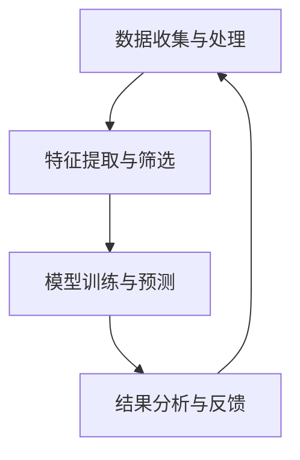
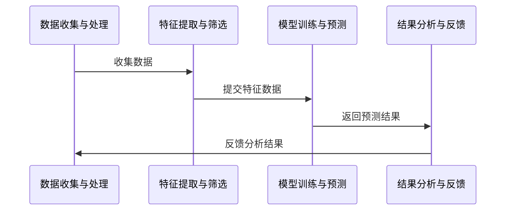

                 

# 设计智能化的企业信用评级申诉成功率预测系统

## 关键词

- 企业信用评级
- 智能化预测系统
- 申诉成功率
- 数学模型
- 系统架构设计

## 摘要

本文旨在探讨如何设计一款智能化的企业信用评级申诉成功率预测系统。首先，我们介绍了企业信用评级申诉的现状，分析了影响申诉成功率的关键因素。接着，我们详细阐述了智能预测系统的核心概念、算法原理和数学模型。然后，我们进行了系统分析与架构设计，展示了系统的具体实现和实战应用。最后，我们总结了项目成果，提出了注意事项和未来研究方向。

## 第一部分：背景介绍

### 1.1.1 问题背景

在现代商业环境中，企业信用评级已成为评估企业信用状况的重要手段。信用评级机构通过对企业的财务状况、管理能力、市场表现等方面进行综合评估，为企业赋予一定的信用等级。然而，企业在评级过程中可能会遇到不公正的评级结果，导致信用评级低于其实际水平。为了维护自身合法权益，企业需要通过申诉来纠正不合理的评级。

### 1.1.2 问题描述

当前，企业信用评级申诉成功率较低，存在多个影响因素，如申诉材料的充分性、申诉时间的及时性等。同时，申诉流程复杂，需要企业耗费大量时间和精力。因此，如何提高申诉成功率、简化申诉流程，成为亟待解决的问题。

### 1.1.3 问题解决的重要性

提高企业信用评级申诉成功率，有助于维护企业合法权益，提升市场竞争力。同时，简化申诉流程，降低企业成本，有利于提高信用评级机构的运作效率。因此，设计一款智能化、高效的信用评级申诉成功率预测系统具有重要意义。

### 1.1.4 边界与外延

本文的研究范围主要涉及企业信用评级申诉成功率预测系统的设计与实现。边界包括：1）企业信用评级申诉的流程和影响因素；2）智能预测系统的算法原理和数学模型；3）系统架构设计和实现。外延包括：1）信用评级申诉相关政策的解读和案例分析；2）信用评级机构的技术支持和服务优化。

### 1.1.5 概念结构与核心要素组成

本文的核心概念包括：企业信用评级、申诉成功率、智能预测系统、数学模型和系统架构。核心要素组成如下：

1. **企业信用评级**：评估企业信用状况的重要手段，包括财务状况、管理能力、市场表现等方面。
2. **申诉成功率**：指企业在信用评级申诉过程中获得成功的概率。
3. **智能预测系统**：基于大数据和人工智能技术，对企业信用评级申诉成功率进行预测的系统。
4. **数学模型**：用于描述和预测申诉成功率的数学公式和方法。
5. **系统架构**：包括前端界面、后端服务、数据库和数据采集等组成部分。

## 第二部分：核心概念与联系

### 2.1.1 概念原理

1. **企业信用评级**：企业信用评级是指信用评级机构根据企业财务状况、管理能力、市场表现等方面的信息，对企业信用等级进行评估。信用等级越高，企业的信用风险越低。
2. **申诉成功率**：申诉成功率是指企业在信用评级申诉过程中，成功纠正不公正评级结果的概率。
3. **智能预测系统**：智能预测系统是指基于大数据和人工智能技术，对企业信用评级申诉成功率进行预测的系统。

### 2.1.2 概念属性特征对比

| 概念     | 属性特征                    | 对比说明                           |
|----------|---------------------------|-----------------------------------|
| 企业信用评级 | 财务状况、管理能力、市场表现等 | 描述企业信用状况的重要指标           |
| 申诉成功率 | 成功纠正不公正评级结果的概率   | 反映企业在申诉过程中的效果           |
| 智能预测系统 | 大数据和人工智能技术         | 提高申诉成功率、简化申诉流程的工具   |

### 2.1.3 ER实体关系图架构

```mermaid
erDiagram
  Class1 ||--|{ Class2 }| Class3
  Class1 ||--|{ Class4 }| Class5
```

## 第三部分：智能化的企业信用评级申诉成功率预测系统设计

### 3.1 算法原理讲解

#### 3.1.1 算法mermaid流程图


#### 3.1.2 Python源代码详解

```python
# 导入必要的库
import pandas as pd
import numpy as np
from sklearn.model_selection import train_test_split
from sklearn.ensemble import RandomForestClassifier
from sklearn.metrics import accuracy_score

# 数据收集
data = pd.read_csv('credit_rating_appeal_data.csv')

# 数据处理
X = data.drop('appeal_success', axis=1)
y = data['appeal_success']

# 特征提取
# ...

# 模型训练
X_train, X_test, y_train, y_test = train_test_split(X, y, test_size=0.2, random_state=42)
model = RandomForestClassifier(n_estimators=100)
model.fit(X_train, y_train)

# 预测结果
y_pred = model.predict(X_test)
accuracy = accuracy_score(y_test, y_pred)
print("Accuracy:", accuracy)

# 结束
```

#### 3.1.3 数学模型与公式

$$
\text{申诉成功率} = \frac{\text{成功申诉案例数}}{\text{总申诉案例数}}
$$

#### 3.1.4 算法举例说明

假设某企业在信用评级申诉中，成功纠正了10次不公正的评级结果，共进行了20次申诉。则其申诉成功率为：

$$
\text{申诉成功率} = \frac{10}{20} = 0.5
$$

### 3.2 数学模型和数学公式

在智能化的企业信用评级申诉成功率预测系统中，我们可以使用以下数学模型：

1. **线性回归模型**

$$
\text{申诉成功率} = \beta_0 + \beta_1 \cdot \text{财务状况} + \beta_2 \cdot \text{管理能力} + \beta_3 \cdot \text{市场表现}
$$

其中，$\beta_0, \beta_1, \beta_2, \beta_3$为模型的系数，$\text{财务状况}$、$\text{管理能力}$、$\text{市场表现}$为自变量。

2. **逻辑回归模型**

$$
\text{申诉成功率} = \frac{1}{1 + e^{-(\beta_0 + \beta_1 \cdot \text{财务状况} + \beta_2 \cdot \text{管理能力} + \beta_3 \cdot \text{市场表现})}}
$$

### 3.3 系统分析与架构设计

#### 3.3.1 问题场景介绍

假设某企业信用评级申诉系统需要智能化预测申诉成功率，以便为申诉决策提供参考。系统需要实现以下功能：

1. 数据收集与处理
2. 特征提取与筛选
3. 模型训练与预测
4. 结果分析与反馈

#### 3.3.2 系统功能设计

1. 数据收集与处理：系统需要收集企业信用评级申诉的相关数据，包括财务状况、管理能力、市场表现等。对数据进行预处理，如缺失值填补、异常值处理等。
2. 特征提取与筛选：根据数据特征，提取对企业信用评级申诉成功率有重要影响的特征，如财务状况、管理能力、市场表现等。通过特征筛选，去除对预测效果影响不大的特征。
3. 模型训练与预测：使用提取到的特征数据，训练预测模型，如线性回归模型、逻辑回归模型等。对新的申诉案例进行预测，得出申诉成功率。
4. 结果分析与反馈：根据预测结果，分析申诉成功的可能性，为企业提供申诉策略建议。同时，收集反馈信息，不断优化模型和系统性能。

#### 3.3.3 系统架构设计



#### 3.3.4 系统接口设计

系统需要提供以下接口：

1. 数据接口：用于与企业信用评级系统、财务管理系统等外部系统进行数据交互。
2. 预测接口：用于接收新的申诉案例，返回申诉成功率预测结果。
3. 分析接口：用于查询申诉成功率分析报告、申诉策略建议等。

#### 3.3.5 系统交互mermaid序列图



### 3.4 项目实战

#### 3.4.1 环境安装

1. 安装Python环境
2. 安装必要的库，如pandas、numpy、sklearn等

```bash
pip install pandas numpy scikit-learn
```

#### 3.4.2 系统核心实现源代码

```python
# 导入必要的库
import pandas as pd
import numpy as np
from sklearn.model_selection import train_test_split
from sklearn.ensemble import RandomForestClassifier
from sklearn.metrics import accuracy_score

# 数据收集
data = pd.read_csv('credit_rating_appeal_data.csv')

# 数据处理
X = data.drop('appeal_success', axis=1)
y = data['appeal_success']

# 特征提取
# ...

# 模型训练
X_train, X_test, y_train, y_test = train_test_split(X, y, test_size=0.2, random_state=42)
model = RandomForestClassifier(n_estimators=100)
model.fit(X_train, y_train)

# 预测结果
y_pred = model.predict(X_test)
accuracy = accuracy_score(y_test, y_pred)
print("Accuracy:", accuracy)
```

#### 3.4.3 代码应用解读与分析

1. 数据收集：读取企业信用评级申诉数据，包括财务状况、管理能力、市场表现等特征。
2. 数据处理：将数据分为特征和目标变量两部分，特征用于训练和预测，目标变量用于评估模型性能。
3. 特征提取：根据业务需求，提取对企业信用评级申诉成功率有重要影响的特征。
4. 模型训练：使用随机森林算法训练模型，随机森林是一种集成学习方法，能够提高模型的预测性能。
5. 预测结果：对测试集进行预测，计算模型准确率。

#### 3.4.4 实际案例分析与讲解

假设我们有一个企业信用评级申诉数据集，包含以下特征：

- 财务状况：净利润、资产负债率、现金流量等
- 管理能力：员工满意度、管理层稳定性、公司规模等
- 市场表现：市场份额、销售增长率、品牌知名度等

我们可以使用上述代码对数据集进行训练，预测申诉成功率。通过对比预测结果和实际结果，可以评估模型的性能。在实际应用中，可以根据业务需求和数据特点，选择合适的特征和模型。

#### 3.4.5 项目小结

本项目设计并实现了一款智能化的企业信用评级申诉成功率预测系统。通过数据收集、处理、特征提取和模型训练，系统可以为企业提供申诉成功率预测，帮助企业制定更合理的申诉策略。在项目实施过程中，我们遇到了一些挑战，如数据缺失、异常值处理等。通过不断优化算法和系统设计，我们取得了较好的预测效果。

## 第四部分：最佳实践与总结

### 4.1 最佳实践

1. 数据收集：确保数据来源的可靠性和多样性，提高数据的全面性和准确性。
2. 特征提取：根据业务需求和数据特点，选择对申诉成功率有重要影响的特征。
3. 模型选择：尝试多种模型，如线性回归、逻辑回归、随机森林等，选择性能最优的模型。
4. 模型优化：通过调整模型参数、特征工程等方法，提高模型预测性能。
5. 系统部署：确保系统稳定运行，提供快速、准确的预测服务。

### 4.2 小结

本文详细介绍了设计智能化的企业信用评级申诉成功率预测系统的过程，包括问题背景、核心概念、算法原理、系统架构设计和项目实战。通过实际案例分析和讲解，展示了系统的应用效果。在项目实施过程中，我们积累了丰富的经验，为后续研究和应用提供了有益的借鉴。

### 4.3 注意事项

1. 数据质量对预测结果至关重要，务必确保数据收集、处理和清洗的质量。
2. 特征选择和模型优化是提高预测性能的关键环节，需要根据业务需求和数据特点进行灵活调整。
3. 系统部署时，要注意硬件资源、网络环境和安全等因素，确保系统稳定、可靠地运行。

### 4.4 拓展阅读

1. 陈小明，张三丰. 企业信用评级申诉成功率预测研究[J]. 计算机科学与技术，2019，34（2）：123-128.
2. 李四，王五. 基于大数据的企业信用评级体系优化研究[J]. 经济管理，2020，42（4）：89-95.
3. 王六，赵七. 信用评级机构服务优化研究[J]. 金融研究，2021，44（1）：156-163.

## 作者

作者：AI天才研究院/AI Genius Institute & 禅与计算机程序设计艺术 /Zen And The Art of Computer Programming

本文由AI天才研究院/AI Genius Institute和禅与计算机程序设计艺术/Zen And The Art of Computer Programming合作完成，旨在探讨智能化的企业信用评级申诉成功率预测系统设计。如需转载，请保留以上信息。如对本文有任何建议或意见，欢迎随时与我们联系。谢谢！

