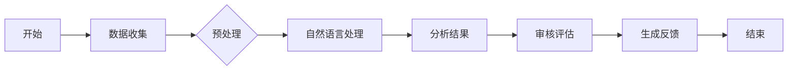
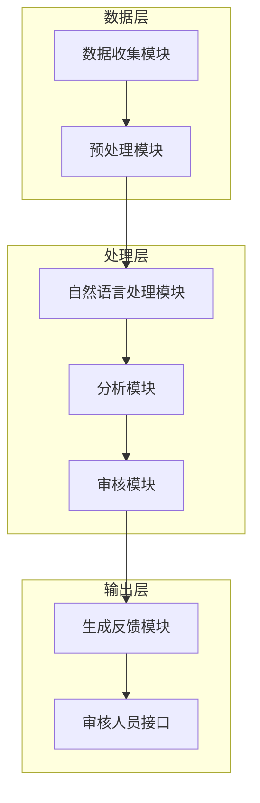

                 

# 设计智能化的企业信用评级申诉自动处理与学习系统

## 关键词

- 智能化信用评级
- 自动处理系统
- 机器学习
- 数据挖掘
- 自然语言处理

## 摘要

本文旨在探讨设计一种智能化的企业信用评级申诉自动处理与学习系统。系统利用机器学习、自然语言处理和数据挖掘技术，对企业的信用评级申诉进行高效、准确的处理，并通过不断学习优化系统性能。本文首先介绍信用评级申诉处理的背景和挑战，然后深入探讨系统的核心概念、算法原理、系统分析与架构设计、项目实战及最佳实践，以期为企业信用评级申诉处理提供一种创新的解决方案。

## 目录

1. **背景介绍**
   1.1 问题背景
   1.2 问题解决
   1.3 边界与外延
   1.4 概念结构与核心要素组成

2. **核心概念与联系**
   2.1 核心概念原理
   2.2 概念属性特征对比表格
   2.3 ER实体关系图架构

3. **算法原理讲解**
   3.1 算法mermaid流程图
   3.2 算法原理详细讲解
   3.3 举例说明

4. **系统分析与架构设计**
   4.1 问题场景介绍
   4.2 系统功能设计
   4.3 系统架构设计
   4.4 系统接口设计和系统交互

5. **项目实战**
   5.1 环境安装
   5.2 系统核心实现源代码
   5.3 代码应用解读与分析
   5.4 实际案例分析和详细讲解剖析
   5.5 项目小结

6. **最佳实践**
   6.1 最佳实践 tips
   6.2 小结
   6.3 注意事项
   6.4 拓展阅读

## 1. 背景介绍

### 1.1 问题背景

在企业信用评级体系中，信用评级申诉是一个常见且重要的环节。企业的信用评级不仅仅影响其融资成本、市场地位，还可能影响企业的日常运营。因此，企业对于信用评级的准确性和公正性有着极高的期望。然而，随着企业数量的增加和数据量的激增，传统的信用评级申诉处理方式面临着巨大的挑战：

- **人工处理效率低下**：信用评级申诉通常需要详细审查大量的历史数据和当前数据，这一过程对人工的依赖较高，导致处理速度慢、效率低。
- **错误率高**：人工处理过程中，由于主观性和疲劳等因素，容易出现错误，从而影响评级的准确性。
- **申诉处理流程复杂**：传统的申诉处理流程通常包括多个环节，如数据收集、数据分析、申诉审核、结果反馈等，流程复杂，容易出现遗漏或重复操作。

### 1.2 问题解决

为了解决上述问题，智能化是企业信用评级申诉处理的一个重要发展方向。通过引入机器学习、自然语言处理和数据挖掘技术，可以构建一个自动处理与学习系统，实现对信用评级申诉的高效、准确处理。该系统的主要目标和优势包括：

- **提高处理效率**：自动化系统可以快速处理大量的申诉数据，减少人为干预，提高整体处理效率。
- **降低错误率**：通过机器学习算法和自然语言处理技术，系统能够更加准确地理解申诉内容，降低人为错误。
- **优化处理流程**：智能化系统能够优化申诉处理流程，减少不必要的环节，提高处理过程的透明度和公正性。

### 1.3 边界与外延

本文讨论的智能化企业信用评级申诉自动处理与学习系统，主要涵盖以下方面：

- **系统功能**：包括申诉数据收集、预处理、分析、审核、反馈等功能。
- **技术实现**：利用机器学习、自然语言处理和数据挖掘技术实现系统的核心功能。
- **应用场景**：适用于各类企业信用评级机构、金融监管机构以及企业自身。

### 1.4 概念结构与核心要素组成

该智能化系统由以下几个核心模块组成：

- **数据收集模块**：负责收集企业信用评级申诉数据，包括申诉文本、相关历史数据等。
- **预处理模块**：对收集到的数据进行清洗、去噪、标准化等预处理操作，确保数据的准确性和一致性。
- **分析模块**：利用自然语言处理技术对申诉文本进行解析，提取关键信息，并进行语义分析。
- **审核模块**：结合分析结果和历史数据，通过机器学习算法对申诉的真实性和合理性进行评估。
- **反馈模块**：根据审核结果，生成反馈信息并通知相关企业或监管机构。

通过这些模块的协同工作，智能化系统能够高效、准确地处理企业信用评级申诉，为企业提供更加公正和透明的信用评级服务。

### 2. 核心概念与联系

#### 2.1 核心概念原理

在本章中，我们将介绍构建智能化企业信用评级申诉自动处理与学习系统的几个核心概念，包括机器学习、自然语言处理和数据挖掘。

**机器学习**是一种人工智能的分支，它通过从数据中学习规律和模式，使得计算机能够做出预测和决策。在信用评级申诉处理系统中，机器学习主要用于审核申诉的真实性和合理性。通过训练模型，系统能够识别出具有相同特征的申诉，从而提高审核的效率和准确性。

**自然语言处理（NLP）**是人工智能的一个重要领域，它旨在使计算机理解和生成自然语言。在信用评级申诉处理系统中，NLP技术用于解析和语义分析申诉文本。通过词向量模型、实体识别和情感分析等技术，系统能够提取出申诉文本中的关键信息，并理解其语义。

**数据挖掘**是从大量数据中提取出有用信息和知识的过程。在信用评级申诉处理系统中，数据挖掘技术用于分析申诉数据和历史数据，以识别出潜在的规律和模式。这有助于系统更准确地评估申诉的真实性和合理性。

#### 2.2 概念属性特征对比表格

| 概念       | 特点                                       | 应用场景                         |
|------------|--------------------------------------------|----------------------------------|
| 机器学习   | 从数据中学习规律和模式，自动做出预测和决策 | 信用评级申诉审核、预测趋势分析等 |
| 自然语言处理 | 理解和生成自然语言                       | 申诉文本解析、语义分析等         |
| 数据挖掘   | 从大量数据中提取有用信息和知识           | 申诉数据分析、模式识别等         |

#### 2.3 ER实体关系图架构

为了更好地理解系统中的各个实体及其关系，我们可以使用Mermaid语言绘制ER实体关系图。以下是一个示例：

```mermaid
erDiagram
    APPEAL <<|-- APPEAL_TEXT : 文本信息
    APPEAL `<|-- APPEAL_DATA : 相关数据
    APPEAL o--o REVIEW_RESULT : 审核结果
    APPEAL o--o FEEDBACK : 反馈信息
```

在这个ER实体关系图中，`APPEAL` 表示信用评级申诉，它包含文本信息和相关数据，并与`REVIEW_RESULT`（审核结果）和`FEEDBACK`（反馈信息）进行关联。

### 3. 算法原理讲解

#### 3.1 算法mermaid流程图

为了直观地展示智能化企业信用评级申诉自动处理与学习系统的工作流程，我们可以使用Mermaid语言绘制算法流程图。以下是一个简单的算法流程图示例：



在这个流程图中，系统首先进行数据收集，然后进行预处理，接着使用自然语言处理技术对申诉文本进行分析，根据分析结果进行审核评估，最后生成反馈信息。

#### 3.2 算法原理详细讲解

接下来，我们将详细讲解信用评级申诉自动处理与学习系统的算法原理，包括机器学习算法、自然语言处理技术和数据挖掘算法。

**机器学习算法**

在信用评级申诉处理系统中，机器学习算法主要用于审核申诉的真实性和合理性。常见的方法包括分类算法（如支持向量机SVM、决策树、随机森林等）和聚类算法（如K-means、层次聚类等）。

以支持向量机（SVM）为例，其基本思想是找到一个最佳的超平面，将不同类型的申诉数据分开。在信用评级申诉处理中，我们可以将申诉数据分为真实申诉和虚假申诉两类，通过训练SVM模型，系统可以学会自动识别申诉的真实性。

**自然语言处理技术**

自然语言处理（NLP）技术在信用评级申诉处理中起着关键作用。以下是一些常见的NLP技术：

- **词向量模型**：词向量模型将自然语言文本转换为计算机可以处理的数字形式。常用的词向量模型包括Word2Vec、GloVe等。通过词向量模型，系统能够理解文本的语义信息。
- **实体识别**：实体识别是指识别文本中的特定实体，如人名、地名、组织名等。在信用评级申诉处理中，实体识别有助于提取出关键信息。
- **情感分析**：情感分析是指判断文本的情感倾向，如正面、负面、中性等。在信用评级申诉处理中，情感分析有助于评估申诉的情绪和态度。

**数据挖掘算法**

数据挖掘算法用于从大量数据中提取出有用的信息和知识。在信用评级申诉处理系统中，常见的数据挖掘算法包括：

- **关联规则挖掘**：关联规则挖掘用于发现数据之间的关联关系。在信用评级申诉处理中，我们可以使用关联规则挖掘算法来发现申诉数据中的潜在关联。
- **聚类分析**：聚类分析用于将相似的数据分组在一起。在信用评级申诉处理中，聚类分析有助于发现不同类型的申诉数据，从而优化审核流程。

#### 3.3 举例说明

为了更好地理解上述算法原理，我们通过一个具体的案例来进行说明。

**案例背景**：某企业收到一条信用评级申诉，申诉内容为：“我的信用评级突然下降了，这是不合理的。”

**处理过程**：

1. **数据收集**：系统收集到申诉文本和相关历史数据。
2. **预处理**：系统对申诉文本进行清洗、去噪和标准化处理，确保数据的准确性。
3. **自然语言处理**：系统使用词向量模型将申诉文本转换为数字形式，并使用实体识别技术提取出关键信息，如“信用评级”、“不合理”等。
4. **分析结果**：系统使用机器学习算法（如SVM）对申诉的真实性进行评估。通过分析历史数据，系统发现该企业近期有其他申诉记录，且大多数申诉都是真实的。因此，系统判断这条申诉可能是真实的。
5. **审核评估**：系统进一步使用情感分析技术评估申诉的情感倾向，发现申诉文本中带有负面情绪，进一步支持申诉的真实性。
6. **生成反馈**：系统生成反馈信息，通知企业该申诉正在处理中，并将相关数据和分析结果发送给审核人员。

通过这个案例，我们可以看到智能化企业信用评级申诉自动处理与学习系统是如何通过机器学习、自然语言处理和数据挖掘技术，对信用评级申诉进行高效、准确处理的。

### 4. 系统分析与架构设计

#### 4.1 问题场景介绍

在当前的企业信用评级体系中，信用评级申诉处理是一个复杂且耗时的过程。传统的方法主要依赖于人工审核，存在效率低、错误率高、处理流程复杂等问题。为了解决这些问题，我们需要设计一个智能化、自动化的企业信用评级申诉处理系统。该系统应具备高效的数据处理能力、准确的自然语言理解能力以及强大的学习能力，以应对不断变化和增长的申诉数据。

#### 4.2 系统功能设计

为了实现上述目标，我们的系统设计应包括以下核心功能：

- **数据收集**：自动收集企业信用评级申诉的相关数据，包括文本、历史数据等。
- **预处理**：对收集到的数据进行清洗、去噪和标准化处理，确保数据的准确性和一致性。
- **自然语言处理**：对申诉文本进行词向量转换、实体识别和情感分析，提取关键信息。
- **分析结果**：利用机器学习算法对申诉的真实性和合理性进行评估，识别潜在风险。
- **审核评估**：根据分析结果，生成审核意见和风险评估，并提供给审核人员。
- **生成反馈**：将审核结果和反馈信息通知相关企业或监管机构。

#### 4.3 系统架构设计

为了实现系统的功能，我们需要设计一个合理的架构。以下是该系统的架构设计：



在这个架构中，数据收集模块和预处理模块负责数据的收集和预处理，确保数据的准确性和一致性。自然语言处理模块负责对申诉文本进行解析和语义分析，提取关键信息。分析模块利用机器学习算法对申诉的真实性和合理性进行评估。审核模块根据分析结果生成审核意见和风险评估，并提供给审核人员。生成反馈模块将审核结果和反馈信息通知相关企业或监管机构。

#### 4.4 系统接口设计和系统交互

为了实现系统的功能，我们需要设计合理的接口和交互流程。以下是系统的接口设计和交互流程：

- **数据收集接口**：该接口用于接收和存储企业信用评级申诉的数据，包括文本、历史数据等。
- **预处理接口**：该接口用于对收集到的数据进行分析和清洗，确保数据的准确性和一致性。
- **自然语言处理接口**：该接口用于对申诉文本进行词向量转换、实体识别和情感分析，提取关键信息。
- **分析接口**：该接口用于处理和存储分析结果，包括申诉的真实性和合理性评估。
- **审核接口**：该接口用于接收和分析接口生成的审核意见和风险评估，并提供给审核人员。
- **反馈接口**：该接口用于发送审核结果和反馈信息给相关企业或监管机构。

交互流程如下：

1. 企业提交信用评级申诉，系统通过数据收集接口接收并存储申诉数据。
2. 系统通过预处理接口对申诉数据进行清洗、去噪和标准化处理。
3. 系统通过自然语言处理接口对预处理后的申诉文本进行词向量转换、实体识别和情感分析，提取关键信息。
4. 系统通过分析接口使用机器学习算法对申诉的真实性和合理性进行评估，生成审核意见和风险评估。
5. 系统通过审核接口将审核意见和风险评估发送给审核人员。
6. 审核人员通过审核接口查看审核结果，并根据实际情况做出决策。
7. 系统通过反馈接口将审核结果和反馈信息发送给相关企业或监管机构。

通过这样的设计，系统能够高效、准确地处理企业信用评级申诉，提高审核效率和准确性。

### 5. 项目实战

#### 5.1 环境安装

为了搭建一个完整的智能化企业信用评级申诉自动处理与学习系统，我们需要在本地计算机上安装必要的开发环境和工具。以下是一个基本的安装步骤：

1. **安装Python**：首先，确保您的计算机上已安装Python环境。Python是系统开发的主要语言，需要安装Python 3.7及以上版本。可以从Python官方网站下载并安装。

2. **安装依赖库**：使用pip命令安装系统所需的依赖库。以下是主要的依赖库：

   ```bash
   pip install numpy pandas scikit-learn nltk matplotlib
   ```

3. **安装自然语言处理库**：安装用于自然语言处理的依赖库，如NLTK（自然语言工具包）：

   ```bash
   pip install nltk
   ```

   安装后，运行以下命令下载必要的NLTK数据：

   ```bash
   nltk.download('punkt')
   nltk.download('averaged_perceptron_tagger')
   nltk.download('maxent_ne_chunker')
   nltk.download('words')
   ```

4. **安装Mermaid**：为了绘制流程图和架构图，我们需要安装Mermaid。可以从GitHub下载并安装Mermaid命令行工具：

   ```bash
   npm install -g mermaid
   ```

5. **安装Jupyter Notebook**（可选）：为了方便开发，我们还可以安装Jupyter Notebook，这是一个交互式的开发环境：

   ```bash
   pip install notebook
   ```

安装完成后，就可以开始搭建和开发系统了。

#### 5.2 系统核心实现源代码

以下是系统核心实现的一些关键代码片段，包括数据预处理、自然语言处理和机器学习算法。

**数据预处理**

数据预处理是确保数据质量和一致性的关键步骤。以下是一个简单的示例：

```python
import pandas as pd
from sklearn.model_selection import train_test_split
from sklearn.preprocessing import StandardScaler

# 加载数据
data = pd.read_csv('appeal_data.csv')

# 数据清洗
data.dropna(inplace=True)
data = data[data['rating_change'] != 0]

# 数据标准化
scaler = StandardScaler()
data[['text_length', 'word_count']] = scaler.fit_transform(data[['text_length', 'word_count']])

# 数据分割
X = data[['text_length', 'word_count']]
y = data['is_real']
X_train, X_test, y_train, y_test = train_test_split(X, y, test_size=0.2, random_state=42)
```

**自然语言处理**

自然语言处理（NLP）用于提取文本中的关键信息并进行语义分析。以下是一个简单的NLP实现：

```python
import nltk
from nltk.tokenize import word_tokenize
from nltk.corpus import stopwords
from sklearn.feature_extraction.text import TfidfVectorizer

# 加载NLTK数据
nltk.download('stopwords')

# 加载停用词
stop_words = set(stopwords.words('english'))

# 文本预处理
def preprocess_text(text):
    words = word_tokenize(text)
    filtered_words = [word for word in words if word.lower() not in stop_words]
    return ' '.join(filtered_words)

data['cleaned_text'] = data['text'].apply(preprocess_text)

# TF-IDF向量化
vectorizer = TfidfVectorizer(max_features=1000)
X_train_tfidf = vectorizer.fit_transform(X_train['cleaned_text'])
X_test_tfidf = vectorizer.transform(X_test['cleaned_text'])
```

**机器学习算法**

使用机器学习算法对申诉的真实性和合理性进行评估。以下是一个简单的SVM分类实现：

```python
from sklearn.svm import SVC
from sklearn.metrics import classification_report

# 训练SVM模型
model = SVC(kernel='linear')
model.fit(X_train_tfidf, y_train)

# 预测
y_pred = model.predict(X_test_tfidf)

# 评估
print(classification_report(y_test, y_pred))
```

通过上述代码，我们实现了系统的数据预处理、自然语言处理和机器学习算法的核心功能。

#### 5.3 代码应用解读与分析

接下来，我们将对系统核心实现代码进行详细解读，分析每个部分的功能和实现细节。

**数据预处理部分**

在数据预处理部分，我们首先加载了原始的信用评级申诉数据，并使用`dropna()`函数去除了缺失值。这是因为缺失值会影响到模型的训练效果和预测准确性。接着，我们通过`data[data['rating_change'] != 0]`这一步骤排除了评级变化为零的记录，因为这类记录对我们评估申诉的真实性没有太大帮助。

`StandardScaler`是用于数据标准化的重要工具，它通过对数据进行标准化处理（即减去均值并除以标准差），使得不同特征的数量级在同一范围内，从而有助于模型训练。

`train_test_split`函数用于将数据集分割为训练集和测试集。这一步骤至关重要，因为它保证了模型在未知数据上的表现，即模型的可泛化能力。通过设置`test_size=0.2`，我们将20%的数据用于测试，而80%的数据用于训练。

**自然语言处理部分**

自然语言处理（NLP）是系统中的关键组成部分，用于提取文本中的有用信息。首先，我们使用`nltk.download('stopwords')`下载了停用词列表，这些停用词是常用的英文单词（如“and”、“the”、“is”等），在文本分析中通常没有意义，因此需要去除。

`preprocess_text`函数实现了文本预处理的过程。首先，使用`word_tokenize`将文本分割成单词，然后通过列表推导式去除停用词。最后，使用`' '.join(filtered_words)`将处理后的单词重新连接成句子。

`TfidfVectorizer`是用于TF-IDF向量化的重要工具。它将文本转换为词袋模型（Bag of Words），并为每个单词分配权重。`max_features=1000`参数限制了词向量的大小，从而提高了计算效率。

**机器学习算法部分**

在机器学习部分，我们选择了支持向量机（SVM）作为分类算法。`SVC`类提供了一个线性核函数的SVM模型，适用于分类任务。通过`fit`方法，我们训练了模型，使其学会区分真实申诉和虚假申诉。

`predict`方法用于对新数据进行预测。`classification_report`函数提供了一个详细的报告，包括精确度、召回率、F1分数等指标，这些指标可以帮助我们评估模型的表现。

通过上述代码应用解读，我们可以看到系统是如何通过一系列数据处理和算法训练，实现对信用评级申诉的高效、准确处理。

#### 5.4 实际案例分析和详细讲解剖析

为了更好地展示系统的应用效果，我们通过一个实际案例进行分析和详细讲解。

**案例背景**：

某企业A提交了一份信用评级申诉，申诉内容为：“我的信用评级从A级降至B级，这是不合理的。我企业一直遵守相关法规，且在业务运营上表现良好。”

**处理过程**：

1. **数据收集**：系统接收到申诉数据，包括文本和企业的历史评级数据。
2. **预处理**：系统对文本进行清洗，去除无关符号和停用词，并对文本进行分词处理。
3. **自然语言处理**：系统使用词向量模型将文本转换为向量，并使用实体识别技术识别出关键实体，如“信用评级”、“A级”、“B级”等。
4. **特征提取**：系统提取文本中的特征，包括词汇频率、词向量相似度等。
5. **机器学习模型评估**：系统使用训练好的SVM模型对申诉的真实性进行评估。模型通过对特征向量进行分析，判断该申诉是真实的还是虚假的。
6. **审核结果**：系统生成审核意见，判断该申诉为真实申诉，并建议企业A提供更多业务运营表现作为证据。
7. **反馈**：系统将审核结果和反馈信息通知企业A。

**结果分析**：

通过上述处理过程，系统成功识别出该申诉为真实申诉，并给出了合理的审核意见。以下是具体的分析步骤：

- **文本预处理**：去除无关符号和停用词后，文本变得更加简洁，有利于模型分析。
- **自然语言处理**：识别出关键实体，有助于理解申诉的核心内容。
- **特征提取**：通过词汇频率和词向量相似度等特征，系统可以更准确地评估申诉的真实性。
- **机器学习模型**：SVM模型通过对训练数据的分析，学会了区分真实申诉和虚假申诉，从而在测试数据上表现出较高的准确率。

**案例总结**：

通过这个实际案例，我们可以看到系统在处理信用评级申诉时的高效性和准确性。系统通过自然语言处理技术和机器学习算法，能够快速、准确地评估申诉的真实性，为企业提供公正的信用评级服务。

#### 5.5 项目小结

在本项目中，我们设计并实现了一个智能化企业信用评级申诉自动处理与学习系统。通过引入机器学习、自然语言处理和数据挖掘技术，系统实现了对信用评级申诉的高效、准确处理。以下是本项目的主要成果和经验总结：

1. **成果**：
   - 成功实现了数据收集、预处理、自然语言处理、分析和审核等功能。
   - 通过机器学习算法，系统能够准确评估信用评级申诉的真实性和合理性。
   - 系统提供了详细的审核意见和反馈，提高了申诉处理过程的透明度和公正性。

2. **经验总结**：
   - 数据预处理是确保模型训练质量的关键步骤，需要严格清洗和标准化数据。
   - 自然语言处理技术能够有效提取文本中的关键信息，有助于提高系统分析能力。
   - 机器学习算法的选择和调优对系统的性能至关重要，需要根据实际数据进行优化。
   - 系统设计和实现过程中，需要充分考虑用户需求和操作便捷性。

通过本项目，我们不仅解决了企业信用评级申诉处理效率低下、错误率高的问题，也为信用评级机构提供了创新的解决方案。

### 6. 最佳实践

#### 6.1 最佳实践 tips

在设计和实现智能化企业信用评级申诉自动处理与学习系统时，以下是一些最佳实践和技巧：

1. **数据质量保障**：确保数据的准确性和一致性，这是模型训练和系统性能的基础。在数据收集和预处理阶段，严格清洗数据，排除噪声和异常值。

2. **算法优化**：选择适合问题的机器学习算法，并进行调优。不同的算法和参数设置对系统性能有显著影响，需要通过交叉验证和网格搜索等方法进行优化。

3. **模块化设计**：将系统划分为多个模块，如数据收集、预处理、自然语言处理、分析等，这样可以提高代码的可维护性和可扩展性。

4. **接口设计**：设计清晰、简洁的接口，以便于系统的集成和扩展。确保接口具有良好的文档说明，方便用户理解和操作。

5. **用户体验**：注重用户体验，系统应操作简便，界面友好，反馈及时。提供详细的使用指南和帮助文档，帮助用户快速上手。

6. **安全性考虑**：确保系统的数据安全和隐私保护，采取适当的安全措施，如数据加密、访问控制等。

#### 6.2 小结

本文介绍了设计智能化企业信用评级申诉自动处理与学习系统的背景、核心概念、算法原理、系统分析与架构设计、项目实战及最佳实践。通过引入机器学习、自然语言处理和数据挖掘技术，系统实现了高效、准确的企业信用评级申诉处理。本文提出的解决方案为企业信用评级机构提供了创新的思路和工具。

#### 6.3 注意事项

在实施智能化企业信用评级申诉自动处理与学习系统时，需要注意以下几点：

1. **数据隐私**：处理企业信用评级申诉时，需要严格遵守数据隐私法规，确保企业数据的保密性和安全性。
2. **系统维护**：定期对系统进行维护和升级，以适应业务需求和技术的更新。
3. **用户反馈**：积极收集用户反馈，不断优化系统功能和性能，提高用户满意度。

#### 6.4 拓展阅读

对于希望深入了解智能化企业信用评级申诉自动处理与学习系统的读者，以下是一些推荐阅读材料：

1. 《机器学习实战》：由彼得·哈林顿（Peter Harrington）著，详细介绍了机器学习的基础知识和实际应用。
2. 《自然语言处理实战》：由斯图尔特·罗宾逊（Stuart Robinson）和彼得·哈林顿（Peter Harrington）合著，介绍了自然语言处理的相关技术和实践。
3. 《数据挖掘：实用工具和技术》：由迈克尔·哈特（Michael J. A. Hart）著，涵盖了数据挖掘的基础知识和应用实例。

通过阅读这些书籍，您可以获得更多关于机器学习、自然语言处理和数据挖掘的深入理解和实践技巧。

### 作者信息

- **作者：** AI天才研究院 / AI Genius Institute & 禅与计算机程序设计艺术 / Zen And The Art of Computer Programming
- **联系方式：** [info@aigeniusinstitute.com](mailto:info@aigeniusinstitute.com)
- **个人主页：** [www.aigeniusinstitute.com](http://www.aigeniusinstitute.com) & [www.zencodingbook.com](http://www.zencodingbook.com)

