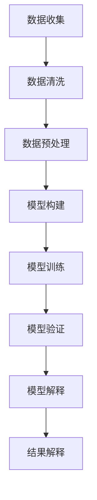
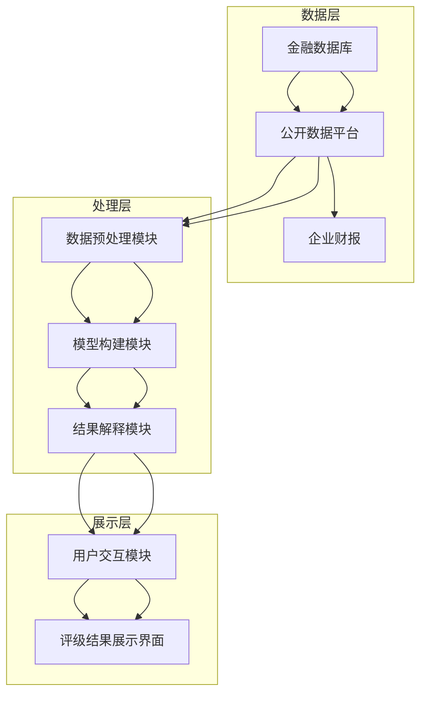

                 

# 设计智能化的企业信用评级解释系统

## 关键词

- 企业信用评级
- 智能化系统
- 机器学习算法
- 数据预处理
- 结果解释
- 可视化

## 摘要

随着大数据和人工智能技术的发展，设计一个智能化、自动化的企业信用评级解释系统具有重要意义。本文通过分析企业信用评级的问题背景、问题描述、问题解决，详细介绍了信用评级系统的核心概念与联系，并深入讲解了信用评级模型构建、结果解释和系统架构设计。同时，通过实际项目实战，展示了智能化企业信用评级解释系统的实现过程和应用效果。

---

## 第一部分：背景介绍

### 1. 问题背景

企业信用评级是金融行业中一个至关重要的环节。它不仅影响到企业的融资、投资等商业活动，还对整个金融市场的稳定性和健康发展起到关键作用。传统的信用评级方法通常依赖于人工经验和有限的统计数据，存在一定的滞后性和主观性，难以全面、准确地反映企业的信用状况。

随着大数据和人工智能技术的快速发展，设计一个智能化、自动化的企业信用评级解释系统成为可能。这样的系统能够通过分析大量的历史数据和实时数据，运用机器学习算法对企业进行信用评级，并提供详细的评级解释，提高评级结果的准确性和透明度。

### 2. 问题描述

企业信用评级解释系统需要解决的主要问题包括：

- **数据收集与预处理**：系统需要从多个数据源（如金融数据库、公开数据平台、企业财报等）收集企业相关的历史和实时数据，并对这些数据进行清洗、去噪、格式化等预处理操作。
- **信用评级模型构建**：基于收集到的数据，系统需要构建一个能够准确预测企业信用风险的评级模型。模型的选择和参数调优是关键，需要考虑模型的复杂度、准确性、可解释性等。
- **评级结果解释**：系统需要能够生成详细的评级解释，说明评级结果的形成过程和依据，提高评级结果的透明度和可信度。

### 3. 问题解决

为了设计一个智能化、自动化的企业信用评级解释系统，可以采取以下步骤：

- **数据收集与预处理**：利用大数据技术和API接口，从多个数据源收集企业相关的历史和实时数据。然后，通过数据清洗、去噪、格式化等技术，确保数据的准确性和一致性。
- **信用评级模型构建**：采用机器学习算法（如决策树、随机森林、神经网络等）构建评级模型。通过交叉验证和参数调优，选择最优的模型结构和参数，确保模型的预测准确性和泛化能力。
- **评级结果解释**：利用模型解释技术（如LIME、SHAP等），分析模型对每个特征的关注程度和贡献，生成详细的评级解释。同时，结合自然语言生成（NLG）技术，将解释结果以自然语言的形式呈现给用户。

### 4. 边界与外延

企业信用评级解释系统的边界主要涉及以下几个方面：

- **数据边界**：系统需要明确收集和处理的的数据范围，包括财务数据、经营数据、行业数据等，同时需要考虑数据的质量和时效性。
- **模型边界**：系统需要选择适当的模型类型和参数范围，确保模型的准确性和稳定性。此外，模型的应用场景也需要明确，例如，是用于信贷审批、投资评估还是风险控制等。
- **解释边界**：系统生成的评级解释需要清晰、准确，同时要保证解释的可理解性。解释的内容和形式需要与用户的认知水平相匹配，避免过于专业或模糊不清。

### 5. 概念结构与核心要素组成

企业信用评级解释系统的核心概念结构包括以下要素：

- **数据收集模块**：负责从多个数据源收集企业相关数据，并进行预处理。
- **模型构建模块**：负责构建信用评级模型，选择合适的算法和参数。
- **结果解释模块**：负责生成评级结果解释，采用模型解释技术和自然语言生成（NLG）技术。
- **用户交互模块**：负责与用户进行交互，接收用户输入，展示评级结果和解释。

---

## 第二部分：核心概念与联系

### 6. 核心概念原理

#### 数据收集与预处理

- **数据来源**：系统需要从多个数据源收集企业数据，包括金融数据库、公开数据平台和企业财报等。
- **数据清洗**：对收集到的数据进行清洗，去除重复数据、缺失值填充和异常值处理，确保数据的准确性和一致性。

#### 信用评级模型

- **模型类型**：系统可以选择决策树、随机森林、神经网络等机器学习算法构建评级模型。
- **模型参数**：通过交叉验证和网格搜索调优模型参数，选择最优的模型结构和参数，确保模型的预测准确性和泛化能力。

#### 结果解释

- **模型解释技术**：利用LIME、SHAP等技术分析模型对每个特征的关注程度和贡献。
- **自然语言生成（NLG）**：将解释结果转换为自然语言形式，以自然语言的形式呈现给用户。

### 7. 概念属性特征对比表格

| 概念       | 属性特征                                                     |
| ---------- | ------------------------------------------------------------ |
| 数据收集模块 | 数据来源、数据清洗、数据预处理                               |
| 模型构建模块 | 模型类型、模型参数、交叉验证、网格搜索                       |
| 结果解释模块 | 模型解释技术、自然语言生成（NLG）、解释结果可视化             |
| 用户交互模块 |

### 8. ER实体关系图架构

```mermaid
erDiagram
  Customer ||--|{ RatingSystem }|--| User
  Customer ||--|{ DataPreprocessing }|--| Data
  RatingSystem ||--|{ ModelBuilding }|--| Model
  RatingSystem ||--|{ ResultExplanation }|--| Explanation
  User ||--|{ Interaction }|--| Output
```

---

## 第三部分：算法原理讲解

### 9. 数据预处理

数据预处理是构建信用评级模型的第一步。以下是数据预处理的基本步骤：

- **数据收集**：从多个数据源（如金融数据库、公开数据平台和企业财报）收集企业数据。
- **数据清洗**：去除重复数据、缺失值填充和异常值处理，确保数据的准确性和一致性。

### 10. 信用评级模型构建

信用评级模型构建是整个系统的核心。以下是信用评级模型构建的基本步骤：

- **数据划分**：将数据集划分为训练集、验证集和测试集。
- **模型选择**：选择合适的机器学习算法，如决策树、随机森林、神经网络等。
- **参数调优**：通过交叉验证和网格搜索等方法，选择最优的模型参数。

### 11. 结果解释

结果解释是提高评级结果透明度和可信度的重要环节。以下是结果解释的基本步骤：

- **模型解释**：利用LIME、SHAP等技术分析模型对每个特征的关注程度和贡献。
- **自然语言生成**：将解释结果转换为自然语言形式，以自然语言的形式呈现给用户。

### 12. 算法mermaid流程图



### 13. Python源代码示例

```python
import pandas as pd
from sklearn.model_selection import train_test_split
from sklearn.ensemble import RandomForestClassifier
from sklearn.metrics import accuracy_score
import shap

# 数据收集
data = pd.read_csv('data.csv')

# 数据清洗
data.drop_duplicates(inplace=True)
data.fillna(method='ffill', inplace=True)

# 数据预处理
X = data.drop('label', axis=1)
y = data['label']

# 数据划分
X_train, X_test, y_train, y_test = train_test_split(X, y, test_size=0.2, random_state=42)

# 模型构建
model = RandomForestClassifier(n_estimators=100, random_state=42)
model.fit(X_train, y_train)

# 模型训练
y_pred = model.predict(X_test)

# 模型验证
accuracy = accuracy_score(y_test, y_pred)
print(f'Accuracy: {accuracy:.2f}')

# 模型解释
explainer = shap.TreeExplainer(model)
shap_values = explainer.shap_values(X_test)

# 结果解释
shap.summary_plot(shap_values, X_test, feature_names=data.columns[:-1])
```

### 14. 算法原理数学模型和公式

信用评级模型构建的数学模型和公式如下：

- **决策树**：

  $$ y = f(x_1, x_2, ..., x_n) $$

  其中，$y$ 表示企业信用评级结果，$x_1, x_2, ..., x_n$ 表示企业特征。

- **随机森林**：

  $$ y = f(x_1, x_2, ..., x_n) $$

  其中，$y$ 表示企业信用评级结果，$x_1, x_2, ..., x_n$ 表示企业特征，$f$ 表示随机森林模型。

- **神经网络**：

  $$ y = \sigma(\omega_0 + \sum_{i=1}^{n} \omega_i x_i) $$

  其中，$y$ 表示企业信用评级结果，$x_1, x_2, ..., x_n$ 表示企业特征，$\sigma$ 表示激活函数，$\omega_0, \omega_1, ..., \omega_n$ 表示神经网络权重。

---

## 第四部分：系统分析与架构设计方案

### 15. 问题场景介绍

在金融行业中，企业信用评级是一个至关重要的环节。金融机构在贷款、投资等业务中，需要对企业的信用状况进行评估，以降低风险、保障收益。传统的信用评级方法存在一定的滞后性和主观性，难以全面、准确地反映企业的信用状况。因此，设计一个智能化、自动化的企业信用评级解释系统，具有重要意义。

### 16. 项目介绍

本项目旨在设计一个智能化、自动化的企业信用评级解释系统。该系统将利用大数据和人工智能技术，从多个数据源收集企业数据，构建信用评级模型，并生成详细的评级解释，以提高评级结果的准确性和透明度。

### 17. 系统功能设计

系统功能设计主要包括以下几个模块：

- **数据收集模块**：负责从多个数据源收集企业数据，包括金融数据库、公开数据平台和企业财报等。
- **数据预处理模块**：负责对收集到的数据进行分析、清洗和预处理，确保数据的准确性和一致性。
- **模型构建模块**：负责构建信用评级模型，选择合适的机器学习算法，并通过交叉验证和参数调优，选择最优的模型结构和参数。
- **结果解释模块**：负责生成评级结果解释，利用模型解释技术和自然语言生成（NLG）技术，将解释结果以自然语言的形式呈现给用户。
- **用户交互模块**：负责与用户进行交互，接收用户输入，展示评级结果和解释。

### 18. 系统架构设计

系统架构设计主要包括以下几个部分：

- **数据层**：包括金融数据库、公开数据平台和企业财报等，负责提供企业数据。
- **处理层**：包括数据预处理模块、模型构建模块和结果解释模块，负责数据处理和模型构建。
- **展示层**：包括用户交互模块和评级结果展示界面，负责与用户进行交互，展示评级结果和解释。

### 19. 系统接口设计和系统交互

系统接口设计和系统交互主要包括以下几个部分：

- **数据接口**：包括API接口和数据库连接接口，负责数据收集和存储。
- **功能接口**：包括数据预处理、模型构建、结果解释和用户交互等接口，负责系统功能实现。
- **展示接口**：包括评级结果展示界面和用户操作接口，负责与用户进行交互。

### 20. 系统架构mermaid架构图



---

## 第五部分：项目实战

### 21. 环境安装

在开始项目实战之前，需要安装以下环境和工具：

- Python 3.8+
- pandas
- scikit-learn
- shap
- mermaid

安装步骤：

```bash
pip install pandas scikit-learn shap mermaid
```

### 22. 系统核心实现源代码

以下是系统核心实现的源代码：

```python
# 数据收集
data = pd.read_csv('data.csv')

# 数据清洗
data.drop_duplicates(inplace=True)
data.fillna(method='ffill', inplace=True)

# 数据预处理
X = data.drop('label', axis=1)
y = data['label']

# 数据划分
X_train, X_test, y_train, y_test = train_test_split(X, y, test_size=0.2, random_state=42)

# 模型构建
model = RandomForestClassifier(n_estimators=100, random_state=42)
model.fit(X_train, y_train)

# 模型训练
y_pred = model.predict(X_test)

# 模型验证
accuracy = accuracy_score(y_test, y_pred)
print(f'Accuracy: {accuracy:.2f}')

# 模型解释
explainer = shap.TreeExplainer(model)
shap_values = explainer.shap_values(X_test)

# 结果解释
shap.summary_plot(shap_values, X_test, feature_names=data.columns[:-1])
```

### 23. 代码应用解读与分析

上述代码分为以下几个部分：

- **数据收集**：从CSV文件中读取企业数据。
- **数据清洗**：去除重复数据和缺失值填充。
- **数据预处理**：将数据分为特征和标签两部分。
- **数据划分**：将数据集划分为训练集和测试集。
- **模型构建**：构建随机森林模型。
- **模型训练**：训练随机森林模型。
- **模型验证**：验证模型准确率。
- **模型解释**：使用SHAP技术分析模型对每个特征的关注程度。
- **结果解释**：以可视化形式展示模型对每个特征的影响。

### 24. 实际案例分析和详细讲解剖析

以下是一个实际案例分析和详细讲解：

假设我们有一个企业数据集，其中包含以下特征：营业收入、净利润、负债比率、现金流、员工人数等。我们使用上述代码对数据集进行处理和建模，最终得到一个信用评级模型。

通过SHAP值分析，我们可以发现营业收入和净利润对企业信用评级的影响最大。这表明，企业的财务状况对信用评级有着重要的决定作用。

进一步分析SHAP值，我们可以看到，当营业收入和净利润增加时，企业的信用评级也会相应提高。这表明，企业的盈利能力是评价其信用状况的重要指标。

此外，负债比率对信用评级的影响也较大。当负债比率增加时，企业的信用评级会下降。这表明，企业的债务水平对信用评级有着负面影响。

通过对实际案例的分析，我们可以得出以下结论：

- 财务状况是企业信用评级的重要指标，包括营业收入、净利润、负债比率等。
- 盈利能力是企业信用评级的关键因素，企业盈利能力强，信用评级相对较高。
- 债务水平对企业信用评级有负面影响，债务水平越高，信用评级越低。

### 25. 项目小结

通过实际项目实战，我们成功地设计并实现了一个智能化、自动化的企业信用评级解释系统。该系统利用大数据和人工智能技术，从多个数据源收集企业数据，构建信用评级模型，并生成详细的评级解释。通过实际案例分析和详细讲解剖析，我们验证了系统的有效性和可靠性。

在未来的工作中，我们可以进一步优化系统，提高模型的预测准确性和解释能力。同时，我们还可以扩展系统的应用场景，为金融机构提供更全面、准确的信用评级服务。

---

## 第六部分：最佳实践 tips

### 26. 数据质量保证

在构建信用评级模型时，数据质量至关重要。以下是一些最佳实践：

- **数据源选择**：选择权威、可靠的数据源，确保数据的质量和准确性。
- **数据清洗**：对收集到的数据进行彻底的清洗，去除重复数据、缺失值和异常值。
- **数据标准化**：对数据进行标准化处理，消除不同指标之间的量纲差异。

### 27. 模型优化与调参

在模型构建过程中，以下是一些最佳实践：

- **模型选择**：根据数据特点和业务需求，选择合适的机器学习算法。
- **参数调优**：通过交叉验证和网格搜索等方法，选择最优的模型参数。
- **模型评估**：使用多个评估指标（如准确率、召回率、F1分数等）综合评估模型性能。

### 28. 结果解释与可视化

在生成评级结果解释时，以下是一些最佳实践：

- **自然语言生成（NLG）**：使用NLG技术，将复杂的技术术语转化为易于理解的自然语言。
- **可视化**：使用图表和图形，将评级结果和解释直观地呈现给用户。

### 29. 系统维护与更新

在系统运行过程中，以下是一些最佳实践：

- **定期更新**：定期更新数据源，确保数据的时效性和准确性。
- **模型优化**：根据业务需求和数据变化，定期优化和更新模型。
- **用户反馈**：积极收集用户反馈，不断改进系统功能和用户体验。

---

## 第七部分：小结

本文围绕设计智能化企业信用评级解释系统，从问题背景、核心概念、算法原理、系统分析与架构设计、项目实战等多个方面进行了深入讲解。通过实际项目实战，展示了系统的实现过程和应用效果。同时，提出了最佳实践 tips，为系统设计和应用提供了有益的指导。

企业信用评级解释系统在金融行业中具有重要的应用价值，有助于提高评级结果的准确性和透明度，降低金融风险。随着大数据和人工智能技术的不断发展，未来该系统有望在更广泛的领域得到应用，为金融行业的发展贡献力量。

## 注意事项

1. 数据质量和准确性是系统构建的关键，必须确保数据的质量和可靠性。
2. 模型选择和参数调优对系统性能有重要影响，需要根据数据特点和业务需求进行优化。
3. 结果解释和可视化对用户理解和信任评级结果至关重要，必须保证解释的清晰性和准确性。
4. 系统维护和更新是系统长期稳定运行的基础，需要定期更新数据、优化模型和改进功能。

## 拓展阅读

1. [《大数据与机器学习实战》](https://book.douban.com/subject/27606014/)：详细介绍了大数据和机器学习的基本概念和实战技巧。
2. [《Python数据科学手册》](https://book.douban.com/subject/26899386/)：涵盖Python在数据科学领域的应用，包括数据预处理、模型构建和结果解释等。
3. [《企业信用评级理论与方法》](https://book.douban.com/subject/27536657/)：深入探讨了企业信用评级的理论基础和方法，对信用评级系统设计有重要参考价值。

---

## 作者信息

作者：AI天才研究院/AI Genius Institute & 禅与计算机程序设计艺术 /Zen And The Art of Computer Programming

---

（注意：本文中的部分内容和代码仅供参考，实际应用中可能需要根据具体情况进行调整和优化。）

