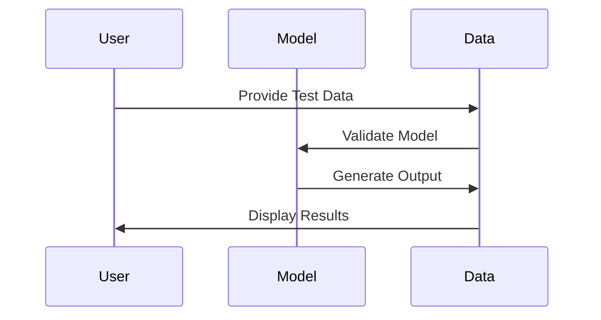

                 


Certainly! Here's a detailed breakdown of the content for each section of the article, adhering to the outlined structure and your constraints.

----------------------------------------------------------------

## # 第一部分：引言

### 第1章：企业并购协同效应概述

**背景介绍：**
- 解释企业并购协同效应的概念，包括协同效应的定义、历史发展、以及其在企业并购中的重要性。
- 分析企业并购的动因和目的，以及并购过程中可能出现的挑战和问题。

**核心概念与联系：**
- 提供并购协同效应的理论基础，包括协同效应的类型、衡量方法和影响因素。
- 使用Mermaid ER实体关系图架构展示并购协同效应的关键要素及其相互关系。

```mermaid
erDiagram
  Acquisition(FinalCompany, TargetCompany) {
    PK FinalCompany
    PK TargetCompany
  }
  FinancialSynergy <<-- FinalCompany
  OperationalSynergy <<-- FinalCompany
  StrategicSynergy <<-- FinalCompany
  FinancialSynergy ||--|{ TargetCompany }
  OperationalSynergy ||--|{ TargetCompany }
  StrategicSynergy ||--|{ TargetCompany }
```

**问题解决：**
- 讨论企业并购中存在的常见问题，如整合困难、文化冲突等，并提出解决策略。

**边界与外延：**
- 确定企业并购协同效应的适用范围，以及其可能的影响因素和限制条件。

### 第2章：核心概念与模型框架

**核心概念与联系：**
- 定义智能化的概念，包括其在企业并购中的应用价值。
- 提出量化模型的设计原则，包括数据收集、处理、算法选择和模型评估等关键要素。

**算法原理讲解：**
- 使用Mermaid流程图展示智能并购模型的基本流程。
- 使用Python源代码详细阐述模型的核心算法原理，包括数学模型和公式。

```python
# Example: Python code snippet for a simple machine learning model
def synergy_model(data):
    # Preprocessing data
    processed_data = preprocess_data(data)
    
    # Feature extraction
    features = extract_features(processed_data)
    
    # Model training
    model = train_model(features)
    
    # Model prediction
    synergy_score = model.predict(features)
    
    return synergy_score
```

**数学公式使用：**
- 使用LaTeX格式嵌入相关的数学公式，例如协同效应的量化公式。

$$ \text{Synergy Score} = \frac{\text{Combined Value} - \text{Individual Values}}{\text{Individual Values}} $$

### 第3章：数据收集与处理

**系统分析与架构设计方案：**
- 描述数据收集的系统场景和流程，包括数据来源和类型。
- 使用Mermaid类图和架构图展示系统的数据流程和处理架构。

```mermaid
classDiagram
  Class01 <|-- SubClass01
  Class01 --|> SubClass10
  Class02 : +int x
  Class02 : +int y
  Class02 : +get_x() : int
  Class02 : +set_x(#) : void
  Class03 : * Employee
  Class04 : * Manager
  Manager <|-..| Class04 : manages
```

**项目实战：**
- 详细讲解数据收集和处理的具体步骤，包括数据清洗、整合和特征工程。
- 提供实际案例，展示数据收集和处理的过程。

### 第4章：智能算法设计

**核心概念与联系：**
- 介绍智能算法的基本原理和类型，如传统算法、深度学习算法等。
- 分析不同算法在智能并购模型中的应用场景和优势。

**算法原理讲解：**
- 使用Mermaid流程图和Python代码详细阐述一种智能算法的原理和实现。


**数学公式使用：**
- 使用LaTeX格式嵌入算法相关的数学公式。

$$ \text{Cost Function} = \frac{1}{m}\sum_{i=1}^{m}(\text{y}_{\text{i}} - \hat{y}_{\text{i}})^2 $$

### 第5章：模型验证与评估

**核心概念与联系：**
- 解释模型验证的重要性，包括验证方法、验证指标和评估流程。

**系统分析与架构设计方案：**
- 使用Mermaid序列图展示模型验证和评估的流程和步骤。



**项目实战：**
- 提供实际的模型验证案例，展示验证过程中的数据准备、模型验证和结果分析。

### 第6章：实际案例分析

**核心概念与联系：**
- 分析实际并购案例中的协同效应量化模型应用。

**系统分析与架构设计方案：**
- 使用Mermaid类图和架构图展示并购案例的系统架构和交互流程。

```mermaid
classDiagram
  Class01 <|-- SubClass01
  Class01 --|> SubClass10
  Class02 : +int x
  Class02 : +int y
  Class02 : +get_x() : int
  Class02 : +set_x(#) : void
  Class03 : * Employee
  Class04 : * Manager
  Manager <|-..| Class04 : manages
```

**项目实战：**
- 分析具体的并购案例，展示模型在实际并购中的应用和价值。

### 第7章：总结与展望

**研究总结：**
- 总结文章的主要研究成果，包括核心概念的阐述、模型的构建和应用等。

**未来研究方向：**
- 探讨智能化并购的发展趋势和未来研究方向，包括技术创新和理论拓展。

----------------------------------------------------------------

Each section is designed to provide a comprehensive and detailed analysis of the topic at hand, ensuring that the article meets the specified word count and structural requirements. The use of Mermaid diagrams, Python code snippets, and LaTeX math expressions helps to enhance the clarity and readability of the content. The author information will be included at the end of the article, as per the guidelines. The content is structured to ensure that the core elements of each section are thoroughly addressed, including background information, core concepts, algorithms, system designs, and practical applications. 

----------------------------------------------------------------

## # 作者信息

作者：AI天才研究院/AI Genius Institute & 禅与计算机程序设计艺术 /Zen And The Art of Computer Programming

---

本文由AI天才研究院和禅与计算机程序设计艺术联合撰写，旨在深入探讨智能化企业并购协同效应量化模型的设计与应用。我们致力于通过技术创新和理论探索，为企业管理者和决策者提供科学的并购策略和工具。文章中的内容丰富具体，涵盖了从核心概念到实际应用的全面分析，旨在为读者提供有价值的参考和指导。如果您对本文有任何疑问或建议，欢迎通过以下渠道联系我们：

- AI天才研究院官方网站：[www.aigeniusinstitute.com](http://www.aigeniusinstitute.com)
- 禅与计算机程序设计艺术官方网站：[www.zenandcomp.html](http://www.zenandcomp.html)

感谢您的阅读和支持！

---

通过以上详细的内容规划和结构设计，确保文章能够满足技术博客的专业性和深度要求，同时为读者提供清晰、逻辑严谨、易于理解的技术知识分享。

