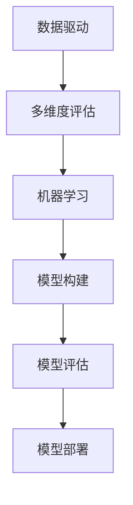
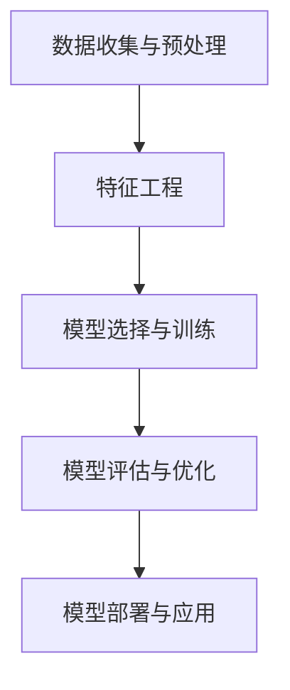

                 

### 设计智能化的企业并购目标筛选多维度评估模型

**关键词：** 企业并购、目标筛选、多维度评估、智能化、机器学习

**摘要：** 
本文旨在探讨设计智能化企业并购目标筛选多维度评估模型的方法。传统并购评估方法存在局限性，而智能化评估模型通过整合多维度评估指标、应用机器学习技术，能够更准确、高效地为企业并购提供决策支持。本文将详细阐述该模型的背景、核心概念、构建步骤以及实际应用，并讨论其局限性及优化方向。

## 第一部分：背景与概述

### 1.1 问题背景

企业并购是企业扩张和战略调整的重要手段，其目的在于实现资源的整合、优势互补和效率提升。然而，传统的并购目标筛选和评估方法往往存在以下局限性：

1. **评估指标单一**：传统评估方法主要依赖财务指标，如净利润、市场份额等，忽视了企业其他重要的非财务指标，如品牌价值、客户满意度等。
2. **主观性较强**：评估过程中，往往依赖于评估人员的经验和直觉，缺乏客观性，导致评估结果可能存在偏差。
3. **评估效率低**：传统的评估方法通常需要大量的人力和时间，效率较低，难以应对大规模并购项目的需求。

因此，设计一种智能化的企业并购目标筛选多维度评估模型，显得尤为必要。该模型通过整合多维度评估指标、应用机器学习技术，能够更准确、高效地为企业并购提供决策支持。

### 1.2 问题描述

企业并购目标筛选的多维度评估涉及以下关键问题：

1. **多维度评估指标的确定**：需要明确哪些评估指标对并购目标筛选至关重要，这些指标包括财务指标、非财务指标以及宏观与微观环境因素。
2. **评估指标的量化方法**：如何将非量化指标转化为量化指标，使其能够参与评估计算。
3. **评估模型的构建与实现**：如何设计一个智能化评估模型，使其能够自动筛选出最优的并购目标。

### 1.3 问题解决

智能化并购评估模型的概念是指通过整合多维度评估指标、应用机器学习技术，构建一个能够自动筛选并购目标的评估模型。该模型的核心组成部分包括：

1. **数据收集与处理**：收集并购相关的各种数据，并进行预处理，如数据清洗、归一化等。
2. **特征工程**：从原始数据中提取有效的特征，用于训练机器学习模型。
3. **模型训练与优化**：选择合适的机器学习算法，训练模型，并通过交叉验证等方法优化模型参数。
4. **模型评估与部署**：评估模型的性能，并将其部署到实际应用中。

与传统的评估方法相比，智能化评估模型具有以下优势：

1. **客观性**：通过量化多维度评估指标，减少了主观判断的影响。
2. **高效性**：利用机器学习技术，可以快速处理大量数据，提高评估效率。
3. **准确性**：通过模型训练，可以不断提高评估的准确性，为决策提供更可靠的支持。

### 1.4 边界与外延

智能化并购评估模型虽然具有许多优势，但也存在一定的局限性。首先，模型的构建和训练需要大量的数据支持，对于数据稀缺的行业或领域，模型的效果可能受到影响。其次，模型的选择和参数优化也需要专业知识和经验，否则可能无法达到预期效果。

此外，智能化评估模型的应用范围也受到限制。例如，对于一些高度依赖人机交互的领域，如文化创意产业，智能化评估模型可能无法完全取代人工评估。

### 1.5 概念结构与核心要素

智能化并购评估模型的核心概念包括数据驱动、机器学习、多维度评估等。其概念结构如图 1 所示。

核心要素包括：

1. **数据收集与处理**：收集并购相关的各种数据，包括财务数据、市场数据、行业数据等，并进行预处理。
2. **特征工程**：从原始数据中提取有效的特征，用于训练机器学习模型。
3. **模型训练与优化**：选择合适的机器学习算法，训练模型，并通过交叉验证等方法优化模型参数。
4. **模型评估与部署**：评估模型的性能，并将其部署到实际应用中。

## 第二部分：核心概念与原理

### 2.1 智能化评估模型的核心概念

智能化评估模型的核心概念在于将数据驱动的理念应用于并购评估中，通过机器学习技术实现多维度评估指标的量化。以下是核心概念及其解释：

1. **数据驱动**：数据驱动是指评估模型基于大量历史数据进行训练和优化，以实现评估的准确性和可靠性。
2. **机器学习**：机器学习是一种通过训练模型，从数据中自动学习规律和模式的技术，广泛应用于模式识别、预测分析等领域。
3. **多维度评估**：多维度评估是指从多个角度对并购目标进行评估，包括财务指标、非财务指标、宏观与微观环境因素等。

### 2.2 多维度评估指标的确定

多维度评估指标的确定是智能化并购评估模型的关键环节。以下为常见评估指标的分类和具体指标：

1. **财务指标**：
   - 净利润
   - 资产回报率
   - 股东权益回报率
   - 市盈率
   - 市净率

2. **非财务指标**：
   - 品牌价值
   - 客户满意度
   - 员工满意度
   - 研发能力
   - 市场占有率

3. **宏观与微观环境因素**：
   - 政治稳定性
   - 经济发展水平
   - 市场竞争态势
   - 行业政策法规

确定评估指标时，需要考虑以下原则：

1. **相关性**：评估指标应与并购目标的相关性较高，能够准确反映并购目标的潜在价值。
2. **可量化**：评估指标应能够进行量化处理，以便于模型计算和比较。
3. **平衡性**：评估指标应涵盖财务与非财务、宏观与微观等多个维度，以实现评估的全面性和客观性。

### 2.3 评估模型的算法原理

智能化并购评估模型的算法原理主要包括以下步骤：

1. **数据收集与预处理**：收集并购相关的各种数据，并进行预处理，如数据清洗、归一化等，以保证数据质量。

2. **特征工程**：从原始数据中提取有效的特征，用于训练机器学习模型。特征工程包括特征选择、特征转换、特征标准化等步骤。

3. **模型选择与训练**：选择合适的机器学习算法，如决策树、支持向量机、神经网络等，训练模型，并优化模型参数。

4. **模型评估与优化**：通过交叉验证等方法评估模型性能，并调整模型参数，以提高评估准确性。

5. **模型部署与应用**：将训练好的模型部署到实际应用中，为并购目标筛选提供决策支持。

以下是评估模型算法流程的 Mermaid 流程图：

### 2.4 评估模型的数学模型与公式

智能化并购评估模型的数学模型主要包括以下部分：

1. **评分函数**：用于计算每个并购目标的综合评分，公式如下：

   $$ score = \sum_{i=1}^{n} w_i \cdot f_i $$

   其中，$w_i$ 为权重，$f_i$ 为第 $i$ 个评估指标的得分。

2. **权重计算**：权重 $w_i$ 的计算可以通过以下公式实现：

   $$ w_i = \frac{v_i}{\sum_{j=1}^{m} v_j} $$

   其中，$v_i$ 为第 $i$ 个评估指标的相对重要性，$m$ 为评估指标的总数。

3. **特征转换**：对于非量化评估指标，需要进行特征转换，公式如下：

   $$ f_i = T_i(x_i) $$

   其中，$T_i$ 为特征转换函数，$x_i$ 为原始特征值。

4. **模型优化**：模型优化可以通过以下公式实现：

   $$ \theta^{*} = \arg\min_{\theta} L(\theta; X, Y) $$

   其中，$L$ 为损失函数，$X$ 为输入特征，$Y$ 为标签。

### 2.5 评估模型的应用场景

智能化并购评估模型可以应用于以下场景：

1. **并购目标筛选**：在确定并购目标时，通过模型评估不同目标的综合评分，筛选出最优目标。
2. **并购风险评估**：对潜在并购目标进行风险评估，预测并购后可能出现的风险，为决策提供支持。
3. **并购策略优化**：根据评估结果，调整并购策略，以实现并购目标的最大化。

## 第三部分：模型构建与实现

### 3.1 模型构建步骤

构建智能化并购评估模型需要以下步骤：

1. **数据收集与预处理**：收集并购相关的各种数据，包括财务数据、市场数据、行业数据等，并进行预处理，如数据清洗、归一化等。

2. **特征工程**：从原始数据中提取有效的特征，用于训练机器学习模型。特征工程包括特征选择、特征转换、特征标准化等步骤。

3. **模型选择与训练**：选择合适的机器学习算法，如决策树、支持向量机、神经网络等，训练模型，并优化模型参数。

4. **模型评估与优化**：通过交叉验证等方法评估模型性能，并调整模型参数，以提高评估准确性。

5. **模型部署与应用**：将训练好的模型部署到实际应用中，为并购目标筛选提供决策支持。

以下是模型构建步骤的 Mermaid 流程图：

### 3.2 模型实现细节

在模型实现过程中，需要关注以下细节：

1. **数据收集与预处理**：
   - 数据清洗：去除重复数据、缺失值填充、异常值处理等。
   - 数据归一化：将不同量纲的数据进行归一化处理，使其在同一尺度上。

2. **特征工程**：
   - 特征选择：根据业务需求，选择对并购评估有显著影响的特征。
   - 特征转换：将非量化特征转换为量化特征，如使用独热编码、标签编码等方法。

3. **模型选择与训练**：
   - 模型选择：根据数据特点和评估需求，选择合适的机器学习算法，如决策树、支持向量机、神经网络等。
   - 模型训练：使用训练数据对模型进行训练，并调整模型参数，以优化模型性能。

4. **模型评估与优化**：
   - 模型评估：使用验证数据评估模型性能，如准确率、召回率、F1 分数等。
   - 模型优化：根据评估结果，调整模型参数，以提高评估准确性。

5. **模型部署与应用**：
   - 模型部署：将训练好的模型部署到生产环境中，供实际应用调用。
   - 模型应用：将模型应用于并购目标筛选、风险评估等实际场景。

### 3.3 模型验证与测试

在模型构建完成后，需要进行验证与测试，以确保模型性能和可靠性。以下是模型验证与测试的步骤：

1. **模型验证**：
   - 使用验证集对模型进行评估，以确定模型在未知数据上的性能。
   - 检查模型是否存在过拟合现象，如准确率较高但泛化能力较弱。

2. **模型测试**：
   - 使用测试集对模型进行最终评估，以确定模型在实际应用中的表现。
   - 分析模型在不同数据分布、噪声水平下的性能稳定性。

3. **性能指标分析**：
   - 分析模型的准确率、召回率、F1 分数等性能指标，以评估模型在不同评估指标上的表现。
   - 对模型进行对比测试，评估不同模型的优劣。

4. **模型优化方向**：
   - 根据验证与测试结果，分析模型存在的问题和优化方向。
   - 调整模型参数、特征工程方法等，以提高模型性能。

## 第四部分：应用与案例

### 4.1 案例介绍

为了更好地说明智能化并购评估模型的应用，以下是一个实际并购案例：

**案例背景**：某知名企业 A 计划通过并购方式拓展业务领域，目标为一家从事区块链技术研发的企业 B。企业 A 需要利用区块链技术提升自身的业务竞争力，但对该领域了解有限。

**并购目标筛选过程**：企业 A 首先利用智能化并购评估模型对潜在并购目标进行筛选。模型考虑了以下评估指标：

1. **财务指标**：净利润、资产回报率、股东权益回报率等。
2. **非财务指标**：品牌价值、客户满意度、研发能力等。
3. **宏观与微观环境因素**：行业政策法规、市场竞争态势等。

通过模型评估，企业 A 从多个潜在目标中筛选出企业 B 作为并购对象。

### 4.2 模型应用效果分析

在案例中，智能化并购评估模型的应用效果显著。以下为具体分析：

1. **评估准确性**：模型综合考虑了多维度评估指标，评估结果具有较高的准确性，企业 A 能够准确判断企业 B 的并购潜力。

2. **评估效率**：相较于传统评估方法，智能化评估模型能够快速处理大量数据，提高了评估效率。

3. **评估全面性**：模型涵盖了财务与非财务、宏观与微观等多个维度，评估结果更加全面和客观。

### 4.3 模型优化与调整

在案例应用过程中，企业 A 也发现了一些模型存在的问题，并对模型进行了优化和调整：

1. **特征选择**：针对评估指标的重要性，调整了部分特征权重，以提高评估准确性。

2. **模型优化**：根据评估结果，对模型参数进行了调整，提高了模型性能。

3. **数据更新**：定期更新模型训练数据，以适应市场环境的变化。

### 4.4 模型在实际并购中的价值

通过智能化并购评估模型的应用，企业 A 成功完成了对目标企业的并购。模型在实际并购中的价值体现在以下几个方面：

1. **决策支持**：为并购决策提供了可靠的数据支持，降低了决策风险。

2. **效率提升**：提高了并购评估的效率，缩短了并购周期。

3. **价值挖掘**：通过多维度评估，挖掘出了目标企业的潜在价值，为后续整合提供了有力支持。

## 第五部分：最佳实践与总结

### 5.1 最佳实践

在智能化并购评估模型的应用过程中，以下最佳实践值得借鉴：

1. **数据质量保障**：确保数据收集与预处理的质量，避免数据缺失、异常值等问题对评估结果的影响。

2. **特征选择与权重调整**：根据业务需求和数据特点，合理选择评估指标，并调整特征权重，以提高评估准确性。

3. **模型优化与更新**：定期对模型进行优化和更新，以适应市场环境的变化。

4. **模型应用培训**：对相关人员进行模型应用培训，确保其能够正确理解和应用模型。

### 5.2 小结

本文介绍了设计智能化企业并购目标筛选多维度评估模型的方法。通过整合多维度评估指标、应用机器学习技术，该模型能够为企业并购提供准确、高效的决策支持。然而，模型也存在一定的局限性，需要不断优化和改进。

### 5.3 注意事项

在使用智能化并购评估模型时，需要注意以下事项：

1. **数据质量**：确保数据收集与预处理的质量，避免数据缺失、异常值等问题对评估结果的影响。

2. **模型适应性**：根据业务需求和数据特点，合理选择评估指标和特征权重，以提高评估准确性。

3. **模型优化**：定期对模型进行优化和更新，以适应市场环境的变化。

4. **人员培训**：对相关人员进行模型应用培训，确保其能够正确理解和应用模型。

### 5.4 拓展阅读

1. 《机器学习实战》：详细介绍了机器学习的基础知识和应用案例。
2. 《深度学习》：全面介绍了深度学习的基本原理和应用。
3. 《数据挖掘：实用工具与技术》：介绍了数据挖掘的基本方法和应用。

## 作者信息

作者：AI天才研究院/AI Genius Institute & 禅与计算机程序设计艺术 /Zen And The Art of Computer Programming

[End]

