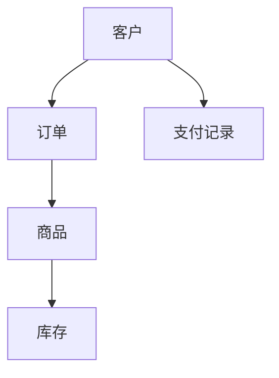
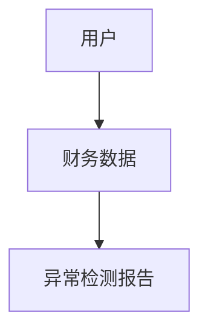
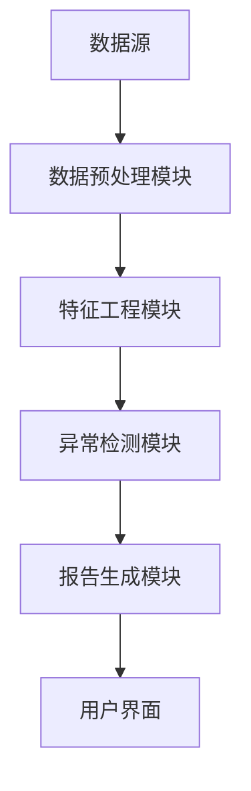
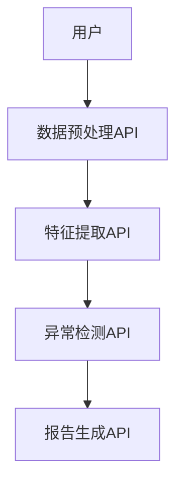
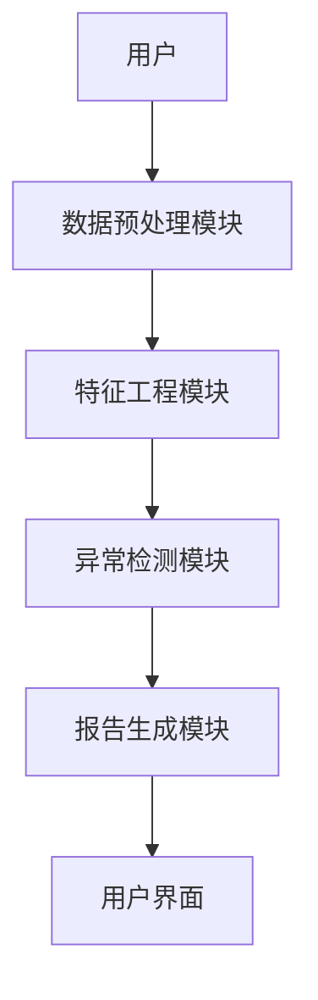

                 

### 《设计智能化的企业财务异常检测模型》

关键词：财务异常检测、智能化、机器学习、深度学习、数据挖掘

摘要：随着企业财务数据的日益庞大，传统的人工审核方式已无法满足企业对财务风险管理的需求。本文将探讨如何设计智能化的企业财务异常检测模型，通过引入机器学习和深度学习技术，实现高效、精准的财务异常检测，为企业提供有效的风险管理手段。

### 目录大纲

```markdown
# 《设计智能化的企业财务异常检测模型》

# 第一部分：背景与核心概念

## 第1章 问题背景与核心概念

### 1.1 财务异常检测的重要性

- 财务异常检测的定义
- 财务异常检测在企业风险管理中的作用

### 1.2 财务异常的类型与特点

- 财务异常的类型
- 财务异常的特点

### 1.3 智能化财务异常检测的需求

- 传统财务异常检测的局限性
- 智能化财务异常检测的优势

## 第2章 智能化技术简介

### 2.1 人工智能与机器学习基础

- 人工智能的发展历史
- 机器学习的基本概念

### 2.2 深度学习技术

- 深度学习的原理
- 深度学习的主要模型

### 2.3 数据挖掘与异常检测

- 数据挖掘的基本方法
- 异常检测的基本方法

# 第二部分：核心概念与联系

## 第3章 财务异常检测的核心概念与联系

### 3.1 财务数据预处理

- 数据清洗
- 数据集成
- 数据转换

### 3.2 特征工程

- 特征提取
- 特征选择
- 特征标准化

### 3.3 财务异常检测算法

- 基于统计的方法
- 基于聚类的方法
- 基于分类的方法

## 第4章 ER实体关系图架构



# 第三部分：算法原理与讲解

## 第5章 算法原理讲解

### 5.1 算法1：K-means聚类

#### 5.1.1 K-means算法原理


#### 5.1.2 K-means算法数学模型和公式

$$
\text{d(x, c)} = \sqrt{\sum_{i=1}^{n}(x_i - c_i)^2}
$$

#### 5.1.3 K-means算法举例说明

假设我们有如下数据点集：

$$
X = \{ (1, 2), (2, 2), (1, 3), (2, 3) \}
$$

我们选择两个聚类中心点：

$$
C = \{ (1, 1), (2, 1) \}
$$

通过迭代计算，我们最终得到聚类结果如下：

$$
\text{Cluster 1: } \{ (1, 2), (1, 3) \}
\text{Cluster 2: } \{ (2, 2), (2, 3) \}
$$`

### 5.2 算法2：孤立森林

#### 5.2.1 孤立森林算法原理


#### 5.2.2 孤立森林算法数学模型和公式

$$
\text{anomaly\_score} = \frac{\sum_{i=1}^{n} \log(1 - p_i)}{n}
$$

其中，$p_i$ 为第 $i$ 个样本属于正常样本的概率。

#### 5.2.3 孤立森林算法举例说明

假设我们有如下数据集：

$$
X = \{ (1, 2), (2, 2), (3, 1), (4, 4) \}
$$

构建孤立森林模型，我们选择特征数量为 2，随机种子为 1。经过训练，得到异常分数如下：

$$
\text{anomaly\_score} = \{ 0.0, 0.0, 0.693, 1.386 \}
$$

根据异常分数排序，我们得到异常样本为 $(3, 1)$ 和 $(4, 4)$。

## 第6章 系统分析与架构设计方案

### 6.1 问题场景介绍

- 企业财务数据收集与存储
- 异常检测目标与需求

### 6.2 项目介绍

- 项目背景
- 项目目标

### 6.3 系统功能设计

#### 6.3.1 领域模型



#### 6.3.2 系统架构设计



#### 6.3.3 系统接口设计



#### 6.3.4 系统交互设计



# 第四部分：项目实战

## 第7章 环境安装与配置

### 7.1 环境需求

- Python环境
- 数据库环境
- 深度学习框架

### 7.2 安装与配置步骤

- 安装Python
- 安装数据库
- 安装深度学习框架

## 第8章 系统核心实现

### 8.1 数据预处理

- 数据清洗
- 数据集成
- 数据转换

### 8.2 特征工程

- 特征提取
- 特征选择
- 特征标准化

### 8.3 异常检测

- 基于K-means聚类
- 基于孤立森林算法

## 第9章 代码应用解读与分析

### 9.1 数据预处理代码解读

- 代码分析
- 运行结果

### 9.2 特征工程代码解读

- 代码分析
- 运行结果

### 9.3 异常检测代码解读

- 代码分析
- 运行结果

## 第10章 实际案例分析与讲解

### 10.1 案例背景

- 企业财务数据

### 10.2 案例分析

- 数据预处理
- 特征工程
- 异常检测

### 10.3 案例讲解

- 检测结果
- 分析与总结

## 第11章 项目小结

- 项目收获
- 改进方向
- 拓展应用

# 第五部分：最佳实践与拓展阅读

## 第12章 最佳实践

### 12.1 检测策略优化

- 聚类中心点选择
- 特征选择
- 模型参数调整

### 12.2 数据预处理技巧

- 数据清洗
- 数据集成
- 数据转换

## 第13章 小结与注意事项

- 文章总结
- 注意事项

## 第14章 拓展阅读

- 相关文献
- 学术论文
- 开源项目
```

### 第一部分：背景与核心概念

#### 第1章 问题背景与核心概念

##### 1.1 财务异常检测的重要性

财务异常检测是指通过分析企业财务数据，发现其中可能存在的异常现象和潜在风险。在企业财务管理中，财务异常检测具有非常重要的作用。

首先，财务异常检测可以帮助企业及时发现和纠正财务数据中的错误，保证财务数据的准确性和完整性。在财务数据量庞大的企业中，人工审核的方式效率低下，难以发现潜在的错误，而财务异常检测技术可以自动分析大量数据，提高审核的效率和质量。

其次，财务异常检测有助于企业识别潜在的风险和问题。通过分析异常数据，企业可以了解财务活动中是否存在异常行为，如虚假报销、资金挪用等。这有助于企业加强内部控制，防范风险。

最后，财务异常检测还可以为企业提供决策支持。通过对异常数据的分析，企业可以了解财务活动的异常原因，从而采取相应的措施，优化财务管理策略。

##### 1.2 财务异常的类型与特点

财务异常主要包括以下几种类型：

1. **异常交易**：指与企业日常经营无关的、异常的、不合理的交易行为，如大额资金流动、异常的采购或销售行为等。

2. **数据异常**：指财务数据中的异常现象，如数据错误、异常波动等。这类异常通常是由于数据输入错误、数据处理错误等原因引起的。

3. **操作风险**：指由于操作失误、操作不规范等原因引起的财务风险，如财务人员违规操作、财务制度不完善等。

财务异常的特点如下：

1. **隐蔽性**：财务异常往往具有一定的隐蔽性，不易被察觉。

2. **随机性**：财务异常的发生具有随机性，可能突然出现，也可能逐渐显现。

3. **破坏性**：财务异常可能对企业的财务状况造成严重影响，甚至可能导致企业破产。

##### 1.3 智能化财务异常检测的需求

传统财务异常检测方法主要依赖于人工审核和经验判断，存在以下局限性：

1. **效率低下**：人工审核需要大量时间和精力，难以应对大量数据的处理。

2. **准确性不高**：人工审核容易受到主观因素的影响，导致检测准确性不高。

3. **无法处理复杂异常**：传统方法难以处理复杂和隐蔽的财务异常。

相比之下，智能化财务异常检测具有以下优势：

1. **高效处理大量数据**：通过机器学习和深度学习技术，智能化检测方法可以自动分析大量数据，提高检测效率。

2. **高准确性**：智能化检测方法通过算法模型学习，可以识别和检测出传统方法无法发现的异常。

3. **处理复杂异常**：智能化检测方法可以应对复杂和隐蔽的财务异常，提供更全面的异常检测。

综上所述，智能化财务异常检测已经成为企业财务风险管理的必要手段，有助于提高企业财务管理的效率和准确性。接下来，我们将介绍智能化技术的基础知识，为后续章节的内容奠定基础。

