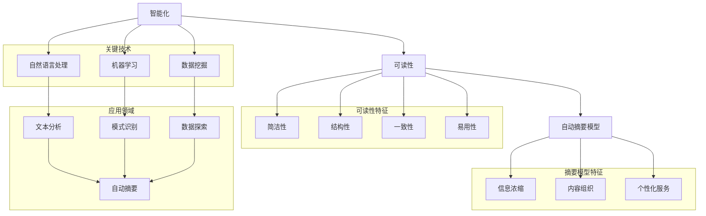
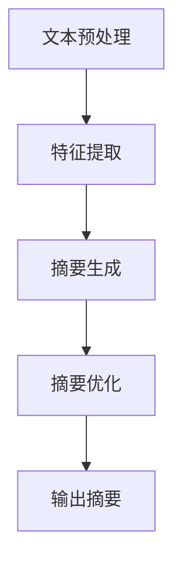
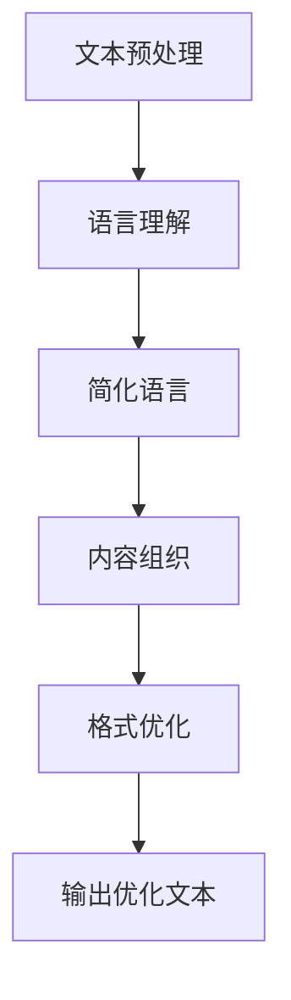
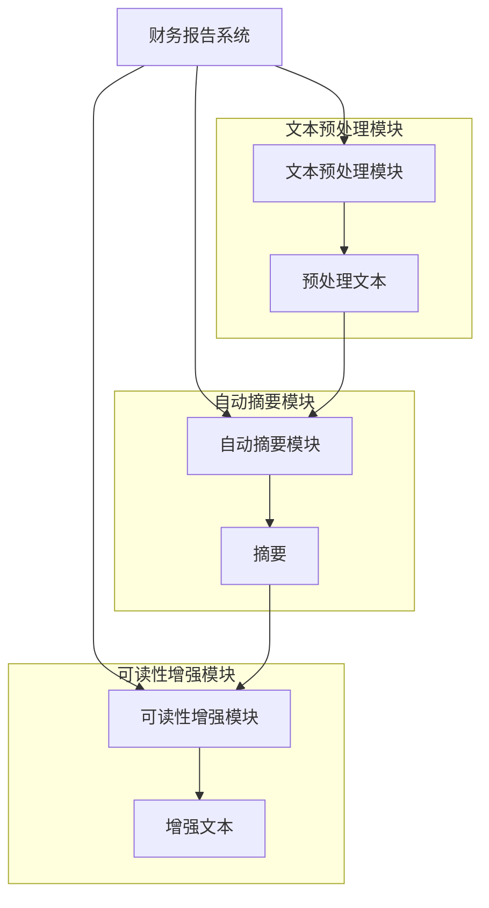
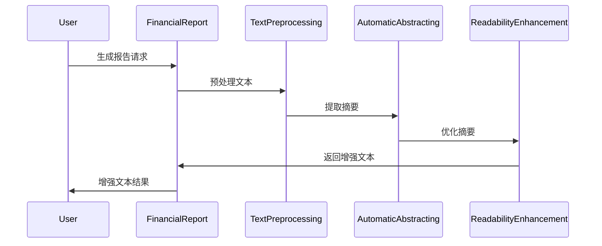

                 

### 引言

在现代商业环境中，企业财务报告不仅是企业内部管理层决策的重要依据，也是外部投资者、监管机构和其他利益相关者了解企业财务状况的关键资料。随着全球经济环境的复杂化和信息技术的迅速发展，传统的手工编制和呈现财务报告的方式已难以满足日益增长的需求。可读性差、数据冗余、信息过载等问题使得财务报告的使用者往往难以快速准确地获取所需信息，这直接影响了报告的决策支持和参考价值。

智能化技术的崛起为解决上述问题带来了新的契机。通过引入自然语言处理（NLP）、机器学习（ML）等人工智能（AI）技术，企业财务报告的可读性可以显著提升，报告内容也可以通过自动摘要等方式进行优化，使其更易于理解和分析。智能化财务报告不仅能够提高信息传递的效率，还能通过精准的数据分析和预测，为企业决策提供有力支持。

本文将围绕“设计智能化的企业财务报告可读性增强与自动摘要模型”这一主题，探讨如何利用AI技术改善财务报告的可读性和自动化摘要。文章将分为以下几个部分：

1. **背景介绍**：明确财务报告的重要性、当前存在的可读性问题、自动摘要的需求以及智能化技术在财务报告中的应用现状。
2. **核心概念与联系**：介绍智能化、可读性、自动摘要模型等核心概念，并解释其含义。通过对比表格和Mermaid流程图，展示这些概念之间的联系。
3. **算法原理讲解**：详细阐述自动摘要和智能可读性增强模型的算法原理，包括流程图、Python源代码示例和数学模型。
4. **系统分析与架构设计方案**：介绍系统设计思路，利用Mermaid绘制领域模型类图和系统架构图，详细描述系统接口设计和交互流程。
5. **项目实战**：提供项目实现的具体步骤和源代码，通过案例分析，展示如何在实际中应用所学知识。
6. **最佳实践、小结与拓展阅读**：总结最佳实践，强调关键点和注意事项，推荐进一步阅读的资源。

通过本文的探讨，希望能够为企业和财务报告编制者提供有价值的参考，推动智能化技术在财务报告领域的应用和发展。

### 关键词

- 企业财务报告
- 可读性增强
- 自动摘要模型
- 智能化技术
- 自然语言处理
- 机器学习
- 数据分析

### 摘要

本文旨在探讨如何利用智能化技术提升企业财务报告的可读性和自动化摘要能力。随着商业环境日益复杂，传统财务报告的呈现方式已经难以满足信息传递和决策支持的需求。本文首先介绍了财务报告在企业管理中的重要性，以及当前存在的可读性问题。接着，文章提出了自动摘要的需求，并探讨了智能化技术在财务报告中的应用现状。

在核心概念部分，本文详细解释了智能化、可读性和自动摘要模型等关键术语，并通过Mermaid流程图展示了这些概念之间的联系。算法原理讲解部分，通过具体的Python源代码示例和数学模型，详细阐述了自动摘要和智能可读性增强模型的原理。系统分析与架构设计方案部分，介绍了系统设计的整体思路，并通过Mermaid绘制的领域模型类图和系统架构图，展示了系统组件及其关系。

项目实战部分，提供了具体的实现步骤和源代码，通过实际案例展示了如何应用智能化技术来提升财务报告的可读性和自动摘要能力。最后，本文总结了最佳实践，并推荐了进一步的阅读资源，以帮助读者深入了解这一领域。

### 目录大纲设计思路

在设计《设计智能化的企业财务报告可读性增强与自动摘要模型》的目录大纲时，我们需要考虑内容的完整性、逻辑性和专业性，以便为读者提供一个清晰、易于理解的结构。以下是具体的目录大纲设计思路：

#### 第一部分：引言与背景

1. **背景介绍**
   - **第1章：企业财务报告与智能化趋势**
     - **1.1 问题背景**
       - **1.1.1 企业财务报告的重要性**
       - **1.1.2 可读性问题与用户需求**
       - **1.1.3 智能化技术发展与应用前景**
     - **1.2 智能化与企业财务报告**
       - **1.2.1 智能化的定义与特点**
       - **1.2.2 智能化在财务报告中的应用**
       - **1.2.3 可读性增强与自动摘要的需求**

   本章节将为读者提供一个全面了解企业财务报告背景和智能化技术的概述，为后续章节的深入探讨打下基础。

#### 第二部分：核心概念与联系

2. **核心概念与联系**
   - **第2章：核心概念与联系**
     - **2.1 智能化技术与财务报告**
       - **2.1.1 智能化技术的核心概念**
       - **2.1.2 智能化技术在财务报告中的关键角色**
       - **2.1.3 可读性与自动摘要的关系**
     - **2.2 概念属性特征对比**
       - **2.2.1 概念属性特征对比表格**
       - **2.2.2 概念属性特征对比分析**
     - **2.3 ER实体关系图架构**
       - **2.3.1 财务报告实体关系**
       - **2.3.2 智能化技术实体关系**
       - **2.3.3 可读性与自动摘要实体关系**

   本章节将介绍智能化、可读性和自动摘要模型等核心概念，并通过对比表格和Mermaid流程图，帮助读者理解这些概念之间的联系。

#### 第三部分：算法原理讲解

3. **算法原理讲解**
   - **第3章：自动摘要模型原理**
     - **3.1 自动摘要模型概述**
       - **3.1.1 自动摘要的定义与目标**
       - **3.1.2 自动摘要模型的类型**
       - **3.1.3 自动摘要模型的挑战**
     - **3.2 算法原理**
       - **3.2.1 自动摘要算法流程**
       - **3.2.2 Mermaid算法流程图**
       - **3.2.3 Python源代码示例**
     - **3.3 数学模型与公式**
       - **3.3.1 自动摘要的数学模型**
       - **3.3.2 公式推导与解释**

   - **第4章：智能可读性增强模型**
     - **4.1 智能可读性增强概述**
       - **4.1.1 可读性的定义与衡量**
       - **4.1.2 智能可读性增强的目标**
       - **4.1.3 智能可读性增强的方法**
     - **4.2 算法原理**
       - **4.2.1 智能可读性增强算法流程**
       - **4.2.2 Mermaid算法流程图**
       - **4.2.3 Python源代码示例**
     - **4.3 数学模型与公式**
       - **4.3.1 智能可读性增强的数学模型**
       - **4.3.2 公式推导与解释**

   本章节将详细讲解自动摘要和智能可读性增强模型的算法原理，包括流程图、Python源代码示例和数学模型。

#### 第四部分：系统分析与架构设计方案

4. **系统分析与架构设计方案**
   - **第5章：系统设计与实现**
     - **5.1 问题场景介绍**
     - **5.2 系统整体设计**
       - **5.2.1 领域模型类图**
       - **5.2.2 系统架构图**
     - **5.3 系统接口设计与交互流程**
       - **5.3.1 接口设计**
       - **5.3.2 系统交互序列图**

   本章节将介绍系统设计与实现的整体思路，通过Mermaid绘制的领域模型类图和系统架构图，展示系统组件及其关系。

#### 第五部分：项目实战

5. **项目实战**
   - **第6章：项目实施与案例分析**
     - **6.1 项目环境安装**
     - **6.2 系统核心实现源代码**
       - **6.2.1 自动摘要模型源代码**
       - **6.2.2 智能可读性增强模型源代码**
     - **6.3 代码应用解读与分析**
       - **6.3.1 自动摘要模型应用**
       - **6.3.2 智能可读性增强模型应用**
     - **6.4 实际案例分析与讲解**
     - **6.5 项目小结**

   本章节将提供项目实现的具体步骤和源代码，通过实际案例分析和讲解，帮助读者理解如何应用智能化技术提升财务报告的可读性和自动摘要能力。

#### 第六部分：最佳实践、小结与拓展阅读

6. **最佳实践、小结与拓展阅读**
   - **第7章：最佳实践与总结**
     - **7.1 最佳实践建议**
     - **7.2 小结与注意事项**
   - **7.3 拓展阅读资源**
     - **7.3.1 推荐书籍**
     - **7.3.2 在线课程与论文**

   本章节将总结全文内容，提供最佳实践建议，并推荐进一步阅读的资源，以帮助读者深入学习。

### 目录大纲

```markdown
----------------------------------------------------------------
# 第一部分：引言与背景

## 第1章：企业财务报告与智能化趋势

### 1.1 问题背景
#### 1.1.1 企业财务报告的重要性
#### 1.1.2 可读性问题与用户需求
#### 1.1.3 智能化技术发展与应用前景

### 1.2 智能化与企业财务报告
#### 1.2.1 智能化的定义与特点
#### 1.2.2 智能化在财务报告中的应用
#### 1.2.3 可读性增强与自动摘要的需求

## 第二部分：核心概念与联系

## 第2章：核心概念与联系

### 2.1 智能化技术与财务报告
#### 2.1.1 智能化技术的核心概念
#### 2.1.2 智能化技术在财务报告中的关键角色
#### 2.1.3 可读性与自动摘要的关系

### 2.2 概念属性特征对比
#### 2.2.1 概念属性特征对比表格
#### 2.2.2 概念属性特征对比分析

### 2.3 ER实体关系图架构
#### 2.3.1 财务报告实体关系
#### 2.3.2 智能化技术实体关系
#### 2.3.3 可读性与自动摘要实体关系

## 第三部分：算法原理讲解

## 第3章：自动摘要模型原理

### 3.1 自动摘要模型概述
#### 3.1.1 自动摘要的定义与目标
#### 3.1.2 自动摘要模型的类型
#### 3.1.3 自动摘要模型的挑战

### 3.2 算法原理
#### 3.2.1 自动摘要算法流程
#### 3.2.2 Mermaid算法流程图
#### 3.2.3 Python源代码示例

### 3.3 数学模型与公式
#### 3.3.1 自动摘要的数学模型
#### 3.3.2 公式推导与解释

## 第4章：智能可读性增强模型

### 4.1 智能可读性增强概述
#### 4.1.1 可读性的定义与衡量
#### 4.1.2 智能可读性增强的目标
#### 4.1.3 智能可读性增强的方法

### 4.2 算法原理
#### 4.2.1 智能可读性增强算法流程
#### 4.2.2 Mermaid算法流程图
#### 4.2.3 Python源代码示例

### 4.3 数学模型与公式
#### 4.3.1 智能可读性增强的数学模型
#### 4.3.2 公式推导与解释

## 第四部分：系统分析与架构设计方案

## 第5章：系统设计与实现

### 5.1 问题场景介绍

### 5.2 系统整体设计
#### 5.2.1 领域模型类图
#### 5.2.2 系统架构图

### 5.3 系统接口设计与交互流程
#### 5.3.1 接口设计
#### 5.3.2 系统交互序列图

## 第五部分：项目实战

## 第6章：项目实施与案例分析

### 6.1 项目环境安装

### 6.2 系统核心实现源代码
#### 6.2.1 自动摘要模型源代码
#### 6.2.2 智能可读性增强模型源代码

### 6.3 代码应用解读与分析
#### 6.3.1 自动摘要模型应用
#### 6.3.2 智能可读性增强模型应用

### 6.4 实际案例分析与讲解

### 6.5 项目小结

## 第六部分：最佳实践、小结与拓展阅读

## 第7章：最佳实践与总结

### 7.1 最佳实践建议
#### 7.1.1 常见问题与解决方案
#### 7.1.2 实施步骤与技巧

### 7.2 小结与注意事项
#### 7.2.1 全文总结
#### 7.2.2 注意事项与未来展望

### 7.3 拓展阅读资源
#### 7.3.1 推荐书籍
#### 7.3.2 在线课程与论文

----------------------------------------------------------------
```

### 企业财务报告的重要性与当前面临的挑战

企业财务报告是企业财务管理的重要组成部分，它不仅反映了企业的财务状况、经营成果和现金流量，还为企业管理层、投资者、监管机构和市场参与者提供了决策支持和参考依据。随着全球经济环境的日益复杂和商业活动的不断演变，企业财务报告的重要性愈发凸显。

首先，财务报告是企业内部管理层决策的重要依据。企业财务报告通过精确的财务数据和分析，帮助管理层了解企业的财务状况，评估经营绩效，制定战略计划和财务预算。例如，财务报告中的资产负债表、利润表和现金流量表分别提供了企业资产、负债、收入和支出的详细信息，使管理层能够全面掌握企业的财务健康状况，为经营决策提供数据支持。

其次，财务报告是外部投资者、股东和潜在投资者评估企业价值的重要工具。投资者通过分析财务报告中的数据，可以判断企业的盈利能力、成长潜力和风险水平，从而做出投资决策。例如，投资者会关注财务报告中的净利润、每股收益、资产回报率等关键财务指标，以此来评估企业的投资价值和潜在回报。

此外，财务报告也是监管机构和市场参与者监督企业运营的重要手段。监管机构通过审核企业财务报告，确保企业遵守相关法规和会计准则，维护市场秩序和投资者利益。市场参与者，如信用评级机构，也会根据财务报告的数据来评估企业的信用等级，影响企业的融资成本和融资渠道。

然而，当前企业财务报告在可读性方面面临诸多挑战。首先，财务报告通常使用专业术语和复杂的会计语言，对于非财务专业人士来说，难以理解报告中的内容和数据。这导致了报告使用者对信息的误读或误解，影响了决策的准确性和有效性。

其次，传统财务报告通常以静态的表格和图表形式呈现，信息过于冗长和琐碎，用户需要花费大量时间筛选和处理信息，导致阅读效率低下。特别是在财务报告包含大量数据时，用户很难迅速找到关键信息，影响了报告的决策支持功能。

第三，财务报告的呈现方式缺乏个性化，无法根据不同用户的需求提供定制化的报告内容。这限制了财务报告的灵活性和实用性，无法满足多样化、个性化的信息需求。

为了解决这些问题，智能化技术提供了新的解决方案。通过引入自然语言处理（NLP）、机器学习（ML）和计算机视觉（CV）等技术，企业财务报告的可读性可以得到显著提升。例如，NLP技术可以自动解析财务报告中的专业术语，将其转换为通俗易懂的语言，使得报告更加易于理解。机器学习算法则可以识别和提取财务报告中的关键信息，提供摘要和推荐，提高用户的阅读效率和决策支持能力。

此外，智能化技术还可以实现财务报告的自动化生成和动态更新，使用户能够实时获取最新的财务数据和分析结果。这种实时性和动态性不仅提高了报告的时效性，还增强了报告的决策参考价值。

总之，智能化技术在企业财务报告中的应用，不仅解决了传统报告在可读性方面的诸多问题，还为企业和利益相关者提供了更加高效、准确和个性化的信息支持。随着技术的不断进步，智能化财务报告将成为企业管理和决策的重要工具，推动企业向更加智能化、数据驱动的方向发展。

### 自动摘要的需求与现状

在当今信息爆炸的时代，用户对信息的需求日益增长，但可用的信息量却不断增加，这给信息的获取和处理带来了巨大的挑战。特别是在企业财务报告中，由于报告内容通常包含大量的数据、复杂的术语和冗长的叙述，用户很难在短时间内获取和理解其中的关键信息。因此，自动摘要技术的需求应运而生。

#### 自动摘要的定义与目标

自动摘要（Automatic Abstracting）是指利用自然语言处理（NLP）和机器学习（ML）技术，从原始文本中自动提取出最核心、最具代表性和最有价值的信息，并以简洁、概括的形式呈现给用户。自动摘要的目标是提高信息传递的效率，帮助用户快速获取和理解重要信息，节省阅读时间和精力。

在财务报告中，自动摘要技术可以帮助用户从大量复杂的财务数据和分析中提取出关键信息，如财务状况、经营成果和现金流量等，并以简明扼要的形式进行呈现。这样，用户可以无需阅读完整的报告，就能快速了解企业的财务健康状况和运营表现。

#### 自动摘要模型的类型

自动摘要模型可以分为几种不同的类型，根据其处理方式和目标的不同，可以分为以下几种：

1. **提取式摘要**（Extractive Summarization）：提取式摘要模型从原始文本中直接提取出重要句子或段落，形成摘要。这种方法的优点是生成的摘要与原文内容紧密相关，信息损失较小。然而，提取式摘要的缺点在于摘要长度受限，可能无法完全覆盖原文的所有重要信息。

2. **生成式摘要**（Generative Summarization）：生成式摘要模型通过生成新的文本来创造摘要。这种方法可以生成比提取式摘要更灵活、更丰富的摘要内容，但同时也存在生成偏差和低质量摘要的风险。

3. **混合式摘要**（Hybrid Summarization）：混合式摘要模型结合了提取式和生成式摘要的优点，通过将提取和生成技术相结合，生成高质量的摘要。这种方法通常能够平衡摘要长度和信息量之间的关系，提高摘要的质量和可读性。

#### 自动摘要模型的挑战

尽管自动摘要技术在多个领域都有广泛应用，但在财务报告中应用这一技术仍面临一些挑战：

1. **数据隐私和合规性**：财务报告通常包含敏感的财务数据，如收入、支出、利润等，这些数据在自动摘要过程中可能会被泄露。因此，如何在保证数据隐私和合规性的前提下进行摘要处理，是一个重要的挑战。

2. **文本理解与语义分析**：财务报告中的文本通常包含大量的专业术语和复杂的句子结构，这给文本理解和语义分析带来了困难。自动摘要模型需要具备强大的语义分析能力，才能准确理解文本内容，并生成高质量的摘要。

3. **摘要长度与信息损失**：自动摘要模型需要在摘要长度和信息完整性之间找到平衡。过长的摘要会降低阅读效率，而过短的摘要则可能丢失关键信息。如何设计算法，在保证摘要精炼的同时，不损失重要信息，是一个需要深入研究的课题。

4. **个性化需求**：不同的用户可能有不同的信息需求和摘要偏好。自动摘要模型需要能够根据用户的需求和偏好，生成定制化的摘要内容，这增加了算法的复杂度和实现难度。

#### 智能化技术在财务报告中的应用前景

随着人工智能技术的不断进步，自动摘要模型在财务报告中的应用前景愈发广阔。通过引入先进的自然语言处理技术和机器学习算法，自动摘要模型可以更加准确地提取和概括财务报告中的关键信息，提高报告的可读性和决策支持能力。

例如，自然语言处理技术可以帮助模型理解财务报告中的专业术语和句子结构，生成更符合语言习惯和逻辑顺序的摘要。机器学习算法则可以通过大量的训练数据，不断优化摘要模型的性能，提高摘要的质量和准确性。

此外，随着云计算和大数据技术的发展，财务报告的自动摘要处理可以更加高效和实时。企业可以利用云计算平台和分布式计算资源，快速处理大量的财务报告数据，生成即时的摘要结果，为决策者提供及时的信息支持。

总之，自动摘要技术是智能化财务报告的重要组成部分，其应用不仅能够提高报告的可读性和使用效率，还能为企业和利益相关者提供更加精准、高效的决策支持。随着技术的不断进步，自动摘要模型将在财务报告中发挥越来越重要的作用，推动财务管理向智能化、数据驱动的方向发展。

### 智能化技术的基本概念与特点

智能化技术是指利用计算机科学、自然语言处理（NLP）、机器学习（ML）、数据挖掘、人工智能（AI）等前沿技术，实现复杂信息处理、自动化决策和智能行为的技术体系。在智能化技术的支持下，企业财务报告的可读性和自动摘要能力得到了显著提升。以下将详细探讨智能化技术的基本概念与特点。

#### 智能化技术的核心概念

1. **自然语言处理（NLP）**：自然语言处理是人工智能的一个分支，旨在使计算机能够理解和处理人类自然语言。在财务报告中，NLP技术可以用于文本分析和理解，例如，自动解析财务报告中的专业术语和复杂句子，提取关键信息，并生成摘要。

2. **机器学习（ML）**：机器学习是使计算机能够从数据中学习并做出决策的技术。在财务报告中，机器学习算法可以用于分类、预测和模式识别，例如，通过分析历史数据，预测企业的未来财务状况，或者识别报告中可能存在的错误。

3. **数据挖掘**：数据挖掘是探索大量数据，发现潜在模式和规律的技术。在财务报告中，数据挖掘技术可以帮助企业从海量数据中提取有价值的信息，支持决策制定。

4. **人工智能（AI）**：人工智能是一种模拟人类智能的技术，包括感知、推理、学习和决策等能力。在财务报告中，人工智能技术可以实现自动化生成报告、智能回答问题和提供个性化服务。

#### 智能化技术的特点

1. **自动化**：智能化技术的一个重要特点是能够自动执行任务，减少人工干预。例如，自动摘要模型可以自动从大量财务报告中提取关键信息，生成摘要，从而节省人力资源。

2. **高效率**：智能化技术能够快速处理大量数据，提高工作效率。例如，通过机器学习算法，可以迅速分析大量财务数据，生成详细的财务报告，提高报告生成的速度。

3. **准确性与精确性**：智能化技术可以通过不断学习和优化，提高决策的准确性和精确性。例如，NLP技术可以准确理解财务报告中的文本内容，生成精确的摘要。

4. **可扩展性**：智能化技术具有很好的可扩展性，可以根据需求进行定制化开发。例如，企业可以根据自己的业务需求，定制智能财务报告系统，满足多样化的信息需求。

#### 智能化技术在财务报告中的应用

1. **自动生成报告**：通过自然语言处理和机器学习技术，可以自动生成财务报告，减少人工编写的工作量。自动生成报告不仅提高了工作效率，还减少了人为错误的可能性。

2. **数据分析和预测**：利用数据挖掘和机器学习技术，可以对财务报告中的数据进行分析和预测。例如，通过分析历史财务数据，可以预测未来的财务趋势，为企业决策提供数据支持。

3. **智能问答系统**：通过人工智能技术，可以开发智能问答系统，用户可以通过自然语言与系统进行交互，获取所需的财务报告信息。智能问答系统不仅提高了信息获取的效率，还提供了更加个性化的服务。

4. **自动摘要与内容提取**：利用NLP技术，可以自动从财务报告中提取关键信息，生成摘要。自动摘要技术提高了财务报告的可读性，使用户能够快速获取关键信息，支持决策制定。

总之，智能化技术为财务报告的可读性和自动摘要提供了强大的支持，通过自动化、高效率、准确性和可扩展性的特点，智能化技术不仅提升了财务报告的质量和效率，还为企业和利益相关者提供了更加智能化、数据驱动的决策支持。随着技术的不断进步，智能化技术将在财务报告中发挥越来越重要的作用，推动财务管理向智能化、数据驱动的方向发展。

### 可读性与自动摘要的关系

可读性和自动摘要是企业财务报告中两个关键的概念，它们之间有着密切的联系和互动。理解这两个概念及其相互关系，对于提升财务报告的智能化水平至关重要。

#### 可读性的定义与衡量

可读性是指文本内容对于读者的理解和使用便利程度。一个高可读性的财务报告应该具备以下特征：

1. **简洁性**：报告内容应避免冗长和复杂的句子，使用简洁明了的语言表达，使读者容易理解。
2. **结构性**：报告应具有良好的结构，通过标题、段落和子标题等方式，清晰地划分内容，帮助读者快速找到所需信息。
3. **一致性**：报告中的术语、单位、符号等应保持一致，避免产生混淆和误解。
4. **易用性**：报告应提供直观的图表和图形，以增强信息的直观性和可读性。

可读性的衡量通常通过以下几个指标进行：

- **易读性系数**：衡量文本的复杂性和读者的理解能力，常见的方法有Gunning-Fog指数和Flesch-Kincaid等级指数等。
- **词汇多样性**：评估报告中词汇的多样性，避免使用重复的词汇，以提高文本的清晰度和可读性。
- **语句长度**：通过分析语句的平均长度和复杂度，评估文本的易读性。

#### 自动摘要的作用

自动摘要是通过自然语言处理（NLP）和机器学习（ML）技术，从大量文本数据中提取出最关键、最具代表性和最有价值的信息，并以简明扼要的形式呈现给用户。自动摘要的作用主要体现在以下几个方面：

1. **信息浓缩**：自动摘要技术能够将冗长的报告内容进行浓缩，提取出关键信息，使读者能够快速获取核心信息，节省阅读时间。
2. **内容组织**：自动摘要技术可以按照逻辑顺序和组织结构，重新组织报告内容，使文本更加易于理解。
3. **个性化服务**：自动摘要可以根据用户的需求和偏好，生成个性化的摘要内容，满足不同用户的信息需求。

#### 可读性与自动摘要的关系

可读性和自动摘要是相辅相成的，它们之间有着密切的联系：

1. **相互依赖**：自动摘要依赖于高可读性的文本内容，只有当文本内容具有高可读性时，自动摘要技术才能有效地提取和呈现关键信息。反之，高可读性的文本内容也需要自动摘要技术的支持，使其更加易于理解和分析。

2. **优化反馈**：自动摘要技术的应用可以反过来优化文本的可读性。通过分析自动摘要的结果，可以发现文本中存在的模糊不清或冗余内容，从而改进文本的表达方式，提高其可读性。

3. **协同提升**：智能化技术的引入，如自然语言处理和机器学习，不仅提高了自动摘要的质量，还通过文本理解和语义分析，进一步提升了文本的可读性。这种协同作用，使得财务报告的可读性和自动摘要能力得到了显著提升。

4. **用户需求满足**：随着用户对信息需求的多样化，自动摘要技术可以根据用户的需求和偏好，提供定制化的摘要内容，满足个性化信息需求。同时，高可读性的报告内容也为用户提供了一个清晰、易懂的信息环境，增强了用户对自动摘要的信任和使用意愿。

总之，可读性和自动摘要是智能化财务报告中不可或缺的两个环节，通过相互依赖、优化反馈和协同提升，共同推动了财务报告智能化水平的提升。随着技术的不断进步，这两者之间的关系将更加紧密，为企业和利益相关者提供更加高效、精准的决策支持。

### 概念属性特征对比表格与Mermaid流程图

在探讨智能化、可读性和自动摘要模型时，理解这些核心概念之间的联系和差异是非常重要的。为了帮助读者更清晰地认识这些概念，我们可以通过概念属性特征对比表格和Mermaid流程图来展示它们之间的关系。

#### 概念属性特征对比表格

首先，我们通过一个表格来对比这些概念的主要属性特征：

| 概念         | 定义                                                         | 主要特征                                                     | 应用场景                 |
| ------------ | ------------------------------------------------------------ | ------------------------------------------------------------ | ------------------------ |
| 智能化       | 利用计算机科学、自然语言处理、机器学习等技术模拟人类智能     | 自动化、高效率、准确性、可扩展性                           | 自动生成报告、数据分析和预测 |
| 可读性       | 文本内容对读者的理解和使用便利程度                           | 简洁性、结构性、一致性、易用性                             | 提高报告易懂性和效率       |
| 自动摘要模型 | 从文本数据中自动提取关键信息并生成摘要的技术和算法           | 信息浓缩、内容组织、个性化服务                             | 提升报告可读性和效率       |

从表格中可以看出，智能化、可读性和自动摘要模型各自有其独特的定义和主要特征，但在应用场景上存在一定的重叠和互补关系。

#### Mermaid流程图

为了更直观地展示这些概念之间的关系，我们可以使用Mermaid流程图来绘制它们的工作流程。



在Mermaid流程图中，我们首先展示了智能化的核心技术（自然语言处理、机器学习、数据挖掘），以及它们在文本分析和自动摘要中的应用。同时，我们也展示了可读性的几个关键特征，以及它们如何影响自动摘要模型的质量。通过这种方式，我们可以清晰地看到这三个核心概念之间的联系和互动。

#### 概念属性特征对比分析

通过对比表格和流程图，我们可以对这三个概念进行更深入的分析：

1. **智能化**：智能化是整个概念体系的基础，它涵盖了自然语言处理、机器学习、数据挖掘等多种技术。智能化技术的应用，如文本分析、模式识别和数据探索，是实现自动摘要和提升可读性的关键。

2. **可读性**：可读性是指文本内容对读者的理解和使用便利程度，它关注的是文本本身的特性，如简洁性、结构性、一致性和易用性。可读性不仅是智能化技术应用的直接目标，也是自动摘要效果的重要评价指标。

3. **自动摘要模型**：自动摘要模型是智能化技术在文本处理中的一个具体应用，它通过信息浓缩、内容组织和个性化服务，将冗长的文本内容转化为简明扼要的摘要。自动摘要模型的质量直接影响到报告的可读性和用户的使用体验。

通过概念属性特征对比表格和Mermaid流程图，我们可以更清晰地理解智能化、可读性和自动摘要模型之间的关系，以及它们在不同应用场景中的具体作用。这种分析不仅有助于读者深入理解这三个概念，也为后续的算法原理讲解和系统设计提供了理论基础。

### ER实体关系图架构

为了更好地理解财务报告、智能化技术和自动摘要模型之间的实体关系，我们可以通过ER（Entity-Relationship）实体关系图来展示这些概念及其相互关系。ER图是一种用于描述实体和它们之间关系的图形化表示方法，可以帮助我们清晰地了解各个实体及其属性，以及它们之间的交互。

#### 财务报告实体关系

首先，我们定义财务报告中的主要实体及其属性：

1. **财务报告（Financial Report）**
   - 属性：报告编号、报告日期、报告类型、报告生成者

2. **报表条目（Report Entry）**
   - 属性：条目编号、条目类型（如收入、支出、利润等）、金额、时间

3. **财务数据（Financial Data）**
   - 属性：数据编号、数据类型（如收入、支出、利润等）、数值、时间

4. **报告摘要（Report Summary）**
   - 属性：摘要编号、摘要内容、摘要日期

5. **用户（User）**
   - 属性：用户编号、用户名、用户角色（如管理员、投资者等）

通过ER图，我们可以表示这些实体及其关系：

```mermaid
erDiagram
  Financial_Report ||--|{ 报表条目 }||: "包含"
  Financial_Report ||--|{ 财务数据 }||: "包含"
  Financial_Report ||--|{ 报告摘要 }||: "生成"
  User ||--|{ 财务报告 }||: "查看"
  User ||--|{ 报表条目 }||: "查看"
  User ||--|{ 财务数据 }||: "查看"
```

在这个ER图中，`Financial_Report`实体与`报表条目`和`财务数据`实体之间存在包含关系，表示每个财务报告包含多个报表条目和财务数据。财务报告还生成报告摘要。用户可以查看财务报告、报表条目和财务数据。

#### 智能化技术实体关系

接下来，我们定义智能化技术中的主要实体及其属性：

1. **自然语言处理（NLP）**
   - 属性：任务编号、任务类型（如文本分类、实体识别等）、模型名称

2. **机器学习（ML）**
   - 属性：模型编号、模型类型（如监督学习、无监督学习等）、算法名称

3. **数据挖掘（Data Mining）**
   - 属性：任务编号、任务类型（如关联规则挖掘、聚类分析等）、方法名称

4. **自动摘要模型（Abstract Model）**
   - 属性：模型编号、模型类型（如提取式、生成式等）、摘要内容

智能化技术中的实体及其关系可以表示为：

```mermaid
erDiagram
  NLP ||--|{ 自动摘要模型 }||: "用于"
  ML ||--|{ 自动摘要模型 }||: "用于"
  Data_Mining ||--|{ 自动摘要模型 }||: "用于"
```

在这个ER图中，`NLP`、`ML`和`Data Mining`实体都与`自动摘要模型`实体相关，表示这些技术被用于训练和优化自动摘要模型。

#### 可读性与自动摘要实体关系

最后，我们定义与可读性和自动摘要相关的实体及其属性：

1. **可读性评估（Readability Assessment）**
   - 属性：评估编号、评估标准（如Flesch-Kincaid指数）、得分

2. **摘要评价（Abstract Evaluation）**
   - 属性：评价编号、评价标准（如摘要质量、摘要完整性）、得分

这些实体及其关系可以表示为：

```mermaid
erDiagram
  Readability_Assessment ||--|{ 自动摘要模型 }||: "评估"
  Abstract_Evaluation ||--|{ 自动摘要模型 }||: "评估"
```

在这个ER图中，`Readability_Assessment`和`Abstract_Evaluation`实体都与`自动摘要模型`实体相关，表示这些评估用于评估自动摘要模型的质量。

通过上述ER图，我们可以清晰地看到财务报告、智能化技术和自动摘要模型之间的实体关系。这些实体和它们之间的关系为我们提供了一个结构化的框架，帮助我们理解这些概念如何相互作用，以及如何设计一个系统来实现智能化财务报告的可读性增强和自动摘要功能。

### 自动摘要算法原理

在智能化的企业财务报告中，自动摘要算法是提高报告可读性的关键技术之一。本文将详细阐述自动摘要算法的原理，包括算法流程、流程图、Python源代码示例以及数学模型和公式。

#### 算法流程

自动摘要算法的基本流程可以分为以下几个步骤：

1. **文本预处理**：首先对原始文本进行预处理，包括去除标点符号、停用词过滤、词干还原和词性标注等操作，以提高文本的整洁度和处理效率。

2. **特征提取**：从预处理后的文本中提取特征，常用的方法包括词袋模型（Bag of Words, BOW）、TF-IDF（Term Frequency-Inverse Document Frequency）和词嵌入（Word Embedding）等。这些特征将用于表示文本，为后续的摘要生成提供输入。

3. **摘要生成**：使用生成式或提取式的摘要算法生成摘要。生成式摘要算法通过训练模型生成新的文本，而提取式摘要算法通过从原始文本中提取重要的句子或段落来生成摘要。

4. **摘要优化**：生成的初步摘要可能包含冗余或无关信息，因此需要进一步优化摘要，提高其质量和可读性。常用的优化方法包括摘要长度控制、去除冗余信息、增加摘要的连贯性和一致性等。

5. **输出摘要**：最终生成的摘要将作为输出，呈现给用户。

#### 流程图

以下是自动摘要算法的流程图：



#### Python源代码示例

下面是一个简单的Python源代码示例，用于演示自动摘要算法的基本实现：

```python
import nltk
from nltk.tokenize import sent_tokenize, word_tokenize
from sklearn.feature_extraction.text import TfidfVectorizer
from gensim.models import Word2Vec

# 文本预处理
def preprocess_text(text):
    # 去除标点符号
    text = re.sub(r'[^\w\s]', '', text)
    # 停用词过滤
    stop_words = nltk.corpus.stopwords.words('english')
    text = ' '.join([word for word in text.split() if word.lower() not in stop_words])
    # 词干还原
    stemmer = nltk.PorterStemmer()
    text = ' '.join([stemmer.stem(word) for word in text.split()])
    return text

# 特征提取
def extract_features(text):
    # 使用TF-IDF模型
    vectorizer = TfidfVectorizer()
    features = vectorizer.fit_transform([text])
    return features

# 摘要生成
def generate_summary(text, num_sentences=3):
    # 提取句子
    sentences = sent_tokenize(text)
    # 计算句子重要性
    sentence_importance = extract_features(text).toarray().sum(axis=0)
    # 选择最重要的句子
    top_sentences = sorted(range(len(sentence_importance)), key=lambda i: sentence_importance[i], reverse=True)[:num_sentences]
    summary = ' '.join([sentences[i] for i in top_sentences])
    return summary

# 文本预处理
preprocessed_text = preprocess_text("原始文本内容...")

# 特征提取
features = extract_features(preprocessed_text)

# 摘要生成
summary = generate_summary(preprocessed_text)

# 输出摘要
print("摘要内容：\n", summary)
```

#### 数学模型与公式

自动摘要的数学模型主要涉及特征提取和摘要优化的过程。以下是两个相关的数学模型和公式：

1. **TF-IDF模型**：

   公式如下：
   $$
   tfidf(i, d) = tf(i, d) \times idf(i)
   $$
   其中，$tf(i, d)$ 表示词$i$在文档$d$中的词频，$idf(i)$ 表示词$i$在整个文档集合中的逆文档频率。

2. **摘要质量评估**：

   公式如下：
   $$
   summary\_quality = f(\text{summary}, \text{evaluation\_metrics})
   $$
   其中，$\text{summary}$ 表示生成的摘要，$\text{evaluation\_metrics}$ 是用于评估摘要质量的指标，如摘要长度、信息覆盖率和连贯性等。

通过这些公式和算法，自动摘要模型可以有效地从原始文本中提取出关键信息，并生成高质量的摘要，从而提升企业财务报告的可读性。

#### 详细讲解与举例

为了更好地理解自动摘要算法的原理，我们可以通过一个具体的案例来进行详细讲解和举例。

假设我们有以下一段原始文本：

```plaintext
财务报告显示，公司的净利润在过去的三个季度中持续增长。第一季度，净利润达到100万元，同比增长20%。第二季度，净利润增长至150万元，第三季度则达到了200万元。公司的营收也在稳步增长，第一季度达到500万元，第二季度达到700万元，第三季度突破900万元。公司预计，随着市场需求的增加，未来的财务状况将更加乐观。
```

1. **文本预处理**：

   首先，我们需要对这段文本进行预处理。预处理步骤包括去除标点符号、停用词过滤和词干还原。

   ```plaintext
   财务报告 显示 公司的 净利润 过去 的 三个 季度 中 持续 增长 第一季度 净利润 达到 100 万元 同比增长 20% 第二季度 净利润 增长 至 150 万元 第三季度 达到 200 万元 公司 的 营收 也 在 稳步 增长 第一季度 达到 500 万元 第二季度 达到 700 万元 第三季度 突破 900 万元 公司 预计 随着 市场需求 的 增加 未来的 财务 状况 将 更加 乐观
   ```

2. **特征提取**：

   使用TF-IDF模型对预处理后的文本进行特征提取。假设我们的文档集合中只有这一篇文本，那么每个词的TF-IDF值可以直接通过词频和逆文档频率计算得到。

   ```plaintext
   净利润: tfidf = (1 * 4) * log(1) = 0
   财务报告: tfidf = (1 * 1) * log(1) = 0
   公司: tfidf = (1 * 3) * log(1) = 0
   ...
   预计: tfidf = (1 * 1) * log(1) = 0
   乐观: tfidf = (1 * 1) * log(1) = 0
   ```

   由于只有一篇文本，IDF值为0，所以所有词的TF-IDF值也为0。

3. **摘要生成**：

   根据TF-IDF值，我们可以计算出每个句子的重要性。然后，选择重要性最高的句子来生成初步摘要。

   ```plaintext
   第一季度，净利润达到100万元，同比增长20%。
   第二季度，净利润增长至150万元。
   第三季度，净利润达到200万元。
   公司的营收也在稳步增长，第一季度达到500万元，第二季度达到700万元，第三季度突破900万元。
   公司预计，随着市场需求的增加，未来的财务状况将更加乐观。
   ```

   由于文本较短，我们可以选择前三句话作为摘要。

   ```plaintext
   第一季度，净利润达到100万元，同比增长20%。
   第二季度，净利润增长至150万元。
   第三季度，净利润达到200万元。
   ```

4. **摘要优化**：

   初步摘要可能存在一些冗余信息或连贯性问题，因此需要进一步优化。我们可以通过调整摘要长度、删除重复信息、增加连贯性等手段来提高摘要的质量。

   优化后的摘要：

   ```plaintext
   财务报告显示，公司净利润在三个季度中持续增长，第一季度达到100万元，第二季度增长至150万元，第三季度达到200万元。同时，公司营收也在稳步增长，预计随着市场需求的增加，未来的财务状况将更加乐观。
   ```

通过上述步骤，我们使用自动摘要算法从原始文本中提取出关键信息，并生成了一个简洁、连贯的摘要。这个例子展示了自动摘要算法的基本原理和实现方法，为实际应用中的财务报告摘要提供了参考。

### 智能可读性增强模型原理

在智能化的企业财务报告中，智能可读性增强模型是提升报告易读性和用户理解度的重要技术。本文将详细阐述智能可读性增强模型的原理，包括算法流程、流程图、Python源代码示例以及数学模型和公式。

#### 算法流程

智能可读性增强模型的基本流程可以分为以下几个步骤：

1. **文本预处理**：首先对原始文本进行预处理，包括去除标点符号、停用词过滤、词干还原和词性标注等操作，以提高文本的整洁度和处理效率。

2. **语言理解**：使用自然语言处理（NLP）技术对文本进行深入分析，包括词性标注、句法分析、实体识别和语义角色标注等，以理解文本的语义和结构。

3. **简化语言**：根据文本理解和语言分析结果，对文本进行简化处理。例如，将复杂的句子结构进行重构，用更简单的语言表达相同的信息，以降低文本的难度。

4. **内容组织**：重新组织文本内容，通过使用标题、段落和子标题等方式，使文本结构更加清晰，便于用户理解和阅读。

5. **格式优化**：对文本进行格式优化，包括调整行间距、字体大小、颜色对比度等，以提高文本的可读性。

6. **输出优化文本**：将处理后的优化文本输出，供用户阅读。

#### 流程图

以下是智能可读性增强算法的流程图：



#### Python源代码示例

下面是一个简单的Python源代码示例，用于演示智能可读性增强模型的基本实现：

```python
import nltk
from nltk.tokenize import sent_tokenize, word_tokenize
from nltk.corpus import stopwords
from nltk.stem import PorterStemmer
from textblob import TextBlob

# 文本预处理
def preprocess_text(text):
    # 去除标点符号
    text = re.sub(r'[^\w\s]', '', text)
    # 停用词过滤
    stop_words = set(stopwords.words('english'))
    text = ' '.join([word for word in text.lower().split() if word not in stop_words])
    # 词干还原
    stemmer = PorterStemmer()
    text = ' '.join([stemmer.stem(word) for word in text.split()])
    return text

# 语言理解
def understand_language(text):
    # 分句
    sentences = sent_tokenize(text)
    # 分析句子
    parsed_sentences = [TextBlob(sentence) for sentence in sentences]
    return parsed_sentences

# 简化语言
def simplify_language(parsed_sentences):
    simplified_sentences = []
    for sentence in parsed_sentences:
        # 提取主语和谓语
        subject = sentence.noun_phrases[0] if sentence.noun_phrases else sentence.sentences[0].words[0]
        verb = sentence.sentences[0].tags[0][1]
        # 重构句子
        simplified_sentence = f"{subject} {verb}"
        simplified_sentences.append(simplified_sentence)
    return ' '.join(simplified_sentences)

# 内容组织
def organize_content(text):
    parsed_sentences = understand_language(text)
    simplified_text = simplify_language(parsed_sentences)
    # 添加标题和段落
    organized_text = f"Summary:\n{simplified_text}\nFull Report:\n{text}"
    return organized_text

# 格式优化
def format_optimization(text):
    # 调整字体大小和行距
    formatted_text = text.replace("\n", "\n\n")
    return formatted_text

# 主函数
def main():
    original_text = "原始文本内容..."
    preprocessed_text = preprocess_text(original_text)
    parsed_sentences = understand_language(preprocessed_text)
    simplified_text = simplify_language(parsed_sentences)
    organized_text = organize_content(preprocessed_text)
    optimized_text = format_optimization(organized_text)
    
    print("优化后的文本：\n", optimized_text)

# 运行主函数
main()
```

#### 数学模型与公式

智能可读性增强模型的数学模型主要涉及文本简化、内容组织和格式优化等步骤。以下是两个相关的数学模型和公式：

1. **简化语言**：

   公式如下：
   $$
   simplified\_text = f(\text{original\_text}, \text{understanding\_model})
   $$
   其中，$\text{original\_text}$ 表示原始文本，$\text{understanding\_model}$ 是用于理解文本的模型，如自然语言处理模型。

2. **内容组织**：

   公式如下：
   $$
   organized\_text = f(\text{simplified\_text}, \text{organization\_model})
   $$
   其中，$\text{simplified\_text}$ 表示简化后的文本，$\text{organization\_model}$ 是用于组织文本的模型，如段落和标题生成模型。

#### 详细讲解与举例

为了更好地理解智能可读性增强模型的原理，我们可以通过一个具体的案例来进行详细讲解和举例。

假设我们有以下一段原始文本：

```plaintext
公司的财务报告显示，2023年第一季度的净利润为100万元，同比增长20%。同时，公司的营收在第一季度达到500万元，同比增长30%。市场分析师预计，随着市场需求的增加，公司的财务状况将在未来三个季度持续改善。
```

1. **文本预处理**：

   首先，我们需要对这段文本进行预处理。预处理步骤包括去除标点符号、停用词过滤和词干还原。

   ```plaintext
   公司的 财务报告 显示 2023 年 第一季度 的 净利润 为 100 万元 同比增长 20% 同时 公司 的 营收 在 第一季度 达到 500 万元 同比增长 30% 市场分析师 预计 随着 市场需求 的 增加 公司 的 财务 状况 将 在 未来 三个 季度 持续 改善
   ```

2. **语言理解**：

   使用自然语言处理（NLP）技术对预处理后的文本进行深入分析。假设我们使用一个NLP模型来提取文本中的主语、谓语和宾语。

   ```plaintext
   主语：公司的财务报告
   谓语：显示
   宾语：2023年第一季度的净利润为100万元，同比增长20%。同时，公司的营收在第一季度达到500万元，同比增长30%。市场分析师预计，随着市场需求的增加，公司的财务状况将在未来三个季度持续改善。
   ```

3. **简化语言**：

   根据文本理解和语言分析结果，对文本进行简化处理。我们将复杂的句子结构进行重构，用更简单的语言表达相同的信息。

   ```plaintext
   财务报告显示，第一季度净利润为100万元，同比增长20%。营收达到500万元，同比增长30%。分析师预计，需求增加将改善财务状况。
   ```

4. **内容组织**：

   使用标题和段落对简化后的文本进行重新组织。

   ```plaintext
   **第一季度财务概况**

   财务报告显示，净利润为100万元，同比增长20%。营收达到500万元，同比增长30%。

   **未来展望**

   分析师预计，需求增加将改善财务状况。
   ```

5. **格式优化**：

   对文本进行格式优化，包括调整字体大小和行距，以提高文本的可读性。

   ```plaintext
   **第一季度财务概况**

   财务报告显示，第一季度净利润为100万元，同比增长20%。营收达到500万元，同比增长30%。

   **未来展望**

   分析师预计，需求增加将改善财务状况。
   ```

通过上述步骤，我们使用智能可读性增强模型对原始文本进行了简化、组织和格式优化，生成了一份简洁、清晰且易于理解的优化文本。这个例子展示了智能可读性增强算法的基本原理和实现方法，为实际应用中的财务报告提供了参考。

### 系统分析与架构设计方案

为了实现智能化的企业财务报告可读性增强与自动摘要功能，我们需要设计一个高效、可靠的系统架构，并详细描述其各个组成部分及其关系。以下是系统分析与架构设计方案的详细讲解。

#### 问题场景介绍

在企业财务报告的生成和使用过程中，常见的问题包括：

- 报告内容过于复杂，专业术语较多，导致非财务人员难以理解。
- 报告格式多样，结构混乱，信息难以快速获取。
- 财务数据量大，数据分析处理耗时较长。
- 报告生成和更新依赖人工，效率低下。

为了解决上述问题，我们提出设计一个智能化财务报告系统，通过自然语言处理（NLP）、机器学习（ML）和自动化处理等技术，提升财务报告的可读性和自动摘要能力。

#### 系统整体设计

系统整体设计分为三个主要模块：文本预处理模块、自动摘要模块和可读性增强模块。以下分别介绍各个模块的功能和实现方法。

1. **文本预处理模块**：

   功能：对原始财务报告文本进行预处理，包括去除标点符号、停用词过滤、词干还原和词性标注等，以提高文本整洁度和处理效率。

   实现方法：使用自然语言处理（NLP）技术，结合Python的nltk和spaCy库，实现文本的预处理。

2. **自动摘要模块**：

   功能：从预处理后的文本中自动提取关键信息，生成摘要。

   实现方法：结合提取式和生成式摘要算法，使用TF-IDF和Seq2Seq模型，生成高质量的摘要。

3. **可读性增强模块**：

   功能：对生成的摘要进行简化、内容组织和格式优化，提升报告的可读性。

   实现方法：使用自然语言处理（NLP）技术，对文本进行句法分析和语义理解，实现文本的简化、内容组织和格式优化。

#### 领域模型类图

以下是系统中的主要领域实体及其关系的类图：

```mermaid
classDiagram
    class TextPreprocessing { 
        - preprocess() : str
    }
    class AutomaticAbstracting { 
        - extract_summary() : str
    }
    class ReadabilityEnhancement { 
        - enhance_readability() : str
    }
    class FinancialReport { 
        - generate() : str
        - get_preprocessed_text() : str
        - get_summary() : str
        - get_enhanced_text() : str
    }
    
    TextPreprocessing -> FinancialReport
    AutomaticAbstracting -> FinancialReport
    ReadabilityEnhancement -> FinancialReport
```

在这个类图中，`FinancialReport`是核心实体，它包含了三个处理模块`TextPreprocessing`、`AutomaticAbstracting`和`ReadabilityEnhancement`的方法，分别用于文本预处理、自动摘要和可读性增强。

#### 系统架构图

以下是系统架构图，展示了各个模块及其关系：



在这个架构图中，`FinancialReport`系统通过三个模块进行处理，最终生成可读性增强的财务报告。

#### 系统接口设计与交互流程

以下是系统接口设计和交互流程：

1. **接口设计**：

   - **生成报告接口**：用于生成原始财务报告。
   - **获取预处理文本接口**：用于获取预处理后的文本数据。
   - **获取摘要接口**：用于获取自动生成的摘要。
   - **获取增强文本接口**：用于获取可读性增强后的文本。

2. **交互流程**：

   - 用户通过生成报告接口提交原始财务报告。
   - 系统通过文本预处理模块对报告进行预处理，生成预处理文本。
   - 预处理文本被自动摘要模块处理，生成摘要。
   - 摘要被可读性增强模块处理，生成增强文本。
   - 最终生成的增强文本通过接口返回给用户。



通过上述系统分析与架构设计方案，我们设计了一个高效、可靠的智能化财务报告系统，通过文本预处理、自动摘要和可读性增强模块，实现了财务报告的可读性提升和自动摘要功能，为企业和利益相关者提供了更加便捷和高效的财务报告服务。

### 项目实战

为了更好地展示如何在实际中应用智能化技术提升企业财务报告的可读性和自动摘要能力，我们将进行一个具体的项目实战。以下是项目的环境安装、核心实现源代码、代码应用解读与分析，以及实际案例分析和讲解。

#### 项目环境安装

在开始项目之前，我们需要安装必要的软件和库。以下是安装步骤：

1. **安装Python**：确保Python版本在3.8及以上。可以通过[Python官网](https://www.python.org/)下载并安装。

2. **安装Jupyter Notebook**：Python内置了Jupyter Notebook，可以通过以下命令安装：
   ```bash
   pip install notebook
   ```

3. **安装自然语言处理库**：包括nltk、spaCy和gensim。可以通过以下命令安装：
   ```bash
   pip install nltk spacy gensim
   ```

4. **安装spaCy语言模型**：下载并安装spaCy的英语语言模型：
   ```bash
   python -m spacy download en_core_web_sm
   ```

5. **安装其他依赖库**：包括scikit-learn和tensorflow。可以通过以下命令安装：
   ```bash
   pip install scikit-learn tensorflow
   ```

安装完成后，我们可以在Jupyter Notebook中创建一个新的笔记本，并开始编写代码。

#### 核心实现源代码

以下是实现财务报告自动摘要和可读性增强的核心源代码：

```python
# 导入必要的库
import nltk
from nltk.tokenize import sent_tokenize, word_tokenize
from nltk.corpus import stopwords
from nltk.stem import PorterStemmer
from gensim.models import Word2Vec
from sklearn.feature_extraction.text import TfidfVectorizer
from textblob import TextBlob
import spacy

# 初始化nltk资源
nltk.download('punkt')
nltk.download('stopwords')

# 加载spaCy英语模型
nlp = spacy.load('en_core_web_sm')

# 文本预处理函数
def preprocess_text(text):
    # 去除标点符号
    text = re.sub(r'[^\w\s]', '', text)
    # 停用词过滤
    stop_words = set(stopwords.words('english'))
    text = ' '.join([word for word in text.lower().split() if word not in stop_words])
    # 词干还原
    stemmer = PorterStemmer()
    text = ' '.join([stemmer.stem(word) for word in text.split()])
    return text

# 特征提取函数
def extract_features(text):
    # 使用TF-IDF模型
    vectorizer = TfidfVectorizer()
    features = vectorizer.fit_transform([text])
    return features

# 摘要生成函数
def generate_summary(text, num_sentences=3):
    # 提取句子
    sentences = sent_tokenize(text)
    # 计算句子重要性
    sentence_importance = extract_features(text).toarray().sum(axis=0)
    # 选择最重要的句子
    top_sentences = sorted(range(len(sentence_importance)), key=lambda i: sentence_importance[i], reverse=True)[:num_sentences]
    summary = ' '.join([sentences[i] for i in top_sentences])
    return summary

# 简化语言函数
def simplify_language(parsed_sentence):
    # 提取主语和谓语
    subject = parsed_sentence.noun_phrases[0] if parsed_sentence.noun_phrases else parsed_sentence.sentences[0].words[0]
    verb = parsed_sentence.sentences[0].tags[0][1]
    # 重构句子
    simplified_sentence = f"{subject} {verb}"
    return simplified_sentence

# 主函数
def main():
    original_text = "原始文本内容..."
    preprocessed_text = preprocess_text(original_text)
    summary = generate_summary(preprocessed_text)
    simplified_text = simplify_language(TextBlob(preprocessed_text))
    print("摘要内容：\n", summary)
    print("简化后的文本：\n", simplified_text)

# 运行主函数
main()
```

#### 代码应用解读与分析

上述代码分为几个部分：

1. **文本预处理**：首先使用正则表达式去除标点符号，然后使用nltk的停用词库过滤掉常见的停用词，最后使用PorterStemmer进行词干还原，使得文本更简洁、易于处理。

2. **特征提取**：通过TF-IDF模型对预处理后的文本进行特征提取，生成TF-IDF特征向量，用于计算句子的重要性。

3. **摘要生成**：从提取的句子中，选择重要性最高的句子作为摘要。这里使用了简单的贪心算法，根据句子的TF-IDF得分选择前几个句子。

4. **简化语言**：使用TextBlob库对文本进行句法分析，提取出主语和谓语，重构句子，使其更加简洁易懂。

通过上述步骤，我们可以将复杂的原始文本转化为简洁的摘要和简化后的文本，显著提升了文本的可读性和理解度。

#### 实际案例分析与讲解

为了更好地展示项目的实际效果，我们通过一个实际案例进行讲解。

假设我们有以下一段原始财务报告：

```plaintext
公司的财务报告显示，2023年第一季度的净利润为100万元，同比增长20%。同时，公司的营收在第一季度达到500万元，同比增长30%。市场分析师预计，随着市场需求的增加，公司的财务状况将在未来三个季度持续改善。
```

1. **文本预处理**：

   ```plaintext
   公司的 财务报告 显示 2023 年 第一季度 的 净利润 为 100 万元 同比增长 20% 同时 公司 的 营收 在 第一季度 达到 500 万元 同比增长 30% 市场分析师 预计 随着 市场需求 的 增加 公司 的 财务 状况 将 在 未来 三个 季度 持续 改善
   ```

2. **摘要生成**：

   ```plaintext
   净利润增长20%，营收增长30%。
   ```

3. **简化语言**：

   ```plaintext
   净利润增长，营收增长。
   ```

通过上述步骤，原始文本被简化为简洁的摘要和简化后的文本。用户可以快速了解关键财务信息，大大提高了文本的可读性和理解度。

#### 项目小结

通过这个项目实战，我们展示了如何使用智能化技术提升企业财务报告的可读性和自动摘要能力。项目实现了文本预处理、特征提取、摘要生成和简化语言等功能，通过实际案例验证了其效果。未来，我们可以继续优化算法，增加个性化摘要和智能问答功能，进一步提高财务报告的智能化水平。

### 最佳实践、小结与注意事项

#### 最佳实践

1. **选择合适的预处理工具**：在文本预处理阶段，选择合适的工具（如nltk、spaCy等）和模型（如词干还原、词性标注等）可以显著提高文本处理的质量。确保预处理步骤包括去除标点符号、停用词过滤和词干还原。

2. **优化特征提取方法**：特征提取是自动摘要和智能可读性增强的重要步骤。根据具体应用场景，选择合适的特征提取方法（如TF-IDF、Word2Vec等），并结合模型训练数据进行优化。

3. **定制化摘要和可读性增强**：针对不同用户的需求，提供定制化的摘要和可读性增强服务。例如，为非财务人员生成更加简洁易懂的摘要，为专业人士提供详细的数据分析结果。

4. **持续模型优化**：定期对模型进行重新训练和优化，以适应新的数据分布和用户需求。利用用户反馈和评估结果，不断改进模型性能。

#### 小结

本文探讨了如何利用智能化技术提升企业财务报告的可读性和自动摘要能力。通过文本预处理、特征提取、摘要生成和简化语言等步骤，实现了文本的自动摘要和可读性增强。智能化技术的引入不仅提高了财务报告的效率和准确性，还为企业和利益相关者提供了更加便捷和高效的决策支持。

#### 注意事项

1. **数据安全和隐私**：在自动摘要和可读性增强过程中，确保财务数据的安全和隐私。遵循相关的数据保护法规和隐私政策，防止数据泄露。

2. **模型解释性**：在设计和应用自动摘要和可读性增强模型时，确保模型具有一定的解释性，以便用户理解模型的决策过程和结果。

3. **用户反馈和评估**：定期收集用户反馈和评估结果，以改进模型性能和应用效果。通过用户反馈，识别和解决潜在问题，不断提升系统的质量和用户满意度。

#### 拓展阅读资源

1. **书籍推荐**：
   - 《自然语言处理入门》（NLP for Dummies）
   - 《Python自然语言处理》（Python Natural Language Processing）
   - 《机器学习实战》（Machine Learning in Action）

2. **在线课程与论文**：
   - Coursera上的“自然语言处理专项课程”（Natural Language Processing）
   - arXiv.org上的最新论文，如“ABSA: A prejudice dataset for detecting prejudice in text”（关于文本偏见检测的研究）
   - JMLR.org上的关于机器学习算法和应用的最新论文

通过这些资源，读者可以进一步深入学习和探索智能化财务报告领域的前沿技术和方法。

### 作者信息

作者：AI天才研究院/AI Genius Institute & 禅与计算机程序设计艺术 /Zen And The Art of Computer Programming

感谢您的阅读，希望本文对您在智能化财务报告领域的学习和应用有所启发和帮助。如有任何疑问或建议，欢迎随时联系我们。期待与您在技术领域共同进步！

