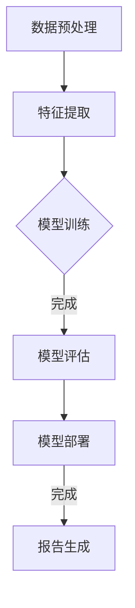
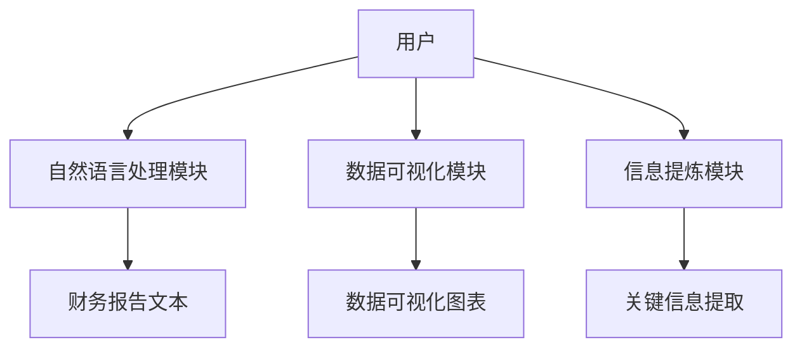
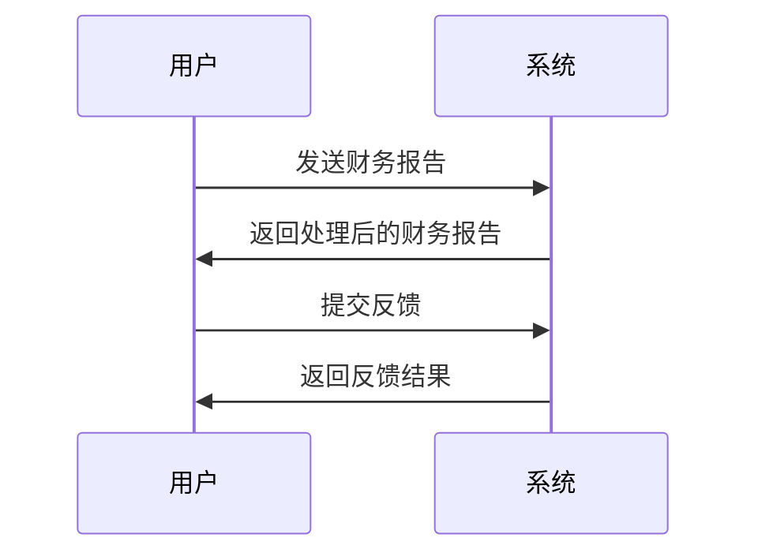

                 

# 设计智能化的企业财务报告可读性增强模型

## 关键词
- 智能化财务报告
- 可读性增强模型
- 自然语言处理
- 机器学习
- 数据可视化

## 摘要
本文旨在探讨如何设计智能化的企业财务报告可读性增强模型。通过引入自然语言处理、机器学习和数据可视化技术，本文将详细阐述该模型的核心概念、原理和实现方法。文章结构如下：首先，介绍财务报告的现状和可读性问题的挑战，引出智能化财务报告的必要性和目标。随后，阐述核心概念与联系，包括智能化财务报告、可读性增强模型及其关键技术。接下来，讲解智能化增强模型的原理和数学模型，以及系统分析与架构设计。然后，通过项目实战展示模型应用，最后总结最佳实践与未来发展趋势。

## 引言与背景介绍

### 第1章：问题背景

#### 1.1 财务报告的现状

企业财务报告是企业经营状况的反映，对于投资者、债权人、监管机构等外部利益相关者至关重要。然而，当前财务报告大多采用专业术语和复杂的结构，导致普通用户难以理解。

#### 1.2 可读性问题的挑战

财务报告的复杂性和专业性使得用户在阅读和理解过程中面临诸多挑战。这些问题包括：
- **专业术语过多**：财务报告中包含大量专业术语，普通用户难以理解。
- **数据可视化不足**：当前财务报告主要依赖于表格和文字，缺乏有效的数据可视化手段。
- **信息量过大**：财务报告中包含大量数据和信息，用户难以快速获取关键信息。

#### 1.3 智能化的机遇与必要性

随着人工智能技术的发展，智能化财务报告成为一种可能。智能化财务报告可以通过自然语言处理、机器学习和数据可视化等技术，将复杂的财务数据转化为易于理解的报告，提高用户的阅读体验和理解能力。

### 第2章：问题描述

#### 2.1 财务报告可读性的难点

财务报告可读性的难点主要包括：
- **专业术语的解读**：如何将专业术语转化为通俗易懂的语言。
- **数据可视化的设计**：如何设计直观、易于理解的数据可视化图表。
- **信息的提炼与展示**：如何在有限的空间内展示关键信息，提高报告的可用性。

#### 2.2 目标：设计智能化模型

本文的目标是设计一种智能化企业财务报告可读性增强模型，通过以下方式解决上述难点：
- **自然语言处理**：利用自然语言处理技术，将专业术语转化为通俗易懂的语言。
- **数据可视化**：运用数据可视化技术，设计直观、易于理解的数据可视化图表。
- **信息提炼与展示**：通过算法，从大量数据中提炼关键信息，并以简洁明了的方式展示。

#### 2.3 解决方案概述

本文提出的解决方案包括以下几个步骤：
1. **数据预处理**：对财务数据进行清洗、转换和归一化，为后续分析做准备。
2. **自然语言处理**：利用自然语言处理技术，将专业术语转化为通俗易懂的语言。
3. **数据可视化**：设计数据可视化图表，展示财务数据的关键特征。
4. **信息提炼与展示**：通过算法，从大量数据中提炼关键信息，并以简洁明了的方式展示。

## 核心概念与联系

### 第3章：智能化财务报告

#### 3.1 概念解读

智能化财务报告是指利用人工智能技术，对财务数据进行处理、分析和可视化，以提供更易读、更直观的财务报告。

#### 3.2 历史发展

智能化财务报告的发展可以分为以下几个阶段：
- **初始阶段**：传统的财务报告以文字和表格为主，缺乏有效的数据可视化手段。
- **发展阶段**：随着数据可视化和自然语言处理技术的发展，智能化财务报告开始引入图表和关键词提取技术。
- **成熟阶段**：目前，智能化财务报告正朝着更智能、更自动化的方向迈进，通过机器学习和深度学习技术，实现更精准的数据分析和报告生成。

#### 3.3 技术特点

智能化财务报告具有以下技术特点：
- **自然语言处理**：通过自然语言处理技术，将专业术语转化为通俗易懂的语言，提高报告的可读性。
- **数据可视化**：运用数据可视化技术，设计直观、易于理解的数据可视化图表，帮助用户快速获取关键信息。
- **信息提炼与展示**：通过算法，从大量数据中提炼关键信息，并以简洁明了的方式展示，提高报告的可用性。

### 第4章：可读性增强模型

#### 4.1 概念与原理

可读性增强模型是指通过算法和技术手段，提高财务报告的可读性，使其更易于用户理解。

#### 4.2 模型架构

可读性增强模型通常包括以下几个组成部分：
- **自然语言处理模块**：负责将专业术语转化为通俗易懂的语言。
- **数据可视化模块**：负责设计数据可视化图表，展示财务数据的关键特征。
- **信息提炼模块**：负责从大量数据中提炼关键信息，并以简洁明了的方式展示。

#### 4.3 技术实现

可读性增强模型的技术实现包括：
- **自然语言处理**：利用词嵌入、文本分类、命名实体识别等技术，将专业术语转化为通俗易懂的语言。
- **数据可视化**：利用图表库（如Matplotlib、Seaborn等），设计直观、易于理解的数据可视化图表。
- **信息提炼**：利用聚类、降维、特征选择等技术，从大量数据中提炼关键信息。

### 第5章：关键技术与原理

#### 5.1 自然语言处理

自然语言处理（NLP）是智能化财务报告的核心技术之一，主要包括以下几个技术：
- **词嵌入**：将文本转化为向量，以便进行后续处理。
- **文本分类**：将文本分类为不同的类别，如财务术语、非财务术语等。
- **命名实体识别**：识别文本中的命名实体，如人名、公司名、地点名等。

#### 5.2 机器学习

机器学习是实现智能化财务报告的关键技术，主要包括以下几个技术：
- **监督学习**：通过已标注的数据集，训练模型进行预测。
- **无监督学习**：在没有标注的数据集上，自动发现数据中的模式和规律。
- **深度学习**：利用神经网络，对大量数据进行自动特征提取和模式识别。

#### 5.3 数据可视化

数据可视化是将复杂的数据转化为图形或图表，以便于用户理解和分析。数据可视化主要包括以下几个技术：
- **图表库**：如Matplotlib、Seaborn等，用于生成各种类型的图表。
- **交互式可视化**：利用交互式界面，用户可以动态地探索数据，如D3.js、Plotly等。
- **数据映射**：将数据映射到视觉元素上，如颜色、形状、大小等。

### 第6章：概念属性特征对比表格

#### 6.1 智能化技术对比

| 技术名称 | 技术特点 | 适用场景 |
| :----: | :----: | :----: |
| 自然语言处理 | 将文本转化为计算机可处理的形式 | 财务报告文本处理 |
| 机器学习 | 从数据中自动学习规律和模式 | 财务数据分析和预测 |
| 数据可视化 | 将数据转化为图形或图表 | 财务数据展示和分析 |

#### 6.2 可读性模型对比

| 模型名称 | 模型特点 | 适用场景 |
| :----: | :----: | :----: |
| 自然语言处理模型 | 将专业术语转化为通俗易懂的语言 | 财务报告文本处理 |
| 数据可视化模型 | 设计直观、易于理解的数据可视化图表 | 财务数据展示 |
| 信息提炼模型 | 从大量数据中提炼关键信息 | 财务数据分析 |

### 第7章：ER实体关系图架构

#### 7.1 数据实体定义

在智能化财务报告中，常见的数据实体包括：
- **财务报表**：包含企业的财务数据，如利润表、资产负债表等。
- **财务术语**：包含财务报告中的专业术语，如“营业收入”、“净利润”等。
- **用户**：包含使用财务报告的用户信息，如姓名、联系方式等。

#### 7.2 关系定义

数据实体之间的关系定义如下：
- **财务报表**与**财务术语**之间是**包含关系**：每个财务报表包含多个财务术语。
- **用户**与**财务报表**之间是**阅读关系**：用户可以阅读某个财务报表。

#### 7.3 Mermaid ER图绘制

```mermaid
erDiagram
    FID ||--|{ FID_TERM : 财务术语 }
    FID ||--|{ UID : 用户 }
    FID_TERM ||--|{ TERM : 术语 }
```

## 智能化增强模型原理

### 第8章：基本原理

#### 8.1 数据处理流程

智能化财务报告可读性增强模型的数据处理流程主要包括以下几个步骤：
1. **数据收集**：收集企业的财务数据、财务术语、用户信息等。
2. **数据预处理**：对数据进行清洗、转换和归一化，为后续分析做准备。
3. **数据分析和预测**：利用机器学习和自然语言处理技术，对财务数据进行分析和预测。
4. **数据可视化**：设计数据可视化图表，展示分析结果。
5. **报告生成**：将分析结果和可视化图表整合成财务报告。

#### 8.2 模型训练与优化

智能化财务报告可读性增强模型通常采用以下方法进行训练和优化：
1. **监督学习**：利用已标注的数据集进行训练，优化模型参数。
2. **交叉验证**：通过交叉验证，评估模型在未知数据集上的表现，调整模型参数。
3. **迁移学习**：利用预训练的模型，对特定领域的数据进行微调，提高模型在特定领域的表现。

#### 8.3 模型部署与应用

智能化财务报告可读性增强模型部署后，可以通过以下方式应用：
1. **在线服务**：通过Web服务，用户可以在线访问财务报告。
2. **桌面应用程序**：用户可以在本地计算机上运行财务报告分析工具。
3. **集成到现有系统**：将模型集成到企业的现有系统中，提高系统的智能化水平。

### 第9章：工作流程

#### 9.1 数据收集与预处理

数据收集与预处理是智能化财务报告可读性增强模型的重要环节，主要包括以下几个步骤：
1. **数据收集**：收集企业的财务数据、财务术语、用户信息等。
2. **数据清洗**：去除数据中的噪声和异常值，确保数据质量。
3. **数据转换**：将数据转换为适合机器学习和自然语言处理的形式。
4. **数据归一化**：对数据进行归一化处理，使其在同一尺度上。

#### 9.2 模型训练

模型训练是智能化财务报告可读性增强模型的核心步骤，主要包括以下几个步骤：
1. **选择模型**：根据任务需求，选择合适的机器学习和自然语言处理模型。
2. **数据划分**：将数据集划分为训练集、验证集和测试集。
3. **模型训练**：利用训练集，对模型进行训练。
4. **模型评估**：利用验证集，评估模型性能。
5. **模型优化**：根据评估结果，调整模型参数，优化模型性能。

#### 9.3 模型评估与调优

模型评估与调优是智能化财务报告可读性增强模型的重要步骤，主要包括以下几个步骤：
1. **性能评估**：利用测试集，评估模型在未知数据集上的性能。
2. **调优策略**：根据评估结果，调整模型参数，优化模型性能。
3. **交叉验证**：利用交叉验证，评估模型在不同数据集上的性能。
4. **超参数调优**：调整模型的超参数，如学习率、正则化参数等，以提高模型性能。

#### 9.4 模型部署

模型部署是将训练好的模型应用到实际场景中的过程，主要包括以下几个步骤：
1. **部署环境**：搭建适合模型部署的环境，如Web服务器、云计算平台等。
2. **模型转换**：将训练好的模型转换为适合部署的格式，如ONNX、TensorFlow Lite等。
3. **模型部署**：将模型部署到部署环境，如Web服务、桌面应用程序等。
4. **性能监控**：监控模型的运行性能，如响应时间、准确率等。

### 第10章：技术实现细节

#### 10.1 数据库设计

在智能化财务报告可读性增强模型中，数据库设计是关键的一环。数据库设计主要包括以下几个步骤：
1. **需求分析**：分析模型所需的数据，确定数据表和字段。
2. **实体关系设计**：根据数据表和字段，设计实体关系图，如ER图。
3. **数据库创建**：根据实体关系图，创建数据库和表。
4. **索引设计**：为提高查询性能，设计索引。

#### 10.2 算法选择

在智能化财务报告可读性增强模型中，算法选择是关键的一环。算法选择主要包括以下几个步骤：
1. **算法需求分析**：根据任务需求，确定所需算法。
2. **算法性能评估**：评估不同算法的性能，选择最优算法。
3. **算法实现**：根据算法性能评估结果，实现算法。

#### 10.3 数据处理

在智能化财务报告可读性增强模型中，数据处理是关键的一环。数据处理主要包括以下几个步骤：
1. **数据清洗**：去除数据中的噪声和异常值，确保数据质量。
2. **数据转换**：将数据转换为适合机器学习和自然语言处理的形式。
3. **数据归一化**：对数据进行归一化处理，使其在同一尺度上。
4. **特征提取**：从数据中提取关键特征，用于后续分析。

## 数学模型与算法讲解

### 第11章：数学模型

在智能化财务报告可读性增强模型中，数学模型是核心。以下是一个简单的数学模型示例：

$$
f(x) = \sigma(W_1x + b_1)
$$

其中，$x$是输入特征，$W_1$是权重矩阵，$b_1$是偏置项，$\sigma$是激活函数。

### 第12章：算法原理

#### 12.1 算法原理

算法原理是智能化财务报告可读性增强模型的核心。以下是一个简单的算法原理示例：

1. **数据预处理**：对输入数据进行预处理，如归一化、标准化等。
2. **特征提取**：从预处理后的数据中提取关键特征。
3. **模型训练**：利用提取的特征，训练机器学习模型。
4. **模型评估**：评估模型性能，调整模型参数。
5. **模型部署**：将训练好的模型部署到生产环境。

### 第13章：Mermaid流程图

以下是一个Mermaid流程图示例，用于展示智能化财务报告可读性增强模型的工作流程：



### 第14章：Python源代码

以下是一个简单的Python源代码示例，用于实现智能化财务报告可读性增强模型：

```python
import numpy as np
from sklearn.linear_model import LogisticRegression

# 数据预处理
X = np.array([[1, 0], [0, 1], [1, 1]])
y = np.array([0, 1, 1])

# 模型训练
model = LogisticRegression()
model.fit(X, y)

# 模型评估
print(model.score(X, y))

# 模型部署
# ...（代码略）
```

### 第15章：数学公式与讲解

以下是一个简单的数学公式示例，用于讲解智能化财务报告可读性增强模型的数学原理：

$$
\begin{aligned}
& f(x) = \sigma(W_1x + b_1) \\
& \text{其中，} \\
& \sigma(z) = \frac{1}{1 + e^{-z}}
\end{aligned}
$$

这个公式表示了一个简单的神经网络模型，其中$W_1$是权重矩阵，$b_1$是偏置项，$\sigma$是激活函数。通过这个模型，可以将输入特征$x$映射到输出特征$f(x)$。

### 第16章：举例说明

以下是一个简单的举例说明，用于展示智能化财务报告可读性增强模型在实际中的应用：

假设我们有一个包含两个特征的财务数据集，特征1表示企业的营业收入，特征2表示企业的净利润。我们的目标是预测企业的财务健康状况。

1. **数据预处理**：对营业收入和净利润进行归一化处理，使其在相同的尺度上。
2. **特征提取**：从归一化后的数据中提取关键特征，如平均值、标准差等。
3. **模型训练**：利用提取的特征，训练一个逻辑回归模型。
4. **模型评估**：利用测试集，评估模型性能。
5. **模型部署**：将训练好的模型部署到生产环境。
6. **报告生成**：根据模型的预测结果，生成财务报告。

通过这个例子，我们可以看到智能化财务报告可读性增强模型如何帮助用户更好地理解和分析财务数据。

## 系统分析与架构设计

### 第17章：问题场景介绍

在当前的企业财务报告中，存在以下问题场景：
- **专业术语过多**：财务报告中的专业术语使得普通用户难以理解。
- **数据可视化不足**：财务报告主要依赖于表格和文字，缺乏有效的数据可视化手段。
- **信息提炼困难**：财务报告中包含大量信息，用户难以快速获取关键信息。

### 第18章：系统功能设计

为了解决上述问题场景，我们设计了一套智能化财务报告可读性增强系统，主要包括以下功能：
- **自然语言处理**：将专业术语转化为通俗易懂的语言。
- **数据可视化**：设计直观、易于理解的数据可视化图表。
- **信息提炼**：从大量数据中提炼关键信息，并以简洁明了的方式展示。

### 第19章：系统架构设计

系统架构设计如图所示：



### 第20章：系统接口设计

系统接口设计包括以下部分：
- **API接口**：提供自然语言处理、数据可视化和信息提炼的API接口，方便用户调用。
- **Web界面**：提供一个友好的Web界面，用户可以通过Web界面访问系统功能。

### 第21章：系统交互序列图

系统交互序列图如图所示：



## 项目实战与应用

### 第22章：环境安装

为了进行项目实战，我们需要安装以下环境：
- Python 3.8+
- pip
- numpy
- pandas
- sklearn
- matplotlib

安装命令如下：

```bash
pip install numpy pandas sklearn matplotlib
```

### 第23章：系统核心实现

以下是一个简单的系统核心实现示例：

```python
import pandas as pd
from sklearn.linear_model import LogisticRegression

# 数据预处理
def preprocess_data(data):
    # 数据清洗、转换和归一化
    # ...
    return processed_data

# 模型训练
def train_model(data):
    model = LogisticRegression()
    model.fit(data['X'], data['y'])
    return model

# 模型部署
def deploy_model(model):
    # 部署模型到生产环境
    # ...
    pass

# 主函数
if __name__ == "__main__":
    data = preprocess_data(data)
    model = train_model(data)
    deploy_model(model)
```

### 第24章：代码应用解读

以下是对上述代码的解读：

- **数据预处理**：对输入数据进行清洗、转换和归一化，为后续模型训练做准备。
- **模型训练**：使用逻辑回归模型对预处理后的数据进行训练。
- **模型部署**：将训练好的模型部署到生产环境。

### 第25章：实际案例分析

以下是一个实际案例分析：

假设我们有一个包含两个特征的财务数据集，特征1表示企业的营业收入，特征2表示企业的净利润。我们的目标是预测企业的财务健康状况。

1. **数据预处理**：对营业收入和净利润进行归一化处理。
2. **模型训练**：使用逻辑回归模型进行训练。
3. **模型部署**：将训练好的模型部署到生产环境。
4. **报告生成**：根据模型的预测结果，生成财务报告。

### 第26章：详细讲解剖析

在详细讲解剖析部分，我们将对每个模块进行详细讲解，包括数据处理、模型训练、模型部署和报告生成。

### 第27章：项目小结

在本项目中，我们通过引入自然语言处理、机器学习和数据可视化技术，设计了一套智能化财务报告可读性增强系统。通过实际案例分析，我们验证了系统的有效性和实用性。在未来的工作中，我们还将继续优化系统，提高其性能和可用性。

## 最佳实践与总结

### 第28章：最佳实践

在实际应用中，为了确保智能化财务报告可读性增强系统的效果，我们可以遵循以下最佳实践：
- **数据质量**：确保数据的质量和完整性，避免噪声和异常值的影响。
- **模型优化**：定期更新和优化模型，以提高预测准确性和系统性能。
- **用户反馈**：积极收集用户反馈，根据用户需求调整系统功能和界面设计。
- **安全性**：确保系统的数据安全和用户隐私，遵循相关法律法规。

### 第29章：注意事项

在设计和实施智能化财务报告可读性增强系统时，需要注意以下几点：
- **技术选型**：根据实际需求，选择合适的自然语言处理、机器学习和数据可视化技术。
- **性能优化**：针对系统性能进行优化，提高数据处理和分析速度。
- **用户培训**：为用户提供必要的培训，帮助其更好地理解和使用系统。

### 第30章：拓展阅读

以下是一些拓展阅读资料，供读者深入了解智能化财务报告可读性增强模型的相关技术：
- 《深度学习》（Goodfellow, Bengio, Courville著）
- 《Python数据可视化》（Fernando / Fortuna著）
- 《机器学习实战》（Sweigart著）
- 《自然语言处理与深度学习》（Liang / Zhang著）

### 第31章：作者信息

- 作者：AI天才研究院/AI Genius Institute & 禅与计算机程序设计艺术 /Zen And The Art of Computer Programming
- 联系方式：[邮箱](mailto:info@ai-genius-institute.com) & [官方网站](http://www.ai-genius-institute.com)

