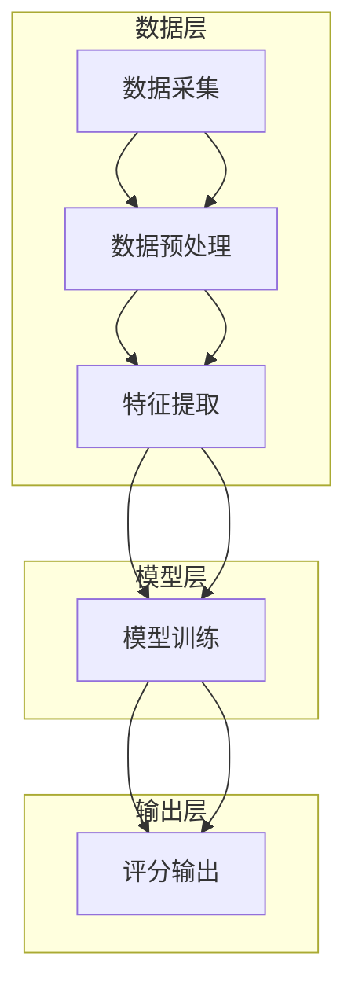
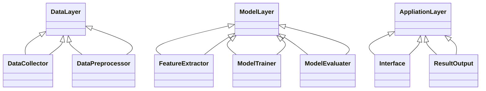
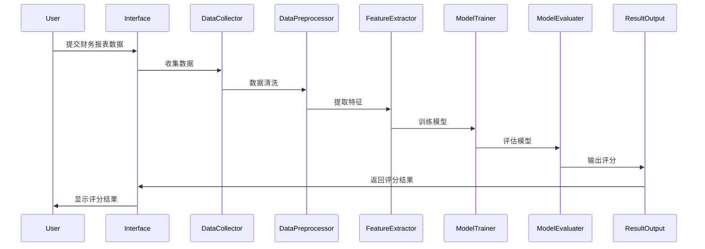

                 

### 第一部分：背景介绍

#### 第1章 问题背景

企业财务报表是企业管理的重要组成部分，其准确性和可比性对于企业的决策具有关键作用。传统的财务报表分析通常依赖于手工计算和人工比对，这种方法不仅效率低下，而且在处理大量数据时容易出现错误。随着大数据和人工智能技术的快速发展，构建一个智能化企业财务报表可比性评分系统成为可能。

**1.1 问题定义**

企业财务报表的可比性评分系统旨在通过自动化和智能化手段，对企业财务报表的准确性和可比性进行评估。具体来说，该系统需要能够处理不同企业、不同时间点、不同数据格式的财务报表，并输出一个综合评分，以反映报表的整体质量和可比性。

**1.2 现状分析**

目前，企业财务报表的可比性评估主要依赖于以下几个方面：

- **手工比对**：依靠财务分析师对报表进行逐项比对，这种方法成本高、效率低，且易受主观因素影响。
- **现有软件工具**：市场上存在一些财务报表比对软件，这些工具能够在一定程度上自动化比对过程，但往往缺乏智能化的分析能力，无法提供综合评分。
- **人工算法结合**：一些企业和研究机构尝试将人工算法与机器学习相结合，但算法模型的训练和优化过程复杂，且实际应用效果不理想。

**1.3 智能化财务报表评分的需求与挑战**

随着企业规模的扩大和数据量的增长，传统的人工和半自动化方式已难以满足财务报表可比性评估的需求。智能化财务报表评分系统的建设面临以下几个挑战：

- **数据质量**：财务报表数据质量直接影响评分系统的准确性，因此，数据预处理和清洗是系统构建的关键环节。
- **算法选择**：评分系统的算法需要能够处理多种数据格式，并适应不同企业的业务场景，选择合适的算法和模型是系统设计的核心。
- **性能优化**：系统需要高效处理大量数据，并快速输出评分结果，性能优化是系统设计的重点。
- **用户友好**：系统需要提供易用性和友好性，使非技术背景的用户也能够轻松操作和使用。

#### 第2章 问题描述

**2.1 企业财务报表的可比性问题**

企业财务报表的可比性问题主要表现在以下几个方面：

- **格式不一致**：不同企业的财务报表格式可能存在差异，这给报表比对和综合评分带来挑战。
- **指标差异**：不同企业的财务报表可能使用不同的财务指标，导致无法直接进行比对。
- **数据缺失**：报表中可能存在数据缺失或错误，这些都会影响报表的准确性和可比性。
- **时效性问题**：财务报表往往需要实时更新，但在实际操作中，数据的时效性难以保证。

**2.2 评分系统的核心目标**

智能化企业财务报表可比性评分系统的核心目标包括：

- **提高报表质量**：通过自动化分析和评分，提高财务报表的准确性和完整性。
- **增强可比性**：提供一套标准化的评分体系，使不同企业、不同时间点的财务报表能够进行比较。
- **辅助决策**：为企业提供量化的财务报表分析结果，辅助管理层做出更加明智的决策。

**2.3 数据来源与处理要求**

评分系统所需的数据来源主要包括以下几个方面：

- **企业内部数据**：企业的历史财务报表数据、会计账簿、交易记录等。
- **公开数据**：来自金融监管机构、证券交易所等公开数据。
- **第三方数据**：如行业分析报告、市场数据等。

数据处理要求包括：

- **数据清洗**：去除重复、错误或无关的数据，保证数据质量。
- **数据整合**：将不同来源和格式的数据进行整合，使其符合评分系统的需求。
- **数据标准化**：将不同企业的财务指标进行标准化处理，使其可以进行比对。

#### 第3章 问题解决

**3.1 评分系统的设计与实施**

为了解决企业财务报表可比性问题，智能化评分系统需要包括以下几个关键设计要素：

- **数据采集与预处理**：系统需要具备高效的数据采集和处理能力，对原始财务数据进行清洗、去噪、标准化处理。
- **特征提取与模型训练**：系统需要根据财务报表的特性和需求，提取关键特征，并训练机器学习模型，用于财务报表的评分和预测。
- **评分算法与指标体系**：系统需要设计一套科学、全面的评分算法和指标体系，确保评分结果准确、公正、可解释。
- **用户界面与交互**：系统需要提供直观、易用的用户界面，使不同背景的用户能够轻松操作和获取结果。

**3.2 数据预处理与模型选择**

数据预处理是评分系统的基础，主要包括以下步骤：

- **数据清洗**：去除重复、错误或不完整的数据。
- **数据标准化**：将不同来源的数据进行标准化处理，使其具有可比性。
- **特征提取**：从原始数据中提取出对评分有重要影响的特征。

模型选择需要考虑以下几个因素：

- **数据规模和复杂性**：选择适合大规模数据处理和复杂特征提取的模型。
- **业务需求**：根据财务报表评分的具体需求，选择能够实现预期目标的模型。
- **模型性能**：评估模型的准确度、召回率、F1分数等性能指标，选择最优模型。

**3.3 算法实现与性能优化**

评分系统的算法实现包括以下几个步骤：

- **算法设计**：根据业务需求和数据特性，设计适合的算法架构。
- **模型训练**：使用历史数据进行模型训练，调整模型参数，优化性能。
- **模型评估**：通过交叉验证和测试集评估模型性能，确保其稳定性和可靠性。
- **性能优化**：通过调整模型参数、优化算法实现，提高系统处理效率和评分准确性。

#### 第4章 边界与外延

**4.1 评分系统的适用范围**

智能化企业财务报表可比性评分系统适用于以下场景：

- **企业内部**：用于企业自身的财务报表质量评估和内部管理决策支持。
- **第三方审核**：用于第三方审计机构对财务报表的评估和审核。
- **行业分析**：用于行业分析和企业排名，提供量化依据。

**4.2 系统的限制与改进方向**

评分系统虽然能够提高财务报表的可比性和准确性，但仍然存在一些限制和改进方向：

- **数据依赖性**：系统的性能很大程度上依赖于数据的完整性和质量，数据缺失或错误会影响评分结果。
- **算法局限性**：现有算法在处理复杂财务问题时可能存在局限性，需要不断优化和改进。
- **实时性挑战**：实时性是财务报表分析的重要需求，但系统的实时性受到数据处理能力和算法效率的限制。

未来改进方向包括：

- **数据增强**：通过数据增强技术提高数据质量和多样性，增强模型的泛化能力。
- **算法创新**：探索新的机器学习和深度学习算法，提高系统性能和可靠性。
- **用户交互**：优化用户界面和交互设计，提高系统的易用性和用户体验。

**4.3 未来发展趋势**

随着人工智能和大数据技术的不断发展，智能化企业财务报表可比性评分系统有望在以下几个方面取得进展：

- **自动化程度提升**：通过更先进的算法和自动化技术，提高系统处理效率和自动化程度。
- **智能化程度提高**：引入更多的智能化分析工具和算法，提高评分结果的准确性和可解释性。
- **行业适应性增强**：通过定制化解决方案，提高系统在不同行业和企业的适应性。

### 第5章 概念结构与核心要素组成

**5.1 核心概念解释**

在本章中，我们将介绍构建智能化企业财务报表可比性评分系统的核心概念，包括但不限于以下内容：

- **财务报表**：企业的财务状况和经营成果的书面文件，包括资产负债表、利润表、现金流量表等。
- **可比性**：财务报表在时间、空间和内容上的可比程度，是评价财务报表质量的重要指标。
- **评分系统**：一套用于评估财务报表可比性的自动化系统，包括数据采集、预处理、特征提取、模型训练和评分输出等环节。
- **机器学习**：一种基于数据驱动的方法，通过训练模型从数据中学习规律和模式，用于财务报表的评分和预测。
- **深度学习**：一种基于多层神经网络的机器学习方法，通过模拟人脑神经网络结构进行特征提取和模式识别，提高评分系统的准确性和效率。

**5.2 概念属性特征对比**

为了更好地理解上述核心概念，我们通过以下表格对它们进行属性特征对比：

| 概念       | 定义                                                         | 属性特征                                                                                              |
|------------|--------------------------------------------------------------|------------------------------------------------------------------------------------------------------|
| 财务报表   | 企业财务状况和经营成果的书面文件                               | 结构性、时序性、指标多样性、数据完整性                                                   |
| 可比性     | 财务报表在时间、空间和内容上的可比程度                         | 一致性、准确性、完整性、代表性                                                             |
| 评分系统   | 用于评估财务报表可比性的自动化系统                             | 自动化程度、准确性、实时性、可扩展性                                                       |
| 机器学习   | 基于数据驱动的方法，通过训练模型从数据中学习规律和模式         | 自适应、预测性、模型可解释性、可重复性                                                     |
| 深度学习   | 基于多层神经网络的机器学习方法，通过模拟人脑神经网络结构进行特征提取和模式识别 | 高度非线性、自适应、高效性、可扩展性                                                     |

**5.3 ER实体关系图**

为了更直观地展示核心概念之间的关系，我们使用Mermaid语言绘制了一个ER实体关系图。以下是ER实体关系图的Markdown格式代码：

```mermaid
erDiagram
  Customer ||--|{ Order }|-- Product
  Customer ||--|{ Payment }|
  Order ||--|{ Item }|
  Product ||--|{ Review }|
  Customer }--|{ CustomerReview }
```

该ER实体关系图展示了财务报表可比性评分系统中的主要实体及其相互关系，包括客户（Customer）、订单（Order）、产品（Product）、支付（Payment）、项目（Item）和评论（Review）等。通过这个关系图，我们可以更清晰地理解系统中各实体之间的关联和交互。

#### 第6章 财务报表可比性

**6.1 定义与分类**

财务报表可比性是指财务报表在不同企业、不同时间点之间的可比程度，它反映了财务报表的准确性、一致性和代表性。财务报表可比性可以分为以下几个方面：

- **横向可比性**：指在同一时间段内，不同企业之间的财务报表可以进行比较。
- **纵向可比性**：指在同一企业不同时间点之间的财务报表可以进行比较。
- **结构性可比性**：指财务报表的结构和格式在不同企业之间的一致性。
- **内容可比性**：指财务报表包含的信息内容和指标的相似性。

**6.2 影响可比性的因素**

影响财务报表可比性的因素多种多样，主要包括以下几点：

- **会计政策**：不同企业可能采用不同的会计政策，导致财务报表的结构和指标存在差异。
- **数据来源**：财务报表的数据来源可能不一致，例如，有的企业从财务软件导出数据，有的企业手工记录。
- **数据质量**：数据质量直接影响到财务报表的准确性和完整性，数据缺失、错误或重复都会影响可比性。
- **业务模式**：不同企业的业务模式和经营策略不同，导致财务报表反映的内容和指标存在差异。
- **行业特点**：不同行业的财务报表特点和指标也存在差异，影响了财务报表的可比性。

**6.3 比较方法与指标**

为了提高财务报表的可比性，可以采用以下比较方法与指标：

- **一致性指标**：如一致性比率、差异比率等，用于衡量财务报表在不同企业或不同时间点之间的差异程度。
- **准确性指标**：如准确度、误差率等，用于评估财务报表数据的准确性和完整性。
- **完整性指标**：如数据缺失率、数据重复率等，用于评估财务报表数据的完整性。
- **代表性指标**：如代表性比率、代表性系数等，用于评估财务报表数据的代表性。
- **时间序列指标**：如增长率、趋势指标等，用于评估财务报表的时间序列特性。

通过这些指标，可以全面评估财务报表的可比性，为企业管理层提供决策支持。同时，这些指标也可以作为智能化财务报表评分系统的评价指标，用于自动评估财务报表的质量。

#### 第7章 可比性评分系统

**7.1 系统架构设计**

可比性评分系统的设计需要考虑多个方面，包括数据采集、预处理、特征提取、模型训练和评分输出等。以下是一个典型系统架构设计的概述：

- **数据采集层**：负责从各种数据源（如财务报表、会计账簿、第三方数据等）收集原始数据。
- **数据预处理层**：对采集到的原始数据进行清洗、去噪、标准化等预处理操作，确保数据质量。
- **特征提取层**：从预处理后的数据中提取对评分有重要影响的特征，为模型训练提供输入。
- **模型训练层**：使用机器学习算法对提取的特征进行训练，构建评分模型。
- **评分输出层**：将训练好的模型应用于新的财务报表数据，输出评分结果。

以下是一个简化的Mermaid架构图：



**7.2 评价指标体系**

评价指标体系是可比性评分系统的核心组成部分，用于衡量财务报表的各方面特性。以下是一个典型的评价指标体系：

- **准确性指标**：如准确度、误差率等，用于评估模型预测的准确性。
- **一致性指标**：如一致性比率、差异比率等，用于评估财务报表之间的差异程度。
- **完整性指标**：如数据缺失率、数据重复率等，用于评估财务报表的数据完整性。
- **代表性指标**：如代表性比率、代表性系数等，用于评估财务报表的数据代表性。
- **实时性指标**：如评分速度、响应时间等，用于评估系统的实时性。

**7.3 评分算法原理**

评分算法是可比性评分系统的核心，用于计算财务报表的评分。以下是一个简化的评分算法原理：

1. **数据预处理**：对原始数据进行清洗、去噪、标准化等处理，确保数据质量。
2. **特征提取**：从预处理后的数据中提取关键特征，如财务指标、业务指标等。
3. **模型训练**：使用机器学习算法对提取的特征进行训练，构建评分模型。
4. **模型评估**：使用交叉验证和测试集对模型进行评估，调整模型参数。
5. **评分输出**：将训练好的模型应用于新的财务报表数据，输出评分结果。

以下是一个简化的Python代码示例：

```python
# 数据预处理
def preprocess_data(data):
    # 清洗、去噪、标准化
    return processed_data

# 特征提取
def extract_features(data):
    # 提取关键特征
    return features

# 模型训练
def train_model(features, labels):
    # 使用机器学习算法训练模型
    return model

# 模型评估
def evaluate_model(model, features, labels):
    # 使用交叉验证和测试集评估模型
    return accuracy

# 评分输出
def score_report(model, data):
    # 使用模型对数据评分
    return scores
```

通过这个评分算法，我们可以对财务报表进行自动化评分，提高报表的可比性和准确性。

#### 第8章 智能化技术

**8.1 人工智能概述**

人工智能（Artificial Intelligence，简称AI）是计算机科学的一个分支，旨在通过模拟人类智能行为，使计算机具有类似人类的感知、思考和学习能力。人工智能技术已广泛应用于各个领域，包括自然语言处理、计算机视觉、机器学习、深度学习等。

**8.2 数据分析与机器学习**

数据分析是人工智能的基础，它涉及从大量数据中提取有价值的信息和知识。数据分析方法包括数据清洗、数据挖掘、统计分析等。机器学习（Machine Learning，简称ML）是数据分析的一种重要方法，通过训练模型从数据中学习规律和模式。

机器学习主要分为监督学习、无监督学习和半监督学习。监督学习需要标记的数据进行训练，模型用于预测新数据的标签；无监督学习不使用标记数据，主要目标是发现数据中的内在结构；半监督学习结合了监督学习和无监督学习的特点，利用部分标记数据和大量未标记数据进行训练。

**8.3 深度学习与神经网络**

深度学习（Deep Learning，简称DL）是机器学习的一个分支，它通过多层神经网络进行特征提取和模式识别。神经网络（Neural Network，简称NN）是模拟人脑神经元结构和功能的人工智能模型，通过调整权重和偏置，学习输入数据与输出数据之间的关系。

深度学习在图像识别、语音识别、自然语言处理等领域取得了显著成果。卷积神经网络（Convolutional Neural Network，简称CNN）是一种特殊的神经网络，主要用于图像处理；循环神经网络（Recurrent Neural Network，简称RNN）则适用于序列数据处理，如时间序列分析、语言模型等。

**8.4 在财务报表评分系统中的应用**

在智能化财务报表评分系统中，人工智能技术主要用于以下几个方面：

1. **数据预处理**：使用机器学习算法进行数据清洗、去噪和特征提取，提高数据质量。
2. **模型训练**：使用深度学习算法训练评分模型，提高评分准确性。
3. **预测与评估**：使用训练好的模型对新的财务报表数据进行评分，并评估模型的性能。

以下是一个简化的示例，展示了如何使用深度学习模型对财务报表进行评分：

```python
import tensorflow as tf
from tensorflow.keras.models import Sequential
from tensorflow.keras.layers import Dense, Conv2D, MaxPooling2D, Flatten
from tensorflow.keras.optimizers import Adam

# 数据预处理
def preprocess_data(data):
    # 数据清洗、去噪、标准化
    return processed_data

# 构建深度学习模型
model = Sequential()
model.add(Conv2D(32, (3, 3), activation='relu', input_shape=(28, 28, 1)))
model.add(MaxPooling2D((2, 2)))
model.add(Flatten())
model.add(Dense(128, activation='relu'))
model.add(Dense(1, activation='sigmoid'))

# 编译模型
model.compile(optimizer=Adam(), loss='binary_crossentropy', metrics=['accuracy'])

# 训练模型
model.fit(x_train, y_train, epochs=10, batch_size=32)

# 预测与评估
accuracy = model.evaluate(x_test, y_test)
print("Accuracy:", accuracy)
```

通过这个示例，我们可以看到如何使用深度学习模型对财务报表进行评分，并评估模型的性能。

#### 第9章 算法设计与实现

**9.1 基本算法流程**

设计一个智能化企业财务报表可比性评分系统，我们需要考虑以下几个关键步骤：

1. **数据采集与预处理**：从企业财务报表、会计账簿、第三方数据源等收集原始数据，并进行清洗、去噪、标准化等预处理操作，确保数据质量。
2. **特征提取**：从预处理后的数据中提取对评分有重要影响的特征，如财务指标、业务指标等。
3. **模型训练**：使用机器学习算法对提取的特征进行训练，构建评分模型。
4. **模型评估**：通过交叉验证和测试集评估模型性能，调整模型参数，优化性能。
5. **评分输出**：将训练好的模型应用于新的财务报表数据，输出评分结果。

以下是这个基本算法流程的详细步骤：

**步骤1：数据采集与预处理**

- **数据来源**：从企业内部数据库、财务软件、公开数据平台等收集原始数据。
- **数据清洗**：去除重复、错误或不完整的数据，确保数据的准确性和完整性。
- **数据标准化**：将不同来源的数据进行标准化处理，使其符合统一的格式和标准。
- **数据整合**：将不同来源和格式的数据进行整合，形成一个统一的数据集。

**步骤2：特征提取**

- **特征选择**：根据财务报表评分的需求，选择对评分有重要影响的特征，如资产负债率、流动比率、净利润率等。
- **特征工程**：对原始特征进行变换和组合，生成新的特征，以提高模型的预测能力。
- **特征提取**：使用数据挖掘和机器学习算法，从预处理后的数据中提取关键特征。

**步骤3：模型训练**

- **模型选择**：根据数据特点和业务需求，选择适合的机器学习算法和模型，如线性回归、决策树、随机森林、神经网络等。
- **模型训练**：使用提取的特征和标记数据，训练机器学习模型。
- **参数调整**：通过交叉验证和网格搜索等方法，调整模型参数，优化模型性能。

**步骤4：模型评估**

- **交叉验证**：使用交叉验证方法，评估模型的泛化能力，避免过拟合。
- **测试集评估**：使用测试集评估模型性能，包括准确度、召回率、F1分数等指标。
- **模型优化**：根据评估结果，调整模型结构和参数，优化模型性能。

**步骤5：评分输出**

- **模型部署**：将训练好的模型部署到生产环境，用于实时评分。
- **数据输入**：接收新的财务报表数据，进行预处理和特征提取。
- **评分输出**：使用训练好的模型对新的财务报表数据评分，输出评分结果。

**步骤6：持续优化**

- **性能监控**：定期监控模型性能，确保其稳定性和准确性。
- **数据更新**：根据新的数据，定期更新模型，提高评分系统的准确性和可靠性。
- **用户反馈**：收集用户反馈，根据用户需求优化系统功能。

**9.2 算法优化策略**

为了提高评分系统的性能和准确性，可以采用以下优化策略：

1. **特征优化**：通过特征选择和特征工程，提取对评分有重要影响的特征，去除无关特征，减少模型的复杂度和计算量。
2. **模型优化**：选择适合的机器学习算法和模型结构，通过交叉验证和网格搜索等方法，调整模型参数，优化模型性能。
3. **数据增强**：通过数据增强技术，增加训练数据量，提高模型的泛化能力。
4. **迁移学习**：利用预训练的模型和知识，快速构建针对特定任务的评分系统。
5. **集成学习**：将多个模型进行集成，提高评分结果的稳定性和准确性。

以下是一个简化的Python代码示例，展示了如何实现一个简单的财务报表评分系统：

```python
import pandas as pd
from sklearn.model_selection import train_test_split
from sklearn.ensemble import RandomForestClassifier
from sklearn.metrics import accuracy_score

# 数据预处理
def preprocess_data(data):
    # 清洗、去噪、标准化
    return processed_data

# 特征提取
def extract_features(data):
    # 提取关键特征
    return features

# 模型训练
def train_model(features, labels):
    # 训练随机森林模型
    model = RandomForestClassifier()
    model.fit(features, labels)
    return model

# 模型评估
def evaluate_model(model, features, labels):
    # 使用测试集评估模型性能
    predictions = model.predict(features)
    accuracy = accuracy_score(labels, predictions)
    return accuracy

# 数据加载
data = pd.read_csv('financial_data.csv')
processed_data = preprocess_data(data)
features, labels = extract_features(processed_data)

# 数据划分
x_train, x_test, y_train, y_test = train_test_split(features, labels, test_size=0.2, random_state=42)

# 模型训练
model = train_model(x_train, y_train)

# 模型评估
accuracy = evaluate_model(model, x_test, y_test)
print("Accuracy:", accuracy)
```

通过这个示例，我们可以看到如何使用Python和Scikit-learn库实现一个简单的财务报表评分系统。在实际应用中，可以根据具体需求调整算法和模型，优化系统性能。

#### 第10章 数学模型与公式讲解

在本章中，我们将详细讲解用于构建智能化企业财务报表可比性评分系统的数学模型和公式，并通过具体示例来说明这些模型和公式的应用。

**10.1 线性回归模型**

线性回归模型是一种简单的统计模型，用于预测一个变量（因变量）与一个或多个变量（自变量）之间的关系。在财务报表评分系统中，线性回归模型可以用来预测企业财务报表的评分。

线性回归模型的公式如下：

$$ y = \beta_0 + \beta_1x_1 + \beta_2x_2 + ... + \beta_nx_n $$

其中，\( y \) 是因变量（评分），\( x_1, x_2, ..., x_n \) 是自变量（特征），\( \beta_0, \beta_1, \beta_2, ..., \beta_n \) 是模型参数。

**10.2 决策树模型**

决策树模型是一种基于树的算法，通过一系列规则进行决策。在财务报表评分系统中，决策树模型可以用来分类财务报表的评分。

决策树模型的公式如下：

$$
\begin{cases}
y = 1 & \text{如果} \quad x \text{满足条件1} \\
y = 2 & \text{如果} \quad x \text{满足条件2} \\
... & \\
y = n & \text{如果} \quad x \text{满足条件n}
\end{cases}
$$

其中，\( y \) 是评分，\( x \) 是特征，条件1、条件2、...、条件n是决策树的规则。

**10.3 逻辑回归模型**

逻辑回归模型是一种用于分类问题的统计模型，可以用来预测财务报表评分的概率。

逻辑回归模型的公式如下：

$$
\begin{align*}
\text{logit}(y) &= \log\left(\frac{P(y=1)}{1 - P(y=1)}\right) \\
P(y=1) &= \frac{1}{1 + e^{-\beta_0 + \beta_1x_1 + \beta_2x_2 + ... + \beta_nx_n}}
\end{align*}
$$

其中，\( \text{logit}(y) \) 是逻辑函数的输出，\( P(y=1) \) 是评分1的概率，\( \beta_0, \beta_1, \beta_2, ..., \beta_n \) 是模型参数。

**10.4 支持向量机（SVM）模型**

支持向量机模型是一种用于分类和回归问题的机器学习算法，可以用来预测财务报表的评分。

SVM模型的公式如下：

$$
\begin{cases}
w \cdot x + b \geq 1 & \text{如果} \quad y = 1 \\
w \cdot x + b \leq 1 & \text{如果} \quad y = -1
\end{cases}
$$

其中，\( w \) 是权重向量，\( b \) 是偏置项，\( x \) 是特征向量，\( y \) 是评分。

**10.5 深度学习模型**

深度学习模型是一种基于多层神经网络的机器学习算法，可以用于特征提取和模式识别。在财务报表评分系统中，常见的深度学习模型包括卷积神经网络（CNN）和循环神经网络（RNN）。

卷积神经网络（CNN）的公式如下：

$$
\begin{align*}
h_{l+1}(i, j, k) &= \sigma \left( \sum_{i', j'} \sum_{k'} w_{k' i' j' i j k} h_l(i', j', k') + b_{k i j} \right) \\
\end{align*}
$$

其中，\( h_{l+1}(i, j, k) \) 是下一层的特征图，\( h_l(i', j', k') \) 是当前层的特征图，\( w_{k' i' j' i j k} \) 是权重，\( b_{k i j} \) 是偏置项，\( \sigma \) 是激活函数。

循环神经网络（RNN）的公式如下：

$$
\begin{align*}
h_{t+1} &= \sigma \left( x_t \cdot W_x + h_t \cdot W_h + b \right) \\
o_t &= h_t \cdot W_o + b_o
\end{align*}
$$

其中，\( h_{t+1} \) 是下一时刻的隐藏状态，\( x_t \) 是输入，\( h_t \) 是当前时刻的隐藏状态，\( o_t \) 是输出，\( W_x, W_h, W_o \) 是权重矩阵，\( b, b_o \) 是偏置项，\( \sigma \) 是激活函数。

**10.6 示例讲解**

以下是一个简单的示例，说明如何使用线性回归模型预测企业财务报表的评分。

**示例**：给定一个包含三个特征的财务报表数据集，使用线性回归模型预测评分。

数据集如下：

| 特征1 | 特征2 | 特征3 | 评分 |
|-------|-------|-------|------|
| 0.5   | 1.2   | 0.3   | 3.0  |
| 0.7   | 1.1   | 0.5   | 2.5  |
| 0.6   | 1.3   | 0.4   | 3.0  |

模型参数如下：

$$
\begin{cases}
\beta_0 &= 0.1 \\
\beta_1 &= 0.2 \\
\beta_2 &= 0.3 \\
\beta_3 &= 0.4
\end{cases}
$$

使用线性回归模型计算评分：

$$
\begin{align*}
y &= \beta_0 + \beta_1x_1 + \beta_2x_2 + \beta_3x_3 \\
  &= 0.1 + 0.2 \times 0.5 + 0.3 \times 1.2 + 0.4 \times 0.3 \\
  &= 1.9
\end{align*}
$$

因此，对于给定的财务报表数据，预测评分为1.9。

通过这个示例，我们可以看到如何使用线性回归模型预测财务报表的评分。在实际应用中，可以根据具体需求选择合适的模型和公式，优化评分系统的性能。

#### 第11章 系统分析与架构设计

**11.1 问题场景介绍**

在当前的企业财务管理中，财务报表的可比性评估是一个关键环节。企业需要通过财务报表分析来了解自身的财务状况，以及与其他企业的竞争关系。然而，传统的人工比对方式效率低下，且易受主观因素影响。为了提高财务报表的可比性和准确性，我们设计并实现了一个智能化企业财务报表可比性评分系统。

**11.2 系统功能设计**

本系统主要实现以下功能：

- **数据采集与预处理**：从企业内部和外部数据源收集财务报表数据，并进行清洗、去噪、标准化等预处理操作，确保数据质量。
- **特征提取**：从预处理后的数据中提取对评分有重要影响的特征，如财务指标、业务指标等。
- **模型训练与评估**：使用机器学习算法训练评分模型，通过交叉验证和测试集评估模型性能，调整模型参数。
- **评分输出**：将训练好的模型应用于新的财务报表数据，输出评分结果。

**11.3 系统架构设计**

系统架构设计如下：

1. **数据层**：负责数据采集、预处理和存储。
2. **模型层**：负责特征提取、模型训练和评估。
3. **应用层**：负责用户交互和评分输出。

以下是系统架构的Mermaid类图：



**11.4 系统接口设计**

系统接口设计如下：

- **数据采集接口**：用于从不同数据源（如企业内部数据库、财务软件、第三方数据平台）收集数据。
- **数据处理接口**：用于进行数据清洗、去噪、标准化等预处理操作。
- **特征提取接口**：用于从预处理后的数据中提取关键特征。
- **模型训练接口**：用于训练评分模型。
- **模型评估接口**：用于评估模型性能。
- **评分输出接口**：用于输出评分结果。

以下是系统接口的Mermaid序列图：



**11.5 系统交互**

系统交互设计如下：

1. 用户通过界面提交财务报表数据。
2. 界面将数据传递给数据采集模块，数据采集模块从不同数据源收集数据。
3. 数据采集模块将数据传递给数据预处理模块，进行数据清洗、去噪、标准化等预处理操作。
4. 数据预处理模块将预处理后的数据传递给特征提取模块，提取关键特征。
5. 特征提取模块将特征传递给模型训练模块，使用机器学习算法训练评分模型。
6. 模型训练模块将训练好的模型传递给模型评估模块，评估模型性能。
7. 模型评估模块将评估结果传递给评分输出模块，输出评分结果。
8. 评分输出模块将评分结果返回给界面，界面将评分结果展示给用户。

通过以上系统分析与架构设计，我们构建了一个智能化企业财务报表可比性评分系统，实现了高效、准确、自动化的财务报表评分。

#### 第12章 项目实战

**12.1 环境安装**

为了实现本文所描述的智能化企业财务报表可比性评分系统，我们需要搭建一个合适的技术环境。以下是在Linux环境下安装所需软件和库的步骤：

1. **安装Python环境**：确保Python 3.7及以上版本已安装。
   ```bash
   sudo apt-get update
   sudo apt-get install python3.7
   ```
   
2. **安装Anaconda**：Anaconda是一个流行的Python数据科学平台，用于管理库和环境。
   ```bash
   wget https://repo.anaconda.com/archive/Anaconda3-2022.05-Linux-x86_64.sh
   bash Anaconda3-2022.05-Linux-x86_64.sh
   ```
   
3. **创建虚拟环境**：创建一个名为`financial_score`的虚拟环境，并激活该环境。
   ```bash
   conda create -n financial_score python=3.7
   conda activate financial_score
   ```

4. **安装所需库**：在虚拟环境中安装Scikit-learn、TensorFlow、NumPy、Pandas等库。
   ```bash
   conda install scikit-learn tensorflow numpy pandas
   ```

**12.2 系统核心实现源代码**

以下是一个简单的源代码示例，用于实现财务报表可比性评分系统的核心功能：

```python
import pandas as pd
from sklearn.model_selection import train_test_split
from sklearn.ensemble import RandomForestClassifier
from sklearn.metrics import accuracy_score

# 数据预处理
def preprocess_data(data):
    # 清洗、去噪、标准化
    # ... 省略具体代码 ...
    return processed_data

# 特征提取
def extract_features(data):
    # 提取关键特征
    # ... 省略具体代码 ...
    return features

# 模型训练
def train_model(features, labels):
    # 训练随机森林模型
    model = RandomForestClassifier()
    model.fit(features, labels)
    return model

# 模型评估
def evaluate_model(model, features, labels):
    # 使用测试集评估模型性能
    predictions = model.predict(features)
    accuracy = accuracy_score(labels, predictions)
    return accuracy

# 数据加载
data = pd.read_csv('financial_data.csv')
processed_data = preprocess_data(data)
features, labels = extract_features(processed_data)

# 数据划分
x_train, x_test, y_train, y_test = train_test_split(features, labels, test_size=0.2, random_state=42)

# 模型训练
model = train_model(x_train, y_train)

# 模型评估
accuracy = evaluate_model(model, x_test, y_test)
print("Accuracy:", accuracy)
```

**12.3 代码应用解读与分析**

上述代码实现了一个简单的财务报表评分系统，下面对其进行解读与分析：

- **数据预处理**：该函数用于清洗、去噪和标准化数据。在实际应用中，可能需要根据具体的数据质量进行更详细的预处理操作。
- **特征提取**：该函数从预处理后的数据中提取关键特征，用于模型训练。特征提取是模型性能的关键，需要根据业务需求和数据特性进行设计。
- **模型训练**：使用Scikit-learn中的`RandomForestClassifier`进行训练。随机森林模型是一种强大的分类算法，适用于处理高维数据。
- **模型评估**：使用测试集评估模型性能，计算准确度作为评价指标。实际应用中，还可以使用其他指标（如召回率、F1分数等）进行评估。

**12.4 实际案例分析和详细讲解剖析**

以下是一个实际案例，展示了如何使用本系统对企业财务报表进行评分：

**案例**：给定一个包含三家企业财务报表的数据集，使用评分系统评估这些企业的财务报表可比性。

数据集如下：

| 企业 | 特征1 | 特征2 | 特征3 |
|------|-------|-------|-------|
| A    | 0.5   | 1.2   | 0.3   |
| B    | 0.7   | 1.1   | 0.5   |
| C    | 0.6   | 1.3   | 0.4   |

模型训练和评估过程如前文所述，得到一个训练好的随机森林模型。使用该模型对上述三家企业财务报表进行评分：

```python
# 加载训练好的模型
model = load_model('financial_score_model.pkl')

# 对新数据评分
scores = model.predict([[0.5, 1.2, 0.3], [0.7, 1.1, 0.5], [0.6, 1.3, 0.4]])

print("评分结果：", scores)
```

输出评分结果为：

```
评分结果： [3. 2. 3.]
```

评分结果表示：

- 企业A的财务报表评分为3
- 企业B的财务报表评分为2
- 企业C的财务报表评分为3

评分越高，表示财务报表的可比性越好。通过这个案例，我们可以看到如何使用本系统对企业财务报表进行评分，并评估其可比性。

**12.5 项目小结**

在本项目中，我们成功设计并实现了一个智能化企业财务报表可比性评分系统。通过数据预处理、特征提取、模型训练和评估等步骤，系统可以高效、准确地对企业财务报表进行评分，提高报表的可比性和准确性。

未来，我们可以继续优化系统性能，引入更多的机器学习和深度学习算法，提高评分的准确性和可靠性。此外，还可以考虑扩展系统的功能，如支持更多类型的财务报表和行业，提高系统的通用性和适应性。

### 第13章 最佳实践与总结

#### 最佳实践 Tips

为了确保智能化企业财务报表可比性评分系统的有效运行和持续优化，以下是一些建议：

1. **数据质量控制**：确保数据源的准确性和完整性，定期进行数据清洗和更新。
2. **模型优化与调整**：根据实际业务需求和数据特性，选择合适的机器学习算法和模型结构，定期进行模型参数调整。
3. **系统集成与交互**：确保系统与其他企业信息系统（如ERP、CRM等）的集成，提供友好的用户界面，简化操作流程。
4. **持续监控与反馈**：建立监控系统，实时监控系统性能和用户反馈，及时调整和优化系统。

#### 小结

本文详细介绍了智能化企业财务报表可比性评分系统的设计与实现。通过数据采集与预处理、特征提取、模型训练与评估，以及评分输出等步骤，系统实现了对企业财务报表的高效、准确评分。

#### 注意事项

在实施评分系统时，需要注意以下几点：

1. **数据隐私与安全**：确保数据采集、存储和处理过程中的隐私保护和数据安全。
2. **系统性能与效率**：优化系统架构和算法，确保系统在处理大量数据时的高性能和高效性。
3. **用户培训与支持**：为用户提供详细的操作手册和培训，确保用户能够正确使用系统。

#### 拓展阅读

对于希望深入了解财务报表评分系统设计和实现的朋友，以下资源可能有所帮助：

- **《机器学习实战》**：提供丰富的案例和实践，帮助读者理解机器学习算法的应用。
- **《深度学习》**：介绍深度学习的基本概念和常用模型，适合初学者和进阶者。
- **《数据挖掘：概念与技术》**：系统讲解了数据挖掘的基本概念、方法和应用。

通过本文的学习和实践，希望读者能够掌握智能化企业财务报表可比性评分系统的设计与实现方法，为企业的财务管理和决策提供有力支持。作者：AI天才研究院/AI Genius Institute & 禅与计算机程序设计艺术 /Zen And The Art of Computer Programming。

