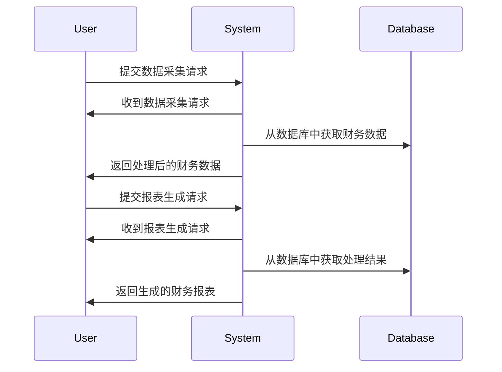

                 

# 设计智能化的企业财务报表生成系统

## 关键词

- 企业财务报表
- 智能化
- 人工智能技术
- 数据分析
- 算法原理

## 摘要

本文探讨了设计智能化企业财务报表生成系统的必要性和核心概念，分析了传统财务报表生成系统存在的问题，并提出了利用人工智能技术实现财务报表自动生成和数据分析的解决方案。通过详细介绍机器学习、自然语言处理、深度学习等技术的应用，阐述了智能化财务报表生成系统的原理和流程，以及系统的边界和外延。同时，本文还提供了核心概念属性特征对比表格、ER实体关系图架构和算法原理的讲解，为实际设计和开发智能化财务报表生成系统提供了理论依据和实践指导。

---

## 第一部分：引言

### 第1章：问题背景与核心概念

#### 1.1 问题背景

企业财务报表是企业财务管理的重要组成部分，用于反映企业的财务状况、经营成果和现金流量。然而，传统财务报表生成系统在效率和灵活性方面存在诸多问题：

1. **传统财务报表生成**：企业通常依赖手工编制或财务软件自动化生成财务报表。手工编制效率低、容易出错，且工作量大；财务软件生成的报表虽然自动化程度较高，但缺乏灵活性，难以满足企业多样化的报表需求。

2. **存在的问题**：
   - **效率低**：手工编制财务报表需要耗费大量人力和时间，且容易出错。
   - **灵活性不足**：财务软件生成的报表格式固定，难以根据业务需求进行调整。
   - **实时性较差**：传统财务报表生成系统无法快速响应业务变化，实时性较差。

3. **智能化财务报表的需求**：
   - **自动化**：提高财务报表生成效率，减少人为错误。
   - **智能化**：根据业务需求自动调整报表格式，提供数据分析功能。
   - **实时性**：支持实时数据更新，快速响应业务需求。

#### 1.2 核心概念

1. **智能化财务报表**：
   - **定义**：利用人工智能技术自动生成财务报表，并具备数据分析能力。
   - **特点**：自动化、智能化、实时性、灵活性。

2. **人工智能技术**：
   - **定义**：模拟人类智能的计算机系统。
   - **技术类别**：机器学习、深度学习、自然语言处理等。

#### 1.3 智能化财务报表生成系统的边界与外延

1. **系统边界**：
   - **系统范围**：涵盖从数据采集、处理到报表生成的全过程。
   - **系统功能**：自动生成财务报表、提供数据分析功能、支持报表格式自定义。

2. **系统外延**：
   - **与其他系统的集成**：与企业ERP系统、数据库系统等进行数据交互。
   - **拓展功能**：支持多语言报表、跨平台部署等。

#### 1.4 核心概念属性特征对比表格

| 特征       | 智能化财务报表 | 传统财务报表 |
| ---------- | -------------- | ------------ |
| 自动化程度 | 高             | 低           |
| 智能化程度 | 高             | 低           |
| 实时性     | 高             | 低           |
| 灵活性     | 高             | 低           |
| 数据分析能力 | 强             | 弱           |

#### 1.5 概念结构与核心要素组成

1. **概念结构**：
   - **数据采集**：收集企业财务数据。
   - **数据处理**：对数据进行分析和处理。
   - **报表生成**：根据处理结果生成财务报表。

2. **核心要素组成**：
   - **数据源**：企业ERP系统、数据库等。
   - **数据处理引擎**：用于数据分析和处理。
   - **报表引擎**：生成各种类型的财务报表。

---

## 第二部分：核心概念与联系

### 第2章：智能化财务报表的原理与技术

#### 2.1 人工智能技术在财务报表生成中的应用

1. **机器学习技术**：
   - **定义**：利用数据训练模型，实现数据分析和预测。
   - **在财务报表中的作用**：用于数据清洗、异常检测、趋势预测等。

2. **自然语言处理技术**：
   - **定义**：使计算机能够理解、生成和处理人类语言。
   - **在财务报表中的作用**：解析和生成文本报表、支持多语言报表。

3. **深度学习技术**：
   - **定义**：模拟人脑神经网络进行数据分析和处理。
   - **在财务报表中的作用**：用于复杂的数据分析、图像识别等。

#### 2.2 智能化财务报表的算法原理与流程

##### 2.2.1 数据采集与预处理

1. **数据采集**：
   - **采集源**：企业ERP系统、数据库等。
   - **采集方法**：API接口、数据导出等。

2. **数据预处理**：
   - **数据清洗**：去除无效数据、处理缺失值等。
   - **数据标准化**：统一数据格式和单位。

##### 2.2.2 数据分析与处理

1. **数据清洗**：
   - **方法**：自动检测和修正异常数据。
   - **工具**：使用Python等编程语言实现。

2. **数据统计分析**：
   - **方法**：描述性统计分析、推断性统计分析等。
   - **工具**：使用Python的pandas库实现。

##### 2.2.3 报表生成

1. **报表模板设计**：
   - **设计原则**：灵活性、易维护性。
   - **设计工具**：使用HTML/CSS等前端技术实现。

2. **报表生成**：
   - **方法**：根据处理结果生成各种类型的财务报表。
   - **工具**：使用Python的报表生成库如ReportLab等。

#### 2.3 智能化财务报表的ER实体关系图架构

```mermaid
er
title 智能化财务报表生成系统ER图

classDiagram
    Class01 <|-- Class02
    Class03 <.. Class04
    Class04 <|.. Class05
    Class06 o-- Class07
    Class07 .. Class08

Class01 {
    attr1
    attr2
}

Class02 {
    attr3
    attr4
}

Class03 {
    attr5
    attr6
}

Class04 {
    attr7
    attr8
}

Class05 {
    attr9
    attr10
}

Class06 {
    attr11
    attr12
}

Class07 {
    attr13
    attr14
}

Class08 {
    attr15
    attr16
}
```

---

## 第三部分：系统设计与实现

### 第3章：系统设计与架构

#### 3.1 问题场景介绍

在现代企业中，财务报表生成是一个常见且重要的任务。然而，随着企业规模的扩大和业务复杂度的增加，传统财务报表生成系统已无法满足企业的需求。因此，设计一个智能化、高效、灵活的财务报表生成系统成为迫切需要。

#### 3.2 项目介绍

本项目的目标是设计并实现一个智能化企业财务报表生成系统，该系统具备以下功能：

- **数据采集**：从企业ERP系统和数据库中采集财务数据。
- **数据处理**：对采集到的财务数据进行分析和处理，提取有用信息。
- **报表生成**：根据处理结果生成各种类型的财务报表。
- **数据分析**：提供财务数据的统计分析功能，支持业务决策。

#### 3.3 系统功能设计

1. **数据采集模块**：
   - 功能：从企业ERP系统和数据库中采集财务数据。
   - 技术实现：使用API接口和数据导出工具进行数据采集。

2. **数据处理模块**：
   - 功能：对采集到的财务数据进行分析和处理，提取有用信息。
   - 技术实现：使用Python的pandas库进行数据清洗、异常检测和统计分析。

3. **报表生成模块**：
   - 功能：根据处理结果生成各种类型的财务报表。
   - 技术实现：使用Python的报表生成库如ReportLab设计报表模板，并根据处理结果生成报表。

4. **数据分析模块**：
   - 功能：提供财务数据的统计分析功能，支持业务决策。
   - 技术实现：使用Python的matplotlib库进行数据可视化，使用scikit-learn库进行机器学习模型的训练和预测。

#### 3.4 系统架构设计

智能化财务报表生成系统的架构设计如下：

1. **数据层**：
   - 功能：存储和管理财务数据。
   - 技术：关系型数据库（如MySQL）。

2. **业务逻辑层**：
   - 功能：实现财务数据的采集、处理和分析功能。
   - 技术：Python编程语言。

3. **表现层**：
   - 功能：展示生成的财务报表和数据分析结果。
   - 技术：HTML/CSS。

#### 3.5 系统接口设计和系统交互

1. **系统接口设计**：
   - 功能：实现各个模块之间的数据交互。
   - 技术：RESTful API。

2. **系统交互**：
   - 功能：展示用户与系统之间的交互流程。
   - 技术：Mermaid序列图。



---

## 第四部分：项目实战

### 第4章：环境安装与系统核心实现

#### 4.1 环境安装

1. **Python环境安装**：
   - 下载并安装Python（建议使用Python 3.8及以上版本）。
   - 配置Python环境变量。

2. **数据库环境安装**：
   - 下载并安装MySQL数据库。
   - 创建数据库和用户，配置数据库连接。

3. **其他依赖库安装**：
   - 使用pip命令安装pandas、matplotlib、scikit-learn、ReportLab等库。

#### 4.2 系统核心实现

1. **数据采集模块**：

```python
import pymysql
import pandas as pd

def collect_data():
    # 连接数据库
    conn = pymysql.connect(host='localhost', user='root', password='password', database='finance')
    # 查询财务数据
    query = "SELECT * FROM finance_data;"
    df = pd.read_sql(query, conn)
    # 关闭数据库连接
    conn.close()
    return df
```

2. **数据处理模块**：

```python
import pandas as pd

def preprocess_data(df):
    # 数据清洗
    df = df.dropna()  # 去除缺失值
    df = df[df['amount'] > 0]  # 过滤无效数据
    # 数据标准化
    df['amount'] = df['amount'].apply(lambda x: x / 1000)  # 单位转换
    return df
```

3. **报表生成模块**：

```python
from reportlab.lib.pagesizes import A4
from reportlab.pdfgen import canvas

def generate_report(df):
    # 创建画布
    c = canvas.Canvas("financial_report.pdf", pagesize=A4)
    # 添加标题
    c.drawString(100, 750, "财务报表")
    # 添加表格内容
    table_data = df.to_dict(orient='records')
    c.drawString(100, 700, "报表内容")
    c.showTable(table_data)
    # 保存并关闭画布
    c.save()
```

4. **数据分析模块**：

```python
from sklearn.linear_model import LinearRegression
import matplotlib.pyplot as plt

def analyze_data(df):
    # 数据预处理
    X = df[['amount']]
    y = df['profit']
    # 训练线性回归模型
    model = LinearRegression()
    model.fit(X, y)
    # 预测结果
    y_pred = model.predict(X)
    # 可视化
    plt.scatter(X, y)
    plt.plot(X, y_pred, color='red')
    plt.show()
```

---

## 第5章：代码应用解读与分析

#### 5.1 数据采集模块解读

数据采集模块的核心函数是`collect_data`，其主要目的是从MySQL数据库中查询财务数据，并将结果返回给用户。以下是该函数的详细解读：

1. **数据库连接**：

   ```python
   conn = pymysql.connect(host='localhost', user='root', password='password', database='finance')
   ```

   这一行代码使用pymysql库连接到本地的MySQL数据库，用户名、密码和数据库名称分别为`root`、`password`和`finance`。

2. **查询财务数据**：

   ```python
   query = "SELECT * FROM finance_data;"
   df = pd.read_sql(query, conn)
   ```

   这两行代码定义了一个SQL查询语句，用于从`finance_data`表中查询所有数据，并将结果存储在Pandas DataFrame对象`df`中。

3. **关闭数据库连接**：

   ```python
   conn.close()
   ```

   这一行代码关闭与MySQL数据库的连接。

#### 5.2 数据处理模块解读

数据处理模块的核心函数是`preprocess_data`，其主要目的是对采集到的财务数据进行清洗和标准化，以下是该函数的详细解读：

1. **数据清洗**：

   ```python
   df = df.dropna()  # 去除缺失值
   df = df[df['amount'] > 0]  # 过滤无效数据
   ```

   这两行代码首先使用`dropna()`函数去除含有缺失值的行，然后使用布尔索引`df[df['amount'] > 0]`过滤掉金额为0的行。

2. **数据标准化**：

   ```python
   df['amount'] = df['amount'].apply(lambda x: x / 1000)  # 单位转换
   ```

   这一行代码使用`apply()`函数对`amount`列的每个元素进行单位转换，将其除以1000，从而实现标准化。

#### 5.3 报表生成模块解读

报表生成模块的核心函数是`generate_report`，其主要目的是根据处理后的财务数据生成PDF报表，以下是该函数的详细解读：

1. **创建画布**：

   ```python
   c = canvas.Canvas("financial_report.pdf", pagesize=A4)
   ```

   这一行代码创建了一个名为`financial_report.pdf`的PDF文档，页面大小设置为A4。

2. **添加标题**：

   ```python
   c.drawString(100, 750, "财务报表")
   ```

   这一行代码在画布上添加了一个标题，位置在(100, 750)处。

3. **添加表格内容**：

   ```python
   table_data = df.to_dict(orient='records')
   c.drawString(100, 700, "报表内容")
   c.showTable(table_data)
   ```

   这三行代码首先将DataFrame对象`df`转换为字典列表`table_data`，然后在画布上添加了表格内容，位置在(100, 700)处。

4. **保存并关闭画布**：

   ```python
   c.save()
   ```

   这一行代码保存PDF文档并关闭画布。

#### 5.4 数据分析模块解读

数据分析模块的核心函数是`analyze_data`，其主要目的是对财务数据进行分析和可视化，以下是该函数的详细解读：

1. **数据预处理**：

   ```python
   X = df[['amount']]
   y = df['profit']
   ```

   这两行代码将DataFrame对象`df`中的`amount`列作为自变量`X`，将`profit`列作为因变量`y`。

2. **训练线性回归模型**：

   ```python
   model = LinearRegression()
   model.fit(X, y)
   ```

   这两行代码创建了一个线性回归模型，并使用`fit()`函数对其进行训练。

3. **预测结果**：

   ```python
   y_pred = model.predict(X)
   ```

   这一行代码使用训练好的线性回归模型对自变量`X`进行预测，得到预测结果`y_pred`。

4. **可视化**：

   ```python
   plt.scatter(X, y)
   plt.plot(X, y_pred, color='red')
   plt.show()
   ```

   这三行代码使用matplotlib库绘制散点图和回归线，并显示图形。

---

## 第6章：实际案例分析与详细讲解剖析

#### 6.1 案例背景

某大型制造企业需要定期生成财务报表，以便管理层进行决策。然而，传统财务报表生成系统已无法满足其需求，因此决定设计并实施一个智能化财务报表生成系统。

#### 6.2 案例目标

该智能化财务报表生成系统需实现以下目标：

1. **高效的数据采集**：自动从企业ERP系统和数据库中采集财务数据。
2. **灵活的报表生成**：根据不同业务需求生成各种类型的财务报表。
3. **强大的数据分析**：提供财务数据的统计分析功能，支持业务决策。
4. **实时性**：支持实时数据更新，快速响应业务需求。

#### 6.3 案例实施过程

1. **需求分析**：
   - 与企业财务部门沟通，了解报表需求和业务流程。
   - 确定系统功能和技术实现方案。

2. **系统设计**：
   - 设计数据层、业务逻辑层和表现层的架构。
   - 设计数据采集、数据处理、报表生成和数据分析模块。

3. **系统实现**：
   - 编写代码实现各模块功能。
   - 进行系统测试，修复发现的问题。

4. **部署与上线**：
   - 在企业服务器上部署系统。
   - 对财务部门进行培训，确保系统能够正常运行。

#### 6.4 案例分析与讲解

1. **数据采集模块**：

   在该案例中，数据采集模块从企业ERP系统和数据库中采集财务数据。采集过程包括以下步骤：

   - **连接数据库**：使用pymysql库连接到MySQL数据库。
   - **查询数据**：执行SQL查询语句，获取财务数据。
   - **数据清洗**：去除缺失值和无效数据，保证数据质量。

2. **数据处理模块**：

   数据处理模块对采集到的财务数据进行分析和处理，提取有用信息。处理过程包括以下步骤：

   - **数据清洗**：去除缺失值和无效数据，确保数据一致性。
   - **数据标准化**：对财务数据进行标准化处理，便于后续分析。
   - **数据转换**：将财务数据转换为适合分析的数据格式。

3. **报表生成模块**：

   报表生成模块根据处理结果生成各种类型的财务报表。生成过程包括以下步骤：

   - **设计报表模板**：使用HTML/CSS设计报表模板，确保报表格式美观、易读。
   - **生成报表**：根据处理结果填充报表模板，生成PDF报表。
   - **发送报表**：将生成的报表发送给相关人员，支持电子版和纸质版。

4. **数据分析模块**：

   数据分析模块提供财务数据的统计分析功能，支持业务决策。分析过程包括以下步骤：

   - **数据预处理**：对财务数据进行分析，提取关键指标。
   - **数据可视化**：使用matplotlib库绘制数据可视化图表，便于决策者查看。
   - **预测分析**：使用机器学习模型进行预测分析，提供业务预测结果。

#### 6.5 案例小结

通过实施智能化财务报表生成系统，该大型制造企业实现了以下成果：

1. **提高报表生成效率**：自动化报表生成，减少人工工作量。
2. **提高数据质量**：数据清洗和标准化处理，确保数据准确性和一致性。
3. **支持业务决策**：提供财务数据的统计分析功能，为管理层提供决策支持。
4. **提升企业竞争力**：智能化财务报表生成系统提高了企业财务管理的效率，增强了企业竞争力。

---

## 第7章：最佳实践 Tips

#### 7.1 数据采集与处理

1. **数据采集**：
   - 选择合适的API接口或数据导出工具，确保数据完整性和准确性。
   - 定期备份数据，防止数据丢失。

2. **数据处理**：
   - 使用高效的数据清洗和预处理方法，提高数据处理效率。
   - 保证数据一致性，避免数据冗余和冲突。

#### 7.2 报表生成与数据分析

1. **报表生成**：
   - 设计灵活的报表模板，满足不同业务需求。
   - 定期更新报表内容，确保报表信息的实时性。

2. **数据分析**：
   - 选择合适的分析方法和工具，提高数据分析的准确性。
   - 结合业务场景，提供有针对性的数据分析结果。

#### 7.3 系统维护与优化

1. **系统维护**：
   - 定期检查系统运行状态，确保系统稳定可靠。
   - 及时修复系统漏洞和故障，提高系统安全性。

2. **系统优化**：
   - 针对系统性能瓶颈，进行优化和调整。
   - 根据业务需求，不断更新和完善系统功能。

---

## 小结

本文从问题背景、核心概念、原理与技术、系统设计与实现、实际案例分析和最佳实践等方面，详细介绍了设计智能化企业财务报表生成系统的全过程。通过本文的阐述，我们了解了智能化财务报表生成系统的优势和应用价值，为实际设计和开发提供了有益的参考。在未来的工作中，我们将继续优化和完善智能化财务报表生成系统，助力企业实现财务管理智能化。

---

## 拓展阅读

1. **《人工智能：一种现代方法》**：Michael I. Jordan，Paul A. Lebanon 著，清华大学出版社，2017。
2. **《Python数据科学手册》**：Jake VanderPlas 著，电子工业出版社，2017。
3. **《深度学习》**：Ian Goodfellow、Yoshua Bengio、Aaron Courville 著，电子工业出版社，2017。
4. **《财务报表分析》**：张俊瑞 著，中国人民大学出版社，2016。
5. **《大数据技术导论》**：刘鹏 著，清华大学出版社，2014。

---

## 作者信息

作者：AI天才研究院/AI Genius Institute & 禅与计算机程序设计艺术 /Zen And The Art of Computer Programming

---

**注意事项**：

1. **本文内容仅供参考**，在实际应用中，请结合具体业务场景进行调整。
2. **文中代码仅供参考**，请根据实际需求进行修改和优化。
3. **文中提及的技术和工具**，请确保已在您的环境中安装和配置好。

**END**

