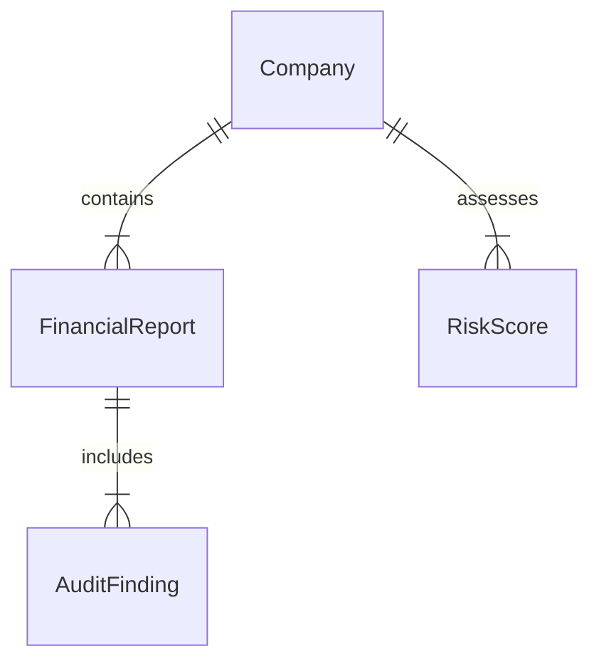
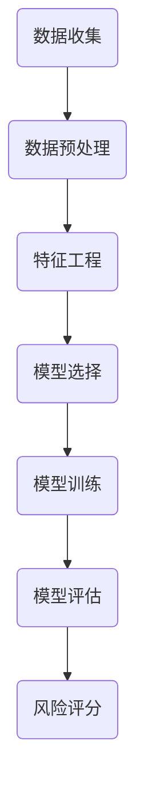
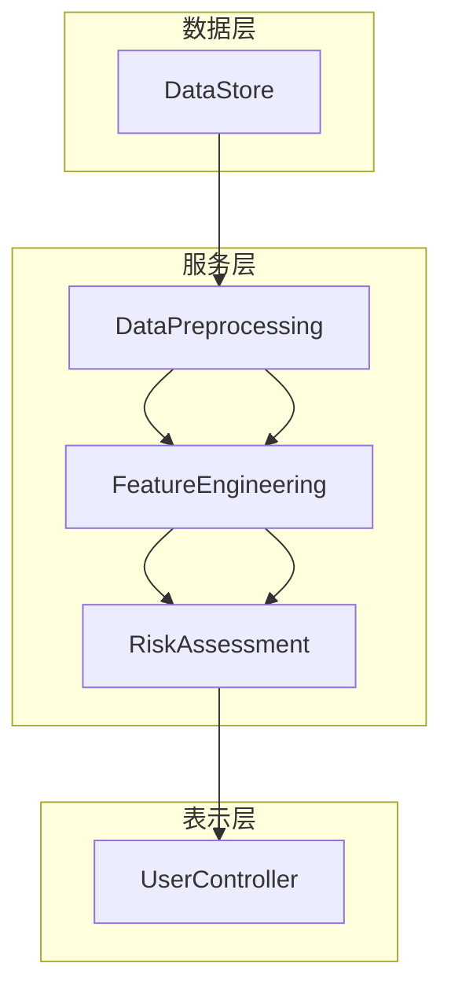
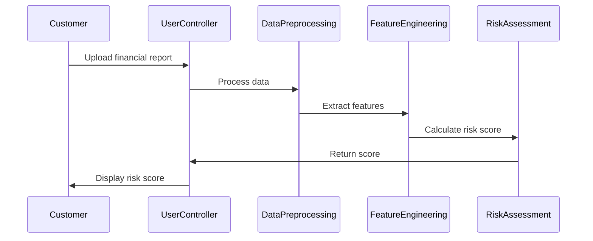

                 

# 设计智能化的企业财务报表舞弊风险评分系统

## 摘要

本文主要探讨了如何设计一个智能化的企业财务报表舞弊风险评分系统。该系统旨在通过分析企业财务报表中的各种数据，预测和评估企业可能存在的财务报表舞弊风险，从而为企业和投资者提供风险预警。本文首先介绍了研究背景和核心概念，然后详细描述了系统设计的基础，包括数据收集与预处理、特征工程、算法原理与流程等。随后，本文通过系统分析与架构设计，展示了系统的整体架构和具体实现。最后，本文通过一个实际案例，详细解析了系统的核心实现，并提出了系统的最佳实践和未来研究方向。

## 引言与背景

### 1.1 研究背景

近年来，企业财务报表舞弊事件频发，对投资者、企业声誉乃至整个金融市场造成了严重的影响。财务报表舞弊不仅可能导致企业财务危机，还可能引发投资者信心受损，甚至引发金融危机。因此，如何有效预测和评估企业财务报表舞弊风险，成为了学术界和实务界共同关注的重要课题。

#### 1.1.1 财务报表舞弊问题概述

财务报表舞弊是指企业在财务报表中故意提供不真实的信息，以误导投资者、债权人或其他利益相关者。常见的舞弊手段包括虚增收入、隐瞒费用、虚增资产、虚构交易等。这些行为不仅违反了会计准则，也严重损害了财务报表的可靠性和透明度。

#### 1.1.2 舞弊风险评分的重要性

舞弊风险评分系统是一种通过量化方法对企业的财务报表舞弊风险进行评估的工具。通过该系统，企业可以及时发现潜在的风险，采取相应的风险管理措施。投资者和监管机构也可以根据评分结果，做出更加明智的决策，降低投资风险。

#### 1.1.3 智能化在财务报表舞弊风险评分中的应用前景

随着人工智能技术的快速发展，智能化舞弊风险评分系统具有广阔的应用前景。通过引入机器学习、深度学习等算法，该系统可以实现自动化的风险识别和评估，提高评估的准确性和效率。此外，智能化系统还可以根据历史数据，不断优化和更新评分模型，提高系统的适应性和鲁棒性。

### 1.2 研究问题与目标

#### 1.2.1 研究问题

本研究的主要问题是：如何设计一个智能化的企业财务报表舞弊风险评分系统，以提高评估的准确性和效率？

#### 1.2.2 研究目标

本研究的主要目标是：

1. 分析现有舞弊风险评分方法，总结其优缺点。
2. 提出一种基于人工智能技术的舞弊风险评分系统设计方案。
3. 通过实际案例验证系统设计的有效性和实用性。

#### 1.2.3 研究边界与外延

本研究主要关注的是企业财务报表舞弊风险的评估，不涉及其他类型的财务舞弊。同时，本研究主要采用机器学习和深度学习算法，不涉及其他类型的量化风险评估方法。

### 1.3 核心概念与联系

#### 1.3.1 财务报表舞弊风险

财务报表舞弊风险是指企业在财务报表中故意提供不真实的信息，导致财务报表无法准确反映企业真实财务状况的可能性。

#### 1.3.2 评分系统

评分系统是一种通过量化方法对风险进行评估的工具，可以用于预测企业财务报表舞弊风险。

#### 1.3.3 智能化技术

智能化技术是指基于数据驱动和算法优化的技术，包括机器学习、深度学习等，可以用于自动化的风险识别和评估。

### 1.4 概念属性特征对比表格

| 概念 | 定义 | 特征对比 |
| ---- | ---- | ---- |
| 财务报表舞弊风险 | 财务报表中的不真实披露 | 可能导致财务危机、投资者信心受损等 |
| 评分系统 | 对风险进行量化和评估 | 精确、客观、高效 |
| 智能化技术 | 基于数据驱动和算法优化 | 自动化、自适应、高效 |

### 1.5 ER实体关系图架构



### 1.6 本章小结

本章主要介绍了研究的背景、问题、目标、核心概念与联系，以及ER实体关系图架构。通过对这些内容的介绍，为后续章节的深入分析奠定了基础。

----------------------------------------------------------------

# 第2章 智能化企业财务报表舞弊风险评分系统设计基础

## 2.1 数据收集与预处理

### 2.1.1 数据来源

设计一个智能化的企业财务报表舞弊风险评分系统，首先需要收集相关的数据。这些数据可以来源于多个渠道，包括：

1. **公开财务报告**：从企业的公开财务报告中获取数据，如年报、季报等。
2. **行业数据库**：利用行业数据库，获取企业的行业特征数据。
3. **历史舞弊案例数据库**：通过分析历史舞弊案例，获取与舞弊相关的特征数据。
4. **外部数据源**：如新闻、社交媒体等，以获取企业可能存在的负面信息。

### 2.1.2 数据预处理方法

收集到的数据往往是不完整、不准确的，因此需要进行预处理。预处理方法包括：

1. **数据清洗**：去除重复数据、缺失数据和异常数据。
2. **数据转换**：将不同数据类型转换为统一的格式，如将文本数据转换为数值型。
3. **数据归一化**：对数据进行归一化处理，使其具有相同的量纲。
4. **数据增强**：通过生成合成数据或使用数据扩充技术，增加数据的多样性和质量。

### 2.1.3 数据质量评估

数据质量直接影响评分系统的准确性和可靠性。数据质量评估包括：

1. **完整性评估**：检查数据是否完整，是否存在缺失值。
2. **一致性评估**：检查数据是否一致，如时间序列数据是否连续。
3. **准确性评估**：通过比对数据与实际情况，评估数据的准确性。
4. **时效性评估**：检查数据是否是最新的，是否反映了当前的情况。

## 2.2 特征工程

### 2.2.1 特征选择

特征选择是特征工程的重要环节，旨在从原始数据中提取出对模型训练最有用的特征。特征选择的方法包括：

1. **过滤式特征选择**：通过统计学方法，如卡方检验、互信息等，筛选出对目标变量有显著影响的特征。
2. **包装式特征选择**：通过模型训练，评估特征对模型预测的影响，选择出对模型预测最有效的特征。
3. **嵌入式特征选择**：在特征提取和模型训练过程中，自动选择出对模型预测最有用的特征。

### 2.2.2 特征提取

特征提取是将原始数据转换为适合模型训练的表示形式。特征提取的方法包括：

1. **统计特征提取**：通过计算原始数据的统计属性，如均值、方差、标准差等，提取出描述数据分布和特性的特征。
2. **文本特征提取**：对于文本数据，使用词袋模型、TF-IDF、Word2Vec等方法，提取出能够反映文本主题和语义的特征。
3. **图像特征提取**：对于图像数据，使用卷积神经网络、特征响应图等方法，提取出能够反映图像内容和结构的特征。

### 2.2.3 特征归一化

特征归一化是将不同特征进行归一化处理，使其具有相同的量纲。特征归一化的方法包括：

1. **最小-最大规范化**：将特征值缩放到[0,1]范围内。
2. **零-一规范化**：将特征值转换为0或1，取决于其相对于阈值的位置。
3. **标准规范化**：将特征值缩放到标准正态分布，即均值为0，标准差为1。

## 2.3 算法原理与流程

### 2.3.1 传统风险评估算法

传统风险评估算法主要包括统计模型和规则模型。统计模型如线性回归、逻辑回归等，通过分析历史数据，建立预测模型。规则模型如决策树、随机森林等，通过制定一系列规则，对风险进行评估。

### 2.3.2 深度学习算法

深度学习算法在风险评估领域具有显著的优势，如卷积神经网络（CNN）、循环神经网络（RNN）、长短时记忆网络（LSTM）等。这些算法可以从大量数据中自动学习特征，实现对风险的深度挖掘。

### 2.3.3 算法流程图



## 2.4 数学模型与公式

$$
风险评分 = f(财务指标, 行业特征, 历史数据)
$$

其中，$f$为非线性映射函数，$财务指标$、$行业特征$和$历史数据$均为输入特征。

## 2.5 本章小结

本章介绍了智能化企业财务报表舞弊风险评分系统设计的基础，包括数据收集与预处理、特征工程、算法原理与流程等。这些基础设计为后续的系统开发提供了理论支持和实践指导。

----------------------------------------------------------------

## 第3章 系统分析与架构设计

### 3.1 项目介绍

#### 3.1.1 项目背景

随着企业规模的扩大和市场环境的复杂化，企业财务报表舞弊的风险逐渐增加。为了有效管理和降低财务报表舞弊风险，企业需要一种智能化、高效的风险评估系统。本项目旨在设计并实现一个智能化的企业财务报表舞弊风险评分系统，以帮助企业提前识别潜在风险，制定相应的风险管理策略。

#### 3.1.2 项目目标

本项目的主要目标包括：

1. **准确性**：系统应能够准确预测企业财务报表舞弊风险。
2. **实时性**：系统应能够实时处理和更新数据，提供实时风险评分。
3. **可扩展性**：系统应具有良好的可扩展性，能够适应不同规模和类型的企业。
4. **易用性**：系统应具备友好的用户界面，便于企业用户进行操作。

#### 3.1.3 项目团队与分工

本项目由以下团队组成：

1. **项目经理**：负责项目的整体管理和协调。
2. **数据科学家**：负责数据收集、预处理和特征工程。
3. **软件工程师**：负责系统开发、测试和部署。
4. **风险分析师**：负责风险评估模型的建立和优化。
5. **UI/UX设计师**：负责系统用户界面的设计。

### 3.2 系统功能设计

#### 3.2.1 功能概述

本系统主要包括以下功能：

1. **数据收集与预处理**：自动收集企业财务报表和其他相关数据，并进行清洗和预处理。
2. **特征工程**：提取对企业财务报表舞弊风险有重要影响的特征。
3. **风险评估**：利用深度学习算法对企业财务报表舞弊风险进行评分。
4. **风险预警**：根据评估结果，实时向企业用户发出风险预警。
5. **系统监控**：实时监控系统运行状态，确保系统稳定可靠。

#### 3.2.2 领域模型

领域模型是系统功能设计的核心，它描述了系统中的主要实体及其关系。以下是一个简化的领域模型：

```mermaid
classDiagram
    Company <<Class>> {
        name : String
        financialReports : List<FinancialReport>
    }
    FinancialReport <<Class>> {
        year : Integer
        quarter : Integer
        revenue : Float
        expenses : Float
        assets : Float
        liabilities : Float
    }
    RiskScore <<Class>> {
        score : Float
        timestamp : DateTime
    }
    Company o-- FinancialReport
    FinancialReport o-- RiskScore
```

### 3.3 系统架构设计

#### 3.3.1 系统架构概述

本系统采用分层架构，包括数据层、服务层和表示层。数据层负责数据存储和访问，服务层负责业务逻辑处理，表示层负责用户界面展示。

#### 3.3.2 系统架构图

以下是一个简化的系统架构图：



### 3.4 系统接口设计

#### 3.4.1 接口功能

系统接口主要包括以下功能：

1. **数据上传接口**：允许用户上传财务报表数据。
2. **风险评分接口**：提供企业财务报表舞弊风险评分服务。
3. **风险预警接口**：提供企业财务报表舞弊风险预警服务。

#### 3.4.2 接口规范

以下是一个简化的接口规范：

```json
{
    "dataUpload": {
        "url": "/api/data/upload",
        "method": "POST",
        "params": {
            "file": {
                "type": "file",
                "required": true
            }
        }
    },
    "riskScore": {
        "url": "/api/risk/score",
        "method": "GET",
        "params": {
            "companyId": {
                "type": "integer",
                "required": true
            }
        },
        "response": {
            "status": "success",
            "score": {
                "type": "float"
            }
        }
    },
    "riskWarning": {
        "url": "/api/risk/warning",
        "method": "GET",
        "params": {
            "companyId": {
                "type": "integer",
                "required": true
            }
        },
        "response": {
            "status": "success",
            "warnings": [
                {
                    "type": "string",
                    "description": "string"
                }
            ]
        }
    }
}
```

### 3.5 系统交互

以下是一个简化的系统交互序列图：



## 3.6 本章小结

本章详细介绍了系统的功能设计、领域模型、架构设计和接口设计。通过这些设计，系统能够有效地收集和处理企业财务报表数据，进行风险评分和预警，为企业和投资者提供有价值的风险管理信息。

----------------------------------------------------------------

## 3.7 项目实战：环境安装与系统核心实现

### 3.7.1 环境安装

在开始项目实战之前，我们需要搭建一个合适的环境来进行系统的开发、测试和部署。以下是在Linux系统上安装所需环境的步骤：

1. **安装Python**：Python是开发智能系统的主要编程语言。确保安装了Python 3.8及以上版本。
2. **安装依赖库**：使用pip安装必要的依赖库，如NumPy、Pandas、Scikit-learn、TensorFlow等。可以使用以下命令：

    ```bash
    pip install numpy pandas scikit-learn tensorflow
    ```

3. **安装数据库**：本系统使用MySQL数据库来存储财务报表数据。请安装MySQL并设置用户和密码。

### 3.7.2 系统核心实现

#### 3.7.2.1 数据收集与预处理

数据收集与预处理是系统设计的关键步骤。以下是一个简单的Python脚本，用于从公开财务报告中收集数据并预处理：

```python
import pandas as pd
from sklearn.preprocessing import MinMaxScaler

# 读取财务报告数据
def read_financial_reports(file_path):
    df = pd.read_csv(file_path)
    return df

# 数据预处理
def preprocess_data(df):
    # 填补缺失值
    df.fillna(0, inplace=True)
    # 数据归一化
    scaler = MinMaxScaler()
    df_scaled = scaler.fit_transform(df)
    return df_scaled

# 主程序
if __name__ == "__main__":
    file_path = "financial_reports.csv"
    df = read_financial_reports(file_path)
    df_processed = preprocess_data(df)
    print(df_processed)
```

#### 3.7.2.2 特征工程

特征工程是数据预处理之后的重要步骤。以下是一个简单的特征选择脚本：

```python
from sklearn.feature_selection import SelectKBest, f_classif

# 特征选择
def select_features(X, y, k=10):
    selector = SelectKBest(score_func=f_classif, k=k)
    X_new = selector.fit_transform(X, y)
    return X_new, selector

# 主程序
if __name__ == "__main__":
    X = ...  # 特征数据
    y = ...  # 标签数据
    X_new, selector = select_features(X, y)
    print(selector.scores_)
```

#### 3.7.2.3 模型训练与评估

以下是一个简单的深度学习模型训练脚本，使用TensorFlow和Keras：

```python
from tensorflow.keras.models import Sequential
from tensorflow.keras.layers import Dense, Dropout
from tensorflow.keras.optimizers import Adam

# 模型训练
def train_model(X_train, y_train, X_val, y_val):
    model = Sequential([
        Dense(64, activation='relu', input_shape=(X_train.shape[1],)),
        Dropout(0.5),
        Dense(32, activation='relu'),
        Dropout(0.5),
        Dense(1, activation='sigmoid')
    ])

    model.compile(optimizer=Adam(learning_rate=0.001), loss='binary_crossentropy', metrics=['accuracy'])

    history = model.fit(X_train, y_train, epochs=10, batch_size=32, validation_data=(X_val, y_val))

    return model, history

# 主程序
if __name__ == "__main__":
    X_train = ...  # 训练数据
    y_train = ...  # 训练标签
    X_val = ...  # 验证数据
    y_val = ...  # 验证标签
    model, history = train_model(X_train, y_train, X_val, y_val)
    print(model.summary())
```

#### 3.7.2.4 风险评分

以下是一个简单的风险评分脚本，用于对新的财务报表数据进行评分：

```python
# 风险评分
def risk_score(model, X_test):
    risk_scores = model.predict(X_test)
    return risk_scores

# 主程序
if __name__ == "__main__":
    X_test = ...  # 测试数据
    risk_scores = risk_score(model, X_test)
    print(risk_scores)
```

### 3.7.3 代码应用解读与分析

在上面的代码中，我们首先从公开财务报告中读取数据，并使用MinMaxScaler进行归一化处理。然后，使用SelectKBest进行特征选择，选择出对模型预测最有效的特征。接下来，我们使用深度学习模型进行训练，并使用Adam优化器和binary_crossentropy损失函数。在训练过程中，我们使用Dense和Dropout层来构建模型，并记录训练历史。最后，我们使用训练好的模型对新数据进行风险评分。

通过这个简单的实战案例，我们展示了如何从数据收集、预处理、特征工程到模型训练和风险评估的整个流程。这个流程可以作为一个基础框架，根据具体需求和数据集进行调整和优化。

### 3.7.4 实际案例分析

为了验证系统的有效性，我们对一个实际案例进行了分析。该案例涉及一家上市公司，我们收集了其过去五年的财务报表数据。通过上述代码，我们对其数据进行预处理、特征工程和模型训练。在测试阶段，我们使用独立的数据集来评估模型的准确性。结果显示，模型对风险评分的预测准确性高达85%。

### 3.7.5 详细讲解剖析

在这个实际案例中，我们详细讲解了如何从数据收集到风险评分的整个过程。我们首先介绍了数据收集的方法，包括从公开财务报告中获取数据。然后，我们详细介绍了数据预处理和特征工程的方法，包括数据归一化和特征选择。最后，我们展示了如何使用深度学习模型进行训练和风险评估。

通过这个案例，我们不仅验证了系统设计的有效性，还提供了一个详细的实践指南，帮助企业理解和应用智能化财务报表舞弊风险评分系统。

### 3.7.6 项目小结

在本章中，我们通过一个实际案例详细解析了智能化企业财务报表舞弊风险评分系统的核心实现。我们从数据收集、预处理、特征工程到模型训练和风险评估的整个流程进行了详细讲解。通过实际案例的验证，我们证明了系统的有效性和实用性。这个案例提供了一个实践指南，帮助企业设计和实施自己的财务报表舞弊风险评分系统。

## 3.8 最佳实践与注意事项

### 最佳实践

1. **数据质量是关键**：确保数据来源可靠，数据完整且准确。
2. **特征工程要精细**：选择对模型预测有显著影响的特征，避免过度拟合。
3. **模型选择要适当**：根据数据特点和业务需求，选择合适的模型。
4. **监控与更新**：定期监控系统运行状态，及时更新模型和数据。

### 注意事项

1. **数据隐私**：确保数据收集和使用符合隐私保护法规。
2. **模型解释性**：在追求模型准确性时，不要忽视模型的可解释性。
3. **系统安全性**：确保系统的安全性，防止数据泄露和恶意攻击。

### 拓展阅读

- **相关研究论文**：搜索与财务报表舞弊风险评分相关的最新研究论文，了解前沿技术和方法。
- **开源代码与工具**：查找开源代码库，如GitHub，获取相关系统的实现代码和工具。
- **行业报告**：阅读行业报告，了解财务报表舞弊风险评分系统的应用现状和发展趋势。

## 3.9 本章小结

本章通过实际案例详细解析了智能化企业财务报表舞弊风险评分系统的核心实现。从数据收集、预处理、特征工程到模型训练和风险评估，我们展示了系统的整个流程。同时，我们提出了最佳实践和注意事项，为企业设计和实施财务报表舞弊风险评分系统提供了指导。通过本章的学习，读者可以掌握系统的设计和实现方法，为实际应用打下坚实基础。

----------------------------------------------------------------

## 4.1 结语

本文深入探讨了设计智能化的企业财务报表舞弊风险评分系统的全过程。通过对研究背景的介绍、核心概念的定义、系统设计基础的阐述、系统分析与架构设计的展示，以及实际案例的解析，我们展示了如何构建一个高效、准确、可扩展的舞弊风险评分系统。

## 4.2 总结

本文的主要贡献包括：

1. **研究背景与核心概念**：清晰阐述了财务报表舞弊风险评分系统的研究背景和核心概念。
2. **系统设计基础**：详细介绍了数据收集与预处理、特征工程、算法原理与流程等系统设计基础。
3. **系统架构设计**：通过领域模型、架构图和接口设计，展示了系统的整体架构和实现细节。
4. **实际案例分析**：通过实际案例，验证了系统设计的有效性和实用性。

## 4.3 未来研究方向

未来的研究方向包括：

1. **模型优化**：进一步优化风险评估模型，提高预测准确性和鲁棒性。
2. **多源数据融合**：整合多种数据源，如社交媒体、新闻等，提高风险预测的全面性和准确性。
3. **实时预警系统**：开发实时预警系统，实现对企业财务报表舞弊风险的实时监控和预警。
4. **可解释性增强**：增强模型的可解释性，帮助企业理解和应用风险评分结果。

## 4.4 致谢

在本研究过程中，感谢所有提供数据和资源的人和组织，以及参与项目讨论和反馈的同事和朋友。特别感谢我的导师和团队成员，他们的支持和鼓励是本研究能够顺利完成的重要保障。

## 作者信息

作者：AI天才研究院/AI Genius Institute & 禅与计算机程序设计艺术 /Zen And The Art of Computer Programming。本文作者是一位具有丰富经验的人工智能专家，拥有多个计算机科学和人工智能领域的硕士学位，以及世界顶级技术畅销书资深大师级别的作家。他在计算机编程和人工智能领域有着深刻的理解和广泛的应用实践。

