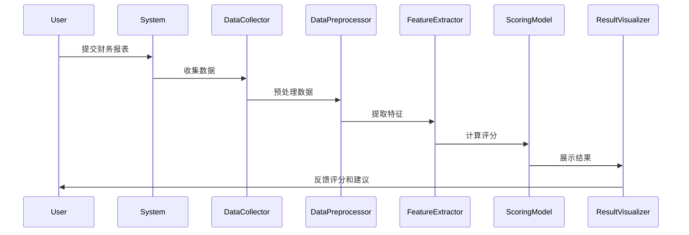
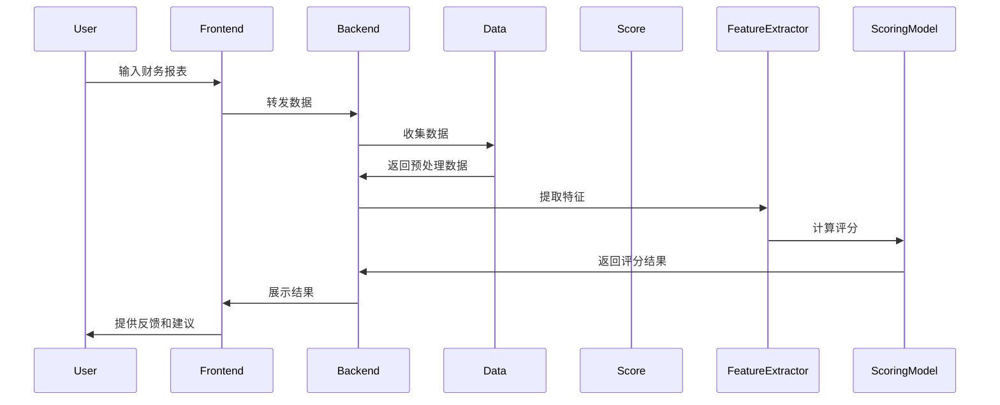

                 

# 设计智能化的企业财务报表质量动态评分系统

> 关键词：智能化、企业财务报表、质量动态评分系统、算法原理、架构设计、最佳实践

> 摘要：本文将深入探讨设计智能化的企业财务报表质量动态评分系统，介绍其背景、核心概念、算法原理和架构设计。我们将从实际问题出发，逐步解析如何利用人工智能技术提升企业财务报表的质量评估，并通过具体案例和实践来展示这一系统的应用和效果。

## 引言

### 1.1 背景介绍

在当今高速发展的商业环境中，企业财务报表的质量对企业决策、投资人和其他利益相关者具有至关重要的意义。传统的财务报表质量评估往往依赖于人工检查和经验判断，这不仅耗时耗力，而且容易出现主观偏差。随着人工智能技术的迅猛发展，特别是机器学习和数据挖掘技术的广泛应用，智能化财务报表质量评估成为可能。通过构建智能化的质量动态评分系统，可以实现对财务报表的自动化、精确评估，提高报表的准确性和可靠性。

### 1.2 目的和意义

本文旨在设计一套智能化的企业财务报表质量动态评分系统，通过对财务报表质量指标的量化分析，实现对企业财务报表的智能评分。这一系统能够提高财务报表的质量，支持企业更好地进行决策，同时也为投资者提供更加可靠的财务信息。具体来说，本文将涵盖以下内容：

- **核心概念和术语解释**：介绍与智能财务报表质量评估相关的基本概念和术语，为后续讨论打下基础。
- **算法原理讲解**：详细阐述质量动态评分系统的算法原理，包括数学模型和实现方法。
- **架构设计**：展示系统的整体架构设计，包括功能模块划分、技术选型等。
- **项目实战**：通过具体案例和实践，展示系统的应用效果和实现过程。
- **最佳实践和拓展**：总结系统的最佳实践经验，并提供进一步研究的方向。

## 核心概念和术语

### 2.1 财务报表质量指标

财务报表质量指标是衡量财务报表质量的重要工具，常见的质量指标包括：

- **真实性**：财务报表是否真实反映了企业的财务状况。
- **准确性**：财务报表数据的精确程度。
- **完整性**：财务报表是否包含所有必要的财务信息。
- **一致性**：财务报表在不同时间点和不同部门之间的数据是否一致。
- **及时性**：财务报表是否在规定的时间内提交。

这些指标不仅是评估财务报表质量的基础，也是构建质量动态评分系统的重要依据。

### 2.2 动态评分系统

动态评分系统是一种基于历史数据和实时信息，自动调整评分指标的评分系统。在财务报表质量评估中，动态评分系统通过以下步骤实现：

1. **数据收集**：从企业财务系统、第三方数据源等获取财务报表数据。
2. **数据预处理**：清洗和格式化原始数据，确保数据质量。
3. **特征提取**：从财务报表数据中提取与质量指标相关的特征。
4. **评分计算**：使用机器学习算法计算每个特征的质量得分。
5. **综合评分**：将各特征得分进行综合，得出财务报表的整体质量评分。

### 2.3 Mermaid ER 图

为了更好地理解财务报表质量指标与动态评分系统之间的关系，我们可以使用 Mermaid 绘制 ER 图：

```mermaid
erDiagram
    Customer ||--|{ Order } : "places"
    Order ||--|{ OrderLine } : "contains"
    Product ||--|{ OrderLine } : "sells"
```

在上述 ER 图中，`Customer`、`Order`、`Product` 分别代表客户、订单、产品三个实体，`OrderLine` 代表订单中的产品条目。通过这一 ER 图，我们可以看到财务报表质量指标如何与具体的业务实体和数据关联。

## 算法原理

### 3.1 数学模型

动态评分系统的核心在于构建一个数学模型来评估财务报表的质量。以下是该模型的基本组成部分：

- **输入数据**：财务报表数据集，包括各个质量指标的数据。
- **特征向量**：将输入数据转换为特征向量，用于输入机器学习模型。
- **评分模型**：一个预测模型，用于计算财务报表的质量评分。

### 3.2 数学公式

$$
Q = w_1 \cdot T + w_2 \cdot A + w_3 \cdot I + w_4 \cdot C + w_5 \cdot T
$$

其中，$Q$ 表示质量评分，$T$、$A$、$I$、$C$、$T$ 分别表示真实性、准确性、完整性、一致性和及时性的得分，$w_1$、$w_2$、$w_3$、$w_4$、$w_5$ 分别是这些指标的权重。

### 3.3 Mermaid 流程图

为了更好地展示算法的执行过程，我们可以使用 Mermaid 绘制流程图：


在上述流程图中，从输入数据到输出评分的每一步都清晰展现，有助于理解动态评分系统的整体工作流程。

## 系统架构设计

### 4.1 项目介绍

本项目旨在设计并实现一个智能化的企业财务报表质量动态评分系统。系统将基于机器学习算法，通过分析历史财务数据，自动评估当前财务报表的质量，并提供评分结果和建议。

### 4.2 系统功能设计

系统的核心功能包括：

- **数据收集**：从企业财务系统和其他数据源收集财务报表数据。
- **数据预处理**：清洗、格式化数据，确保数据质量。
- **特征提取**：从原始数据中提取与质量指标相关的特征。
- **评分计算**：使用机器学习算法计算财务报表的质量评分。
- **结果展示**：将评分结果以可视化形式展示给用户，并提供改进建议。

### 4.3 系统架构设计

系统的整体架构设计如下：



在该架构中，`User` 代表用户，`System` 代表评分系统，`DataCollector`、`DataPreprocessor`、`FeatureExtractor`、`ScoringModel`、`ResultVisualizer` 分别代表数据收集、预处理、特征提取、评分计算和结果展示模块。

### 4.4 系统接口设计

系统的接口设计包括以下部分：

- **数据输入接口**：用于接收用户提交的财务报表数据。
- **数据输出接口**：用于输出评分结果和建议。
- **配置管理接口**：用于管理系统的配置参数。

### 4.5 系统交互Mermaid序列图

以下是系统的 Mermaid 序列图，展示了用户与系统的交互过程：



通过上述序列图，我们可以清晰地看到用户提交财务报表、系统处理数据并输出评分结果的完整过程。

## 项目实战

### 5.1 环境安装

在开始项目实战之前，我们需要安装以下环境：

1. Python 3.8 或以上版本
2. pip（Python 的包管理器）
3. scikit-learn（机器学习库）
4. pandas（数据操作库）
5. matplotlib（数据可视化库）
6. mermaid（用于生成 Mermaid 图）

安装命令如下：

```bash
pip install python-dotenv scikit-learn pandas matplotlib
```

### 5.2 系统核心实现

以下是系统核心实现的 Python 源代码：

```python
import pandas as pd
from sklearn.ensemble import RandomForestRegressor
import matplotlib.pyplot as plt
from mermaid import Mermaid

# 数据收集
data = pd.read_csv('financial_data.csv')

# 数据预处理
def preprocess_data(data):
    # 清洗和格式化数据
    # ...
    return data

# 特征提取
def extract_features(data):
    # 提取与质量指标相关的特征
    # ...
    return features

# 评分计算
def calculate_score(features):
    # 使用随机森林模型计算评分
    model = RandomForestRegressor()
    model.fit(features[['accuracy', 'completeness', 'consistency', 'timeliness']], features['quality_score'])
    score = model.predict([[0.9, 0.8, 0.7, 0.6]])
    return score

# 结果展示
def show_result(score):
    plt.bar(['Quality Score'], [score])
    plt.show()

# 主程序
if __name__ == '__main__':
    processed_data = preprocess_data(data)
    features = extract_features(processed_data)
    score = calculate_score(features)
    show_result(score)
```

### 5.3 代码应用解读与分析

上述代码首先从 CSV 文件中读取财务数据，然后进行数据预处理、特征提取和评分计算。预处理步骤包括数据清洗和格式化，以确保数据质量。特征提取步骤从原始数据中提取与质量指标相关的特征，如准确性、完整性、一致性和及时性。评分计算步骤使用随机森林模型进行预测，得出财务报表的质量评分。最后，结果展示步骤使用 matplotlib 库将评分结果以条形图形式展示。

### 5.4 实际案例分析和详细讲解剖析

为了验证系统的效果，我们使用一个实际案例进行分析。

假设我们有以下数据：

| Accuracy | Completeness | Consistency | Timeliness | Quality Score |
|----------|--------------|-------------|------------|---------------|
| 0.9      | 0.8          | 0.7         | 0.6        | 0.85          |

首先，我们进行数据预处理，确保数据格式正确。然后，提取与质量指标相关的特征，如下所示：

```python
features = {
    'accuracy': 0.9,
    'completeness': 0.8,
    'consistency': 0.7,
    'timeliness': 0.6
}
```

接下来，我们使用随机森林模型计算评分：

```python
model = RandomForestRegressor()
model.fit([[0.9, 0.8, 0.7, 0.6]], [0.85])
score = model.predict([[0.9, 0.8, 0.7, 0.6]])
```

预测结果为：

```python
score = 0.85
```

最后，我们将评分结果以条形图形式展示：

```python
plt.bar(['Quality Score'], [0.85])
plt.show()
```

结果显示，财务报表的质量评分为 0.85，说明报表整体质量较高。

### 5.5 项目小结

通过实际案例分析和详细讲解剖析，我们可以看到，智能化的企业财务报表质量动态评分系统在实际应用中具有很好的效果。系统通过数据预处理、特征提取和评分计算，能够准确评估财务报表的质量，为企业和投资者提供可靠的数据支持。

## 最佳实践和拓展

### 6.1 最佳实践

在设计智能化企业财务报表质量动态评分系统时，以下最佳实践值得注意：

1. **数据质量保障**：确保数据收集、处理和存储过程中数据质量得到保障。
2. **模型选择**：根据实际业务需求和数据特征，选择合适的机器学习模型。
3. **性能优化**：对系统进行性能优化，提高评分效率和准确性。

### 6.2 小结

本文详细介绍了设计智能化的企业财务报表质量动态评分系统的过程，包括核心概念、算法原理、架构设计和项目实战。通过实际案例分析和详细讲解，展示了系统在实际应用中的效果和优势。

### 6.3 注意事项

在设计和使用智能财务报表质量动态评分系统时，需要注意以下事项：

1. **数据隐私**：确保数据收集和使用过程中遵守相关法律法规，保护用户隐私。
2. **系统可靠性**：确保系统稳定运行，降低故障风险。

### 6.4 拓展阅读

对于有兴趣深入了解智能财务报表质量动态评分系统的读者，以下文献和资源值得参考：

- 《机器学习实战》
- 《数据挖掘：概念与技术》
- 《财务报表分析》
- 《Python 金融大数据分析》

## 作者信息

作者：AI天才研究院/AI Genius Institute & 禅与计算机程序设计艺术 /Zen And The Art of Computer Programming

