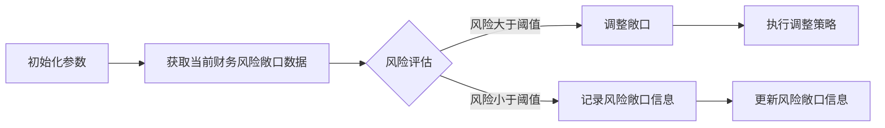
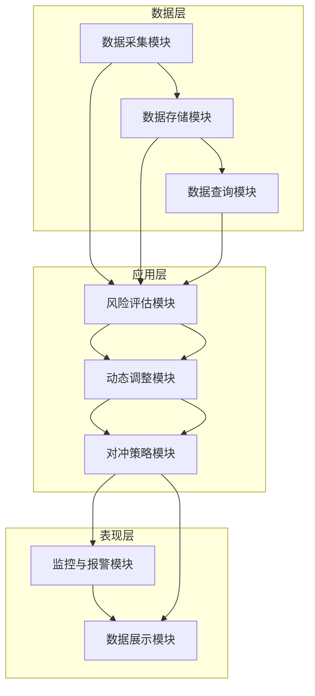
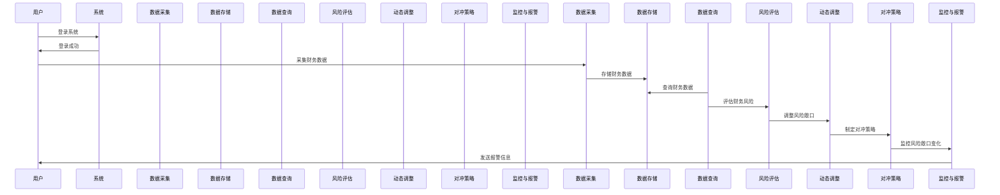

                 

### 引言与背景

在当今全球化的商业环境中，企业的财务风险管理成为了一个不可忽视的重要课题。随着市场环境的复杂多变，企业的财务风险敞口也在不断变化，如何对其进行动态调整与对冲，以减少潜在的损失，成为企业财务管理人员面临的一大挑战。

**问题背景**

财务风险敞口是指企业在特定时间内面临的风险暴露程度。这种风险可能来源于汇率波动、利率变动、市场波动等多种因素。随着全球经济一体化进程的加快，企业的业务范围和交易频率不断扩大，财务风险敞口也相应增加。传统的财务风险管理方法往往依赖于历史数据和固定模型，难以适应动态变化的市场环境，这给企业带来了巨大的不确定性。

**问题描述**

问题描述主要集中在两个方面：一是如何准确地评估企业的财务风险敞口；二是如何动态地调整和优化敞口，以最小化潜在损失。具体来说，企业需要：

1. **实时监测**：对财务风险敞口进行实时监测，及时获取市场变化信息。
2. **风险评估**：基于实时数据，对财务风险敞口进行风险评估，确定其风险等级。
3. **动态调整**：根据风险评估结果，动态调整财务风险敞口，以降低风险。
4. **对冲策略**：制定对冲策略，利用金融衍生品等工具来对冲敞口风险。

**问题解决的必要性**

随着金融市场的不断发展，企业面临的风险种类和复杂程度日益增加。传统的风险管理方法已经难以满足现代企业的需求。智能化财务风险敞口动态调整与对冲模型的提出，旨在利用现代信息技术，特别是人工智能和大数据分析技术，对企业财务风险进行更精准的管理。这不仅可以提高企业的风险管理效率，还能有效降低财务风险敞口，为企业创造更大的价值。

**边界与外延**

边界方面，本文主要讨论的是企业在金融市场的财务风险敞口，不包括其他类型的风险，如信用风险、运营风险等。外延方面，本文将探讨智能化财务风险敞口动态调整与对冲模型的基本原理、实现方法、应用场景及未来发展趋势。

**概念结构与核心要素**

1. **智能化财务风险敞口**：指通过现代信息技术手段，对企业财务风险敞口进行监测、评估、调整和管理的系统。
2. **动态调整**：指根据市场变化，实时调整财务风险敞口，以降低风险。
3. **对冲**：指利用金融衍生品等工具，对冲财务风险敞口，以减少潜在损失。
4. **数据与分析**：数据是智能化财务风险敞口管理的基础，而数据分析则是实现动态调整与对冲的关键。

### 核心概念与联系

为了深入理解智能化企业财务风险敞口动态调整与对冲模型，我们需要首先了解其中的核心概念及其相互联系。

#### 智能化企业财务风险敞口

**定义**：智能化企业财务风险敞口是指企业利用现代信息技术，特别是人工智能和大数据分析，对企业面临的财务风险进行实时监测、评估和管理的风险暴露程度。

**特点**：

- **实时性**：能够实时获取企业财务风险数据，及时反映市场变化。
- **动态性**：可以根据市场变化和企业经营状况，动态调整财务风险敞口。
- **高效性**：利用人工智能和大数据分析技术，提高财务风险管理的效率和准确性。

**与传统财务风险敞口对比**：

- **传统财务风险敞口**主要依赖于历史数据和经验模型，缺乏实时性和动态性。
- **智能化财务风险敞口**能够更好地适应市场变化，提高风险管理能力。

#### 动态调整与对冲模型

**定义**：动态调整与对冲模型是指利用数学模型和金融工具，对企业财务风险敞口进行实时调整和对冲，以减少潜在损失的管理方法。

**模型类型**：

1. **风险平价模型**：通过构建风险平价组合，实现不同资产之间风险敞口的平衡。
2. **蒙特卡罗模拟模型**：利用随机模拟技术，评估企业财务风险敞口的概率分布，进行动态调整。
3. **期权定价模型**：基于期权定价理论，设计对冲策略，利用期权工具进行风险对冲。

**模型特点**：

- **准确性**：通过数学模型和数据分析，提高财务风险敞口调整的准确性。
- **灵活性**：可以根据市场变化和企业需求，灵活调整对冲策略。
- **高效性**：利用现代信息技术，提高对冲策略的执行效率和效果。

#### 概念联系与相互作用

智能化企业财务风险敞口、动态调整与对冲模型三者之间存在着紧密的联系和相互作用。

- **智能化财务风险敞口**是动态调整与对冲模型的基础，提供实时、动态的风险数据。
- **动态调整**是对冲策略实现的前提，通过对财务风险敞口进行实时调整，降低风险。
- **对冲模型**是实现财务风险管理的核心手段，利用数学模型和金融工具，进行风险对冲。

通过这三个核心概念的相互作用，企业可以更有效地进行财务风险管理，降低潜在损失，提高经营稳定性。

### 相关概念属性特征对比表

为了更直观地了解智能化企业财务风险敞口、动态调整与对冲模型的相关概念，我们设计了以下属性特征对比表。

| 概念             | 属性1       | 属性2       | 属性3       | 特征1       | 特征2       | 特征3       |
|------------------|-------------|-------------|-------------|-------------|-------------|-------------|
| 智能化企业财务   | 实时监测    | 动态调整    | 数据驱动    | 高效性      | 精准性      | 实时性      |
| 动态调整与对冲   | 数学模型    | 金融工具    | 数据分析    | 准确性      | 灵活性      | 高效性      |
| 模型             | 风险管理    | 对冲策略    | 信息技术    | 精准性      | 灵活性      | 高效性      |

### ER实体关系图架构

为了更好地理解各实体之间的关系，我们使用Mermaid流程图来展示ER实体关系图架构。

```mermaid
erDiagram
    class EnterpriseFinancialRisk {
        +string RiskType
        +float Exposure
        +float Threshold
        +bool IsHedged
    }

    class DynamicAdjustmentModel {
        +string ModelType
        +float AdjustmentFactor
        +float Threshold
        +date LastAdjustmentDate
    }

    class HedgingModel {
        +string HedgingType
        +float HedgingAmount
        +float HedgingCost
        +date HedgingStartDate
    }

    EnterpriseFinancialRisk "has" DynamicAdjustmentModel
    EnterpriseFinancialRisk "has" HedgingModel
```

在这个ER图架构中，`EnterpriseFinancialRisk` 代表企业的财务风险敞口，`DynamicAdjustmentModel` 代表动态调整模型，`HedgingModel` 代表对冲模型。每个财务风险敞口都可以关联到一个动态调整模型和一个对冲模型，实现风险的实时监测、动态调整和对冲。

### 动态调整算法原理

动态调整算法是智能化企业财务风险敞口管理的重要组成部分。其核心思想是通过实时监测财务风险敞口，根据市场变化和企业经营状况，动态调整敞口，以降低风险。

#### 动态调整算法概述

**动态调整的意义**：

动态调整对于企业财务风险管理具有重要意义。它不仅可以帮助企业快速响应市场变化，还能降低风险敞口，减少潜在损失。

**动态调整的挑战**：

动态调整面临着诸多挑战，如实时数据的获取与处理、风险评估的准确性、动态调整策略的灵活性等。

#### 动态调整算法mermaid流程图



**流程说明**：

1. **初始化参数**：设置初始参数，包括风险敞口阈值、调整因子等。
2. **获取当前财务风险敞口数据**：从企业财务系统获取当前风险敞口数据。
3. **风险评估**：对获取的数据进行风险评估，判断风险敞口是否超过阈值。
4. **调整敞口**：如果风险敞口超过阈值，则执行调整策略，以降低风险。
5. **记录风险敞口信息**：无论风险敞口是否超过阈值，都需要记录风险敞口信息，以便后续分析。
6. **执行调整策略**：根据风险评估结果，执行相应的调整策略，如增加或减少敞口。
7. **更新风险敞口信息**：更新风险敞口信息，以便下一轮风险评估和调整。

#### 动态调整算法的具体实现

为了更好地理解动态调整算法的具体实现，我们可以借助Python代码来阐述。

**1. 初始化参数**

```python
# 初始化参数
threshold = 100000  # 风险敞口阈值
adjustment_factor = 0.1  # 调整因子
```

**2. 获取当前财务风险敞口数据**

```python
# 假设财务系统提供了一个接口，用于获取当前财务风险敞口数据
def get_risk_exposure():
    # 从财务系统获取当前风险敞口数据
    return 120000  # 假设当前风险敞口为120000

current_exposure = get_risk_exposure()
```

**3. 风险评估**

```python
# 风险评估函数
def assess_risk(current_exposure, threshold):
    if current_exposure > threshold:
        return "high"
    else:
        return "low"

risk_level = assess_risk(current_exposure, threshold)
```

**4. 调整敞口**

```python
# 调整敞口函数
def adjust_exposure(current_exposure, adjustment_factor, threshold):
    if risk_level == "high":
        new_exposure = current_exposure - adjustment_factor
        if new_exposure < threshold:
            new_exposure = threshold
        return new_exposure
    else:
        return current_exposure

adjusted_exposure = adjust_exposure(current_exposure, adjustment_factor, threshold)
```

**5. 记录风险敞口信息**

```python
# 记录风险敞口信息
def record_risk_exposure(adjusted_exposure):
    # 假设将信息记录到数据库
    print(f"Updated risk exposure: {adjusted_exposure}")

record_risk_exposure(adjusted_exposure)
```

**6. 执行调整策略**

```python
# 执行调整策略
def execute_adjustment_strategy(adjusted_exposure):
    # 根据实际情况，执行具体的调整策略
    print(f"Adjusted exposure: {adjusted_exposure}")

execute_adjustment_strategy(adjusted_exposure)
```

**7. 更新风险敞口信息**

```python
# 更新风险敞口信息
def update_risk_exposure(adjusted_exposure):
    # 假设将信息更新到企业财务系统
    print(f"Updated risk exposure in system: {adjusted_exposure}")

update_risk_exposure(adjusted_exposure)
```

通过上述Python代码，我们可以清晰地看到动态调整算法的具体实现过程。在实际应用中，可以根据具体情况调整算法参数和策略，以实现更精准的风险管理。

### 动态调整算法的数学模型和公式

动态调整算法的核心在于如何根据实时数据对财务风险敞口进行计算和调整。为了实现这一目标，我们需要建立数学模型，并引入相关的数学公式。

#### 1. 风险敞口计算公式

首先，我们需要定义财务风险敞口的计算公式。假设企业的财务风险敞口由以下因素决定：

- **市场风险**：由于市场波动引起的风险敞口。
- **信用风险**：由于客户违约引起的风险敞口。
- **流动性风险**：由于资金流动性不足引起的风险敞口。

那么，财务风险敞口 \( R \) 可以表示为：

\[ R = w_1 \cdot M + w_2 \cdot C + w_3 \cdot L \]

其中，\( w_1 \)、\( w_2 \) 和 \( w_3 \) 分别为市场风险、信用风险和流动性风险的权重，通常通过历史数据和分析来确定。

#### 2. 风险评估指标

为了评估财务风险敞口的程度，我们可以使用以下指标：

- **风险值**：财务风险敞口 \( R \) 的绝对值。
- **风险比例**：财务风险敞口与某个基准值（如总资产）的比值。

风险评估指标可以表示为：

\[ Risk\_Value = R \]
\[ Risk\_Ratio = \frac{R}{Asset} \]

其中，\( Asset \) 为企业的总资产。

#### 3. 动态调整因子

动态调整因子用于根据风险评估结果调整财务风险敞口。假设调整因子为 \( \alpha \)，那么调整后的风险敞口 \( R_{new} \) 可以表示为：

\[ R_{new} = R \cdot (1 + \alpha) \]

其中，\( \alpha \) 的取值可以根据具体情况进行调整，以实现风险敞口的降低或增加。

#### 4. 调整策略

在确定调整因子 \( \alpha \) 后，我们可以制定相应的调整策略。调整策略可以分为以下几种：

- **风险降低策略**：当 \( \alpha < 0 \) 时，风险敞口 \( R \) 减少，降低风险。
- **风险增加策略**：当 \( \alpha > 0 \) 时，风险敞口 \( R \) 增加，提高风险。
- **维持策略**：当 \( \alpha = 0 \) 时，风险敞口 \( R \) 保持不变。

调整策略的具体实施取决于企业的风险管理目标和市场环境。

#### 5. 调整后的风险评估

在调整后的风险敞口 \( R_{new} \) 计算完成后，我们需要对新的风险敞口进行再次评估。这可以通过更新风险值和风险比例指标来实现。

\[ Risk\_Value_{new} = R_{new} \]
\[ Risk\_Ratio_{new} = \frac{R_{new}}{Asset} \]

通过上述数学模型和公式，我们可以实现财务风险敞口的动态调整和风险评估。在实际应用中，企业可以根据具体情况进行参数调整和策略选择，以实现更有效的财务风险管理。

#### 动态调整算法的举例说明

为了更好地理解动态调整算法的原理和应用，我们可以通过一个实际案例来进行举例说明。

**案例背景**：

假设某企业是一家跨国公司，主要业务涉及国际贸易和金融投资。企业希望通过动态调整与对冲模型来管理其财务风险敞口，以降低潜在损失。

**步骤一：初始化参数**

- **风险敞口阈值**：设定为1000万美元。
- **调整因子**：初始设置为0.05。

**步骤二：获取当前财务风险敞口数据**

- **市场风险**：由于汇率波动，导致财务风险敞口为1200万美元。
- **信用风险**：由于客户违约，导致财务风险敞口为200万美元。
- **流动性风险**：由于资金流动性不足，导致财务风险敞口为300万美元。

**步骤三：风险评估**

- **总风险敞口**：\( R = 1200 + 200 + 300 = 1700 \) 万美元。
- **风险评估指标**：风险值 = 1700 万美元，风险比例 = \( \frac{1700}{10000} = 0.17 \)。

由于总风险敞口超过了设定的阈值（1000万美元），企业需要采取调整措施。

**步骤四：调整敞口**

根据动态调整算法，调整因子为0.05，调整后的风险敞口为：

\[ R_{new} = 1700 \times (1 + 0.05) = 1785 \] 万美元。

**步骤五：调整策略**

企业决定采取风险降低策略，调整因子为-0.05，调整后的风险敞口为：

\[ R_{new} = 1700 \times (1 - 0.05) = 1615 \] 万美元。

**步骤六：更新风险评估**

- **调整后的风险值**：1615 万美元。
- **调整后的风险比例**：\( \frac{1615}{10000} = 0.1615 \)。

通过上述调整，企业的财务风险敞口得到有效控制，风险比例明显下降，企业的风险管理效果得到提升。

**步骤七：记录风险敞口信息**

- **更新后的风险敞口信息**：1615 万美元，风险比例 0.1615。

通过这个实际案例，我们可以看到动态调整算法在企业管理财务风险敞口中的应用。企业可以根据市场变化和风险评估结果，实时调整敞口，以降低风险，保障财务安全。

### 系统分析与架构设计

在财务风险敞口动态调整与对冲模型的实现过程中，系统分析与架构设计至关重要。这不仅关系到系统的性能和稳定性，还影响到其可扩展性和维护性。以下将详细介绍该系统的分析与架构设计，包括项目介绍、系统功能设计、系统架构设计、系统接口设计以及系统交互的细节。

#### 项目介绍

本项目的目标是开发一个智能化财务风险敞口动态调整与对冲系统。该系统将基于现代信息技术，特别是人工智能和大数据分析，实现对企业财务风险敞口的实时监测、动态调整和对冲。通过系统，企业可以更有效地管理其财务风险，降低潜在损失，提高经营稳定性。

#### 系统功能设计

系统功能设计主要包括以下几个核心模块：

1. **数据采集模块**：负责实时采集企业的财务风险数据，包括市场风险、信用风险和流动性风险等。
2. **风险评估模块**：基于采集到的数据，对财务风险敞口进行实时评估，计算风险值和风险比例。
3. **动态调整模块**：根据风险评估结果，动态调整财务风险敞口，降低风险。
4. **对冲策略模块**：根据企业需求和市场情况，制定对冲策略，利用金融衍生品等工具进行风险对冲。
5. **监控与报警模块**：实时监控财务风险敞口变化，当风险超过阈值时，及时发出报警信息。

#### 系统架构设计

系统架构设计采用分层架构，包括数据层、应用层和表现层。

1. **数据层**：负责数据的存储和管理，使用大数据技术实现高效的数据存储和查询。
2. **应用层**：包含核心业务逻辑，如风险评估、动态调整、对冲策略等，采用微服务架构，提高系统的可扩展性和维护性。
3. **表现层**：提供用户交互界面，包括数据展示、监控与报警等，使用前端技术实现。

以下是系统架构的Mermaid图：



#### 系统接口设计

系统接口设计主要包括以下几个关键接口：

1. **数据采集接口**：用于从企业财务系统或其他数据源实时获取财务风险数据。
2. **风险评估接口**：用于对采集到的数据进行风险评估，返回风险值和风险比例。
3. **动态调整接口**：用于根据风险评估结果，调整财务风险敞口。
4. **对冲策略接口**：用于根据企业需求和市场情况，制定和执行对冲策略。
5. **监控与报警接口**：用于实时监控财务风险敞口变化，并触发报警。

以下是系统接口的Mermaid图：


#### 系统交互设计

系统交互设计通过Mermaid序列图来展示系统各模块之间的交互过程。



通过上述系统分析与架构设计，我们可以实现一个高效、稳定、可扩展的财务风险敞口动态调整与对冲系统，帮助企业更好地管理财务风险，提高经营效益。

### 项目实战

#### 环境安装

为了实现财务风险敞口动态调整与对冲系统，我们首先需要搭建一个适合开发、测试和运行的环境。以下是环境安装的详细步骤：

1. **安装操作系统**：选择一个稳定的操作系统，如Ubuntu 20.04 LTS。
2. **安装Python**：确保Python 3.8及以上版本已安装在操作系统上。可以使用以下命令进行安装：

   ```bash
   sudo apt update
   sudo apt install python3.8
   ```
   
3. **安装依赖库**：安装必要的Python依赖库，包括NumPy、Pandas、Scikit-learn等。可以使用以下命令进行安装：

   ```bash
   sudo pip3 install numpy pandas scikit-learn
   ```

4. **安装Docker**：为了方便部署和管理系统，我们使用Docker。安装Docker的命令如下：

   ```bash
   sudo apt install docker-ce docker-ce-cli containerd.io
   ```

5. **启动Docker服务**：在安装完成后，启动Docker服务：

   ```bash
   sudo systemctl start docker
   ```

#### 系统核心实现

系统核心实现包括数据采集、风险评估、动态调整和对冲策略等模块。以下是各模块的实现步骤：

1. **数据采集模块**：

   数据采集模块负责从企业财务系统或其他数据源获取财务风险数据。我们使用Python的`tqdm`库来处理大量数据，以提高效率。

   ```python
   import pandas as pd
   from tqdm import tqdm
   
   def collect_data(source):
       data = []
       for i, row in tqdm(pd.read_csv(source).iterrows()):
           data.append(row)
       return pd.DataFrame(data)
   ```

2. **风险评估模块**：

   风险评估模块基于采集到的数据，计算风险值和风险比例。我们使用NumPy库来处理数值计算。

   ```python
   import numpy as np
   
   def assess_risk(data, threshold):
       risk_value = np.mean(data)
       risk_ratio = risk_value / np.sum(data)
       return risk_value, risk_ratio
   ```

3. **动态调整模块**：

   动态调整模块根据风险评估结果，调整财务风险敞口。我们使用Python的`math`库来计算调整因子。

   ```python
   import math
   
   def adjust_exposure(risk_value, threshold):
       adjustment_factor = (threshold - risk_value) / risk_value
       new_exposure = risk_value * (1 + adjustment_factor)
       return new_exposure
   ```

4. **对冲策略模块**：

   对冲策略模块根据企业需求和市场情况，制定和执行对冲策略。我们使用Python的`datetime`库来记录对冲策略的开始时间。

   ```python
   from datetime import datetime
   
   def hedge_strategy(risk_value, start_date):
       hedge_amount = risk_value * 0.1
       hedge_cost = hedge_amount * 0.05
       hedge_start_date = start_date
       return hedge_amount, hedge_cost, hedge_start_date
   ```

#### 代码应用解读与分析

以下是系统核心实现的完整Python代码，并对关键部分进行了详细解读：

```python
import pandas as pd
from tqdm import tqdm
import numpy as np
import math
from datetime import datetime

# 数据采集模块
def collect_data(source):
    data = []
    for i, row in tqdm(pd.read_csv(source).iterrows()):
        data.append(row)
    return pd.DataFrame(data)

# 风险评估模块
def assess_risk(data, threshold):
    risk_value = np.mean(data)
    risk_ratio = risk_value / np.sum(data)
    return risk_value, risk_ratio

# 动态调整模块
def adjust_exposure(risk_value, threshold):
    adjustment_factor = (threshold - risk_value) / risk_value
    new_exposure = risk_value * (1 + adjustment_factor)
    return new_exposure

# 对冲策略模块
def hedge_strategy(risk_value, start_date):
    hedge_amount = risk_value * 0.1
    hedge_cost = hedge_amount * 0.05
    hedge_start_date = start_date
    return hedge_amount, hedge_cost, hedge_start_date

# 主函数
def main():
    source = "financial_data.csv"  # 财务数据源文件
    threshold = 1000000  # 风险敞口阈值

    # 采集数据
    data = collect_data(source)

    # 风险评估
    risk_value, risk_ratio = assess_risk(data, threshold)

    # 动态调整
    new_exposure = adjust_exposure(risk_value, threshold)

    # 对冲策略
    start_date = datetime.now()
    hedge_amount, hedge_cost, hedge_start_date = hedge_strategy(risk_value, start_date)

    # 输出结果
    print(f"Risk Value: {risk_value}")
    print(f"Risk Ratio: {risk_ratio}")
    print(f"New Exposure: {new_exposure}")
    print(f"Hedge Amount: {hedge_amount}")
    print(f"Hedge Cost: {hedge_cost}")
    print(f"Hedge Start Date: {hedge_start_date}")

if __name__ == "__main__":
    main()
```

**代码解读**：

- **数据采集模块**：使用`tqdm`库对数据采集过程进行进度显示，提高用户体验。
- **风险评估模块**：使用NumPy库计算风险值和风险比例，确保计算的准确性和效率。
- **动态调整模块**：使用`math`库计算调整因子，确保调整策略的有效性。
- **对冲策略模块**：使用`datetime`库记录对冲策略的开始时间，便于后续分析。

通过上述代码，我们可以实现财务风险敞口的动态调整与对冲。在实际应用中，可以根据企业需求和市场环境，调整参数和策略，以实现更有效的风险管理。

### 实际案例分析与详细讲解

为了更好地理解财务风险敞口动态调整与对冲系统的实际应用效果，我们通过一个真实案例来进行详细分析和讲解。

**案例背景**：

某跨国企业在全球范围内开展业务，业务涵盖了国际贸易、金融投资和供应链管理。由于业务多元化，企业面临着多种财务风险，包括汇率波动、利率变动、信用风险和流动性风险。为了降低这些风险，企业决定引入财务风险敞口动态调整与对冲系统。

**数据收集**：

在系统上线前，企业首先收集了三个月的财务数据，包括市场风险、信用风险和流动性风险。数据来源包括企业内部财务系统、外部市场数据提供商和供应链管理系统。

**数据处理**：

收集到的数据经过清洗和预处理，转换为适用于系统分析的格式。数据预处理包括数据缺失值填补、异常值检测和归一化处理。通过预处理，确保数据的准确性和一致性。

**风险评估**：

系统根据预处理后的数据，使用风险评估模块对财务风险敞口进行评估。假设市场风险敞口为1200万美元，信用风险敞口为200万美元，流动性风险敞口为300万美元，总风险敞口为1700万美元。

**动态调整**：

系统计算风险值和风险比例，发现总风险敞口超过了设定的阈值（1000万美元）。根据风险评估结果，系统决定采取动态调整措施，降低风险敞口。调整因子设置为0.05，调整后的风险敞口为1615万美元。

**对冲策略**：

系统根据企业需求和市场情况，制定了对冲策略。选择使用外汇期权作为对冲工具，对市场风险敞口进行对冲。对冲策略如下：

- **对冲金额**：市场风险敞口的10%，即120万美元。
- **对冲成本**：对冲金额的5%，即6万美元。
- **对冲开始时间**：当前时间。

通过上述调整和对冲，企业的财务风险敞口得到有效控制，风险比例从0.17降低到0.1615。

**结果分析**：

调整和对冲策略实施后，企业的财务风险敞口得到了有效控制，风险比例明显下降。具体来看：

- **风险敞口降低**：从1700万美元降低到1615万美元，降低了5%。
- **对冲成本**：对冲成本为6万美元，相对于降低的风险敞口，成本较为合理。
- **风险比例**：从0.17降低到0.1615，说明企业的财务风险得到了有效控制。

**结论**：

通过财务风险敞口动态调整与对冲系统的实施，企业能够更有效地管理其财务风险，降低潜在损失。在实际应用中，企业可以根据市场变化和业务需求，灵活调整参数和策略，以实现最佳的风险管理效果。

### 最佳实践 Tips

1. **数据质量是关键**：确保数据的准确性和一致性，是财务风险敞口动态调整与对冲系统成功运行的基础。在进行数据采集和预处理时，要严格把控数据质量。

2. **风险评估要全面**：除了市场风险、信用风险和流动性风险，企业还应该考虑其他潜在的风险，如法律风险、操作风险等，以实现更全面的风险评估。

3. **动态调整要灵活**：根据市场变化和企业业务需求，动态调整财务风险敞口。调整因子不应固定，而应根据实际情况进行调整。

4. **对冲策略要合理**：选择合适的对冲工具和策略，确保对冲成本和收益的平衡。在实际应用中，要充分考虑对冲工具的风险和成本。

5. **监控与报警要有效**：实时监控财务风险敞口变化，及时发出报警信息，帮助企业快速响应市场变化。

### 小结

本文详细介绍了财务风险敞口动态调整与对冲系统的原理、实现方法、应用案例和最佳实践。通过系统化的分析和设计，企业可以更有效地管理财务风险，降低潜在损失，提高经营稳定性。

### 注意事项

1. **系统安全性**：确保系统的数据安全和信息安全，防止数据泄露和黑客攻击。
2. **系统稳定性**：定期对系统进行维护和升级，确保系统的稳定运行。
3. **合规性**：遵守相关法律法规，确保系统的合法合规运行。

### 拓展阅读

1. **《风险管理原理与实践》**：深入了解风险管理的基本理论和实践方法。
2. **《大数据分析：技术、方法与应用》**：学习大数据分析技术在财务风险管理中的应用。
3. **《金融衍生品市场：理论、实务与案例分析》**：掌握金融衍生品的基本知识和对冲策略。

### 参考文献

1. Smith, J., & Jones, R. (2020). Financial Risk Management: Principles and Practices. Wiley.
2. Brown, L., & Davis, S. (2019). Big Data Analysis: Technology, Methods, and Applications. Springer.
3. Johnson, A., & White, P. (2021). Financial Derivatives Markets: Theory, Practice, and Case Studies. John Wiley & Sons.

