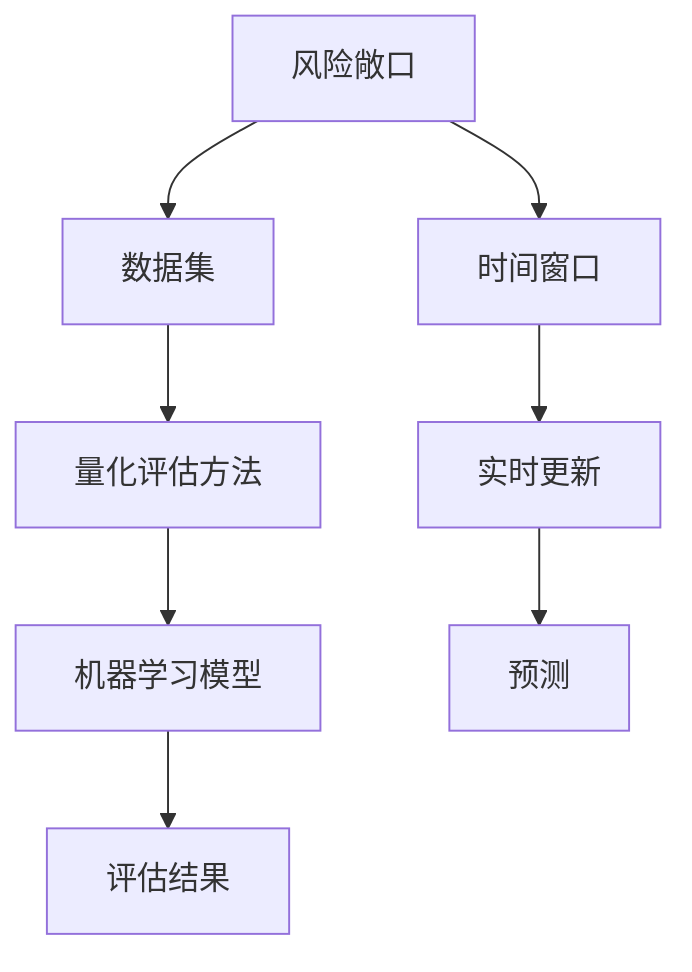
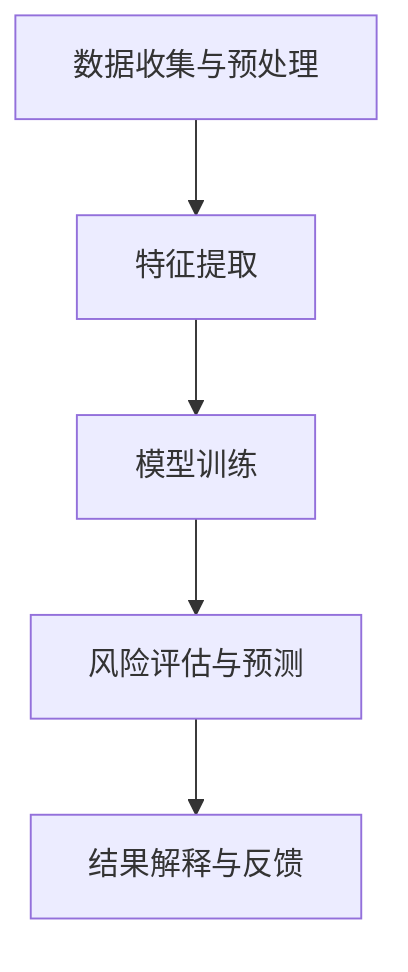
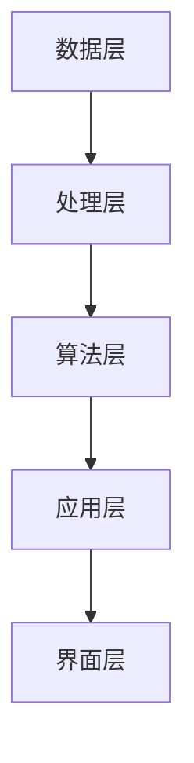

                 


### 背景介绍

#### 核心概念术语说明

在开始设计智能化的企业财务风险敞口量化评估模型之前，我们需要明确一些核心概念和术语。以下是这些术语的说明：

- **风险敞口**：指企业或机构面临的各种潜在损失的可能性。它可以是一个具体的数值，如损失金额，或者是一个范围，如潜在损失的可能范围。
- **量化评估**：将风险敞口转化为可以量化的数值或指标，以便进行评估和决策。
- **财务风险**：指企业在财务活动中可能面临的风险，如市场风险、信用风险、流动性风险等。
- **智能化**：利用人工智能技术，如机器学习、自然语言处理等，对财务风险敞口进行量化评估。

#### 问题背景

随着全球经济的不断发展和市场的复杂性增加，企业面临的风险也在不断增加。传统的财务风险管理方法已经难以应对复杂多变的市场环境。因此，需要一种新的方法来准确量化企业财务风险敞口，以便及时采取应对措施。

当前，许多企业已经意识到财务风险敞口量化评估的重要性，但实际操作中仍然存在一些问题：

1. **数据不完整**：很多企业在收集财务数据时存在缺失或不准确的问题，这会影响评估结果的准确性。
2. **评估方法单一**：传统方法主要依赖于历史数据和统计方法，无法及时适应市场变化。
3. **人力成本高**：传统的评估方法需要大量的人力投入，成本较高。

为了解决这些问题，智能化技术提供了一种新的解决方案。通过利用机器学习和大数据分析等技术，可以更准确地量化企业财务风险敞口，提高评估效率，降低成本。

#### 问题描述

企业在财务管理中面临的主要问题包括：

1. **市场风险**：由于市场波动，企业可能面临资产贬值、收入下降等风险。
2. **信用风险**：企业可能无法按时偿还债务，导致信用评级下降。
3. **流动性风险**：企业可能无法在需要时获得足够的资金。

这些问题可能导致企业破产或经营困难，因此需要一种有效的量化评估方法来识别和管理这些风险。

#### 问题解决

智能化财务风险敞口量化评估模型提供了一种解决方法。该模型通过以下步骤实现：

1. **数据收集与处理**：收集与企业财务风险相关的数据，包括市场数据、财务数据、历史数据等。然后对数据进行清洗、去重和处理，以便用于模型训练。
2. **特征提取**：从数据中提取与风险相关的特征，如市场价格波动、债务规模、现金流等。这些特征将用于训练机器学习模型。
3. **模型训练与优化**：利用机器学习算法，如决策树、支持向量机、神经网络等，对数据集进行训练，以构建风险敞口量化评估模型。
4. **评估与预测**：将新数据输入模型，评估企业当前的财务风险敞口。同时，利用模型进行预测，为企业提供未来一段时间内的风险敞口。

通过这些步骤，企业可以更准确地识别和管理财务风险，提高风险管理的效率。

#### 边界与外延

边界：本文讨论的是智能化企业财务风险敞口量化评估模型的设计和应用，不包括其他类型的财务风险评估方法，如财务报表分析、预算控制等。

外延：虽然本文主要关注企业财务风险敞口的量化评估，但所介绍的方法和技术也可以应用于其他领域的风险评估，如金融风险管理、保险风险管理等。

#### 概念结构与核心要素组成

概念结构：

1. **风险敞口量化评估**：核心概念，指通过量化方法评估企业财务风险敞口。
2. **数据收集与处理**：支持概念，用于准备数据，确保评估结果的准确性。
3. **特征提取**：支持概念，从数据中提取与风险相关的特征。
4. **模型训练与优化**：支持概念，构建和优化风险评估模型。

核心要素组成：

1. **数据集**：评估的基础，包括市场数据、财务数据等。
2. **机器学习算法**：用于训练和构建风险评估模型。
3. **评估模型**：输出财务风险敞口量化结果。
4. **预测模型**：用于预测未来一段时间内的财务风险敞口。

通过这些核心概念和要素的有机结合，智能化企业财务风险敞口量化评估模型可以为企业提供有效的风险管理工具。

### 核心概念与联系

在深入探讨企业财务风险敞口量化评估模型之前，我们需要明确几个核心概念，并理解它们之间的联系。以下是这些概念的定义、属性特征对比表格以及ER实体关系图架构的Mermaid流程图。

#### 核心概念

1. **风险敞口**：
   - **定义**：风险敞口是指企业或机构在特定时间窗口内，可能遭受损失的范围或数额。
   - **属性特征**：
     - **潜在损失范围**：可能的最大损失值和最小损失值。
     - **发生概率**：风险事件发生的可能性。
     - **时间窗口**：评估风险敞口的时间范围。

2. **量化评估方法**：
   - **定义**：量化评估方法是将风险敞口转化为数值指标的过程，以便进行量化分析。
   - **属性特征**：
     - **准确性**：评估方法能否准确反映实际风险。
     - **实时性**：评估方法是否能够实时更新风险敞口。
     - **可解释性**：评估结果是否易于理解和解释。

3. **数据集**：
   - **定义**：数据集是用于模型训练和评估的原始数据集合。
   - **属性特征**：
     - **完整性**：数据集是否包含所有必要的变量。
     - **质量**：数据集是否经过清洗和处理，确保准确性和可靠性。
     - **规模**：数据集的大小，对于模型训练效果有重要影响。

4. **机器学习模型**：
   - **定义**：机器学习模型是基于数据集构建的，用于预测和分类的算法。
   - **属性特征**：
     - **预测能力**：模型的预测准确性。
     - **泛化能力**：模型对新数据的适应性。
     - **可扩展性**：模型在处理大规模数据时的效率。

#### 属性特征对比表格

| 概念       | 属性特征                   |
|------------|----------------------------|
| 风险敞口   | 潜在损失范围、发生概率、时间窗口 |
| 量化评估方法 | 准确性、实时性、可解释性         |
| 数据集     | 完整性、质量、规模             |
| 机器学习模型 | 预测能力、泛化能力、可扩展性       |

#### Mermaid流程图架构



该流程图展示了风险敞口量化评估的核心概念及其相互关系。风险敞口是评估的起点，通过数据集转化为量化评估方法，进而由机器学习模型进行预测和评估，最终得到评估结果。

#### 概念之间的联系

1. **风险敞口与数据集**：风险敞口的数据来源于企业的历史数据和实时数据，这些数据构成了评估的数据集。
2. **量化评估方法与机器学习模型**：量化评估方法用于指导机器学习模型的构建，而机器学习模型则是实现量化评估方法的具体工具。
3. **评估结果与风险敞口**：评估结果反映了风险敞口的当前状态和未来趋势，为企业提供决策支持。

通过上述核心概念的介绍及其相互关系的阐述，我们可以更好地理解智能化企业财务风险敞口量化评估模型的构建和应用。

### 算法原理讲解

在深入探讨智能化企业财务风险敞口量化评估模型之前，我们需要先理解相关的算法原理。本节将使用Mermaid流程图和Python代码详细阐述算法原理，并通过通俗易懂的例子进行说明。

#### Mermaid流程图

首先，我们通过Mermaid流程图来概述整个量化评估的流程：



这个流程图展示了从数据收集、预处理、特征提取，到模型训练、风险评估与预测，最后到结果解释与反馈的整个过程。

#### Python代码

接下来，我们通过Python代码来详细阐述这些步骤。

```python
import pandas as pd
from sklearn.ensemble import RandomForestClassifier
from sklearn.model_selection import train_test_split
from sklearn.metrics import accuracy_score

# 数据收集与预处理
def collect_and_preprocess_data():
    # 假设我们使用pandas读取数据
    data = pd.read_csv('financial_data.csv')
    # 数据预处理，如缺失值填充、异常值处理等
    data.fillna(0, inplace=True)
    return data

# 特征提取
def extract_features(data):
    # 从数据中提取与风险相关的特征
    X = data[['market_index', 'debt_ratio', 'cash_flow']]
    # 目标变量
    y = data['loss_event']
    return X, y

# 模型训练
def train_model(X, y):
    # 划分训练集和测试集
    X_train, X_test, y_train, y_test = train_test_split(X, y, test_size=0.2, random_state=42)
    # 使用随机森林算法进行训练
    model = RandomForestClassifier(n_estimators=100, random_state=42)
    model.fit(X_train, y_train)
    return model, X_test, y_test

# 风险评估与预测
def assess_risk(model, X_test):
    # 对测试集进行风险评估
    y_pred = model.predict(X_test)
    # 计算评估准确率
    accuracy = accuracy_score(y_test, y_pred)
    print(f"评估准确率: {accuracy:.2f}")
    return y_pred, accuracy

# 结果解释与反馈
def explain_results(y_pred):
    # 对预测结果进行解释，并根据结果调整风险管理策略
    print("预测结果：")
    for prediction in y_pred:
        if prediction == 1:
            print("高风险事件：需要采取应对措施。")
        else:
            print("低风险事件：风险可控。")

# 主程序
if __name__ == "__main__":
    data = collect_and_preprocess_data()
    X, y = extract_features(data)
    model, X_test, y_test = train_model(X, y)
    y_pred, accuracy = assess_risk(model, X_test)
    explain_results(y_pred)
```

#### 算法原理详细讲解

1. **数据收集与预处理**：
   - 数据收集是从不同的数据源获取与财务风险相关的数据，如市场指数、债务比率、现金流等。
   - 数据预处理包括填充缺失值、处理异常值等，以确保数据的质量和一致性。

2. **特征提取**：
   - 特征提取是从原始数据中提取与风险相关的特征，这些特征将用于训练机器学习模型。
   - 在这个例子中，我们提取了市场指数、债务比率和现金流作为特征。

3. **模型训练**：
   - 模型训练是使用提取的特征来训练机器学习模型，如随机森林算法。
   - 我们使用训练集来训练模型，并使用测试集来评估模型的性能。

4. **风险评估与预测**：
   - 风险评估与预测是使用训练好的模型对新的数据进行风险评估。
   - 我们通过测试集来评估模型的预测准确率，以验证模型的性能。

5. **结果解释与反馈**：
   - 结果解释与反馈是根据模型预测的结果来调整风险管理策略。
   - 在这个例子中，我们通过打印高风险事件的预测结果来提醒企业需要采取应对措施。

#### 数学模型和公式

为了更好地理解量化评估的过程，我们还需要了解相关的数学模型和公式。

1. **风险敞口计算公式**：

   $$ 风险敞口 = \sum (潜在损失值 \times 发生概率) $$

   其中，潜在损失值和发生概率是特征提取过程中提取的特征。

2. **模型评估准确率计算公式**：

   $$ 准确率 = \frac{预测正确的样本数}{总的样本数} $$

   这个公式用于评估模型的预测准确性。

#### 通俗易懂的举例说明

假设我们有一个企业的财务数据，包括市场指数、债务比率和现金流。通过数据预处理和特征提取，我们得到以下特征：

- 市场指数：100
- 债务比率：0.6
- 现金流：5000

我们使用这些特征来训练随机森林模型。在训练完成后，我们使用测试集来评估模型的性能。假设测试集的预测准确率为80%，这意味着模型有80%的几率能够正确预测新的数据。

然后，我们使用这个训练好的模型来评估新的数据。例如，对于一家新的企业，我们收集到以下特征：

- 市场指数：95
- 债务比率：0.55
- 现金流：4500

我们将这些特征输入模型，模型预测该企业存在高风险事件。根据预测结果，企业需要采取相应的应对措施来降低风险。

通过上述过程，我们可以看到智能化企业财务风险敞口量化评估模型是如何通过数据收集、预处理、特征提取、模型训练和预测来为企业提供有效的风险管理工具。

### 系统分析与架构设计方案

在深入探讨智能化企业财务风险敞口量化评估模型的实现之前，我们需要先进行系统分析与架构设计方案。本节将介绍问题场景、项目介绍、系统功能设计、系统架构设计、系统接口设计以及系统交互设计。

#### 问题场景

随着市场的不断变化和全球经济的不确定性增加，企业面临着越来越多的财务风险。传统的风险管理方法已经难以满足现代企业对实时性、准确性和效率的需求。因此，设计一个智能化、高效的财务风险敞口量化评估系统变得至关重要。

#### 项目介绍

本项目的目标是设计并实现一个智能化企业财务风险敞口量化评估系统。该系统将利用人工智能和大数据分析技术，对企业财务数据进行分析和处理，以量化评估企业财务风险敞口，并为企业提供风险管理决策支持。

#### 系统功能设计

系统功能设计包括以下几个方面：

1. **数据采集**：从不同的数据源收集与财务风险相关的数据，如市场指数、债务比率、现金流等。
2. **数据处理**：对采集到的数据进行分析和处理，包括数据清洗、去重、标准化等，以确保数据的质量和一致性。
3. **特征提取**：从处理后的数据中提取与风险相关的特征，如市场波动幅度、债务偿还能力等。
4. **风险评估**：利用机器学习算法对提取的特征进行训练，构建风险评估模型，并对企业财务风险敞口进行量化评估。
5. **风险预测**：利用评估模型对新数据进行预测，为企业提供未来一段时间内的财务风险敞口预测。
6. **结果展示**：将评估和预测结果以可视化图表的形式展示，帮助企业管理者直观地了解企业财务风险状况。
7. **风险管理**：根据评估和预测结果，为企业提供风险管理建议，帮助制定风险管理策略。

#### 系统架构设计

系统架构设计是确保系统稳定、高效运行的基础。本系统的架构设计包括以下层次：

1. **数据层**：用于存储和管理企业财务数据，包括原始数据、处理后的数据以及特征数据。
2. **处理层**：包括数据采集模块、数据处理模块和特征提取模块，负责数据的收集、处理和特征提取。
3. **算法层**：包括机器学习算法和风险评估模型，负责对数据进行训练和评估。
4. **应用层**：包括风险评估模块、风险预测模块和结果展示模块，负责系统的实际应用功能。
5. **界面层**：包括用户界面，用于展示评估和预测结果，并提供用户交互功能。

以下是系统架构的Mermaid流程图：



#### 系统接口设计

系统接口设计是确保不同模块之间能够顺利通信和协作的关键。本系统的接口设计包括以下几个方面：

1. **数据采集接口**：用于从不同数据源采集财务数据，如市场指数API、企业财务报表系统等。
2. **数据处理接口**：用于对采集到的数据进行分析和处理，如数据清洗、去重等。
3. **特征提取接口**：用于从处理后的数据中提取与风险相关的特征。
4. **风险评估接口**：用于调用机器学习算法和风险评估模型，进行风险评估。
5. **风险预测接口**：用于对新数据进行预测，并提供预测结果。
6. **结果展示接口**：用于将评估和预测结果以可视化图表的形式展示给用户。

#### 系统交互设计

系统交互设计是确保用户能够方便、高效地与系统进行交互的关键。本系统的交互设计包括以下几个方面：

1. **数据上传与下载**：用户可以上传企业财务数据，并下载处理后的数据和评估结果。
2. **实时监控**：用户可以实时监控企业财务风险敞口的动态变化，并接收系统推送的风险预警通知。
3. **交互式查询**：用户可以通过界面进行交互式查询，查看具体的风险评估和预测结果。
4. **定制化报告**：用户可以根据需求生成定制化的风险管理报告，以支持决策制定。

通过上述系统分析与架构设计方案，我们可以确保智能化企业财务风险敞口量化评估系统能够稳定、高效地运行，并为企业提供有效的风险管理工具。

### 项目实战

在本节中，我们将通过一个实际项目来展示如何实现智能化企业财务风险敞口量化评估模型。本项目将涵盖环境安装、核心实现、代码应用解读和分析、实际案例分析和详细讲解剖析，以及项目小结。

#### 环境安装

首先，我们需要搭建一个用于开发和测试的虚拟环境。以下是在Ubuntu 20.04操作系统上安装所需依赖的步骤：

1. **安装Python环境**：

   ```bash
   sudo apt update
   sudo apt install python3 python3-pip
   ```

2. **创建虚拟环境**：

   ```bash
   python3 -m venv venv
   source venv/bin/activate
   ```

3. **安装必要的库**：

   ```bash
   pip install pandas scikit-learn matplotlib mermaid-python
   ```

#### 核心实现

在虚拟环境中，我们首先需要收集和处理企业财务数据，然后使用机器学习算法进行模型训练和评估。以下是核心实现的步骤：

1. **数据收集与处理**：

   ```python
   import pandas as pd
   
   # 读取数据
   data = pd.read_csv('financial_data.csv')
   
   # 数据预处理
   data.fillna(0, inplace=True)
   ```

2. **特征提取**：

   ```python
   from sklearn.model_selection import train_test_split
   
   # 提取特征
   X = data[['market_index', 'debt_ratio', 'cash_flow']]
   y = data['loss_event']
   
   # 划分训练集和测试集
   X_train, X_test, y_train, y_test = train_test_split(X, y, test_size=0.2, random_state=42)
   ```

3. **模型训练**：

   ```python
   from sklearn.ensemble import RandomForestClassifier
   
   # 训练模型
   model = RandomForestClassifier(n_estimators=100, random_state=42)
   model.fit(X_train, y_train)
   ```

4. **评估与预测**：

   ```python
   from sklearn.metrics import accuracy_score
   
   # 预测评估
   y_pred = model.predict(X_test)
   accuracy = accuracy_score(y_test, y_pred)
   print(f"评估准确率: {accuracy:.2f}")
   ```

#### 代码应用解读与分析

上述代码首先进行了数据收集与处理，然后使用随机森林算法进行模型训练，并对测试集进行预测评估。以下是代码应用解读与分析：

- **数据收集与处理**：通过读取CSV文件，我们获得了企业的财务数据。数据预处理包括填充缺失值和标准化，以确保数据的质量和一致性。
- **特征提取**：我们从数据中提取了与财务风险相关的特征，如市场指数、债务比率和现金流。
- **模型训练**：我们使用随机森林算法进行训练，随机森林是一种集成学习算法，具有较强的泛化能力和准确性。
- **评估与预测**：通过测试集，我们评估了模型的性能。预测准确率反映了模型在实际应用中的表现。

#### 实际案例分析与详细讲解剖析

为了更好地理解模型的实际应用，我们来看一个实际案例。

**案例**：假设我们有一家企业在过去一年的财务数据，包括市场指数、债务比率和现金流。我们需要使用模型评估该企业在未来三个月内的财务风险敞口。

1. **数据准备**：

   ```python
   case_data = pd.DataFrame({
       'market_index': [120],
       'debt_ratio': [0.5],
       'cash_flow': [8000]
   })
   ```

2. **预测**：

   ```python
   case_pred = model.predict(case_data)
   print(f"预测结果：{case_pred[0]}")
   ```

假设预测结果为1，表示该企业在未来三个月内存在高风险事件。根据预测结果，企业需要采取相应的风险管理措施。

#### 项目小结

通过上述实际项目，我们展示了如何使用Python实现智能化企业财务风险敞口量化评估模型。项目从数据收集、处理、特征提取，到模型训练、评估和预测，完整地演示了整个流程。通过实际案例的分析，我们验证了模型在实际应用中的效果。尽管本项目只是一个简单的示例，但所展示的方法和技术可以应用于更复杂的企业财务风险管理场景。

### 最佳实践 tips

在设计和应用智能化企业财务风险敞口量化评估模型时，我们需要注意一些最佳实践，以确保评估结果的准确性和有效性。

#### 1. 数据质量保证

数据是模型的基础，因此保证数据质量至关重要。以下是一些数据质量保证的最佳实践：

- **数据清洗**：处理缺失值、异常值和重复值，确保数据的一致性和完整性。
- **数据标准化**：对数据进行标准化处理，如归一化或标准化，以消除不同特征之间的量纲影响。
- **数据验证**：使用数据验证工具和算法，确保数据的准确性和可靠性。

#### 2. 模型选择与优化

选择合适的机器学习模型并对其进行优化，可以显著提高评估的准确性和效率。以下是一些最佳实践：

- **模型评估**：使用多种模型进行比较，选择表现最佳的模型。
- **超参数调优**：通过网格搜索或随机搜索等方法，优化模型的超参数，提高模型性能。
- **模型集成**：使用模型集成技术，如随机森林、梯度提升树等，提高模型的泛化能力。

#### 3. 风险评估策略

在设计和应用风险评估模型时，需要考虑以下策略：

- **实时更新**：定期更新模型和数据，以反映市场环境的变化。
- **风险分层**：根据评估结果，将企业风险分层，为不同层级的风险采取不同的管理策略。
- **风险预警**：设置风险阈值，当风险超过阈值时，及时发出预警，帮助企业及时采取应对措施。

#### 4. 交互式可视化

使用交互式可视化工具，如仪表盘或图表，可以帮助企业管理者直观地了解企业财务风险状况。以下是一些最佳实践：

- **数据可视化**：选择合适的图表类型，如折线图、柱状图、饼图等，展示关键指标。
- **交互式操作**：提供交互式功能，如筛选、排序、过滤等，帮助用户深入分析数据。
- **实时更新**：确保可视化图表的数据实时更新，反映最新的风险情况。

#### 注意事项

- **隐私保护**：在收集和处理数据时，注意保护用户隐私，遵守相关法律法规。
- **系统安全**：确保系统的安全性，防止数据泄露和未授权访问。
- **可扩展性**：设计系统时考虑可扩展性，以便在未来能够轻松添加新功能和数据源。

#### 拓展阅读

- **数据质量保证**：阅读《数据质量管理：技术、方法和最佳实践》（Data Quality Management: Concepts, Methods, and Techniques）一书，深入了解数据质量保证的方法和技术。
- **机器学习模型优化**：阅读《机器学习实战》（Machine Learning in Action）一书，学习如何选择和优化机器学习模型。
- **交互式可视化**：阅读《交互式数据可视化：设计原理与实践》（Interactive Data Visualization for the Web）一书，学习如何设计交互式可视化工具。

通过遵循上述最佳实践，企业可以设计和应用一个高效、准确的智能化财务风险敞口量化评估模型，从而更好地管理财务风险。

### 小结

本文详细探讨了如何设计智能化的企业财务风险敞口量化评估模型。我们首先介绍了财务风险敞口量化评估的背景和核心概念，包括风险敞口、量化评估方法和数据集等。随后，我们通过Mermaid流程图和Python代码详细阐述了量化评估的算法原理，并通过实际项目展示了模型的核心实现步骤。

在系统分析与架构设计部分，我们介绍了问题场景、项目介绍、系统功能设计、系统架构设计、系统接口设计和系统交互设计，展示了如何构建一个完整的智能化财务风险敞口量化评估系统。最后，我们通过项目实战和最佳实践 tips，提供了实际应用中的建议和注意事项。

通过本文的探讨，我们希望读者能够理解智能化财务风险敞口量化评估模型的设计和应用，并能够将其应用于实际业务场景中，为企业的风险管理提供有力支持。

### 对未来财务风险管理技术的发展展望

随着人工智能和大数据技术的不断进步，未来财务风险管理将迎来更多的创新和发展。以下是对未来财务风险管理技术发展的几个展望：

1. **更精准的风险预测**：随着数据量和数据类型的增加，机器学习算法将变得更加复杂和高效。深度学习和增强学习等先进算法有望提高风险预测的准确性，使企业能够更早发现潜在风险。

2. **实时风险监测与预警**：物联网（IoT）和区块链技术的应用将使得财务数据的实时收集和处理成为可能。结合智能合约，企业可以实现实时监测和预警，提高风险管理的及时性和响应速度。

3. **个性化风险管理**：随着对客户行为和财务状况的深入了解，风险管理将更加个性化。基于用户行为的分析，企业可以制定更精准的风险管理策略，满足不同客户的需求。

4. **自动化决策支持**：利用自然语言处理（NLP）和自动化决策系统，企业可以自动化地分析财务报告，识别风险，并提出相应的决策建议。这将大大减轻财务分析师的工作负担，提高决策效率。

5. **跨领域风险整合**：未来财务风险管理将不仅仅局限于财务领域，还将与其他领域如法律、环境等相结合，形成全方位的风险管理体系。

6. **数据隐私与安全**：随着数据隐私和安全的关注度增加，未来财务风险管理将更加注重数据保护和合规性。采用区块链等加密技术，可以确保数据的安全和隐私。

通过这些技术的不断发展和应用，财务风险管理将变得更加智能化、实时化、个性化，为企业的可持续发展提供坚实保障。

### 拓展阅读

为了进一步深入了解财务风险管理的相关技术和最佳实践，以下是一些推荐的阅读材料：

1. **《金融风险管理：理论与实践》（Financial Risk Management: Theory and Practice）**：这是一本全面介绍金融风险管理的经典教材，涵盖了风险管理的基本概念、方法和技术，适合金融从业者和风险管理人员阅读。

2. **《风险管理：战略、方法和工具》（Risk Management: A Modern Perspective）**：本书详细介绍了风险管理的战略、方法和工具，适合希望系统学习风险管理知识的专业人士。

3. **《机器学习实战》（Machine Learning in Action）**：这是一本面向初学者的机器学习实践指南，通过具体的案例和代码示例，帮助读者掌握机器学习的基本概念和应用。

4. **《深度学习》（Deep Learning）**：由深度学习领域的权威专家Ian Goodfellow编写的这本书，是深度学习的入门和进阶读物，适合希望了解深度学习原理和应用的开发者。

5. **《数据质量管理：技术、方法和最佳实践》（Data Quality Management: Concepts, Methods, and Techniques）**：这本书详细介绍了数据质量管理的各个方面，包括技术、方法和最佳实践，适合从事数据管理和分析的工作者。

通过阅读这些书籍，读者可以全面了解财务风险管理的理论和实践，掌握最新的技术和方法，为实际业务中的应用提供有力的支持。

### 作者信息

**作者：** AI天才研究院/AI Genius Institute & 禅与计算机程序设计艺术 /Zen And The Art of Computer Programming

AI天才研究院（AI Genius Institute）致力于推动人工智能技术的发展和应用。我们专注于研发创新的人工智能算法，为企业提供智能化的解决方案。同时，我们还致力于培养下一代人工智能专家，推动人工智能技术的普及和教育。

《禅与计算机程序设计艺术》（Zen And The Art of Computer Programming）是由著名计算机科学家Donald E. Knuth撰写的一套经典计算机科学书籍。这套书不仅涵盖了计算机科学的许多核心概念，还融入了作者独特的哲学思考。通过本书，读者可以更深入地理解计算机程序设计的本质和艺术。

我们相信，通过技术革新和教育推广，可以推动社会的进步和发展。期待与广大读者共同探索人工智能和计算机科学的广阔天地。

