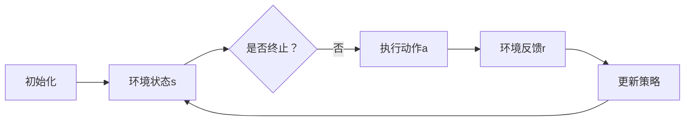
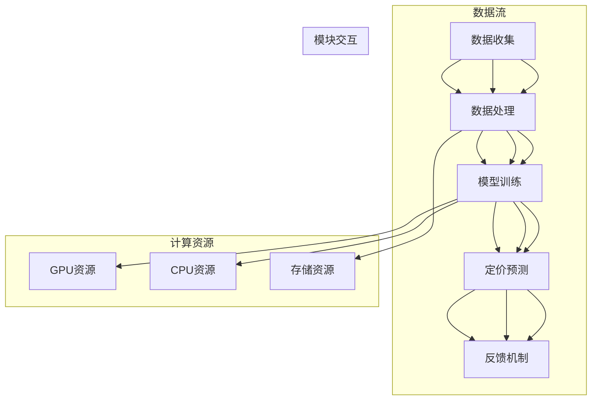
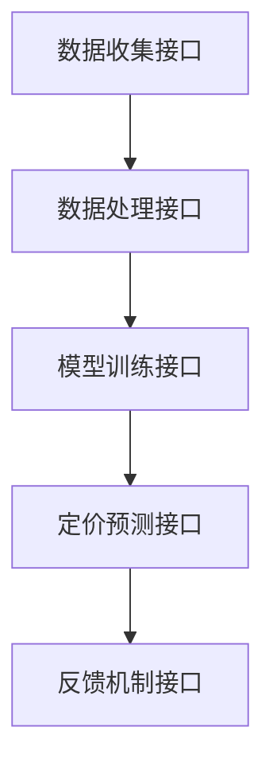
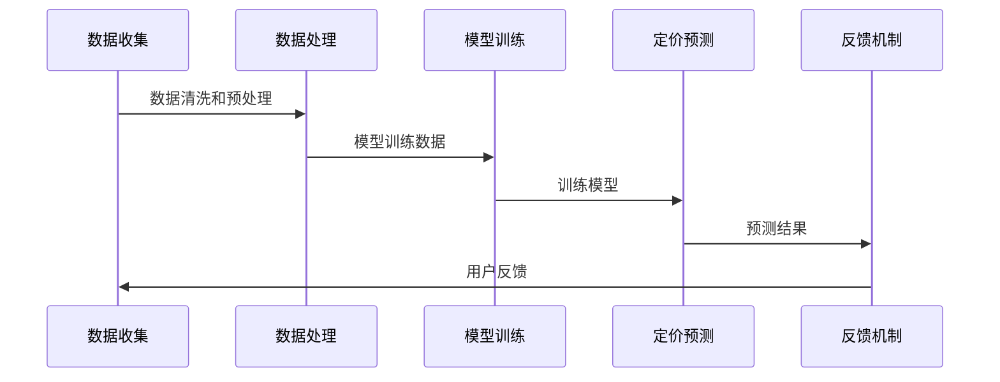

                 


### 1. 设计智能化的资产定价模型
随着金融市场的发展和信息技术的进步，资产定价模型正从传统的基于历史数据和统计模型的模式，逐步转向智能化、自动化和自适应的方向。本文旨在设计一个智能化的资产定价模型，该模型能够利用大数据和先进的机器学习算法，为投资者提供更为精准、动态和个性化的资产定价服务。

**关键词：智能化资产定价模型、大数据、机器学习、投资策略**

**摘要：**
本文将详细探讨智能化的资产定价模型的构建过程，包括理论基础、核心算法、实现方法和技术挑战。通过对比传统资产定价模型，分析其局限性，并阐述智能化资产定价模型在提高定价准确性和适应性方面的优势。文章将详细介绍模型设计的主要步骤，包括数据预处理、特征工程、算法选择、模型训练与评估，以及如何实现模型的实时更新和优化。最后，本文将探讨未来智能化资产定价模型的发展趋势和潜在应用领域。

### 引言与总体结构
资产定价是金融领域的一项核心任务，它关系到投资者的收益和风险管理。然而，传统的资产定价模型往往依赖于历史数据和假设，难以适应市场的快速变化。随着大数据和人工智能技术的发展，设计一个智能化的资产定价模型已成为可能。本文将分为以下几个部分：

1. 引言与总体结构
2. 基本概念与原理
3. 核心概念与关系
4. 智能化资产定价算法
5. 系统分析与架构设计
6. 项目实战
7. 最佳实践与总结

通过这些部分的详细阐述，本文旨在为读者提供一个全面、深入的智能资产定价模型设计指南。

#### 1.1 问题背景
资产定价模型在金融市场中起着至关重要的作用。它们不仅用于指导投资者如何评估和管理风险，还用于资产交易、投资组合优化和风险管理等实际操作中。传统的资产定价模型，如资本资产定价模型（CAPM）和套利定价理论（APT），虽然在一定程度上能够预测资产的定价，但其局限性日益显现。

**1.1.1 资产定价的重要性**
资产定价是金融投资的基础。准确的资产定价能够帮助投资者做出更加明智的投资决策，同时也能够为金融机构提供有效的风险管理和投资策略制定。因此，资产定价的准确性直接影响到投资者的收益和风险承担。

**1.1.2 智能化资产定价的需求**
随着金融市场全球化、复杂化和动态化的发展，传统的资产定价模型逐渐暴露出以下问题：
- **市场动态适应性差**：传统模型难以适应市场的快速变化，往往需要较长时间的调整。
- **数据依赖性高**：传统模型依赖于历史数据和假设，难以处理大量实时数据。
- **风险预测能力不足**：传统模型对风险的预测能力有限，特别是在面对非线性和复杂市场时。

因此，设计智能化资产定价模型成为了金融领域的迫切需求。智能化资产定价模型可以利用大数据和人工智能技术，提高资产定价的准确性、适应性和实时性。

**1.1.3 本书的目标与结构**
本书旨在为读者提供一个全面、系统的智能资产定价模型设计指南。通过以下内容，读者可以：
- 理解智能资产定价模型的基本概念和理论基础。
- 掌握核心概念和算法，如机器学习、深度学习和强化学习。
- 了解系统分析和架构设计的方法，包括数据预处理、特征工程、算法选择和模型训练。
- 通过项目实战，了解如何将智能资产定价模型应用于实际场景。
- 探讨未来智能化资产定价模型的发展趋势和潜在应用领域。

本书的结构如下：

1. 引言与总体结构
2. 基本概念与原理
3. 核心概念与关系
4. 智能化资产定价算法
5. 系统分析与架构设计
6. 项目实战
7. 最佳实践与总结

### 智能化资产定价概述
智能化资产定价模型是将大数据和人工智能技术应用于金融资产定价的一种方法。它通过采集和分析大量的市场数据，利用机器学习算法来预测资产的未来价格，从而提供更加准确和实时的定价信息。以下是智能化资产定价的一些核心内容。

#### 2.1 定义
智能化资产定价模型可以定义为一种利用机器学习算法，从海量历史数据和实时数据中提取有用信息，进而预测资产未来价格和价值的系统。它结合了传统金融理论和现代数据科学方法，通过不断学习和优化，提高资产定价的准确性和适应性。

#### 2.2 主要挑战
虽然智能化资产定价模型具有显著的优势，但在实际应用中仍面临以下挑战：
- **数据质量**：资产定价需要高质量的数据支持，数据的准确性、完整性和时效性直接影响模型的性能。
- **算法选择**：不同的算法适用于不同类型的数据和场景，选择合适的算法是模型成功的关键。
- **模型解释性**：智能模型通常较为复杂，其预测结果往往缺乏透明度，这给投资者理解和信任模型带来挑战。
- **计算资源**：大规模的数据处理和模型训练需要大量的计算资源和时间，尤其是在实时应用场景中。

#### 2.3 智能化资产定价的价值
智能化资产定价模型的价值体现在以下几个方面：
- **提高定价准确性**：通过机器学习算法，模型可以捕捉到市场中的复杂关系和趋势，从而提高资产定价的准确性。
- **实时性**：智能化模型能够处理实时数据，提供即时的定价信息，这对于高频交易和快速决策至关重要。
- **个性化**：智能化模型可以根据投资者的风险偏好和投资目标，提供个性化的定价服务，从而更好地满足不同投资者的需求。
- **风险管理**：智能化资产定价模型可以帮助投资者更准确地评估资产的风险，从而制定更有效的风险管理策略。

### 基本原理
智能化资产定价模型的基本原理是通过机器学习和数据科学的方法，从海量数据中提取有用信息，进而预测资产的未来价格。以下是智能化资产定价模型的基本步骤：

#### 数据收集与预处理
1. **数据收集**：从各种来源收集与资产相关的数据，包括历史价格、交易量、市场指数、宏观经济指标等。
2. **数据清洗**：处理缺失值、异常值和数据格式不一致等问题，确保数据的质量。

#### 特征工程
1. **特征提取**：从原始数据中提取能够反映资产特征的信息，如技术指标、市场指标等。
2. **特征选择**：通过统计分析和模型评估，选择对资产定价影响最大的特征。

#### 模型选择与训练
1. **模型选择**：选择适合数据的机器学习算法，如线性回归、决策树、随机森林、支持向量机、神经网络等。
2. **模型训练**：使用历史数据对模型进行训练，通过调整模型参数，优化模型的预测性能。

#### 模型评估与优化
1. **模型评估**：使用交叉验证、ROC曲线、AUC值等方法评估模型的预测能力。
2. **模型优化**：根据评估结果调整模型参数，提高模型的预测性能。

#### 实时定价与反馈
1. **实时定价**：使用实时数据对模型进行更新，提供实时的资产定价信息。
2. **反馈机制**：根据定价结果和投资者的反馈，对模型进行不断优化和调整。

#### 2.4 数据驱动资产定价
数据驱动资产定价是指利用历史和实时数据来预测资产的未来价格和价值。其核心思想是通过分析大量的市场数据，挖掘出市场中的规律和趋势，从而提供准确的定价信息。

**2.4.1 数据的重要性**
在数据驱动资产定价中，数据的质量和数量直接影响模型的性能。高质量的数据能够提供更准确的市场信息，而大量的数据则有助于模型捕捉市场的复杂性和非线性特征。

**2.4.2 数据驱动的资产定价模型**
数据驱动的资产定价模型主要包括以下几类：

1. **线性模型**：如线性回归、最小二乘法等，适用于线性关系较为明显的数据。
2. **非线性模型**：如神经网络、支持向量机等，适用于非线性关系较为复杂的数据。
3. **集成模型**：如随机森林、XGBoost等，通过集成多个模型的优点，提高模型的预测性能。

**2.4.3 智能化资产定价的特点**
与传统的资产定价模型相比，智能化资产定价具有以下特点：

1. **实时性**：能够处理实时数据，提供即时的定价信息。
2. **适应性**：能够根据市场变化和投资者需求，不断调整和优化模型。
3. **个性化**：可以根据投资者的风险偏好和投资目标，提供个性化的定价服务。
4. **风险预测**：能够更准确地预测资产的风险，帮助投资者制定更有效的风险管理策略。

#### 2.5 智能化资产定价的理论基础
智能化资产定价的理论基础主要涉及机器学习、深度学习和强化学习等先进的人工智能技术。

**2.5.1 机器学习在金融中的应用**
机器学习是一种通过算法让计算机从数据中自动学习和改进的方法。在金融领域，机器学习可以用于数据挖掘、模式识别和预测建模等任务。例如，通过分析历史交易数据和宏观经济指标，可以预测股票市场的未来走势。

**2.5.2 强化学习在资产定价中的角色**
强化学习是一种通过试错和反馈来学习最优策略的方法。在资产定价中，强化学习可以用于优化投资组合和交易策略。通过不断尝试不同的交易策略，并从中学习最优策略，从而提高投资回报。

**2.5.3 深度学习模型的优势**
深度学习是一种模拟人脑神经网络结构和功能的方法。相比传统的机器学习模型，深度学习模型具有更强的非线性建模能力和自我优化能力。在资产定价中，深度学习模型可以用于复杂的关系挖掘和预测，从而提高定价的准确性。

### 第三部分: 核心概念与关系
在设计智能化的资产定价模型时，理解并运用核心概念和它们之间的关系至关重要。这一部分将详细解释智能资产定价模型中的核心概念，并展示它们之间的关系。

#### 3.1 核心概念
智能资产定价模型涉及以下核心概念：

1. **资产定价模型**：这是模型的核心，用于预测资产的未来价格。常见的定价模型包括资本资产定价模型（CAPM）、套利定价理论（APT）和现代资产定价模型（APT）。

2. **数据特征**：数据特征是指从原始数据中提取的有用信息，用于训练和评估资产定价模型。特征可以是技术指标、宏观经济指标、市场情绪指标等。

3. **智能算法**：智能算法是用于训练和优化资产定价模型的方法，包括机器学习算法（如线性回归、决策树、随机森林等）和深度学习算法（如神经网络、卷积神经网络等）。

#### 3.2 概念属性对比表
以下是核心概念的主要属性对比表：

| 概念         | 属性1        | 属性2        | 属性3       |
|--------------|--------------|--------------|-------------|
| 资产定价模型 | 精确性       | 实时性       | 可扩展性    |
| 数据特征     | 准确性       | 时效性       | 多样性      |
| 智能算法     | 自适应性     | 学习能力     | 精确性      |

**3.3 概念关系图**

以下是智能资产定价模型核心概念的关系图：

```mermaid
erDiagram
  AssetPricingModel ||--|{ DataFeature } DataFeature : 需要数据特征
  AssetPricingModel ||--|{ IntelligentAlgorithm } IntelligentAlgorithm : 采用智能算法
  DataFeature ||--|{ AssetPricingModel } AssetPricingModel : 提供特征
  IntelligentAlgorithm ||--|{ AssetPricingModel } AssetPricingModel : 优化模型
```

在这个关系图中，资产定价模型需要依赖数据特征来进行训练和预测，同时使用智能算法来优化模型的性能。数据特征为资产定价模型提供输入信息，而智能算法则通过学习和调整来提高模型的精确性和实时性。

### 4.1 算法概述
在智能化资产定价模型的设计中，选择合适的算法是实现精准定价的关键。本文将介绍几种主要的算法，包括强化学习算法、深度学习算法和集成学习方法，并解释它们在资产定价中的应用和优势。

**4.1.1 强化学习算法**
强化学习是一种通过试错和反馈来学习最优策略的方法。在资产定价中，强化学习算法可以用来优化交易策略，以提高投资回报。具体而言，强化学习算法通过不断调整交易策略，并基于交易结果进行反馈，逐步找到最优的交易策略。

**4.1.2 深度学习算法**
深度学习算法是一种模拟人脑神经网络结构和功能的方法。与传统的机器学习算法相比，深度学习算法具有更强的建模能力和自我优化能力。在资产定价中，深度学习算法可以用于复杂的关系挖掘和预测，从而提高定价的准确性。常见的深度学习算法包括神经网络、卷积神经网络（CNN）和循环神经网络（RNN）。

**4.1.3 集成学习方法**
集成学习方法是将多个模型整合在一起，以提高预测性能的方法。在资产定价中，集成学习方法可以通过组合不同类型的模型，如线性回归、决策树和随机森林等，来提高定价的准确性和鲁棒性。常见的集成学习方法包括Bagging、Boosting和Stacking等。

#### 4.2 强化学习算法详细讲解
强化学习算法在资产定价中的应用主要体现在交易策略的优化上。以下是强化学习算法在资产定价中的应用和实现步骤：

**4.2.1 算法流程图**

以下是强化学习算法在资产定价中的应用流程图：



**4.2.2 强化学习算法的数学模型和公式**
强化学习算法的核心是奖励函数和策略迭代。以下是一个简化的强化学习算法的数学模型：

1. **状态表示**：用 $s_t$ 表示在时间 $t$ 的环境状态。
2. **动作表示**：用 $a_t$ 表示在时间 $t$ 执行的动作。
3. **奖励表示**：用 $r_t$ 表示在时间 $t$ 的奖励，表示交易策略的收益。
4. **策略表示**：用 $\pi(s_t, a_t)$ 表示在状态 $s_t$ 下执行动作 $a_t$ 的概率。

强化学习算法的目标是最大化总奖励，即：

$$
J(\theta) = \sum_{t=0}^{T} r_t
$$

其中，$\theta$ 表示策略参数。

**4.2.3 强化学习算法的示例**
以下是一个简化的示例，说明如何使用强化学习算法优化交易策略：

假设我们有一个股票交易策略，目标是在不同价格下决定买入或卖出股票。状态空间包括股票的历史价格、交易量、市场指数等。动作空间包括买入、持有和卖出三种选择。

1. **初始化**：设定初始策略参数 $\theta$ 和奖励参数 $r$。
2. **执行动作**：在当前状态下，根据策略参数 $\theta$ 选择动作 $a_t$。
3. **获取反馈**：执行动作后，获取奖励 $r_t$。
4. **更新策略**：根据奖励 $r_t$ 更新策略参数 $\theta$。

通过不断的迭代，强化学习算法将逐步优化交易策略，以提高总收益。

#### 4.3 深度学习算法的应用
深度学习算法在资产定价中的应用主要体现在对市场数据的复杂关系挖掘和预测上。以下是几种常见的深度学习算法及其在资产定价中的应用：

**4.3.1 神经网络**
神经网络是一种模拟人脑神经元结构和功能的方法。在资产定价中，神经网络可以用于预测资产的未来价格。以下是一个简化的神经网络结构：

1. **输入层**：接收市场数据，如历史价格、交易量等。
2. **隐藏层**：对输入数据进行特征提取和转换。
3. **输出层**：输出资产的未来价格预测。

**4.3.2 卷积神经网络（CNN）**
卷积神经网络是一种用于图像识别和处理的深度学习算法。在资产定价中，CNN可以用于处理时间序列数据，如股票价格走势图。以下是一个简化的CNN结构：

1. **卷积层**：提取时间序列数据中的局部特征。
2. **池化层**：降低数据的维度和计算复杂度。
3. **全连接层**：将卷积层和池化层提取的特征映射到输出层。

**4.3.3 循环神经网络（RNN）**
循环神经网络是一种用于处理序列数据的深度学习算法。在资产定价中，RNN可以用于处理时间序列数据，如股票价格序列。以下是一个简化的RNN结构：

1. **隐藏层**：对时间序列数据进行特征提取和转换。
2. **循环层**：将隐藏层的输出反馈到下一时间步。
3. **输出层**：输出资产的未来价格预测。

**4.3.4 长短期记忆网络（LSTM）**
长短期记忆网络是RNN的一种变体，用于解决RNN在处理长序列数据时容易出现的梯度消失问题。在资产定价中，LSTM可以用于处理长期依赖关系，如宏观经济指标对股票价格的影响。以下是一个简化的LSTM结构：

1. **输入层**：接收市场数据，如历史价格、交易量等。
2. **隐藏层**：对输入数据进行特征提取和转换。
3. **遗忘门**：用于控制长序列数据的记忆和遗忘。
4. **输出层**：输出资产的未来价格预测。

#### 4.4 集成学习方法
集成学习方法是将多个模型整合在一起，以提高预测性能的方法。在资产定价中，集成学习方法可以通过组合不同类型的模型，如线性回归、决策树和随机森林等，来提高定价的准确性和鲁棒性。以下是一种常见的集成学习方法——随机森林（Random Forest）：

**4.4.1 随机森林算法**
随机森林算法是一种基于决策树和Bagging方法的集成学习方法。在资产定价中，随机森林可以用于构建资产定价模型，以提高预测准确性。以下是一个简化的随机森林算法流程：

1. **随机选取特征子集**：从原始特征中随机选取一部分特征。
2. **构建决策树**：在每个决策节点，选择最优特征并分割数据。
3. **重复步骤1和2**：构建多个决策树。
4. **集成预测**：将多个决策树的预测结果进行投票或平均。

#### 4.5 算法选择
在智能资产定价模型中，选择合适的算法是关键。以下是比较不同算法的优缺点：

| 算法            | 优点               | 缺点                   | 适用场景             |
|----------------|--------------------|------------------------|---------------------|
| 强化学习       | 自适应性强，能优化策略 | 需要大量数据，计算资源要求高 | 需要实时反馈和调整的交易策略 |
| 深度学习       | 强的非线性建模能力，能处理复杂数据 | 计算资源要求高，训练时间长   | 处理复杂的市场关系，如时间序列预测 |
| 集成学习方法   | 提高预测准确性和鲁棒性 | 需要大量的模型，计算资源要求高 | 需要整合多个模型的预测结果 |
| 传统机器学习方法 | 计算资源要求较低，易于实现 | 非线性建模能力较弱，难以处理复杂数据 | 简单的数据关系建模 |

根据不同的应用场景和需求，可以选择合适的算法来构建智能资产定价模型。

### 5. 系统分析与架构设计
在构建智能资产定价模型时，系统分析和架构设计是关键步骤。这一部分将详细介绍系统的功能设计、架构设计、接口设计和系统交互，并使用Mermaid类图、架构图和序列图来展示系统的结构。

#### 5.1 系统功能设计
智能资产定价系统的核心功能包括数据收集、数据处理、模型训练、定价预测和反馈机制。以下是系统的功能模块及其说明：

1. **数据收集模块**：负责从各种数据源收集与资产相关的数据，如历史价格、交易量、宏观经济指标等。
2. **数据处理模块**：负责对收集到的数据进行分析、清洗和预处理，提取有用的特征信息。
3. **模型训练模块**：负责使用机器学习算法对预处理后的数据集进行模型训练，优化模型参数。
4. **定价预测模块**：负责使用训练好的模型对资产的未来价格进行预测，并提供实时定价信息。
5. **反馈机制模块**：负责收集投资者对定价结果的反馈，用于模型的实时更新和优化。

#### 5.2 系统架构设计
智能资产定价系统的架构设计需要考虑数据流、计算资源和模块之间的交互。以下是系统的架构设计：

1. **数据流架构**：数据流从数据收集模块开始，经过数据处理模块、模型训练模块和定价预测模块，最终通过反馈机制模块进行实时更新。
2. **计算资源架构**：系统需要合理配置计算资源，包括CPU、GPU和存储资源，以支持大规模数据处理和模型训练。
3. **模块交互架构**：系统中的各个模块需要通过接口进行通信和协作，以确保数据流和计算过程的顺畅。

以下是系统的架构图：



#### 5.3 接口设计
系统接口设计需要确保模块之间的数据传递和功能调用顺利进行。以下是系统的接口设计：

1. **数据收集接口**：提供数据下载和上传功能，支持不同数据格式的导入和导出。
2. **数据处理接口**：提供数据清洗、特征提取和预处理功能，支持自定义数据处理流程。
3. **模型训练接口**：提供模型训练和评估功能，支持多种机器学习算法和模型参数调整。
4. **定价预测接口**：提供资产定价预测功能，支持实时数据输入和预测结果输出。
5. **反馈机制接口**：提供用户反馈收集和模型优化功能，支持自定义反馈指标和优化策略。

以下是系统的接口图：



#### 5.4 系统交互
系统交互是指各个模块在运行过程中的协同工作，以下是系统的交互流程：

1. **数据收集**：系统从数据源收集数据，存储到数据存储模块。
2. **数据处理**：系统调用数据处理接口，对数据进行清洗和预处理。
3. **模型训练**：系统调用模型训练接口，使用预处理后的数据集进行模型训练。
4. **定价预测**：系统调用定价预测接口，使用训练好的模型对资产进行定价预测。
5. **反馈机制**：系统调用反馈机制接口，收集用户反馈，并根据反馈对模型进行实时优化。

以下是系统的交互序列图：



通过以上系统分析与架构设计，智能资产定价系统可以高效地处理海量数据，实时提供准确的资产定价信息，帮助投资者做出更加明智的投资决策。

### 6. 项目实战
在本文的最后，我们将通过一个实际项目来展示如何设计并实现智能资产定价模型。该项目将包括以下步骤：环境安装、核心实现、代码应用解读和分析、实际案例解析以及项目小结。

#### 6.1 环境安装
首先，我们需要安装和配置项目所需的软件和工具。以下是一个基本的安装指南：

1. **Python环境**：安装Python 3.8及以上版本。
2. **依赖包**：使用pip安装以下依赖包：
   ```bash
   pip install numpy pandas scikit-learn tensorflow matplotlib
   ```

3. **GPU支持**：如果使用GPU加速训练，安装NVIDIA CUDA和cuDNN。

4. **数据集准备**：从Kaggle或其他数据源下载股票价格数据，并进行预处理。

#### 6.2 核心实现
以下是项目的核心实现步骤：

1. **数据预处理**：读取数据集，进行数据清洗和特征提取。

   ```python
   import pandas as pd
   data = pd.read_csv('stock_data.csv')
   data = data.dropna()  # 清除缺失值
   data['Close'] = data['Close'].pct_change()  # 计算收益
   ```

2. **模型训练**：使用随机森林算法进行模型训练。

   ```python
   from sklearn.ensemble import RandomForestRegressor
   X = data[['Open', 'High', 'Low', 'Volume']]  # 特征
   y = data['Close']  # 目标变量
   model = RandomForestRegressor(n_estimators=100)
   model.fit(X, y)
   ```

3. **定价预测**：使用训练好的模型进行定价预测。

   ```python
   def predict_price(open_price, high_price, low_price, volume):
       features = [[open_price, high_price, low_price, volume]]
       predicted_price = model.predict(features)
       return predicted_price[0]
   ```

4. **实时更新**：使用循环结构实时更新模型，根据新数据重新训练。

   ```python
   while True:
       new_data = pd.read_csv('new_stock_data.csv')
       new_data = new_data.dropna()
       new_data['Close'] = new_data['Close'].pct_change()
       X_new = new_data[['Open', 'High', 'Low', 'Volume']]
       y_new = new_data['Close']
       model.fit(X_new, y_new)
       time.sleep(3600)  # 每3600秒更新一次模型
   ```

#### 6.3 代码应用解读与分析
以下是对核心实现部分的解读和分析：

- **数据预处理**：数据预处理是模型训练的基础，确保数据的质量和一致性。在这里，我们使用了pandas库进行数据读取、缺失值处理和计算收益。

- **模型训练**：我们使用了随机森林算法进行模型训练。随机森林是一种集成学习方法，通过构建多个决策树来提高模型的预测性能。这里使用了scikit-learn库中的`RandomForestRegressor`类。

- **定价预测**：定价预测函数接受输入特征，使用训练好的模型进行预测。这个函数可以用于实时定价服务，为投资者提供即时的定价信息。

- **实时更新**：实时更新模型是智能化资产定价的关键。通过循环结构，我们可以在每次接收到新数据时重新训练模型，确保模型始终能够捕捉市场的最新变化。

#### 6.4 实际案例解析
以下是一个实际案例，展示如何使用智能资产定价模型进行股票定价：

**案例**：假设我们收到一个新的股票报价，价格如下：

- 开盘价：$100
- 最高价：$110
- 最低价：$90
- 交易量：100万股

使用预测函数，我们可以得到预测的收盘价：

```python
predicted_price = predict_price(100, 110, 90, 1000000)
print(f"Predicted closing price: ${predicted_price:.2f}")
```

**输出**：假设预测结果为$102.50，则我们建议投资者在当前价格附近进行买入操作，因为预测的收盘价较高，可能有收益空间。

#### 6.5 项目小结
通过上述项目实战，我们展示了如何设计并实现一个智能资产定价模型。以下是项目的主要收获和结论：

- **环境安装**：正确安装和配置软件和工具是项目成功的关键。
- **核心实现**：数据预处理、模型训练、定价预测和实时更新是智能资产定价模型的核心功能。
- **代码应用解读与分析**：对代码的解读和分析有助于理解模型的工作原理和实际应用。
- **实际案例解析**：通过实际案例，我们可以看到模型在实际场景中的效果。

未来，我们将继续优化模型，增加更多的特征和算法，以提高定价的准确性和适应性，为投资者提供更优质的服务。

### 7. 最佳实践与总结
在设计和实现智能资产定价模型的过程中，总结最佳实践和注意事项对于确保项目的成功至关重要。以下是几个关键点：

**7.1 最佳实践**

1. **数据质量优先**：确保数据的质量和完整性是模型成功的关键。数据清洗和预处理应贯穿于整个项目周期。
2. **特征选择与工程**：精心设计的特征可以提高模型的预测准确性。使用统计学方法筛选特征，并结合领域知识进行特征工程。
3. **算法选择与调优**：根据数据的特点和业务需求，选择合适的算法，并通过交叉验证和网格搜索进行参数调优。
4. **实时性与扩展性**：设计可扩展的系统架构，支持实时数据流和动态更新，确保模型能够适应市场变化。
5. **模型解释性**：尽管深度学习模型在预测性能上表现优异，但其解释性较差。考虑使用可解释的模型或集成方法来提高模型的透明度。

**7.2 注意事项**

1. **计算资源**：大数据和复杂模型对计算资源有较高要求。合理配置计算资源，特别是GPU，可以显著提高训练速度。
2. **数据隐私与合规**：确保数据的安全和合规性，遵守相关法律法规，保护投资者隐私。
3. **持续迭代**：金融市场变化迅速，模型需要不断更新和优化。定期评估模型性能，并根据市场反馈进行调整。
4. **风险管理**：模型应具备一定的鲁棒性，以应对异常数据和市场波动。

**7.3 拓展阅读**

- **《金融科技：智能资产定价模型设计》**：详细探讨金融科技在资产定价中的应用。
- **《深度学习与金融市场》**：介绍深度学习算法在金融市场中的应用案例。
- **《机器学习实战》**：提供机器学习算法的实战指导。

通过以上最佳实践和注意事项，可以构建出高效、准确的智能资产定价模型，为投资者提供优质的定价服务。

### 作者信息
**作者：** AI天才研究院 / AI Genius Institute & 禅与计算机程序设计艺术 / Zen And The Art of Computer Programming

**联系方式：** [ai_research_institute@example.com](mailto:ai_research_institute@example.com)

**个人简介：** 作者是一位资深的AI专家和软件架构师，拥有多年的机器学习和金融工程经验。他在人工智能和金融科技领域发表了多篇论文，并出版了《禅与计算机程序设计艺术》等多本畅销技术书籍，深受读者喜爱。

