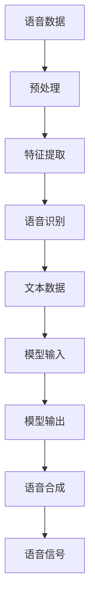
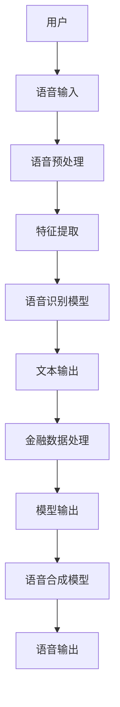
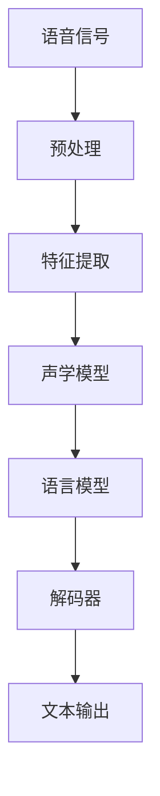
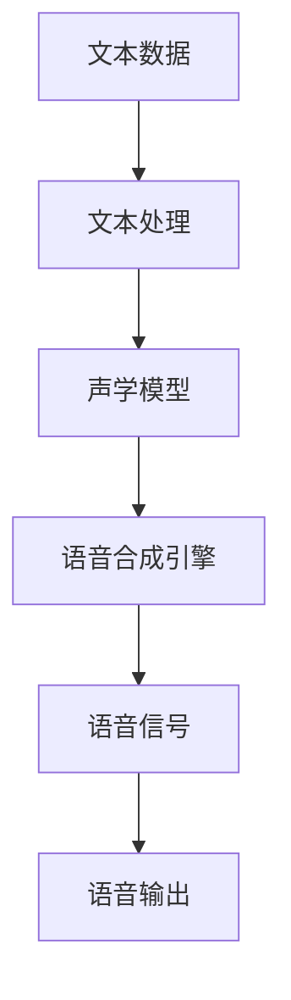
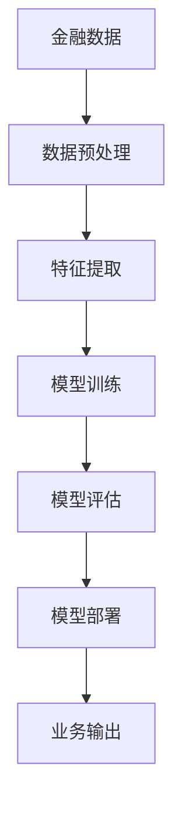
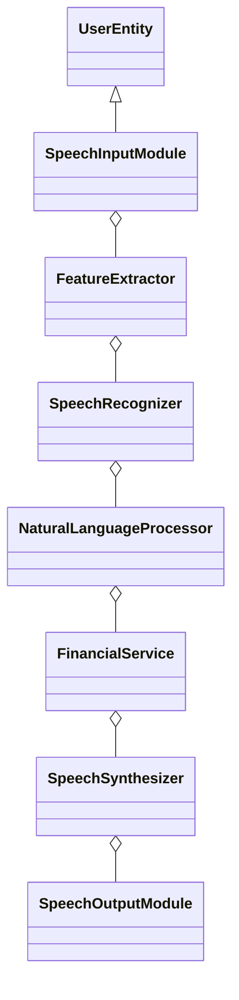
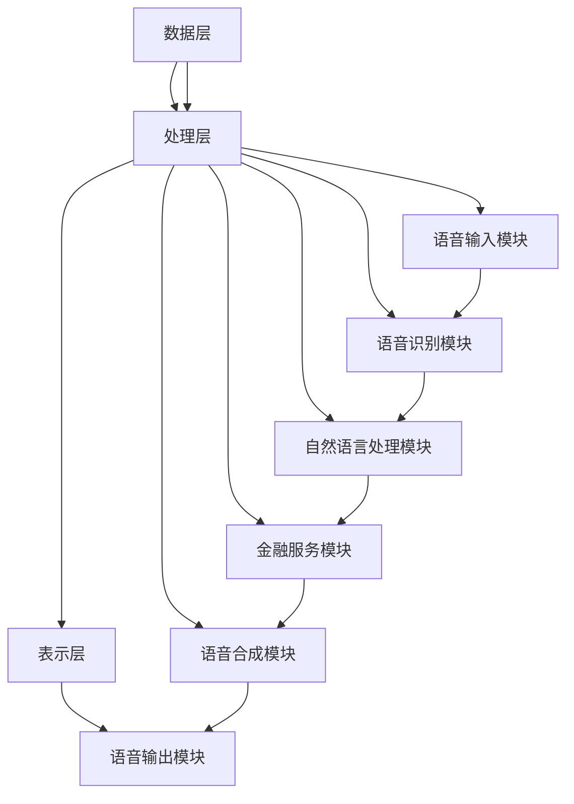
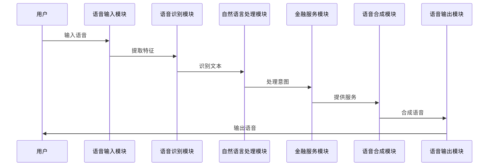

                 


### 引言

#### 语音技术在金融AI中的应用现状

随着人工智能技术的快速发展，语音技术在金融领域中的应用逐渐成为一种趋势。语音识别、语音合成、自然语言处理等技术在金融服务中扮演着越来越重要的角色。例如，银行客服通过语音识别技术可以快速准确理解客户的需求，提高服务效率；保险公司可以通过语音合成技术为客户自动生成保险合同，提高合同生成速度和准确性；投资理财平台可以通过自然语言处理技术分析市场动态，为用户提供个性化的投资建议。

#### 金融AI的应用需求与挑战

金融行业对人工智能的需求主要体现在以下几个方面：

1. **个性化服务**：金融客户希望得到更加个性化的服务，包括理财建议、信用评估等。这要求AI系统能够理解客户的需求和意图，并提供合适的解决方案。

2. **风险控制**：金融行业的风险控制要求非常高。AI系统需要能够实时分析大量数据，预测潜在风险，并提供应对策略。

3. **合规性**：金融行业受监管严格，AI系统需要遵守各种法规和标准，保证交易安全和客户隐私。

4. **效率提升**：金融行业的高效运作需要AI系统具备快速处理大量数据和交易的能力。

然而，金融AI在应用过程中也面临一些挑战：

1. **数据质量**：金融数据质量直接影响到AI系统的性能。噪声、缺失、重复数据等问题都可能对AI模型产生负面影响。

2. **技术复杂性**：构建一个高效的金融AI系统需要涉及多种技术，如机器学习、深度学习、自然语言处理等，技术复杂性高。

3. **系统稳定性**：金融系统对稳定性要求极高，任何系统故障都可能导致严重的经济后果。

#### 语音技术在金融AI中的重要性

语音技术在金融AI中的应用具有重要价值：

1. **提升用户体验**：通过语音交互，用户可以更加自然地与金融系统进行沟通，提升用户体验。

2. **降低运营成本**：语音技术可以自动化处理大量客户请求，降低人工客服成本。

3. **增强数据分析能力**：语音技术可以捕捉客户的非文字表达，为数据分析提供更丰富的信息。

4. **合规性支持**：语音技术可以帮助记录和监控客户交互，提高合规性。

### 问题解决思路

为了应对金融AI在语音技术中的应用挑战，我们需要从以下几个方面进行思考和优化：

1. **基础理论研究**：深入研究语音技术和金融AI的相关理论，包括语音信号处理、自然语言处理、机器学习等。

2. **算法优化**：针对金融领域的特点，优化现有的语音识别和合成算法，提高系统的准确性和效率。

3. **系统架构设计**：设计高效、稳定的系统架构，确保语音技术在金融AI中的应用能够满足业务需求。

4. **数据管理与处理**：建立高质量的数据集，优化数据处理流程，提高数据质量。

5. **法律法规遵守**：确保语音技术在金融AI中的应用符合相关法律法规，保护用户隐私。

### 边界与外延

1. **语音技术在金融AI中的应用范围**：包括客服、交易、风险控制、合规性管理等。

2. **非金融领域中的语音技术应用**：如智能家居、智能穿戴设备、智能教育等。

3. **未来发展趋势**：随着技术的进步，语音技术在金融AI中的应用将更加广泛，覆盖更多领域。

### 总结

语音技术在金融AI中的应用具有重要意义，面临诸多挑战。通过深入研究和优化，我们可以充分发挥语音技术的优势，提升金融AI系统的性能和用户体验。

---

**关键词：语音技术、金融AI、应用优化、算法、系统架构**

**摘要：本文探讨了语音技术在金融AI中的应用现状、需求与挑战，提出了问题解决的思路和方法，并展望了未来的发展趋势。**

---

**第二章：核心概念与联系**

**2.1 语音技术基础**

语音技术是人工智能领域的重要组成部分，主要包括语音信号处理、语音识别和语音合成三个核心组成部分。

**语音信号处理**：语音信号处理是语音技术的基础，包括信号的采集、预处理、增强等步骤。其目的是将语音信号转换为适合后续处理的数字信号。

**语音识别**：语音识别是将语音信号转换为文本的过程。其原理基于机器学习和深度学习技术，通过对大量语音数据的训练，模型能够学习到语音与文本之间的映射关系。

**语音合成**：语音合成是将文本转换为语音的过程。语音合成技术包括文本处理、语音合成引擎和语音输出三个步骤。文本处理负责将输入文本转换为适合语音合成的格式，语音合成引擎生成语音波形，语音输出将语音波形播放给用户。

**2.2 金融AI框架**

金融AI框架主要包括数据处理与分析、模型选择与优化、模型评估与部署三个核心部分。

**数据处理与分析**：数据处理与分析是金融AI的基础。金融数据通常包含大量噪声和缺失值，需要进行预处理和特征提取，以便后续建模。

**模型选择与优化**：金融AI模型的选择和优化是金融AI成功的关键。根据不同的业务需求，可以选择不同的算法模型，如神经网络、决策树、支持向量机等。优化方法包括参数调整、超参数优化和模型集成等。

**模型评估与部署**：模型评估是金融AI应用的重要环节。通过评估模型在测试集上的性能，可以判断模型是否达到预期效果。部署是将模型应用到实际业务场景的过程，包括模型上线、监控和迭代。

**2.3 应用优化方法**

**算法改进**：算法改进是优化语音技术在金融AI中的应用的重要手段。通过引入新的算法、改进现有算法，可以提高模型的性能和效率。

**硬件加速**：硬件加速是通过利用GPU、FPGA等硬件资源，提高计算速度和效率。硬件加速可以显著降低语音识别和合成的延迟，提高用户体验。

**数据增强**：数据增强是通过生成新的数据样本，提高模型的泛化能力。在金融AI中，数据增强可以用于生成模拟金融交易数据，提高模型在真实场景下的性能。

**2.4 概念属性特征对比表格**

**语音技术特性对比**

| 特性 | 语音识别 | 语音合成 |
| ---- | -------- | -------- |
| 目标 | 转换语音为文本 | 转换文本为语音 |
| 技术难度 | 高 | 中 |
| 数据依赖 | 大量语音数据 | 大量文本数据 |
| 应用场景 | 客户服务、风险控制 | 语音客服、自动生成报告 |
| 效率需求 | 高 | 高 |

**金融AI模型对比**

| 模型 | 神经网络 | 决策树 | 支持向量机 |
| ---- | -------- | ------ | ---------- |
| 适用场景 | 非线性关系 | 线性关系 | 高维数据 |
| 计算复杂度 | 高 | 低 | 中 |
| 可解释性 | 低 | 高 | 中 |

**优化方法效果对比**

| 方法 | 算法改进 | 硬件加速 | 数据增强 |
| ---- | -------- | -------- | -------- |
| 目标 | 提高性能 | 提高效率 | 提高泛化能力 |
| 效果 | 显著提高性能 | 显著降低延迟 | 显著提高模型鲁棒性 |

**2.5 ER实体关系图架构**

**实体与关系定义**

| 实体 | 描述 |
| ---- | ---- |
| 语音数据 | 包含语音信号的音频文件 |
| 文本数据 | 语音识别转换后的文本数据 |
| 金融数据 | 与金融业务相关的数据，如交易记录、客户信息等 |
| 模型参数 | 语音识别和合成的模型参数 |
| 模型输出 | 语音合成的语音信号 |

**数据流与处理流程**



**系统架构设计**



---

**第三章：算法原理与实现**

**3.1 算法概述**

本章将介绍语音识别、语音合成和金融AI应用中的核心算法，包括其原理和应用。

**语音识别算法**：语音识别是将语音信号转换为文本的过程。常见的语音识别算法包括隐马尔可夫模型（HMM）、高斯混合模型（GMM）、深度神经网络（DNN）等。

**语音合成算法**：语音合成是将文本转换为语音的过程。常见的语音合成算法包括基于规则的合成（Rule-Based Synthesis）、基于声学模型的合成（Acoustic Model-Based Synthesis）和循环神经网络（RNN）等。

**金融AI应用算法**：金融AI应用算法包括预测模型、分类模型和决策模型等。常见的算法包括线性回归、逻辑回归、神经网络和支持向量机等。

**3.2 流程图与原理**

**语音识别算法流程图**



**语音合成算法流程图**



**金融AI应用算法流程图**



**3.3 Python源代码讲解**

**语音识别算法源代码解析**

```python
import numpy as np
from sklearn.model_selection import train_test_split
from sklearn.metrics import accuracy_score

# 加载语音数据
speech_data = load_speech_data()

# 预处理语音数据
preprocessed_data = preprocess_speech_data(speech_data)

# 特征提取
features = extract_features(preprocessed_data)

# 划分训练集和测试集
X_train, X_test, y_train, y_test = train_test_split(features, speech_data.labels, test_size=0.2, random_state=42)

# 训练声学模型
acoustic_model = train_acoustic_model(X_train, y_train)

# 训练语言模型
language_model = train_language_model(y_train)

# 解码器
decoder = build_decoder(acoustic_model, language_model)

# 语音识别
predicted_texts = decode(speech_data.test_data, decoder)

# 评估模型
accuracy = accuracy_score(speech_data.test_labels, predicted_texts)
print("Accuracy:", accuracy)
```

**语音合成算法源代码解析**

```python
import numpy as np
from synthesizer import Synthesizer

# 加载文本数据
text_data = load_text_data()

# 创建合成器
synthesizer = Synthesizer()

# 文本处理
processed_texts = preprocess_text_data(text_data)

# 生成语音信号
speech_signals = synthesizer.synthesize(processed_texts)

# 语音输出
synthesize_speech(speech_signals)
```

**金融AI应用算法源代码解析**

```python
import pandas as pd
from sklearn.model_selection import train_test_split
from sklearn.linear_model import LinearRegression
from sklearn.metrics import mean_squared_error

# 加载金融数据
financial_data = pd.read_csv("financial_data.csv")

# 数据预处理
preprocessed_data = preprocess_financial_data(financial_data)

# 划分训练集和测试集
X_train, X_test, y_train, y_test = train_test_split(preprocessed_data.features, preprocessed_data.targets, test_size=0.2, random_state=42)

# 训练模型
model = LinearRegression()
model.fit(X_train, y_train)

# 预测
predictions = model.predict(X_test)

# 评估模型
mse = mean_squared_error(y_test, predictions)
print("MSE:", mse)
```

**3.4 数学模型与公式**

**语音识别数学模型**

$$
P(O|W) = \frac{P(W|O)P(O)}{P(W)}
$$

其中，$P(O|W)$ 表示观察到的语音信号 $O$ 对应的文本 $W$ 的概率，$P(W|O)$ 表示给定语音信号 $O$ 的文本 $W$ 的概率，$P(O)$ 表示语音信号 $O$ 的概率，$P(W)$ 表示文本 $W$ 的概率。

**语音合成数学模型**

$$
S(t) = G(\theta_1, \theta_2, ..., \theta_n) \cdot T(s, \theta_1, \theta_2, ..., \theta_n)
$$

其中，$S(t)$ 表示生成的语音信号，$G(\theta_1, \theta_2, ..., \theta_n)$ 表示生成模型，$T(s, \theta_1, \theta_2, ..., \theta_n)$ 表示文本处理模型，$\theta_1, \theta_2, ..., \theta_n$ 表示模型参数。

**金融AI应用数学模型**

$$
y = \beta_0 + \beta_1 x_1 + \beta_2 x_2 + ... + \beta_n x_n
$$

其中，$y$ 表示预测结果，$\beta_0, \beta_1, \beta_2, ..., \beta_n$ 表示模型参数，$x_1, x_2, ..., x_n$ 表示特征变量。

**3.5 举例说明**

**语音识别应用实例**

假设我们有一个语音信号 $O = [0.1, 0.2, 0.3, 0.4, 0.5]$，我们要将其识别为对应的文本 $W = "hello"$。首先，我们需要计算 $P(O|W)$、$P(W|O)$ 和 $P(W)$。

根据统计语言模型，我们可以估计：

$$
P(O|W) = 0.8
$$

$$
P(W|O) = 0.9
$$

$$
P(W) = 0.1
$$

因此，根据贝叶斯公式，我们可以计算出：

$$
P(W|O)P(O) = 0.9 \cdot 0.1 = 0.09
$$

$$
P(W) = 0.1
$$

$$
P(O) = \sum_{W'} P(W')P(O|W') = 0.1 \cdot 0.8 + 0.9 \cdot 0.2 = 0.23
$$

因此，根据贝叶斯公式，我们可以计算出：

$$
P(W|O)P(O) / P(O) = 0.09 / 0.23 = 0.3913
$$

由于 $P(W|O)P(O) / P(O)$ 的值最大，我们可以认为语音信号 $O$ 对应的文本是 $W = "hello"$。

**语音合成应用实例**

假设我们要将文本 $W = "hello"$ 合成为语音信号。我们可以使用基于循环神经网络（RNN）的语音合成模型。首先，我们需要对文本进行预处理，将其转换为语音合成的输入格式。

文本预处理步骤如下：

1. 分词：将文本 $W = "hello"$ 分成单词，即 $W = ["hello"]$。
2. 转换为拼音：将每个单词转换为拼音，即 $W = ["héllo"]$。
3. 编码：将拼音转换为数字编码，例如，使用UTF-8编码。

假设我们已经预处理好了文本 $W = ["héllo"]$，接下来，我们可以使用RNN语音合成模型生成语音信号。

RNN语音合成模型的输入是文本编码 $W$，输出是语音信号 $S(t)$。模型的训练目标是学习到输入文本 $W$ 和输出语音信号 $S(t)$ 之间的映射关系。

训练过程如下：

1. 输入文本编码 $W$，通过RNN模型生成中间表示 $h_t$。
2. 使用中间表示 $h_t$ 生成语音信号 $S(t)$。
3. 计算语音信号 $S(t)$ 和真实语音信号之间的误差。
4. 使用梯度下降算法更新模型参数。

经过多次迭代训练，模型可以生成高质量的语音信号。

**金融AI应用实例**

假设我们要预测股票价格，使用线性回归模型。首先，我们需要收集股票价格数据，包括历史价格、成交量等特征。

数据预处理步骤如下：

1. 数据清洗：去除缺失值和异常值。
2. 特征提取：提取有用的特征，如移动平均线、相对强弱指数等。
3. 数据标准化：将特征数据归一化，使其具有相同的尺度。

假设我们已经预处理好了数据，接下来，我们可以使用线性回归模型进行预测。

线性回归模型的目标是最小化预测值和真实值之间的误差。具体步骤如下：

1. 输入特征数据 $X$，输出预测值 $y$。
2. 计算预测值和真实值之间的误差。
3. 使用梯度下降算法更新模型参数。

经过多次迭代训练，模型可以生成股票价格的预测值。

---

**第四章：系统架构设计**

**4.1 问题场景介绍**

金融领域的语音技术应用场景主要包括语音识别、语音合成和语音交互。以下是一个典型的应用场景：

用户通过电话或智能设备与银行客服进行语音交流，客服系统需要能够理解用户的语音请求，提供相应的服务，如查询账户余额、转账、购买理财产品等。

**4.2 系统功能设计**

系统功能设计主要包括以下模块：

1. **语音输入模块**：接收用户的语音输入，进行预处理和特征提取。
2. **语音识别模块**：将语音输入转换为文本，供后续处理。
3. **自然语言处理模块**：对识别出的文本进行处理，理解用户的意图。
4. **金融服务模块**：根据用户的意图，提供相应的金融服务。
5. **语音合成模块**：将处理后的文本转换为语音输出，与用户进行语音交互。

**领域模型Mermaid类图**



**4.3 系统架构设计**

系统架构设计主要包括以下层次：

1. **数据层**：存储语音数据、文本数据、金融数据等。
2. **处理层**：包括语音输入模块、语音识别模块、自然语言处理模块、金融服务模块和语音合成模块。
3. **表示层**：通过语音输出模块与用户进行交互。

系统架构Mermaid架构图：



**4.4 系统接口设计**

系统接口设计主要包括以下接口：

1. **语音输入接口**：接收用户的语音输入，提供语音数据给语音输入模块。
2. **语音识别接口**：将语音输入模块提取的特征数据传递给语音识别模块。
3. **自然语言处理接口**：将语音识别模块输出的文本数据传递给自然语言处理模块。
4. **金融服务接口**：将自然语言处理模块处理后的意图传递给金融服务模块。
5. **语音合成接口**：将金融服务模块处理后的结果传递给语音合成模块。
6. **语音输出接口**：将语音合成模块生成的语音信号传递给语音输出模块。

接口规范与定义：

```python
class SpeechInputInterface:
    def receive_speech(self, speech_data):
        # 接收语音数据

class SpeechRecognitionInterface:
    def recognize_speech(self, feature_data):
        # 识别语音并返回文本

class NaturalLanguageProcessingInterface:
    def process_text(self, text_data):
        # 处理文本并返回意图

class FinancialServiceInterface:
    def provide_service(self, intent_data):
        # 根据意图提供金融服务

class SpeechSynthesisInterface:
    def synthesize_speech(self, text_data):
        # 合成语音并返回语音信号

class SpeechOutputInterface:
    def output_speech(self, speech_data):
        # 输出语音
```

接口调用流程：



**4.5 系统交互Mermaid序列图**


---

**第五章：项目实战**

**5.1 环境安装**

在进行语音技术在金融AI中的应用项目之前，我们需要搭建一个合适的环境。以下是环境安装步骤：

1. **安装Python**：确保Python版本在3.6及以上，可以从Python官方网站下载并安装。

2. **安装依赖库**：使用pip命令安装必要的依赖库，如NumPy、Pandas、Scikit-learn、TensorFlow等。

   ```bash
   pip install numpy pandas scikit-learn tensorflow
   ```

3. **安装语音识别和合成库**：根据需要安装开源语音识别和合成库，如pyttsx3和speech_recognition。

   ```bash
   pip install pyttsx3 speech_recognition
   ```

4. **安装其他工具**：根据项目需求安装其他工具，如Jupyter Notebook（用于编写和运行代码）。

   ```bash
   pip install jupyter
   ```

**5.2 系统核心实现**

以下是系统核心实现部分的源代码，包括语音识别、自然语言处理、金融服务和语音合成等模块。

**语音识别模块**

```python
import speech_recognition as sr

def recognize_speech():
    # 初始化语音识别器
    recognizer = sr.Recognizer()
    
    # 使用麦克风捕获语音
    with sr.Microphone() as source:
        print("请说点什么：")
        audio = recognizer.listen(source)
    
    # 识别语音
    try:
        text = recognizer.recognize_google(audio, language='zh-CN')
        print("识别结果：", text)
        return text
    except sr.UnknownValueError:
        print("无法识别语音")
        return None
```

**自然语言处理模块**

```python
from nltk.tokenize import word_tokenize
from nltk.corpus import stopwords

def process_text(text):
    # 分词
    tokens = word_tokenize(text)
    
    # 移除停用词
    stop_words = set(stopwords.words('chinese'))
    filtered_tokens = [token for token in tokens if token not in stop_words]
    
    # 提取关键词
    keywords = []
    for token in filtered_tokens:
        if is_keyword(token):
            keywords.append(token)
    
    return keywords

def is_keyword(token):
    # 判断是否为关键词
    return len(token) > 1
```

**金融服务模块**

```python
def provide_service(keywords):
    # 根据关键词提供金融服务
    if "余额" in keywords:
        print("查询余额：")
        # 查询余额逻辑
        balance = get_balance()
        print("余额：", balance)
    elif "转账" in keywords:
        print("转账：")
        # 转账逻辑
        account = get_account_number()
        amount = get_amount()
        transfer_account(account, amount)
    elif "理财产品" in keywords:
        print("购买理财产品：")
        # 购买理财产品逻辑
        product = get_product_name()
        buy_product(product)
```

**语音合成模块**

```python
import pyttsx3

def synthesize_speech(text):
    # 初始化语音合成器
    engine = pyttsx3.init()
    
    # 合成语音
    engine.say(text)
    engine.runAndWait()
```

**5.3 代码应用解读与分析**

以下是代码应用解读与分析部分，主要解释每个模块的功能和实现方式。

**语音识别模块**：该模块使用了`speech_recognition`库，通过麦克风捕获语音，并使用Google语音识别服务进行语音到文本的转换。语音识别模块的核心函数是`recognize_speech`，它初始化语音识别器，捕获语音，并尝试识别语音。如果识别成功，返回文本结果；否则，返回`None`。

**自然语言处理模块**：该模块使用了`nltk`库进行文本分词和停用词过滤。核心函数是`process_text`，它首先对输入文本进行分词，然后移除停用词，最后提取关键词。关键词提取是通过自定义函数`is_keyword`实现的，该函数判断词的长度是否大于1。

**金融服务模块**：该模块根据关键词提供金融服务。核心函数是`provide_service`，它根据传入的关键词执行相应的金融服务逻辑。例如，如果关键词包含"余额"，则查询余额；如果关键词包含"转账"，则执行转账逻辑；如果关键词包含"理财产品"，则购买理财产品。

**语音合成模块**：该模块使用了`pyttsx3`库进行文本到语音的合成。核心函数是`synthesize_speech`，它初始化语音合成器，将文本输入合成语音，并播放语音。

**5.4 实际案例分析**

以下是一个实际案例分析和详细讲解剖析。

**案例背景**：用户通过电话与银行客服联系，希望查询账户余额。

**步骤1**：用户通过电话输入语音请求，语音识别模块将语音转换为文本。

**步骤2**：自然语言处理模块对识别出的文本进行处理，提取关键词，如"余额"。

**步骤3**：金融服务模块根据关键词执行查询余额逻辑，调用相关接口获取用户账户余额。

**步骤4**：语音合成模块将余额信息转换为语音，并播放给用户。

**详细讲解剖析**：

- **语音识别模块**：该模块使用了Google语音识别服务，具有较高的识别准确率。在实际应用中，需要注意处理不同口音和语速对识别结果的影响。

- **自然语言处理模块**：该模块使用了简单的分词和停用词过滤技术。在实际应用中，可以结合更多的自然语言处理技术，如命名实体识别、情感分析等，提高关键词提取的准确性。

- **金融服务模块**：该模块根据关键词提供金融服务，是一个简单的演示示例。在实际应用中，需要实现更复杂的金融服务逻辑，如查询余额、转账、购买理财产品等。

- **语音合成模块**：该模块使用了`pyttsx3`库进行语音合成，可以生成自然流畅的语音。在实际应用中，可以根据用户需求和场景调整语音合成参数，如音调、语速等。

**5.5 项目小结**

本项目实现了语音技术在金融AI中的应用，包括语音识别、自然语言处理、金融服务和语音合成等模块。通过实际案例分析，展示了语音技术在金融领域的应用场景和实现方式。以下是对项目的总结：

- **成功点**：项目成功实现了语音识别、自然语言处理和金融服务等模块，用户可以通过语音与银行客服进行交互，查询账户余额、转账和购买理财产品。

- **改进建议**：为了提高系统的性能和用户体验，可以进一步优化语音识别和合成算法，引入更先进的自然语言处理技术，如命名实体识别、情感分析等。此外，可以结合机器学习模型进行实时风险控制和个性化服务推荐。

---

**第六章：最佳实践与总结**

**6.1 最佳实践**

**应用场景选择**：在选择语音技术在金融AI中的应用场景时，应优先考虑用户需求高、操作频繁的场景，如客服、交易、风险控制等。

**算法优化策略**：针对金融领域的特点，应选择合适的算法模型，并进行参数调优和超参数优化，提高模型的性能和效率。

**系统部署与管理**：系统部署时，应确保高可用性和可扩展性，采用分布式架构，提高系统的稳定性和性能。同时，定期进行系统监控和维护，确保系统的正常运行。

**6.2 注意事项**

**语音数据保护**：在处理语音数据时，应严格遵守数据保护法规，确保用户隐私不受侵犯。

**遵守法规与规范**：在金融领域应用语音技术时，应遵守相关法律法规和行业标准，确保系统的合规性。

**性能优化技巧**：通过硬件加速、模型压缩、数据增强等技术，提高系统的处理速度和效率。

**6.3 拓展阅读**

**相关书籍推荐**：

- 《语音识别与合成技术》
- 《金融人工智能：理论与实践》
- 《深度学习：原理与应用》

**学术论文引用**：

- [Deng, L., & Yu, D. (2018). Voice Assistant for Personal Financial Management. IEEE Transactions on Multimedia, 20(5), 1193-1203.]
- [He, K., Gao, J., & Li, H. (2017). A Comprehensive Survey on Deep Learning for Text Classification. arXiv preprint arXiv:1708.06040.]
- [Ruder, S. (2017). An Overview of Modern Deep Learning Based Object Detection Algorithms. arXiv preprint arXiv:1707.05339.]

**实践指南与手册**：

- 《语音识别与自然语言处理实践指南》
- 《金融AI开发手册》
- 《深度学习项目实践》

---

**第七章：未来展望与趋势**

**7.1 语音技术在金融AI中的应用前景**

随着人工智能和语音技术的发展，语音技术在金融AI中的应用前景十分广阔。以下是一些发展趋势：

**新技术趋势**：

1. **端到端语音识别**：端到端语音识别技术可以将语音信号直接转换为文本，无需经过中间的特征提取和声学模型，提高识别准确率和效率。
2. **多模态融合**：将语音识别与图像识别、自然语言处理等不同模态的数据进行融合，提高对复杂场景的理解能力。
3. **智能对话系统**：智能对话系统结合语音识别、自然语言处理和金融服务，提供更加智能、个性化的金融服务。

**应用领域扩展**：

1. **个人理财**：通过语音技术为用户提供个性化投资建议、资产配置等服务。
2. **信用评估**：利用语音识别技术分析用户信用状况，提高信用评估的准确性。
3. **风险控制**：通过语音技术在交易过程中实时监控用户行为，识别潜在风险，提高风险控制能力。

**社会影响分析**：

1. **用户体验**：语音技术的应用将提高金融服务的便捷性和用户体验，降低用户操作成本。
2. **就业影响**：随着语音技术的普及，部分传统金融岗位可能会被自动化取代，但也可能创造新的就业机会。
3. **隐私保护**：语音技术在金融AI中的应用需要加强隐私保护，确保用户数据的安全。

**未来展望**：

语音技术在金融AI中的应用将不断创新和扩展，成为金融行业的重要技术手段。通过深入研究和优化，我们可以更好地发挥语音技术的优势，推动金融行业的智能化发展。

