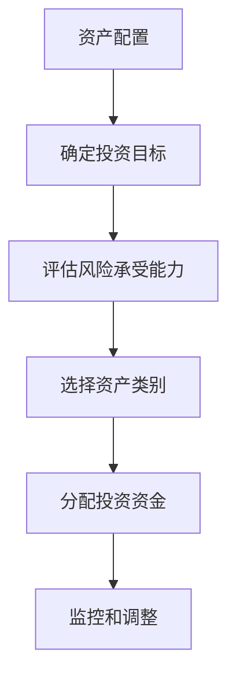

                 

# 费雪到现代：成长型投资的发展

> 关键词：费雪投资理论，现代投资理论，成长型投资，价值投资，市场有效性

> 摘要：本文旨在探讨从费雪时代到现代的成长型投资理论的发展历程。通过对费雪投资理论和现代投资理论的深入分析，本文揭示了两者之间的联系与区别，并讨论了成长型投资在现代金融市场的应用和影响。

## **第一部分：导言**

### **1.1 问题背景**

投资，作为金融市场的重要组成部分，其理论和实践一直在不断发展。从早期的费雪时代，到现代投资理论的成熟，每一个阶段都有其独特的特点和贡献。费雪的投资理论以其独特的视角和方法，为投资者提供了全新的思维方式和投资策略。然而，随着金融市场的发展，现代投资理论逐渐取代了费雪的时代，成为主流的投资理论。

本文将探讨从费雪时代到现代的成长型投资理论的发展历程。首先，我们将回顾费雪的投资理论，分析其在不同历史时期的表现，并探讨其与现代投资理论的联系。接着，我们将介绍现代投资理论的核心概念和方法，分析其在实际投资中的应用效果。最后，我们将讨论成长型投资理论的发展，以及其在现代金融市场中的地位和作用。

### **1.2 问题描述**

本文的核心问题是：如何理解费雪的投资理论与现代投资理论的联系和区别，以及如何在现代金融市场中运用成长型投资策略。具体来说，我们将从以下几个方面展开：

1. 费雪的投资理论：回顾费雪的投资理论，分析其核心概念和方法。
2. 现代投资理论：介绍现代投资理论的核心概念和方法，分析其与现代投资理论的联系。
3. 成长型投资理论：探讨成长型投资理论的发展，以及其在现代金融市场中的应用。
4. 成长型投资策略：分析成长型投资策略的原理和实践，探讨其在现代金融市场中的效果。

### **1.3 问题解决**

本文将通过以下步骤解决问题：

1. **回顾费雪的投资理论**：分析费雪的投资理论的核心概念和方法，探讨其在现代金融市场中的应用。
2. **介绍现代投资理论**：介绍现代投资理论的核心概念和方法，分析其与现代投资理论的联系。
3. **探讨成长型投资理论**：分析成长型投资理论的发展，以及其在现代金融市场中的地位和作用。
4. **分析成长型投资策略**：探讨成长型投资策略的原理和实践，分析其在现代金融市场中的效果。
5. **总结和展望**：总结本文的主要观点，展望成长型投资理论的发展趋势。

### **1.4 边界与外延**

投资理论的边界与外延涉及到金融市场的各个方面，包括股票、债券、房地产等。本文主要关注成长型投资理论，因此讨论将主要集中在股票市场。此外，本文还将探讨成长型投资理论在不同投资市场中的表现和作用。

## **第二部分：费雪的投资理论**

### **2.1 费雪的时代**

费雪的投资理论主要形成于20世纪20年代至30年代，这一时期是资本主义经济高速发展的时期。费雪是一位杰出的经济学家和投资大师，他的理论和方法对当时的投资者产生了深远的影响。

费雪的时代，正值美国资本主义经济的黄金时期，股票市场的快速发展为投资者提供了巨大的机遇。然而，股票市场的波动性也很大，投资者面临着巨大的风险。费雪的投资理论正是在这样的背景下产生的，他提出了一系列独特的投资方法和策略，帮助投资者在股票市场中获得稳定的回报。

### **2.2 核心概念与原理**

费雪的投资理论主要基于以下核心概念和原理：

1. **价值投资**：费雪认为投资的成功在于寻找那些被市场低估的优质股票。他强调投资者应该深入分析公司的基本面，包括财务状况、市场地位、未来发展前景等，以确定股票的真实价值。

2. **市场有效性**：费雪认为市场是有效的，但并非完美。他认为，尽管市场会反映大部分信息，但仍然存在未被市场发现的机会。投资者可以通过深入研究和分析，找到市场的不足，从而获得超额利润。

3. **时机选择**：费雪认为投资者应该关注市场的波动，选择合适的时机进行买卖。他提出了一系列市场分析的技巧和方法，包括技术分析、市场情绪分析等，以帮助投资者把握市场时机。

### **2.3 费雪的投资策略**

费雪的投资策略主要包括以下几个方面：

1. **长期持有**：费雪认为投资者应该选择优质股票，长期持有，以获取稳定的投资回报。他认为，长期持有可以避免市场的短期波动，减少投资风险。

2. **分散投资**：费雪认为投资者应该将资金分散投资于不同的行业和股票，以降低投资风险。他认为，通过分散投资，可以避免因某一行业或股票的波动而导致整体投资损失。

3. **时机选择**：费雪认为投资者应该关注市场的波动，选择合适的时机进行买卖。他提出了一系列市场分析的技巧和方法，包括技术分析、市场情绪分析等，以帮助投资者把握市场时机。

## **第三部分：现代投资理论**

### **3.1 现代投资理论的起源**

现代投资理论起源于20世纪50年代至60年代，这一时期是资本主义经济高速发展的时期。随着金融市场的不断发展和完善，投资理论也逐渐从经验总结走向科学化、系统化。

现代投资理论的诞生，得益于数学模型和统计分析方法的发展。1952年，威廉·夏普提出了资本资产定价模型（CAPM），为投资者提供了计算资产预期收益和风险的方法。此后，许多学者相继提出了其他资产定价模型，如套利定价理论（APT）、多因素模型等，进一步丰富了现代投资理论的内容。

### **3.2 核心概念与原理**

现代投资理论主要基于以下核心概念和原理：

1. **有效市场假说**：有效市场假说认为，股票的价格已经反映了所有可获得的信息，因此投资者无法通过分析信息来获得超额利润。这意味着，投资者应该采取被动投资策略，如指数投资，以获取市场平均收益。

2. **资产定价模型**：资产定价模型，如CAPM，为投资者提供了计算资产预期收益和风险的方法。这些模型基于数学原理，通过分析历史数据，预测资产的未来收益和风险。

3. **行为金融学**：行为金融学认为，投资者在决策过程中会受到心理和情感因素的影响，从而影响投资行为。行为金融学通过研究投资者的行为，试图揭示投资决策的规律。

### **3.3 现代投资策略**

现代投资策略主要包括以下几个方面：

1. **指数投资**：指数投资是一种被动投资策略，投资者通过购买指数基金来跟踪整个市场或特定市场的表现。指数投资具有成本低、风险低、收益稳定的特点。

2. **资产配置**：资产配置是一种通过在不同资产类别之间分配投资资金来降低风险和最大化回报的策略。投资者可以根据自己的风险承受能力和投资目标，合理配置资产。

3. **量化投资**：量化投资是一种利用数学模型和统计分析方法进行投资决策的策略。量化投资通过分析大量历史数据，预测资产的未来表现，从而制定投资策略。

## **第四部分：费雪与现代投资理论的联系与区别**

### **4.1 费雪与现代投资理论的联系**

费雪的投资理论与现代投资理论在许多方面有着共同之处，主要体现在以下几个方面：

1. **价值投资**：费雪的价值投资理论与现代投资理论中的价值投资理念相一致。两者都强调投资者应该寻找被市场低估的优质股票，以获取超额利润。

2. **市场有效性**：费雪认为市场是有效的，但并非完美，而现代投资理论中的有效市场假说也认为市场是有效的。两者都认为，股票的价格已经反映了所有可获得的信息。

3. **时机选择**：费雪和现代投资理论都强调时机选择的重要性。费雪认为投资者应该关注市场的波动，选择合适的时机进行买卖。现代投资理论也认为，投资者应该通过分析市场数据，预测市场的未来走势，从而制定投资策略。

### **4.2 费雪与现代投资理论的区别**

费雪的投资理论与现代投资理论在许多方面也存在明显的区别，主要体现在以下几个方面：

1. **投资策略**：费雪的投资策略更强调长期持有和分散投资，而现代投资理论更强调资产配置和指数投资。费雪认为投资者应该选择优质股票，长期持有，以获取稳定的投资回报。现代投资理论则认为，投资者应该通过资产配置和指数投资，降低风险，获取市场平均收益。

2. **市场观点**：费雪认为市场是有效的，但并非完美，而现代投资理论则认为市场是完美的。费雪认为，尽管市场会反映大部分信息，但仍然存在未被市场发现的机会。现代投资理论则认为，股票的价格已经反映了所有可获得的信息，投资者无法通过分析信息来获得超额利润。

3. **数学模型**：现代投资理论基于严格的数学模型和统计分析方法，而费雪的投资理论则主要基于经验和直觉。现代投资理论通过数学模型，对资产定价和投资策略进行了深入分析，为投资者提供了科学和系统的投资策略。费雪的投资理论则主要依靠投资者的经验和直觉，缺乏系统的科学基础。

## **第五部分：成长型投资的发展**

### **5.1 成长型投资的概念**

成长型投资是一种基于公司成长潜力的投资策略。投资者通过分析公司的基本面，如财务状况、市场地位、未来发展前景等，判断公司的成长潜力。成长型投资的目标是在长期内获得较高的回报。

### **5.2 成长型投资的理论基础**

成长型投资的理论基础主要包括以下几个方面：

1. **市场无效性**：成长型投资认为市场并非完全有效，存在未被市场发现的机会。投资者可以通过深入研究和分析，找到这些机会，从而获得超额利润。

2. **公司成长价值**：成长型投资强调公司的成长价值。投资者通过分析公司的基本面，判断公司的成长潜力，从而预测公司的未来表现。

3. **长期投资**：成长型投资注重长期投资。投资者选择具有成长潜力的公司，长期持有，以获得公司成长的收益。

### **5.3 成长型投资策略**

成长型投资策略主要包括以下几个方面：

1. **公司选择**：投资者通过分析公司的基本面，选择具有成长潜力的公司。这包括分析公司的财务状况、市场地位、未来发展前景等。

2. **时机选择**：投资者需要关注市场的波动，选择合适的时机进行买卖。这包括利用市场波动，进行低买高卖，以获取超额利润。

3. **资产配置**：投资者需要根据自身的风险承受能力和投资目标，合理配置资产。这包括在成长型投资和其他类型的投资之间进行平衡。

### **5.4 成长型投资的优势和挑战**

成长型投资的优势主要体现在以下几个方面：

1. **高回报潜力**：成长型投资目标是在长期内获得较高的回报，因此具有较高的回报潜力。

2. **风险分散**：通过选择多个具有成长潜力的公司，投资者可以在一定程度上分散投资风险。

然而，成长型投资也面临着一些挑战：

1. **市场波动性**：成长型投资注重长期投资，但市场波动性较大，可能会对投资造成短期损失。

2. **信息不对称**：投资者在选择公司时，可能会面临信息不对称的问题，从而影响投资决策。

### **5.5 成长型投资的发展趋势**

随着金融市场的不断发展，成长型投资理论也在不断演进。以下是一些成长型投资的发展趋势：

1. **多元化投资**：投资者不仅关注公司的成长潜力，也开始关注其他因素，如社会责任、环境保护等。

2. **科技应用**：随着科技的发展，投资者可以利用大数据、人工智能等技术手段，提高投资决策的准确性。

3. **全球化投资**：随着全球经济的发展，投资者开始关注国际市场，进行全球化投资。

## **第六部分：结论与展望**

### **6.1 结论**

本文通过对费雪的投资理论和现代投资理论的深入分析，揭示了两者之间的联系与区别。同时，本文探讨了成长型投资理论的发展，以及其在现代金融市场中的应用和影响。主要结论如下：

1. **费雪与现代投资理论的联系**：两者在价值投资、市场有效性和时机选择等方面有共同之处。

2. **费雪与现代投资理论的区别**：在投资策略、市场观点和数学模型等方面存在明显差异。

3. **成长型投资的发展**：成长型投资理论在现代金融市场中具有重要的地位和作用。

### **6.2 展望**

随着金融市场的不断发展和变化，成长型投资理论也将继续演进。以下是一些展望：

1. **多元化投资**：投资者将更加注重多元化投资，以降低风险。

2. **科技应用**：投资者将利用大数据、人工智能等技术手段，提高投资决策的准确性。

3. **全球化投资**：投资者将更加关注国际市场，进行全球化投资。

4. **社会责任**：投资者将更加注重企业的社会责任，选择具有社会责任感的公司进行投资。

总之，随着金融市场的不断发展和变化，成长型投资理论将继续发展，为投资者提供更加科学和系统的投资策略。

### **作者信息**

作者：AI天才研究院/AI Genius Institute & 禅与计算机程序设计艺术 /Zen And The Art of Computer Programming

----------------------------------------------------------------

## **附录**

### **附录A：核心概念对比表格**

| 核心概念 | 费雪的投资理论 | 现代投资理论 |
| --- | --- | --- |
| 价值投资 | 寻找被市场低估的优质股票 | 基于公司成长潜力进行投资 |
| 市场有效性 | 认为市场并非完全有效，存在未被市场发现的机会 | 认为市场是有效的，股票价格已经反映了所有可获得的信息 |
| 时机选择 | 关注市场波动，选择合适的时机进行买卖 | 通过资产配置和指数投资，降低风险，获取市场平均收益 |

### **附录B：费雪投资理论实体关系图**

```mermaid
erDiagram
  Company ||--|{ Investor }|--|| Stock Market
  Investor ||--|{ Portfolio }|--|| Stock
  Portfolio ||--|{ Investment Strategy }|--|| Growth Investment
  Stock Market ||--|{ Market Data }|--|| Technical Analysis
```

### **附录C：现代投资理论资产配置流程图**



### **附录D：成长型投资策略实施步骤**

```mermaid
graph TB
    A[确定投资目标] --> B[进行公司基本面分析]
    B --> C[评估公司成长潜力]
    C --> D[制定投资计划]
    D --> E[实施投资计划]
    E --> F[监控和调整]
```## **附录A：核心概念对比表格**

为了更好地理解费雪投资理论与现代投资理论的核心差异，我们可以通过一个对比表格来展示它们的主要观点和假设。

| **核心概念** | **费雪的投资理论** | **现代投资理论** |
| :---: | :---: | :---: |
| **市场有效性** | 市场并非完全有效，存在未被市场发现的机会。 | 市场是信息有效的，股票价格已经反映了所有可获得的信息。 |
| **价值投资** | 投资者应寻找被市场低估的股票，专注于公司的基本面。 | 虽然也强调价值投资，但更倾向于通过资产定价模型来评估投资价值。 |
| **投资策略** | 长期持有优质股票，分散投资以降低风险。 | 资产配置、指数投资和量化策略，以降低成本和获得市场平均收益。 |
| **时机选择** | 通过市场时机选择来增加收益。 | 利用资产定价模型来预测风险和收益，而不是市场时机。 |
| **投资目标** | 获得超过市场平均水平的长期回报。 | 获得与市场相当或略高的回报，同时控制风险。 |

通过这个表格，我们可以清晰地看到费雪的投资理论更侧重于基本面分析和市场时机选择，而现代投资理论则更加依赖于数学模型和量化方法来指导投资决策。

### **附录B：费雪投资理论实体关系图**

为了更好地理解费雪投资理论中的关键实体和它们之间的关系，我们可以绘制一个实体关系图（ER图）。以下是一个简单的ER图，展示了投资者、公司、股票市场以及投资策略之间的关系。

```mermaid
erDiagram
  Investor ||--|{ Portfolio }| Investor
  Portfolio ||--|{ Stock }| Portfolio
  Stock ||--|{ Company }| Stock
  Company ||--|{ MarketData }| Company
  Investor ||--|{ InvestmentStrategy }| Investor
  InvestmentStrategy ||--|{ GrowthInvestment }| InvestmentStrategy
```

在这个ER图中，每个实体都代表一个关键概念：

- **Investor**（投资者）：进行投资决策的个人或实体。
- **Portfolio**（投资组合）：投资者持有的所有股票的集合。
- **Stock**（股票）：公司的所有权份额。
- **Company**（公司）：发行股票以筹集资金的实体。
- **MarketData**（市场数据）：用于分析市场波动和股票表现的数据。
- **InvestmentStrategy**（投资策略）：投资者使用的具体投资策略。
- **GrowthInvestment**（成长投资）：一种特定的投资策略，专注于公司的成长潜力。

这些实体之间的关系描述了投资者如何通过其投资组合和特定的投资策略（如成长投资）来选择股票，并根据市场数据对公司进行评估。

### **附录C：现代投资理论资产配置流程图**

现代投资理论中的资产配置是一个复杂的过程，它涉及多个步骤，包括确定投资目标、评估风险承受能力、选择资产类别、分配投资资金以及监控和调整投资组合。以下是一个简化的资产配置流程图，用于展示这一过程。


在这个流程图中：

- **确定投资目标**：投资者需要明确他们的长期和短期投资目标，如资本增值或收入稳定。
- **评估风险承受能力**：投资者需要了解自己的风险偏好，这决定了投资组合中可以包含多少高风险资产。
- **选择资产类别**：根据投资目标和风险承受能力，投资者将选择股票、债券、现金等不同资产类别。
- **分配投资资金**：投资者将根据选定的资产类别，将资金分配到不同的资产中。
- **监控和调整**：投资者需要定期监控投资组合的表现，并根据市场变化或个人情况调整投资组合。

这个流程图展示了资产配置的动态性质，投资者需要不断地评估和调整，以确保投资组合与他们的目标和风险偏好保持一致。

### **附录D：成长型投资策略实施步骤**

成长型投资策略的实施涉及一系列步骤，包括确定投资目标、进行公司基本面分析、评估公司成长潜力、制定投资计划、实施投资计划以及监控和调整。以下是一个简化的成长型投资策略实施流程图。


在这个流程图中：

- **确定投资目标**：投资者需要明确他们的投资目标，例如追求长期资本增值。
- **公司基本面分析**：投资者通过分析公司的财务报表、盈利能力、现金流、市场份额等指标，评估公司的基本面。
- **评估公司成长潜力**：基于公司的基本面分析，投资者评估公司的成长潜力，选择具有高成长潜力的公司。
- **制定投资计划**：投资者根据评估结果，制定具体的投资计划，包括投资金额、买入和卖出的时机等。
- **实施投资计划**：投资者根据投资计划，执行具体的买入和卖出操作。
- **监控和调整**：投资者需要定期监控公司的表现和市场的变化，根据实际情况调整投资组合。

这个流程图强调了成长型投资策略的长期性和动态调整的必要性，投资者需要持续关注市场和公司动态，以优化投资组合并实现投资目标。

### **附录E：成长型投资策略中的关键因素**

在实施成长型投资策略时，以下几个关键因素是至关重要的：

1. **公司成长潜力**：选择具有高成长潜力的公司是成长型投资的核心。投资者需要通过深入的基本面分析，评估公司的未来发展前景。

2. **市场时机**：市场时机在成长型投资中起着重要作用。投资者需要密切关注市场动态，选择适当的时机进行买入和卖出操作。

3. **风险管理**：尽管成长型投资追求高回报，但同时也伴随着高风险。投资者需要制定有效的风险管理策略，以控制潜在的风险。

4. **多样化投资**：通过分散投资，投资者可以在一定程度上降低单一公司或行业波动的风险。

5. **长期视角**：成长型投资通常涉及长期投资，投资者需要有耐心和信心，坚持长期投资策略。

这些关键因素相互作用，共同决定了成长型投资策略的成功与否。投资者在实施策略时，需要全面考虑这些因素，以实现投资目标。

