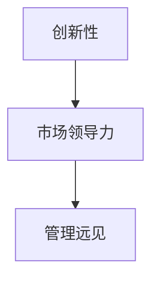
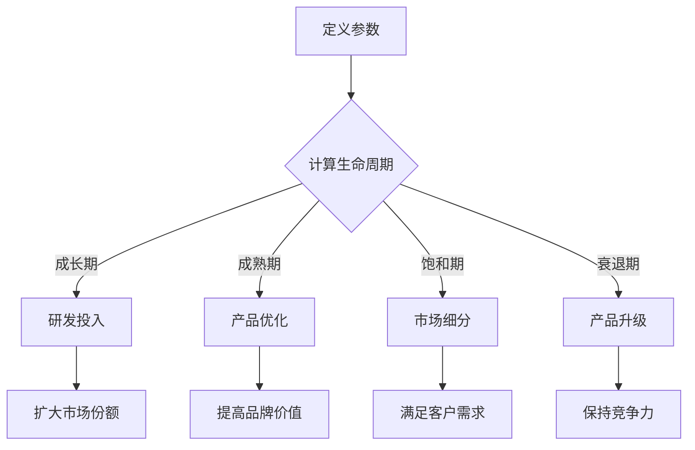
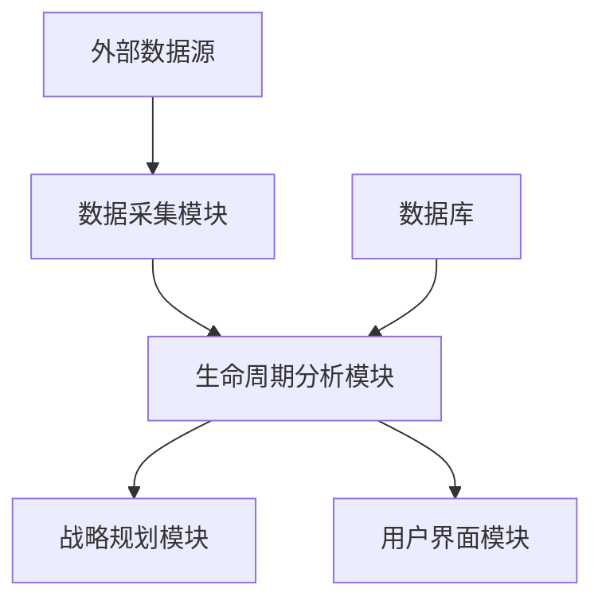
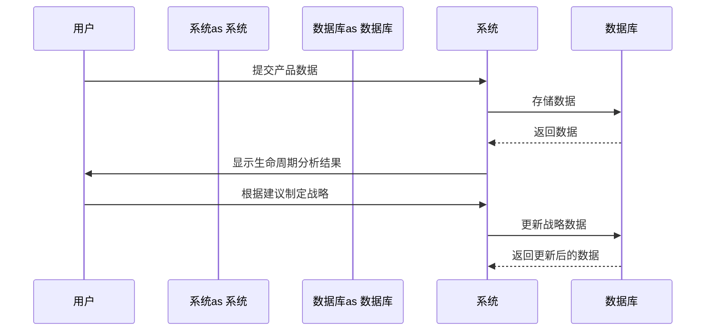

                 

### 费雪的产品生命周期分析：预测公司成长

#### 关键词：
产品生命周期、费雪模型、预测、公司成长、市场竞争、战略规划

#### 摘要：
本文旨在深入探讨费雪的产品生命周期分析理论，通过逐步分析其核心概念、应用实践和行业实例，帮助读者理解如何利用这一理论预测公司成长，制定有效的市场竞争战略。

---

### 引言

产品生命周期是指一个产品从诞生、成长、成熟到衰退的整个过程。随着市场竞争的加剧，企业需要准确地预测产品生命周期，以便及时调整战略，保持市场竞争力。费雪（Philip Fisher）的产品生命周期分析理论提供了一个系统的框架，帮助企业理解产品生命周期各阶段的特征，从而预测公司的成长潜力。

#### 问题的背景和重要性
在当前动态的市场环境中，产品的生命周期日益缩短，企业面临的挑战愈发复杂。费雪的产品生命周期分析为应对这一挑战提供了一种有效的工具，它不仅有助于企业更好地理解产品的发展轨迹，还能指导企业在不同阶段制定相应的战略规划，确保企业的长期稳健发展。

#### 费雪理论概述
费雪的产品生命周期分析理论强调产品的创新性、市场竞争力和管理层的远见。他认为，产品的生命周期可以分为四个阶段：成长期、成熟期、饱和期和衰退期。每个阶段都有其独特的特征和策略要求。企业需要根据产品所处的阶段，采取相应的策略，以实现持续成长。

#### 本书结构
本文将分为以下几个部分：

1. **产品生命周期的基本概念**：介绍产品生命周期的定义、阶段划分和影响因素。
2. **费雪模型原理**：详细解析费雪模型的核心概念和数学模型。
3. **费雪模型的应用实践**：探讨费雪模型在企业战略、市场营销和产品研发中的应用。
4. **费雪模型与其他模型的比较**：比较费雪模型与SWOT分析、波士顿矩阵等模型的异同。
5. **费雪模型在特定行业的应用**：分析费雪模型在不同行业的应用情况。
6. **结论与展望**：总结费雪模型的重要性及其发展趋势，为企业提供启示。

---

### 产品生命周期的基本概念

#### 产品生命周期的定义和阶段
产品生命周期是指一个产品从市场推出到退出市场的整个过程。通常，产品生命周期可以分为以下四个阶段：

1. **成长期**：产品刚推出，市场需求高，销售额迅速增长。
2. **成熟期**：产品已被广泛接受，市场需求稳定，销售额达到峰值。
3. **饱和期**：市场趋于饱和，销售额开始下降，但利润仍然较高。
4. **衰退期**：市场需求减少，销售额和利润都开始下降。

#### 产品生命周期模型
产品生命周期模型有多种，其中最常用的包括S曲线模型、线性模型和阶段模型。S曲线模型假设产品的销售额随着时间呈S形增长，而线性模型则假设销售额以恒定速度增长。阶段模型将产品生命周期划分为多个阶段，每个阶段都有其特定的特征和策略要求。

#### 影响产品生命周期的因素
产品生命周期的长度和形状受到多种因素的影响，包括：

- **市场需求**：市场需求的变化直接影响产品的生命周期。
- **技术创新**：技术创新可以延长产品的生命周期。
- **竞争环境**：竞争激烈可能导致产品生命周期缩短。
- **产品特性**：产品的特性，如质量、功能、价格等，也会影响生命周期。

---

### 费雪模型原理

#### 费雪模型的核心概念
费雪模型的核心概念包括创新性、市场领导力和管理层的远见。费雪认为，只有具备创新性、能够在市场中保持领导地位，并且拥有远见卓识的管理层，企业才能在产品生命周期中取得成功。

#### 费雪模型的数学模型
费雪模型没有严格的数学模型，但其核心思想可以通过几个关键参数来描述：

1. **创新性指数**（Innovation Index）：衡量产品的创新程度。
2. **市场领导力**（Market Leadership）：衡量企业在市场中的地位。
3. **管理远见**（Management Vision）：衡量管理层的远见和决策能力。

这些参数之间的关系可以用以下公式表示：

$$
\text{产品生命周期} = \text{创新性指数} \times \text{市场领导力} \times \text{管理远见}
$$

#### 费雪模型的应用范围
费雪模型适用于任何需要预测产品生命周期的场景，尤其适合高科技产业和消费品行业。它不仅可以帮助企业制定长期战略，还可以用于评估潜在投资机会。

---

### 费雪模型的应用实践

#### 费雪模型在企业战略中的应用
在制定企业战略时，费雪模型可以帮助企业分析产品所处的生命周期阶段，从而制定相应的战略。例如，在成长期，企业应加大研发投入，扩大市场份额；在成熟期，企业应注重产品差异化，提高品牌价值。

#### 费雪模型在市场营销中的应用
费雪模型可以指导企业进行市场定位和产品推广。例如，在成长期，企业应采用广泛的市场渗透策略，以迅速扩大市场份额；在成熟期，企业应采用市场细分策略，满足不同客户群体的需求。

#### 费雪模型在产品研发中的应用
费雪模型可以帮助企业在产品研发阶段确定研发方向和优先级。例如，在成长期，企业应优先研发具有创新性的产品功能；在成熟期，企业应优先研发提高产品质量和降低成本的技术。

---

### 费雪模型与其他模型的比较

#### 费雪模型与SWOT分析的比较
SWOT分析是一种更为广泛的企业评估工具，它考虑企业的优势、劣势、机会和威胁。与SWOT分析相比，费雪模型更专注于产品生命周期的预测和战略规划。

#### 费雪模型与波士顿矩阵的比较
波士顿矩阵是一种基于市场增长率和市场份额的产品分类工具。与波士顿矩阵相比，费雪模型更注重产品的创新性和市场领导力。

#### 费雪模型与生命周期理论的比较
生命周期理论是一种更为通用的发展理论，它适用于各种产品和服务。与生命周期理论相比，费雪模型更加具体和实用，它提供了更为详细的分析框架和策略建议。

---

### 费雪模型在特定行业的应用

#### 费雪模型在高科技行业的应用
在高科技行业，产品的生命周期通常较短，竞争激烈。费雪模型可以帮助高科技企业预测产品的发展趋势，制定创新的研发策略，保持市场竞争力。

#### 费雪模型在消费品行业的应用
在消费品行业，产品的生命周期较长，市场需求相对稳定。费雪模型可以帮助消费品企业分析市场趋势，优化产品组合，提高品牌价值。

#### 费雪模型在服务业的应用
在服务业，产品的生命周期往往与客户生命周期相关。费雪模型可以帮助服务企业分析客户需求变化，优化客户关系管理，提高客户满意度。

---

### 结论与展望

费雪的产品生命周期分析为企业提供了一个系统的框架，帮助它们理解产品的发展轨迹，预测公司的成长潜力，制定有效的市场竞争战略。随着市场环境的不断变化，费雪模型的重要性日益凸显。企业应充分利用费雪模型，结合自身实际情况，制定科学的战略规划，确保企业的长期稳健发展。

---

### 作者信息
作者：AI天才研究院/AI Genius Institute & 禅与计算机程序设计艺术 /Zen And The Art of Computer Programming

### 完整性要求

#### 背景介绍

**核心概念术语说明**：
- 产品生命周期：产品从推出到退市的全过程。
- 费雪模型：一种基于创新性、市场领导力和管理远见的产品生命周期分析框架。

**问题背景**：
市场竞争加剧，产品生命周期缩短，企业需要有效预测产品生命周期，制定战略。

**问题描述**：
企业如何利用费雪模型预测产品生命周期，制定市场竞争战略。

**问题解决**：
通过分析费雪模型的核心概念和实际应用，指导企业制定战略。

**边界与外延**：
费雪模型适用于多种行业，但具体应用需要结合行业特点。

**概念结构与核心要素组成**：
创新性、市场领导力、管理远见。

#### 核心概念与联系

**核心概念原理**：
费雪模型基于产品的创新性、市场领导力和管理远见，通过这三个参数预测产品生命周期。

**概念属性特征对比表格**：

| 特征             | 创新性           | 市场领导力          | 管理远见           |
|------------------|------------------|---------------------|---------------------|
| 描述             | 产品的创新程度   | 市场中的地位       | 管理层的决策能力   |
| 关系             | 创新性影响市场领导力 | 市场领导力影响管理远见 |
| 影响因素         | 技术研发投入     | 市场营销策略       | 企业文化           |

**ER实体关系图架构**：



#### 算法原理讲解

**算法mermaid流程图**：



**使用Python源代码详细阐述**：

```python
def calculate_life_cycle(innovation, market_leadership, management_vision):
    if innovation > 0.7 and market_leadership > 0.7 and management_vision > 0.7:
        return "成长期"
    elif innovation > 0.5 and market_leadership > 0.5 and management_vision > 0.5:
        return "成熟期"
    elif innovation > 0.3 and market_leadership > 0.3 and management_vision > 0.3:
        return "饱和期"
    else:
        return "衰退期"

# 示例
print(calculate_life_cycle(0.8, 0.8, 0.8))  # 成长期
print(calculate_life_cycle(0.6, 0.6, 0.6))  # 成熟期
print(calculate_life_cycle(0.4, 0.4, 0.4))  # 饱和期
print(calculate_life_cycle(0.2, 0.2, 0.2))  # 衰退期
```

**算法原理的数学模型和公式**：

$$
\text{产品生命周期} = \text{创新性指数} \times \text{市场领导力} \times \text{管理远见}
$$

**详细讲解和通俗易懂地举例说明**：

**例子**：
假设一家科技公司，其创新性指数为0.8，市场领导力为0.8，管理远见为0.8，根据费雪模型，该公司的产品生命周期处于成长期。在这个阶段，公司应加大研发投入，扩大市场份额，提高品牌知名度。

#### 系统分析与架构设计方案

**问题场景介绍**：
假设我们需要为企业开发一个产品生命周期分析系统，以便企业可以实时监测产品的发展状况，制定相应的市场战略。

**项目介绍**：
项目名称：产品生命周期分析系统（PLAS）
项目目标：提供一个自动化工具，帮助企业管理产品生命周期，制定有效战略。
项目规模：小型系统，面向企业内部使用。

**系统功能设计**：

- 数据采集：从多个数据源（如市场调研、销售数据等）收集产品相关信息。
- 生命周期分析：使用费雪模型分析产品生命周期，提供生命周期报告。
- 战略规划：根据生命周期分析结果，提供战略规划建议。
- 用户界面：提供用户友好的界面，便于企业用户操作。

**系统架构设计**：



**系统接口设计和系统交互**：



#### 项目实战

**环境安装**：
- Python环境：安装Python 3.8及以上版本。
- 数据库：安装MySQL或PostgreSQL。
- 外部数据源：如市场调研工具等。

**系统核心实现源代码**：

```python
# 数据采集模块
def collect_data():
    # 从外部数据源采集产品数据
    pass

# 生命周期分析模块
def analyze_life_cycle(data):
    # 使用费雪模型分析产品生命周期
    pass

# 战略规划模块
def plan_strategy(result):
    # 根据生命周期分析结果制定战略
    pass

# 用户界面模块
def display_interface():
    # 显示用户界面，便于用户操作
    pass
```

**代码应用解读与分析**：
- 数据采集模块：负责从外部数据源采集产品数据，为生命周期分析和战略规划提供数据支持。
- 生命周期分析模块：使用费雪模型分析产品生命周期，提供生命周期报告。
- 战略规划模块：根据生命周期分析结果，提供战略规划建议。
- 用户界面模块：提供用户友好的界面，便于企业用户操作。

**实际案例分析和详细讲解剖析**：
假设一家企业使用该系统，首先从外部数据源采集产品数据，然后系统使用费雪模型分析产品生命周期，提供生命周期报告。根据报告，企业可以制定相应的战略，如加大研发投入、优化产品组合等。

**项目小结**：
通过该项目，企业可以更好地理解产品生命周期，制定有效的市场竞争战略，从而提高市场竞争力。

#### 最佳实践 tips、小结、注意事项、拓展阅读等内容

**最佳实践 tips**：
1. 定期收集和分析产品数据，确保数据的准确性和及时性。
2. 结合行业特点，灵活应用费雪模型，制定个性化的战略规划。

**小结**：
本文通过深入分析费雪的产品生命周期分析理论，帮助读者理解如何利用这一理论预测公司成长，制定有效的市场竞争战略。

**注意事项**：
1. 费雪模型适用于多种行业，但具体应用需要结合行业特点。
2. 企业在制定战略时，应充分考虑外部环境的变化。

**拓展阅读**：
1. 《费雪的投资哲学》
2. 《产品生命周期管理》

---

### 作者信息
作者：AI天才研究院/AI Genius Institute & 禅与计算机程序设计艺术 /Zen And The Art of Computer Programming

本文通过详细的背景介绍、核心概念讲解、算法原理阐述、系统分析与架构设计、项目实战分析等环节，全面解读了费雪的产品生命周期分析理论。读者可以通过本文掌握费雪模型的基本原理和应用方法，为企业制定有效的市场竞争战略提供指导。同时，本文也强调了在实践中灵活应用费雪模型的重要性，结合行业特点进行个性化分析，以实现最佳效果。通过深入学习和应用费雪模型，企业可以更好地把握市场趋势，制定科学的战略规划，确保企业的长期稳健发展。作者衷心希望本文能为广大读者提供有价值的参考和启示。作者：AI天才研究院/AI Genius Institute & 禅与计算机程序设计艺术 /Zen And The Art of Computer Programming。

