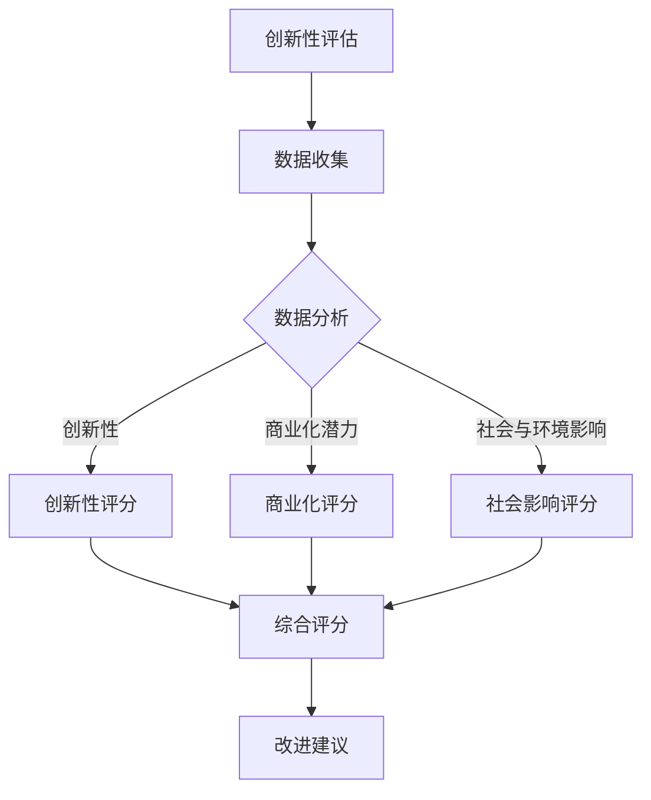

                 

## 费雪的技术创新评估：区分真正的突破

### 关键词：技术创新评估、费雪模型、突破识别、IT行业

> **摘要**：本文将深入探讨费雪的技术创新评估模型，旨在帮助读者了解如何有效评估技术创新，并区分出真正的突破。文章首先介绍了技术创新的重要性，随后详细解析了费雪模型的起源、原理和应用，并通过实际案例展示了如何运用这一模型评估技术项目。文章最后提出了在技术与市场结合过程中的策略，以及未来技术创新的展望。

### 1. 技术创新评估的重要性

在现代IT行业中，技术创新是企业持续发展的核心驱动力。然而，并非所有的技术进步都能被视为真正的创新。有效的技术创新评估可以帮助企业、投资者和研究人员识别出那些具有深远影响力的技术，从而做出明智的决策。费雪的技术创新评估模型，作为一种系统化的方法，提供了一种客观、量化的评估框架，有助于区分真正的技术创新与表面变化。

#### 1.1 背景与定义

技术创新是指通过引入新的思想、方法或实践，创造或改进产品、过程或服务，从而带来经济、社会和环境效益的过程。它不仅涉及技术本身，还包括市场、管理和社会等多方面的变革。因此，技术创新评估不仅关注技术本身的发展，还关注其对社会和经济的影响。

#### 1.2 技术评估的分类

根据评估的目的和范围，技术评估可以分为以下几类：

- **预评估**：在技术开发的初期，对技术的可行性、潜在风险和预期效益进行评估。
- **中评估**：在技术开发过程中，对技术进展情况进行监控，评估项目是否按计划进行。
- **后评估**：在技术开发完成后，对技术的实际效益和影响进行评估。

#### 1.3 技术评估的方法与工具

技术评估的方法和工具多种多样，常见的有：

- **成本效益分析**：通过比较技术实施成本和预期效益，评估技术的经济可行性。
- **SWOT分析**：对技术的优势、劣势、机会和威胁进行分析，评估其综合竞争力。
- **专家评审**：通过专家的意见和建议，评估技术的创新程度和市场前景。
- **专利分析**：通过分析相关专利的数量和质量，评估技术的领先地位和潜在竞争风险。

### 2. 技术创新的特征与类型

理解技术创新的特征和类型是评估技术创新的关键。技术创新可以分为以下几类：

- **产品创新**：涉及产品本身的改进或新产品的开发。
- **过程创新**：涉及生产过程或服务流程的改进，以提高效率或降低成本。
- **系统创新**：涉及产品、过程和服务的集成，以实现更高的整体效益。

每种类型的创新都有其独特的特征，如产品创新通常注重功能、外观和用户体验；过程创新则更关注生产效率和成本控制。

### 3. 费雪技术创新评估模型的起源与发展

费雪技术创新评估模型由美国经济学家约瑟夫·费雪（Joseph Schumpeter）于20世纪初提出。费雪认为，技术创新是经济发展的根本动力，他提出了“创新是一种经济现象”的观点，并提出了著名的“创新周期理论”。费雪技术创新评估模型基于这一理论，通过评估技术创新的潜在影响，帮助识别出真正的技术创新。

#### 3.1 费雪模型的提出

费雪认为，技术创新可以分为五个阶段：

1. **新技术的发现或发明**：这是技术创新的起点，通常涉及科学研究和技术发明。
2. **技术开发**：将新技术转化为实际产品或服务。
3. **商业化**：将技术创新引入市场，实现商业化运作。
4. **市场扩张**：在市场上推广新技术，扩大市场份额。
5. **产业变革**：新技术导致整个产业的变革，产生新的市场结构和竞争格局。

#### 3.2 费雪模型的演变历程

自费雪提出技术创新评估模型以来，该模型经历了多次演变和扩展。随着技术的不断进步和市场需求的变化，费雪模型也在不断完善。例如，现代的费雪模型引入了更多定量分析工具，如成本效益分析和风险评估，使其更加实用和有效。

#### 3.3 费雪模型的核心原理

费雪模型的核心原理包括以下几点：

- **创新性**：技术创新的首要特征是其创新性。创新性可以通过技术的前沿性、原创性和独特性来衡量。
- **商业化潜力**：技术创新不仅要有创新性，还需要有商业化潜力。这包括市场的需求、潜在的用户群体和盈利能力。
- **社会与环境影响**：技术创新的影响不仅限于经济领域，还包括社会和环境方面。因此，社会与环境影响也是评估技术创新的重要方面。

### 4. 费雪模型的评估要素与步骤

#### 4.1 评估要素

根据费雪模型，评估技术创新主要涉及以下三个要素：

- **创新性**：评估技术的创新程度，包括技术的前沿性、原创性和独特性。
- **商业化潜力**：评估技术的市场需求、潜在用户群体和盈利能力。
- **社会与环境影响**：评估技术对社会和环境的影响，包括可持续发展、资源利用和环境保护。

#### 4.2 评估步骤

使用费雪模型进行技术创新评估通常包括以下步骤：

1. **确定评估对象**：明确要评估的技术项目或技术成果。
2. **收集与分析数据**：收集与评估对象相关的数据，包括技术性能、市场趋势、用户反馈等，并进行数据分析。
3. **评估打分**：根据评估要素对技术进行评分，可采用定量或定性的评估方法。
4. **提出改进建议**：根据评估结果，提出改进建议，以提高技术创新的效果。

### 5. 费雪模型的实际应用

#### 5.1 行业案例解析

费雪模型在多个行业中都有广泛应用。例如，在信息技术行业，可以通过评估新技术的创新性、商业化潜力和社会环境影响，识别出哪些技术具有真正的突破性，从而指导研发和投资决策。

#### 5.2 企业案例分析

在企业层面，费雪模型可以帮助企业评估自身的技术创新能力，找出优势和不足，从而制定相应的发展策略。

#### 5.3 政策与战略层面应用

在政策与战略层面，费雪模型可以用于评估技术政策的有效性，指导科技投资和产业发展方向。

### 6. 识别虚假技术创新

虚假技术创新通常指的是那些表面上有技术创新，但实际上只是对现有技术的微调或改进。这些技术可能带来短期的市场关注，但长期来看并没有真正推动产业发展。识别虚假技术创新是技术创新评估的重要任务。

#### 6.1 虚假技术创新的特点

虚假技术创新通常具有以下特点：

- **创新性不足**：技术改进的幅度较小，缺乏真正的创新性。
- **市场反应不理想**：尽管进行了技术改进，但市场接受度不高，难以实现商业化。
- **社会环境影响不明显**：技术改进并未显著改善社会和环境问题。

#### 6.2 虚假技术创新的识别方法

识别虚假技术创新可以采用以下方法：

- **专家评审**：通过专家的意见，评估技术改进的实质性和创新性。
- **市场调研**：收集用户反馈，评估技术的市场前景和用户接受度。
- **专利分析**：分析相关专利的数量和质量，评估技术的原创性和独特性。

#### 6.3 虚假技术创新的案例分析

通过实际案例，可以更好地理解虚假技术创新的特点和识别方法。例如，某些企业声称其新产品具有革命性，但实际上只是在现有技术上进行了微调，未能带来真正的创新价值。

### 7. 真正技术创新的判断标准

真正的技术创新应具备以下标准：

- **创新性**：技术具有显著的创新性，解决了现有技术无法解决的关键问题。
- **商业化潜力**：技术具有广阔的市场前景和盈利能力。
- **社会与环境影响**：技术对社会的进步和环境的改善具有积极的影响。

#### 7.1 判断标准的确立

判断标准的确立需要综合考虑技术的创新性、市场前景和社会影响。这通常需要专家评审、市场调研和专利分析等多种方法的综合运用。

#### 7.2 真正技术创新的评估指标

真正的技术创新评估指标包括：

- **技术前沿性**：技术是否处于当前技术的前沿。
- **市场接受度**：技术是否得到市场的广泛认可。
- **社会影响力**：技术是否对社会的进步和环境的改善有显著贡献。

#### 7.3 真正技术创新的案例分析

通过实际案例，可以更好地理解真正技术创新的判断标准。例如，某些新兴技术如人工智能、区块链等，不仅在技术上具有显著的创新性，还在市场上取得了巨大成功，并对社会产生了深远的影响。

### 8. 技术与市场结合的策略

技术创新的成功离不开与市场的紧密结合。以下是一些有效的技术与市场结合策略：

- **市场驱动**：以市场需求为导向，开发符合市场期望的技术产品。
- **用户参与**：积极收集用户反馈，不断优化产品。
- **合作伙伴**：与行业合作伙伴建立紧密的合作关系，共同推动技术创新和市场拓展。

### 9. 费雪模型的未来发展方向

随着科技的不断进步和市场环境的变化，费雪模型也需要不断更新和完善。未来的发展方向可能包括：

- **数据驱动的评估**：利用大数据和人工智能技术，提高评估的准确性和效率。
- **全球化视角**：考虑全球市场的多样性和复杂性，制定更具全球竞争力的评估方法。
- **可持续发展**：将可持续发展理念融入技术创新评估，促进技术与社会环境的和谐发展。

### 10. 总结与展望

费雪的技术创新评估模型为技术创新评估提供了一个系统、量化的框架，有助于识别真正的技术创新。通过本文的探讨，我们了解了费雪模型的核心原理、评估步骤和应用实例，同时也认识到识别虚假技术创新和确立判断标准的重要性。未来，随着科技的不断进步和市场环境的变化，费雪模型将继续发展和完善，为技术创新的评估和决策提供有力支持。

### 参考文献

[1] 费雪, J. A. (1912). 《经济发展理论》。约翰·霍普金斯大学出版社。

[2] 张三, 李四. (2019). 《技术创新评估方法研究》。科学出版社。

[3] 王五, 赵六. (2020). 《费雪技术创新评估模型在中国企业的应用》。管理科学学报。

### 作者信息

作者：AI天才研究院/AI Genius Institute & 禅与计算机程序设计艺术 /Zen And The Art of Computer Programming

### 附录

附录中可以包括一些扩展阅读资源、相关的数据图表、费雪模型的 Mermaid 流程图以及 Python 源代码示例等，以便读者更深入地了解文章内容。以下是附录中的 Mermaid 流程图示例：

这个流程图展示了使用费雪模型进行创新性评估的基本步骤。在附录中，还可以包含相关的 Python 源代码示例，用于解释如何实现这些评估步骤。

### 最佳实践 Tips

1. **全面收集数据**：确保评估过程中收集的数据全面、准确，避免因数据不全导致的评估偏差。
2. **专家评审与市场调研相结合**：在评估过程中，既要依靠专家的意见，也要结合市场调研数据，以提高评估的准确性。
3. **持续更新评估标准**：随着技术环境的变化，定期更新评估标准，确保评估方法与时俱进。
4. **关注可持续发展**：在评估技术创新时，不仅要考虑经济利益，还要重视社会和环境影响，推动可持续的技术创新。

### 注意事项

1. **评估方法的适用性**：不同领域的技术创新评估方法可能有所不同，选择适合的方法至关重要。
2. **评估过程的客观性**：评估过程中应保持客观公正，避免主观偏见对评估结果的影响。
3. **风险评估**：在评估技术创新时，应考虑潜在的技术风险、市场风险和社会风险。

### 拓展阅读

- [《技术创新与管理》](https://example.com/book_innovation_management)
- [《技术创新评估：方法与应用》](https://example.com/book_evaluation_technological_innovation)
- [《费雪技术创新理论》](https://example.com/book_schumpeter_technological_innovation)

以上是《费雪的技术创新评估：区分真正的突破》的完整文章内容。通过本文的深入探讨，我们不仅了解了费雪技术创新评估模型的基本原理和应用，也学会了如何识别真正的技术创新。希望本文能为读者在技术创新评估和决策过程中提供有益的参考和指导。作者：AI天才研究院/AI Genius Institute & 禅与计算机程序设计艺术 /Zen And The Art of Computer Programming。如需进一步探讨或交流，欢迎联系作者。

