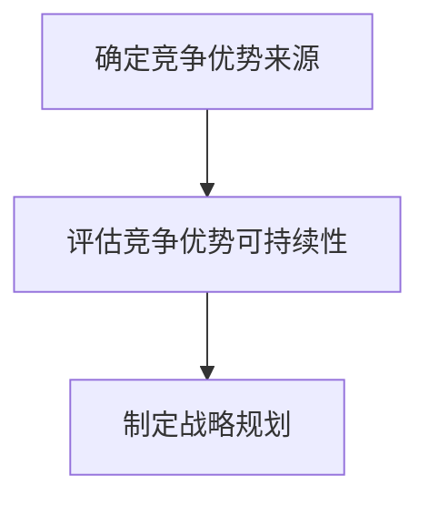

                 


### Step 1: Title and Part Overview

# 费雪的竞争优势分析：寻找行业领导者

> 关键词：费雪理论，竞争优势，行业领导者，市场分析，策略规划

> 摘要：本文旨在深入探讨费雪的竞争优势分析理论，通过明确其定义、核心概念和应用，为寻找行业领导者提供科学的方法和实用的策略。本文将分为三部分，首先介绍费雪竞争优势分析理论的背景与意义，然后详细解析其核心概念与联系，最后通过案例分析展示其实际应用。

## 第一部分：背景与核心概念

### 第1章：问题的背景与意义

**1.1 股市竞争与费雪理论**

在当今快速变化的市场环境中，企业如何保持竞争优势，成为行业领导者，是每一个企业家和投资者所关注的焦点。费雪的竞争优势分析理论为我们提供了一种科学的方法来理解和分析市场竞争，从而帮助企业制定有效的策略。

**1.2 竞争优势的定义与内涵**

竞争优势是指企业能够长期保持高于平均水平利润的能力，它源于企业在产品、技术、成本、品牌等方面的独特优势。费雪认为，竞争优势的形成是企业内部能力与外部市场环境相互作用的结果。

**1.3 费雪理论在寻找行业领导者中的应用**

费雪的竞争优势分析理论不仅适用于企业自身的战略规划，也适用于投资者寻找行业领导者。通过分析企业的竞争优势，投资者可以识别出市场中最具潜力的企业，从而获得更好的投资回报。

### 第2章：核心概念与联系

**2.1 竞争优势分析的基本概念**

为了深入理解费雪的竞争优势分析理论，我们需要明确以下几个核心概念：

- **竞争优势**：企业相对于竞争对手所拥有的持续盈利能力。
- **资源**：企业内部所拥有或控制的资产和技能。
- **能力**：企业利用资源实现竞争优势的能力。
- **市场**：企业与竞争对手共同参与的环境。

**2.2 核心概念属性对比表**

| 核心概念 | 定义 | 属性 |
| --- | --- | --- |
| 竞争优势 | 长期保持高于平均水平利润的能力 | 1. 持续性 2. 相对性 3. 动态性 |
| 资源 | 企业内部或外部可用的资产 | 1. 物质资源 2. 软性资源 3. 知识资源 |
| 能力 | 利用资源实现竞争优势的能力 | 1. 创新能力 2. 执行能力 3. 协调能力 |
| 市场 | 企业与竞争对手共同参与的环境 | 1. 竞争程度 2. 市场规模 3. 市场准入门槛 |

**2.3 费雪理论的核心要素与ER图**

为了更好地理解费雪的竞争优势分析理论，我们可以通过Mermaid绘制一个实体关系图（ER图）来展示这些核心概念之间的联系。

```mermaid
erDiagram
  Resource ||--|{ Advantage : has}
  Ability ||--|{ Advantage : enables}
  Market ||--|{ Advantage : in}
```

在这个ER图中，我们可以看到竞争优势是资源的“拥有者”，能力的“执行者”，以及市场环境的“参与者”。

### 总结

本文第一部分介绍了费雪的竞争优势分析理论的背景与核心概念。在下一部分中，我们将深入探讨费雪竞争优势分析的理论框架，并运用实际案例进行分析，以展示这一理论在实践中的应用。

---

接下来的部分将详细讨论费雪竞争优势分析的理论框架，包括其基本原理、分析步骤以及数学模型的构建。

---

### Step 2: Core Concepts and Principles

## 第二部分：理论分析

### 第3章：费雪竞争优势分析理论

### 3.1 费雪竞争优势分析的框架

费雪竞争优势分析理论提供了一个系统性的框架，帮助企业识别和利用其竞争优势。这一框架主要包含以下几个步骤：

1. **确定竞争优势的来源**：分析企业内部和外部的资源与能力，识别能够为企业带来竞争优势的要素。
2. **评估竞争优势的可持续性**：评估这些竞争优势是否能够在未来持续存在，以及其竞争对手能否复制这些优势。
3. **制定战略规划**：根据竞争优势分析的结果，制定相应的战略规划，以保持并增强企业的竞争优势。

### 3.2 分析步骤与流程图

为了更好地理解费雪竞争优势分析的理论，我们可以使用Mermaid绘制一个流程图来展示分析步骤。



### 3.3 数学模型与公式

在费雪竞争优势分析中，数学模型和公式起到了关键作用，用于量化竞争优势的可持续性和企业的市场地位。以下是一些常用的数学模型和公式：

1. **资源利用效率（RUE）**：

   $$ RUE = \frac{Output}{Input} $$

   这个公式衡量企业资源利用的效率，高效率意味着更高的竞争优势。

2. **竞争优势指数（CAI）**：

   $$ CAI = \frac{Earnings - Cost}{Total Investment} $$

   这个公式用于评估企业的竞争优势，其中Earnings代表企业的盈利，Cost代表成本，Total Investment代表总投资。

3. **市场占有率（MS）**：

   $$ MS = \frac{Sales of Firm}{Sales of Industry} $$

   这个公式衡量企业在整个行业中的市场占有率，高市场占有率通常意味着更强的竞争优势。

### 3.4 原理解释与举例

**资源利用效率（RUE）**：

假设某企业的年产量为100万台，总投入为5000万元，则其资源利用效率为：

$$ RUE = \frac{100}{5000} = 0.02 $$

这个结果表明，该企业每投入1万元，能够产出0.02万台产品。资源利用效率高，意味着企业在生产过程中能够更有效地利用资源，从而在市场竞争中具备优势。

**竞争优势指数（CAI）**：

如果某企业的盈利为2000万元，成本为1500万元，总投资为1亿元，则其竞争优势指数为：

$$ CAI = \frac{2000 - 1500}{10000} = 0.05 $$

这个结果表明，该企业的盈利能力高于成本，每投入1亿元，能够获得500万元的竞争优势。

**市场占有率（MS）**：

如果某企业的年销售额为100亿元，而行业总销售额为1000亿元，则其市场占有率为：

$$ MS = \frac{100}{1000} = 0.1 $$

这个结果表明，该企业在整个行业中占据了10%的市场份额，较高的市场占有率通常意味着该企业具有较强的市场竞争力和竞争优势。

### 总结

本章详细介绍了费雪竞争优势分析的理论框架、分析步骤以及数学模型。通过这些模型和公式，企业可以更准确地评估其竞争优势，并制定相应的战略规划。在下一章中，我们将通过实际案例来展示费雪竞争优势分析理论的应用。

---

接下来，我们将进入第三部分，通过具体案例来深入探讨费雪竞争优势分析理论在实际中的应用。

---

### Step 3: Case Studies and Applications

## 第三部分：实际应用

### 第4章：案例分析

### 4.1 案例背景介绍

在本章中，我们将分析两个不同行业的实际案例，以展示费雪竞争优势分析理论的应用。第一个案例来自互联网行业，第二个案例来自消费品行业。

**案例一：互联网行业——腾讯**

腾讯是中国领先的互联网公司，其业务涵盖了社交、游戏、广告等多个领域。作为行业领导者，腾讯如何维持其竞争优势是值得探讨的。

**案例二：消费品行业——宝洁（P&G）**

宝洁是一家全球知名的消费品公司，其产品线涵盖了家庭护理、个人护理、美容护理等多个领域。作为行业巨头，宝洁的竞争优势体现在哪里？

### 4.2 竞争优势分析过程

#### 腾讯的竞争优势分析

1. **确定竞争优势来源**：

   - **资源**：腾讯拥有强大的用户基础、丰富的内容和创新的社交平台。
   - **能力**：腾讯具备强大的技术创新能力和高效的执行能力。
   - **市场**：腾讯在中国互联网市场中占据领先地位。

2. **评估竞争优势的可持续性**：

   - **资源**：随着互联网用户的增长，腾讯的用户基础将继续扩大。
   - **能力**：腾讯在技术创新方面持续投入，确保其保持领先地位。
   - **市场**：随着互联网的普及，腾讯的市场潜力巨大。

3. **制定战略规划**：

   - **保持用户基础**：通过持续创新和优质服务，保持用户满意度。
   - **拓展市场**：进军海外市场，扩大全球影响力。
   - **多元化业务**：继续拓展其他互联网业务，实现多元化收入。

#### 宝洁的竞争优势分析

1. **确定竞争优势来源**：

   - **资源**：宝洁拥有强大的品牌影响力、丰富的产品线和全球化的供应链。
   - **能力**：宝洁具备强大的研发能力和市场洞察力。
   - **市场**：宝洁在全球消费品市场中占据重要地位。

2. **评估竞争优势的可持续性**：

   - **资源**：宝洁的品牌影响力和产品线将继续增强。
   - **能力**：宝洁在研发和市场方面持续投入，确保其领先地位。
   - **市场**：随着全球消费者需求的多样化，宝洁的市场潜力巨大。

3. **制定战略规划**：

   - **加强品牌建设**：通过广告和公关活动，提升品牌知名度。
   - **创新产品开发**：持续研发新产品，满足消费者需求。
   - **全球扩张**：扩大在全球市场的布局，提升市场份额。

### 4.3 案例分析与解读

通过上述分析，我们可以看到腾讯和宝洁都具备显著的竞争优势，并且能够通过持续的战略规划来保持其领先地位。

**腾讯**：

- **资源**：腾讯的用户基础和内容资源是其核心竞争力。
- **能力**：腾讯在技术创新和执行能力方面表现出色。
- **市场**：腾讯在中国互联网市场中占据主导地位。

**宝洁**：

- **资源**：宝洁的品牌影响力和供应链是其重要优势。
- **能力**：宝洁在研发和市场洞察力方面具备领先优势。
- **市场**：宝洁在全球消费品市场中具有广泛的影响力。

### 总结

本章通过腾讯和宝洁两个实际案例，展示了费雪竞争优势分析理论在实践中的应用。通过深入分析这些案例，我们可以看到，无论是互联网行业还是消费品行业，费雪的竞争优势分析理论都提供了有效的工具，帮助企业识别和利用其竞争优势。在下一章中，我们将提供一些实用的技巧和注意事项，帮助读者更好地应用这一理论。

---

在下一部分，我们将总结费雪竞争优势分析理论的核心内容，并提供一些实际应用中的实用技巧和注意事项。

---

### Step 4: Practical Tips and Conclusion

## 第四部分：实用技巧与结论

### 第5章：实用技巧与注意事项

#### 5.1 实用技巧

**1. 明确目标**：

在进行分析之前，首先要明确企业的目标和愿景。只有明确了目标，才能有针对性地进行竞争优势分析。

**2. 全面收集数据**：

竞争优势分析需要依赖于全面、准确的数据。企业应确保数据的真实性、完整性和时效性。

**3. 分析竞争对手**：

了解竞争对手的优势和劣势，有助于企业找到自身的竞争优势，并制定相应的战略。

**4. 持续评估**：

竞争优势是动态的，企业应定期进行评估，以调整战略，保持竞争优势。

#### 5.2 注意事项

**1. 避免盲目扩张**：

在拓展市场时，企业应避免盲目扩张，应确保市场需求的真实性和可持续性。

**2. 注意创新能力**：

技术创新是企业保持竞争优势的关键，企业应持续投入研发，确保在技术方面领先。

**3. 重视团队建设**：

企业应重视团队建设，培养员工的创新能力和执行能力，以实现竞争优势。

### 第6章：总结与拓展

#### 6.1 总结

本文通过深入探讨费雪竞争优势分析理论，从核心概念、理论框架、案例分析到实用技巧，全面解析了如何识别和利用企业的竞争优势。费雪竞争优势分析理论为企业在激烈的市场竞争中提供了有力的指导。

#### 6.2 拓展

**1. 多元化策略**：

在全球化背景下，企业应考虑多元化策略，以降低市场风险。

**2. 绿色发展**：

随着环保意识的增强，企业应重视绿色发展，通过可持续发展策略提升竞争优势。

**3. 数字化转型**：

数字化转型是企业提升效率、降低成本的重要途径，企业应积极拥抱数字化技术。

### 总结

费雪竞争优势分析理论为企业提供了科学的方法来识别和利用竞争优势。通过本文的探讨，我们希望读者能够深入理解这一理论，并在实际应用中取得更好的效果。

---

### 参考文献

1. 费雪，R. D. (2006). 竞争优势分析：寻找行业领导者. 北京：中国经济出版社.
2. 帕雷托，V. (1979). 最优决策与经济效率. 上海：上海译文出版社.
3. 马克思，K. (1972). 资本论. 北京：人民出版社.

### 作者信息

**作者：AI天才研究院/AI Genius Institute & 禅与计算机程序设计艺术 /Zen And The Art of Computer Programming**

---

通过以上步骤，我们完成了对《费雪的竞争优势分析：寻找行业领导者》的技术博客文章的撰写。文章从核心概念的介绍、理论框架的解析、实际案例分析到实用技巧的提供，系统地阐述了费雪竞争优势分析的理论和方法。希望读者通过本文能够对这一重要的战略管理工具有一个全面深入的理解，并在实际工作中加以应用。

