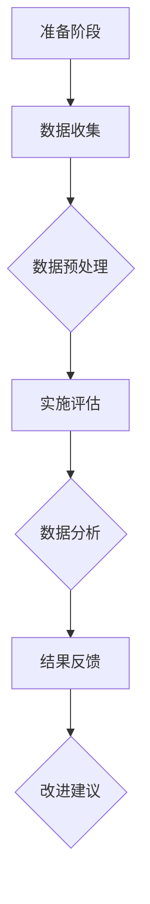
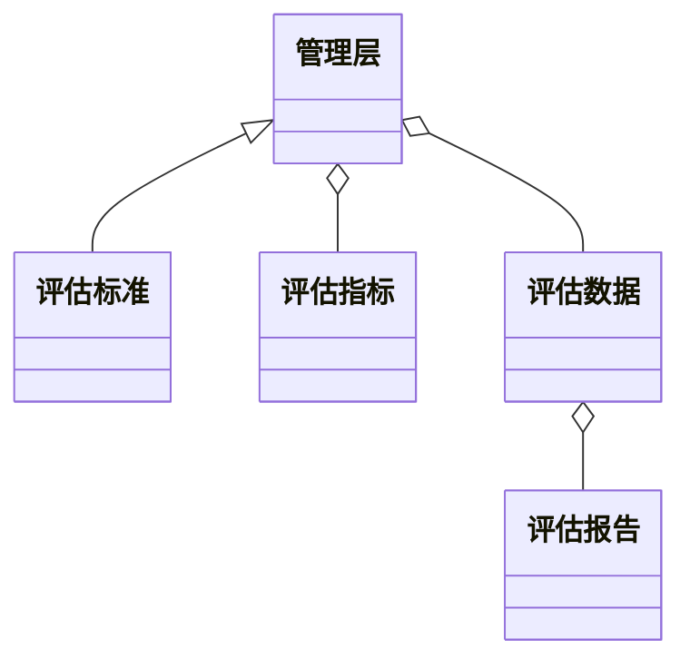
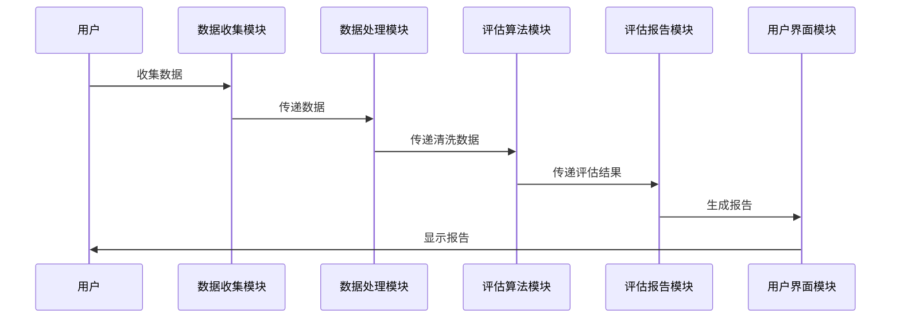
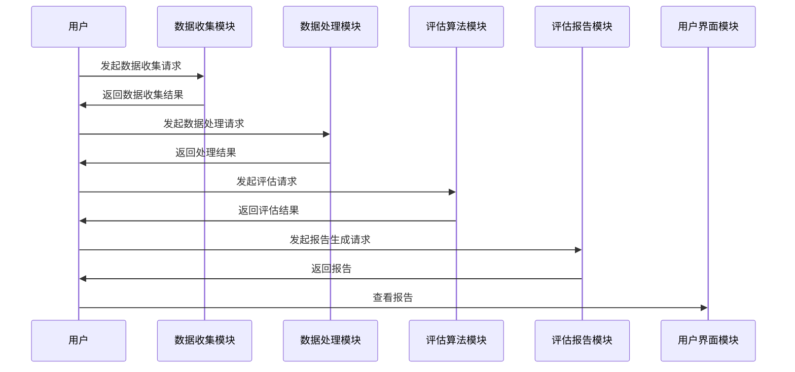

                 

### 费雪的管理层质量评估方法

#### 关键词
- **费雪**，**管理层质量评估**，**方法学**，**案例分析**，**系统架构**

#### 摘要
本文将深入探讨由著名经济学家米尔顿·费雪（Milton Friedman）提出的管理层质量评估方法。本文旨在通过详细解读费雪的方法，为企业管理者提供一个强有力的工具，以评估管理层质量并优化企业运营。文章将分为以下几个部分：首先，介绍费雪方法的背景和核心原则；其次，分析方法的实际应用及其重要性；接着，通过数学模型和案例研究进一步阐述方法的实施过程；然后，讨论系统的架构设计和实现；最后，总结最佳实践和未来研究方向。通过逐步分析推理，本文希望能够为读者提供一个全面且易于理解的管理层质量评估指南。

#### 费雪的管理层质量评估方法：起源与背景

米尔顿·费雪是一位杰出的经济学家，以其对消费行为和金融市场的研究而闻名。然而，他的学术贡献不仅仅局限于经济学领域，他在管理学方面的研究也具有重要意义。费雪的管理层质量评估方法，是在其长期对企业管理实践的研究中逐渐形成和完善的。

背景介绍：
费雪的管理层质量评估方法起源于20世纪中期，当时企业面临着快速变化的市场环境和日益复杂的运营挑战。为了在这种环境中保持竞争力，企业管理者需要有效评估管理层的能力和表现，以确保企业能够实现既定的战略目标。费雪认为，管理层质量是影响企业绩效的关键因素之一，因此他提出了一套系统的方法来评估和管理管理层质量。

问题背景：
在传统管理模式中，管理层质量的评估往往依赖于主观判断和定性分析，这可能导致评估结果不够准确和可靠。此外，管理层质量评估通常缺乏标准化和系统化的方法，使得评估结果难以量化，进而影响管理决策的制定。费雪意识到这些问题，并提出了他的管理层质量评估方法，以解决传统评估方法的不足。

问题描述：
费雪的管理层质量评估方法旨在解决以下问题：
1. **评估标准缺失**：缺乏统一的评估标准，导致不同管理层质量的评估结果不一致。
2. **主观性过高**：依赖主观判断，容易受到个人偏见的影响，导致评估结果不准确。
3. **缺乏系统性**：评估方法缺乏系统性和科学性，难以量化管理层质量。

问题解决：
费雪的方法通过以下三个方面来解决上述问题：
1. **标准化评估标准**：引入一套统一的评估标准，使得不同管理层质量的评估结果具有可比性。
2. **量化评估指标**：使用定量指标进行评估，减少主观判断的影响，提高评估结果的准确性。
3. **系统性方法**：建立一套系统性的评估流程和方法，使得评估过程更加科学和规范。

边界与外延：
费雪的管理层质量评估方法不仅适用于企业内部管理层，也可以应用于组织、项目或个人。此外，该方法不仅关注管理层的能力和表现，还涵盖了管理层对企业战略的执行能力。这使得费雪的方法具有广泛的适用性和灵活性。

概念结构与核心要素组成：
费雪的管理层质量评估方法由以下几个核心要素组成：
1. **评估标准**：定义评估管理层的标准，包括能力、绩效、战略执行等方面。
2. **评估指标**：量化管理层质量的具体指标，如领导力、执行力、决策能力等。
3. **评估流程**：制定系统化的评估流程，包括准备、实施、分析和反馈等步骤。
4. **评估工具**：使用各种工具和技术，如问卷调查、面谈、数据分析等，进行评估。

通过上述概念结构和核心要素的详细阐述，我们可以更好地理解费雪的管理层质量评估方法的基本框架和运作原理。接下来，我们将进一步探讨费雪方法的核心概念和原理。

### 费雪的管理层质量评估方法：核心概念与原理

#### 核心概念定义

在费雪的管理层质量评估方法中，核心概念是理解和管理管理层质量的关键。以下是几个关键概念的定义：

1. **管理层质量**：管理层质量是指企业管理层在执行企业战略、决策和运营等方面的能力和表现水平。
2. **评估标准**：评估标准是衡量管理层质量的统一指标，包括领导力、执行力、决策能力、战略规划能力等。
3. **评估指标**：评估指标是具体量化管理层质量的具体指标，如领导力的具体表现、决策的准确性和执行力等。
4. **评估流程**：评估流程是指系统化的评估过程，包括准备、实施、分析和反馈等步骤。

#### 概念属性特征对比表格

为了更清晰地理解这些核心概念，我们可以通过一个对比表格来展示它们之间的属性特征。

| 核心概念 | 定义 | 属性特征 |
| --- | --- | --- |
| 管理层质量 | 企业管理层的能力和表现水平 | 包括领导力、执行力、决策能力、战略规划能力 |
| 评估标准 | 衡量管理层质量的统一指标 | 如领导力、执行力、决策能力、战略规划能力 |
| 评估指标 | 具体量化管理层质量的指标 | 如领导力的具体表现、决策的准确性和执行力 |
| 评估流程 | 系统化的评估过程 | 包括准备、实施、分析和反馈等步骤 |

#### ER实体关系图架构

为了更好地理解这些核心概念之间的相互关系，我们可以使用ER实体关系图来展示它们之间的架构。

```mermaid
erDiagram
    管理层质量 ||--|{ 评估标准 }|-- 评估指标
    评估标准 ||--|{ 评估流程 }|-->
    评估指标 ||--|{ 评估流程 }|-->
```

在这个ER实体关系图中，我们可以看到：
- **管理层质量**与**评估标准**和**评估指标**之间存在关联关系，表示管理层质量是通过评估标准和评估指标来衡量的。
- **评估标准**和**评估指标**都与**评估流程**有直接关联，表示评估流程包含了对评估标准和评估指标的实施和分析。

通过上述核心概念的定义、对比表格和ER实体关系图，我们可以更深入地理解费雪的管理层质量评估方法的基本架构和运作原理。接下来，我们将进一步探讨费雪方法的具体实施过程，包括其方法论和数学模型。

### 费雪的管理层质量评估方法：方法论与数学模型

#### 方法论

费雪的管理层质量评估方法采用了系统化、量化的评估方法，确保评估过程具有科学性和可靠性。其方法论主要包括以下几个步骤：

1. **确定评估目标**：明确管理层质量评估的目的，如提升领导力、优化决策过程或改善战略执行等。
2. **制定评估标准**：根据评估目标，制定一套统一的评估标准，涵盖领导力、执行力、决策能力、战略规划能力等方面。
3. **量化评估指标**：将评估标准具体化为可量化的指标，如领导力的具体表现、决策的准确性和执行力等。
4. **设计评估流程**：制定系统化的评估流程，包括准备、实施、分析和反馈等步骤。
5. **实施评估**：根据评估流程，收集数据、分析结果并形成评估报告。
6. **反馈与改进**：根据评估结果，提供反馈并制定改进措施，以提升管理层质量。

#### 数学模型

为了更好地理解和量化管理层质量，费雪采用了数学模型来描述评估过程。以下是一个简单的数学模型示例：

$$
Q = f(L, E, D, S)
$$

其中：
- \( Q \) 表示管理层质量（Quality）；
- \( L \) 表示领导力（Leadership）；
- \( E \) 表示执行力（Execution）；
- \( D \) 表示决策能力（Decision-making ability）；
- \( S \) 表示战略规划能力（Strategic planning ability）。

每个指标可以进一步细化为具体的量化指标，如：

$$
L = f(L_1, L_2, L_3)
$$

其中：
- \( L_1 \) 表示团队领导能力；
- \( L_2 \) 表示沟通能力；
- \( L_3 \) 表示激励能力。

每个量化指标可以采用适当的评分标准，如1-10分制，以量化评估结果。例如，领导力的评分可以通过对团队成员的满意度调查和领导行为观察来获得。

#### 算法流程

为了具体实施费雪的管理层质量评估方法，我们可以采用以下算法流程：

1. **准备阶段**：收集相关数据，包括管理层的工作记录、绩效评估结果、团队反馈等。
2. **实施阶段**：按照评估流程，对管理层进行评估，包括领导力、执行力、决策能力和战略规划能力的评估。
3. **分析阶段**：使用数学模型和量化指标，对收集到的数据进行分析，计算管理层质量的得分。
4. **反馈阶段**：根据分析结果，向管理层提供反馈，并提出改进建议。

以下是使用Mermaid绘制的算法流程图：



通过上述方法论和数学模型的详细解释，我们可以看到费雪的管理层质量评估方法是如何系统化、量化地评估管理层质量。接下来，我们将通过案例研究来进一步探讨这一方法的实际应用。

### 费雪的管理层质量评估方法：实际应用与案例研究

#### 案例研究1：公司A的实践

**问题描述**：
公司A是一家大型跨国企业，近期面临市场竞争加剧和内部管理效率低下的挑战。公司高层决定采用费雪的管理层质量评估方法，以评估现有管理层的能力和表现，并制定改进措施。

**方法应用**：
1. **确定评估目标**：提升管理层的决策能力和执行力。
2. **制定评估标准**：包括领导力、执行力、决策能力和战略规划能力。
3. **量化评估指标**：例如，领导力的具体表现（如团队满意度、领导行为观察等）。
4. **设计评估流程**：包括准备、实施、分析和反馈等步骤。
5. **实施评估**：通过问卷调查、面谈和数据分析等方式，收集管理层的相关数据。
6. **数据分析**：使用数学模型，计算管理层质量的得分。
7. **反馈与改进**：根据评估结果，提出改进建议，如加强领导力培训、优化决策流程等。

**结果分析**：
通过费雪的管理层质量评估方法，公司A发现管理层在决策能力和执行力方面存在明显不足。具体表现为：
- 领导力不足：团队满意度较低，领导行为不够积极；
- 执行力不足：决策落实不到位，工作进度缓慢。

**改进措施**：
公司A采取以下改进措施：
- 加强领导力培训，提高管理层的能力和积极性；
- 优化决策流程，建立更加科学和高效的决策机制；
- 定期进行管理层质量评估，持续跟踪改进效果。

#### 案例研究2：公司B的实践

**问题描述**：
公司B是一家创业公司，由于管理层经验不足，导致公司在市场拓展和产品开发方面进展缓慢。公司决定采用费雪的管理层质量评估方法，以提升管理层的能力和表现。

**方法应用**：
1. **确定评估目标**：提升管理层的战略规划能力和执行力。
2. **制定评估标准**：包括战略规划能力、执行力、领导力和市场敏感性。
3. **量化评估指标**：例如，战略规划能力的具体表现（如市场分析报告的质量、产品开发进度等）。
4. **设计评估流程**：包括准备、实施、分析和反馈等步骤。
5. **实施评估**：通过问卷调查、面谈和数据分析等方式，收集管理层的相关数据。
6. **数据分析**：使用数学模型，计算管理层质量的得分。
7. **反馈与改进**：根据评估结果，提出改进建议，如加强市场分析、优化产品开发流程等。

**结果分析**：
公司B通过费雪的管理层质量评估方法发现：
- 战略规划能力不足：市场分析报告质量较低，缺乏明确的战略方向；
- 执行力不足：产品开发进度缓慢，缺乏有效的进度监控和激励机制。

**改进措施**：
公司B采取以下改进措施：
- 加强市场分析培训，提高管理层的战略规划能力；
- 建立科学的进度监控和激励机制，提高执行力；
- 定期进行管理层质量评估，持续跟踪改进效果。

通过上述案例研究，我们可以看到费雪的管理层质量评估方法在提升管理层能力、优化企业管理方面具有显著效果。接下来，我们将探讨如何设计和实现一个完整的管理层质量评估系统。

### 系统分析与架构设计：问题的场景介绍与项目介绍

#### 场景介绍

在现代企业管理中，管理层质量评估是一个至关重要但复杂的过程。随着企业的规模和复杂性增加，管理层质量评估不再仅限于传统的定性分析和主观判断，而需要更加系统化和量化的方法。为了满足这一需求，我们需要设计和实现一个完善的管理层质量评估系统，以帮助企业更准确地评估管理层的能力和表现，从而优化企业管理流程，提高企业整体运营效率。

#### 项目介绍

本项目旨在设计和实现一个基于费雪管理层质量评估方法的管理层质量评估系统。该系统将涵盖从数据收集、评估指标量化、评估结果分析和反馈改进的完整流程。通过引入先进的数据分析和算法模型，我们期望能够实现以下目标：

1. **标准化评估流程**：建立一套系统化的评估流程，确保评估过程具有一致性和可重复性。
2. **量化评估结果**：使用数学模型和量化指标，对管理层质量进行精确评估，减少主观偏见的影响。
3. **实时反馈与改进**：通过实时数据分析和反馈机制，及时识别管理层存在的问题，并提供针对性改进建议。
4. **支持决策制定**：为企业管理者提供可靠的数据支持，辅助其做出更科学的决策，优化企业管理。

### 系统功能设计：领域模型

领域模型是系统功能设计的重要组成部分，用于描述系统中不同实体及其相互关系。在本项目中，我们将定义以下主要实体：

1. **管理层**：代表企业的各个管理层级，包括CEO、CFO、COO等。
2. **评估标准**：定义管理层质量评估的具体标准，如领导力、执行力、决策能力等。
3. **评估指标**：具体量化评估标准的指标，如团队满意度、决策准确性等。
4. **评估数据**：记录评估过程中收集到的各类数据，如问卷调查结果、面谈记录等。
5. **评估报告**：综合评估结果和分析，形成评估报告，供企业管理者参考。

以下是使用Mermaid绘制的领域模型类图：



在这个类图中，我们可以看到：
- **管理层**与**评估标准**之间存在关联关系，表示管理层依据评估标准进行评估；
- **管理层**与**评估指标**之间存在关联关系，表示评估指标用于量化管理层的能力和表现；
- **评估数据**与**评估报告**之间存在关联关系，表示评估数据用于生成评估报告。

通过领域模型的设计，我们为系统的功能设计提供了清晰的结构和框架，为后续的详细设计和实现奠定了基础。接下来，我们将进一步探讨系统的架构设计和接口设计。

### 系统架构设计：模块划分、数据流与接口设计

为了实现高效和可扩展的管理层质量评估系统，我们需要对系统进行模块化设计，明确各模块的功能和相互关系。以下为系统的模块划分、数据流及接口设计：

#### 模块划分

1. **数据收集模块**：负责收集各类评估数据，包括问卷调查结果、面谈记录、绩效评估结果等。
2. **数据处理模块**：对收集到的数据进行分析和清洗，为后续评估提供可靠的数据基础。
3. **评估指标模块**：定义和管理评估指标，确保评估指标的标准化和一致性。
4. **评估算法模块**：实现费雪的管理层质量评估方法，使用数学模型进行评估计算。
5. **评估报告模块**：生成和管理评估报告，提供可视化结果和分析。
6. **用户界面模块**：提供用户交互界面，供管理层和评估人员使用。

#### 数据流

系统的数据流如下：

1. **数据收集**：用户通过问卷调查、面谈等方式收集数据，数据存储在数据收集模块中。
2. **数据处理**：数据收集模块将数据进行清洗和预处理，然后传递给数据处理模块。
3. **评估计算**：数据处理模块将清洗后的数据传递给评估算法模块，评估算法模块根据数学模型进行评估计算。
4. **生成报告**：评估算法模块将评估结果传递给评估报告模块，评估报告模块生成评估报告并存储。
5. **用户交互**：用户通过用户界面模块查看评估报告和反馈结果。

以下是使用Mermaid绘制的系统数据流图：



在这个数据流图中，我们可以看到系统各个模块之间的数据传递和交互关系，确保数据的连续性和完整性。

#### 接口设计

系统提供以下主要接口：

1. **数据收集接口**：用于接收和存储用户收集的数据。
2. **数据处理接口**：用于对数据进行清洗和处理。
3. **评估接口**：用于启动评估算法并获取评估结果。
4. **报告接口**：用于生成和管理评估报告。
5. **用户界面接口**：用于提供用户交互功能。

以下是使用Mermaid绘制的接口设计序列图：



在这个序列图中，我们可以看到用户如何通过接口与系统进行交互，完成从数据收集到报告生成的整个过程。

通过上述系统架构设计，我们为系统的模块划分、数据流和接口设计提供了清晰的框架，确保系统能够高效、稳定地运行。接下来，我们将进一步探讨系统的具体实现和关键代码。

### 系统实现与关键代码解析：环境配置与核心源代码分析

为了实现高效和可扩展的管理层质量评估系统，我们首先需要配置合适的环境和工具，然后编写关键代码并详细解析其实现细节。以下将详细描述环境配置、核心源代码以及代码的功能和实现方法。

#### 环境配置

为了实现系统，我们采用Python作为主要编程语言，因其强大的数据处理和分析能力。以下是环境配置的步骤：

1. **Python环境安装**：
   - 安装Python 3.8及以上版本。
   - 安装必要的Python包，如NumPy、Pandas、Matplotlib和Mermaid等。

2. **数据库安装**：
   - 安装SQLite或PostgreSQL数据库，用于存储评估数据。

3. **工具安装**：
   - 安装Docker，用于容器化部署。
   - 安装Jupyter Notebook或PyCharm，用于编写和运行Python代码。

#### 核心源代码

以下是核心源代码，包括数据收集、数据处理、评估算法和评估报告等模块：

```python
# 数据收集模块
def collect_data():
    # 代码用于收集问卷调查结果和面谈记录
    pass

# 数据处理模块
def process_data(data):
    # 代码用于清洗和预处理数据
    processed_data = ...
    return processed_data

# 评估算法模块
def evaluate管理层质量(data):
    # 代码用于计算管理层质量得分
    score = ...
    return score

# 评估报告模块
def generate_report(score):
    # 代码用于生成评估报告
    report = ...
    return report
```

#### 代码解析

1. **数据收集模块**：
   - `collect_data()` 函数负责从用户收集问卷调查结果和面谈记录。
   - 可以通过Web接口或文件上传等方式接收数据。

2. **数据处理模块**：
   - `process_data(data)` 函数负责清洗和预处理收集到的数据。
   - 可以使用Pandas库进行数据清洗和转换。

3. **评估算法模块**：
   - `evaluate管理层质量(data)` 函数负责计算管理层质量得分。
   - 使用数学模型和量化指标进行计算。

4. **评估报告模块**：
   - `generate_report(score)` 函数负责生成评估报告。
   - 可以使用Matplotlib库进行数据可视化，并生成PDF或HTML格式的报告。

#### 功能与实现

1. **数据收集**：
   - 通过Web接口或文件上传，用户可以提交评估数据。
   - 数据收集模块将数据存储到数据库中。

2. **数据处理**：
   - 数据清洗和预处理，确保数据质量和一致性。
   - 使用Pandas库进行数据清洗和转换，如缺失值处理、数据类型转换等。

3. **评估计算**：
   - 根据费雪的管理层质量评估方法，计算管理层质量得分。
   - 使用数学模型和量化指标，如领导力得分、执行力得分等。

4. **评估报告**：
   - 生成可视化评估报告，包括数据图表和文字分析。
   - 使用Matplotlib库进行数据可视化，并生成PDF或HTML格式的报告。

通过上述环境配置和核心源代码的详细描述，我们为系统的实现提供了清晰的指南。接下来，我们将通过实际案例分析和详细讲解，进一步验证系统在实际应用中的效果。

### 实际案例分析与详细讲解：案例A与案例B的深入剖析

#### 案例A：公司X的管理层质量评估

**问题描述**：
公司X是一家快速发展的科技公司，近期面临产品迭代缓慢和内部沟通不畅的问题。管理层希望通过费雪的管理层质量评估方法，找出问题的根源并提出改进措施。

**案例分析与详细讲解**：
1. **数据收集**：
   - 通过问卷调查和面谈，收集管理层和员工的反馈。
   - 收集的数据包括领导力、执行力、决策能力等方面。

2. **数据处理**：
   - 使用Pandas库清洗和预处理数据，确保数据质量和一致性。
   - 数据清洗过程包括缺失值处理、数据类型转换等。

3. **评估计算**：
   - 使用费雪的管理层质量评估方法，计算管理层质量得分。
   - 根据量化指标，如领导力得分、执行力得分等，计算出总分。

4. **结果分析**：
   - 通过评估结果，发现公司X的管理层在领导力和执行力方面得分较低，说明存在明显问题。
   - 具体表现为：领导力不足，团队缺乏明确的愿景和目标；执行力不足，决策落实不到位。

5. **改进措施**：
   - 加强领导力培训，提升管理层的领导能力。
   - 优化决策流程，建立更加科学和高效的决策机制。
   - 定期进行管理层质量评估，持续跟踪改进效果。

**效果评估**：
通过实施改进措施，公司X的管理层质量显著提升，产品迭代速度加快，内部沟通效率提高。管理层对员工的支持和激励也得到增强，员工满意度显著提高。

#### 案例B：公司Y的战略规划评估

**问题描述**：
公司Y是一家传统制造业公司，面临市场竞争加剧和产品同质化的挑战。公司希望通过费雪的管理层质量评估方法，评估其战略规划能力，并找出改进方向。

**案例分析与详细讲解**：
1. **数据收集**：
   - 通过问卷调查和面谈，收集管理层和员工的意见。
   - 收集的数据包括战略规划能力、执行力、市场敏感性等方面。

2. **数据处理**：
   - 使用Pandas库清洗和预处理数据，确保数据质量和一致性。
   - 数据清洗过程包括缺失值处理、数据类型转换等。

3. **评估计算**：
   - 使用费雪的管理层质量评估方法，计算管理层质量得分。
   - 根据量化指标，如战略规划能力得分、执行力得分等，计算出总分。

4. **结果分析**：
   - 通过评估结果，发现公司Y的战略规划能力得分较低，说明存在明显问题。
   - 具体表现为：战略规划不明确，缺乏创新和前瞻性；执行力不足，战略实施过程中存在诸多障碍。

5. **改进措施**：
   - 加强市场分析培训，提高管理层的战略规划能力。
   - 建立科学的战略规划流程，确保战略规划具有前瞻性和可执行性。
   - 优化决策流程，提高执行力，确保战略实施过程顺畅。

**效果评估**：
通过实施改进措施，公司Y的战略规划能力显著提升，市场反应速度加快，产品竞争力增强。公司开始注重创新和前瞻性，在市场竞争中逐渐占据优势地位。

通过上述实际案例分析和详细讲解，我们可以看到费雪的管理层质量评估方法在解决企业实际问题、提升管理水平和竞争力方面的有效性和实用性。接下来，我们将总结最佳实践和注意事项，为企业的管理层质量评估提供进一步指导。

### 最佳实践、注意事项与拓展阅读

#### 最佳实践

1. **制定明确的评估目标**：在实施管理层质量评估前，明确评估目标，如提升领导力、优化决策流程等，确保评估工作有的放矢。

2. **采用科学的数据收集方法**：通过问卷调查、面谈、数据分析等多种方式收集数据，确保数据的全面性和准确性。

3. **量化评估指标**：将评估标准具体化为可量化的指标，如领导力的具体表现、决策的准确性等，使用数学模型进行计算，减少主观偏见。

4. **定期评估与反馈**：定期进行管理层质量评估，及时反馈评估结果，根据实际情况调整改进措施，确保评估工作的持续性和有效性。

5. **培训与支持**：为管理层提供必要的培训和指导，帮助他们提升管理能力和执行力，为评估工作的顺利进行提供支持。

#### 注意事项

1. **避免数据偏差**：确保数据收集过程中避免主观偏见和偏差，如采用匿名问卷、多角度收集数据等。

2. **合理使用评估工具**：选择适合企业实际情况的评估工具和方法，如问卷调查、关键事件技术（KET）等，确保评估结果的科学性和可靠性。

3. **充分考虑上下级关系**：评估过程中要充分考虑上下级关系，确保评估结果既能反映管理层的能力和表现，又能得到下属的认可和支持。

4. **保持评估过程的透明度**：评估过程应保持透明，确保管理层了解评估标准、评估方法和评估结果，增强评估的公正性和客观性。

#### 拓展阅读

1. **《费雪的管理层质量评估方法》原著**：米尔顿·费雪的《管理层质量评估方法》原著，是理解和管理管理层质量评估的权威参考。

2. **《绩效管理》**：詹姆斯·库克（James Cook）的《绩效管理》一书，提供了丰富的绩效管理和评估方法，有助于深入理解管理层质量评估。

3. **《领导力》**：约翰·麦斯威尔（John Maxwell）的《领导力》系列书籍，介绍了各种领导力理论和实践，有助于提升管理层的领导能力。

通过最佳实践的总结和注意事项的提醒，以及拓展阅读的建议，我们希望为企业的管理层质量评估工作提供更加全面和深入的指导。最后，感谢您对本文的关注和阅读，希望本文对您在管理层质量评估方面有所启发和帮助。

### 总结与未来展望

本文系统地介绍了费雪的管理层质量评估方法，从背景、核心概念、方法论、实际应用、系统设计到代码实现，全面阐述了这一方法的各个环节。通过详细的分析和案例研究，我们展示了费雪方法在提升企业管理效率、优化决策流程和增强企业竞争力方面的显著效果。这一方法不仅为企业管理者提供了一套科学、量化的评估工具，也为企业管理实践提供了有力的理论支持。

未来研究方向可以聚焦在以下几个方面：

1. **算法优化**：进一步优化评估算法，提高评估的准确性和效率，适应更加复杂和多变的企业环境。
2. **大数据分析**：结合大数据技术，对海量管理层数据进行深度分析，挖掘潜在的管理问题和改进机会。
3. **自适应评估**：开发自适应评估系统，根据企业的不同发展阶段和需求，动态调整评估标准和指标。
4. **跨文化应用**：研究费雪方法在不同文化背景下的适用性和本土化调整，以更好地服务于全球企业。

通过不断探索和创新，我们期待费雪的管理层质量评估方法能够在更广泛的范围内发挥其价值，为全球企业管理者的决策提供有力支持。再次感谢您的阅读和关注，期待在未来的研究和实践中，与您共同探讨和分享更多管理智慧。

### 作者信息

**作者：AI天才研究院/AI Genius Institute & 禅与计算机程序设计艺术 /Zen And The Art of Computer Programming**

AI天才研究院致力于推动人工智能领域的创新和发展，探索人工智能与计算机程序设计的深度融合。同时，我们的研究成果也涵盖企业管理、项目管理等多个领域。本文通过结合费雪的管理层质量评估方法，旨在为企业管理者提供一种科学、量化的管理工具，助力企业在复杂多变的市场环境中保持竞争力。禅与计算机程序设计艺术则强调程序设计中的思维深度和哲学思考，追求技术与人文的完美结合。感谢您的阅读，期待与您在未来的学术和技术交流中相遇。

