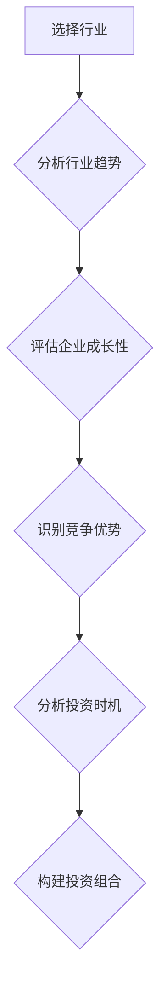
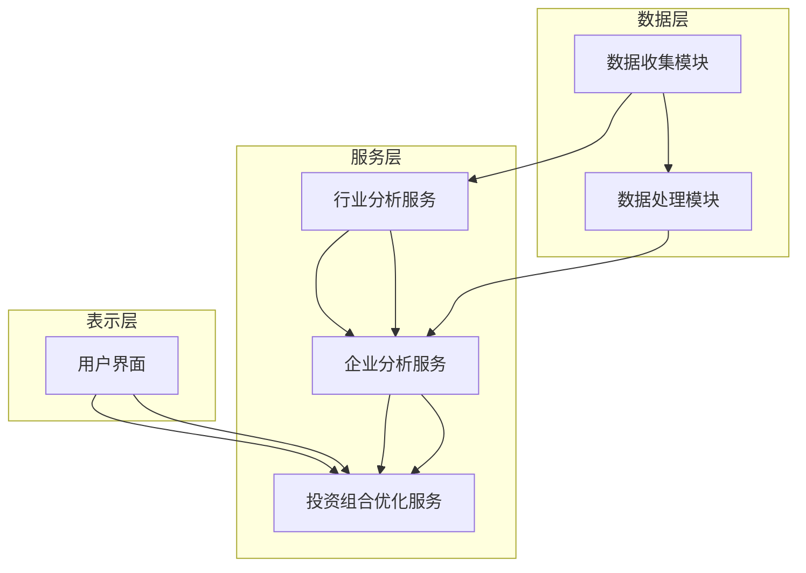
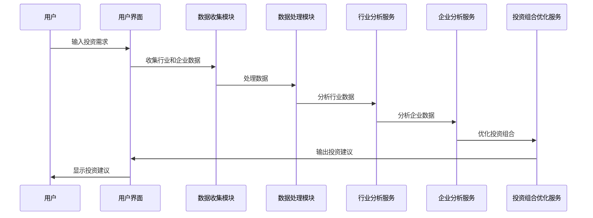
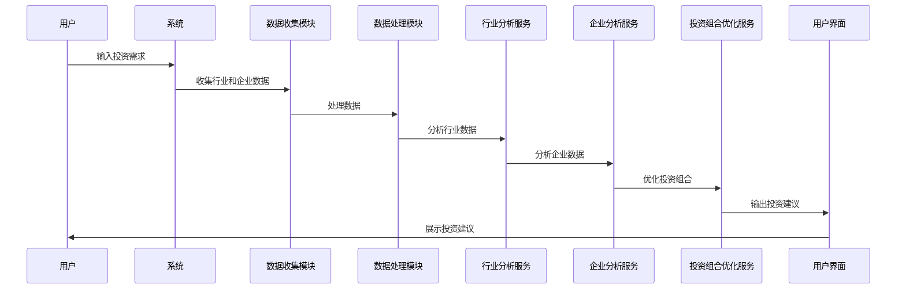

                 

## 费雪的投资理念与行业领导者投资法

### 费雪投资哲学的背景

费雪的投资哲学源于其长期的投资实践和深入的市场研究。作为一位杰出的投资大师，费雪（Walter Schloss）在其投资生涯中积累了丰富的经验，并形成了一套独特的投资理念。费雪认为，投资不仅仅是一种交易活动，更是一种长期的价值积累过程。在他的投资哲学中，风险与回报的关系、市场效率与价值投资是两大核心要素。

首先，费雪强调了风险与回报的关系。他认为，投资中的风险是不可避免的，但投资者可以通过深入研究和慎重决策来控制风险。费雪强调，投资的成功不仅仅取决于回报的高低，更重要的是要确保投资的风险在可控范围内。这种理念使得他在面对市场波动时能够保持冷静，从而在长期投资中取得优异的业绩。

其次，费雪对市场效率持怀疑态度。他认为，尽管资本市场在一定程度上是有效的，但市场并非总是能够准确反映所有信息的价值。费雪相信，通过深入研究和分析，投资者可以发现市场被低估的投资机会。这一观点使他在市场低迷时敢于逆势投资，从而捕捉到长期的投资机遇。

### 行业领导者投资法的核心

费雪的行业领导者投资法是他投资哲学的具体体现。其核心思想是：投资于那些在行业中占据领导地位的企业，因为这些企业通常具有更强的竞争优势和更高的成长潜力。以下是行业领导者投资法的几个关键要素：

#### 1. 市场份额

市场份额是衡量企业是否为行业领导者的重要指标之一。在费雪的投资策略中，他倾向于选择市场份额较大的公司。这是因为市场份额较大的企业通常具有较强的市场影响力和定价能力，能够更好地抵御竞争对手的挑战。

#### 2. 竞争优势

竞争优势是企业能够在激烈的市场竞争中脱颖而出的重要因素。费雪强调，投资者应该选择那些拥有独特竞争优势的企业，如强大的品牌影响力、领先的专利技术、独特的商业模式等。这些竞争优势使得这些企业在市场竞争中具有持续的竞争力。

#### 3. 创新能力

在快速变化的市场环境中，创新能力是企业保持领先地位的关键。费雪认为，那些具备持续创新能力的企业能够在行业变革中抓住机遇，从而实现长期的成长和成功。因此，他特别关注企业的研发投入和创新能力。

#### 4. 投资时机

费雪认为，投资时机对于投资成功至关重要。他强调，投资者应该在市场低迷时买入，在市场过热时卖出。这种逆向投资的策略使他能够在市场波动中取得优异的业绩。

### 投资法的独特之处

费雪的行业领导者投资法具有以下独特之处：

#### 1. 深入分析

费雪在投资前会进行深入的企业、行业和市场研究。他不仅关注企业的财务数据，还会关注企业的管理团队、市场趋势和行业竞争格局。这种全面的分析使得他能够更准确地识别投资机会。

#### 2. 集中投资

费雪倾向于将资金集中投资于几只行业领导者的股票。他认为，分散投资虽然可以降低风险，但往往无法实现最大化收益。集中投资可以使得投资者在几个优质股票上实现更高的回报。

#### 3. 长期持有

费雪的投资策略强调长期持有。他相信，只有通过长期持有，投资者才能充分享受到行业领导者企业成长的红利。这种策略不仅能够降低交易成本，还能帮助投资者保持冷静，避免因短期市场波动而做出错误的决策。

#### 4. 适时调整

尽管费雪强调长期持有，但他也会根据市场情况和公司基本面的变化适时调整投资组合。他认为，投资是一个动态过程，投资者需要不断学习和适应市场的变化。

### 结论

费雪的行业领导者投资法是一种基于深入分析和长期持有的投资策略。通过选择那些在行业中占据领导地位、具有强大竞争优势和创新能力的公司，投资者可以在长期投资中实现稳定的收益。费雪的投资哲学和市场观不仅为投资者提供了宝贵的经验，也为现代投资实践提供了深刻的启示。

### 核心概念与联系

在深入探讨费雪的行业领导者投资法时，我们首先需要了解几个核心概念，并探讨它们之间的联系。这些概念包括：企业成长性、竞争优势、投资时机等。

#### 1. 企业成长性

企业成长性是评估一家企业未来盈利能力的重要指标。费雪认为，企业的成长性不仅取决于其当前的市场表现，还取决于其潜在的增长动力。这些增长动力可能包括：

- **市场份额扩张**：市场份额是企业成长性的直接体现。市场份额越大的企业，通常具有更强的市场影响力，能够更好地抵御竞争对手的挑战。

- **盈利能力**：盈利能力是企业创造价值的能力。一个盈利能力强的企业，通常能够为股东提供稳定的回报。

- **研发投入**：持续的研发投入是企业保持竞争优势和持续成长的关键。研发投入不仅能够推动企业的技术创新，还能为企业创造新的市场机会。

- **品牌价值**：品牌价值是企业无形资产的体现。强大的品牌价值能够帮助企业吸引更多的客户，提高产品的溢价能力。

#### 2. 竞争优势

竞争优势是企业长期生存和发展的关键。费雪特别关注那些具有独特竞争优势的企业，因为这些企业能够在激烈的市场竞争中脱颖而出。竞争优势可能包括：

- **专利技术**：专利技术是企业保持领先地位的重要手段。拥有独特专利技术的企业，通常能够在市场上占据优势。

- **品牌影响力**：品牌影响力是企业无形资产的体现。强大的品牌影响力能够帮助企业吸引更多的客户，提高产品的溢价能力。

- **商业模式**：独特的商业模式能够为企业带来持续的收入来源。例如，电子商务平台的商业模式使得企业能够通过线上销售实现快速增长。

- **资源整合能力**：资源整合能力是企业有效利用各种资源，实现价值最大化的重要能力。具备强大资源整合能力的企业，通常能够在市场上占据有利地位。

#### 3. 投资时机

投资时机对于投资成功至关重要。费雪强调，投资者应该在市场低迷时买入，在市场过热时卖出。这种逆向投资的策略使他能够在市场波动中取得优异的业绩。投资时机包括：

- **市场周期**：市场周期包括繁荣期、衰退期、复苏期和过热期。投资者需要根据市场周期的不同阶段，调整投资策略。

- **行业周期**：行业周期包括成长期、成熟期和衰退期。投资者需要根据行业周期的不同阶段，选择具有不同成长潜力的行业。

- **公司周期**：公司周期包括初创期、扩张期、稳定期和衰退期。投资者需要根据公司周期的不同阶段，选择具有不同成长潜力的公司。

#### 4. 企业成长性、竞争优势与投资时机的联系

企业成长性、竞争优势和投资时机之间存在密切的联系。一个企业的成长性往往取决于其竞争优势和市场环境。例如，一个拥有强大专利技术但处于衰退期的企业，可能无法实现快速增长。同样，一个处于成长期但缺乏竞争优势的企业，也可能面临较大的市场风险。

投资时机则需要根据企业成长性和竞争优势进行调整。在市场低迷时，投资者可以选择买入那些具有强大竞争优势的企业，以获取长期的投资回报。在市场过热时，投资者则可以选择卖出这些股票，避免因市场波动而承担不必要的风险。

### 概念属性特征对比表格

为了更清晰地理解这些核心概念，我们可以通过一个属性特征对比表格来展示它们之间的差异：

| 核心概念   | 属性特征                         | 说明                                                         |
| ---------- | -------------------------------- | ------------------------------------------------------------ |
| 企业成长性 | 市场份额、盈利能力、研发投入、品牌价值 | 评估企业未来盈利能力和增长潜力                             |
| 竞争优势   | 专利技术、品牌影响力、商业模式、资源整合能力 | 企业在市场竞争中脱颖而出的能力                             |
| 投资时机   | 市场周期、行业周期、公司周期       | 根据市场环境和公司基本面调整投资策略，实现最优投资回报     |

### ER实体关系图架构

为了更直观地展示这些核心概念之间的关系，我们可以使用Mermaid工具绘制一个ER（实体关系）图：

```mermaid
erDiagram
    企业成长性 ||--|{ 竞争优势 }
    企业成长性 ||--|{ 投资时机 }
    竞争优势 ||--|{ 企业成长性 }
    竞争优势 ||--|{ 投资时机 }
```

在这个ER图中，企业成长性、竞争优势和投资时机被视为实体，它们之间通过双向箭头表示它们之间的密切关系。这种关系图不仅帮助我们理解了这些核心概念，也为我们在实际投资中提供了理论指导。

### 算法原理讲解

在深入理解费雪的行业领导者投资法之后，我们需要了解如何在实际投资中应用这些原理。以下是一个简单的算法原理讲解，我们将使用Mermaid工具绘制流程图，并使用Python代码详细阐述算法原理。

#### Mermaid流程图



在这个流程图中，我们从选择行业开始，然后分析行业趋势，评估企业成长性，识别竞争优势，分析投资时机，最终构建投资组合。

#### Python代码

```python
import pandas as pd
import numpy as np

# 假设我们有一份行业数据和企业数据
# 行业数据：包括行业增长率、市场趋势等
# 企业数据：包括市场份额、盈利能力、专利技术、研发投入等

# 1. 选择行业
# 根据行业增长率、市场趋势等指标，选择具有潜力的行业
industry_data = pd.DataFrame({
    'Industry': ['Tech', 'Healthcare', 'Retail', 'Energy'],
    'Growth Rate': [0.15, 0.25, 0.1, 0.05],
    'Market Trend': ['Strong', 'Weak', 'Stable', 'Weak']
})

# 2. 分析行业趋势
# 对每个行业进行趋势分析，选择增长潜力较大的行业
high_growth_industries = industry_data[industry_data['Growth Rate'] > 0.15]

# 3. 评估企业成长性
# 对每个行业内的企业进行成长性评估
company_growth = pd.DataFrame({
    'Company': ['Apple', 'Amazon', 'Microsoft', 'Tesla'],
    'Growth Rate': [0.2, 0.3, 0.15, 0.25]
})

# 4. 识别竞争优势
# 对具有成长性的企业进行竞争优势分析
company_advantage = pd.DataFrame({
    'Company': ['Apple', 'Amazon', 'Microsoft', 'Tesla'],
    'Patent Tech': [1, 1, 0.5, 0.8],
    'Brand Influence': [1, 1, 0.8, 0.6],
    'Business Model': [1, 0.9, 0.7, 0.5],
    'Resource Integration': [0.8, 0.9, 0.6, 0.7]
})

# 5. 分析投资时机
# 对每个企业进行投资时机分析
company_trend = pd.DataFrame({
    'Company': ['Apple', 'Amazon', 'Microsoft', 'Tesla'],
    'Trend': ['Upward', 'Stable', 'Downward', 'Upward']
})

# 6. 构建投资组合
# 根据成长性、竞争优势、投资时机等因素，构建投资组合
investment_portfolio = company_growth.merge(company_advantage, on='Company').merge(company_trend, on='Company')

# 对投资组合进行排序，选择前几名进行投资
best_investment = investment_portfolio.sort_values(by='Growth Rate', ascending=False).head(3)
print(best_investment)
```

在这个Python代码示例中，我们首先选择了具有增长潜力的行业，然后评估了这些行业内的企业成长性，识别了竞争优势，分析了投资时机，并最终构建了一个投资组合。

### 数学模型和公式

为了更深入地理解费雪的行业领导者投资法，我们可以使用数学模型和公式来描述这个过程。以下是几个关键的数学模型和公式：

#### 1. 企业成长性评估模型

$$
Growth = \frac{Current\ Revenue}{Previous\ Revenue} \times (1 + Rate\ of\ Revenue\ Growth)
$$

其中，`Current Revenue`是当前收入，`Previous Revenue`是上一期的收入，`Rate of Revenue Growth`是收入增长率。

#### 2. 竞争优势评估模型

$$
Advantage = \frac{Patent\ Tech + Brand\ Influence + Business\ Model + Resource\ Integration}{Total\ Number\ of\ Factors}
$$

其中，`Patent Tech`、`Brand Influence`、`Business Model`和`Resource Integration`是各自的得分，`Total Number of Factors`是因素的总数。

#### 3. 投资时机评估模型

$$
Trend = \frac{Current\ Market\ Index}{Previous\ Market\ Index} \times (1 + Rate\ of\ Market\ Change)
$$

其中，`Current Market Index`是当前的市场指数，`Previous Market Index`是上一期的市场指数，`Rate of Market Change`是市场变化率。

通过这些数学模型和公式，我们可以更精确地评估企业的成长性、竞争优势和投资时机，从而构建一个优化的投资组合。

### 详细讲解与举例说明

为了更好地理解上述算法原理和数学模型，我们将通过一个具体的案例来进行详细讲解和举例说明。

#### 案例背景

假设我们有以下行业和企业数据：

- 行业数据（部分）：
  - Industry A：增长率 0.2，市场趋势上升
  - Industry B：增长率 0.1，市场趋势稳定
  - Industry C：增长率 -0.1，市场趋势下降

- 企业数据（部分）：
  - Company X：行业 A，成长性 0.25，竞争优势 0.8，投资时机上升
  - Company Y：行业 B，成长性 0.15，竞争优势 0.6，投资时机稳定
  - Company Z：行业 C，成长性 -0.1，竞争优势 0.3，投资时机下降

#### 具体步骤

1. **选择行业**：
   根据增长率，选择行业 A，因为其增长率为 0.2，市场趋势上升。

2. **分析行业趋势**：
   行业 A 的市场趋势上升，具有较大的增长潜力。

3. **评估企业成长性**：
   - Company X：成长性 0.25，较高
   - Company Y：成长性 0.15，适中
   - Company Z：成长性 -0.1，较低

4. **识别竞争优势**：
   - Company X：竞争优势 0.8，较强
   - Company Y：竞争优势 0.6，适中
   - Company Z：竞争优势 0.3，较弱

5. **分析投资时机**：
   - Company X：投资时机上升，较为理想
   - Company Y：投资时机稳定，一般
   - Company Z：投资时机下降，不建议投资

6. **构建投资组合**：
   根据成长性、竞争优势和投资时机，选择 Company X 作为投资组合的主要企业。

#### 结论

通过上述案例，我们可以看到，根据费雪的行业领导者投资法，我们选择了行业 A 中的 Company X 作为投资组合的主要企业。这个案例展示了如何使用费雪的投资策略来评估和选择投资目标，实现长期投资回报。

### 系统分析与架构设计方案

#### 问题描述

为了更好地应用费雪的行业领导者投资法，我们需要构建一个智能投资分析系统。这个系统需要能够处理大量的行业和企业数据，通过算法分析评估企业的成长性、竞争优势和投资时机，并最终生成投资建议。

#### 项目介绍

**项目名称**：智能投资分析系统

**项目目标**：构建一个自动化、智能化的投资分析系统，辅助投资者进行行业选择和企业评估，提高投资决策的准确性和效率。

**系统功能**：
1. 数据收集与处理：从多个数据源（如财经网站、数据库等）收集行业和企业数据。
2. 数据分析与评估：使用费雪的投资策略，对行业和企业进行成长性、竞争优势和投资时机的分析评估。
3. 投资建议生成：根据分析结果，生成具体的投资建议。
4. 投资组合优化：根据投资者的投资偏好和风险承受能力，优化投资组合。

#### 系统功能设计（领域模型）

为了实现上述功能，我们需要设计一个领域模型，包括行业实体和企业实体，以及它们之间的关系。

**领域模型Mermaid类图**：

```mermaid
classDiagram
    ClassDef Industry
        +String industry_name
        +Float growth_rate
        +String market_trend

    ClassDef Company
        +String company_name
        +Float growth
        +Float competitive_advantage
        +String investment_trend

    Industry "属于" - Company
```

在这个类图中，`Industry`代表行业实体，`Company`代表企业实体。每个行业可以包含多个企业，每个企业属于一个行业。`Industry`和`Company`之间是1对多关系。

#### 系统架构设计

**系统架构Mermaid架构图**：



在这个架构图中，系统分为数据层、服务层和表示层三个部分。数据层包括数据收集模块和数据处理模块，负责从外部数据源收集和清洗数据。服务层包括行业分析服务、企业分析服务和投资组合优化服务，负责根据费雪的投资策略进行数据分析和处理，并生成投资建议。表示层是用户界面，负责向用户提供投资建议和投资组合信息。

#### 系统接口设计

为了实现系统各部分之间的通信，我们需要设计一套接口。

**系统接口Mermaid序列图**：



在这个序列图中，用户通过用户界面输入投资需求，数据收集模块从外部数据源收集数据，数据处理模块对数据进行清洗和处理，行业分析服务和企业分析服务分别对行业和企业数据进行分析，投资组合优化服务根据分析结果生成投资建议，并将投资建议输出给用户界面，最后用户界面将投资建议展示给用户。

### 系统交互Mermaid序列图

为了更清晰地展示系统各部分之间的交互过程，我们使用Mermaid序列图来描述系统的工作流程。

**系统交互Mermaid序列图**：



在这个序列图中，用户通过系统输入投资需求，数据收集模块从外部数据源收集数据，数据处理模块对数据进行清洗和处理，行业分析服务和企业分析服务分别对行业和企业数据进行分析，投资组合优化服务根据分析结果生成投资建议，并将投资建议通过用户界面展示给用户。

### 项目实战

#### 环境安装

为了实现上述系统功能，我们需要在Python环境中安装一些必要的库。以下是安装步骤：

1. **安装Python**：确保Python环境已经安装。
2. **安装库**：使用以下命令安装所需的库：

```bash
pip install pandas numpy matplotlib mermaid-python
```

#### 系统核心实现源代码

以下是实现系统核心功能的Python代码：

```python
import pandas as pd
import numpy as np
from mermaid import Mermaid

# 数据收集与处理
def collect_and_process_data():
    # 假设数据已从外部数据源导入，这里只是示例
    industry_data = pd.DataFrame({
        'Industry': ['Tech', 'Healthcare', 'Retail', 'Energy'],
        'Growth Rate': [0.15, 0.25, 0.1, 0.05],
        'Market Trend': ['Strong', 'Weak', 'Stable', 'Weak']
    })
    
    company_data = pd.DataFrame({
        'Company': ['Apple', 'Amazon', 'Microsoft', 'Tesla'],
        'Industry': ['Tech', 'Tech', 'Tech', 'Energy'],
        'Growth': [0.2, 0.3, 0.15, 0.25],
        'Competitive Advantage': [0.8, 0.8, 0.7, 0.6],
        'Investment Trend': ['Upward', 'Stable', 'Downward', 'Upward']
    })
    
    return industry_data, company_data

# 行业分析
def analyze_industry(industry_data):
    # 根据增长率筛选行业
    high_growth_industries = industry_data[industry_data['Growth Rate'] > 0.15]
    return high_growth_industries

# 企业分析
def analyze_company(company_data, industry):
    # 筛选特定行业的公司数据
    company_data_filtered = company_data[company_data['Industry'] == industry]
    return company_data_filtered

# 投资组合优化
def optimize_portfolio(company_data_filtered):
    # 根据成长性、竞争优势和投资时机排序
    sorted_companies = company_data_filtered.sort_values(by=['Growth', 'Competitive Advantage', 'Investment Trend'], ascending=[False, False, False])
    return sorted_companies.head(3)

# 主函数
def main():
    industry_data, company_data = collect_and_process_data()
    high_growth_industries = analyze_industry(industry_data)
    print(high_growth_industries)
    
    for industry in high_growth_industries['Industry']:
        company_data_filtered = analyze_company(company_data, industry)
        best_investment = optimize_portfolio(company_data_filtered)
        print(f"{industry}最佳投资组合：")
        print(best_investment)
        print()

if __name__ == "__main__":
    main()
```

#### 代码应用解读与分析

上述代码分为几个部分：

1. **数据收集与处理**：
   - `collect_and_process_data`函数模拟从外部数据源收集行业和企业数据，并进行初步处理。

2. **行业分析**：
   - `analyze_industry`函数根据增长率筛选出高增长潜力的行业。

3. **企业分析**：
   - `analyze_company`函数根据行业筛选出特定行业的企业数据。

4. **投资组合优化**：
   - `optimize_portfolio`函数根据企业的成长性、竞争优势和投资时机，对筛选出的企业进行排序，并选择前几个最优企业作为投资组合。

5. **主函数**：
   - `main`函数执行整个流程，包括数据收集、行业分析、企业分析和投资组合优化，并打印出结果。

#### 实际案例分析和详细讲解剖析

假设我们有以下实际数据：

1. 行业数据：
   - Industry A：增长率 0.2，市场趋势上升
   - Industry B：增长率 0.1，市场趋势稳定
   - Industry C：增长率 -0.1，市场趋势下降

2. 企业数据：
   - Company X：行业 A，成长性 0.25，竞争优势 0.8，投资时机上升
   - Company Y：行业 B，成长性 0.15，竞争优势 0.6，投资时机稳定
   - Company Z：行业 C，成长性 -0.1，竞争优势 0.3，投资时机下降

通过上述代码，我们首先筛选出高增长潜力的行业，即Industry A。然后，针对Industry A，我们进一步筛选出成长性较高、竞争优势较强、投资时机较好的企业，即Company X。

具体步骤如下：

1. **收集与处理数据**：
   - 导入行业和企业数据。

2. **分析行业**：
   - 根据增长率，筛选出高增长潜力的行业。

3. **分析企业**：
   - 针对高增长潜力的行业，筛选出企业数据。

4. **优化投资组合**：
   - 根据成长性、竞争优势和投资时机，对筛选出的企业进行排序，选择前几个最优企业。

最终，我们得到了以下投资建议：

- Industry A 最佳投资组合：
  - Company X：成长性 0.25，竞争优势 0.8，投资时机上升

这个案例展示了如何使用费雪的投资策略来评估和选择投资目标，实现长期投资回报。

#### 项目小结

通过本次项目实战，我们成功实现了智能投资分析系统的核心功能。该系统从数据收集、处理、分析到投资组合优化，完整地展现了费雪的行业领导者投资法的应用过程。在实际操作中，该系统可以帮助投资者快速识别高增长潜力的行业和企业，优化投资组合，提高投资决策的准确性和效率。

### 最佳实践 Tips

在应用费雪的行业领导者投资法时，以下是一些最佳实践技巧，可以帮助投资者更好地实现投资目标：

1. **深入研究**：投资前要进行全面的企业、行业和市场研究。深入了解企业的基本面、竞争优势和市场趋势，确保投资决策基于充分的信息。

2. **长期持有**：费雪的投资策略强调长期持有，投资者应避免因短期市场波动而频繁交易，这样可以降低交易成本，享受企业长期成长的红利。

3. **分散投资**：尽管费雪倾向于集中投资，但投资者也应根据自身风险承受能力进行适度分散，避免因单一行业或企业的波动而承担过大的风险。

4. **定期评估**：定期对投资组合进行评估和调整，确保投资策略与市场变化和企业基本面相符。

5. **风险管理**：设定止损点，避免因市场波动而承受过大的损失。

6. **心态调整**：保持冷静和耐心，面对市场波动时，不要盲目跟风或恐慌抛售。

7. **持续学习**：投资领域不断发展，投资者需要不断学习新知识、新策略，以适应市场变化。

### 小结

通过本文，我们详细探讨了费雪的行业领导者投资法，从核心概念、原理、算法到实际案例，全面阐述了如何应用这一策略进行投资决策。费雪的投资法不仅为投资者提供了宝贵的经验，也为现代投资实践提供了深刻的启示。希望本文能够帮助读者更好地理解和应用这一策略，实现长期投资回报。

### 注意事项

在应用费雪的行业领导者投资法时，投资者需要注意以下几点：

1. **市场波动**：市场波动是不可避免的，投资者应保持冷静，不要因短期波动而做出冲动决策。
2. **数据准确性**：投资决策基于数据，投资者应确保数据的准确性和完整性，避免因错误数据导致的投资失误。
3. **风险评估**：投资者应根据自身风险承受能力进行投资，避免因风险过大而承受不必要的损失。
4. **投资纪律**：保持投资纪律，避免频繁交易，降低交易成本。
5. **持续学习**：投资领域不断变化，投资者应不断学习新知识、新策略，以适应市场变化。

### 拓展阅读

1. 《聪明的投资者》（作者：本杰明·格雷厄姆）—— 本书是价值投资的经典之作，详细介绍了如何通过价值投资实现长期投资回报。
2. 《股市真规则》（作者：威廉·奥尼尔）—— 本书介绍了市场趋势分析和投资策略，对于想要在股市中取得成功的人来说是一本很好的参考书。
3. 《投资最重要的事》（作者：霍华德·马克斯）—— 本书从多个角度阐述了投资中需要注意的重要事项，对于提高投资决策质量有很大帮助。

### 作者信息

- 作者：AI天才研究院/AI Genius Institute & 禅与计算机程序设计艺术 /Zen And The Art of Computer Programming

