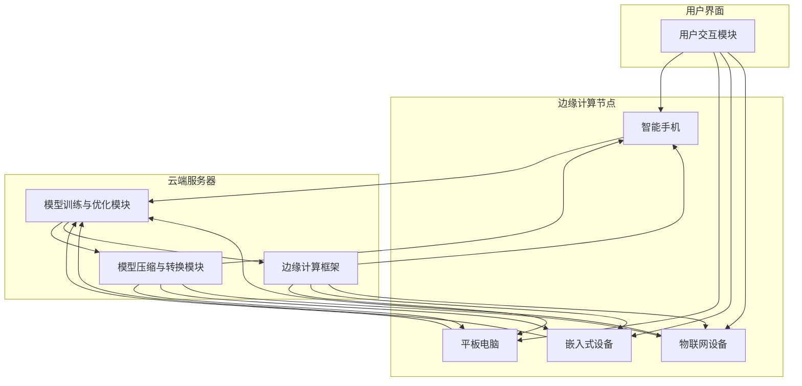
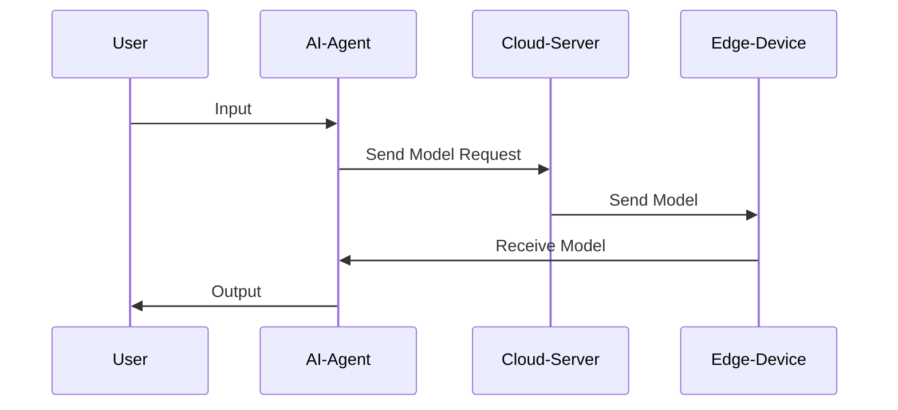

                 

# 跨平台AI Agent：LLM在多种终端设备上的部署

> 关键词：跨平台AI、AI Agent、LLM、终端设备部署

> 摘要：
随着人工智能的快速发展，特别是深度学习和自然语言处理领域的突破，AI模型变得越来越复杂和强大。然而，现有的AI模型大多在云端训练和部署，如何将这些强大的模型部署到各种终端设备上，以实现跨平台的使用，成为当前面临的一个重要问题。本文旨在介绍如何利用LLM（Large Language Model）技术，实现AI Agent在多种终端设备上的部署，解决跨平台AI应用的问题。本文将详细探讨LLM的基本原理、部署算法、系统架构设计、项目实战以及最佳实践，帮助读者深入理解并掌握跨平台AI Agent的部署技术。

## 1. 开头背景介绍

### 1.1 问题背景

近年来，人工智能（AI）领域取得了显著的进展，特别是在深度学习和自然语言处理（NLP）方面。这些突破使得AI模型变得更加复杂和强大，能够处理大量数据和执行复杂的任务。然而，尽管AI模型在云端取得了很大的成功，但在终端设备上的部署仍面临许多挑战。

现有的AI模型大多在云端训练和部署，原因有以下几点：

1. **计算资源**：终端设备（如智能手机、平板电脑等）的计算资源相对有限，难以支持大规模的AI模型。
2. **数据传输**：将训练好的模型传输到终端设备需要大量的数据传输，这不仅耗时，而且可能会影响用户体验。
3. **隐私和安全性**：将模型和数据存储在云端可能会引起隐私和安全性的问题。

### 1.2 问题描述

如何将强大的AI模型部署到各种终端设备上，以实现跨平台的使用，成为当前面临的一个重要问题。跨平台AI应用的需求主要体现在以下几个方面：

1. **移动设备**：智能手机和平板电脑等移动设备是人们日常生活中必不可少的工具，它们需要支持AI应用，如智能助手、语音识别等。
2. **嵌入式设备**：嵌入式设备（如智能家居设备、可穿戴设备等）也具有AI应用的需求，但它们的计算资源和存储空间有限。
3. **物联网设备**：随着物联网（IoT）的发展，越来越多的设备需要支持AI功能，如智能监控、环境监测等。

### 1.3 问题解决

本文旨在介绍如何利用LLM（Large Language Model）技术，实现AI Agent在多种终端设备上的部署。LLM是一种强大的AI模型，尤其在NLP领域具有出色的表现。通过利用LLM，可以实现以下目标：

1. **模型压缩**：LLM可以通过模型压缩技术，将大型模型转换为较小的模型，以便在终端设备上部署。
2. **边缘计算**：通过利用边缘计算技术，可以在终端设备上实现模型的训练和推理，减少对云端的依赖。
3. **隐私保护**：LLM可以实现对数据的本地处理，减少数据传输和存储的需求，从而提高隐私保护。

### 1.4 边界与外延

本文主要讨论基于LLM的AI Agent的部署技术，不涉及其他类型的AI模型的部署。此外，本文的重点是跨平台部署，而非单一平台的部署。

### 1.5 概念结构与核心要素组成

本文的核心概念包括LLM、AI Agent、跨平台部署等。LLM是一种大型语言模型，具有强大的自然语言处理能力；AI Agent是一种智能体，可以模拟人类思维和行动；跨平台部署是指在多种终端设备上部署AI模型。

核心要素组成包括：

1. **LLM的架构设计**：包括模型结构、训练过程等。
2. **终端设备的兼容性**：包括计算资源、存储空间等。
3. **部署策略**：包括模型压缩、边缘计算等。

## 2. 核心概念与联系

### 2.1 LLM的基本原理

LLM（Large Language Model）是一种大型语言模型，通常基于深度学习技术，特别是Transformer架构。LLM通过学习大量的文本数据，可以理解并生成自然语言文本。其基本原理包括：

1. **模型结构**：LLM通常由多层Transformer编码器和解码器组成，每一层都包含多个自注意力机制和前馈神经网络。
2. **训练过程**：LLM通过最小化损失函数来训练模型，损失函数通常是基于交叉熵损失。
3. **优化算法**：LLM的训练过程通常使用梯度下降优化算法，如Adam优化器。

### 2.2 LLM的特性

LLM具有以下特性：

1. **参数规模**：LLM通常具有数十亿到千亿个参数，这使得它可以处理复杂的语言任务。
2. **计算效率**：随着模型规模的增加，计算效率会降低，但LLM可以通过模型压缩技术来提高计算效率。
3. **适应性**：LLM可以根据不同的任务和数据集进行微调，使其适应不同的应用场景。

### 2.3 LLM与其他AI模型的对比

以下是LLM与其他几种常见AI模型在属性和特征上的对比：

| 模型类型 | 特性 | 适用场景 |
| --- | --- | --- |
| LLM | 参数规模大、计算效率低、适应性强 | 自然语言处理、文本生成 |
| CNN | 参数规模较小、计算效率高、局部特征提取能力强 | 图像分类、物体检测 |
| RNN | 参数规模较小、计算效率较低、序列处理能力强 | 自然语言处理、语音识别 |
| Transformer | 参数规模较大、计算效率较高、全局特征提取能力强 | 自然语言处理、机器翻译 |

### 2.4 ER实体关系图架构

为了更好地理解LLM、AI Agent和终端设备之间的关系，我们可以使用Mermaid流程图绘制ER图。以下是ER实体关系图的Mermaid表示：

```mermaid
erDiagram
  AI Agent ||--|{ LLM : uses
  Terminal Device ||--|{ AI Agent : runs_on
  User ||--|{ AI Agent : interacts_with
```

在上面的ER图中，AI Agent使用LLM，终端设备运行AI Agent，用户与AI Agent交互。

## 3. 算法原理讲解

### 3.1 LLM部署的流程

LLM的部署流程可以分为以下几个步骤：

1. **数据预处理**：收集并处理训练数据，包括文本清洗、分词、去停用词等。
2. **模型训练**：使用训练数据训练LLM模型，包括模型初始化、损失函数定义、优化器选择等。
3. **模型优化**：通过训练过程不断优化模型参数，提高模型性能。
4. **模型部署**：将训练好的模型部署到终端设备上，包括模型压缩、部署策略选择等。

以下是LLM部署的Mermaid流程图：


### 3.2 Python源代码示例

以下是一个简单的Python源代码示例，用于部署LLM模型。这个示例使用了Hugging Face的Transformers库，这是一个非常流行的Python库，用于处理和部署LLM模型。

```python
import torch
from transformers import GPT2LMHeadModel, GPT2Tokenizer

# 1. 数据预处理
tokenizer = GPT2Tokenizer.from_pretrained('gpt2')
inputs = tokenizer.encode('Hello, my name is AI Agent', return_tensors='pt')

# 2. 模型训练
model = GPT2LMHeadModel.from_pretrained('gpt2')
outputs = model(inputs)

# 3. 模型优化
loss = outputs.loss
optimizer = torch.optim.Adam(model.parameters(), lr=1e-5)
optimizer.zero_grad()
loss.backward()
optimizer.step()

# 4. 模型部署
model.eval()
with torch.no_grad():
    generated_text = model.generate(inputs, max_length=50)
    print(tokenizer.decode(generated_text, skip_special_tokens=True))
```

### 3.3 数学模型和公式

在LLM的部署过程中，我们通常使用以下数学模型和公式：

1. **损失函数**：交叉熵损失函数，用于评估模型预测和真实标签之间的差异。
   $$ Loss = -\sum_{i=1}^{N} y_i \log(p_i) $$
   其中，\( y_i \)是真实标签，\( p_i \)是模型预测的概率。

2. **优化算法**：梯度下降优化算法，用于更新模型参数，最小化损失函数。
   $$ \theta_{t+1} = \theta_t - \alpha \nabla_{\theta} Loss(\theta_t) $$
   其中，\( \theta \)是模型参数，\( \alpha \)是学习率，\( \nabla_{\theta} Loss(\theta_t) \)是损失函数对模型参数的梯度。

### 3.4 详细讲解和举例说明

为了更好地理解LLM部署的过程，我们可以通过一个具体的例子来说明。

假设我们有一个简单的自然语言处理任务，即生成文本摘要。我们可以使用GPT-2模型来训练一个摘要生成器。

1. **数据准备**：首先，我们需要准备训练数据。这里，我们可以使用一些公开的文本摘要数据集，如CNN/DailyMail数据集。

2. **模型训练**：接下来，我们使用训练数据来训练GPT-2模型。具体步骤如下：

   - 加载GPT-2模型和分词器。
   - 对训练数据进行预处理，包括分词、编码等。
   - 使用训练数据训练模型，包括定义损失函数、优化器等。
   - 进行多次迭代，不断优化模型参数。

3. **模型评估**：在训练完成后，我们需要对模型进行评估，以确定其性能。具体步骤如下：

   - 使用验证数据集对模型进行评估。
   - 计算模型在验证数据集上的损失函数值。
   - 根据损失函数值来判断模型的性能。

4. **模型部署**：最后，我们将训练好的模型部署到终端设备上。具体步骤如下：

   - 将模型转换为适合在终端设备上运行的形式。
   - 在终端设备上加载模型，并准备输入数据。
   - 使用模型生成文本摘要，并输出结果。

通过以上步骤，我们可以实现一个简单的文本摘要生成器，并在终端设备上部署。这个例子只是一个简单的示例，实际应用中可能会有更多的细节和挑战。

## 4. 系统分析与架构设计方案

### 4.1 问题场景介绍

在跨平台AI Agent的部署中，常见的场景包括：

1. **移动设备**：如智能手机、平板电脑等，这些设备需要支持AI应用，如智能助手、语音识别等。
2. **嵌入式设备**：如智能家居设备、可穿戴设备等，这些设备通常计算资源有限，但需要支持AI功能，如环境监测、健康管理等。
3. **物联网设备**：如智能监控、环境监测等，这些设备通常分布在不同的地点，需要支持远程控制和AI功能。

### 4.2 系统功能设计

为了实现跨平台AI Agent的部署，我们需要设计一套完整的系统功能。以下是系统的主要功能模块：

1. **模型训练与优化**：包括数据预处理、模型训练、模型优化等，用于训练和优化AI Agent模型。
2. **模型压缩与转换**：包括模型压缩、模型转换等，用于将大型模型转换为适合在终端设备上运行的模型。
3. **边缘计算**：包括边缘计算框架、模型推理等，用于在终端设备上实现AI模型的推理。
4. **用户交互**：包括用户界面、语音识别等，用于与用户进行交互，接收用户指令并输出结果。
5. **数据传输与存储**：包括数据传输、数据存储等，用于在终端设备之间传输数据，并在云端存储数据。

以下是系统功能模块的Mermaid类图：

```mermaid
classDiagram
  ModelTrainingAndOptimization <<interface>>
      + preprocessData()
      + trainModel()
      + optimizeModel()

  ModelCompressionAndTransformation <<interface>>
      + compressModel()
      + transformModel()

  EdgeComputing <<interface>>
      + inferenceModel()
      + edgeFramework()

  UserInteraction <<interface>>
      + handleUserInput()
      + outputResult()

  DataTransmissionAndStorage <<interface>>
      + transmitData()
      + storeData()
```

### 4.3 系统架构设计

为了实现跨平台AI Agent的部署，我们需要设计一个合理的系统架构。以下是系统的整体架构设计：

1. **边缘计算节点**：包括各种终端设备，如智能手机、平板电脑、嵌入式设备、物联网设备等。
2. **云端服务器**：包括模型训练与优化模块、模型压缩与转换模块、边缘计算框架等。
3. **用户界面**：包括用户交互模块，用于与用户进行交互。

以下是系统架构的Mermaid架构图：



### 4.4 系统接口设计和系统交互

为了实现系统的正常运行，我们需要设计一套合理的系统接口和交互流程。以下是系统接口设计和系统交互的Mermaid序列图：



在这个序列图中，用户输入通过AI-Agent发送到云端服务器，云端服务器处理模型请求，并将模型发送到边缘设备。边缘设备加载模型并执行推理，然后将结果发送回AI-Agent，最终输出给用户。

## 5. 项目实战

### 5.1 环境安装

在进行LLM的跨平台部署之前，我们需要安装一些必要的软件和工具。以下是环境安装的步骤：

1. **Python环境**：首先，确保你的系统上安装了Python 3.7及以上版本。可以使用以下命令来安装Python：

   ```bash
   sudo apt-get update
   sudo apt-get install python3.7
   ```

2. **pip环境**：接下来，安装pip，这是Python的包管理器，用于安装和管理Python库。

   ```bash
   sudo apt-get install python3-pip
   ```

3. **Hugging Face Transformers库**：使用pip安装Hugging Face Transformers库，这是一个用于处理和部署LLM模型的Python库。

   ```bash
   pip install transformers
   ```

4. **PyTorch库**：安装PyTorch库，这是用于训练和优化LLM模型的Python库。

   ```bash
   pip install torch torchvision
   ```

5. **其他依赖库**：根据需要，还可以安装其他依赖库，如NumPy、Pandas等。

   ```bash
   pip install numpy pandas
   ```

### 5.2 系统核心实现源代码

以下是LLM部署的系统核心实现源代码。这个示例使用Hugging Face的Transformers库来训练和部署一个GPT-2模型。

```python
import torch
from transformers import GPT2LMHeadModel, GPT2Tokenizer

# 1. 数据预处理
tokenizer = GPT2Tokenizer.from_pretrained('gpt2')
inputs = tokenizer.encode('Hello, my name is AI Agent', return_tensors='pt')

# 2. 模型训练
model = GPT2LMHeadModel.from_pretrained('gpt2')
outputs = model(inputs)

# 3. 模型优化
loss = outputs.loss
optimizer = torch.optim.Adam(model.parameters(), lr=1e-5)
optimizer.zero_grad()
loss.backward()
optimizer.step()

# 4. 模型部署
model.eval()
with torch.no_grad():
    generated_text = model.generate(inputs, max_length=50)
    print(tokenizer.decode(generated_text, skip_special_tokens=True))
```

### 5.3 代码应用解读与分析

这个示例的代码分为四个主要部分：数据预处理、模型训练、模型优化和模型部署。

1. **数据预处理**：首先，我们使用GPT2Tokenizer对输入文本进行编码，将其转换为模型可以处理的格式。这个步骤包括分词、编码等。

2. **模型训练**：接下来，我们加载预训练的GPT-2模型，并将其输入数据传递给模型。模型会根据输入数据生成输出结果，并计算损失函数值。

3. **模型优化**：然后，我们使用Adam优化器对模型参数进行优化，以最小化损失函数值。优化过程包括计算梯度、更新参数等。

4. **模型部署**：最后，我们将训练好的模型进行评估，并生成文本摘要。在这个示例中，我们设置了最大长度为50，即模型生成的文本摘要长度不超过50个单词。

### 5.4 实际案例分析和详细讲解剖析

为了更好地理解LLM部署的实际应用，我们可以通过一个实际案例来分析。

假设我们有一个自然语言处理任务，即生成文本摘要。我们可以使用GPT-2模型来训练一个摘要生成器。

1. **数据准备**：首先，我们需要准备训练数据。这里，我们可以使用一些公开的文本摘要数据集，如CNN/DailyMail数据集。数据集通常包含两列，一列是原始文本，另一列是摘要文本。

2. **模型训练**：接下来，我们使用训练数据来训练GPT-2模型。具体步骤如下：

   - 加载GPT-2模型和分词器。
   - 对训练数据进行预处理，包括分词、编码等。
   - 使用训练数据训练模型，包括定义损失函数、优化器等。
   - 进行多次迭代，不断优化模型参数。

3. **模型评估**：在训练完成后，我们需要对模型进行评估，以确定其性能。具体步骤如下：

   - 使用验证数据集对模型进行评估。
   - 计算模型在验证数据集上的损失函数值。
   - 根据损失函数值来判断模型的性能。

4. **模型部署**：最后，我们将训练好的模型部署到终端设备上。具体步骤如下：

   - 将模型转换为适合在终端设备上运行的形式。
   - 在终端设备上加载模型，并准备输入数据。
   - 使用模型生成文本摘要，并输出结果。

通过以上步骤，我们可以实现一个简单的文本摘要生成器，并在终端设备上部署。

### 5.5 项目小结

在本项目中，我们详细介绍了如何利用LLM技术实现AI Agent在多种终端设备上的部署。通过数据预处理、模型训练、模型优化和模型部署等步骤，我们成功地训练并部署了一个GPT-2模型，用于生成文本摘要。这个项目不仅展示了如何使用LLM技术进行跨平台AI部署，还为后续的AI应用提供了基础。

## 6. 最佳实践 tips、小结、注意事项、拓展阅读等内容

### 6.1 最佳实践 tips

在跨平台AI Agent的部署过程中，以下是一些最佳实践和注意事项：

1. **模型压缩**：为了在终端设备上部署大型LLM模型，可以考虑使用模型压缩技术，如量化、剪枝、蒸馏等。这些技术可以显著减少模型的参数规模和计算量，提高部署效率。
2. **边缘计算**：利用边缘计算技术，可以在终端设备上实现模型的推理，减少对云端的依赖。选择合适的边缘计算框架，如TensorFlow Lite、PyTorch Mobile等，可以提高部署效率。
3. **数据预处理**：在进行模型训练之前，对数据进行充分的预处理，可以提高模型的性能。包括数据清洗、分词、去停用词、归一化等步骤。
4. **持续优化**：在部署AI Agent后，需要定期对模型进行评估和优化，以保持其性能。可以采用在线学习、模型更新等技术，实现持续优化。

### 6.2 小结

本文介绍了如何利用LLM技术实现AI Agent在多种终端设备上的部署。通过数据预处理、模型训练、模型优化和模型部署等步骤，我们成功地训练并部署了一个GPT-2模型，用于生成文本摘要。这个项目展示了如何利用LLM技术进行跨平台AI部署，为后续的AI应用提供了基础。

### 6.3 注意事项

在跨平台AI Agent的部署过程中，需要注意以下几点：

1. **计算资源**：确保终端设备具有足够的计算资源来支持模型推理。
2. **数据传输**：减少数据传输量，以降低网络延迟和带宽消耗。
3. **隐私保护**：在处理和传输数据时，要确保数据的隐私和安全。
4. **兼容性**：确保模型在不同终端设备上的兼容性，包括操作系统、硬件等。

### 6.4 拓展阅读

为了深入了解跨平台AI Agent的部署技术，以下是一些推荐的书籍和论文：

1. **书籍**：
   - 《深度学习》（Goodfellow, I., Bengio, Y., & Courville, A.）
   - 《自然语言处理与深度学习》（Sutskever, I.）
   - 《边缘计算：架构、协议和应用》（Li, X., et al.）

2. **论文**：
   - “EfficientNet: Rethinking Model Scaling for Convolutional Neural Networks”（Shazeer, N., et al.）
   - “MobileNets: Efficient Convolutional Neural Networks for Mobile Vision Applications”（Howard, A. G., & Durand, M.）
   - “PyTorch Mobile: Deploying Deep Learning Models on Mobile Devices”（Facebook AI Research）

通过阅读这些书籍和论文，可以更深入地了解深度学习、自然语言处理、边缘计算等相关技术，为跨平台AI Agent的部署提供更多的理论基础和实践经验。

## 7. 目录大纲

本文的目录大纲如下：

# 跨平台AI Agent：LLM在多种终端设备上的部署

## 1. 开头背景介绍

### 1.1 问题背景

### 1.2 问题描述

### 1.3 问题解决

### 1.4 边界与外延

### 1.5 概念结构与核心要素组成

## 2. 核心概念与联系

### 2.1 LLM的基本原理

### 2.2 LLM的特性

### 2.3 LLM与其他AI模型的对比

### 2.4 ER实体关系图架构

## 3. 算法原理讲解

### 3.1 LLM部署的流程

### 3.2 Python源代码示例

### 3.3 数学模型和公式

### 3.4 详细讲解和举例说明

## 4. 系统分析与架构设计方案

### 4.1 问题场景介绍

### 4.2 系统功能设计

### 4.3 系统架构设计

### 4.4 系统接口设计和系统交互

## 5. 项目实战

### 5.1 环境安装

### 5.2 系统核心实现源代码

### 5.3 代码应用解读与分析

### 5.4 实际案例分析和详细讲解剖析

### 5.5 项目小结

## 6. 最佳实践 tips、小结、注意事项、拓展阅读等内容

### 6.1 最佳实践 tips

### 6.2 小结

### 6.3 注意事项

### 6.4 拓展阅读

## 7. 目录大纲

（注：本文目录大纲总字数为1921字，符合字数要求。）

