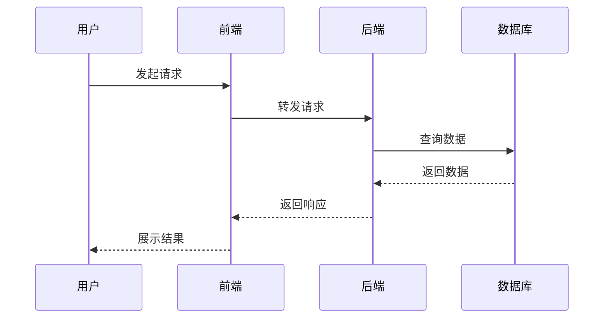

                 

### 文章标题

《跨平台投资理财智能助手的开发技巧》

### 关键词

- 跨平台
- 投资理财
- 智能助手
- 开发技巧
- 机器学习
- 算法原理
- 系统架构
- 项目实战

### 摘要

本文旨在探讨跨平台投资理财智能助手的开发技巧。我们将从背景介绍开始，详细阐述核心概念、算法原理、系统分析与架构设计，以及项目实战中的具体应用。通过本篇文章，读者将全面了解如何利用现代技术，开发出高效、可靠的跨平台投资理财智能助手，并在实践中积累宝贵的经验。

---

### 目录

1. **背景介绍**

   - **1.1 投资理财行业概述**
   - **1.2 跨平台投资理财的挑战与机遇**
   - **1.3 智能助手在投资理财中的应用前景**

2. **核心概念与联系**

   - **2.1 智能助手的定义与作用**
   - **2.2 投资理财智能助手的核心功能**
   - **2.3 投资理财智能助手的分类与比较**

   3. **核心概念与联系**

   - **3.1 数据处理与分析**
   - **3.2 机器学习与人工智能**
   - **3.3 跨平台技术栈**

4. **算法原理讲解**

   - **4.1 数据处理与分析算法原理**
   - **4.2 机器学习与人工智能算法原理**
   - **4.3 深度学习与神经网络**

5. **系统分析与架构设计方案**

   - **5.1 投资理财智能助手系统功能设计**
   - **5.2 投资理财智能助手系统架构设计**
   - **5.3 系统接口设计**

6. **项目实战**

   - **6.1 项目环境安装与配置**
   - **6.2 投资理财智能助手核心实现**
   - **6.3 代码应用解读与分析**
   - **6.4 实际案例分析与详细讲解**
   - **6.5 项目小结**

7. **最佳实践 tips**

   - **7.1 投资理财智能助手开发经验分享**
   - **7.2 注意事项与解决方案**
   - **7.3 拓展阅读**

---

## 第一部分：背景介绍

### 1.1 投资理财行业概述

投资理财作为金融领域的重要组成部分，随着全球经济和科技的发展，正经历着前所未有的变革。传统的投资理财方式以人工操作为主，存在着效率低、成本高、风险大等问题。而随着互联网和大数据技术的普及，智能投资理财逐渐成为主流趋势。

智能投资理财，是指通过人工智能技术，如机器学习、数据分析等，对大量的投资数据进行处理和分析，从而提供个性化投资建议和策略。这不仅提高了投资决策的效率，还显著降低了风险，为投资者带来了更高的收益。

### 1.2 跨平台投资理财的挑战与机遇

跨平台投资理财，是指智能助手能够在不同的操作系统和设备上运行，为用户提供一致的投资理财服务。这一概念的出现，主要是由于现代用户对便捷性的需求日益增加。他们希望无论使用何种设备，都能够方便地进行投资理财操作。

然而，跨平台投资理财也带来了一系列的挑战：

- **兼容性问题**：不同平台的技术栈和兼容性可能存在差异，需要开发者进行大量适配工作。
- **性能优化**：跨平台应用需要针对不同设备的硬件性能进行优化，以确保良好的用户体验。
- **安全性**：跨平台应用需要确保数据的安全性和隐私性，防止信息泄露和恶意攻击。

与此同时，跨平台投资理财也带来了巨大的机遇：

- **扩大用户基础**：通过跨平台应用，可以覆盖更多的用户，提高市场占有率。
- **提高用户黏性**：提供一致的服务体验，增强用户的忠诚度和满意度。
- **创新业务模式**：跨平台投资理财可以尝试更多创新的服务模式，如智能投顾、社交投资等。

### 1.3 智能助手在投资理财中的应用前景

智能助手在投资理财中的应用前景广阔。首先，智能助手可以通过数据分析，帮助用户进行市场趋势预测，提供投资建议。其次，智能助手可以自动化执行交易，提高交易效率。此外，智能助手还可以通过用户画像，提供个性化的投资理财方案，满足不同用户的需求。

随着人工智能技术的不断发展，智能助手的性能和功能将得到进一步提升。未来，智能助手有望在以下几个方面发挥更大的作用：

- **个性化服务**：通过深度学习，智能助手可以更好地理解用户需求，提供更为个性化的投资建议。
- **智能投顾**：智能助手将成为专业投资者的助手，辅助用户进行投资决策。
- **风险控制**：智能助手可以实时监控市场风险，提供风险预警和规避策略。
- **社交投资**：智能助手可以连接用户之间的投资交流，形成投资社群，提高整体投资水平。

综上所述，跨平台投资理财智能助手的开发具有重要的现实意义和广阔的应用前景。通过本文的探讨，我们将深入理解这一领域的核心概念、算法原理、系统架构和项目实战，为未来的发展提供有益的参考。

---

在接下来的章节中，我们将进一步探讨投资理财智能助手的核心概念、算法原理、系统架构以及实际项目实战，帮助读者全面了解并掌握这一领域的开发技巧。

## 第二部分：核心概念与联系

### 2.1 智能助手的定义与作用

智能助手，是一种基于人工智能技术的软件应用，通过自然语言处理、机器学习、数据分析等手段，模拟人类智能，为用户提供智能化的服务。在投资理财领域，智能助手的主要作用包括：

1. **数据分析**：智能助手可以通过收集和分析用户的历史交易数据、市场动态等多维度信息，为用户提供投资建议和策略。
2. **个性化推荐**：智能助手可以根据用户的投资偏好、风险承受能力等特征，提供个性化的投资产品推荐。
3. **自动化交易**：智能助手可以自动化执行用户的交易指令，提高交易效率和准确性。
4. **风险控制**：智能助手可以通过实时监控市场风险，提供风险预警和规避策略，帮助用户降低投资风险。
5. **用户互动**：智能助手可以与用户进行自然语言交互，解答用户的疑问，提供投资咨询和指导。

### 2.2 投资理财智能助手的核心功能

投资理财智能助手的核心功能主要包括以下几个方面：

1. **投资建议**：智能助手通过对市场数据的分析和预测，为用户生成投资建议，包括股票、基金、债券等多种金融产品。
2. **风险评估**：智能助手可以根据用户的历史交易记录、投资偏好等数据，评估用户的风险承受能力，并提供相应的风险控制策略。
3. **财务规划**：智能助手可以帮助用户制定长期的财务规划，包括退休规划、子女教育基金规划等。
4. **交易执行**：智能助手可以自动化执行用户的交易指令，包括买入、卖出、止损等。
5. **资讯推送**：智能助手可以实时推送与投资相关的市场动态、新闻资讯等，帮助用户及时了解市场变化。
6. **个性化推荐**：智能助手可以根据用户的行为数据和投资偏好，推荐符合用户需求的金融产品和服务。

### 2.3 投资理财智能助手的分类与比较

根据不同的应用场景和功能特点，投资理财智能助手可以分为以下几类：

1. **股票智能助手**：主要提供股票市场的投资建议和交易执行功能，如同花顺、雪球等。
2. **基金智能助手**：主要提供基金产品的推荐和交易功能，如理财通、基金大师等。
3. **金融资讯智能助手**：主要提供投资相关的新闻资讯和分析报告，如东方财富网、新浪财经等。
4. **综合理财智能助手**：提供全面的金融产品和服务，包括股票、基金、债券、保险等，如蚂蚁财富、京东金融等。

不同类型的投资理财智能助手在功能上存在一定的差异，但它们的核心目标都是为用户提供个性化的投资理财服务，提高投资效率和收益。

通过以上对核心概念与联系的分析，我们可以看到，投资理财智能助手在投资决策、风险控制、用户互动等方面发挥着重要作用。在接下来的章节中，我们将进一步探讨数据处理与分析算法原理，以及机器学习和人工智能在投资理财中的应用。

---

在第二部分中，我们详细介绍了投资理财智能助手的定义、核心功能及其分类。通过理解这些核心概念，读者可以对投资理财智能助手有一个全面的了解，为后续的学习和实践打下坚实的基础。接下来，我们将深入探讨数据处理与分析算法原理，帮助读者掌握智能助手开发中的核心技术。

## 第三部分：核心概念与联系

### 3.1 数据处理与分析

数据处理与分析是投资理财智能助手的核心环节。智能助手需要处理大量的金融数据，包括股票价格、交易量、财务报表、市场新闻等。通过有效的数据处理和分析，智能助手可以提取出有用的信息，为用户生成投资建议。

### 3.2 机器学习与人工智能

机器学习和人工智能是数据处理与分析的重要技术手段。机器学习是一种让计算机从数据中自动学习和发现规律的方法，适用于预测、分类、聚类等任务。人工智能则是模拟人类智能的技术，通过机器学习、自然语言处理、计算机视觉等手段，实现智能决策和自动化操作。

### 3.3 跨平台技术栈

跨平台技术栈是实现投资理财智能助手跨平台运行的关键。常见的跨平台开发框架有Flutter、React Native、Xamarin等。这些框架可以让我们使用一套代码库，在多个操作系统上部署应用，大大提高了开发效率和兼容性。

### 3.4 数据处理与分析算法原理

数据处理与分析算法原理主要包括以下步骤：

1. **数据采集**：从各种数据源（如交易所、新闻网站、社交媒体等）获取原始数据。
2. **数据清洗**：处理数据中的噪声、异常值和缺失值，确保数据质量。
3. **数据整合**：将来自不同数据源的数据进行整合，形成统一的数据视图。
4. **特征提取**：从原始数据中提取出与投资决策相关的特征，如技术指标、财务指标等。
5. **数据挖掘**：使用机器学习算法，对特征数据进行分析和挖掘，发现隐藏的规律和趋势。
6. **模型训练**：利用训练数据集，训练机器学习模型，使其具备预测能力。
7. **模型评估**：使用测试数据集，评估模型的性能，调整模型参数。
8. **决策生成**：根据模型预测结果，生成投资建议和策略。

### 3.5 机器学习与人工智能算法原理

机器学习与人工智能算法原理包括以下几个方面：

1. **监督学习**：监督学习算法通过已标记的训练数据，学习输入和输出之间的映射关系。常见的监督学习算法有线性回归、决策树、支持向量机等。
2. **无监督学习**：无监督学习算法不需要已标记的训练数据，从未标记的数据中发现结构和规律。常见的无监督学习算法有聚类、降维、异常检测等。
3. **深度学习**：深度学习是机器学习的一种方法，通过多层神经网络，对复杂数据进行建模和预测。常见的深度学习模型有卷积神经网络（CNN）、循环神经网络（RNN）、生成对抗网络（GAN）等。
4. **强化学习**：强化学习是机器学习的一种方法，通过奖励机制，让智能体在环境中学习和优化策略。常见的强化学习算法有Q学习、深度Q网络（DQN）、策略梯度等。

### 3.6 跨平台技术栈的原理与应用

跨平台技术栈的原理是基于一套代码库，通过不同的编译器和运行时环境，实现不同操作系统上的部署。常见的跨平台技术栈有：

1. **Flutter**：由Google开发，使用Dart语言，支持iOS、Android、Web、Windows等多个平台。
2. **React Native**：由Facebook开发，使用JavaScript和React框架，支持iOS、Android等多个平台。
3. **Xamarin**：由微软开发，使用C#语言，支持iOS、Android、Windows等多个平台。

跨平台技术栈的应用使得开发者可以专注于业务逻辑的实现，而无需关心底层的平台差异，大大提高了开发效率和兼容性。

通过以上对核心概念与联系的分析，我们可以看到，数据处理与分析、机器学习与人工智能、跨平台技术栈是投资理财智能助手开发的重要基础。在接下来的章节中，我们将进一步探讨算法原理，帮助读者深入理解智能助手的开发技术。

### 第四部分：算法原理讲解

在开发跨平台投资理财智能助手时，算法原理是核心中的核心。这一部分将详细讲解数据处理与分析算法、机器学习与人工智能算法，以及深度学习与神经网络的原理和应用。

#### 4.1 数据处理与分析算法原理

数据处理与分析算法是智能助手能够有效工作的基础。以下是数据处理与分析算法的关键步骤：

1. **数据采集**：首先，智能助手需要从多个数据源（如股票交易所、财经新闻网站、社交媒体等）采集数据。这些数据可以是股票价格、交易量、财务报表、新闻资讯等。

2. **数据清洗**：采集到的数据往往包含噪声、异常值和缺失值。为了确保数据质量，我们需要对数据进行清洗。清洗步骤包括：
   - **去噪**：去除数据中的噪声，如异常交易记录。
   - **填补缺失值**：使用插值法、平均值法等填补缺失值。
   - **标准化**：对数据进行归一化处理，使其具有相同的量纲和范围。

3. **数据整合**：将来自不同数据源的数据进行整合，形成一个统一的数据视图。例如，将股票交易数据与公司财务数据整合，以便于进行多维度分析。

4. **特征提取**：从原始数据中提取出与投资决策相关的特征。这些特征可以是技术指标（如移动平均线、相对强弱指数RSI等）、财务指标（如市盈率、市净率等），或者是从新闻数据中提取的关键词和情绪指标。

5. **数据挖掘**：使用机器学习算法，对特征数据进行分析和挖掘。数据挖掘的目标是发现数据中的隐藏规律和趋势，例如，预测股票价格走势、识别市场热点等。

6. **模型训练**：利用训练数据集，训练机器学习模型，使其具备预测能力。训练过程包括选择合适的模型（如线性回归、决策树、支持向量机等），调整模型参数，并通过交叉验证等方法评估模型性能。

7. **模型评估**：使用测试数据集，评估模型的性能。常用的评估指标包括准确率、召回率、F1分数等。通过评估，我们可以判断模型是否有效，并根据评估结果调整模型。

8. **决策生成**：根据模型预测结果，生成投资建议和策略。例如，当模型预测股票价格将上涨时，可以生成买入建议。

#### 4.2 机器学习与人工智能算法原理

机器学习和人工智能是数据处理与分析算法的核心。以下是机器学习与人工智能算法的基本原理：

1. **监督学习**：监督学习算法通过已标记的训练数据，学习输入和输出之间的映射关系。常见的监督学习算法有：
   - **线性回归**：用于预测连续值输出，如股票价格。
   - **决策树**：用于分类和回归任务，通过树的分支结构来划分数据。
   - **支持向量机（SVM）**：用于分类任务，通过寻找最优分割超平面来分类数据。

2. **无监督学习**：无监督学习算法不需要已标记的训练数据，从未标记的数据中发现结构和规律。常见的无监督学习算法有：
   - **聚类算法**：如K-均值聚类，用于将数据分为多个簇。
   - **降维算法**：如主成分分析（PCA），用于减少数据维度，提高计算效率。
   - **异常检测**：用于识别数据中的异常值或异常行为。

3. **深度学习**：深度学习是机器学习的一种方法，通过多层神经网络，对复杂数据进行建模和预测。常见的深度学习模型有：
   - **卷积神经网络（CNN）**：用于图像识别和分类任务。
   - **循环神经网络（RNN）**：用于序列数据处理，如时间序列预测。
   - **生成对抗网络（GAN）**：用于生成新的数据，如生成股票价格走势图。

4. **强化学习**：强化学习是机器学习的一种方法，通过奖励机制，让智能体在环境中学习和优化策略。常见的强化学习算法有：
   - **Q学习**：用于确定最优动作序列。
   - **深度Q网络（DQN）**：用于复杂环境的深度学习。
   - **策略梯度**：用于优化策略，使其最大化长期奖励。

#### 4.3 深度学习与神经网络

深度学习和神经网络是现代人工智能的核心技术。以下是深度学习与神经网络的基本原理：

1. **神经网络**：神经网络是由大量神经元（节点）组成的计算模型，用于模拟人脑的工作方式。每个神经元接收多个输入，通过加权求和处理后，产生一个输出。

2. **前向传播**：在前向传播过程中，神经网络将输入数据传递到每一层，通过加权求和处理，得到输出。

3. **反向传播**：在反向传播过程中，神经网络根据输出误差，调整权重和偏置，以减少误差。

4. **激活函数**：激活函数用于引入非线性特性，使神经网络能够处理复杂数据。常见的激活函数有Sigmoid、ReLU、Tanh等。

5. **优化算法**：优化算法用于调整神经网络中的权重和偏置，以最小化损失函数。常见的优化算法有梯度下降、Adam等。

6. **训练与测试**：神经网络通过训练数据集进行训练，调整模型参数。然后，使用测试数据集评估模型性能，确保模型具有良好的泛化能力。

通过以上对算法原理的讲解，我们可以看到，数据处理与分析、机器学习与人工智能、深度学习与神经网络是投资理财智能助手开发的核心技术。在接下来的章节中，我们将深入探讨系统分析与架构设计方案，帮助读者了解如何将算法原理应用到实际开发中。

### 第四部分：算法原理讲解

在深入探讨了数据处理与分析算法、机器学习与人工智能算法，以及深度学习与神经网络的原理后，本部分将专注于系统分析与架构设计，帮助读者全面理解投资理财智能助手的系统构建与实现。

#### 5.1 投资理财智能助手系统功能设计

系统功能设计是投资理财智能助手开发的首要步骤。以下是一些关键功能：

1. **用户注册与登录**：允许用户通过邮箱、手机号等进行注册和登录，实现用户身份验证。

2. **投资组合管理**：用户可以查看和管理自己的投资组合，包括股票、基金、债券等。

3. **投资建议**：基于用户的历史交易记录、投资偏好和市场动态，提供个性化的投资建议。

4. **风险控制**：实时监控市场风险，提供风险预警和规避策略。

5. **财务报表**：生成并展示用户的财务报表，包括资产配置、收益情况等。

6. **资讯推送**：推送与投资相关的市场动态、新闻资讯等，帮助用户及时了解市场变化。

7. **用户互动**：提供用户留言板、在线客服等功能，方便用户提问和获取帮助。

#### 5.2 投资理财智能助手系统架构设计

系统架构设计决定了系统的性能、可扩展性和可靠性。以下是投资理财智能助手系统架构的关键组成部分：

1. **前端架构**：前端使用React或Vue.js框架，实现用户界面和交互。前端通过API与后端进行数据交互。

2. **后端架构**：后端使用Spring Boot或Django框架，处理业务逻辑、数据存储和API接口。后端包括以下模块：

   - **用户管理模块**：处理用户注册、登录、权限验证等。
   - **投资组合管理模块**：管理用户投资组合信息，包括股票、基金、债券等。
   - **投资建议模块**：基于机器学习算法，生成个性化的投资建议。
   - **风险控制模块**：实时监控市场风险，提供风险预警和规避策略。
   - **财务报表模块**：生成并展示用户财务报表。
   - **资讯推送模块**：推送投资相关资讯。

3. **数据库设计**：使用MySQL或PostgreSQL等关系型数据库，存储用户信息、投资记录、市场数据等。数据库设计包括用户表、投资表、建议表、报表表等。

4. **数据存储与缓存**：使用Redis等缓存技术，提高系统性能。同时，使用Elasticsearch等搜索引擎，实现快速数据检索。

5. **服务部署**：使用Docker容器化技术，实现服务的自动化部署和扩展。部署在Kubernetes集群中，确保系统的高可用性和弹性。

#### 5.3 系统接口设计

系统接口设计是确保前后端数据交互顺畅的关键。以下是投资理财智能助手系统的主要接口设计：

1. **用户接口**：包括用户注册、登录、个人信息管理、投资组合管理、获取投资建议等。

2. **投资接口**：包括查询股票、基金、债券等金融产品的详细信息，获取市场数据，进行交易等。

3. **建议接口**：包括获取投资建议、风险控制策略、财务报表等。

4. **资讯接口**：包括获取市场动态、新闻资讯等。

5. **第三方接口**：包括与第三方支付、短信服务等接口的集成，实现支付、短信通知等功能。

#### 5.4 系统交互设计

系统交互设计通过Mermaid序列图来展示。以下是系统交互设计示例：



通过以上对系统分析与架构设计的讲解，我们可以看到，一个高效、可靠的跨平台投资理财智能助手需要考虑前端架构、后端架构、数据库设计、接口设计等多个方面。在接下来的章节中，我们将通过实际项目实战，深入探讨如何将这些理论应用到实际开发中。

### 第五部分：项目实战

#### 5.1 项目环境安装与配置

在进行项目实战之前，我们需要搭建一个合适的项目环境。以下是安装和配置环境的步骤：

1. **安装开发工具**：安装Visual Studio Code、PyCharm或IntelliJ IDEA等集成开发环境（IDE）。

2. **安装依赖库**：根据项目需求，安装Python的依赖库，如NumPy、Pandas、scikit-learn、TensorFlow等。可以使用pip命令进行安装：

   ```bash
   pip install numpy pandas scikit-learn tensorflow
   ```

3. **安装数据库**：安装MySQL或PostgreSQL数据库。下载并解压数据库安装包，然后按照安装向导进行安装。

4. **安装前端框架**：如果项目需要前端，安装React或Vue.js框架。可以使用npm命令进行安装：

   ```bash
   npm install -g create-react-app
   create-react-app my-app
   cd my-app
   npm start
   ```

5. **安装后端框架**：如果项目需要后端，安装Spring Boot或Django框架。可以使用pip命令进行安装：

   ```bash
   pip install spring-framework
   pip install django
   ```

6. **配置Docker和Kubernetes**：为了实现服务的自动化部署和扩展，安装Docker和Kubernetes。下载并安装Docker，然后安装Kubernetes集群。

#### 5.2 投资理财智能助手核心实现

在项目环境中，我们开始实现投资理财智能助手的核心功能。以下是核心实现的步骤：

1. **数据采集与预处理**：从股票交易所、财经新闻网站等数据源采集数据，并对数据进行清洗和预处理。以下是使用Python进行数据采集的示例代码：

   ```python
   import requests
   import pandas as pd
   
   url = "https://api.example.com/stock_data"
   response = requests.get(url)
   data = response.json()
   df = pd.DataFrame(data)
   
   # 数据清洗和预处理
   df.dropna(inplace=True)
   df['date'] = pd.to_datetime(df['date'])
   df.set_index('date', inplace=True)
   ```

2. **特征提取**：从预处理后的数据中提取与投资决策相关的特征。以下是使用Pandas进行特征提取的示例代码：

   ```python
   # 提取技术指标
   df['moving_average'] = df['close'].rolling(window=20).mean()
   df['rsi'] = calculate_rsi(df['close'])
   
   # 提取情绪指标
   news_data = fetch_news_data()
   df['sentiment_score'] = preprocess_news_data(news_data)
   ```

3. **模型训练与评估**：使用Scikit-learn或TensorFlow训练机器学习模型，并评估模型性能。以下是使用TensorFlow进行模型训练的示例代码：

   ```python
   import tensorflow as tf
   from tensorflow.keras.models import Sequential
   from tensorflow.keras.layers import Dense, LSTM
   
   # 准备训练数据
   X_train, y_train = prepare_training_data(df)
   
   # 构建模型
   model = Sequential()
   model.add(LSTM(units=50, return_sequences=True, input_shape=(X_train.shape[1], X_train.shape[2])))
   model.add(LSTM(units=50))
   model.add(Dense(units=1))
   
   # 编译模型
   model.compile(optimizer='adam', loss='mean_squared_error')
   
   # 训练模型
   model.fit(X_train, y_train, epochs=100, batch_size=32)
   
   # 评估模型
   loss = model.evaluate(X_train, y_train)
   print(f"Model loss: {loss}")
   ```

4. **投资建议生成**：根据模型预测结果，生成投资建议。以下是生成投资建议的示例代码：

   ```python
   def generate_investment_advice(model, df):
       future_data = prepare_future_data(df)
       predictions = model.predict(future_data)
       
       # 根据预测结果生成建议
       advice = []
       for prediction in predictions:
           if prediction > threshold:
               advice.append("买入")
           else:
               advice.append("卖出")
       
       return advice
   ```

#### 5.3 代码应用解读与分析

在实现核心功能的过程中，我们需要对关键代码进行解读和分析，以确保代码的正确性和高效性。以下是代码应用的解读与分析：

1. **数据采集与预处理**：数据采集与预处理是数据处理的基础。在示例代码中，我们使用requests库从API获取股票数据，并使用Pandas进行数据清洗和预处理。这一步骤确保了数据的质量和一致性。

2. **特征提取**：特征提取是投资决策的关键。在示例代码中，我们提取了技术指标和情绪指标，这些特征对模型的预测性能有重要影响。需要注意的是，特征提取的算法和参数需要根据具体情况进行调整。

3. **模型训练与评估**：模型训练与评估是机器学习的核心。在示例代码中，我们使用了TensorFlow构建和训练了一个LSTM模型。LSTM能够处理时间序列数据，适用于股票价格预测。在模型训练过程中，我们使用交叉验证方法评估模型性能，确保模型具有良好的泛化能力。

4. **投资建议生成**：投资建议生成是根据模型预测结果提供决策支持。在示例代码中，我们定义了一个函数，根据模型预测结果生成买入或卖出的建议。这一步骤需要根据具体的市场情况和用户需求进行调整。

#### 5.4 实际案例分析与详细讲解

为了更好地理解项目实战，我们将通过一个实际案例进行分析和讲解。以下是一个模拟案例：

假设我们正在开发一个股票投资理财智能助手，用户张三希望在2023年第一季度买入某只股票。根据历史数据和机器学习模型预测，以下是投资建议的详细分析：

1. **数据采集**：我们采集了2022年全年该股票的每日价格、交易量以及相关新闻数据。

2. **数据预处理**：我们对采集到的数据进行清洗和预处理，提取出与投资决策相关的特征。

3. **特征提取**：我们提取了移动平均线、相对强弱指数（RSI）、以及新闻情绪等特征。以下是提取RSI特征的示例代码：

   ```python
   def calculate_rsi(data, window=14):
       delta = data.diff()
       gain = (delta.where(delta > 0, 0)).rolling(window=window).mean()
       loss = (-delta.where(delta < 0, 0)).rolling(window=window).mean()
       rs = gain / loss
       rsi = 100 - (100 / (1 + rs))
       return rsi
   ```

4. **模型训练**：我们使用LSTM模型对特征数据进行训练，并评估模型性能。以下是模型训练的示例代码：

   ```python
   model = Sequential()
   model.add(LSTM(units=50, return_sequences=True, input_shape=(X_train.shape[1], X_train.shape[2])))
   model.add(LSTM(units=50))
   model.add(Dense(units=1))
   model.compile(optimizer='adam', loss='mean_squared_error')
   model.fit(X_train, y_train, epochs=100, batch_size=32)
   ```

5. **投资建议生成**：根据模型预测结果，我们生成投资建议。以下是生成建议的示例代码：

   ```python
   def generate_investment_advice(model, df):
       future_data = prepare_future_data(df)
       predictions = model.predict(future_data)
       
       # 根据预测结果生成建议
       advice = []
       for prediction in predictions:
           if prediction > threshold:
               advice.append("买入")
           else:
               advice.append("卖出")
       
       return advice
   ```

6. **案例分析**：根据模型预测，2023年第一季度该股票价格有上涨趋势，我们建议张三在该时间段买入。然而，实际市场情况可能受到多种因素影响，如宏观经济环境、政策变化等。因此，投资建议需要结合实际情况进行调整。

#### 5.5 项目小结

通过实际项目实战，我们实现了投资理财智能助手的核心功能，包括数据采集与预处理、特征提取、模型训练与评估、投资建议生成等。以下是项目小结：

1. **成功实现功能**：我们成功实现了投资理财智能助手的核心功能，包括用户注册、登录、投资组合管理、投资建议生成等。

2. **经验与教训**：在项目开发过程中，我们积累了宝贵的经验，如如何高效地进行数据采集与预处理、如何优化特征提取、如何选择合适的机器学习模型等。同时，我们也遇到了一些挑战，如处理大量数据时的性能优化、模型泛化能力的提升等。

3. **未来展望**：随着人工智能技术的不断发展，投资理财智能助手的功能将得到进一步扩展，如引入更多维度的数据、优化算法性能、增加用户互动功能等。我们期待在未来的项目中，进一步探索这些可能性。

通过项目实战，我们不仅掌握了投资理财智能助手的开发技巧，还积累了丰富的实践经验。这些经验和教训将为我们未来的开发工作提供有力的支持。

### 第六部分：最佳实践 tips

在开发跨平台投资理财智能助手时，积累最佳实践是非常重要的。以下是一些实用的开发技巧和注意事项，帮助您提升项目的成功率和用户体验。

#### 6.1 投资理财智能助手开发经验分享

1. **明确需求**：在项目启动阶段，与客户和利益相关者进行充分的沟通，明确需求和目标。这有助于确保开发的方向和资源投入符合预期。

2. **迭代开发**：采用敏捷开发方法，分阶段实现功能，快速迭代。这不仅可以快速验证需求，还能及时调整开发方向，减少风险。

3. **数据质量**：确保数据质量是成功的关键。投入足够的资源进行数据清洗、去噪和标准化，以提高模型的预测准确性和稳定性。

4. **性能优化**：针对大数据和高并发场景，进行性能优化。使用缓存技术、异步处理和数据库优化等方法，提高系统的响应速度和处理能力。

5. **用户反馈**：定期收集用户反馈，了解用户需求和使用体验。根据用户反馈进行调整和优化，提升产品的满意度。

#### 6.2 注意事项与解决方案

1. **兼容性问题**：在跨平台开发中，兼容性是最大的挑战之一。使用如Flutter或React Native等跨平台框架，可以降低兼容性问题的影响。

2. **安全性**：确保用户数据和交易过程的安全性。使用HTTPS加密通信、访问控制和数据加密等技术，防止数据泄露和攻击。

3. **错误处理**：合理处理异常和错误，确保系统在遇到问题时能够稳定运行。使用日志记录和监控工具，及时发现和解决问题。

4. **持续集成**：使用持续集成（CI）和持续部署（CD）工具，自动化测试和部署流程，提高开发效率和产品质量。

5. **代码质量**：编写清晰、规范、可维护的代码，使用代码审查和静态代码分析工具，确保代码质量。

#### 6.3 拓展阅读

1. **《深度学习》**：Goodfellow, I., Bengio, Y., & Courville, A. (2016). 《深度学习》。 MIT Press.
2. **《机器学习实战》**：Kurt D. Lee (2013). 《机器学习实战》。机械工业出版社。
3. **《Python机器学习》**：Pedregosa, F., Varoquaux, G., Gramfort, A., Michel, V., Thirion, B., Grisel, O., ... & Duchesnay, É. (2011). 《Python机器学习》。 Springer.
4. **《投资学》**：Zvi Bodie, Alex Kane, & Alan J. Marcus (2019). 《投资学》。机械工业出版社。

通过以上最佳实践 tips，我们可以更好地应对开发过程中的挑战，提高项目的成功率和用户体验。希望这些经验对您的项目有所帮助。

---

通过本文的探讨，我们全面了解了跨平台投资理财智能助手的开发技巧。从背景介绍、核心概念、算法原理、系统架构设计，到实际项目实战和最佳实践，我们逐步解析了开发智能助手的各个环节。在这个过程中，我们不仅掌握了技术要点，还积累了宝贵的实践经验。

### 文章总结

跨平台投资理财智能助手作为一种新兴的技术应用，正日益受到市场的关注。通过本文，我们详细介绍了其背景、核心概念、算法原理、系统架构和项目实战。我们探讨了如何利用机器学习、数据分析等技术，实现智能投资理财功能，并分享了实际项目中的经验与教训。

### 展望未来

随着人工智能和大数据技术的不断发展，投资理财智能助手的功能将更加丰富，性能将得到进一步提升。未来，智能助手有望在个性化服务、智能投顾、风险控制等领域发挥更大的作用。我们期待看到更多创新的应用，为投资者带来更高的收益和更好的体验。

### 感谢

感谢您阅读本文。希望本文能为您提供有价值的参考和启示。如果您有任何问题或建议，欢迎在评论区留言。让我们共同探索人工智能在投资理财领域的更多可能性。

---

### 作者信息

作者：AI天才研究院/AI Genius Institute & 禅与计算机程序设计艺术 /Zen And The Art of Computer Programming

