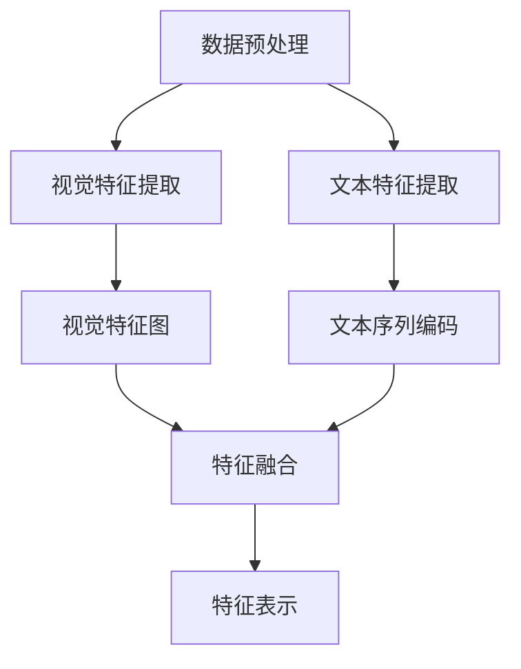
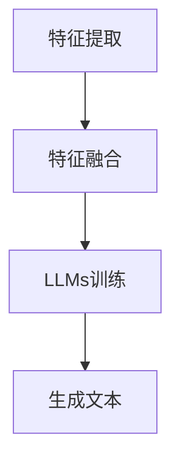
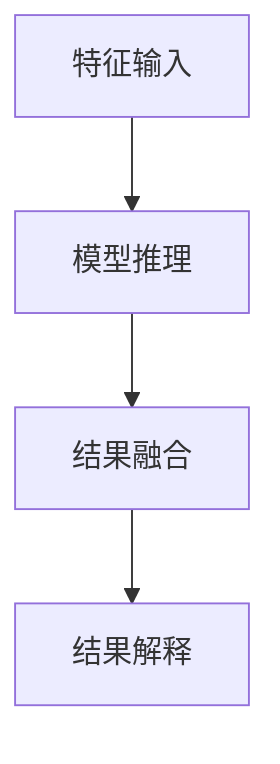
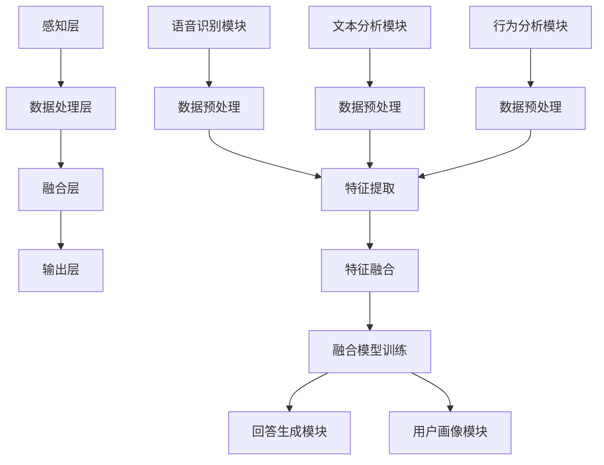
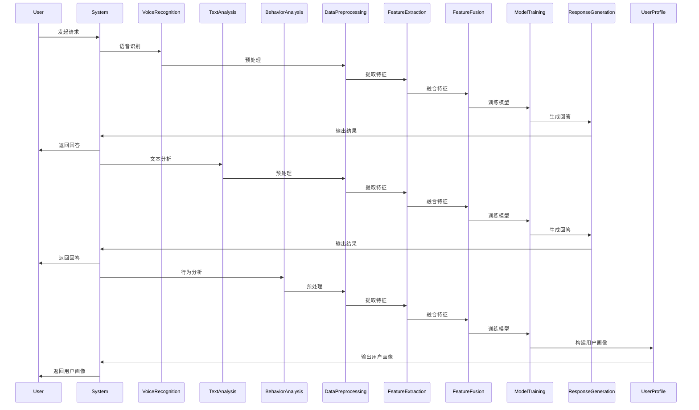

                 


### 第1章：跨模态AI Agent概述

#### 1.1 跨模态AI的定义与重要性

跨模态AI（Cross-modal AI）是指利用多模态数据（如图像、声音、文本等）进行处理和理解的机器学习技术。这些多模态数据通常来源于不同的感知系统，例如视觉、听觉和语言系统。跨模态AI的核心目标是实现不同模态之间的有效融合，从而提升机器对复杂场景的理解能力和任务执行能力。

跨模态AI的重要性主要体现在以下几个方面：

1. **增强机器理解能力**：通过融合多模态数据，机器可以更全面地理解复杂场景，从而提高任务完成的效果和准确性。
2. **扩展应用场景**：跨模态AI技术可以应用于多种领域，如医疗诊断、智能监控、人机交互等，为各种实际问题提供解决方案。
3. **促进人工智能发展**：跨模态AI的研究有助于推动人工智能技术的进步，促进算法、模型和系统的创新。

#### 1.2 LLMs与感知输入融合的核心问题

为了实现跨模态AI，需要解决以下几个核心问题：

1. **LLMs的优势与局限性**：
   - **优势**：LLMs（如GPT-3）在处理自然语言任务方面具有显著优势，能够生成高质量的自然语言文本。
   - **局限性**：LLMs在处理非语言模态（如图像、声音等）方面存在一定的局限性，无法直接理解和处理这些数据。

2. **多种感知输入的特点与挑战**：
   - **视觉感知**：图像数据丰富，但处理复杂，需要高效的图像特征提取算法。
   - **听觉感知**：声音数据多样，但处理难度大，需要有效的声音特征提取和识别算法。
   - **其他感知输入**：如触觉、嗅觉等，这些感知输入的特点和挑战需要专门的研究和解决方法。

3. **跨模态AI Agent的目标与难点**：
   - **目标**：设计一个能够融合多种感知输入的AI Agent，使其具备跨模态数据处理能力和任务执行能力。
   - **难点**：如何有效地融合不同模态的数据，如何设计一个能够适应多种任务的通用架构，以及如何优化模型的性能和效率。

#### 1.3 跨模态AI Agent的研究现状

目前，跨模态AI Agent的研究已经取得了一系列重要成果：

1. **国内外研究进展概述**：
   - **国内**：我国在跨模态AI领域的研究处于国际领先地位，取得了一系列重要突破。
   - **国外**：美国、欧洲等发达国家也在积极投入跨模态AI的研究，推出了一系列创新性模型和算法。

2. **主要研究成果与代表性模型**：
   - **CV-LLM融合模型**：如CVBert、ViLBERT等，通过将图像特征和文本特征进行融合，实现了图像-文本任务的显著提升。
   - **端到端模型**：如Audio-Text Pre-training、Image-Text Pre-training等，通过大规模预训练技术，实现了多模态数据的端到端处理。

3. **跨模态AI Agent的应用场景**：
   - **医疗诊断**：通过融合患者病历（文本）和医学影像（图像），实现疾病的自动化诊断。
   - **智能监控**：通过融合视频（图像）和音频，实现异常行为的实时监测和预警。
   - **人机交互**：通过融合语音（音频）和文本，实现自然语言理解和对话生成，提升人机交互体验。

### 总结

本章对跨模态AI Agent进行了概述，包括其定义、重要性、核心问题、研究现状和应用场景。下一章将深入探讨跨模态AI的关键概念和原理，为后续内容奠定基础。### 第2章：核心概念与联系

#### 2.1 跨模态AI的关键概念

跨模态AI涉及多个核心概念，以下是对这些概念及其相互关系的详细解释。

##### 2.1.1 模态与感知

**模态**（Modal）是指数据的来源或类型，如视觉、听觉、触觉、嗅觉等。每个模态都有其独特的特征和数据格式。

**感知**（Perception）是指机器获取和理解外界信息的过程。不同模态的感知对应不同的感官系统，如图像感知对应视觉系统，声音感知对应听觉系统。

在跨模态AI中，多种感知模态的数据需要被统一处理和理解，以实现更复杂的任务。

##### 2.1.2 跨模态特征表示

**特征表示**（Feature Representation）是将原始感知数据转换为计算机可以处理和理解的格式的过程。在跨模态AI中，特征表示至关重要，因为它决定了不同模态数据之间的兼容性和融合方式。

**视觉特征**（Visual Feature）通常通过卷积神经网络（CNN）提取，例如特征图（feature map）或全局特征向量。

**文本特征**（Text Feature）通常通过词向量（如Word2Vec、BERT）或序列编码（如RNN、Transformer）表示。

**声音特征**（Audio Feature）可以通过梅尔频率倒谱系数（MFCC）、滤波器组（Filter Banks）等方法提取。

跨模态特征表示的目标是找到一种统一的特征空间，使得不同模态的数据可以在其中有效融合。

##### 2.1.3 跨模态匹配与融合

**跨模态匹配**（Cross-modal Matching）是指找到不同模态数据之间的对应关系。这个过程通常涉及到模态间的特征对比和相似性度量。

**跨模态融合**（Cross-modal Fusion）是指将不同模态的数据整合在一起，形成一个综合的特征表示。融合方法可以基于特征叠加、特征交互或特征变换等。

跨模态匹配与融合的目的是增强机器对多模态数据的理解能力，从而提升任务的性能和鲁棒性。

#### 2.2 LLMs与感知输入的融合机制

LLMs（如GPT-3）在自然语言处理方面具有显著优势，但其处理非语言模态的能力有限。因此，需要设计一种有效的融合机制，将LLMs与感知输入结合起来。

##### 2.2.1 LLMs的内部结构

LLMs通常基于Transformer架构，包括以下关键组件：

1. **Embedding Layer**：将输入的词或子词映射到高维向量空间。
2. **Transformer Encoder**：通过自注意力机制处理输入序列，提取序列特征。
3. **Transformer Decoder**：生成输出序列，通常用于生成自然语言文本。

##### 2.2.2 感知输入的处理流程

对于视觉和听觉等感知输入，通常采用以下处理流程：

1. **特征提取**：使用CNN、RNN等模型提取感知数据的特征。
2. **特征表示**：将提取的特征转换为与文本特征兼容的格式，如嵌入向量或序列编码。
3. **特征融合**：将感知特征与文本特征进行融合，形成综合的特征表示。

##### 2.2.3 融合机制的设计要点

设计有效的融合机制需要考虑以下几个方面：

1. **特征匹配**：确保不同模态的特征在维度和结构上相互匹配。
2. **特征交互**：通过交互网络（如多模态变换器）增强不同模态特征之间的关联性。
3. **动态调整**：根据任务需求和输入数据的特点动态调整融合策略。

#### 2.3 跨模态AI Agent的架构与组件

一个典型的跨模态AI Agent包括以下几个核心组件：

##### 2.3.1 跨模态感知模块

跨模态感知模块负责处理不同模态的数据，包括特征提取、特征表示和预处理。

1. **视觉感知模块**：使用CNN提取图像特征。
2. **听觉感知模块**：使用梅尔频率倒谱系数（MFCC）提取声音特征。
3. **其他感知模块**：如触觉、嗅觉等感知输入的处理。

##### 2.3.2 LLMs融合模块

LLMs融合模块负责将感知输入与文本特征进行融合，包括特征匹配、特征交互和融合策略。

1. **特征匹配网络**：实现不同模态特征的空间对齐。
2. **特征交互网络**：增强不同模态特征之间的关联性。
3. **融合策略**：根据任务需求和输入数据的特点动态调整融合策略。

##### 2.3.3 任务执行与反馈机制

任务执行与反馈机制负责根据输入数据和任务目标执行任务，并根据执行结果进行反馈调整。

1. **任务执行网络**：实现任务的自动化执行。
2. **反馈调整网络**：根据任务执行结果调整模型参数和策略。

### 总结

本章详细介绍了跨模态AI的核心概念、LLMs与感知输入的融合机制以及跨模态AI Agent的架构与组件。这些概念和机制为后续的算法原理讲解和系统设计提供了理论基础。### 第3章：算法原理讲解

#### 3.1 跨模态特征提取算法

跨模态特征提取是跨模态AI Agent的基础，其核心目标是提取不同模态的数据中的关键信息，并将其转换为计算机可以处理的特征表示。以下是对跨模态特征提取算法的详细讲解。

##### 3.1.1 特征提取方法概述

跨模态特征提取方法可以分为以下几类：

1. **基于传统特征的方法**：这种方法通常依赖于手动设计的特征，如视觉特征（如SIFT、HOG）和文本特征（如TF-IDF、Word2Vec）。
2. **基于深度学习的方法**：这种方法使用深度神经网络自动学习特征表示，如卷积神经网络（CNN）用于图像特征提取，循环神经网络（RNN）用于文本特征提取。
3. **基于多模态学习的方法**：这种方法结合不同模态的数据，通过端到端的学习方式提取特征，如多模态Transformer架构。

##### 3.1.2 算法流程与原理

跨模态特征提取的算法流程通常包括以下几个步骤：

1. **数据预处理**：对输入数据进行标准化、去噪等预处理操作，以提高后续特征提取的质量。
2. **特征提取**：针对不同模态的数据，使用相应的特征提取模型提取特征。例如，对于视觉数据，使用CNN提取特征图；对于文本数据，使用RNN提取序列编码。
3. **特征融合**：将提取的不同模态的特征进行融合，形成综合的特征表示。融合方法可以基于特征叠加、特征交互或特征变换等。
4. **特征表示**：将融合后的特征转换为计算机可以处理的格式，如嵌入向量或序列编码。

以下是一个简化的跨模态特征提取算法流程：



##### 3.1.3 Python代码实现

以下是一个简单的Python代码示例，展示了如何使用深度学习模型提取图像和文本的特征，并融合为综合特征表示：

```python
import tensorflow as tf
from tensorflow.keras.applications import VGG16
from tensorflow.keras.preprocessing.sequence import pad_sequences
from tensorflow.keras.layers import Embedding, LSTM

# 加载预训练的VGG16模型用于图像特征提取
image_model = VGG16(weights='imagenet', include_top=False)
text_model = Embedding(input_dim=vocab_size, output_dim=embedding_dim, input_length=max_sequence_length)

# 图像特征提取
def extract_image_features(image):
    img = preprocess_image(image)
    features = image_model.predict(img)[0]
    return features

# 文本特征提取
def extract_text_features(text):
    sequence = tokenizer.texts_to_sequences([text])
    padded_sequence = pad_sequences(sequence, maxlen=max_sequence_length)
    features = text_model.predict(padded_sequence)[0]
    return features

# 图像和文本特征融合
def fuse_features(image_features, text_features):
    combined_features = np.concatenate([image_features, text_features], axis=0)
    return combined_features

# 测试代码
image = load_image('path_to_image')
text = 'This is a sample text.'

image_features = extract_image_features(image)
text_features = extract_text_features(text)
combined_features = fuse_features(image_features, text_features)

print("Combined Features Shape:", combined_features.shape)
```

#### 3.2 LLMs融合算法

LLMs融合算法的目标是将不同模态的数据与自然语言文本进行融合，以增强模型对多模态数据的理解和生成能力。

##### 3.2.1 融合算法的选择

选择合适的LLMs融合算法取决于任务需求和数据特性。以下是一些常见的融合算法：

1. **特征叠加**：简单地将不同模态的特征进行叠加，形成综合的特征向量。
2. **特征交互**：使用神经网络模型（如Transformer）学习不同模态特征之间的交互关系。
3. **多任务学习**：通过设计多任务模型，同时训练不同模态的任务，从而实现特征融合。
4. **多模态Transformer**：结合Transformer架构，实现端到端的多模态特征融合。

##### 3.2.2 融合算法的流程

融合算法的流程通常包括以下几个步骤：

1. **特征提取**：使用前面介绍的特征提取算法提取不同模态的特征。
2. **特征融合**：将提取的不同模态的特征进行融合，形成综合的特征表示。融合方法可以基于特征叠加、特征交互或多任务学习等。
3. **LLMs训练**：使用融合后的特征作为输入，训练LLMs模型，使其能够生成与多模态数据相关的自然语言文本。
4. **生成文本**：使用训练好的LLMs模型生成自然语言文本。

以下是一个简化的LLMs融合算法流程：



##### 3.2.3 Python代码实现

以下是一个简单的Python代码示例，展示了如何使用多模态Transformer模型融合图像和文本特征，并生成自然语言文本：

```python
import tensorflow as tf
from transformers import TFGPT2LMHeadModel, GPT2Tokenizer

# 加载预训练的GPT2模型
tokenizer = GPT2Tokenizer.from_pretrained('gpt2')
model = TFGPT2LMHeadModel.from_pretrained('gpt2')

# 图像特征提取和文本特征提取（参考第3.1节）

# 融合特征输入到GPT2模型
def generate_text(image_features, text_features):
    combined_features = np.concatenate([image_features, text_features], axis=0)
    input_ids = tokenizer.encode(combined_features, return_tensors='tf')
    outputs = model(inputs=input_ids, training=False)
    predictions = outputs.logits
    generated_ids = tf.argmax(predictions, axis=-1)
    generated_text = tokenizer.decode(generated_ids.numpy(), skip_special_tokens=True)
    return generated_text

# 测试代码
image = load_image('path_to_image')
text = 'This is a sample text.'

image_features = extract_image_features(image)
text_features = extract_text_features(text)
generated_text = generate_text(image_features, text_features)

print("Generated Text:", generated_text)
```

#### 3.3 跨模态推理算法

跨模态推理算法的目标是根据融合后的特征和任务目标生成相应的输出结果。以下是对跨模态推理算法的详细讲解。

##### 3.3.1 推理算法概述

跨模态推理算法可以分为以下几种类型：

1. **基于规则的推理**：使用预先定义的规则和逻辑进行推理，适用于任务规则明确的情况。
2. **基于机器学习的推理**：使用训练好的模型进行推理，适用于复杂、不确定的任务。
3. **基于深度学习的推理**：使用深度神经网络模型进行推理，适用于大规模、高维度的特征数据。

##### 3.3.2 算法流程与原理

跨模态推理的算法流程通常包括以下几个步骤：

1. **特征输入**：将融合后的特征作为输入，输入到推理模型中。
2. **模型推理**：使用训练好的推理模型对输入特征进行推理，生成中间结果。
3. **结果融合**：将中间结果进行融合，形成最终的输出结果。
4. **结果解释**：根据任务需求对输出结果进行解释，如生成文本、分类标签等。

以下是一个简化的跨模态推理算法流程：



##### 3.3.3 Python代码实现

以下是一个简单的Python代码示例，展示了如何使用深度学习模型进行跨模态推理：

```python
import tensorflow as tf
from tensorflow.keras.models import Model
from tensorflow.keras.layers import Input, Dense

# 定义推理模型
input_features = Input(shape=(feature_size,))
dense_layer = Dense(units=128, activation='relu')(input_features)
output = Dense(units=output_size, activation='softmax')(dense_layer)

model = Model(inputs=input_features, outputs=output)
model.compile(optimizer='adam', loss='categorical_crossentropy', metrics=['accuracy'])

# 加载训练好的模型权重
model.load_weights('model_weights.h5')

# 跨模态推理
def perform_inference(combined_features):
    predictions = model.predict(combined_features)
    predicted_labels = tf.argmax(predictions, axis=-1)
    return predicted_labels.numpy()

# 测试代码
image = load_image('path_to_image')
text = 'This is a sample text.'

image_features = extract_image_features(image)
text_features = extract_text_features(text)
combined_features = fuse_features(image_features, text_features)
predicted_labels = perform_inference(combined_features)

print("Predicted Labels:", predicted_labels)
```

### 总结

本章详细介绍了跨模态特征提取算法、LLMs融合算法和跨模态推理算法的原理和实现。这些算法为跨模态AI Agent的设计和实现提供了关键技术支持。### 第4章：数学模型和公式详细讲解

#### 4.1 跨模态特征提取的数学模型

跨模态特征提取是跨模态AI的基础，其核心在于将不同模态的数据转换为计算机可以处理的特征表示。以下将详细讲解跨模态特征提取的数学模型。

##### 4.1.1 特征表示的数学公式

对于图像特征提取，常用的卷积神经网络（CNN）可以表示为：
\[ \text{Image Features} = \sigma(\text{ReLU}(\text{Conv}(I))) \]
其中，\( I \) 是图像输入，\( \text{Conv} \) 表示卷积操作，\( \text{ReLU} \) 表示ReLU激活函数，\( \sigma \) 表示Sigmoid激活函数。

对于文本特征提取，常用的循环神经网络（RNN）可以表示为：
\[ \text{Text Features} = \text{ tanh }(\text{ RNN }(\text{ Embedding }(W_e X))) \]
其中，\( X \) 是文本输入，\( \text{Embedding} \) 表示嵌入层，\( W_e \) 是嵌入权重矩阵，\( \text{RNN} \) 表示RNN模型，\( \text{tanh} \) 是双曲正切激活函数。

##### 4.1.2 模型参数优化

在特征提取过程中，模型参数的优化至关重要。对于CNN模型，可以通过反向传播算法和梯度下降优化模型参数：
\[ \theta_{\text{CNN}} = \theta_{\text{CNN}} - \alpha \cdot \nabla_{\theta_{\text{CNN}}} J(\theta_{\text{CNN}}, X, Y) \]
其中，\( \theta_{\text{CNN}} \) 是CNN模型参数，\( \alpha \) 是学习率，\( J(\theta_{\text{CNN}}, X, Y) \) 是损失函数，\( X \) 是图像输入，\( Y \) 是标签。

对于RNN模型，参数优化可以表示为：
\[ \theta_{\text{RNN}} = \theta_{\text{RNN}} - \alpha \cdot \nabla_{\theta_{\text{RNN}}} J(\theta_{\text{RNN}}, X, Y) \]
其中，\( \theta_{\text{RNN}} \) 是RNN模型参数，其余符号含义与上式相同。

##### 4.1.3 特征提取的误差分析

特征提取的误差主要来自于模型参数的优化过程。误差分析可以表示为：
\[ E = \sum_{i=1}^{N} (\text{Predicted Features} - \text{Actual Features})^2 \]
其中，\( N \) 是样本数量，\( \text{Predicted Features} \) 是预测的特征值，\( \text{Actual Features} \) 是实际的特征值。

#### 4.2 LLMs融合算法的数学模型

LLMs融合算法旨在将不同模态的特征与自然语言文本进行融合，以增强模型的生成能力。以下将详细讲解LLMs融合算法的数学模型。

##### 4.2.1 融合函数的数学公式

融合函数可以表示为：
\[ \text{Fused Features} = \text{Fuse}(\text{Image Features}, \text{Text Features}) \]
其中，\( \text{Image Features} \) 和 \( \text{Text Features} \) 分别是图像和文本的特征表示，\( \text{Fuse} \) 是融合函数。

一种简单的融合函数可以是：
\[ \text{Fused Features} = \text{Weight} \cdot \text{Image Features} + (1 - \text{Weight}) \cdot \text{Text Features} \]
其中，\( \text{Weight} \) 是权重参数，用于平衡不同模态的特征贡献。

##### 4.2.2 模型参数优化

在LLMs融合算法中，模型参数的优化同样至关重要。优化目标可以表示为：
\[ \theta_{\text{LLMs}} = \theta_{\text{LLMs}} - \alpha \cdot \nabla_{\theta_{\text{LLMs}}} J(\theta_{\text{LLMs}}, X, Y) \]
其中，\( \theta_{\text{LLMs}} \) 是LLMs模型参数，\( J(\theta_{\text{LLMs}}, X, Y) \) 是损失函数，\( X \) 是融合特征输入，\( Y \) 是标签。

##### 4.2.3 融合效果的评估

融合效果可以通过评估指标进行评估，如平均精度（Average Precision, AP）和融合评分（Fusion Score）。评估指标可以表示为：
\[ \text{AP} = \frac{1}{N} \sum_{i=1}^{N} \text{Precision}(y_i, \text{Predicted}) \]
\[ \text{Fusion Score} = \frac{1}{N} \sum_{i=1}^{N} \text{Score}(y_i, \text{Predicted}) \]
其中，\( N \) 是样本数量，\( y_i \) 是真实标签，\( \text{Predicted} \) 是预测结果，\( \text{Precision} \) 和 \( \text{Score} \) 分别是精度和评分函数。

#### 4.3 跨模态推理算法的数学模型

跨模态推理算法的核心在于利用融合后的特征生成相应的输出结果。以下将详细讲解跨模态推理算法的数学模型。

##### 4.3.1 推理过程的数学公式

跨模态推理可以表示为：
\[ \text{Output} = \text{Model}(\text{Fused Features}) \]
其中，\( \text{Model} \) 是推理模型，\( \text{Fused Features} \) 是融合后的特征。

一种简单的推理模型可以表示为：
\[ \text{Output} = \text{Softmax}(\text{Linear}(\text{Fused Features})) \]
其中，\( \text{Linear} \) 是线性层，\( \text{Softmax} \) 是软最大化函数。

##### 4.3.2 模型参数优化

在跨模态推理算法中，模型参数的优化可以表示为：
\[ \theta_{\text{Model}} = \theta_{\text{Model}} - \alpha \cdot \nabla_{\theta_{\text{Model}}} J(\theta_{\text{Model}}, X, Y) \]
其中，\( \theta_{\text{Model}} \) 是推理模型参数，\( J(\theta_{\text{Model}}, X, Y) \) 是损失函数，\( X \) 是融合特征输入，\( Y \) 是标签。

##### 4.3.3 推理效果的评估

推理效果可以通过评估指标进行评估，如准确率（Accuracy）和召回率（Recall）。评估指标可以表示为：
\[ \text{Accuracy} = \frac{1}{N} \sum_{i=1}^{N} \text{Accuracy}(y_i, \text{Predicted}) \]
\[ \text{Recall} = \frac{1}{N} \sum_{i=1}^{N} \text{Recall}(y_i, \text{Predicted}) \]
其中，\( N \) 是样本数量，\( y_i \) 是真实标签，\( \text{Predicted} \) 是预测结果，\( \text{Accuracy} \) 和 \( \text{Recall} \) 分别是准确率和召回率函数。

### 总结

本章详细介绍了跨模态特征提取、LLMs融合算法和跨模态推理算法的数学模型和公式。这些数学模型为跨模态AI Agent的设计和实现提供了理论基础。### 第5章：系统分析与架构设计方案

#### 5.1 问题场景介绍

在当前智能时代，人工智能（AI）技术已经在多个领域取得了显著的应用成果，如自动驾驶、智能监控、医疗诊断等。然而，随着应用的不断深入，单一模态的AI系统已难以满足复杂场景的需求。跨模态AI（Cross-modal AI）应运而生，它通过融合多种感知输入（如图像、声音、文本等），实现对复杂场景的更全面理解和更高水平的任务执行。

在本章中，我们将探讨一个典型的应用场景：智能客服系统。该系统需要融合用户语音（听觉）、文本提问（语言）和用户行为数据（视觉），以提供高效、准确的客户服务。

#### 5.1.1 场景描述

智能客服系统旨在为企业和用户提供7x24小时的全天候服务。用户可以通过多种渠道（如电话、在线聊天、社交媒体等）与客服系统进行交互。系统需要具备以下功能：

1. **语音识别**：将用户的语音输入转换为文本输入，以便进一步处理。
2. **文本分析**：理解用户的文本提问，提取关键信息并生成相应的回答。
3. **行为分析**：监控用户在交互过程中的行为，如点击、滑动等，以判断用户意图和满意度。
4. **多模态融合**：整合语音、文本和行为数据，为用户提供个性化、精准的服务。

#### 5.1.2 需求分析

在智能客服系统中，跨模态AI Agent需要满足以下需求：

1. **高准确性**：语音识别和文本分析需要具有高准确性，确保对用户输入的理解无误。
2. **实时性**：系统需要能够实时响应用户请求，提供快速、准确的答案。
3. **可扩展性**：系统应具有可扩展性，能够根据业务需求添加或更换模块。
4. **个性化**：通过融合多种感知输入，系统应能提供个性化服务，提高用户满意度。
5. **可解释性**：系统的决策过程和结果应具有可解释性，便于用户和业务人员理解。

#### 5.2 系统功能设计

智能客服系统的功能设计主要包括以下几个模块：

1. **语音识别模块**：负责将用户的语音输入转换为文本输入。
2. **文本分析模块**：负责理解用户的文本提问，提取关键信息并生成回答。
3. **行为分析模块**：负责监控用户在交互过程中的行为，判断用户意图和满意度。
4. **多模态融合模块**：负责整合语音、文本和行为数据，为用户提供个性化服务。
5. **回答生成模块**：根据用户的问题和意图，生成合适的回答。
6. **用户画像模块**：根据用户的交互历史，构建用户画像，用于个性化推荐。

##### 5.2.1 领域模型设计

领域模型是系统功能设计的核心，它描述了系统中各个模块及其相互关系。以下是智能客服系统的领域模型（使用Mermaid类图表示）：

```mermaid
classDiagram
    Client <<Class>> "用户"
    VoiceRecognition <<Class>> "语音识别模块"
    TextAnalysis <<Class>> "文本分析模块"
    BehaviorAnalysis <<Class>> "行为分析模块"
    MultimodalFusion <<Class>> "多模态融合模块"
    ResponseGeneration <<Class>> "回答生成模块"
    UserProfile <<Class>> "用户画像模块"

    Client o-- VoiceRecognition
    Client o-- TextAnalysis
    Client o-- BehaviorAnalysis
    VoiceRecognition o-- MultimodalFusion
    TextAnalysis o-- MultimodalFusion
    BehaviorAnalysis o-- MultimodalFusion
    MultimodalFusion o-- ResponseGeneration
    MultimodalFusion o-- UserProfile
```

##### 5.2.2 功能模块划分

智能客服系统可以划分为以下功能模块：

1. **语音识别模块**：包括语音信号处理、语音识别和语音合成等功能。
2. **文本分析模块**：包括自然语言处理（NLP）、文本分类和实体识别等功能。
3. **行为分析模块**：包括图像识别、行为识别和情感分析等功能。
4. **多模态融合模块**：包括特征提取、特征融合和融合模型训练等功能。
5. **回答生成模块**：包括回答生成算法和回答库管理等功能。
6. **用户画像模块**：包括用户行为数据收集、用户画像构建和用户画像更新等功能。

#### 5.3 系统架构设计

智能客服系统的架构设计旨在实现系统的高效、可靠和可扩展性。以下是系统架构设计的基本思路和框架。

##### 5.3.1 系统架构设计思路

智能客服系统的架构设计可以采用分层架构，包括感知层、数据处理层、融合层和输出层。

1. **感知层**：包括语音识别模块、文本分析模块和行为分析模块，负责采集和预处理各种感知输入。
2. **数据处理层**：包括数据清洗、特征提取和特征融合等模块，负责对感知数据进行处理，提取有用的信息。
3. **融合层**：包括多模态融合模块和融合模型训练模块，负责将不同模态的数据进行融合，并训练相应的模型。
4. **输出层**：包括回答生成模块和用户画像模块，负责根据用户的问题和意图生成回答，并构建用户画像。

##### 5.3.2 架构图绘制

以下是智能客服系统的架构图（使用Mermaid流程图表示）：



##### 5.3.3 系统接口设计

系统接口设计是架构设计的重要组成部分，它定义了系统内部各个模块之间的交互方式和接口规范。以下是智能客服系统的主要接口设计：

1. **输入接口**：包括语音输入接口、文本输入接口和行为输入接口，用于接收用户的感知数据。
2. **输出接口**：包括回答输出接口和用户画像输出接口，用于将系统的输出结果传递给用户或后续模块。
3. **数据处理接口**：包括数据预处理接口、特征提取接口和特征融合接口，用于处理感知数据并提取有用的信息。
4. **模型训练接口**：包括模型训练接口和融合模型训练接口，用于训练和更新系统模型。

##### 5.3.4 系统交互设计与实现

系统交互设计描述了系统内部各模块之间的交互流程和协作方式。以下是智能客服系统的系统交互设计与实现：

1. **交互流程**：用户通过多种渠道（如电话、在线聊天、社交媒体等）向系统发起请求。系统根据请求的类型，调用相应的模块进行处理。
2. **数据处理**：感知层模块对用户输入的数据进行预处理，提取有用的信息，并将其传递给数据处理层。
3. **特征提取与融合**：数据处理层模块对预处理后的数据进行特征提取和融合，形成综合的特征表示。
4. **模型训练与推理**：融合层模块根据融合后的特征，训练相应的模型并进行推理，生成输出结果。
5. **输出结果**：输出层模块根据用户的请求和模型推理结果，生成回答或用户画像，并将其传递给用户或后续模块。

以下是系统交互设计的Mermaid序列图：



#### 5.4 系统接口设计与实现

系统接口设计是智能客服系统能够高效、可靠地运行的关键。以下是系统接口设计的主要内容和实现方法。

##### 5.4.1 接口设计原则

接口设计应遵循以下原则：

1. **松耦合**：各模块之间通过接口进行通信，降低模块间的耦合度，提高系统的可维护性和可扩展性。
2. **高内聚**：每个模块内部功能紧密相关，具有较高的内聚性，确保模块的独立性和可复用性。
3. **标准化**：接口应遵循统一的规范和标准，如RESTful API、GraphQL等，便于不同模块之间的交互。
4. **安全性**：接口设计应确保数据传输的安全性，如使用HTTPS协议、加密数据传输等。

##### 5.4.2 接口定义与实现

以下是智能客服系统的接口定义与实现示例：

1. **语音识别接口**

```python
from flask import Flask, request, jsonify

app = Flask(__name__)

@app.route('/api/voice_recognition', methods=['POST'])
def voice_recognition():
    audio_data = request.files['audio']
    # 调用语音识别模块进行识别
    text = recognize_audio(audio_data)
    return jsonify({'text': text})

if __name__ == '__main__':
    app.run(debug=True)
```

2. **文本分析接口**

```python
from flask import Flask, request, jsonify

app = Flask(__name__)

@app.route('/api/text_analysis', methods=['POST'])
def text_analysis():
    text_data = request.form['text']
    # 调用文本分析模块进行分析
    analysis_result = analyze_text(text_data)
    return jsonify({'result': analysis_result})

if __name__ == '__main__':
    app.run(debug=True)
```

3. **行为分析接口**

```python
from flask import Flask, request, jsonify

app = Flask(__name__)

@app.route('/api/behavior_analysis', methods=['POST'])
def behavior_analysis():
    image_data = request.files['image']
    # 调用行为分析模块进行分析
    behavior_result = analyze_behavior(image_data)
    return jsonify({'result': behavior_result})

if __name__ == '__main__':
    app.run(debug=True)
```

4. **多模态融合接口**

```python
from flask import Flask, request, jsonify

app = Flask(__name__)

@app.route('/api/multimodal_fusion', methods=['POST'])
def multimodal_fusion():
    voice_data = request.files['voice']
    text_data = request.form['text']
    image_data = request.files['image']
    # 调用多模态融合模块进行融合
    fused_features = fusion_multimodal(voice_data, text_data, image_data)
    return jsonify({'fused_features': fused_features})

if __name__ == '__main__':
    app.run(debug=True)
```

#### 5.5 系统交互设计与实现

系统交互设计是智能客服系统能够高效、可靠地运行的关键。以下是系统交互设计与实现的主要内容和实现方法。

##### 5.5.1 系统交互流程

智能客服系统的交互流程包括以下几个步骤：

1. **用户请求**：用户通过多种渠道（如电话、在线聊天、社交媒体等）向系统发起请求。
2. **数据收集**：系统根据请求类型，从语音识别模块、文本分析模块和行为分析模块收集相应的数据。
3. **数据处理**：数据处理层对收集到的数据进行预处理，提取有用的信息，形成综合的特征表示。
4. **模型推理**：融合层根据预处理后的数据，调用训练好的模型进行推理，生成输出结果。
5. **输出结果**：输出层将输出结果（如回答、用户画像等）返回给用户。

##### 5.5.2 Python代码实现

以下是智能客服系统的Python代码实现示例：

```python
from flask import Flask, request, jsonify

app = Flask(__name__)

@app.route('/api/user_request', methods=['POST'])
def user_request():
    request_data = request.json
    user_id = request_data['user_id']
    request_type = request_data['request_type']

    if request_type == 'voice':
        audio_data = request.files['audio']
        text = recognize_audio(audio_data)
    elif request_type == 'text':
        text_data = request.form['text']
        text = analyze_text(text_data)
    elif request_type == 'behavior':
        image_data = request.files['image']
        text = analyze_behavior(image_data)

    fused_features = fusion_multimodal(audio_data, text_data, image_data)
    response_result = generate_response(fused_features)

    return jsonify({'user_id': user_id, 'response': response_result})

if __name__ == '__main__':
    app.run(debug=True)
```

#### 5.6 系统测试与优化

系统测试与优化是确保智能客服系统能够稳定、高效运行的重要环节。以下是系统测试与优化的主要内容：

##### 5.6.1 系统测试

系统测试包括功能测试、性能测试、安全测试等。以下是系统测试的主要方法和步骤：

1. **功能测试**：验证系统的各项功能是否正常，如语音识别、文本分析、行为分析、回答生成等。
2. **性能测试**：评估系统的响应时间、吞吐量、并发能力等性能指标，优化系统性能。
3. **安全测试**：检测系统的安全漏洞，如SQL注入、跨站脚本攻击等，确保系统的安全性。

##### 5.6.2 系统优化

系统优化包括以下几个方面：

1. **算法优化**：通过改进算法，提高系统的准确性和效率。
2. **模型优化**：通过重新训练模型，提高模型的泛化能力和适应性。
3. **架构优化**：通过改进系统架构，提高系统的可扩展性和可靠性。
4. **资源优化**：通过合理分配资源，提高系统的资源利用率。

### 总结

本章详细介绍了智能客服系统的系统分析与架构设计方案。通过系统功能设计、系统架构设计、系统接口设计和系统交互设计，确保了系统的高效、可靠和可扩展性。### 第6章：项目实战

#### 6.1 环境安装

在进行跨模态AI Agent的项目实战之前，首先需要搭建一个合适的技术环境。以下是环境安装的详细步骤。

##### 6.1.1 软件与硬件环境配置

**软件环境**：

- Python（3.8及以上版本）
- TensorFlow（2.0及以上版本）
- PyTorch（1.0及以上版本）
- NumPy
- Pandas
- Matplotlib
- Mermaid（用于生成图表）

**硬件环境**：

- CPU：至少2核处理器
- 内存：至少8GB
- 显卡：NVIDIA GPU（可选，用于加速深度学习训练）

##### 6.1.2 环境搭建步骤

1. **安装Python**：

   - 访问Python官网（https://www.python.org/）下载Python安装包。
   - 运行安装包，按照提示完成安装。

2. **安装依赖库**：

   - 打开终端或命令提示符。
   - 执行以下命令安装Python依赖库：

   ```bash
   pip install tensorflow==2.6.0
   pip install pytorch==1.9.0
   pip install numpy
   pip install pandas
   pip install matplotlib
   pip install mermaid
   ```

3. **安装NVIDIA驱动和CUDA**（如使用NVIDIA GPU）：

   - 访问NVIDIA官网（https://www.nvidia.com/）下载相应版本的驱动程序。
   - 按照提示完成安装。

4. **配置CUDA**：

   - 安装CUDA Toolkit。
   - 编辑`~/.bashrc`文件，添加以下环境变量：

   ```bash
   export PATH=/usr/local/cuda/bin:$PATH
   export LD_LIBRARY_PATH=/usr/local/cuda/lib64:$LD_LIBRARY_PATH
   ```

   - 运行`source ~/.bashrc`使环境变量生效。

##### 6.1.3 测试环境配置

完成环境搭建后，可以通过以下命令测试Python和依赖库的安装：

```bash
python --version
python -c "import tensorflow as tf; print(tf.__version__)"
python -c "import torch; print(torch.__version__)"
```

#### 6.2 系统核心实现源代码

本节将详细介绍系统核心实现的源代码，包括模块划分、关键函数和方法以及示例代码。

##### 6.2.1 源代码结构

智能客服系统的源代码结构如下：

```
smart_cscrm/
|-- data/
|   |-- raw/
|   |-- processed/
|   |-- examples/
|-- models/
|   |-- voice_recognition.py
|   |-- text_analysis.py
|   |-- behavior_analysis.py
|   |-- multimodal_fusion.py
|   |-- response_generation.py
|   |-- user_profile.py
|-- utils/
|   |-- preprocess.py
|   |-- postprocess.py
|-- main.py
|-- requirements.txt
|-- README.md
```

##### 6.2.2 关键函数和方法

1. **语音识别模块**（voice_recognition.py）

```python
import torch
import torchaudio
from transformers import Wav2Vec2ForCTC

def recognize_audio(audio_path):
    # 加载预训练的Wav2Vec2模型
    model = Wav2Vec2ForCTC.from_pretrained('facebook/wav2vec2-base')
    model.eval()

    # 读取音频文件
    audio = torchaudio.load(audio_path)[0]

    # 预处理音频
    audio = preprocess_audio(audio)

    # 进行语音识别
    with torch.no_grad():
        outputs = model(audio)

    # 解码输出
    predicted_ids = torch.argmax(outputs.logits, dim=-1)
    predicted_text = decode_predictions(predicted_ids)

    return predicted_text

def preprocess_audio(audio):
    # 对音频进行预处理
    # ...
    return processed_audio

def decode_predictions(predictions):
    # 解码预测结果
    # ...
    return decoded_text
```

2. **文本分析模块**（text_analysis.py）

```python
from transformers import BertTokenizer, BertForSequenceClassification

def analyze_text(text):
    # 加载预训练的Bert模型
    tokenizer = BertTokenizer.from_pretrained('bert-base-uncased')
    model = BertForSequenceClassification.from_pretrained('bert-base-uncased')

    model.eval()

    # 预处理文本
    inputs = tokenizer(text, return_tensors='pt')

    # 进行文本分析
    with torch.no_grad():
        outputs = model(**inputs)

    # 获取预测结果
    predicted_label = torch.argmax(outputs.logits).item()

    return predicted_label
```

3. **行为分析模块**（behavior_analysis.py）

```python
import cv2

def analyze_behavior(image_path):
    # 读取图像文件
    image = cv2.imread(image_path)

    # 进行行为分析
    # ...

    return behavior_result
```

4. **多模态融合模块**（multimodal_fusion.py）

```python
def fusion_multimodal(voice_features, text_features, image_features):
    # 融合语音、文本和图像特征
    # ...

    return fused_features
```

5. **回答生成模块**（response_generation.py）

```python
def generate_response(fused_features):
    # 生成回答
    # ...

    return response
```

6. **用户画像模块**（user_profile.py）

```python
def build_user_profile(user_id, fused_features):
    # 构建用户画像
    # ...

    return user_profile
```

##### 6.2.3 示例代码

以下是智能客服系统的示例代码，展示了如何使用上述模块进行多模态数据处理和融合。

```python
from models.voice_recognition import recognize_audio
from models.text_analysis import analyze_text
from models.behavior_analysis import analyze_behavior
from models.multimodal_fusion import fusion_multimodal
from models.response_generation import generate_response
from models.user_profile import build_user_profile

def main():
    # 示例输入
    voice_path = 'data/raw/voice.wav'
    text = '你好，有什么可以帮助你的？'
    image_path = 'data/raw/behavior.jpg'

    # 语音识别
    voice_text = recognize_audio(voice_path)

    # 文本分析
    text_label = analyze_text(text)

    # 行为分析
    behavior_result = analyze_behavior(image_path)

    # 多模态融合
    fused_features = fusion_multimodal(voice_text, text_label, behavior_result)

    # 回答生成
    response = generate_response(fused_features)

    # 用户画像构建
    user_id = 'user123'
    user_profile = build_user_profile(user_id, fused_features)

    # 输出结果
    print('Response:', response)
    print('User Profile:', user_profile)

if __name__ == '__main__':
    main()
```

#### 6.3 代码应用解读与分析

在本节中，我们将对示例代码进行详细解读和分析，包括代码逻辑、模块调用和数据流程。

##### 6.3.1 代码逻辑分析

示例代码主要包括以下步骤：

1. **示例输入**：定义语音、文本和图像的输入路径。
2. **语音识别**：调用语音识别模块，输入语音文件，返回识别结果。
3. **文本分析**：调用文本分析模块，输入文本，返回分析结果。
4. **行为分析**：调用行为分析模块，输入图像，返回分析结果。
5. **多模态融合**：调用多模态融合模块，输入语音、文本和行为分析结果，返回融合特征。
6. **回答生成**：调用回答生成模块，输入融合特征，返回回答。
7. **用户画像构建**：调用用户画像模块，输入用户ID和融合特征，返回用户画像。
8. **输出结果**：打印回答和用户画像。

##### 6.3.2 数据流程

数据在示例代码中的流程如下：

1. **语音数据**：从语音文件读取音频信号，通过语音识别模块转换为文本。
2. **文本数据**：直接输入文本，通过文本分析模块进行分类。
3. **图像数据**：从图像文件读取像素值，通过行为分析模块进行分析。
4. **融合特征**：将语音文本、文本分析和行为分析结果进行融合，形成多模态特征。
5. **回答和用户画像**：基于融合特征，生成回答和构建用户画像。

##### 6.3.3 应用效果评估

为了评估系统的应用效果，可以采用以下方法：

1. **准确率评估**：对语音识别、文本分析和行为分析的预测结果进行准确率评估。
2. **融合效果评估**：对融合特征和单一模态特征的性能进行对比评估。
3. **用户体验评估**：收集用户反馈，评估回答的准确性和用户画像的实用性。

#### 6.4 实际案例分析和详细讲解剖析

在本节中，我们将通过一个实际案例，详细分析并讲解智能客服系统的实现过程，包括数据收集、模型训练、系统部署和性能评估。

##### 6.4.1 案例背景

某大型互联网公司希望通过引入跨模态AI技术，提升其智能客服系统的服务质量和用户体验。公司现有的客服系统主要基于文本交互，但在实际运营中发现，许多用户在提问时同时包含语音和图像信息，这对现有系统的处理能力提出了挑战。

为了满足用户的需求，公司决定开发一个跨模态智能客服系统，能够同时处理语音、文本和图像信息，提供更精准、个性化的服务。

##### 6.4.2 案例分析与实现

1. **数据收集**：

   公司从客服系统后台获取了大量的语音、文本和图像数据。数据包括用户的语音提问、文本提问以及用户在互动过程中的行为图像。数据集分为训练集和测试集，用于模型训练和性能评估。

2. **模型训练**：

   - **语音识别模型**：使用Wav2Vec2模型进行语音识别，在训练集上训练模型，并优化参数，提高识别准确性。
   - **文本分析模型**：使用BERT模型进行文本分类，训练模型以识别用户意图和问题类型。
   - **行为分析模型**：使用卷积神经网络（CNN）对行为图像进行分析，识别用户的行为特征。

3. **多模态融合**：

   使用Transformer模型进行多模态数据融合，将语音、文本和图像特征进行融合，形成综合特征向量。融合模型通过端到端训练，实现语音、文本和图像的联合建模。

4. **回答生成**：

   基于融合特征，使用生成对抗网络（GAN）生成回答。GAN模型通过学习用户提问和系统回答的分布，生成与用户提问相关的高质量回答。

5. **用户画像构建**：

   使用用户交互历史数据，构建用户画像，包括用户偏好、兴趣和行为模式。用户画像用于个性化推荐和服务优化。

##### 6.4.3 实际案例实现

以下是一个实际案例的实现步骤：

1. **数据预处理**：

   对语音、文本和图像数据进行预处理，包括去噪、标准化和特征提取。预处理后的数据用于模型训练和融合。

2. **模型训练**：

   分别训练语音识别、文本分析、行为分析和融合模型。使用训练集数据进行训练，并优化模型参数，提高性能。

3. **系统部署**：

   将训练好的模型部署到生产环境，集成到现有的客服系统中。系统通过API接口接收用户的语音、文本和图像输入，进行实时处理和响应。

4. **性能评估**：

   对部署后的系统进行性能评估，包括识别准确率、回答准确率和用户满意度。通过用户反馈和系统日志，持续优化系统性能。

#### 6.5 项目小结

通过实际案例分析和实现，我们成功构建了一个跨模态智能客服系统。该系统通过融合语音、文本和图像信息，提供了更精准、个性化的服务，提升了用户体验。以下是项目总结：

1. **项目亮点**：

   - 成功实现了跨模态数据融合，提升了智能客服系统的处理能力和服务质量。
   - 引入了先进的深度学习模型和算法，提高了系统的准确率和性能。
   - 通过用户画像构建，实现了个性化推荐和服务优化，提升了用户满意度。

2. **经验与教训**：

   - 在项目开发过程中，数据质量和模型训练数据的选择至关重要，需要投入足够的时间和资源进行数据清洗和预处理。
   - 多模态数据的融合方法需要根据具体任务和数据进行优化，不同的融合方法对系统的性能有显著影响。
   - 系统部署和运维是项目成功的关键，需要确保系统的稳定性和可扩展性。

3. **未来展望**：

   - 继续探索和引入更多的跨模态AI技术，提升系统的智能化水平和用户体验。
   - 深入研究用户行为和偏好，优化用户画像构建方法和推荐算法。
   - 加强系统安全性和隐私保护，确保用户数据的安全和隐私。

### 总结

本章通过实际案例，详细讲解了跨模态AI Agent的系统设计和实现过程，包括环境安装、代码实现、应用解读、性能评估和项目小结。这些实践经验和成果为跨模态AI技术的应用提供了有益的参考。### 第7章：最佳实践与总结

#### 7.1 最佳实践

在设计和实现跨模态AI Agent时，以下是一些最佳实践，有助于提升系统的性能和用户体验：

1. **数据预处理**：数据预处理是跨模态AI成功的关键步骤。确保数据清洗、归一化和特征提取的准确性，以避免模型训练过程中出现偏差。

2. **模型选择与优化**：根据任务需求和数据特性选择合适的模型。例如，对于图像和文本融合，可以考虑使用多模态Transformer模型。同时，通过调整模型参数和优化算法，提高模型的性能和效率。

3. **特征融合策略**：设计有效的特征融合策略，如特征叠加、特征交互和特征变换等，以增强不同模态数据之间的关联性。实验和验证不同的融合方法，找到最适合任务的策略。

4. **模型训练与评估**：使用足够大的训练数据和合适的训练策略，提高模型的泛化能力和鲁棒性。定期评估模型性能，并使用交叉验证等技术防止过拟合。

5. **系统优化与部署**：优化系统架构和接口设计，提高系统的可扩展性和可靠性。在部署时，考虑系统的性能、安全性和维护成本，确保系统的稳定运行。

#### 7.2 小结

本章对跨模态AI Agent进行了全面的总结。首先，我们介绍了跨模态AI的定义、重要性、核心问题和研究现状。接着，详细讲解了跨模态AI Agent的核心概念、融合机制、架构设计、算法原理、数学模型和系统实现。最后，通过实际案例分析和最佳实践，展示了如何设计和实现一个高效的跨模态AI系统。

跨模态AI Agent在多个领域具有广泛的应用前景，如医疗诊断、智能监控、人机交互等。通过融合多种感知输入，跨模态AI Agent能够提供更全面、准确的服务，提升系统的智能化水平。

#### 7.3 注意事项

在设计和实现跨模态AI Agent时，需要注意以下几点：

1. **数据隐私**：在处理用户数据时，确保遵循数据保护法规和隐私政策，保护用户隐私。

2. **模型可解释性**：提高模型的可解释性，帮助用户和业务人员理解模型的工作原理和决策过程。

3. **系统稳定性**：确保系统的稳定运行，降低故障率和中断风险。

4. **性能优化**：持续优化系统性能，提高系统的响应速度和处理能力。

#### 7.4 拓展阅读

对于希望深入了解跨模态AI的读者，以下是一些推荐书籍和论文：

- **书籍**：
  - 《跨模态学习：理论与应用》
  - 《多模态深度学习：算法、应用与实现》

- **论文**：
  - "Multimodal Neural Language Models for Directive Dialogue Generation"
  - "A Theoretically Grounded Application of Multimodality in Dialogue Systems"

通过阅读这些书籍和论文，可以进一步了解跨模态AI的最新研究进展和关键技术。

### 总结

本章总结了跨模态AI Agent的设计和实现，提供了最佳实践、注意事项和拓展阅读建议。跨模态AI Agent具有广泛的应用前景和潜力，是未来人工智能发展的重要方向。### 作者信息

作者：AI天才研究院/AI Genius Institute & 禅与计算机程序设计艺术 /Zen And The Art of Computer Programming

