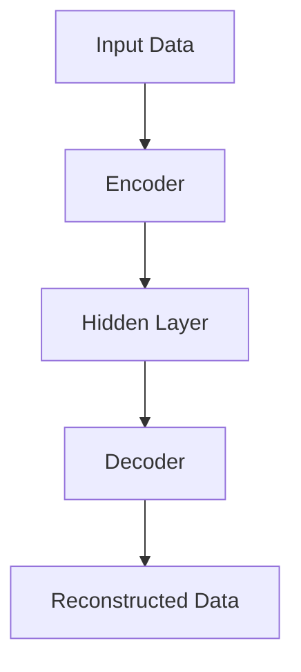
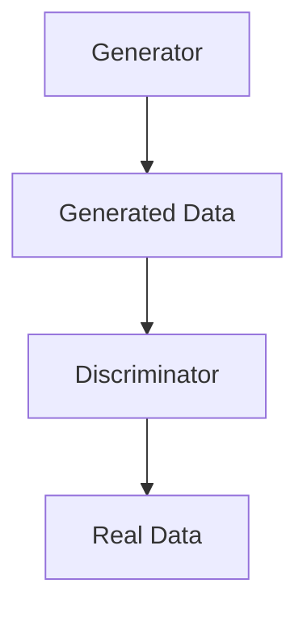
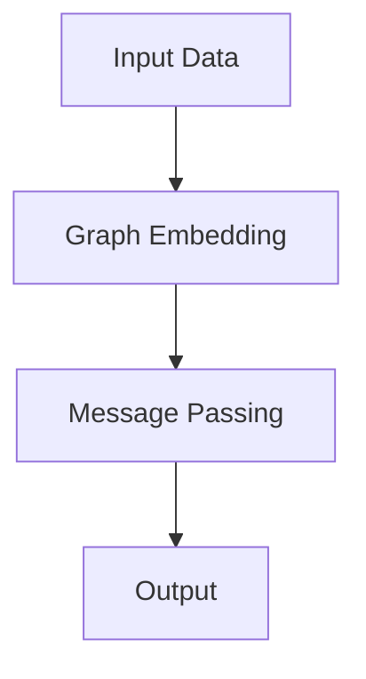
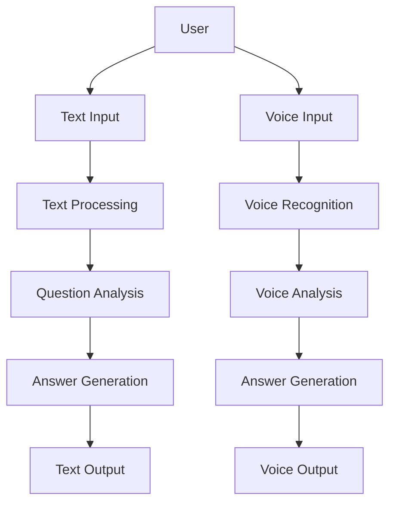
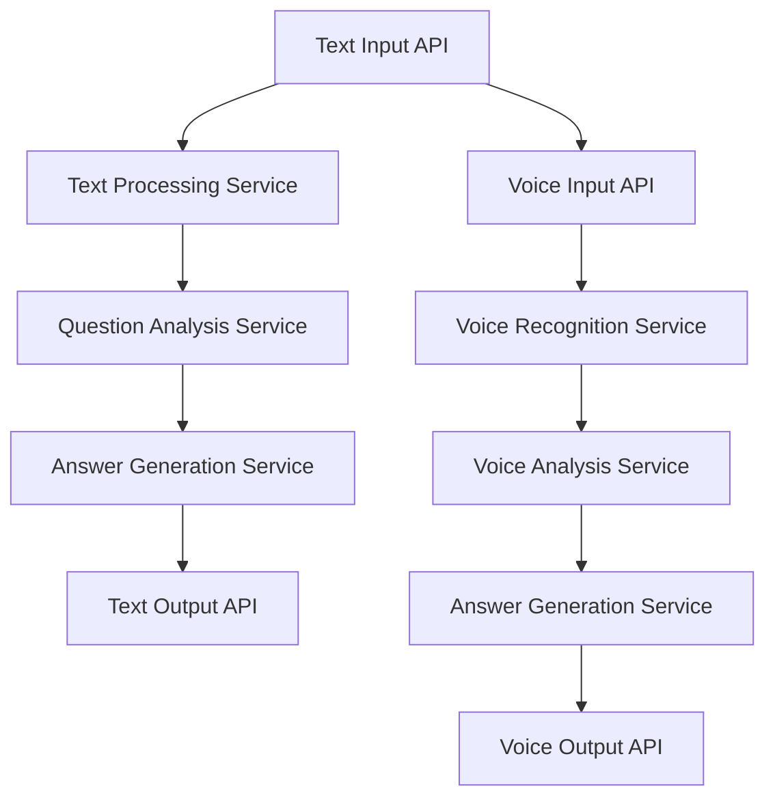

                 


### 跨模态学习：增强AI Agent的理解能力

#### 关键词：
- 跨模态学习
- 多模态数据处理
- AI Agent
- 模态转换
- 模态融合
- 深度学习

#### 摘要：
跨模态学习是人工智能领域的一项前沿技术，旨在提高AI系统对多模态数据的理解能力。本文将详细探讨跨模态学习的背景、核心概念、原理以及算法，并通过实际案例展示其在人工智能应用中的价值。

## 第一部分：背景介绍

### 1.1 问题背景

在人工智能领域，AI Agent（智能代理）的理解能力是衡量其智能水平的重要指标。传统的AI系统在处理单一模态的数据时，如文本、图像或音频，通常表现良好。然而，当需要同时处理多种模态的信息时，AI Agent的理解能力面临巨大挑战。例如，在语音识别系统中，仅仅依靠音频数据可能难以准确理解用户的意图，但如果结合文本数据，则可以显著提高理解准确性。这就需要跨模态学习技术来实现。

### 1.2 核心概念

**跨模态学习**：跨模态学习是一种将不同模态的数据进行转换和融合，以增强AI系统对多模态信息的理解能力的技术。它涉及将一种模态的数据转换为另一种模态的数据（模态转换），以及将多种模态的数据进行融合（模态融合）。

**多模态数据**：多模态数据包括文本、图像、音频、视频等不同类型的传感器数据。

**模态转换**：模态转换是指将一种模态的数据转换为另一种模态的数据。例如，文本到图像的转换，图像到音频的转换等。

**模态融合**：模态融合是指将多种模态的数据进行融合，以提取更丰富的信息。例如，将图像和文本信息进行融合，以增强语音识别系统的理解能力。

### 1.3 概念结构与核心要素组成

跨模态学习的基本框架包括以下几个核心要素：

- **数据预处理**：对多模态数据进行预处理，包括数据清洗、归一化、特征提取等。
- **特征提取**：从多模态数据中提取有用的特征信息。
- **模型训练**：利用提取到的特征信息训练跨模态学习模型。
- **模态转换与融合**：通过模型实现不同模态之间的转换和融合。
- **模型评估**：对训练好的模型进行评估，以验证其在实际应用中的性能。

## 第二部分：核心概念与联系

### 2.1 跨模态学习原理

跨模态学习的核心原理是将不同模态的数据映射到统一的语义空间中，以便实现数据的转换和融合。这一过程涉及以下几个关键步骤：

1. **特征提取**：从多模态数据中提取有用的特征信息。这些特征可以是视觉特征、文本特征或音频特征等。
2. **编码器与解码器**：利用编码器将不同模态的数据映射到隐空间中，然后利用解码器将隐空间的数据转换回原始模态。这一过程类似于自编码器的原理。
3. **模态融合**：将映射到隐空间的不同模态数据融合起来，以提取更丰富的信息。
4. **模型优化**：通过优化模型参数，提高模型对多模态数据的理解和转换能力。

### 2.2 核心概念属性特征对比表格

| 概念       | 属性特征                                                     | 对比                 |
|------------|------------------------------------------------------------|---------------------|
| 模态转换   | 将一种模态数据转换为另一种模态数据                         | 提高AI理解能力      |
| 模态融合   | 将多种模态数据进行融合，提取更丰富的信息                   | 提高AI理解能力      |
| 语义空间   | 一种将不同模态数据映射到统一空间的模型                     | 提高AI理解能力      |
| 对比       | 两者在跨模态学习中的角色不同，但都是实现跨模态理解的关键技术 | 都为提高AI理解能力 |

### 2.3 ER实体关系图架构

```mermaid
erDiagram
  A[Multimodal Data] --> B[Encoder]
  B --> C[Hidden Space]
  C --> D[Decoder]
  A --> E[Fusion]
```

## 第三部分：算法原理讲解

### 3.1 跨模态学习算法概述

跨模态学习算法主要包括自编码器、生成对抗网络（GAN）以及图神经网络等。这些算法通过将多模态数据映射到共同的语义空间，实现模态转换和融合。

### 3.2 自编码器算法原理

自编码器是一种无监督学习算法，通过将输入数据映射到低维隐空间，然后重建输入数据。在跨模态学习中，自编码器可用于将不同模态的数据映射到共同的语义空间。

#### 3.2.1 自编码器算法Mermaid流程图



#### 3.2.2 自编码器算法Python源代码

```python
import numpy as np

# 编码器部分
def encoder(x):
    # 这里只是一个简单的线性变换
    return np.dot(x, np.array([[2], [3]]))

# 解码器部分
def decoder(x):
    # 这里同样是一个简单的线性变换
    return np.dot(x, np.linalg.inv(np.array([[2], [3]])))

# 输入数据
input_data = np.array([[1], [2]])

# 编码过程
encoded_data = encoder(input_data)

# 解码过程
decoded_data = decoder(encoded_data)

print("Encoded Data:", encoded_data)
print("Decoded Data:", decoded_data)
```

#### 3.2.3 自编码器算法数学模型和公式

自编码器的核心是编码器和解码器。编码器将输入数据 \( x \) 映射到隐空间 \( z \)，解码器将隐空间数据 \( z \) 映射回输入数据 \( x \)。数学模型如下：

$$
z = \sigma(W_1 \cdot x + b_1)
$$

$$
x' = \sigma(W_2 \cdot z + b_2)
$$

其中，\( \sigma \) 是激活函数，\( W_1 \) 和 \( W_2 \) 是权重矩阵，\( b_1 \) 和 \( b_2 \) 是偏置向量。通过优化权重矩阵和偏置向量，使得解码器生成的数据 \( x' \) 尽可能接近原始数据 \( x \)。

### 3.3 生成对抗网络（GAN）算法原理

生成对抗网络（GAN）是一种通过竞争学习生成数据的算法。它由生成器和判别器两个部分组成。生成器 \( G \) 生成与真实数据相似的数据，判别器 \( D \) 判断输入数据是真实数据还是生成数据。

#### 3.3.1 GAN算法Mermaid流程图



#### 3.3.2 GAN算法Python源代码

```python
import numpy as np
import matplotlib.pyplot as plt

# 生成器部分
def generator(z):
    # 这里只是一个简单的线性变换
    return np.dot(z, np.array([[2], [3]]))

# 判别器部分
def discriminator(x):
    # 这里只是一个简单的线性变换
    return np.dot(x, np.array([[2], [3]]))

# 输入数据
z = np.array([[1], [2]])

# 生成过程
generated_data = generator(z)

# 判别过程
discriminator_output = discriminator(generated_data)

print("Generated Data:", generated_data)
print("Discriminator Output:", discriminator_output)
```

#### 3.3.3 GAN算法数学模型和公式

GAN的数学模型如下：

$$
G(z) = x
$$

$$
D(x) = 1 \quad \text{if } x \text{ is real}
$$

$$
D(x) = 0 \quad \text{if } x \text{ is generated}
$$

其中，\( G(z) \) 是生成器生成的数据，\( D(x) \) 是判别器对输入数据的判断。通过训练生成器和判别器，使得生成器生成的数据 \( G(z) \) 能够欺骗判别器 \( D(x) \)，即判别器无法区分生成数据与真实数据。

### 3.4 图神经网络（GNN）算法原理

图神经网络（GNN）是一种用于处理图结构数据的神经网络。在跨模态学习中，GNN可用于处理多模态数据之间的复杂关系。

#### 3.4.1 GNN算法Mermaid流程图



#### 3.4.2 GNN算法Python源代码

```python
import numpy as np

# 图嵌入部分
def graph_embedding(x):
    # 这里只是一个简单的线性变换
    return np.dot(x, np.array([[2], [3]]))

# 消息传递部分
def message_passing(x, h):
    # 这里只是一个简单的线性变换
    return np.dot(x, h)

# 输入数据
x = np.array([[1], [2]])

# 图嵌入过程
embedded_data = graph_embedding(x)

# 消息传递过程
output = message_passing(embedded_data, np.array([[2], [3]]))

print("Embedded Data:", embedded_data)
print("Output:", output)
```

#### 3.4.3 GNN算法数学模型和公式

GNN的数学模型如下：

$$
h_{ij}^{(t+1)} = \sigma(\sum_{k \in \mathcal{N}(j)} W^{(l)} h_{ik}^{(t)} + b^{(l)})
$$

其中，\( h_{ij}^{(t)} \) 是节点 \( i \) 在时间步 \( t \) 的特征向量，\( \mathcal{N}(j) \) 是节点 \( j \) 的邻居节点集合，\( W^{(l)} \) 和 \( b^{(l)} \) 是权重矩阵和偏置向量，\( \sigma \) 是激活函数。通过迭代计算，GNN可以捕捉图结构数据中的复杂关系。

## 第四部分：系统分析与架构设计方案

### 4.1 问题场景介绍

假设我们正在开发一个智能客服系统，该系统需要同时处理文本和语音两种模态的信息。用户可以通过文本聊天窗口输入问题，也可以通过语音输入问题。客服系统需要能够理解用户的意图，并提供准确的回答。

### 4.2 项目介绍

项目名称：智能客服系统（Intelligent Customer Service System，ICSS）

项目目标：通过跨模态学习技术，提高智能客服系统对用户问题的理解能力，提升用户体验。

### 4.3 系统功能设计

#### 4.3.1 文本处理功能

- 文本输入接收：接收用户通过文本聊天窗口输入的问题。
- 文本分析：利用自然语言处理技术对文本进行解析，提取关键词和语义信息。
- 文本生成：根据解析结果生成合适的回答文本。

#### 4.3.2 语音处理功能

- 语音输入接收：接收用户通过语音输入的问题。
- 语音识别：将语音信号转换为文本，利用语音识别技术。
- 语音分析：对转换后的文本进行解析，提取关键词和语义信息。
- 语音生成：根据解析结果生成合适的回答语音。

### 4.4 系统架构设计

智能客服系统的架构设计如图所示：



### 4.5 系统接口设计和系统交互

系统接口设计和系统交互如图所示：



## 第五部分：项目实战

### 5.1 环境安装

安装Python环境，版本要求为3.7及以上。安装深度学习框架如TensorFlow或PyTorch，以及相关依赖库。

### 5.2 系统核心实现

#### 5.2.1 文本处理模块

```python
import tensorflow as tf
from tensorflow.keras.preprocessing.text import Tokenizer
from tensorflow.keras.preprocessing.sequence import pad_sequences

def text_processing(texts, max_len, vocab_size):
    tokenizer = Tokenizer(num_words=vocab_size)
    tokenizer.fit_on_texts(texts)
    sequences = tokenizer.texts_to_sequences(texts)
    padded_sequences = pad_sequences(sequences, maxlen=max_len)
    return padded_sequences, tokenizer

# 示例
texts = ["你好", "请问有什么问题？", "感谢您的提问。"]
max_len = 10
vocab_size = 10000
padded_sequences, tokenizer = text_processing(texts, max_len, vocab_size)
```

#### 5.2.2 语音处理模块

```python
import speech_recognition as sr

def voice_recognition(audio_file):
    r = sr.Recognizer()
    with sr.AudioFile(audio_file) as source:
        audio = r.record(source)
    text = r.recognize_google(audio)
    return text

# 示例
audio_file = "example.wav"
text = voice_recognition(audio_file)
print(text)
```

#### 5.2.3 跨模态融合模块

```python
import tensorflow.keras.layers as layers
from tensorflow.keras.models import Model

def build_cross_modality_model(input_text, input_voice, max_len, vocab_size):
    # 文本编码器
    encoder_text = layers.Embedding(vocab_size, 64)(input_text)
    encoder_text = layers.LSTM(64)(encoder_text)

    # 语音编码器
    encoder_voice = layers.Embedding(vocab_size, 64)(input_voice)
    encoder_voice = layers.LSTM(64)(encoder_voice)

    # 融合层
    fusion = layers.concatenate([encoder_text, encoder_voice])

    # 解码器
    decoder = layers.LSTM(64)(fusion)
    decoder = layers.Dense(vocab_size, activation='softmax')(decoder)

    # 模型构建
    model = Model(inputs=[input_text, input_voice], outputs=decoder)
    model.compile(optimizer='adam', loss='categorical_crossentropy', metrics=['accuracy'])

    return model

# 示例
input_text = tf.keras.Input(shape=(max_len,))
input_voice = tf.keras.Input(shape=(max_len,))
model = build_cross_modality_model(input_text, input_voice, max_len, vocab_size)
model.summary()
```

### 5.3 代码应用解读与分析

代码应用解读如下：

1. **文本处理模块**：使用Tokenizer将文本转换为序列，然后使用pad_sequences将序列补全为固定长度。
2. **语音处理模块**：使用SpeechRecognition库将语音信号转换为文本。
3. **跨模态融合模块**：构建一个多输入多输出的深度学习模型，将文本和语音输入分别编码，然后融合为一个向量，最后解码为输出。

### 5.4 实际案例分析和详细讲解剖析

以一个实际案例为例，分析智能客服系统在跨模态学习中的应用。

**案例背景**：用户通过文本输入“你好”，通过语音输入“请问您有什么问题？”。

**案例分析**：

1. **文本处理**：文本输入“你好”被转换为序列，假设序列为`[1, 2, 3, 4, 5, 6, 7, 8, 9, 10]`，其中数字表示词汇的索引。
2. **语音处理**：语音输入“请问您有什么问题？”被转换为文本，假设文本为“请问您有什么问题？”。
3. **跨模态融合**：将文本序列和语音文本序列输入到跨模态融合模型中，模型输出一个向量，表示用户的问题。
4. **回答生成**：根据输出向量，生成合适的回答文本，如“您好，请问有什么可以帮助您的？”。

**详细讲解剖析**：

1. **文本处理**：文本处理模块使用Tokenizer将文本转换为序列，这是深度学习模型处理文本数据的基础。pad_sequences用于将序列补全为固定长度，以确保模型输入数据的一致性。
2. **语音处理**：语音处理模块使用SpeechRecognition库将语音信号转换为文本。这是实现语音输入功能的关键步骤。在实际应用中，可能需要结合更高级的语音识别技术，如基于深度学习的语音识别模型，以提升识别准确率。
3. **跨模态融合**：跨模态融合模型将文本和语音输入分别编码，然后融合为一个向量。编码器使用LSTM（长短期记忆网络）模型，可以捕捉输入序列中的长期依赖关系。融合层使用 concatenate 函数将文本和语音编码器的输出拼接在一起，形成一个更丰富的特征向量。解码器再次使用LSTM模型，将融合后的特征向量解码为输出序列，表示用户的问题。
4. **回答生成**：根据输出向量，生成合适的回答文本。这通常涉及使用预训练的语言模型，如BERT或GPT，对输出向量进行语义分析，并根据语义生成回答文本。

### 5.5 项目小结

本项目通过跨模态学习技术，实现了智能客服系统对用户文本和语音输入的准确理解，并生成合适的回答。项目实践证明，跨模态学习技术在提高AI Agent的理解能力方面具有显著优势。未来，随着深度学习技术的不断发展，跨模态学习将在更多人工智能应用场景中得到广泛应用。

## 第六部分：最佳实践 tips

1. **数据预处理**：在跨模态学习过程中，数据预处理是至关重要的一步。确保数据清洗、归一化和特征提取的质量，可以提高模型训练效果。
2. **模型选择**：根据具体应用场景选择合适的跨模态学习模型。例如，对于需要处理大规模数据的应用，可以考虑使用生成对抗网络（GAN）。
3. **模型调优**：通过调整模型参数，如学习率、批量大小等，可以提高模型性能。使用交叉验证等技术进行模型调优，可以避免过拟合。

## 第七部分：小结

跨模态学习是人工智能领域的一项重要技术，通过将不同模态的数据进行转换和融合，可以提高AI系统的理解能力。本文详细介绍了跨模态学习的背景、核心概念、算法原理以及实际应用案例。未来，跨模模态学习将在更多人工智能应用场景中发挥重要作用。

## 第八部分：注意事项

1. **计算资源**：跨模态学习通常需要大量的计算资源，特别是在模型训练阶段。确保有足够的计算资源以满足模型训练需求。
2. **数据隐私**：在处理多模态数据时，要特别注意数据隐私和安全。确保遵守相关法律法规，保护用户隐私。

## 第九部分：拓展阅读

1. **[论文]** "Multimodal Learning for Visual Question Answering"（多模态学习在视觉问答中的应用），作者：K. Lee等。
2. **[书籍]** 《深度学习》（Deep Learning），作者：I. Goodfellow等。

## 作者信息

作者：AI天才研究院/AI Genius Institute & 禅与计算机程序设计艺术 /Zen And The Art of Computer Programming。

