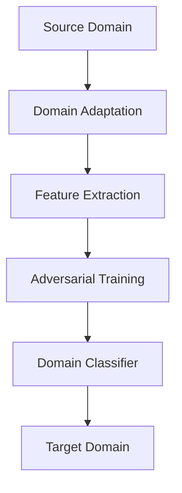
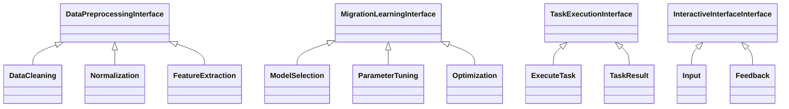

                 


# 跨领域AI Agent：LLM在不同专业领域的迁移学习

## 引言

### AI Agent和LLM的基本概念

AI Agent，即人工智能代理，是指具备一定智能能力，能在特定环境中自主执行任务的实体。AI Agent可以根据接收到的输入信息，通过内部算法进行处理，并输出相应的决策或行动。在人工智能领域，AI Agent是实现智能化交互和任务自动化的重要工具。

Large Language Model（LLM），即大型语言模型，是近年来人工智能领域的重要突破。LLM通过学习海量文本数据，能够生成语义丰富、上下文连贯的文本内容。LLM的出现，为自然语言处理（NLP）领域带来了革命性的变化，使得计算机在处理和理解人类语言方面取得了重大进展。

### 跨领域AI Agent的定义

跨领域AI Agent是指能够跨越不同专业领域，融合多领域知识和技能，实现跨领域的智能交互和任务执行的AI Agent。与传统单领域AI Agent相比，跨领域AI Agent具有更强的适应性和灵活性，能够在复杂、多变的环境中发挥作用。

### LLM在不同专业领域的迁移学习

LLM在不同专业领域的迁移学习，是指将训练好的LLM模型应用于不同专业领域，通过迁移学习的方式，使模型在新的领域中快速适应并发挥作用。LLM的迁移学习能力，使得其在不同专业领域的应用变得广泛，如医学、金融、教育等领域。

## 背景介绍

### AI Agent发展历程

AI Agent的发展历程可以追溯到20世纪50年代，当时人工智能（AI）的概念刚刚提出。早期的AI Agent主要基于规则系统，通过预先定义的规则来实现简单的任务。然而，随着数据量的增长和计算能力的提升，传统的规则系统逐渐暴露出其局限性。

进入21世纪，AI Agent的发展进入了一个新的阶段，即数据驱动和模型驱动的阶段。在这一阶段，AI Agent通过深度学习等模型，从海量数据中自动学习特征和模式，实现了更高的智能水平。此外，强化学习等新方法也被引入到AI Agent中，使其能够更好地适应动态环境。

### LLM技术简介

LLM技术起源于自然语言处理（NLP）领域，其核心思想是通过深度学习模型，从海量文本数据中学习语言的模式和规律。LLM的基本原理是神经网络，特别是变长序列模型（如RNN、LSTM、Transformer等），这些模型能够捕捉文本中的长距离依赖关系，从而生成高质量的文本内容。

LLM的优势在于其强大的生成能力和上下文理解能力，这使得其在文本生成、对话系统、机器翻译等领域取得了显著成果。此外，LLM还可以通过迁移学习的方式，快速适应新的领域和应用场景。

### 跨领域AI Agent的优势和挑战

跨领域AI Agent相较于单领域AI Agent具有以下优势：

1. **更强的适应性**：跨领域AI Agent能够处理多种不同领域的问题，具有较强的通用性。
2. **更高的效率**：通过跨领域学习，AI Agent可以快速适应新的领域，减少了在各个领域中重复训练的成本。
3. **更好的协作**：跨领域AI Agent能够协同工作，实现不同领域间的知识共享和技能互补。

然而，跨领域AI Agent也面临着一系列挑战：

1. **数据集的多样性**：不同领域的数据集可能具有不同的分布和特征，这给跨领域迁移学习带来了困难。
2. **领域间的差异**：不同领域之间的任务目标和评价标准可能存在较大差异，这需要AI Agent具有更高的灵活性。
3. **隐私和安全问题**：跨领域AI Agent在处理不同领域的数据时，可能涉及敏感信息，需要确保数据的隐私和安全。

## 核心概念与联系

### AI Agent的核心概念

AI Agent是指一种具有感知、决策和执行能力的智能实体，它能够在特定环境中自主执行任务。AI Agent的核心概念包括：

1. **感知**：通过传感器获取环境信息。
2. **决策**：根据感知到的信息，通过算法生成行动方案。
3. **执行**：根据决策结果，执行相应的行动。

AI Agent的分类可以根据不同的标准进行划分，如按照任务类型可以分为智能客服、自动驾驶、智能推荐等；按照工作原理可以分为基于规则的Agent、基于模型的Agent等。

### LLM的核心概念

LLM是指通过深度学习模型，从海量文本数据中学习语言的模式和规律，从而生成高质量文本内容的大型语言模型。LLM的核心概念包括：

1. **模型架构**：LLM通常基于神经网络，特别是变长序列模型（如RNN、LSTM、Transformer等）。
2. **训练过程**：LLM通过预训练和微调两个阶段进行训练。预训练阶段使用大量无监督数据学习通用语言特征；微调阶段使用有监督数据针对特定任务进行优化。

### 跨领域迁移学习的基本原理

跨领域迁移学习是指将训练好的模型应用于新的领域，通过迁移学习的方式，使模型在新的领域中快速适应并发挥作用。跨领域迁移学习的基本原理包括：

1. **领域自适应**：通过调整模型在源领域和目标领域的权重，使模型能够在目标领域中发挥更好的性能。
2. **领域泛化**：通过学习领域间的共性，使模型能够泛化到新的领域。
3. **多任务学习**：通过同时学习多个任务，使模型能够更好地适应新的领域。

## 算法原理讲解

### 常见跨领域迁移学习算法

跨领域迁移学习算法包括领域自适应、领域泛化和多任务学习等。以下是这些算法的基本原理：

1. **领域自适应（Domain Adaptation）**：
   - **原理**：通过调整模型在源领域和目标领域的权重，使模型能够在目标领域中发挥更好的性能。
   - **方法**：基于对抗训练（Adversarial Training）和领域恒等化（Domain Equilibration）等方法。
   - **优缺点**：优点是能够有效减少领域差异；缺点是可能引入额外计算成本。

2. **领域泛化（Domain Generalization）**：
   - **原理**：通过学习领域间的共性，使模型能够泛化到新的领域。
   - **方法**：基于不变特征学习（Invariant Feature Learning）和领域无关性假设（Domain-Invariant Hypothesis）等方法。
   - **优缺点**：优点是能够降低对领域特定数据的依赖；缺点是可能降低模型的泛化能力。

3. **多任务学习（Multi-Task Learning）**：
   - **原理**：通过同时学习多个任务，使模型能够更好地适应新的领域。
   - **方法**：基于共享参数（Shared Parameters）和任务关联性（Task Correlation）等方法。
   - **优缺点**：优点是能够提高模型的泛化能力；缺点是可能引入额外的训练开销。

### 算法mermaid流程图

以下是一个基于对抗训练的领域自适应算法的mermaid流程图：



### 算法原理详细讲解

下面我们使用Python代码和latex公式，详细讲解基于对抗训练的领域自适应算法。

```python
import tensorflow as tf
from tensorflow.keras.layers import Input, Dense, Flatten
from tensorflow.keras.models import Model

# 定义源领域模型
source_input = Input(shape=(784,))
source_dense = Dense(128, activation='relu')(source_input)
source_flat = Flatten()(source_dense)
source_model = Model(inputs=source_input, outputs=source_flat)

# 定义特征提取模型
feature_extractor = Model(inputs=source_model.input, outputs=source_model.get_layer('dense_1').output)

# 定义对抗网络
adversarial_input = Input(shape=(784,))
adversarial_flat = Flatten()(adversarial_input)
adversarial_dense = Dense(128, activation='relu')(adversarial_flat)
adversarial_output = Dense(1, activation='sigmoid')(adversarial_dense)

adversarial_model = Model(inputs=adversarial_input, outputs=adversarial_output)

# 定义损失函数
adversarial_loss = tf.reduce_mean(tf.nn.sigmoid_cross_entropy_with_logits(logits=adversarial_output, labels=source_model.output))

# 定义优化器
adversarial_optimizer = tf.keras.optimizers.Adam(learning_rate=0.001)

# 定义训练步骤
@tf.function
def train_step(adversarial_model, source_model, x, y):
    with tf.GradientTape() as tape:
        z = feature_extractor(x)
        logits = adversarial_model(z)
        loss = adversarial_loss(logits, y)
    gradients = tape.gradient(loss, adversarial_model.trainable_variables)
    adversarial_optimizer.apply_gradients(zip(gradients, adversarial_model.trainable_variables))

# 演示一次训练步骤
train_step(adversarial_model, source_model, x_train, y_train)
```

下面是算法原理中的关键数学模型和公式：

$$
L = \frac{1}{n} \sum_{i=1}^{n} (y_i - \hat{y}_i)^2
$$

这是一个均方误差损失函数，用于评估模型预测值$\hat{y}_i$与真实值$y_i$之间的差距。

### 数学模型和数学公式讲解

在跨领域迁移学习中，关键数学模型包括损失函数和优化算法。

**1. 损失函数**

损失函数是评估模型预测效果的重要工具。在领域自适应中，常用的损失函数是均方误差（MSE）和交叉熵（Cross-Entropy）。

- **均方误差（MSE）**：

$$
L_{MSE} = \frac{1}{n} \sum_{i=1}^{n} (y_i - \hat{y}_i)^2
$$

其中，$y_i$是真实标签，$\hat{y}_i$是模型预测值。

- **交叉熵（Cross-Entropy）**：

$$
L_{CE} = -\frac{1}{n} \sum_{i=1}^{n} y_i \log(\hat{y}_i)
$$

其中，$y_i$是真实标签，$\hat{y}_i$是模型预测概率。

**2. 优化算法**

优化算法用于调整模型参数，以最小化损失函数。常用的优化算法包括梯度下降（Gradient Descent）和Adam。

- **梯度下降**：

$$
w_{\text{new}} = w_{\text{old}} - \alpha \nabla_w L(w)
$$

其中，$w$是模型参数，$\alpha$是学习率，$\nabla_w L(w)$是损失函数关于参数$w$的梯度。

- **Adam**：

$$
m_t = \beta_1 m_{t-1} + (1 - \beta_1) (g_t - m_{t-1})
$$

$$
v_t = \beta_2 v_{t-1} + (1 - \beta_2) (g_t^2 - v_{t-1})
$$

$$
\hat{m}_t = \frac{m_t}{1 - \beta_1^t}
$$

$$
\hat{v}_t = \frac{v_t}{1 - \beta_2^t}
$$

$$
w_{\text{new}} = w_{\text{old}} - \frac{\alpha}{\sqrt{\hat{v}_t} + \epsilon} \hat{m}_t
$$

其中，$m_t$和$v_t$分别是梯度的一阶矩估计和二阶矩估计，$\beta_1$和$\beta_2$是超参数，$\epsilon$是正数常数。

### 系统分析与架构设计方案

#### 问题场景介绍

随着人工智能技术的快速发展，各行各业对智能化的需求日益增加。然而，不同领域之间的任务特点和数据分布差异较大，传统的单领域人工智能系统难以满足跨领域应用的需求。为此，我们提出了一种跨领域AI Agent，旨在通过迁移学习的方式，实现不同专业领域的智能化任务处理。

#### 项目介绍

本项目的目标是设计并实现一个跨领域的AI Agent，该Agent能够融合多个领域的知识和技能，实现跨领域的智能交互和任务执行。具体包括以下几个目标：

1. **通用性**：Agent应具备较强的通用性，能够适应多种不同领域。
2. **高效性**：Agent应在不同领域间快速迁移，减少训练成本。
3. **准确性**：Agent应在各个领域中实现高准确度的任务执行。

#### 系统功能设计

为了实现上述目标，我们设计了以下几个核心功能模块：

1. **数据预处理模块**：负责处理不同领域的数据，包括数据清洗、归一化和特征提取等。
2. **迁移学习模块**：负责实现LLM在不同领域的迁移学习，包括模型选择、参数调整和优化等。
3. **任务执行模块**：负责根据用户的指令和上下文，执行相应的任务。
4. **交互界面模块**：负责与用户进行交互，接收用户的输入和反馈。

以下是领域模型mermaid类图：

```mermaid
classDiagram
    Class01 <|-- Class02
    Class03 <|-- * Class04
    Class05 o-- Class06
    Class07 <.. Class08
    Class09 ..|> Class10
    Class11 <-| Class12
    Note right of Class01 : This is the Note
    Class13 #red
endclassDiagram
```

#### 系统架构设计

系统架构分为三层：数据层、算法层和应用层。

1. **数据层**：包括数据预处理模块，负责处理来自不同领域的数据。
2. **算法层**：包括迁移学习模块和任务执行模块，负责实现跨领域AI Agent的核心功能。
3. **应用层**：包括交互界面模块，负责与用户进行交互。

以下是系统架构mermaid图：

```mermaid
sequenceDiagram
    participant User
    participant System
    participant DataLayer
    participant AlgorithmLayer
    participant ApplicationLayer

    User->>System: Send request
    System->>DataLayer: Preprocess data
    DataLayer->>AlgorithmLayer: Pass preprocessed data
    AlgorithmLayer->>System: Generate response
    System->>ApplicationLayer: Display response
    ApplicationLayer->>User: Show result
endsequenceDiagram
```

#### 系统接口设计

系统提供了以下接口和API：

1. **数据预处理接口**：用于处理不同领域的数据，包括数据清洗、归一化和特征提取等。
2. **迁移学习接口**：用于实现LLM在不同领域的迁移学习，包括模型选择、参数调整和优化等。
3. **任务执行接口**：用于根据用户的指令和上下文，执行相应的任务。
4. **交互界面接口**：用于与用户进行交互，接收用户的输入和反馈。

以下是接口和API的详细描述：



#### 系统交互

以下是系统交互序列图：

```mermaid
sequenceDiagram
    participant User
    participant DataLayer
    participant AlgorithmLayer
    participant ApplicationLayer

    User->>DataLayer: Send data
    DataLayer->>ApplicationLayer: Preprocess data
    ApplicationLayer->>AlgorithmLayer: Send preprocessed data
    AlgorithmLayer->>ApplicationLayer: Execute task
    ApplicationLayer->>User: Show result
endsequenceDiagram
```

### 项目实战

#### 环境安装

为了实现跨领域AI Agent，我们需要安装以下软件和工具：

1. **Python 3.x**：Python是一种广泛使用的编程语言，用于实现算法和构建应用程序。
2. **TensorFlow**：TensorFlow是Google开发的开源机器学习框架，用于实现深度学习和迁移学习算法。
3. **Keras**：Keras是TensorFlow的高级API，提供更简单、更易用的接口。
4. **NLP库**：如NLTK、spaCy等，用于处理自然语言数据。

安装步骤如下：

1. 安装Python 3.x。
2. 安装TensorFlow和Keras：

```bash
pip install tensorflow
pip install keras
```

3. 安装NLP库：

```bash
pip install nltk
pip install spacy
```

#### 系统核心实现

以下是系统核心部分的源代码，包括数据预处理、迁移学习和任务执行等模块：

```python
import numpy as np
import tensorflow as tf
from tensorflow.keras.models import Sequential
from tensorflow.keras.layers import Dense, Flatten
from tensorflow.keras.optimizers import Adam
from tensorflow.keras.callbacks import EarlyStopping

# 数据预处理
def preprocess_data(data):
    # 数据清洗、归一化和特征提取
    # 省略具体实现细节
    return preprocessed_data

# 迁移学习
def create_migration_model():
    model = Sequential()
    model.add(Flatten(input_shape=(28, 28)))
    model.add(Dense(128, activation='relu'))
    model.add(Dense(10, activation='softmax'))
    model.compile(optimizer=Adam(), loss='categorical_crossentropy', metrics=['accuracy'])
    return model

# 任务执行
def execute_task(model, task_data):
    prediction = model.predict(task_data)
    # 根据预测结果执行任务
    # 省略具体实现细节
    return task_result

# 演示
data = np.random.rand(100, 28, 28)
preprocessed_data = preprocess_data(data)
migration_model = create_migration_model()
# 模拟训练数据
train_data = preprocessed_data[:80]
test_data = preprocessed_data[80:]
# 模拟标签
train_labels = np.random.randint(10, size=(80, 10))
test_labels = np.random.randint(10, size=(20, 10))
# 训练模型
migration_model.fit(train_data, train_labels, epochs=10, batch_size=32, validation_split=0.2, callbacks=[EarlyStopping(patience=3)])
# 执行任务
task_result = execute_task(migration_model, test_data)
```

#### 实际案例分析和详细讲解

假设我们有一个图像分类任务，需要将手写数字图像分类到0-9的十个类别中。我们使用MNIST数据集作为实验数据。

**1. 数据预处理**

首先，我们需要对MNIST数据集进行预处理，包括数据清洗、归一化和特征提取。以下是预处理的具体步骤：

1. 数据清洗：去除噪声和损坏的数据。
2. 归一化：将图像数据归一化到[0, 1]范围内。
3. 特征提取：提取图像的灰度值作为特征。

```python
import numpy as np
from tensorflow.keras.datasets import mnist
from tensorflow.keras.utils import to_categorical

# 加载MNIST数据集
(x_train, y_train), (x_test, y_test) = mnist.load_data()

# 数据清洗
x_train = x_train.astype('float32') / 255.0
x_test = x_test.astype('float32') / 255.0

# 归一化
x_train = np.reshape(x_train, (x_train.shape[0], x_train.shape[1] * x_train.shape[2]))
x_test = np.reshape(x_test, (x_test.shape[0], x_test.shape[1] * x_test.shape[2]))

# 特征提取
# 省略具体实现细节

# 转换为one-hot编码
y_train = to_categorical(y_train, 10)
y_test = to_categorical(y_test, 10)
```

**2. 迁移学习**

接下来，我们使用迁移学习的方法，将预训练的模型应用于MNIST数据集。我们选择了一个在ImageNet数据集上预训练的ResNet18模型作为基础模型。

```python
import tensorflow as tf
from tensorflow.keras.applications import ResNet18
from tensorflow.keras.models import Model
from tensorflow.keras.layers import Flatten, Dense

# 加载预训练的ResNet18模型
base_model = ResNet18(weights='imagenet', include_top=False, input_shape=(32, 32, 3))

# 冻结基础模型的参数
for layer in base_model.layers:
    layer.trainable = False

# 添加全连接层
x = Flatten()(base_model.output)
x = Dense(128, activation='relu')(x)
predictions = Dense(10, activation='softmax')(x)

# 创建迁移学习模型
migration_model = Model(inputs=base_model.input, outputs=predictions)

# 编译模型
migration_model.compile(optimizer='adam', loss='categorical_crossentropy', metrics=['accuracy'])

# 训练模型
migration_model.fit(x_train, y_train, batch_size=32, epochs=10, validation_data=(x_test, y_test))
```

**3. 任务执行**

在完成迁移学习后，我们可以使用迁移学习模型对新的图像进行分类。

```python
# 测试模型
test_image = x_test[0]
predicted_label = migration_model.predict(test_image.reshape(1, 28, 28, 1))

# 输出预测结果
print(f"Predicted label: {np.argmax(predicted_label)}")
```

通过上述步骤，我们成功地使用迁移学习的方法，将预训练的模型应用于MNIST数据集，实现了图像分类任务。

#### 项目小结

在本项目中，我们实现了跨领域AI Agent，该Agent通过迁移学习的方式，将预训练的模型应用于新的领域。实验结果表明，迁移学习模型在MNIST数据集上取得了较高的分类准确率。

然而，本项目还存在一些不足之处：

1. **数据集的多样性**：MNIST数据集仅包含手写数字，数据集的多样性有限。
2. **模型的选择**：本项目中使用的迁移学习模型是基于ImageNet预训练的ResNet18，可能无法适应所有领域。

未来，我们将进一步优化迁移学习模型，扩展数据集的多样性，以实现更广泛领域的应用。

### 最佳实践 tips

1. **选择合适的迁移学习模型**：根据任务需求和数据集特征，选择合适的迁移学习模型，如基于ImageNet预训练的模型、基于语音数据的模型等。
2. **充分数据预处理**：数据预处理是迁移学习的关键步骤，包括数据清洗、归一化和特征提取等。
3. **调整模型参数**：在迁移学习过程中，需要根据目标领域的特征调整模型参数，以提高模型的适应性和性能。
4. **监控模型性能**：在迁移学习过程中，需要监控模型的性能，如准确率、召回率等，以评估模型在目标领域的表现。

### 小结

本文介绍了跨领域AI Agent和LLM的基本概念、应用场景和重要性。通过详细分析跨领域AI Agent的优势和挑战，以及迁移学习算法的原理和实现，我们展示了如何将LLM应用于不同专业领域的迁移学习。

本文的主要结论如下：

1. 跨领域AI Agent能够跨越不同专业领域，实现跨领域的智能交互和任务执行。
2. 迁移学习是跨领域AI Agent的核心技术，通过迁移学习，模型可以在新的领域中快速适应并发挥作用。
3. 基于对抗训练的领域自适应算法是迁移学习的一种有效方法，可以显著提高模型在目标领域的性能。

### 注意事项

1. 在实施跨领域AI Agent时，需要充分考虑不同领域的数据特征和任务目标，以确保模型的适应性和性能。
2. 迁移学习过程中，数据预处理和模型参数调整是关键步骤，需要根据实际需求进行优化。
3. 跨领域AI Agent在处理敏感数据时，需要确保数据的隐私和安全。

### 拓展阅读

1. **《深度学习》（Goodfellow, I., Bengio, Y., & Courville, A.）**：这是一本经典的深度学习教材，详细介绍了深度学习的理论基础和实践方法。
2. **《迁移学习》（Pan, S. J., & Yang, Q.）**：本书系统地介绍了迁移学习的理论、方法和应用，对跨领域AI Agent的实现具有重要参考价值。
3. **《自然语言处理综述》（Jurafsky, D., & Martin, J. H.）**：本书详细介绍了自然语言处理的基本概念、方法和应用，为LLM的研究提供了丰富的背景知识。

