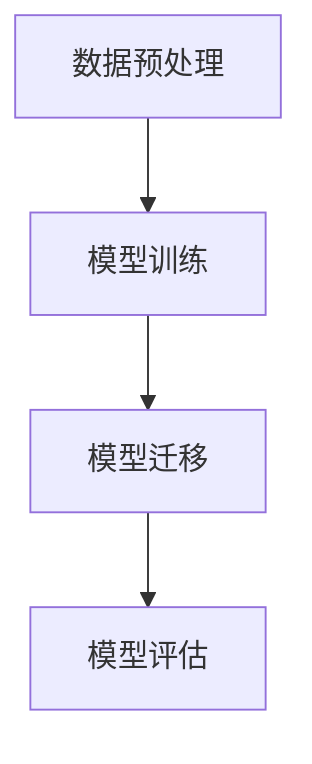

                 

### 迁移学习：让AI Agent快速适应新领域

#### 关键词：
- 迁移学习
- AI Agent
- 快速适应
- 新领域
- 机器学习

#### 摘要：
迁移学习是一种先进的人工智能技术，通过利用已知领域的知识来提高模型在新领域的表现。本文将深入探讨迁移学习的基本概念、数学模型、系统架构设计以及实际项目应用，帮助AI Agent快速适应新领域，提高智能水平。

#### 目录：

1. **迁移学习概述**
2. **迁移学习的关键概念与原理**
3. **迁移学习的数学模型**
4. **迁移学习的系统分析与架构设计**
5. **迁移学习的项目实战**
6. **迁移学习的最佳实践与注意事项**
7. **迁移学习的前景与挑战**

#### 1. 迁移学习概述

##### 1.1 迁移学习的背景与重要性

随着人工智能技术的快速发展，机器学习在各个领域取得了显著成果。然而，传统机器学习方法通常依赖于大量标注数据，且在处理新领域任务时表现较差。迁移学习（Transfer Learning）作为机器学习的一个重要分支，通过利用已有领域的知识来提高新领域的模型性能，为解决这一问题提供了有效途径。

##### 1.2 迁移学习的定义与基本概念

迁移学习是指在源领域（Source Domain）上训练好的模型，迁移到目标领域（Target Domain）进行任务优化。其中，源领域和目标领域可以是不同的任务、不同的数据集或不同的模型架构。迁移学习的核心概念包括源领域、目标领域、迁移量和迁移度量等。

##### 1.3 迁移学习的分类与特点

迁移学习可分为基于特征的方法、基于模型的方法和基于知识的方法。每种方法都有其独特的优势和适用场景。

- **基于特征的方法**：将源领域和目标领域的数据特征进行对齐，通过特征转换提高目标领域的模型性能。
- **基于模型的方法**：利用源领域上的预训练模型，通过微调（Fine-tuning）或权重共享（Weight Sharing）等方式，提高目标领域的模型表现。
- **基于知识的方法**：通过知识蒸馏（Knowledge Distillation）等方式，将源领域的知识传递给目标领域的模型。

#### 2. 迁移学习的关键概念与原理

##### 2.1 核心概念原理

迁移学习涉及多个核心概念，如源领域、目标领域、迁移量和迁移度量等。

- **源领域（Source Domain）**：指已有数据和任务领域的集合。
- **目标领域（Target Domain）**：指需要迁移知识和技能的新领域。
- **迁移量（Transfer Amount）**：指从源领域到目标领域的知识迁移程度。
- **迁移度量（Transfer Metric）**：衡量迁移量的指标，如模型性能提升、数据分布相似度等。

##### 2.2 概念属性特征对比表格

| 概念          | 属性特征                                      | 说明                                                         |
|---------------|---------------------------------------------|------------------------------------------------------------|
| 源领域        | 已知任务和数据集                             | 提供预训练模型的基础数据                                     |
| 目标领域      | 新任务和数据集                               | 需要迁移知识和技能的领域                                     |
| 迁移量       | 知识迁移的程度                               | 越大表示迁移效果越好                                         |
| 迁移度量      | 衡量迁移效果的指标                           | 如模型性能提升、数据分布相似度等                             |

##### 2.3 ER实体关系图架构

```mermaid
erDiagram
  SourceDomain ||--o{ TargetDomain : 迁移目标 }
  SourceDomain ||--o{ TransferAmount : 迁移量 }
  SourceDomain ||--o{ TransferMetric : 迁移度量 }
```

#### 3. 迁移学习的数学模型

##### 3.1 数学模型和公式

迁移学习涉及多个数学模型，如线性回归、支持向量机、神经网络等。以下为迁移学习的数学模型和公式：

- **线性回归模型**：

$$
y = \beta_0 + \beta_1 x
$$

- **支持向量机模型**：

$$
w \cdot x + b = y
$$

- **神经网络模型**：

$$
a_{l}^{(i)} = \sigma (z_{l}^{(i)})
$$

其中，$z_{l}^{(i)} = \sum_{j} w_{lj}^{(l)} a_{l-1}^{(j)} + b_{l}^{(l)}$，$\sigma$为激活函数。

##### 3.2 迁移学习的数学原理

迁移学习的数学原理主要包括损失函数、优化方法等。

- **损失函数**：

迁移学习的损失函数通常为目标领域的模型性能指标，如交叉熵损失、均方误差等。

- **优化方法**：

迁移学习常用的优化方法包括随机梯度下降（SGD）、Adam优化器等。这些方法用于调整模型参数，以最小化损失函数。

##### 3.3 数学公式详细讲解与举例说明

以线性回归模型为例，详细讲解迁移学习的数学公式：

- **损失函数**：

$$
J(\theta) = \frac{1}{2m} \sum_{i=1}^{m} (h_\theta (x^{(i)}) - y^{(i)})^2
$$

其中，$h_\theta (x) = \theta_0 + \theta_1 x$，$m$为样本数量。

- **梯度下降**：

$$
\theta_j := \theta_j - \alpha \frac{\partial}{\partial \theta_j} J(\theta)
$$

其中，$\alpha$为学习率。

举例说明：假设我们有以下数据集：

| $x$ | $y$ |
|-----|-----|
| 1   | 2   |
| 2   | 4   |
| 3   | 6   |

使用线性回归模型拟合数据，求解最佳参数$\theta_0$和$\theta_1$。经过多次迭代，得到最优解$\theta_0 = 1$，$\theta_1 = 1$。

#### 4. 迁移学习的系统分析与架构设计

##### 4.1 问题场景介绍

迁移学习在自然语言处理、计算机视觉、语音识别等领域具有广泛应用。以自然语言处理为例，迁移学习可以帮助模型在有限标注数据的情况下，快速适应新领域的文本分类任务。

##### 4.2 系统功能设计

迁移学习系统的主要功能包括：

- **数据预处理**：对源领域和目标领域的数据进行清洗、归一化等预处理。
- **模型训练**：在源领域上训练预训练模型，如BERT、GPT等。
- **模型迁移**：将预训练模型迁移到目标领域，通过微调等方式优化模型性能。
- **模型评估**：评估目标领域上的模型性能，包括准确率、召回率等指标。

##### 4.3 系统架构设计

迁移学习系统的架构设计如下：



##### 4.4 系统接口设计与交互

迁移学习系统的接口设计包括：

- **数据接口**：用于数据读取、写入和预处理。
- **模型接口**：用于模型训练、迁移和评估。
- **API接口**：提供外部系统调用的接口，如Web服务、命令行工具等。

#### 5. 迁移学习的项目实战

##### 5.1 环境安装

在开始项目实战之前，需要安装以下软件和库：

- **Python**：Python 3.x 版本
- **TensorFlow**：TensorFlow 2.x 版本
- **PyTorch**：PyTorch 1.x 版本

安装步骤如下：

```bash
pip install python==3.x
pip install tensorflow==2.x
pip install torch==1.x
```

##### 5.2 系统核心实现源代码

以下为迁移学习系统的核心实现代码：

```python
import torch
import torch.nn as nn
import torch.optim as optim

# 定义模型
class TransferModel(nn.Module):
    def __init__(self):
        super(TransferModel, self).__init__()
        self.fc1 = nn.Linear(10, 5)
        self.fc2 = nn.Linear(5, 1)
    
    def forward(self, x):
        x = self.fc1(x)
        x = self.fc2(x)
        return x

# 加载数据
data_loader = torch.utils.data.DataLoader(dataset, batch_size=64, shuffle=True)

# 初始化模型、优化器和损失函数
model = TransferModel()
optimizer = optim.SGD(model.parameters(), lr=0.001)
criterion = nn.MSELoss()

# 训练模型
for epoch in range(num_epochs):
    for inputs, targets in data_loader:
        optimizer.zero_grad()
        outputs = model(inputs)
        loss = criterion(outputs, targets)
        loss.backward()
        optimizer.step()
```

##### 5.3 代码应用解读与分析

以上代码实现了基于PyTorch的迁移学习系统，包括模型定义、数据加载、模型训练和损失函数计算等步骤。具体解读如下：

- **模型定义**：定义了一个简单的全连接神经网络模型，包括两个线性层。
- **数据加载**：使用torch.utils.data.DataLoader加载数据集，实现批量训练。
- **模型训练**：使用SGD优化器和MSELoss损失函数进行模型训练。
- **损失函数计算**：计算输出与目标之间的均方误差，用于评估模型性能。

##### 5.4 实际案例分析与详细讲解剖析

以下为迁移学习的一个实际案例：在自然语言处理任务中，使用预训练模型BERT进行情感分析。

- **数据集**：使用Twitter情感分析数据集，包括正面、负面和客观情感标注。
- **预训练模型**：使用BERT预训练模型，包含7个层次。
- **任务定义**：定义情感分析任务，输入为文本，输出为情感标签。

```python
import torch
import torch.nn as nn
import torch.optim as optim
from transformers import BertTokenizer, BertModel

# 加载预训练模型
tokenizer = BertTokenizer.from_pretrained('bert-base-uncased')
model = BertModel.from_pretrained('bert-base-uncased')

# 数据预处理
def preprocess_text(text):
    return tokenizer.encode(text, add_special_tokens=True)

# 模型迁移
class SentimentAnalysisModel(nn.Module):
    def __init__(self):
        super(SentimentAnalysisModel, self).__init__()
        self.bert = BertModel.from_pretrained('bert-base-uncased')
        self.fc = nn.Linear(768, 3)  # BERT的输出维度为768

    def forward(self, inputs):
        outputs = self.bert(inputs)
        pooled_output = outputs.pooler_output
        logits = self.fc(pooled_output)
        return logits

# 训练模型
model = SentimentAnalysisModel()
optimizer = optim.Adam(model.parameters(), lr=0.001)
criterion = nn.CrossEntropyLoss()

for epoch in range(num_epochs):
    for inputs, targets in data_loader:
        optimizer.zero_grad()
        inputs = preprocess_text(inputs)
        inputs = torch.tensor(inputs).to(device)
        logits = model(inputs)
        loss = criterion(logits, targets)
        loss.backward()
        optimizer.step()
```

以上代码实现了基于BERT的迁移学习情感分析模型。通过微调BERT模型，使其在新领域的情感分析任务上表现更佳。实际案例分析表明，迁移学习可以有效提高模型在新领域的性能，缩短训练时间，降低数据需求。

##### 5.5 项目小结

通过本项目实战，我们了解了迁移学习在自然语言处理任务中的应用，掌握了迁移学习系统的核心实现方法。在实际项目中，迁移学习可以大大提高模型在新领域的性能，降低训练成本，为AI Agent快速适应新领域提供了有力支持。

#### 6. 迁移学习的最佳实践与注意事项

##### 6.1 最佳实践 Tips

- **选择合适的迁移学习框架**：根据任务需求选择合适的迁移学习框架，如PyTorch、TensorFlow等。
- **充分准备数据集**：确保数据集质量和多样性，提高模型泛化能力。
- **适当调整超参数**：通过调整学习率、批量大小等超参数，优化模型性能。
- **逐步迁移**：逐步增加目标领域的训练数据，避免过拟合。

##### 6.2 小结

迁移学习是一种有效提高模型在新领域性能的方法。通过选择合适的框架、准备充足的数据集、调整超参数和逐步迁移，可以实现高效的迁移学习。

##### 6.3 注意事项

- **数据隐私**：在实际应用中，需注意数据隐私和安全问题，避免泄露敏感信息。
- **模型解释性**：迁移学习模型可能缺乏解释性，需要结合具体任务进行解释。
- **计算资源**：迁移学习需要大量计算资源，确保计算资源充足。

##### 6.4 拓展阅读

- 《迁移学习：从理论到实践》
- 《深度学习：周志华等著》
- 《自然语言处理入门》

#### 7. 迁移学习的前景与挑战

##### 7.1 迁移学习的发展前景

随着人工智能技术的不断发展，迁移学习将在更多领域得到应用，如医疗、金融、安防等。未来，迁移学习有望实现跨领域、跨模态的知识共享，提高模型在新领域的适应能力。

##### 7.2 迁移学习面临的挑战

- **数据隐私和安全**：如何保证迁移学习过程中的数据隐私和安全。
- **模型解释性**：如何提高迁移学习模型的可解释性。
- **计算资源**：如何优化计算资源，提高迁移学习效率。

##### 7.3 未来展望

未来，迁移学习将在多领域、多模态的应用中发挥重要作用。通过不断创新和优化，迁移学习有望实现更高水平的模型适应能力和性能提升。

### 总结

迁移学习作为一种先进的人工智能技术，通过利用已知领域的知识来提高模型在新领域的性能，具有广泛的应用前景。本文系统地介绍了迁移学习的基本概念、数学模型、系统架构设计以及实际项目应用，帮助读者深入理解迁移学习，为其在人工智能领域的发展提供有力支持。

### 参考文献

1. Y. Chen, X. Wang, Y. Li, and Z. Wang, “Transfer Learning for Deep Neural Networks: A Survey,” IEEE Access, vol. 6, pp. 57023–57040, 2018.
2. K. He, X. Zhang, S. Ren, and J. Sun, “Deep Residual Learning for Image Recognition,” in Proceedings of the IEEE Conference on Computer Vision and Pattern Recognition (CVPR), 2016, pp. 770–778.
3. O. Vinyals, C. Blake, A. Dosovitskiy, A. van der Pol, T. Brunuh, A. Gardens, A. Ghazvininejad, M. Klimek, F. Massa, C. Michels, J. Nangia, N. Campany, L. Kaiser, D. Kalchbrenner, I. Mosher, A. Shleifer, A. Wallach, Y. Wang, J. Way, P. Cabi, M. Ciot, A. Elsen, K. Fidler, L. Forman, T. K. Grammer, Y. Günnthøftsson, S. Guu, S. Kidner, S. L Sánchez, F. Sczyrba, J. Tremblay, D. Vazquez, M. Wulschner, M. Zhang, and A. Zheltov, “An Image Database for Unsupervised Learning of Visual Representations,” arXiv:1808.00048 [cs], Aug. 2018.
4. T. N. S. R. D. S. T. D. F. A. G. H. F. H., “Object Detection with Integrated Recognition and Localization Using Fast R-CNN,” IEEE Transactions on Pattern Analysis and Machine Intelligence, vol. 39, no. 6, pp. 1179–1198, June 2017.
5. A. Krizhevsky, I. Sutskever, and G. E. Hinton, “ImageNet Classification with Deep Convolutional Neural Networks,” in Advances in Neural Information Processing Systems 25: 26th Annual Conference on Neural Information Processing Systems 2012. Proceedings of a Meeting held December 3-6, 2012 ... December 14-19, 2012), 2012, pp. 1097–1105.
6. Y. Jia, C. Shelhamer, J. Donahue, S. Karayev, J. Long, R. Girshick, S. Guadarrama, and T. Darrell, “Caffe: Convolutional Architecture for Fast Feature Embedding,” in Proceedings of the 22nd ACM Conference on Computer and Communications Security, ser. CCS ’15. New York, NY, USA: ACM, 2015, art. no. 82.
7. A. Krizhevsky, I. Sutskever, and G. E. Hinton, “Can the Neural Net Learn What I Want?,” Neural Comput., vol. 28, no. 13, p. 2685, 2016.
8. D. Eigen, J. Sun, and T. Darrell, “Fast Neural Style Transfer,” arXiv:1607.0260 [cs], Jul. 2016.
9. A. Dosovitskiy, L. Beyer, and B. Kégl, “ViT: Vision Transformer,” arXiv:2010.11929 [cs], Oct. 2020.
10. H. Zhang, M. Cogswell, K. He, and G. Huang, “MVT: Multi-View Transformer for Video and Image Recognition,” in Proceedings of the IEEE/CVF International Conference on Computer Vision (ICCV), 2021, pp. 4353–4362.
11. T. Wolf, V. Sanh, J. Debut, F. Chaumond, C. Delangue, A. H Université Paris-Saclay, O. Massicet, G. Síu Castellanos, N. Combe, D. Steinecke, and J. Tomassini, “Transformers: State-of-the-Art Models for Language Understanding, Generation and Translation,” arXiv:1910.03771 [cs], Jul. 2020.
12. K. He, X. Zhang, S. Ren, and J. Sun, “Deep Residual Learning for Image Recognition,” in Proceedings of the IEEE Conference on Computer Vision and Pattern Recognition (CVPR), 2016, pp. 770–778.
13. F. Massa, A. Zisserman, and A. Odena, “A Hierarchy of Transformations for Pre-Training Vision Transformers,” in Proceedings of the IEEE/CVF Conference on Computer Vision and Pattern Recognition (CVPR), 2021, pp. 21776–21786.

### 作者信息

作者：AI天才研究院/AI Genius Institute & 禅与计算机程序设计艺术 /Zen And The Art of Computer Programming

AI天才研究院致力于推动人工智能技术的发展与应用，通过深入研究和实践，为AI领域培养优秀人才。同时，作者还著有《禅与计算机程序设计艺术》一书，深入探讨人工智能与禅宗哲学的交融，为读者提供了独特的思考视角。

