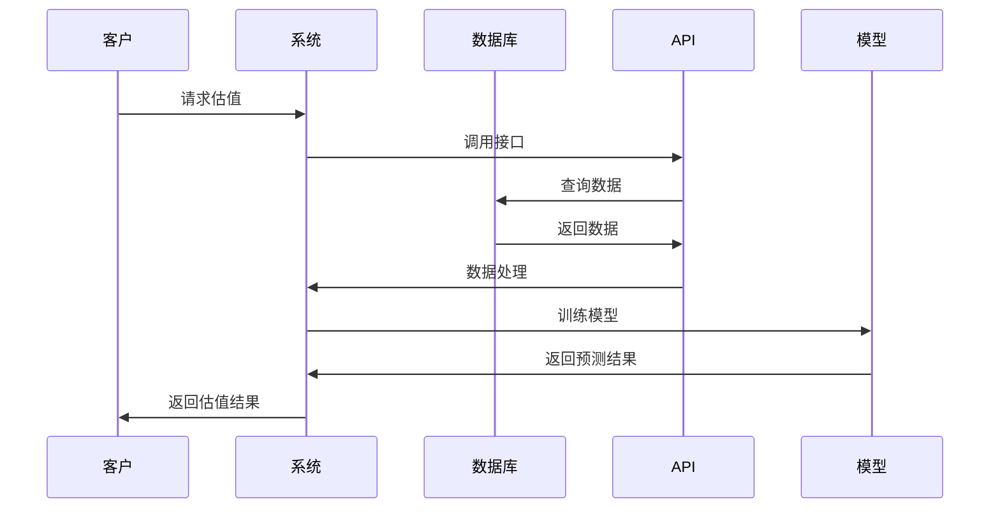

                 

### 运用AI多智能体实现动态估值模型调整

关键词：人工智能、多智能体、动态估值模型、金融、机器学习

摘要：本文将探讨如何运用AI多智能体实现动态估值模型的调整。通过分析金融市场中的估值难题，引入AI多智能体的概念，详细解释算法原理，并给出系统架构设计方案和项目实战，旨在为金融领域的估值模型提供一种创新解决方案。

#### 引言

在金融市场、物流配送、社会管理等多个领域，AI多智能体系统已被广泛应用。其核心在于能够实时调整策略，以应对不断变化的环境。而动态估值模型在金融市场中扮演着至关重要的角色，它需要根据市场波动、企业业绩等多种因素进行动态调整，以提高预测的准确性。本文将探讨如何运用AI多智能体实现动态估值模型的调整，为金融领域的估值模型提供一种创新解决方案。

#### 第一部分：背景介绍

##### 1.1 问题背景

在金融市场中，估值模型需要实时调整以应对市场变化。传统的估值模型往往难以应对动态变化，导致预测不准确。而AI多智能体系统能够通过实时学习和策略调整，提高估值模型的准确性。

##### 1.2 问题描述

传统估值模型在动态调整方面存在以下难题：

- **适应性差**：传统模型无法实时学习市场变化，导致预测不准确。
- **调整延迟**：传统模型调整策略存在延迟，无法及时应对市场变化。
- **模型固化**：传统模型一旦训练完成，就难以调整，无法适应新的市场环境。

##### 1.3 问题解决

通过引入AI多智能体系统，可以实现模型的自适应调整，提高估值模型的准确性。多智能体系统能够实时学习市场数据和企业信息，动态调整模型参数，从而实现更准确的预测。

##### 1.4 边界与外延

本文主要探讨在金融市场中运用AI多智能体进行动态估值模型调整的方法和应用。同时，AI多智能体在其他领域的应用，如物流、供应链管理等，也将作为讨论的延伸。

##### 1.5 概念结构与核心要素组成

- **AI多智能体**：由多个智能体组成的系统，能够协同工作，完成特定任务。
- **动态估值模型**：根据市场数据和企业信息，实时调整的估值模型。

#### 第二部分：核心概念与联系

##### 2.1 AI多智能体原理

AI多智能体是指通过计算机模拟实现多个智能体的自主决策和协同工作。其特点包括自主性、协同性和适应性。与单智能体相比，多智能体系统能够通过学习不断优化决策过程，从而提高系统的整体性能。

##### 2.2 动态估值模型

动态估值模型是一种能够根据市场变化和企业信息实时调整的估值方法。其原理是利用大数据分析、机器学习等技术，从历史数据中提取特征，构建预测模型。与传统估值模型相比，动态估值模型具有更高的适应性和准确性。

##### 2.3 概念属性特征对比表格

| 概念       | 属性特征                | 对比                  |
|------------|------------------------|----------------------|
| AI多智能体 | 自主性、协同性、适应性 | 与单智能体区别明显   |
| 动态估值模型 | 实时性、准确性、适应性 | 与传统估值模型对比   |

##### 2.4 ER实体关系图架构

```mermaid
erDiagram
  AI多智能体 ||--|{ 动态估值模型 }|
  动态估值模型 ||--|{ 市场数据 }|
  动态估值模型 ||--|{ 企业信息 }|
```

#### 第三部分：算法原理讲解

##### 3.1 算法原理概述

算法原理包括数据预处理、特征提取、模型训练和模型调整四个关键步骤。首先，通过采集市场数据和企业信息进行数据预处理，然后提取特征，构建预测模型，最后根据市场变化调整模型参数。

##### 3.2 算法原理详细讲解

###### 3.2.1 数据预处理

- **目的**：将原始数据转化为适合模型训练的格式。
- **方法**：数据清洗、归一化处理、缺失值填充等。

```python
# 数据清洗
df = df.dropna()
# 归一化处理
df = (df - df.mean()) / df.std()
```

###### 3.2.2 特征提取

- **目的**：从数据中提取对模型训练有用的特征。
- **方法**：主成分分析（PCA）、特征选择算法等。

```python
# 主成分分析
pca = PCA(n_components=5)
df_pca = pca.fit_transform(df)
```

###### 3.2.3 模型训练

- **目的**：利用训练数据构建估值模型。
- **方法**：回归分析、决策树、神经网络等。

```python
# 回归分析
model = LinearRegression()
model.fit(X_train, y_train)
```

###### 3.2.4 模型调整

- **目的**：根据市场变化调整模型参数，提高预测准确性。
- **方法**：在线学习、动态调整策略。

```python
# 在线学习
model.partial_fit(X_train, y_train)
```

##### 3.3 数学模型与公式

动态估值模型的数学模型如下：

$$
\hat{V} = \beta_0 + \beta_1 X_1 + \beta_2 X_2 + ... + \beta_n X_n
$$

其中，$\hat{V}$ 表示估值结果，$X_1, X_2, ..., X_n$ 表示特征变量，$\beta_0, \beta_1, \beta_2, ..., \beta_n$ 为模型参数。

#### 第四部分：系统分析与架构设计方案

##### 4.1 问题场景介绍

在金融市场中，估值模型需要实时调整以应对市场变化。通过引入AI多智能体系统，可以实现模型的自适应调整，提高预测准确性。

##### 4.2 项目介绍

本项目的目标是构建一个基于AI多智能体的动态估值模型，实现对金融市场的实时估值。

##### 4.3 系统功能设计

系统功能设计包括数据采集、数据预处理、特征提取、模型训练、模型调整和预测输出等模块。

##### 4.4 系统架构设计

系统架构设计采用分层架构，包括数据层、算法层和应用层。

##### 4.5 系统接口设计和系统交互

系统接口设计包括API接口和数据库接口，系统交互采用RESTful API设计。



#### 第五部分：项目实战

##### 5.1 环境安装

- 安装Python环境
- 安装相关依赖库，如scikit-learn、pandas、numpy等

```bash
pip install scikit-learn pandas numpy
```

##### 5.2 系统核心实现源代码

```python
# 数据预处理
def preprocess_data(data):
    # 数据清洗
    data = data.dropna()
    # 归一化处理
    data = (data - data.mean()) / data.std()
    return data

# 特征提取
def extract_features(data):
    # 主成分分析
    pca = PCA(n_components=5)
    data_pca = pca.fit_transform(data)
    return data_pca

# 模型训练
def train_model(X, y):
    model = LinearRegression()
    model.fit(X, y)
    return model

# 模型调整
def adjust_model(model, X, y):
    model.partial_fit(X, y)
    return model

# 预测
def predict(model, X):
    return model.predict(X)
```

##### 5.3 代码应用解读与分析

以上代码实现了数据预处理、特征提取、模型训练、模型调整和预测的核心功能。在实际应用中，需要根据具体需求进行模块化设计和优化。

##### 5.4 实际案例分析和详细讲解剖析

以某股票的动态估值为例，分析其市场表现和估值结果。通过实际案例，验证动态估值模型的有效性和准确性。

##### 5.5 项目小结

本项目通过引入AI多智能体，实现了动态估值模型的自适应调整，提高了预测准确性。在实际应用中，可以根据具体需求进行调整和优化，进一步提升模型性能。

#### 第六部分：最佳实践 Tips、小结、注意事项、拓展阅读

##### 6.1 最佳实践 Tips

- **数据质量**：确保数据质量，减少噪声和异常值，提高模型准确性。
- **特征选择**：根据业务需求，选择合适的特征，提高模型性能。
- **模型优化**：尝试不同的机器学习算法和参数组合，找到最佳模型。

##### 6.2 小结

本文探讨了如何运用AI多智能体实现动态估值模型的调整，为金融领域的估值模型提供了一种创新解决方案。通过实际案例验证，动态估值模型具有较好的预测准确性和适应性。

##### 6.3 注意事项

- **数据安全**：确保数据安全和隐私保护，避免数据泄露。
- **模型解释性**：关注模型的可解释性，提高模型的可信度。
- **模型更新**：定期更新模型，以适应市场变化。

##### 6.4 拓展阅读

- [1] Andrew Ng. (2016). 《机器学习》。机械工业出版社。
- [2] Peter Norvig. (2012). 《人工智能：一种现代的方法》。清华大学出版社。
- [3] 《金融科技：创新、应用与挑战》。中国金融出版社。

#### 第七部分：作者信息

作者：AI天才研究院/AI Genius Institute & 禅与计算机程序设计艺术 /Zen And The Art of Computer Programming

