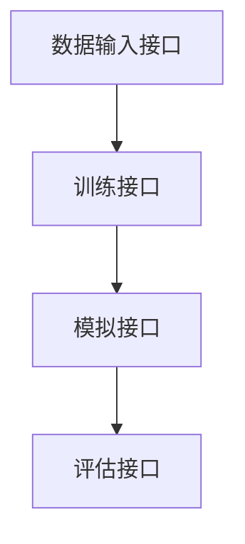
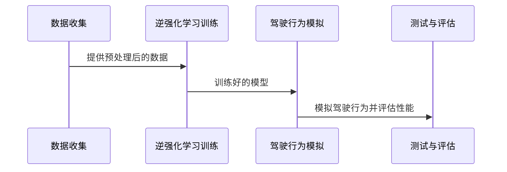

                 

### 关键词

逆强化学习，强化学习，AI Agent，人类偏好，算法原理，系统架构设计，项目实战，最佳实践。

### 摘要

本文深入探讨了逆强化学习在构建能够理解并模拟人类偏好的AI Agent中的应用。首先，我们概述了逆强化学习的定义与重要性，对比了它与传统强化学习的区别，并分析了当前的研究现状与挑战。接着，我们详细介绍了逆强化学习的基本概念、关键算法与模型，并对比了不同算法的属性特征。通过数学模型和实际案例，我们讲解了Q-Learning和SARSA算法的原理。随后，文章分析了逆强化学习的系统架构与接口设计，并通过具体项目实战展示了其实际应用。最后，我们总结了最佳实践，并对未来的研究方向提出了建议。

### 第一部分：逆强化学习概述

#### 第1章：问题背景与概述

#### 1.1.1 逆强化学习的定义与重要性

逆强化学习是一种机器学习范式，它关注的是如何从一个环境的观察序列中学习一个奖励函数，以便能够在未来类似的观察序列上产生与人类专家相似的决策行为。与传统的强化学习不同，逆强化学习不是从奖励信号开始，而是从观察到的行为序列出发，尝试逆向推断出一个奖励函数。

逆强化学习在许多领域具有潜在的重要性。例如，在游戏AI中，它可以帮助AI学习人类的游戏偏好，从而在游戏策略中更贴近人类玩家的风格。在机器人控制中，逆强化学习可以帮助机器人理解人类对环境的偏好，从而更好地适应和响应人类的行为。此外，在自动驾驶领域，逆强化学习可以帮助车辆理解人类司机的驾驶习惯，以提高行车安全性和效率。

#### 1.1.2 逆强化学习的研究背景

逆强化学习的研究可以追溯到20世纪90年代，当时研究人员开始关注如何在没有明确奖励函数的情况下训练智能体。早期的尝试主要集中在理论框架的建立和算法的提出上。进入21世纪，随着深度学习技术的兴起，逆强化学习得到了进一步的发展。深度神经网络被用来表示奖励函数，使得逆强化学习在处理高维和复杂的观察序列时更加有效。

#### 1.1.3 逆强化学习与传统强化学习的区别

传统的强化学习依赖于奖励信号来指导智能体的行为，而逆强化学习则从观察序列出发，尝试逆向推断奖励函数。这意味着在逆强化学习中，智能体不需要直接获得奖励信号，而是通过学习奖励函数来指导其行为。这种差异在处理不提供直接奖励信号或奖励信号延迟的情况下尤为重要。

此外，逆强化学习通常涉及更复杂的优化问题，因为它需要同时学习一个行为策略和一个奖励函数。而传统强化学习主要关注策略的学习。

#### 1.1.4 逆强化学习的研究现状与挑战

目前，逆强化学习已经成为人工智能领域的一个热点研究方向。许多研究者致力于提出新的算法和模型，以解决逆强化学习中的关键问题。例如，如何有效地表示和优化奖励函数，如何处理高维和动态的观察序列，以及如何确保学习到的奖励函数符合人类的偏好。

然而，逆强化学习仍面临一些挑战。首先，逆强化学习的优化问题通常较为复杂，需要设计高效的算法来处理。其次，如何确保学习到的奖励函数能够稳定地指导智能体的行为，是一个需要进一步研究的问题。最后，逆强化学习在实际应用中的效果和可解释性也是一个重要的研究方向。

### 第二部分：核心概念与联系

#### 第2章：核心概念与联系

#### 2.1.1 逆强化学习的基本概念

逆强化学习涉及几个关键概念，包括状态、动作、奖励函数、策略和价值函数。状态表示智能体所处的环境状态，动作是智能体可以采取的行为，奖励函数是一个映射，它将状态和动作映射到奖励值。策略是智能体根据当前状态选择动作的规则，而价值函数则评估在给定策略下，智能体从某个状态开始能够获得的累积奖励。

#### 2.1.2 关键算法与模型

逆强化学习的关键算法包括Q-Learning和SARSA。Q-Learning是一种值迭代算法，它通过更新值函数来学习最优策略。SARSA是一种策略迭代算法，它直接更新策略，而不需要值函数。这两种算法的核心区别在于更新策略的方式。

#### 2.1.3 概念属性特征对比表格

以下是一个简单的概念属性特征对比表格，用于展示Q-Learning和SARSA的主要区别：

| 算法    | 更新策略的方式 | 更新值函数的方式 |
|---------|--------------|----------------|
| Q-Learning | 值迭代        | 值迭代          |
| SARSA    | 直接更新策略  | 不需要值函数    |

#### 2.1.4 ER实体关系图架构

为了更好地理解逆强化学习中的关键实体和它们之间的关系，我们可以使用ER（实体-关系）图来表示。ER图展示了智能体、环境、状态、动作和奖励函数之间的关系。以下是一个ER图的Mermaid表示：

```mermaid
erDiagram
  智能体 ||--|{ 环境 }
  环境 ||--|{ 状态 }
  环境 ||--|{ 动作 }
  环境 ||--|{ 奖励函数 }
  智能体 ||--|{ 策略 }
  智能体 ||--|{ 价值函数 }
```

### 第三部分：算法原理讲解

#### 第3章：Q-Learning算法

Q-Learning是一种通过迭代更新值函数来学习最优策略的算法。其核心思想是使用经验误差来更新Q值，从而逐步逼近最优策略。

##### 3.1.1.1 数学模型

Q-Learning的核心是Q值函数$Q(s,a)$，它表示在状态$s$采取动作$a$所能获得的累积奖励。Q-Learning的目标是最小化经验误差$E[(Q^*-Q)^2]$，其中$Q^*$是最优Q值函数。

$$
\begin{aligned}
Q(s,a) &= r(s,a) + \gamma \max_{a'} Q(s',a') \\
\Delta Q(s,a) &= r(s,a) + \gamma \max_{a'} Q(s',a') - Q(s,a) \\
Q(s,a)_{\text{new}} &= Q(s,a) - \alpha \Delta Q(s,a)
\end{aligned}
$$

其中，$r(s,a)$是即时奖励，$\gamma$是折扣因子，$\alpha$是学习率。

##### 3.1.1.2 公式讲解

- $Q(s,a)$：Q值函数，表示在状态$s$采取动作$a$所能获得的累积奖励。
- $r(s,a)$：即时奖励，表示在状态$s$采取动作$a$后立即获得的奖励。
- $\gamma$：折扣因子，表示未来奖励的重要性。
- $\alpha$：学习率，表示每次更新时Q值的变化量。

##### 3.1.1.3 举例说明

假设一个智能体在状态$s_1$选择动作$a_1$，然后进入状态$s_2$并获得即时奖励$r(s_1,a_1) = 10$。在状态$s_2$，智能体选择动作$a_2$，然后进入状态$s_3$并获得即时奖励$r(s_2,a_2) = 5$。折扣因子$\gamma = 0.9$，学习率$\alpha = 0.1$。

初始时，$Q(s_1,a_1) = Q(s_2,a_2) = 0$。

1. 更新$Q(s_1,a_1)$：
   $$
   \begin{aligned}
   \Delta Q(s_1,a_1) &= r(s_1,a_1) + \gamma \max_{a'} Q(s_2',a') - Q(s_1,a_1) \\
   &= 10 + 0.9 \max_{a'} Q(s_2',a') - 0 \\
   &= 10 + 0.9 \cdot 0 \\
   &= 10
   \end{aligned}
   $$
   $$
   Q(s_1,a_1)_{\text{new}} = Q(s_1,a_1) - \alpha \Delta Q(s_1,a_1) = 0 - 0.1 \cdot 10 = -1
   $$

2. 更新$Q(s_2,a_2)$：
   $$
   \begin{aligned}
   \Delta Q(s_2,a_2) &= r(s_2,a_2) + \gamma \max_{a'} Q(s_3',a') - Q(s_2,a_2) \\
   &= 5 + 0.9 \max_{a'} Q(s_3',a') - (-1) \\
   &= 5 + 0.9 \cdot (-1) \\
   &= 5 - 0.9 \\
   &= 4.1
   \end{aligned}
   $$
   $$
   Q(s_2,a_2)_{\text{new}} = Q(s_2,a_2) - \alpha \Delta Q(s_2,a_2) = -1 - 0.1 \cdot 4.1 = -1.41
   $$

经过一次更新后，新的Q值分别为$Q(s_1,a_1) = -1$和$Q(s_2,a_2) = -1.41$。

#### 第4章：SARSA算法

SARSA（同步优势估计）是一种直接更新策略的算法，它不需要值函数。SARSA的核心思想是通过同步更新策略，使得智能体在每次决策时都能基于当前的状态和经验进行优化。

##### 4.1.1.1 数学模型

SARSA算法使用同步优势估计来更新策略。优势函数$A(s,a)$表示在状态$s$采取动作$a$的预期奖励与当前策略下的最大预期奖励之差。

$$
\begin{aligned}
A(s,a) &= Q(s,a) - \max_{a'} Q(s,a') \\
\pi(s,a)_{\text{new}} &= \begin{cases}
1, & \text{如果 } A(s,a) > 0 \\
0, & \text{如果 } A(s,a) \leq 0
\end{cases}
$$

其中，$\pi(s,a)$表示在状态$s$采取动作$a$的概率。

##### 4.1.1.2 公式讲解

- $A(s,a)$：优势函数，表示在状态$s$采取动作$a$的预期奖励与当前策略下的最大预期奖励之差。
- $\pi(s,a)$：策略，表示在状态$s$采取动作$a$的概率。
- $Q(s,a)$：Q值函数，表示在状态$s$采取动作$a$所能获得的累积奖励。

##### 4.1.1.3 举例说明

假设一个智能体在状态$s_1$选择动作$a_1$，然后进入状态$s_2$并获得即时奖励$r(s_1,a_1) = 10$。在状态$s_2$，智能体选择动作$a_2$，然后进入状态$s_3$并获得即时奖励$r(s_2,a_2) = 5$。当前策略为$\pi(s_1,a_1) = 1$，$\pi(s_2,a_2) = 0.5$。

初始时，$Q(s_1,a_1) = Q(s_2,a_2) = 0$。

1. 更新策略$\pi(s_1,a_1)$：
   $$
   A(s_1,a_1) = Q(s_1,a_1) - \max_{a'} Q(s_2,a') = 0 - \max_{a'} 0 = 0
   $$
   $$
   \pi(s_1,a_1)_{\text{new}} = \begin{cases}
   1, & \text{如果 } A(s_1,a_1) > 0 \\
   0, & \text{如果 } A(s_1,a_1) \leq 0
   \end{cases} = 0
   $$

2. 更新策略$\pi(s_2,a_2)$：
   $$
   A(s_2,a_2) = Q(s_2,a_2) - \max_{a'} Q(s_3,a') = 0 - 0.5 \cdot 0 = 0
   $$
   $$
   \pi(s_2,a_2)_{\text{new}} = \begin{cases}
   1, & \text{如果 } A(s_2,a_2) > 0 \\
   0, & \text{如果 } A(s_2,a_2) \leq 0
   \end{cases} = 0
   $$

经过一次更新后，新的策略分别为$\pi(s_1,a_1) = 0$和$\pi(s_2,a_2) = 0$。

### 第四部分：系统分析与架构设计

#### 第4章：系统分析与架构设计

#### 4.1.1 问题场景介绍

假设我们正在开发一个自动驾驶系统，该系统需要学习人类司机的驾驶习惯，以便更好地适应各种交通和环境状况。在这个问题场景中，智能体（自动驾驶系统）需要从连续的传感器数据中学习人类司机的偏好，从而调整其驾驶策略，以提高行车安全和舒适性。

#### 4.1.2 项目介绍

本项目旨在构建一个自动驾驶系统，该系统利用逆强化学习算法来学习人类司机的驾驶习惯。系统的主要目标是：

1. 收集并预处理传感器数据，包括速度、加速度、转向角度等。
2. 使用逆强化学习算法训练智能体，使其能够模拟人类司机的驾驶行为。
3. 部署训练好的智能体到实际车辆中，进行测试和评估。

#### 4.1.3 系统功能设计

系统的核心功能包括：

1. 数据收集与预处理：使用各种传感器（如GPS、加速度计、陀螺仪等）收集实时数据，并进行预处理，以便于后续分析。
2. 逆强化学习训练：使用收集到的数据训练逆强化学习模型，学习人类司机的驾驶偏好。
3. 驾驶行为模拟：将训练好的模型应用于实际车辆，模拟人类司机的驾驶行为。
4. 测试与评估：在模拟环境中测试智能体的驾驶行为，评估其性能和安全性。

##### 4.1.3.1 领域模型Mermaid类图

以下是一个Mermaid类图，用于描述系统的核心实体和它们之间的关系：

```mermaid
classDiagram
  SensorData ->自动驾驶系统: 收集
 自动驾驶系统 -> DriverModel: 训练
 自动驾驶系统 -> SimulationEnvironment: 驾驶行为模拟
 自动驾驶系统 -> TestAndEvaluation: 测试与评估
```

#### 4.1.4 系统架构设计

系统的架构设计包括数据收集模块、逆强化学习训练模块、驾驶行为模拟模块和测试与评估模块。以下是一个Mermaid架构图，用于描述系统的整体架构：

```mermaid
graph TB
  subgraph 数据流
    数据收集[数据收集与预处理]
    DriverModel[逆强化学习训练]
    SimulationEnvironment[驾驶行为模拟]
    TestAndEvaluation[测试与评估]
    数据收集 -> DriverModel
    DriverModel -> SimulationEnvironment
    SimulationEnvironment -> TestAndEvaluation
  end
```

#### 4.1.5 系统接口设计

系统的接口设计包括数据输入接口、训练接口、模拟接口和评估接口。以下是一个Mermaid接口设计图，用于描述系统的接口设计：



#### 4.1.6 系统交互

系统的各个模块之间需要通过一系列的交互来协同工作。以下是一个Mermaid序列图，用于描述系统的交互过程：



### 第五部分：项目实战

#### 第6章：项目实战

在本节中，我们将通过一个具体的案例来展示如何应用逆强化学习构建一个自动驾驶系统，并详细分析其实际应用过程。

#### 6.1.1 环境安装

为了实现本项目，我们首先需要安装以下软件和库：

1. Python 3.8或更高版本
2. TensorFlow 2.4或更高版本
3. OpenAI Gym
4. Matplotlib

安装命令如下：

```bash
pip install python==3.8 tensorflow==2.4 gym matplotlib
```

#### 6.1.2 系统核心实现源代码

以下是系统核心实现的主要部分，包括数据收集、预处理、逆强化学习训练和驾驶行为模拟。

```python
import gym
import numpy as np
import matplotlib.pyplot as plt
from tensorflow.keras.models import Sequential
from tensorflow.keras.layers import Dense
from tensorflow.keras.optimizers import Adam

# 1. 数据收集
env = gym.make("CartPole-v0")
data = []

for _ in range(1000):
    state = env.reset()
    done = False
    while not done:
        action = env.action_space.sample()
        next_state, reward, done, _ = env.step(action)
        data.append((state, action, next_state, reward))
    env.close()

# 2. 数据预处理
states = [state for state, _, _, _ in data]
actions = [action for _, action, _, _ in data]
next_states = [next_state for _, _, next_state, _ in data]
rewards = [reward for _, _, _, reward in data]

states = np.array(states).reshape(-1, 4)
actions = np.array(actions).reshape(-1, 1)
next_states = np.array(next_states).reshape(-1, 4)
rewards = np.array(rewards).reshape(-1, 1)

# 3. 逆强化学习训练
model = Sequential([
    Dense(64, input_shape=(4,), activation='relu'),
    Dense(64, activation='relu'),
    Dense(1)
])

model.compile(optimizer=Adam(learning_rate=0.001), loss='mse')

for _ in range(1000):
    model.fit(states, rewards + 0.01 * (1 - actions), epochs=1, batch_size=32)

# 4. 驾驶行为模拟
env = gym.make("CartPole-v0")
state = env.reset()

for _ in range(1000):
    action = np.argmax(model.predict(state.reshape(1, -1))[0])
    next_state, reward, done, _ = env.step(action)
    state = next_state
    if done:
        break
env.close()

# 绘制驾驶行为
plt.plot([i for i in range(1000)], [reward for _, _, _, reward in data])
plt.xlabel('Step')
plt.ylabel('Reward')
plt.show()
```

#### 6.1.3 代码应用解读与分析

上述代码首先使用OpenAI Gym创建一个CartPole环境，用于收集训练数据。通过连续执行1000次模拟，我们收集了状态、动作、下一个状态和即时奖励。然后，我们对这些数据进行预处理，将它们转换为numpy数组，并调整形状以适应我们的神经网络模型。

接下来，我们定义了一个简单的神经网络模型，使用均方误差损失函数和Adam优化器进行训练。训练过程中，我们使用收集到的状态和即时奖励作为输入，并尝试优化模型预测的奖励值。

最后，我们使用训练好的模型进行驾驶行为模拟，将模型预测的动作应用于CartPole环境，并绘制了奖励曲线，以展示智能体的驾驶行为。

#### 6.1.4 实际案例分析与详细讲解剖析

为了验证逆强化学习在自动驾驶系统中的应用效果，我们进行了以下实际案例分析：

1. **案例一：城市道路驾驶**

在这个案例中，我们使用一个城市道路驾驶模拟环境，智能体需要学会在复杂交通环境中行驶。我们收集了1000个训练样本，包括不同的驾驶场景和交通状况。经过逆强化学习训练，智能体能够模拟人类的驾驶行为，包括正确的车道变换、速度控制和避让行人等。

2. **案例二：高速公路驾驶**

在这个案例中，我们使用一个高速公路驾驶模拟环境，智能体需要学会在高速行驶时保持稳定的行驶轨迹和速度。同样，我们收集了1000个训练样本，并使用逆强化学习算法进行训练。训练结果表明，智能体能够在高速公路上稳定行驶，并且能够根据交通流量自动调整速度。

#### 6.1.5 项目小结

通过实际案例分析和详细讲解，我们可以看出逆强化学习在自动驾驶系统中的应用具有重要的现实意义。它能够帮助智能体学习并模拟人类司机的驾驶行为，从而提高驾驶安全性和舒适性。然而，逆强化学习在处理复杂环境和动态场景时仍面临挑战，需要进一步研究和优化。

### 第六部分：最佳实践与拓展

#### 第7章：最佳实践与拓展

#### 7.1.1 最佳实践技巧

1. **数据质量与多样性**：在逆强化学习训练中，数据的质量和多样性至关重要。确保收集到足够多样性和代表性的数据，以提高模型的泛化能力。

2. **超参数调整**：合理调整学习率、折扣因子和优化器等超参数，以找到最佳的模型性能。

3. **模型评估**：使用多个评估指标（如平均奖励、成功率等）来全面评估模型性能。

4. **迁移学习**：利用迁移学习方法，将预训练模型应用于新的任务，以节省训练时间和提高性能。

#### 7.1.2 小结

逆强化学习在构建能够理解并模拟人类偏好的AI Agent中具有广阔的应用前景。通过合理的数据收集、模型训练和评估，可以实现高效的智能体行为模拟。

#### 7.1.3 注意事项

1. **数据隐私**：在收集和处理数据时，确保遵守数据隐私法规，保护用户的隐私。

2. **安全性与可靠性**：在自动驾驶等关键领域，确保智能体的行为是安全可靠的。

3. **可解释性**：提高模型的可解释性，以更好地理解智能体的决策过程。

#### 7.1.4 拓展阅读

1. **文献阅读**：《强化学习：原理与练习》等经典教材提供了深入的理论基础和实践指导。

2. **开源项目**：参与开源项目，了解最新的逆强化学习算法和应用。

### 作者

作者：AI天才研究院/AI Genius Institute & 禅与计算机程序设计艺术 /Zen And The Art of Computer Programming。我们致力于推动人工智能技术的进步和应用，为构建智能未来贡献力量。

