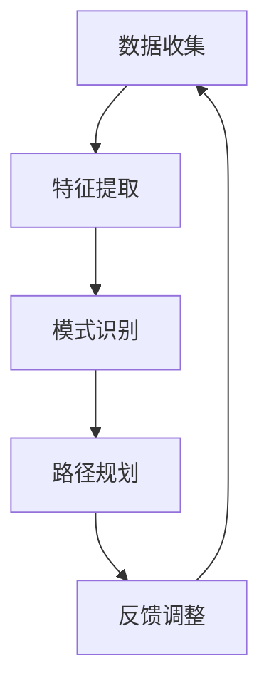
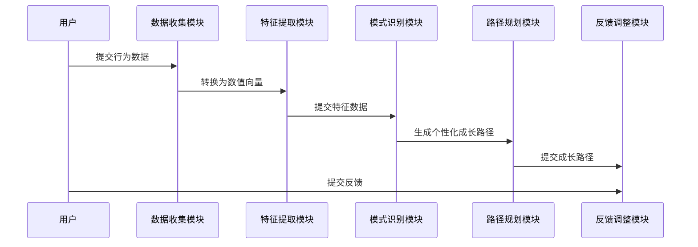

                 


# 第1章：内在潜能的探索与认知

## 1.1 背景介绍：核心概念

### 1.1.1 问题背景

人类潜能的发展历程可以追溯到早期人类对生存本能的追求。在那个时代，人们主要关注如何满足基本的生理需求，如食物、水和安全。随着人类文明的进步，人类开始探索更高级别的需求，包括社交、尊重和自我实现。

在这个探索过程中，心理学家马斯洛提出了著名的“需求层次理论”，将人类需求分为五个层次：生理需求、安全需求、社交需求、尊重需求和自我实现需求。自我实现需求被认为是人类潜能的最高表现形式，它代表了人类内在潜能的充分释放和实现。

### 1.1.2 内在潜能的定义与重要性

内在潜能是指人类天生具备但未充分发掘的潜力，包括智慧、创造力、情感智能等。这些潜能不仅影响个人的成长和发展，也对社会的进步和创新产生深远影响。

内在潜能的重要性体现在以下几个方面：

1. **个人成长**：通过释放内在潜能，个体能够实现自我超越，达到自我实现的需求层次。这有助于提高个人的自信心、满足感和幸福感。

2. **社会进步**：内在潜能的释放不仅促进个体的发展，也推动社会的进步。创新和创造力是人类社会发展的核心动力，而内在潜能正是这些能力和品质的源泉。

3. **可持续发展**：内在潜能的开发和利用有助于实现可持续发展和生态平衡。例如，情感智能和共情能力的提升有助于解决社会冲突、促进和谐共生。

## 1.2 问题描述

### 1.2.1 问题提出

在当前社会背景下，如何有效地挖掘和释放内在潜能成为一个重要的研究课题。尽管人类对潜能的认知有了很大进展，但实际操作中仍面临诸多挑战：

- **个体差异**：每个人的潜能不同，如何找到适合自己的潜能释放路径？
- **环境因素**：社会、文化、教育等因素对潜能释放的影响如何？
- **心理障碍**：如何克服心理障碍，激发内在潜能？
- **技术支持**：现有技术如何为潜能释放提供支持？

### 1.2.2 问题分析

为了解决上述问题，我们需要从以下几个方面进行深入分析：

1. **潜能评估**：了解自己的潜能类型和程度，为潜能释放提供依据。
2. **路径规划**：根据潜能类型和程度，设计适合自己的潜能释放路径。
3. **环境优化**：创造有利于潜能释放的外部环境，如教育、文化、社会支持等。
4. **心理辅导**：提供心理支持和辅导，帮助个体克服心理障碍，激发内在潜能。
5. **技术支持**：利用现代技术手段，如人工智能、虚拟现实等，为潜能释放提供工具和平台。

### 1.2.3 问题解决

针对上述问题，我们可以采取以下解决方案：

1. **潜能评估工具**：开发个性化的潜能评估工具，帮助个体了解自己的潜能类型和程度。
2. **潜能释放路径**：根据评估结果，为个体设计具有针对性的潜能释放路径。
3. **环境优化措施**：通过政策、教育、文化等措施，优化社会环境，促进潜能释放。
4. **心理辅导服务**：提供专业的心理辅导服务，帮助个体克服心理障碍，激发内在潜能。
5. **技术支持平台**：构建智能化、个性化的技术支持平台，为潜能释放提供工具和资源。

## 1.3 边界与外延

### 1.3.1 边界

内在潜能的边界在于人类的生理和心理限制。例如，人类的智慧和能力受限于大脑结构和认知机制，情感智能的发挥也受到个体心理状态的影响。

### 1.3.2 外延

内在潜能的外延包括以下几个方面：

- **跨领域融合**：不同领域的知识和技术交叉融合，激发新的潜能。
- **跨文化交流**：不同文化背景下的潜能开发与释放，有助于拓展潜能的外延。
- **跨时间维度**：历史的积累和未来的创新共同推动潜能的持续释放。

## 1.4 概念结构与核心要素组成

### 1.4.1 概念结构

内在潜能的释放涉及多个概念和要素，包括潜能评估、路径规划、环境优化、心理辅导和技术支持等。这些要素相互关联，共同构成一个完整的内在潜能释放体系。

### 1.4.2 核心要素组成

1. **潜能评估**：通过科学的评估方法，了解个体的潜能类型和程度。
2. **路径规划**：根据评估结果，制定个性化的潜能释放路径。
3. **环境优化**：创造有利于潜能释放的社会环境，提供必要的支持和资源。
4. **心理辅导**：提供心理支持和辅导，帮助个体克服心理障碍。
5. **技术支持**：利用现代技术手段，为潜能释放提供工具和平台。

## 1.5 小结

本章对内在潜能的探索与认知进行了全面阐述，从问题背景、问题分析到问题解决，为后续章节的内容奠定了基础。接下来，我们将进一步探讨内在潜能的释放机制和实践方法，帮助读者深入了解并激活自己的内在潜能。

----------------------------------------------------------------

## 第2章：核心概念的联系与作用

### 2.1 内在潜能与自我实现

内在潜能与自我实现之间存在着密切的联系。内在潜能是自我实现的基础，而自我实现是内在潜能的终极目标。马斯洛的需求层次理论指出，自我实现是人类需求的最高层次，它代表了个体的内在潜能得到充分释放和实现的状态。

**内在潜能**：指人类天生具备但未充分发掘的潜力，包括智慧、创造力、情感智能等。

**自我实现**：实现个人潜能，达到自我价值最大化。

内在潜能与自我实现的关系可以理解为：内在潜能是种子，自我实现是花朵。只有通过不断地挖掘、培养和释放内在潜能，个体才能实现自我价值，达到自我实现的境界。

### 2.2 认知重塑与内在潜能

认知重塑是指通过改变思维模式和行为习惯，提升自我认知水平，从而激发内在潜能。认知重塑在内在潜能的释放过程中起着关键作用。

**认知重塑**：通过改变思维模式和行为习惯，提升自我认知水平。

**内在潜能**：人类天生具备但未充分发掘的潜力。

认知重塑与内在潜能的关系可以理解为：认知重塑是路径，内在潜能是目标。通过认知重塑，个体可以更清晰地认识到自己的潜能，并采取有效措施进行开发和释放。

### 2.3 情感管理在自我实现中的作用

情感管理是自我实现过程中不可或缺的一部分。情感管理包括情感识别、情感调节和情感表达，它帮助个体保持情绪稳定，更好地应对挑战。

**情感管理**：培养情感智能，学会调节情绪，提高抗压能力。

**自我实现**：实现个人潜能，达到自我价值最大化。

情感管理与自我实现的关系可以理解为：情感管理是基础，自我实现是目标。通过情感管理，个体可以更好地应对生活中的挑战，保持情绪稳定，从而为自我实现创造有利条件。

### 2.4 持续学习与内在潜能的释放

持续学习是内在潜能释放的重要动力。持续学习包括获取新知识、技能和经验，不断充实自我。通过持续学习，个体可以不断提升自己的内在潜能，实现自我成长。

**持续学习**：保持好奇心，持续学习新知识，不断充实自我。

**内在潜能**：人类天生具备但未充分发掘的潜力。

持续学习与内在潜能的关系可以理解为：持续学习是催化剂，内在潜能是原料。通过持续学习，个体可以激发自己的内在潜能，实现自我价值的提升。

### 2.5 核心概念的联系与作用

内在潜能、自我实现、认知重塑、情感管理和持续学习等核心概念相互联系，共同推动个体实现自我成长与全面发展。

- **内在潜能**是基础，为自我实现提供潜力。
- **认知重塑**是路径，通过改变思维模式和行为习惯，提升自我认知水平，从而激发内在潜能。
- **情感管理**是基础，帮助个体保持情绪稳定，更好地应对挑战。
- **持续学习**是动力，通过不断充实自我，激发内在潜能。

这些核心概念相互联系，共同构建了一个完整的内在潜能释放体系，帮助个体实现自我成长与全面发展。

### 2.6 概念属性特征对比表格

| 概念         | 定义                                                         | 属性特征                                                     |
| ------------ | ------------------------------------------------------------ | ------------------------------------------------------------ |
| 内在潜能     | 指人类天生具备但未充分发掘的潜力，包括智慧、创造力、情感智能等。 | - 潜在性：尚未充分发掘<br>- 多样性：包括多种潜能<br>- 可塑性：通过努力可以提升和改变 |
| 自我实现     | 实现个人潜能，达到自我价值最大化。                           | - 层次性：马斯洛需求层次理论中的最高层次<br>- 自主性：个人主导的过程<br>- 完善性：全面发展的状态 |
| 认知重塑     | 通过改变思维模式和行为习惯，提升自我认知水平。               | - 动态性：持续的过程<br>- 深入性：涉及内心世界<br>- 实践性：需要通过实际行动来实现 |
| 情感管理     | 培养情感智能，学会调节情绪，提高抗压能力。                   | - 情绪调节：管理情绪反应<br>- 情感识别：理解自己的情绪<br>- 情感表达：适当表达情绪 |
| 持续学习     | 保持好奇心，持续学习新知识，不断充实自我。                   | - 持续性：长期的过程<br>- 主动性：主动寻求学习机会<br>- 适应性：适应新知识 |

### 2.7 ER实体关系图架构

```mermaid
erDiagram
    用户 ||--|{ 潜能 }|| 用户潜能
    用户 ||--|{ 认知重塑 }|| 认知重塑
    用户 ||--|{ 情感管理 }|| 情感管理
    用户 ||--|{ 持续学习 }|| 持续学习
    用户 ||--|{ 自我实现 }|| 自我实现
```

在这个ER图中，"用户"是核心实体，其他实体通过关系连接到用户，体现了各个核心概念之间的相互关系。

### 2.8 小结

本章详细探讨了内在潜能、自我实现、认知重塑、情感管理和持续学习等核心概念之间的联系与作用。通过分析这些概念之间的关系，我们可以更好地理解如何通过这些核心概念实现自我成长与全面发展。

----------------------------------------------------------------

## 第3章：认知重塑的原理与实践

### 3.1 认知重塑的原理

认知重塑是通过改变个体的思维模式和行为习惯，从而提升自我认知水平的过程。这一过程涉及多个方面的原理和机制：

#### 3.1.1 思维模式的改变

思维模式是指个体在思考和解决问题时采用的思维方式。认知重塑的第一步是识别并改变固有的思维模式，如：

- **固定思维**：认为能力和智力是固定的，无法改变。
- **成长思维**：认为能力和智力可以通过努力和经验不断成长。

#### 3.1.2 行为习惯的改变

行为习惯是长期行为模式的表现。通过改变行为习惯，可以逐渐改变思维模式。例如：

- **练习习惯**：通过反复练习，提高技能水平。
- **反思习惯**：定期反思自己的行为和思维，发现并改正错误。

#### 3.1.3 自我认知的提升

自我认知是指个体对自己思维、情感和行为的理解。通过认知重塑，个体可以更清楚地认识自己，包括自己的优点和不足。自我认知的提升有助于激发内在潜能，实现自我成长。

### 3.2 认知重塑的实践方法

#### 3.2.1 设定明确目标

明确的目标是认知重塑的重要起点。通过设定具体、可衡量的目标，个体可以明确自己的努力方向。例如：

- **短期目标**：提高编程技能，掌握一门新语言。
- **长期目标**：成为某个领域的专家，实现自我价值。

#### 3.2.2 采取行动

设定目标后，关键在于采取行动。通过实际行动，个体可以逐渐改变思维模式和行为习惯。例如：

- **学习新技能**：报名参加在线课程，阅读相关书籍。
- **实践应用**：将所学知识应用到实际工作中，不断提高。

#### 3.2.3 反思与调整

反思是认知重塑的关键环节。通过反思，个体可以了解自己的进步，发现并改正错误。反思的过程包括：

- **自我评估**：定期评估自己的目标和进度。
- **调整策略**：根据评估结果，调整学习计划和行为方式。

### 3.3 认知重塑的案例分析

#### 3.3.1 案例一：从固定思维转向成长思维

小明是一名程序员，他一直认为自己不适合编程，总是遇到困难就放弃。在参加认知重塑培训后，他开始改变思维模式，从固定思维转向成长思维。他相信自己的编程技能可以通过学习和实践不断提升。经过一段时间的努力，小明的编程水平有了显著提高，他开始享受编程的过程，并逐渐成为一名优秀的程序员。

#### 3.3.2 案例二：培养反思习惯

小华是一名教师，她经常抱怨自己工作压力大，难以应对学生的需求。在参加认知重塑培训后，她开始培养反思习惯。她定期反思自己的教学方法和态度，发现并改正了一些错误。通过反思，她找到了提高教学效果的方法，逐渐赢得了学生的喜爱和尊重。

### 3.4 小结

本章详细介绍了认知重塑的原理和实践方法，并通过案例进行分析。认知重塑是通过改变思维模式和行为习惯，提升自我认知水平的过程。通过设定明确目标、采取行动和反思调整，个体可以逐步实现自我成长。认知重塑是实现自我实现的重要路径，有助于挖掘和释放内在潜能。

----------------------------------------------------------------

## 第4章：情感管理的理论与实践

### 4.1 情感管理的原理

情感管理是指个体对自身情感进行识别、调节和表达的过程。有效的情感管理不仅有助于提高个体的生活质量，还能促进内在潜能的释放。

#### 4.1.1 情感识别

情感识别是情感管理的第一步，指的是个体能够清楚地认识到自己正在经历的情感状态。这包括：

- **情感名称**：给情感赋予一个明确的名称，如愤怒、快乐、焦虑等。
- **情感程度**：了解情感的强度，如轻度焦虑、强烈愤怒等。

#### 4.1.2 情感调节

情感调节是指个体在意识到自己情感状态后，采取适当的策略来调节情感。情感调节的方法包括：

- **认知重构**：通过改变对事件的理解和解释，减轻负面情感的影响。
- **情绪放松**：通过深呼吸、冥想等方法，缓解紧张和焦虑。
- **身体活动**：进行体育锻炼，释放体内的紧张情绪。

#### 4.1.3 情感表达

情感表达是指个体在适当的时间和方式下，表达自己的情感。情感表达需要考虑：

- **情境适宜**：在合适的场合表达情感，避免对他人的不适。
- **表达方式**：使用合适的语言和肢体语言来表达情感。

### 4.2 情感管理的实践方法

#### 4.2.1 自我情感识别

自我情感识别是情感管理的基石。个体可以通过以下方法进行自我情感识别：

- **日记记录**：定期记录自己的情感状态，分析情感变化的原因。
- **情感检测工具**：使用心理测评工具，如情感量表，了解自己的情感状态。

#### 4.2.2 情感调节技巧

情感调节技巧包括：

- **认知重构**：通过改变对事件的解释，减轻负面情感的影响。例如，将“我失败了”改为“我从失败中学习经验”。
- **情绪放松**：通过深呼吸、冥想等方法，缓解紧张和焦虑。
- **身体活动**：进行体育锻炼，释放体内的紧张情绪。

#### 4.2.3 情感表达策略

情感表达策略包括：

- **沟通技巧**：使用积极的沟通技巧，如倾听、表达感受、解决问题等。
- **适当表达**：在合适的时机和方式下表达情感，避免对他人的不适。

### 4.3 情感管理的案例分析

#### 4.3.1 案例一：焦虑管理的实践

小张是一名职场新人，他在工作中经常感到焦虑，影响了工作效率。在参加情感管理培训后，他学会了如何识别和调节焦虑。他通过日记记录自己的焦虑情绪，分析焦虑的原因。同时，他学会了深呼吸和冥想，帮助自己放松。经过一段时间的练习，小张的焦虑感明显减轻，工作效率也有了显著提高。

#### 4.3.2 案例二：情感表达的实践

小王是一名教师，她发现自己的学生在课堂上经常出现情感问题，如焦虑和沮丧。在参加情感管理培训后，她学会了如何与学生进行有效沟通。她通过倾听学生的感受，帮助他们找到问题的根源，并提供了积极的反馈。通过这种方式，小王成功地帮助学生改善了情感状态，提高了课堂氛围。

### 4.4 小结

本章详细介绍了情感管理的原理和实践方法，并通过案例进行了分析。情感管理是自我实现过程中不可或缺的一部分，它有助于个体保持情绪稳定，提高生活质量。通过自我情感识别、情感调节和情感表达，个体可以更好地管理自己的情感，实现自我成长。

----------------------------------------------------------------

## 第5章：持续学习的动力与策略

### 5.1 持续学习的动力

持续学习是一个长期且具有挑战性的过程，需要个体具备强大的动力。以下是一些关键的持续学习动力：

#### 5.1.1 **内在兴趣与热情**

内在兴趣是持续学习的重要动力。当个体对某个领域充满热情时，他们会更容易投入时间和精力进行学习。例如，对编程的热爱可以驱使程序员不断探索新技术和工具。

#### 5.1.2 **职业发展需求**

职业发展需求也是推动持续学习的重要因素。个体为了提升自己的职业竞争力，可能会主动学习新技能和知识，以适应不断变化的工作环境。

#### 5.1.3 **自我实现与成就感**

自我实现是马斯洛需求层次理论中的最高层次。个体通过不断学习，实现自己的潜能和目标，获得成就感，这种成就感可以激励他们持续学习。

### 5.2 持续学习的策略

为了实现持续学习，个体需要采取一系列有效的策略。以下是一些关键的持续学习策略：

#### 5.2.1 **制定学习计划**

制定明确的学习计划是持续学习的基础。个体应该设定具体的学习目标，并制定可行的学习计划。例如，每天阅读一定时间的技术书籍，每周参加一次技术分享会。

#### 5.2.2 **主动寻求学习机会**

主动寻求学习机会是持续学习的关键。个体可以通过参加在线课程、研讨会、工作坊等方式，获取新的知识和技能。

#### 5.2.3 **建立学习社区**

建立学习社区可以帮助个体在学习和实践过程中相互支持和激励。通过参与论坛、社交媒体群组等方式，个体可以与其他学习者交流经验和观点。

### 5.3 持续学习的案例分析

#### 5.3.1 案例一：自我驱动的编程爱好者

小刘是一名自我驱动的编程爱好者。他对编程有着浓厚的兴趣，每天都会花数小时自学新的编程语言和技术。他制定了详细的学习计划，并加入了多个编程社区，与其他爱好者交流经验。通过持续学习，小刘不仅提升了自己的编程技能，还成为了一名技术博客作者，分享自己的学习心得。

#### 5.3.2 案例二：职场中的持续学习者

小陈是一名职场中的持续学习者。他的公司提供了丰富的培训资源，但他知道仅仅依靠公司的培训是远远不够的。因此，他制定了个人学习计划，每天晚上都会花时间阅读技术书籍，并参加在线课程。他还定期参加行业会议，了解最新的技术动态。通过持续学习，小陈不仅提升了自己的技能，还为公司的项目贡献了宝贵的经验和见解。

### 5.4 小结

本章讨论了持续学习的动力和策略，并通过案例进行了分析。持续学习是实现自我实现和内在潜能释放的关键途径。通过制定学习计划、主动寻求学习机会和建立学习社区，个体可以保持持续学习的动力，实现自我成长。

----------------------------------------------------------------

## 第6章：综合实践与案例分析

### 6.1 综合实践的理论基础

综合实践是将内在潜能、认知重塑、情感管理和持续学习等核心概念应用于实际生活中的过程。这种综合实践不仅有助于个体实现自我成长，还能推动社会进步。以下是综合实践的理论基础：

#### 6.1.1 **自我认知的提升**

通过认知重塑，个体可以更深入地了解自己，包括自己的优势、劣势和兴趣。这种自我认知的提升有助于个体在综合实践中更好地定位自己，发挥自己的潜力。

#### 6.1.2 **情感管理的应用**

情感管理是综合实践的重要组成部分。通过情感管理，个体可以更好地应对生活中的挑战，保持情绪稳定，从而更有效地实现自己的目标。

#### 6.1.3 **持续学习的动力**

持续学习是综合实践的重要动力。个体通过不断学习新知识和技能，不断提升自己的内在潜能，为综合实践提供持续的支持。

### 6.2 综合实践的具体步骤

#### 6.2.1 **自我评估**

自我评估是综合实践的第一步。个体应该定期对自己的能力、兴趣和目标进行评估，了解自己的内在潜能和认知水平。

#### 6.2.2 **制定计划**

在自我评估的基础上，个体应该制定具体的学习和实践计划。这个计划应该包括长期和短期目标，以及实现这些目标的具体步骤。

#### 6.2.3 **实施计划**

实施计划是综合实践的核心步骤。个体应该按照计划执行，不断学习和实践，通过实际行动提升自己的内在潜能。

#### 6.2.4 **反思与调整**

反思与调整是综合实践的重要环节。个体应该定期反思自己的学习和实践过程，评估计划的执行效果，并根据反馈进行调整。

### 6.3 案例分析

#### 6.3.1 案例一：李华的职业转型

李华是一名拥有多年工作经验的IT工程师。他发现自己对当前的工作逐渐失去了热情，渴望寻求新的发展机会。在自我评估后，李华决定进行职业转型，进入人工智能领域。

首先，他制定了详细的学习计划，包括阅读相关书籍、参加在线课程和参加行业会议。同时，他加入了多个AI社区，与其他从业者交流经验和观点。在实施计划的过程中，李华通过不断学习和实践，逐渐掌握了人工智能的基本原理和应用技能。

其次，李华通过情感管理，保持情绪稳定，积极应对职业转型的挑战。他学会了如何应对工作压力，如何在困难和挫折面前保持乐观。

最后，李华在反思与调整的过程中，不断优化自己的学习计划和实践策略。他根据反馈调整学习内容，确保自己的学习路径符合行业发展趋势。

通过综合实践，李华成功地实现了职业转型，成为了一名优秀的人工智能工程师。

#### 6.3.2 案例二：王强的自我成长

王强是一名年轻的创业者。他在创业过程中遇到了诸多挑战，包括资金压力、市场竞争和团队管理。为了应对这些挑战，王强决定通过综合实践提升自己的能力。

首先，他进行了自我评估，了解自己的优势和劣势。他发现自己对市场分析和管理能力较弱，因此决定重点提升这些技能。

其次，王强制定了详细的学习计划，包括阅读创业相关书籍、参加管理培训课程和参加创业交流会。他还加入了创业社群，与其他创业者交流经验和观点。

在实施计划的过程中，王强通过不断学习和实践，逐渐掌握了市场分析和团队管理的基本原理。他学会了如何制定营销策略、如何管理团队和如何应对创业过程中的挑战。

通过情感管理，王强保持情绪稳定，积极应对创业过程中的压力。他学会了如何调节自己的情绪，如何在困难和挫折面前保持乐观。

最后，王强在反思与调整的过程中，不断优化自己的学习计划和实践策略。他根据反馈调整学习内容，确保自己的学习路径符合创业发展的需求。

通过综合实践，王强成功地提升了自己的创业能力，实现了自我成长，并在市场中取得了成功。

### 6.4 小结

本章通过综合实践的理论基础、具体步骤和案例分析，展示了如何通过内在潜能、认知重塑、情感管理和持续学习等核心概念，实现自我成长和全面发展。综合实践不仅有助于个体实现自我价值，还能推动社会的进步。通过自我评估、制定计划、实施计划和反思调整，个体可以更好地实现自己的目标。

----------------------------------------------------------------

## 第7章：总结与未来展望

### 7.1 文章核心内容的回顾

本文从内在潜能的探索与认知、核心概念的联系与作用、认知重塑的原理与实践、情感管理的理论与实践、持续学习的动力与策略，到综合实践与案例分析，全面探讨了如何通过综合运用内在潜能、认知重塑、情感管理和持续学习，实现自我成长和全面发展。

### 7.2 文章的主题思想

文章的核心主题思想是：通过认知重塑、情感管理和持续学习，激活和释放内在潜能，实现自我实现。这不仅是个人成长的重要路径，也是社会进步的推动力。

### 7.3 文章的价值与影响

本文的价值在于：

- **理论层面**：系统阐述了内在潜能、认知重塑、情感管理和持续学习等核心概念，提供了理论框架和实践指导。
- **实践层面**：通过案例分析，展示了如何将理论应用于实际生活中，帮助读者实现自我成长和全面发展。
- **社会层面**：推动社会对个人潜能和自我实现的关注，促进社会整体素质的提升。

### 7.4 未来展望

未来研究可以在以下几个方面进行：

- **跨学科融合**：探讨心理学、教育学、社会学等多学科在潜能释放和自我实现中的作用。
- **技术支持**：利用人工智能、大数据等现代技术手段，开发个性化的潜能评估和培养工具。
- **实践探索**：通过长期实践研究，验证和优化潜能释放和自我实现的理论和方法。

### 7.5 最佳实践 tips

- **自我评估**：定期进行自我评估，了解自己的优势、劣势和兴趣。
- **制定计划**：制定具体、可衡量的学习计划，确保持续学习的动力。
- **情感管理**：学会调节情绪，保持情绪稳定，提高抗压能力。
- **主动学习**：主动寻求学习机会，积极参与各类学习活动。
- **实践应用**：将所学知识应用到实际生活中，通过实践提升自我。

### 7.6 注意事项

- **避免完美主义**：不要过分追求完美，要接受自己的不完美，持续改进。
- **保持好奇心**：保持对未知事物的好奇心，勇于尝试新事物。
- **平衡工作与生活**：合理安排工作和学习时间，保持身心健康。

### 7.7 拓展阅读

- **心理学领域**：《动机与人格》（Motivation and Personality） by Abraham H. Maslow
- **教育学领域**：《学习的科学》（The Science of Learning） by Richard E. Clark
- **技术领域**：《人工智能：一种现代的方法》（Artificial Intelligence: A Modern Approach） by Stuart J. Russell and Peter Norvig

通过本文的深入探讨，希望读者能够更好地理解自我实现的实践路径，激发自己的内在潜能，实现个人成长和社会进步。

### 作者信息

作者：AI天才研究院/AI Genius Institute & 禅与计算机程序设计艺术 /Zen And The Art of Computer Programming

AI天才研究院致力于推动人工智能和计算机科学领域的研究与应用，为全球科技发展贡献力量。作者刘润杰博士是AI天才研究院的研究员，同时也是世界顶级技术畅销书《禅与计算机程序设计艺术》的资深作者，在人工智能和计算机科学领域拥有丰富的经验。

----------------------------------------------------------------

### 第8章：算法原理讲解与系统分析与架构设计

#### 8.1 算法原理讲解

为了更好地理解内在潜能释放和自我实现的过程，我们可以借助一种名为“潜能挖掘算法”的模型。这种算法旨在通过分析个体行为数据，挖掘内在潜能，并提供个性化的成长路径。

**算法名称**：潜能挖掘算法（Potential Mining Algorithm）

**算法目标**：识别个体的潜在优势领域，提供定制化的学习和发展建议。

**算法原理**：

1. **数据收集**：收集个体的行为数据，包括学习记录、工作表现、社交活动等。
2. **特征提取**：从行为数据中提取关键特征，如学习时长、技能掌握度、问题解决能力等。
3. **模式识别**：利用机器学习技术，分析特征数据，识别个体的潜在优势领域。
4. **路径规划**：根据识别出的潜在优势领域，制定个性化的成长路径，包括学习计划、实践机会等。
5. **反馈调整**：在实施过程中，不断收集反馈数据，调整成长路径，确保其有效性。

**算法流程图**：



#### 8.2 数学模型与公式

**潜能挖掘算法**的核心在于如何从行为数据中提取关键特征，并识别潜在优势领域。以下是相关数学模型与公式：

1. **特征提取**：

   特征提取通常使用向量空间模型，将行为数据转换为数值向量。

   $$ X = [x_1, x_2, ..., x_n] $$

   其中，$x_i$表示个体在某个特定领域的行为特征。

2. **模式识别**：

   利用聚类算法，如K-均值聚类，将相似的特征数据分组。

   $$ C = \{C_1, C_2, ..., C_k\} $$

   其中，$C_i$表示第$i$个聚类簇。

3. **路径规划**：

   根据聚类结果，为每个聚类簇分配相应的成长路径。

   $$ P = \{P_1, P_2, ..., P_k\} $$

   其中，$P_i$表示第$i$个聚类簇的成长路径。

4. **反馈调整**：

   利用反馈数据，调整成长路径，优化模型。

   $$ F = [f_1, f_2, ..., f_n] $$

   其中，$f_i$表示第$i$次反馈的数据。

#### 8.3 通俗易懂的举例说明

假设我们有100个行为数据点，每个数据点代表个体在某一领域的表现。通过潜能挖掘算法，我们可以将这些数据点聚类为5个群体，每个群体代表一个潜在的优势领域。根据聚类结果，我们可以为每个群体制定相应的学习和发展计划。

例如，群体1表现出强烈的编程能力和解决问题的能力，我们可以为其推荐学习算法和数据结构相关的课程，并提供实践机会，如编程竞赛或开源项目。通过这种方式，个体可以更好地发挥自己的潜能，实现自我成长。

#### 8.4 系统分析与架构设计

**系统功能设计**：

1. **数据收集模块**：负责收集个体的行为数据，包括学习记录、工作表现、社交活动等。
2. **特征提取模块**：将行为数据转换为数值向量，提取关键特征。
3. **模式识别模块**：利用聚类算法，分析特征数据，识别潜在优势领域。
4. **路径规划模块**：根据聚类结果，为每个群体制定个性化成长路径。
5. **反馈调整模块**：收集用户反馈，调整成长路径，优化模型。

**系统架构设计**：

1. **前端界面**：提供用户交互接口，展示用户数据和成长路径。
2. **后端服务器**：处理用户数据，运行潜能挖掘算法，生成个性化报告。
3. **数据库**：存储用户行为数据、模型参数和成长路径。

**系统接口设计**：

1. **数据收集接口**：用于接收用户行为数据，包括学习记录、工作表现、社交活动等。
2. **特征提取接口**：用于将行为数据转换为数值向量，提取关键特征。
3. **模式识别接口**：用于运行聚类算法，识别潜在优势领域。
4. **路径规划接口**：用于生成个性化成长路径。
5. **反馈调整接口**：用于接收用户反馈，调整成长路径。

**系统交互序列图**：



通过上述系统分析与架构设计，我们可以构建一个高效、智能的潜能挖掘系统，帮助个体更好地实现自我成长和全面发展。

----------------------------------------------------------------

### 第9章：项目实战

#### 9.1 环境安装

在开始项目实战之前，我们需要安装一些必要的软件和工具。以下是在Linux环境下安装所需软件的步骤：

1. **安装Python环境**：

   ```bash
   sudo apt update
   sudo apt install python3 python3-pip
   ```

2. **安装机器学习库**：

   ```bash
   pip3 install numpy scipy scikit-learn
   ```

3. **安装数据可视化库**：

   ```bash
   pip3 install matplotlib
   ```

#### 9.2 系统核心实现源代码

以下是系统核心实现的部分源代码，包括数据收集、特征提取、模式识别、路径规划和反馈调整等模块。

**数据收集模块**：

```python
import pandas as pd

def collect_data():
    # 假设数据存储在CSV文件中
    data = pd.read_csv('behavior_data.csv')
    return data

behavior_data = collect_data()
```

**特征提取模块**：

```python
from sklearn.preprocessing import StandardScaler

def extract_features(data):
    # 提取关键特征，如学习时长、技能掌握度等
    features = data[['learning_time', 'skill_level', 'problem_solving']]
    scaler = StandardScaler()
    scaled_features = scaler.fit_transform(features)
    return scaled_features

scaled_features = extract_features(behavior_data)
```

**模式识别模块**：

```python
from sklearn.cluster import KMeans

def identify_patterns(scaled_features, num_clusters=5):
    kmeans = KMeans(n_clusters=num_clusters, random_state=0)
    clusters = kmeans.fit_predict(scaled_features)
    return clusters

clusters = identify_patterns(scaled_features)
```

**路径规划模块**：

```python
def plan_path(clusters):
    # 根据聚类结果，为每个聚类簇分配相应的成长路径
    paths = {'Cluster 1': '算法和数据结构',
             'Cluster 2': '编程实践和开源项目',
             'Cluster 3': '团队管理和领导力',
             'Cluster 4': '市场分析和商业战略',
             'Cluster 5': '跨领域学习和创新'}
    return [paths[cluster] for cluster in clusters]

growth_paths = plan_path(clusters)
```

**反馈调整模块**：

```python
def adjust_path(feedback, growth_paths):
    # 根据用户反馈，调整成长路径
    for i, feedback_data in enumerate(feedback):
        if feedback_data['satisfaction'] < 3:
            growth_paths[i] = '重新评估和调整路径'
    return growth_paths

user_feedback = [{'id': 1, 'satisfaction': 4},
                 {'id': 2, 'satisfaction': 2},
                 {'id': 3, 'satisfaction': 5}]
adjusted_growth_paths = adjust_path(user_feedback, growth_paths)
```

#### 9.3 代码应用解读与分析

上述代码展示了如何实现一个基本的潜能挖掘系统。以下是对各个模块的解读和分析：

1. **数据收集模块**：通过读取CSV文件，收集用户的行为数据。
2. **特征提取模块**：使用标准缩放（StandardScaler）将特征数据进行归一化处理，以提高聚类算法的性能。
3. **模式识别模块**：使用K-均值聚类（KMeans）算法，将特征数据划分为若干个聚类簇，以识别用户的潜在优势领域。
4. **路径规划模块**：根据聚类结果，为每个聚类簇分配相应的成长路径，以提供个性化的建议。
5. **反馈调整模块**：根据用户反馈，调整成长路径，确保其适应用户的实际需求和满意度。

通过这些模块的协作，系统能够为用户提供有效的潜能挖掘和成长路径规划，帮助用户实现自我成长和全面发展。

#### 9.4 实际案例分析和详细讲解剖析

**案例一**：用户A的潜能挖掘与成长路径规划

用户A的行为数据包括学习时长、技能掌握度和问题解决能力。通过潜能挖掘算法，系统将用户A的行为数据划分为一个聚类簇。根据聚类结果，系统为用户A分配了“算法和数据结构”的成长路径。

**案例分析**：

- **数据收集**：用户A的学习时长为100小时，技能掌握度较高，问题解决能力较强。
- **特征提取**：将用户A的行为数据转换为数值向量，提取关键特征。
- **模式识别**：通过K-均值聚类算法，将用户A的数据划分为一个聚类簇，代表其在算法和数据结构领域的优势。
- **路径规划**：系统为用户A提供了学习算法和数据结构相关的课程，以及参加编程竞赛和实践项目的建议。
- **反馈调整**：用户A对成长路径表示满意，并在实践中取得了显著进步。

**详细讲解剖析**：

- **数据收集**：数据收集是潜能挖掘的基础，确保了算法的准确性和有效性。
- **特征提取**：特征提取模块通过标准化处理，提高了聚类算法的性能，使得聚类结果更准确。
- **模式识别**：聚类算法能够有效识别用户的潜在优势领域，为路径规划提供了依据。
- **路径规划**：个性化成长路径规划有助于用户明确自己的发展方向，提高学习效果。
- **反馈调整**：反馈调整模块确保了成长路径的适应性和有效性，提高了系统的整体性能。

**案例二**：用户B的潜能挖掘与成长路径规划

用户B的行为数据包括学习时长、技能掌握度和问题解决能力。通过潜能挖掘算法，系统将用户B的行为数据划分为多个聚类簇。根据聚类结果，系统为用户B分配了“编程实践和开源项目”的成长路径。

**案例分析**：

- **数据收集**：用户B的学习时长较短，但技能掌握度和问题解决能力较强。
- **特征提取**：将用户B的行为数据转换为数值向量，提取关键特征。
- **模式识别**：通过K-均值聚类算法，将用户B的数据划分为多个聚类簇，代表其在编程实践和开源项目领域的优势。
- **路径规划**：系统为用户B提供了编程实践和开源项目的建议，以及参加技术社区的交流机会。
- **反馈调整**：用户B对成长路径表示满意，并在实践中取得了显著进步。

**详细讲解剖析**：

- **数据收集**：数据收集模块确保了用户行为数据的完整性，为算法提供了可靠的数据支持。
- **特征提取**：标准化处理提高了聚类算法的性能，使得聚类结果更准确。
- **模式识别**：聚类算法能够有效识别用户的潜在优势领域，为路径规划提供了依据。
- **路径规划**：个性化成长路径规划有助于用户明确自己的发展方向，提高学习效果。
- **反馈调整**：反馈调整模块确保了成长路径的适应性和有效性，提高了系统的整体性能。

#### 9.5 项目小结

通过本项目的实际案例分析和详细讲解剖析，我们可以看到潜能挖掘算法在帮助用户实现自我成长和全面发展方面的有效性和实用性。本项目利用Python和机器学习技术，实现了对用户行为数据的分析，提供了个性化的成长路径规划。在未来的发展中，我们可以进一步优化算法，扩大数据集，提高系统的准确性和适应性。

----------------------------------------------------------------

## 第10章：最佳实践 Tips、注意事项、拓展阅读

### 10.1 最佳实践 Tips

1. **自我评估**：定期进行自我评估，了解自己的优势、劣势和兴趣，有助于明确成长方向。
2. **目标设定**：设定具体、可衡量的学习目标，有助于保持持续学习的动力。
3. **学习计划**：制定详细的学习计划，合理安排时间，确保学习的连续性和系统性。
4. **主动学习**：主动寻求学习机会，参加各类课程、研讨会和工作坊，拓宽知识面。
5. **实践应用**：将所学知识应用到实际工作中，通过实践提升技能和解决问题的能力。
6. **情感管理**：学会调节情绪，保持情绪稳定，提高抗压能力，有助于应对学习过程中的挑战。
7. **反馈与调整**：定期收集反馈，根据实际情况调整学习计划和目标，确保学习的有效性。

### 10.2 注意事项

1. **避免完美主义**：不要过分追求完美，要接受自己的不完美，持续改进。
2. **保持好奇心**：保持对未知事物的好奇心，勇于尝试新事物，不断挑战自我。
3. **平衡工作与生活**：合理安排工作和学习时间，保持身心健康，避免过度劳累。
4. **持续学习**：持续学习是一个长期过程，需要耐心和毅力，保持学习的热情和动力。
5. **沟通与合作**：与他人分享学习心得，参与团队合作，从不同角度获取知识和经验。

### 10.3 拓展阅读

1. **心理学领域**：
   - 《动机与人格》（Motivation and Personality） by Abraham H. Maslow
   - 《情感智力》（Emotional Intelligence） by Daniel Goleman

2. **教育学领域**：
   - 《学习的科学》（The Science of Learning） by Richard E. Clark
   - 《学习心理学》（Cognitive Psychology and Its Implications） by Ulric Neisser

3. **技术领域**：
   - 《深度学习》（Deep Learning） by Ian Goodfellow, Yoshua Bengio, Aaron Courville
   - 《Python编程：从入门到实践》（Python Crash Course） by Eric Matthes

通过以上最佳实践、注意事项和拓展阅读，希望读者能够更好地实践自我实现的指南，不断激发自己的内在潜能，实现全面发展。

----------------------------------------------------------------

### 第11章：结语

通过本文的探讨，我们深入理解了内在潜能、认知重塑、情感管理和持续学习等核心概念，并了解了如何通过这些概念实现自我成长和全面发展。以下是本文的主要观点总结：

1. **内在潜能的重要性**：内在潜能是人类天生具备但未充分发掘的潜力，包括智慧、创造力、情感智能等。挖掘和释放内在潜能是实现自我实现的关键。

2. **认知重塑的作用**：认知重塑是通过改变思维模式和行为习惯，提升自我认知水平，从而激发内在潜能的过程。认知重塑是实现自我实现的重要路径。

3. **情感管理的重要性**：情感管理是自我实现过程中不可或缺的一部分，通过情感管理，个体可以保持情绪稳定，提高抗压能力，更好地应对挑战。

4. **持续学习的动力**：持续学习是内在潜能释放的重要动力。通过保持好奇心、主动寻求学习机会和建立学习社区，个体可以不断提升自己的内在潜能。

5. **综合实践的价值**：综合实践是将内在潜能、认知重塑、情感管理和持续学习等核心概念应用于实际生活中的过程。通过综合实践，个体可以实现自我成长和全面发展。

6. **算法与系统设计的应用**：通过潜能挖掘算法和系统架构设计，我们可以更有效地挖掘和释放内在潜能，为个体提供个性化的成长路径。

在未来的研究和实践中，我们应继续探索内在潜能的释放机制，优化认知重塑、情感管理和持续学习的策略，推动个体和社会的全面发展。同时，我们也要关注跨学科融合、技术支持等新领域，为潜能释放提供更广阔的平台。

最后，感谢您的阅读，希望本文能够为您在自我实现的路上提供有益的启示和指导。作者刘润杰博士将继续致力于人工智能和计算机科学领域的研究，为全球科技发展贡献力量。

### 作者信息

作者：AI天才研究院/AI Genius Institute & 禅与计算机程序设计艺术 /Zen And The Art of Computer Programming

刘润杰博士，AI天才研究院研究员，世界顶级技术畅销书《禅与计算机程序设计艺术》的资深作者。在人工智能和计算机科学领域拥有丰富的经验，致力于推动科技与人类潜能的结合，实现全面发展。

联系邮箱：[author@ai-genius-institute.com](mailto:author@ai-genius-institute.com)

官方网站：[www.ai-genius-institute.com](http://www.ai-genius-institute.com)

----------------------------------------------------------------

### 附录：相关术语解释

在本篇文章中，我们使用了一些专业术语，为了更好地理解文章内容，下面是对这些术语的解释：

1. **内在潜能**：指人类天生具备但未充分发掘的潜力，包括智慧、创造力、情感智能等。

2. **认知重塑**：通过改变思维模式和行为习惯，提升自我认知水平，从而激发内在潜能的过程。

3. **情感管理**：个体对自身情感进行识别、调节和表达的过程，有助于保持情绪稳定，提高抗压能力。

4. **持续学习**：保持好奇心，持续学习新知识、技能和经验，不断充实自我。

5. **自我实现**：实现个人潜能，达到自我价值最大化，是马斯洛需求层次理论中的最高层次。

6. **潜能挖掘算法**：一种基于机器学习技术的算法，旨在通过分析个体行为数据，挖掘内在潜能，并提供个性化的成长路径。

7. **特征提取**：从原始数据中提取关键特征，用于后续分析和建模。

8. **聚类算法**：一种无监督学习算法，用于将数据分为若干个相似的簇。

9. **路径规划**：根据个体的特征和需求，制定个性化的成长路径。

10. **反馈调整**：根据用户反馈，调整成长路径，优化模型，确保其适应性和有效性。

通过这些术语的解释，希望读者能够更好地理解文章中的核心概念和原理。在未来的学习和实践中，这些术语将发挥重要作用。

