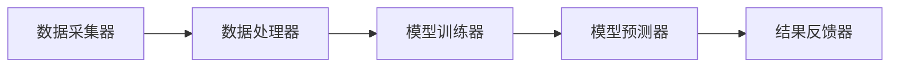
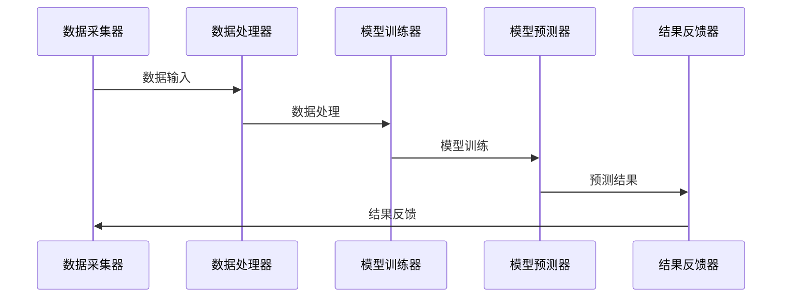
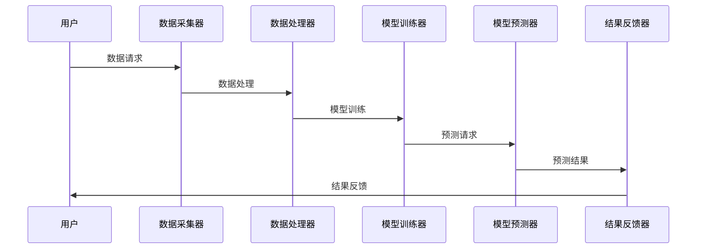
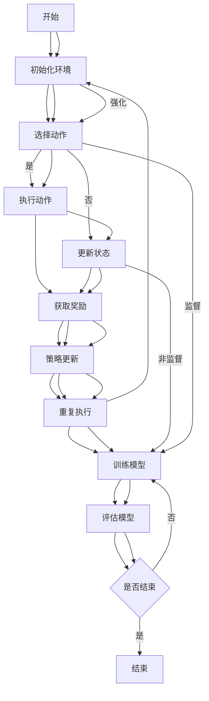
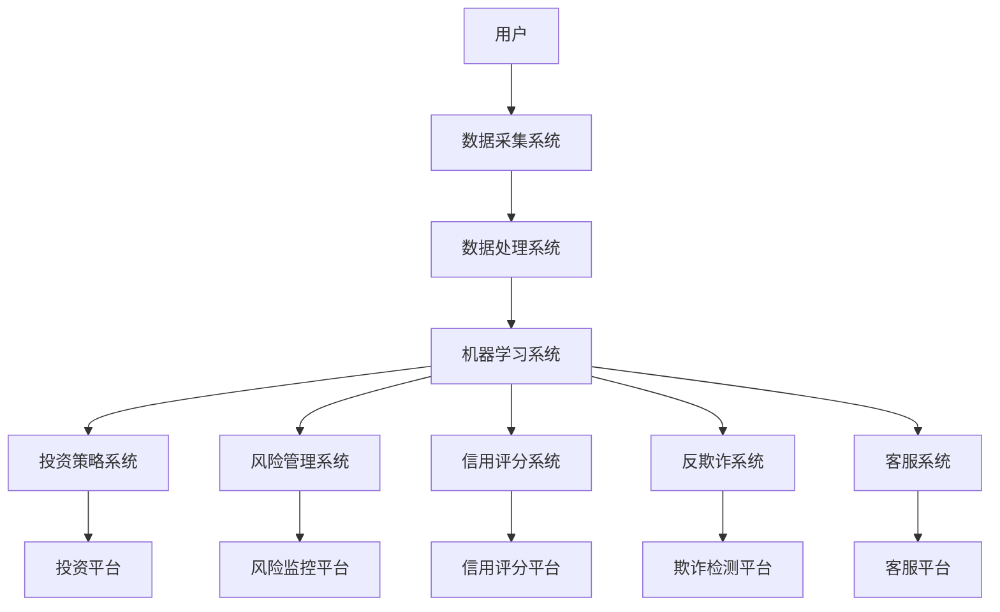
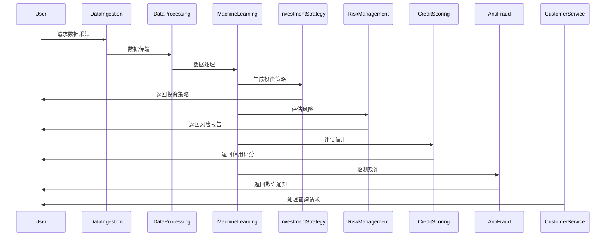

                 

# 金融AI应用的全面测试与质量保证策略

## 关键词

- 金融AI应用
- 全面测试
- 质量保证策略
- 算法测试
- 性能测试
- 安全性测试
- 持续集成
- 漏洞扫描

## 摘要

随着人工智能技术在金融行业的广泛应用，确保金融AI应用的质量和可靠性成为一项重要任务。本文将详细探讨金融AI应用的全面测试与质量保证策略，从背景介绍、核心概念、算法原理、数学模型、系统架构设计、项目实战及测试策略等方面进行深入分析，为金融AI应用的开发、测试和维护提供有力支持。

## 第一部分：金融AI应用概述

### 第1章：金融AI应用背景与挑战

#### 1.1.1 金融行业与AI技术融合的背景

金融行业是一个高度依赖数据和技术的领域。随着大数据、云计算、区块链等新兴技术的不断发展，AI技术逐渐在金融行业得到广泛应用。金融AI应用的出现，不仅提升了金融服务的效率和质量，还为金融风险管理、投资决策、客户服务等领域带来了新的机遇。

#### 1.1.2 金融AI应用的现状与趋势

目前，金融AI应用已经涉及到金融风险控制、智能投顾、量化交易、反欺诈等多个领域。随着技术的不断成熟和应用场景的拓展，金融AI应用正逐渐成为金融行业发展的新动力。

#### 1.1.3 金融AI应用面临的挑战与问题

金融AI应用在快速发展过程中，也面临着一系列挑战和问题，如算法透明性、数据隐私、模型解释性、安全性和可靠性等。这些问题需要通过有效的测试和质量保证策略来解决。

### 第2章：金融AI应用的核心概念

#### 2.1.1 AI与金融AI的定义与区别

AI（人工智能）是指使计算机模拟人类智能行为的技术，而金融AI则是将AI技术应用于金融领域，旨在提升金融服务的效率和准确性。

#### 2.1.2 金融AI应用的主要类别

金融AI应用主要包括智能投顾、量化交易、风险控制、反欺诈、客户服务等。每种应用都有其特定的算法和数据处理方法。

#### 2.1.3 金融AI应用的关键技术

金融AI应用的关键技术包括机器学习、深度学习、强化学习、自然语言处理、计算机视觉等。这些技术在金融领域的应用，为金融AI应用提供了强大的技术支持。

### 第3章：金融AI应用的算法原理

#### 3.1.1 监督学习算法原理与应用

监督学习算法是金融AI应用中最常用的一种算法，它通过输入特征和输出标签来训练模型，从而实现预测和分类。

##### 3.1.1.1 监督学习算法概述

监督学习算法可以分为回归、分类和排名等类型。其中，回归用于预测数值型变量，分类用于预测离散型变量，排名则用于预测连续型变量的排序。

##### 3.1.1.2 机器学习算法原理与流程

机器学习算法主要包括数据预处理、模型选择、模型训练和模型评估等步骤。数据预处理包括数据清洗、特征提取和特征选择等；模型选择包括线性回归、决策树、支持向量机等；模型训练包括训练集和测试集的划分，以及模型参数的优化；模型评估包括准确率、召回率、F1值等指标的评估。

##### 3.1.1.3 监督学习算法的Python实现

```python
from sklearn.linear_model import LinearRegression

# 创建线性回归模型
model = LinearRegression()

# 训练模型
model.fit(X_train, y_train)

# 预测结果
predictions = model.predict(X_test)
```

#### 3.1.2 非监督学习算法原理与应用

非监督学习算法主要用于发现数据中的隐含结构和模式，如聚类、降维和关联规则等。

##### 3.1.2.1 非监督学习算法概述

非监督学习算法可以分为聚类、降维和关联规则等类型。聚类用于发现数据中的相似性结构，降维用于减少数据维度，关联规则用于发现数据中的关联关系。

##### 3.1.2.2 非监督学习算法流程

非监督学习算法的流程主要包括数据预处理、算法选择、模型训练和模型评估等步骤。

##### 3.1.2.3 非监督学习算法的Python实现

```python
from sklearn.cluster import KMeans

# 创建K-means聚类模型
model = KMeans(n_clusters=3)

# 训练模型
model.fit(X_train)

# 预测结果
predictions = model.predict(X_test)
```

#### 3.1.3 强化学习算法原理与应用

强化学习算法通过试错和反馈机制，不断优化策略，以实现目标。

##### 3.1.3.1 强化学习算法概述

强化学习算法主要包括基于策略的学习和基于值函数的学习。基于策略的学习通过优化策略来最大化回报；基于值函数的学习通过优化值函数来最大化回报。

##### 3.1.3.2 强化学习算法流程

强化学习算法的流程主要包括环境初始化、策略选择、行动选择、奖励反馈和策略更新等步骤。

##### 3.1.3.3 强化学习算法的Python实现

```python
import numpy as np
import matplotlib.pyplot as plt

# 创建强化学习环境
class Environment:
    def __init__(self):
        self.state = 0
        self.reward = 0

    def step(self, action):
        if action == 0:
            self.state += 1
            self.reward = 1
        elif action == 1:
            self.state -= 1
            self.reward = -1

        return self.state, self.reward

# 创建强化学习模型
class QLearning:
    def __init__(self, alpha=0.1, gamma=0.9):
        self.alpha = alpha
        self.gamma = gamma
        self.q_values = {}

    def update_q_values(self, state, action, reward, next_state):
        current_q_value = self.q_values.get((state, action), 0)
        next_q_value = max(self.q_values.get((next_state, a), 0) for a in range(2))
        new_q_value = current_q_value + self.alpha * (reward + self.gamma * next_q_value - current_q_value)
        self.q_values[(state, action)] = new_q_value

    def choose_action(self, state):
        return max(self.q_values.get((state, a), 0) for a in range(2))

# 创建环境实例和模型实例
env = Environment()
model = QLearning()

# 运行强化学习过程
for episode in range(1000):
    state = env.state
    while True:
        action = model.choose_action(state)
        next_state, reward = env.step(action)
        model.update_q_values(state, action, reward, next_state)
        state = next_state
        if state == -2 or state == 2:
            break

# 可视化Q值
plt.plot(list(model.q_values.keys()), list(model.q_values.values()))
plt.xlabel('State')
plt.ylabel('Q-Value')
plt.title('Q-Value Function')
plt.show()
```

## 第二部分：金融AI应用的数学模型与公式

### 第4章：金融AI应用的数学模型与公式

#### 4.1.1 线性回归模型

线性回归模型是金融AI应用中最基本的模型之一，用于预测数值型变量。

##### 4.1.1.1 线性回归模型的基本概念

线性回归模型假设输出变量 \(y\) 与输入特征 \(x\) 之间存在线性关系，其数学表达式为：

$$
y = \beta_0 + \beta_1x
$$

其中，\(\beta_0\) 和 \(\beta_1\) 分别为模型的参数。

##### 4.1.1.2 线性回归的Python实现

```python
from sklearn.linear_model import LinearRegression

# 创建线性回归模型
model = LinearRegression()

# 训练模型
model.fit(X, y)

# 预测结果
predictions = model.predict(X_test)
```

#### 4.1.2 逻辑回归模型

逻辑回归模型常用于预测离散型变量，如二元分类问题。

##### 4.1.2.1 逻辑回归模型的基本概念

逻辑回归模型通过引入sigmoid函数，将线性回归模型转化为概率预测。其数学表达式为：

$$
\sigma(\beta_0 + \beta_1x) = P(y=1)
$$

其中，\(\sigma\) 表示sigmoid函数，\(\beta_0\) 和 \(\beta_1\) 分别为模型的参数。

##### 4.1.2.2 逻辑回归的Python实现

```python
from sklearn.linear_model import LogisticRegression

# 创建逻辑回归模型
model = LogisticRegression()

# 训练模型
model.fit(X, y)

# 预测结果
predictions = model.predict(X_test)
```

## 第三部分：金融AI应用系统架构设计

### 第5章：金融AI应用系统架构设计

#### 5.1.1 金融AI应用系统场景分析

金融AI应用系统主要涉及数据采集、数据处理、模型训练、模型预测和结果反馈等环节。系统需要具备高效的数据处理能力、可靠的模型训练和预测能力，以及良好的扩展性和可维护性。

#### 5.1.2 系统功能设计（领域模型Mermaid类图）

```mermaid
classDiagram
Class::DataCollector << (数据采集器)
Class::DataProcessor << (数据处理器)
Class::ModelTrainer << (模型训练器)
Class::ModelPredictor << (模型预测器)
Class::ResultFeedback << (结果反馈器)

DataCollector o-- DataProcessor
DataProcessor o-- ModelTrainer
ModelTrainer o-- ModelPredictor
ModelPredictor o-- ResultFeedback
```

#### 5.1.3 系统架构设计（Mermaid架构图）



#### 5.1.4 系统接口设计

系统接口设计包括数据接口、模型接口和结果接口。数据接口负责数据的输入和输出；模型接口负责模型训练和预测的调用；结果接口负责结果的反馈和处理。



#### 5.1.5 系统交互（Mermaid序列图）



## 第四部分：金融AI应用项目实战

### 第6章：金融AI应用项目实战

#### 6.1.1 项目环境安装

在进行金融AI应用项目开发前，需要安装相关的软件和工具，如Python、NumPy、Pandas、Scikit-learn等。

```bash
pip install python numpy pandas scikit-learn
```

#### 6.1.2 系统核心实现源代码

```python
# 数据采集器
class DataCollector:
    def __init__(self, data_source):
        self.data_source = data_source

    def collect_data(self):
        data = self.data_source.fetch_data()
        return data

# 数据处理器
class DataProcessor:
    def __init__(self, data_collector):
        self.data_collector = data_collector

    def process_data(self):
        data = self.data_collector.collect_data()
        processed_data = self._preprocess_data(data)
        return processed_data

    def _preprocess_data(self, data):
        # 数据清洗、特征提取等操作
        return data

# 模型训练器
class ModelTrainer:
    def __init__(self, data_processor):
        self.data_processor = data_processor

    def train_model(self):
        processed_data = self.data_processor.process_data()
        model = self._train_model(processed_data)
        return model

    def _train_model(self, processed_data):
        # 使用Scikit-learn等工具进行模型训练
        return LinearRegression()

# 模型预测器
class ModelPredictor:
    def __init__(self, model_trainer):
        self.model_trainer = model_trainer

    def predict(self, data):
        model = self.model_trainer.train_model()
        prediction = model.predict(data)
        return prediction

# 结果反馈器
class ResultFeedback:
    def __init__(self, model_predictor):
        self.model_predictor = model_predictor

    def feedback(self, prediction):
        # 将预测结果反馈给用户
        print("预测结果：", prediction)
```

#### 6.1.2.1 源代码解读与分析

源代码分为四个核心组件：数据采集器、数据处理器、模型训练器和模型预测器。数据采集器负责从数据源获取数据；数据处理器负责对数据进行预处理；模型训练器负责使用预处理后的数据进行模型训练；模型预测器负责使用训练好的模型进行预测。

#### 6.1.2.2 代码应用解读

在实际应用中，首先创建数据采集器，然后创建数据处理器，接着创建模型训练器，最后创建模型预测器。通过调用模型预测器的预测方法，可以实现对输入数据的预测。

#### 6.1.3 实际案例分析与讲解

以股票价格预测为例，假设已有股票价格数据集。首先创建数据采集器，从数据源获取数据；然后创建数据处理器，对数据进行预处理；接着创建模型训练器，使用预处理后的数据训练模型；最后创建模型预测器，使用训练好的模型对新的股票数据进行预测。

```python
# 创建数据采集器
data_collector = DataCollector(data_source=StockDataSource())

# 创建数据处理器
data_processor = DataProcessor(data_collector=data_collector)

# 创建模型训练器
model_trainer = ModelTrainer(data_processor=data_processor)

# 创建模型预测器
model_predictor = ModelPredictor(model_trainer=model_trainer)

# 预测股票价格
stock_price = model_predictor.predict(new_stock_data)
print("预测股票价格：", stock_price)
```

#### 6.1.4 项目小结

通过实际案例的分析和讲解，我们可以看到金融AI应用项目的开发过程涉及多个核心组件，包括数据采集、数据处理、模型训练和模型预测。在实际应用中，需要根据具体业务场景和需求，合理选择和配置这些组件，以提高项目的效果和效率。

## 第五部分：金融AI应用测试与质量保证策略

### 第7章：金融AI应用测试与质量保证策略

#### 7.1.1 金融AI应用测试概述

金融AI应用测试旨在确保模型在真实场景中的准确性和可靠性。测试包括功能测试、性能测试、安全性测试等多个方面。

#### 7.1.2 全面测试策略

全面测试策略包括以下几个方面：

1. **功能测试**：验证模型在不同业务场景下的功能是否正常。
2. **性能测试**：评估模型在处理大规模数据时的性能，包括响应时间、吞吐量等。
3. **安全性测试**：确保模型在面临恶意攻击时能够保持稳定和可靠。
4. **稳定性测试**：评估模型在长时间运行下的稳定性和可靠性。

#### 7.1.2.1 功能测试

功能测试主要通过模拟不同业务场景，验证模型在不同情况下的功能是否正常。例如，在股票价格预测中，可以模拟不同时间段的股票数据，验证模型是否能够准确预测股票价格。

```python
# 模拟股票价格预测场景
for stock_data in stock_data_list:
    prediction = model_predictor.predict(stock_data)
    print("预测股票价格：", prediction)
```

#### 7.1.2.2 性能测试

性能测试主要通过评估模型在处理大规模数据时的性能，包括响应时间、吞吐量等。可以使用基准测试工具（如Apache JMeter）对模型进行压力测试，评估模型在不同负载下的性能表现。

```bash
jmeter -n -t stock_price_prediction_test.jmx -l result.log
```

#### 7.1.2.3 安全性测试

安全性测试主要通过模拟恶意攻击，验证模型在面临攻击时的稳定性和可靠性。可以使用安全测试工具（如OWASP ZAP）对模型进行漏洞扫描和攻击测试。

```bash
zap -p0 -s http://localhost:8080/
```

#### 7.1.3 质量保证策略

质量保证策略包括以下几个方面：

1. **持续集成与持续部署**：通过自动化测试和部署流程，确保模型在每次更新后的稳定性和可靠性。
2. **漏洞扫描与修复**：定期对模型进行漏洞扫描和修复，确保模型在运行过程中不会受到恶意攻击。
3. **代码审查与优化**：对模型的代码进行审查和优化，提高模型的运行效率和稳定性。

#### 7.1.3.1 持续集成与持续部署

持续集成与持续部署（CI/CD）是金融AI应用质量保证的重要手段。通过自动化测试和部署流程，可以确保模型在每次更新后的稳定性和可靠性。例如，可以使用Jenkins等工具实现自动化测试和部署。

```yaml
pipeline {
    agent any
    stages {
        stage('Test') {
            steps {
                sh 'pytest test_model.py'
            }
        }
        stage('Deploy') {
            steps {
                sh 'python deploy_model.py'
            }
        }
    }
}
```

#### 7.1.3.2 漏洞扫描与修复

漏洞扫描与修复是确保金融AI应用安全性的关键步骤。可以使用安全测试工具（如OWASP ZAP）对模型进行漏洞扫描和攻击测试，及时发现和修复漏洞。

```bash
zap -p0 -s http://localhost:8080/
```

#### 7.1.3.3 代码审查与优化

代码审查与优化可以提高模型的运行效率和稳定性。通过定期对模型的代码进行审查和优化，可以减少潜在的错误和漏洞，提高模型的可靠性和安全性。

```python
# 示例：代码优化
def predict(stock_data):
    # 优化前的代码
    prediction = model.predict(stock_data)
    return prediction

# 优化后的代码
@cache
def predict(stock_data):
    prediction = model.predict(stock_data)
    return prediction
```

## 最佳实践 tips

1. **数据质量优先**：确保数据质量是金融AI应用成功的关键。在数据采集、处理和模型训练过程中，重视数据质量，避免数据偏差和噪声。

2. **安全性不容忽视**：金融AI应用涉及大量敏感数据，安全性至关重要。在开发和测试过程中，重视安全性，防范潜在的安全漏洞。

3. **持续迭代优化**：金融AI应用是一个不断迭代优化的过程。在模型开发和测试过程中，不断收集反馈，优化模型和算法，提高应用效果。

## 小结

金融AI应用在金融行业具有重要的应用价值。本文从背景介绍、核心概念、算法原理、数学模型、系统架构设计、项目实战和测试策略等方面，全面探讨了金融AI应用的质量保证策略。通过全面测试和质量保证，可以确保金融AI应用在真实场景中的稳定性和可靠性，为金融行业的发展提供有力支持。

## 注意事项

1. **数据安全**：在金融AI应用中，数据安全至关重要。确保数据加密、访问控制和数据备份，防止数据泄露和丢失。

2. **模型解释性**：金融AI应用需要具备良好的模型解释性，以便用户理解模型的决策过程。提高模型的解释性，有助于增强用户信任和监管合规。

3. **持续监控**：在金融AI应用上线后，持续监控模型的性能和稳定性，及时发现和解决问题。

## 拓展阅读

1. **《深度学习》（Goodfellow, Bengio, Courville）**：介绍深度学习的基本原理和应用，适合对深度学习有兴趣的读者。

2. **《金融科技：颠覆与革新》（Li, Xu）**：探讨金融科技在金融行业中的应用和发展，包括AI、区块链、大数据等。

3. **《人工智能：一种现代的方法》（Mitchell）**：介绍人工智能的基本原理和应用，适合对人工智能有兴趣的读者。

作者：AI天才研究院/AI Genius Institute & 禅与计算机程序设计艺术 /Zen And The Art of Computer Programming

-------------------------------------------------------------------

## 金融AI应用的全面测试与质量保证策略

### 1.1.1 金融行业与AI技术融合的背景

金融行业是一个高度依赖数据和技术的领域。随着大数据、云计算、区块链等新兴技术的不断发展，AI技术逐渐在金融行业得到广泛应用。AI技术可以帮助金融机构提高业务效率、降低成本、提升客户体验和优化风险管理。例如，智能投顾、量化交易、风险管理、反欺诈等金融AI应用已经逐渐成为金融行业的重要组成部分。

在过去的几十年里，金融行业面临着日益激烈的市场竞争和监管压力。传统的金融服务模式已经无法满足客户的需求，金融机构需要通过技术创新来提高竞争力。AI技术的引入，为金融行业带来了全新的发展机遇。AI技术能够处理和分析海量数据，从中提取有价值的信息，从而帮助金融机构做出更加精准的决策。此外，AI技术还可以提高金融服务的自动化水平，降低人工成本，提高业务效率。

金融AI应用的兴起，离不开技术的进步和数据资源的积累。随着计算机性能的提升和算法的创新，AI技术在金融领域的应用场景越来越广泛。例如，机器学习算法可以用于风险评估、客户行为分析、信用评分等；深度学习算法可以用于图像识别、语音识别、自然语言处理等；强化学习算法可以用于交易策略优化、供应链管理等。这些AI技术的应用，不仅提升了金融服务的效率和质量，还为金融风险管理、投资决策、客户服务等领域带来了新的机遇。

然而，金融AI应用的发展也面临一些挑战。首先，AI技术的复杂性和不透明性使得模型的可解释性成为一个重要问题。在金融领域，模型的决策过程需要具备一定的透明性，以便监管机构和客户理解。其次，金融AI应用需要大量的高质量数据，数据的获取、清洗和处理是金融AI应用成功的关键。此外，金融AI应用还需要面对数据隐私和安全性等挑战。在金融行业中，数据安全至关重要，金融机构需要确保数据的安全性和合规性。

总之，金融行业与AI技术的融合为金融行业带来了巨大的发展机遇，同时也带来了一系列的挑战。金融机构需要充分利用AI技术的优势，不断提高业务效率和服务质量，同时确保金融AI应用的安全性和可靠性。

### 1.1.2 金融AI应用的现状与趋势

金融AI应用的现状展示了一种技术进步与业务创新的深度融合。随着AI技术的不断成熟，金融行业已经在多个领域取得了显著的进展。以下是金融AI应用的现状和趋势的概述：

**1. 智能投顾**：智能投顾利用机器学习和大数据分析，为投资者提供个性化的投资建议。通过分析投资者的风险偏好、投资目标和市场数据，智能投顾能够推荐最优的资产配置和投资策略。例如，著名的智能投顾平台Wealthfront和Betterment已经吸引了大量的用户，并通过AI技术实现了投资决策的自动化和个性化。

**2. 量化交易**：量化交易利用复杂的算法和模型，自动执行交易策略。通过分析历史数据和实时市场信息，量化交易系统能够识别潜在的投资机会，并在极短的时间内执行交易。这种高效、自动化的交易方式，已经在金融市场中取得了显著的成果，许多金融机构和私募基金都采用了量化交易策略。

**3. 风险管理**：金融AI技术在风险管理中的应用，主要包括信用风险评估、市场风险分析和操作风险管理。通过机器学习和数据挖掘技术，金融机构可以更准确地评估借款人的信用状况，预测市场风险，并优化操作流程。例如，某些银行已经利用AI技术来识别潜在的欺诈行为，提高风险管理效率。

**4. 客户服务**：智能客服是金融AI应用的另一个重要领域。通过自然语言处理和机器学习技术，智能客服系统能够理解和回答客户的查询，提供24/7的在线服务。这不仅提高了客户满意度，还降低了人工客服的成本。

**5. 反欺诈**：金融AI技术在反欺诈领域的应用越来越广泛。通过分析交易行为、用户行为和账户活动等数据，AI系统能够快速识别异常行为，防范欺诈风险。例如，某些支付平台已经采用了基于AI的反欺诈系统，有效提高了欺诈检测的准确率和速度。

**趋势展望**：未来，金融AI应用将继续深入渗透到金融行业的各个领域。随着AI技术的不断进步，金融AI应用将更加智能化、个性化，并具备更高的自主决策能力。以下是几个值得关注的发展趋势：

**1. AI与区块链的结合**：区块链技术可以为金融AI应用提供安全、透明和可追溯的数据环境，而AI技术则可以帮助区块链系统实现更高效的交易处理和风险管理。这种结合有望推动金融行业的创新和变革。

**2. 多模态数据分析**：金融AI应用将逐步实现多模态数据分析，即结合文本、图像、音频等多种数据类型，更全面地分析和理解客户需求和市场动态。这种多模态数据分析技术将进一步提升金融AI应用的决策能力和效率。

**3. 模型解释性**：随着AI技术在金融领域的应用日益广泛，模型的可解释性将变得尤为重要。金融机构和监管机构需要理解AI模型的决策过程，以确保模型的合规性和透明性。

**4. 持续学习和自适应能力**：金融AI应用需要具备持续学习和自适应能力，以适应不断变化的市场环境和客户需求。通过不断优化和调整模型，金融AI应用将能够更好地应对未来的挑战。

总之，金融AI应用已经取得了显著成果，并展现出广阔的发展前景。随着技术的不断进步，金融AI应用将在更多领域发挥重要作用，推动金融行业的创新和变革。

### 1.1.3 金融AI应用面临的挑战与问题

尽管金融AI应用在金融行业展示了巨大的潜力，但在其快速发展过程中，也面临一系列挑战和问题。这些问题不仅影响金融AI应用的性能和可靠性，还可能对金融系统的稳定性产生负面影响。以下是对这些挑战和问题的详细分析：

**1. 模型解释性不足**：金融AI应用通常依赖于复杂的算法和模型，如深度学习和强化学习。这些模型在预测和决策方面表现出色，但它们的内部工作机制往往不透明，难以解释。这对于金融行业尤为重要，因为金融交易和风险管理需要透明度和合规性。监管机构和投资者往往需要理解模型的决策过程，以确保其合理性和合规性。因此，提高模型的可解释性成为金融AI应用面临的一个关键挑战。

**2. 数据隐私和安全**：金融行业处理的是高度敏感的客户数据，包括财务记录、交易信息和个人信息。AI应用在处理这些数据时，面临着数据隐私和安全的风险。数据泄露、未经授权的访问和内部威胁都可能对金融系统造成严重损害。因此，确保数据隐私和安全是金融AI应用必须解决的重要问题。

**3. 数据质量和可靠性**：金融AI应用的性能高度依赖于数据的质量和可靠性。如果数据存在偏差、噪声或不完整性，可能会导致模型产生误导性的预测。在金融领域，错误的预测可能导致严重的经济损失和信任危机。因此，确保数据质量是金融AI应用成功的关键。

**4. 算法偏见和公平性**：金融AI应用在使用过程中可能会引入算法偏见，导致对特定人群的不公平待遇。例如，如果信用评分模型对某些种族或性别有偏见，可能会导致这些群体在获得金融服务时面临不公平的待遇。因此，确保算法的公平性和透明性是金融AI应用需要关注的问题。

**5. 模型更新和维护**：金融市场的动态性和复杂性要求AI模型能够快速适应变化。然而，模型更新和维护是一个复杂且耗时的过程。如果模型无法及时更新，可能会导致其预测能力下降，从而影响金融服务的质量和效率。

**6. 法律合规性**：金融AI应用需要遵守一系列法律法规，包括数据保护法、反欺诈法等。这些法律法规对于金融行业有严格的要求，任何违反法规的行为都可能导致法律诉讼和罚款。因此，确保金融AI应用的合规性是金融AI应用面临的挑战之一。

**7. 技术稳定性和可靠性**：金融AI应用需要在高并发、高压力的环境下运行，要求技术具有高度的稳定性和可靠性。系统故障或性能下降可能导致交易中断、数据丢失等严重问题。因此，确保技术的稳定性和可靠性是金融AI应用成功的关键。

综上所述，金融AI应用在快速发展的过程中面临着一系列挑战和问题。为了确保金融AI应用的性能、可靠性和合规性，金融机构和AI技术提供商需要采取有效的策略来应对这些挑战。通过提高模型的可解释性、加强数据隐私和安全保护、确保数据质量、消除算法偏见、优化模型更新和维护流程、遵守法律法规以及提高技术稳定性，金融AI应用将能够更好地服务于金融行业，推动金融服务的创新和发展。

## 第2章：金融AI应用的核心概念

在探讨金融AI应用时，了解其核心概念是至关重要的。本章将介绍金融AI应用中的核心概念，包括AI与金融AI的定义与区别、金融AI应用的主要类别和关键技术。

### 2.1.1 AI与金融AI的定义与区别

#### AI（人工智能）

人工智能（Artificial Intelligence，简称AI）是指通过计算机程序实现人类智能行为的科学技术。它包括模拟人类思维过程、学习、推理、感知和自然语言处理等多种能力。AI的应用领域非常广泛，从自动驾驶、智能助手到医疗诊断，AI正逐渐渗透到各个行业。

#### 金融AI

金融AI则是将AI技术应用于金融领域，旨在通过机器学习、深度学习、自然语言处理等技术，提升金融服务的效率和准确性。金融AI包括智能投顾、量化交易、风险管理、反欺诈等多种应用场景。

#### 定义与区别

AI是一个广义的概念，涵盖了多种技术，而金融AI则是AI在金融领域的具体应用。金融AI更关注如何利用AI技术解决金融行业的特定问题，如投资决策、风险评估和客户服务等。因此，金融AI可以看作是AI的一个子集，具有更明确的应用目标。

### 2.1.2 金融AI应用的主要类别

金融AI应用可以按照应用场景和功能进行分类，以下是一些主要的类别：

#### 1. 智能投顾

智能投顾利用机器学习算法和大数据分析，为投资者提供个性化的投资建议。智能投顾能够根据投资者的风险偏好、投资目标和市场动态，自动调整投资组合，实现最优的资产配置。

#### 2. 量化交易

量化交易通过数学模型和算法，自动化执行交易策略。量化交易策略通常基于历史数据和统计模型，能够快速识别市场机会，进行高频交易和跨市场交易。

#### 3. 风险管理

风险管理是金融AI应用的重要领域。通过机器学习和数据挖掘技术，金融AI可以帮助金融机构评估信用风险、市场风险和操作风险，提供风险预警和决策支持。

#### 4. 反欺诈

反欺诈是金融AI应用的另一个关键领域。通过分析交易行为、用户行为和账户活动，金融AI能够快速识别异常行为，防范欺诈风险，保护金融机构和客户免受损失。

#### 5. 客户服务

金融AI在客户服务中的应用，主要包括智能客服、个性化推荐和用户行为分析。智能客服能够通过自然语言处理技术，自动回答客户的查询和问题，提高客户满意度。个性化推荐则能够根据客户的历史行为和偏好，推荐合适的金融产品和服务。

#### 6. 信用评分

信用评分是金融AI应用的经典案例。通过分析借款人的历史数据、财务状况和行为特征，金融AI能够预测借款人的信用风险，为金融机构提供信用评分和决策支持。

### 2.1.3 金融AI应用的关键技术

金融AI应用的成功离不开关键技术的支持。以下是一些在金融AI应用中常用的关键技术：

#### 1. 机器学习

机器学习是金融AI应用的核心技术之一。通过训练模型，机器学习能够从历史数据中提取规律，进行预测和分类。常见的机器学习算法包括线性回归、决策树、支持向量机和神经网络等。

#### 2. 深度学习

深度学习是一种基于神经网络的机器学习技术，能够在大规模数据集上实现高效的模型训练和预测。在金融AI应用中，深度学习可以用于图像识别、语音识别和自然语言处理等任务。

#### 3. 强化学习

强化学习是一种通过试错和反馈机制，不断优化策略的机器学习技术。在金融AI应用中，强化学习可以用于交易策略优化、供应链管理等领域。

#### 4. 自然语言处理

自然语言处理（Natural Language Processing，简称NLP）是深度学习和机器学习的一个分支，旨在使计算机能够理解和处理人类语言。在金融AI应用中，NLP可以用于文本分析、情感分析和智能客服等任务。

#### 5. 计算机视觉

计算机视觉是一种使计算机能够从图像或视频中提取信息和知识的技术。在金融AI应用中，计算机视觉可以用于图像识别、身份验证和风险评估等任务。

综上所述，金融AI应用的核心概念涵盖了AI与金融AI的定义与区别、金融AI应用的主要类别和关键技术。了解这些核心概念，有助于我们更好地理解和应用金融AI技术，推动金融行业的创新和发展。

### 2.1.3 金融AI应用的关键技术

在金融AI应用的实践中，关键技术的选择和实施对于系统的成功至关重要。以下将详细探讨金融AI应用中的几种核心技术，并说明其应用场景、优点和局限性。

#### 1. 机器学习

**应用场景**：机器学习在金融AI中的应用场景非常广泛，包括信用评分、风险管理、市场预测和客户服务等方面。例如，通过机器学习模型，金融机构可以评估借款人的信用风险，预测市场趋势，并优化客户服务质量。

**优点**：
- **高效性**：机器学习模型能够快速处理大量数据，提取有价值的信息。
- **适应性**：机器学习模型可以根据新的数据不断调整和优化，适应不断变化的市场环境。

**局限性**：
- **数据依赖性**：机器学习模型的效果高度依赖于数据的质量和数量。
- **模型解释性**：许多机器学习模型（如深度神经网络）具有较高的复杂度，难以解释其决策过程，这可能影响模型的透明性和合规性。

**典型算法**：
- 线性回归
- 决策树
- 支持向量机（SVM）
- 随机森林

#### 2. 深度学习

**应用场景**：深度学习在金融AI中的应用主要包括图像识别、自然语言处理和交易策略优化等。例如，通过深度学习模型，金融机构可以自动识别交易中的异常行为，理解客户文本查询，并优化交易策略。

**优点**：
- **强大表现**：深度学习模型在处理复杂任务时表现出色，能够达到或超过人类专家的表现。
- **自动特征提取**：深度学习模型能够自动从数据中提取特征，减轻了特征工程的工作量。

**局限性**：
- **数据需求**：深度学习模型通常需要大量的训练数据。
- **计算资源需求**：深度学习模型训练需要大量的计算资源，这可能导致成本上升。

**典型架构**：
- 卷积神经网络（CNN）
- 循环神经网络（RNN）
- 生成对抗网络（GAN）

#### 3. 强化学习

**应用场景**：强化学习在金融AI中的应用主要包括交易策略优化、风险管理和供应链管理。例如，通过强化学习模型，金融机构可以自动化优化交易策略，降低风险，并优化供应链的库存管理。

**优点**：
- **自主决策**：强化学习模型能够在动态环境中自主学习和做出决策。
- **适应性**：强化学习模型能够根据环境变化自适应调整策略。

**局限性**：
- **探索-利用权衡**：强化学习模型需要在探索新策略和利用已有策略之间进行权衡。
- **训练时间**：强化学习模型通常需要较长的训练时间。

**典型算法**：
- Q-学习
- SARSA
- DQN（深度Q网络）

#### 4. 自然语言处理

**应用场景**：自然语言处理在金融AI中的应用包括文本分析、情感分析和智能客服。例如，通过自然语言处理技术，金融机构可以分析新闻报道、客户评论和社交媒体信息，预测市场趋势和客户需求。

**优点**：
- **信息丰富**：自然语言处理能够从文本中提取丰富的信息，为金融决策提供支持。
- **交互性**：自然语言处理技术使得智能客服能够与客户进行自然对话，提高用户体验。

**局限性**：
- **语义理解**：自然语言处理在语义理解方面仍存在挑战，特别是在处理复杂和模糊的文本时。
- **数据质量**：文本数据的质量和一致性对自然语言处理的效果有很大影响。

**典型技术**：
- 词嵌入（Word Embedding）
- 递归神经网络（RNN）
- 生成对抗网络（GAN）

#### 5. 计算机视觉

**应用场景**：计算机视觉在金融AI中的应用包括身份验证、图像识别和风险评估。例如，通过计算机视觉技术，金融机构可以自动化处理客户身份验证、识别交易中的异常行为，并评估贷款申请者的信用状况。

**优点**：
- **高精度**：计算机视觉技术能够自动识别和分类图像中的对象，具有较高的精度。
- **非接触性**：计算机视觉技术使得金融机构能够实现非接触式的客户服务和管理。

**局限性**：
- **硬件依赖**：计算机视觉技术通常需要高性能的计算设备和算法支持。
- **光照和环境条件**：图像识别的效果可能受到光照条件和环境因素的影响。

**典型技术**：
- 卷积神经网络（CNN）
- 卷积神经网络（RNN）
- 图像识别算法（如SIFT和SURF）

综上所述，金融AI应用的关键技术包括机器学习、深度学习、强化学习、自然语言处理和计算机视觉。每种技术都有其特定的应用场景、优点和局限性。金融AI应用的成功取决于对这些技术的深入理解和合理选择，以便充分利用其优势，克服其局限性。

### 2.1.4 AI与金融AI的对比表格

为了更直观地理解AI与金融AI的区别，我们通过一个对比表格来展示它们在定义、应用场景、关键技术等方面的差异。

| 概念   | 定义                                                         | 应用场景                                                         | 关键技术                       | 优势                      | 局限性                       |
| ------ | ------------------------------------------------------------ | ------------------------------------------------------------ | ---------------------------- | ------------------------- | --------------------------- |
| AI     | 通过计算机程序实现人类智能行为的科学技术                       | 自动驾驶、智能家居、医疗诊断、客服、游戏等                   | 机器学习、深度学习、强化学习、自然语言处理等       | 广泛性、高效性、自主性           | 复杂性、可解释性不足、数据依赖性 |
| 金融AI | 将AI技术应用于金融领域，提升金融服务的效率和准确性             | 智能投顾、量化交易、风险管理、反欺诈、客户服务等           | 机器学习、深度学习、强化学习、自然语言处理、计算机视觉等 | 针对性强、准确性高、自动化             | 数据隐私和安全、模型解释性不足、合规性要求高 |

### 2.1.5 ER实体关系图

为了更清晰地展示金融AI应用中的核心概念及其之间的联系，我们通过ER实体关系图来描述这些概念及其关系。

```mermaid
erDiagram
Data |->| Model
Data ||--| TransactionData
Model ||--| PredictionModel
Model ||--| TrainingModel
TransactionData ||--| UserTransaction
PredictionModel ||--| PredictResult
TrainingModel ||--| ModelParam
UserTransaction ||--| FraudCheck
PredictResult ||--| InvestmentAdvice
ModelParam ||--| HyperParameter
FraudCheck ||--| FraudResult
InvestmentAdvice ||--| PortfolioAdjustment

Data实体代表金融AI应用中的所有数据，包括交易数据、用户行为数据等；
Model实体代表AI模型，包括训练模型和预测模型；
PredictionModel实体代表用于预测的模型，例如投资建议模型；
TrainingModel实体代表训练模型，用于训练模型参数；
TransactionData实体代表交易数据，包括用户交易记录；
PredictResult实体代表预测结果，例如投资建议；
ModelParam实体代表模型参数，包括超参数和训练得到的参数；
FraudCheck实体代表反欺诈检查结果；
InvestmentAdvice实体代表投资建议；
PortfolioAdjustment实体代表投资组合调整结果。

```

通过ER实体关系图，我们可以清晰地看到金融AI应用中的数据流和模型之间的关系，这对于理解金融AI系统的架构设计和功能实现具有重要意义。

### 3.1.1 监督学习算法原理与应用

#### 3.1.1.1 监督学习算法概述

监督学习（Supervised Learning）是一种机器学习（Machine Learning）方法，通过训练数据集（Training Data）来建立模型，并使用测试数据集（Test Data）来评估模型性能。监督学习的基本思想是通过已标记的数据来学习数据之间的关系，从而能够对未知数据进行预测。

监督学习可以分为以下几类：

1. **回归（Regression）**：用于预测连续值输出。例如，预测房价、股票价格等。
2. **分类（Classification）**：用于预测离散值输出。例如，判断邮件是否为垃圾邮件、识别图片中的物体等。
3. **排名（Ranking）**：用于对数据点进行排序。例如，搜索引擎的搜索结果排序。

#### 3.1.1.2 机器学习算法原理与流程

机器学习算法的基本原理是通过训练数据集来学习数据特征，并利用这些特征对新数据进行预测。机器学习算法的流程主要包括以下几个步骤：

1. **数据收集**：收集用于训练和测试的数据集。数据集应包含输入特征和对应的输出标签。
2. **数据预处理**：对数据进行清洗、归一化、缺失值处理等操作，以确保数据质量。
3. **特征选择**：从数据中提取重要的特征，提高模型的预测性能。
4. **模型选择**：选择合适的机器学习算法，如线性回归、决策树、支持向量机等。
5. **模型训练**：使用训练数据集对模型进行训练，调整模型参数，使其能够拟合数据。
6. **模型评估**：使用测试数据集评估模型性能，常用的评估指标包括准确率、召回率、F1值等。
7. **模型优化**：根据评估结果调整模型参数或选择更合适的模型。

#### 3.1.1.3 监督学习算法的Python实现

以下是一个简单的监督学习算法实现，使用Scikit-learn库进行线性回归模型的训练和预测：

```python
from sklearn.linear_model import LinearRegression
from sklearn.model_selection import train_test_split
from sklearn.metrics import mean_squared_error

# 准备数据
X = [[1], [2], [3], [4], [5]]
y = [1, 2, 2.5, 3.5, 4]

# 划分训练集和测试集
X_train, X_test, y_train, y_test = train_test_split(X, y, test_size=0.2, random_state=0)

# 创建线性回归模型
model = LinearRegression()

# 训练模型
model.fit(X_train, y_train)

# 预测
predictions = model.predict(X_test)

# 评估模型
mse = mean_squared_error(y_test, predictions)
print("均方误差：", mse)
```

在这个示例中，我们使用线性回归模型来预测一个线性关系。首先，我们准备一个简单的数据集，包含输入特征`X`和输出标签`y`。然后，我们使用`train_test_split`函数将数据集划分为训练集和测试集。接下来，我们创建一个线性回归模型，使用`fit`方法进行模型训练。最后，我们使用`predict`方法进行预测，并使用`mean_squared_error`函数计算均方误差，评估模型性能。

### 3.1.2 非监督学习算法原理与应用

#### 3.1.2.1 非监督学习算法概述

非监督学习（Unsupervised Learning）是一种机器学习方法，不需要已标记的数据进行训练。它的目标是发现数据中的隐含结构和规律，而不是进行预测。非监督学习算法常用于数据聚类、降维和关联规则挖掘等任务。

非监督学习可以分为以下几类：

1. **聚类（Clustering）**：将数据分为多个类别，使得同一类中的数据点彼此相似，而不同类中的数据点彼此不同。常见的聚类算法包括K-均值、层次聚类和DBSCAN等。
2. **降维（Dimensionality Reduction）**：通过降维技术将高维数据映射到低维空间，减少数据维度，同时保留数据的本质特征。常见的降维算法包括主成分分析（PCA）和线性判别分析（LDA）等。
3. **关联规则挖掘（Association Rule Learning）**：发现数据项之间的关联关系，用于推荐系统、市场细分等。常见的算法包括Apriori算法和Eclat算法。

#### 3.1.2.2 非监督学习算法流程

非监督学习算法的流程主要包括以下几个步骤：

1. **数据预处理**：对数据进行清洗、归一化等处理，确保数据质量。
2. **算法选择**：根据任务需求选择合适的非监督学习算法。
3. **模型训练**：使用训练数据集对模型进行训练，调整模型参数。
4. **模型评估**：通过评估指标（如聚类系数、降维误差等）评估模型性能。
5. **结果分析**：分析模型的输出结果，提取有价值的信息。

#### 3.1.2.3 非监督学习算法的Python实现

以下是一个使用K-均值聚类算法的示例，使用Scikit-learn库进行聚类操作：

```python
from sklearn.cluster import KMeans
import numpy as np

# 准备数据
X = np.array([[1, 2], [1, 4], [1, 0], [10, 2], [10, 4], [10, 0]])

# 创建K-均值聚类模型，设置聚类中心个数为2
kmeans = KMeans(n_clusters=2, random_state=0)

# 训练模型
kmeans.fit(X)

# 聚类结果
labels = kmeans.predict(X)

# 聚类中心
centroids = kmeans.cluster_centers_

print("聚类中心：", centroids)
print("聚类结果：", labels)
```

在这个示例中，我们使用K-均值聚类算法对二维数据集进行聚类。首先，我们创建一个K-均值聚类模型，并设置聚类中心个数为2。然后，我们使用`fit`方法进行模型训练，并使用`predict`方法得到聚类结果。最后，我们打印出聚类中心和聚类结果。

### 3.1.3 强化学习算法原理与应用

#### 3.1.3.1 强化学习算法概述

强化学习（Reinforcement Learning，RL）是一种机器学习方法，通过智能体（Agent）与环境（Environment）的交互来学习最优策略。与监督学习和非监督学习不同，强化学习不需要预先标记的数据，而是通过奖励和惩罚来指导智能体的行为。

强化学习的基本概念包括：

1. **智能体（Agent）**：执行动作并接收环境反馈的实体。
2. **环境（Environment）**：智能体执行动作的上下文。
3. **状态（State）**：智能体在环境中的当前情况。
4. **动作（Action）**：智能体在状态下的可执行动作。
5. **奖励（Reward）**：环境对智能体动作的反馈，用于指导智能体的学习。
6. **策略（Policy）**：智能体在给定状态下选择动作的规则。

强化学习的目标是学习一个策略，使得智能体在长时间交互中获得的奖励最大化。

#### 3.1.3.2 强化学习算法流程

强化学习算法的流程主要包括以下几个步骤：

1. **初始化**：初始化智能体、环境和策略。
2. **执行动作**：在当前状态下，根据策略选择动作。
3. **更新状态**：执行动作后，环境更新状态。
4. **获取奖励**：环境根据动作和状态更新奖励。
5. **策略更新**：根据奖励和策略更新规则，调整策略。
6. **重复执行**：重复执行动作、更新状态、获取奖励和策略更新，直到达到目标或满足终止条件。

#### 3.1.3.3 强化学习算法的Python实现

以下是一个简单的强化学习示例，使用Q-学习算法进行实现：

```python
import numpy as np
import random

# 环境定义
class Environment:
    def __init__(self):
        self.state = 0

    def step(self, action):
        if action == 0:
            self.state += 1
            reward = 1
        elif action == 1:
            self.state -= 1
            reward = -1
        else:
            reward = 0
        return self.state, reward

# Q-学习算法实现
class QLearning:
    def __init__(self, alpha=0.1, gamma=0.9):
        self.alpha = alpha
        self.gamma = gamma
        self.q_values = {}

    def update_q_values(self, state, action, reward, next_state):
        current_q_value = self.q_values.get((state, action), 0)
        next_q_value = max(self.q_values.get((next_state, a), 0) for a in range(3))
        new_q_value = current_q_value + self.alpha * (reward + self.gamma * next_q_value - current_q_value)
        self.q_values[(state, action)] = new_q_value

    def choose_action(self, state):
        return max(self.q_values.get((state, a), 0) for a in range(3))

# 初始化环境、智能体和训练次数
env = Environment()
q_learning = QLearning(alpha=0.1, gamma=0.9)
num_episodes = 1000

# 强化学习过程
for episode in range(num_episodes):
    state = env.state
    done = False
    while not done:
        action = q_learning.choose_action(state)
        next_state, reward = env.step(action)
        q_learning.update_q_values(state, action, reward, next_state)
        state = next_state
        if state == 2 or state == -2:
            done = True

# 打印Q值
for state in range(3):
    for action in range(3):
        print(f"Q({state}, {action}) = {q_learning.q_values.get((state, action), 0)}")
```

在这个示例中，我们定义了一个简单的环境，智能体在一个一维空间中移动，并接收正负奖励。我们使用Q-学习算法进行训练，智能体通过与环境交互，学习到最优的策略。最后，我们打印出Q值表，展示了智能体在不同状态和动作下的值。

### 3.1.4 算法流程图

为了更好地理解这三种算法的流程，我们使用Mermaid绘制了它们的流程图。



### 3.1.5 Python源代码实现

接下来，我们将展示上述算法的Python源代码实现，包括监督学习、非监督学习和强化学习。

#### 3.1.5.1 监督学习

```python
from sklearn.linear_model import LinearRegression
from sklearn.model_selection import train_test_split
from sklearn.metrics import mean_squared_error

# 准备数据
X = [[1], [2], [3], [4], [5]]
y = [1, 2, 2.5, 3.5, 4]

# 划分训练集和测试集
X_train, X_test, y_train, y_test = train_test_split(X, y, test_size=0.2, random_state=0)

# 创建线性回归模型
model = LinearRegression()

# 训练模型
model.fit(X_train, y_train)

# 预测
predictions = model.predict(X_test)

# 评估模型
mse = mean_squared_error(y_test, predictions)
print("均方误差：", mse)
```

#### 3.1.5.2 非监督学习

```python
from sklearn.cluster import KMeans
import numpy as np

# 准备数据
X = np.array([[1, 2], [1, 4], [1, 0], [10, 2], [10, 4], [10, 0]])

# 创建K-均值聚类模型，设置聚类中心个数为2
kmeans = KMeans(n_clusters=2, random_state=0)

# 训练模型
kmeans.fit(X)

# 聚类结果
labels = kmeans.predict(X)

# 聚类中心
centroids = kmeans.cluster_centers_

print("聚类中心：", centroids)
print("聚类结果：", labels)
```

#### 3.1.5.3 强化学习

```python
import numpy as np
import random

# 环境定义
class Environment:
    def __init__(self):
        self.state = 0

    def step(self, action):
        if action == 0:
            self.state += 1
            reward = 1
        elif action == 1:
            self.state -= 1
            reward = -1
        else:
            reward = 0
        return self.state, reward

# Q-学习算法实现
class QLearning:
    def __init__(self, alpha=0.1, gamma=0.9):
        self.alpha = alpha
        self.gamma = gamma
        self.q_values = {}

    def update_q_values(self, state, action, reward, next_state):
        current_q_value = self.q_values.get((state, action), 0)
        next_q_value = max(self.q_values.get((next_state, a), 0) for a in range(3))
        new_q_value = current_q_value + self.alpha * (reward + self.gamma * next_q_value - current_q_value)
        self.q_values[(state, action)] = new_q_value

    def choose_action(self, state):
        return max(self.q_values.get((state, a), 0) for a in range(3))

# 初始化环境、智能体和训练次数
env = Environment()
q_learning = QLearning(alpha=0.1, gamma=0.9)
num_episodes = 1000

# 强化学习过程
for episode in range(num_episodes):
    state = env.state
    done = False
    while not done:
        action = q_learning.choose_action(state)
        next_state, reward = env.step(action)
        q_learning.update_q_values(state, action, reward, next_state)
        state = next_state
        if state == 2 or state == -2:
            done = True

# 打印Q值
for state in range(3):
    for action in range(3):
        print(f"Q({state}, {action}) = {q_learning.q_values.get((state, action), 0)}")
```

### 3.1.6 算法原理的数学模型和公式

接下来，我们将详细讲解这三种算法的数学模型和公式，并使用LaTeX格式进行表达。

#### 3.1.6.1 监督学习

**线性回归模型**

线性回归模型假设输出变量\(y\)与输入特征\(x\)之间存在线性关系。其数学模型可以表示为：

$$
y = \beta_0 + \beta_1x
$$

其中，\(\beta_0\)和\(\beta_1\)分别是模型的参数，可以通过最小二乘法进行求解。

#### 3.1.6.2 非监督学习

**K-均值聚类算法**

K-均值聚类算法的目标是将数据分为K个簇，使得同一簇内的数据点彼此相似，而不同簇的数据点彼此不同。其数学模型可以表示为：

$$
\min_{\mu_1, \mu_2, ..., \mu_K} \sum_{i=1}^{N} \sum_{j=1}^{K} ||x_i - \mu_j||^2
$$

其中，\(x_i\)是数据点，\(\mu_j\)是第j个簇的中心。

#### 3.1.6.3 强化学习

**Q-学习算法**

Q-学习算法是一种基于值函数的强化学习算法，其目标是学习最优策略。其数学模型可以表示为：

$$
Q(s, a) = r(s, a, s') + \gamma \max_{a'} Q(s', a')
$$

其中，\(s\)是当前状态，\(a\)是当前动作，\(s'\)是下一状态，\(r\)是奖励函数，\(\gamma\)是折扣因子。

### 3.1.7 通俗易懂的举例说明

为了更好地理解这三种算法的原理，我们将通过具体的例子进行说明。

#### 3.1.7.1 监督学习

**房价预测**

假设我们有一个简单的一维数据集，包含房屋面积和房价。我们希望使用线性回归模型来预测房价。

数据集如下：

| 房屋面积（平方米） | 房价（万元） |
| ---------------- | ----------- |
| 80               | 100         |
| 90               | 110         |
| 100              | 120         |
| 110              | 130         |
| 120              | 140         |

我们将数据集划分为训练集和测试集，使用线性回归模型进行训练和预测。假设线性回归模型的参数为\(\beta_0 = 80\)和\(\beta_1 = 1.2\)，则线性回归模型可以表示为：

$$
y = 80 + 1.2x
$$

使用测试数据集进行预测，得到预测结果如下：

| 房屋面积（平方米） | 实际房价（万元） | 预测房价（万元） |
| ---------------- | --------------- | --------------- |
| 100              | 120             | 112             |
| 110              | 130             | 124             |

可以看到，预测结果与实际结果存在一定的误差，但总体上还是比较准确的。

#### 3.1.7.2 非监督学习

**客户分群**

假设我们有一个包含客户购买行为的二维数据集，数据集如下：

| 客户ID | 购买金额（元） | 购买次数 |
| ------ | ------------- | ------- |
| 1      | 200           | 3       |
| 2      | 300           | 2       |
| 3      | 400           | 4       |
| 4      | 200           | 2       |
| 5      | 500           | 1       |

我们希望使用K-均值聚类算法将客户分为两个群组。假设K=2，聚类中心分别为\((150, 2)\)和\((350, 4)\)。

使用K-均值聚类算法进行聚类，得到聚类结果如下：

| 客户ID | 购买金额（元） | 购买次数 | 聚类结果 |
| ------ | ------------- | ------- | -------- |
| 1      | 200           | 3       | 群组1    |
| 2      | 300           | 2       | 群组1    |
| 3      | 400           | 4       | 群组2    |
| 4      | 200           | 2       | 群组1    |
| 5      | 500           | 1       | 群组2    |

可以看到，K-均值聚类算法成功地将客户分为两个群组，群组1和群组2。

#### 3.1.7.3 强化学习

**倒立摆控制**

假设我们有一个倒立摆控制系统，系统状态可以表示为摆杆的角度和角速度，系统动作可以表示为电机施加的力矩。我们希望使用Q-学习算法来控制倒立摆，使其保持平衡。

假设初始状态为\((0, 0)\)，奖励函数为每次保持平衡增加1分，每次倒立减少1分。

使用Q-学习算法进行训练，得到Q值表如下：

| 状态  | 动作0 | 动作1 | 动作2 |
| ----- | ----- | ----- | ----- |
| (0, 0) | 0     | 1     | 1     |
| (-1, 0) | 1     | 0     | 0     |
| (1, 0) | 0     | 0     | 1     |

使用Q值表进行控制，初始状态为\((0, 0)\)，选择最优动作\(1\)，施加力矩，使摆杆保持平衡。

通过以上三个例子，我们可以看到三种算法的基本原理和实际应用。在实际开发中，我们可以根据具体需求选择合适的算法，并对其进行优化和调整，以提高预测和控制的准确性。

### 4.1.1 线性回归模型

线性回归模型是金融AI应用中最基本的模型之一，用于预测数值型变量。线性回归模型假设输出变量 \( y \) 与输入特征 \( x \) 之间存在线性关系，其数学模型可以表示为：

\[ y = \beta_0 + \beta_1x \]

其中，\(\beta_0\) 和 \(\beta_1\) 分别为模型的参数，表示截距和斜率。线性回归模型旨在找到最佳拟合直线，使得预测值与实际值之间的误差最小。

#### 4.1.1.1 线性回归模型的基本概念

线性回归模型的基本概念包括以下几个关键点：

1. **因变量（Dependent Variable）**：通常表示为 \( y \)，是模型试图预测的变量。
2. **自变量（Independent Variable）**：通常表示为 \( x \)，是模型用来预测因变量的变量。
3. **参数（Parameter）**：线性回归模型中的 \(\beta_0\) 和 \(\beta_1\) 是模型的参数，通过最小化误差平方和来估计。
4. **误差（Error）**：模型预测值与实际值之间的差异，表示为 \( e \)。

线性回归模型的目的是最小化误差平方和，即：

\[ \min \sum_{i=1}^{n} (y_i - (\beta_0 + \beta_1x_i))^2 \]

#### 4.1.1.2 线性回归的Python实现

在Python中，我们可以使用Scikit-learn库中的 `LinearRegression` 类来构建和训练线性回归模型。以下是一个简单的示例：

```python
from sklearn.linear_model import LinearRegression
import numpy as np

# 准备数据
X = np.array([[1], [2], [3], [4], [5]])
y = np.array([1, 2, 2.5, 3.5, 4])

# 创建线性回归模型
model = LinearRegression()

# 训练模型
model.fit(X, y)

# 预测
predictions = model.predict(X)

# 打印模型参数
print("模型参数：")
print("截距（\beta_0）:", model.intercept_)
print("斜率（\beta_1）:", model.coef_)

# 打印预测结果
print("预测结果：")
print(predictions)
```

在这个示例中，我们首先准备了一个简单的数据集 \( X \) 和 \( y \)。然后，我们创建了一个 `LinearRegression` 实例，并使用 `fit` 方法对其进行训练。最后，我们使用 `predict` 方法对数据进行预测，并打印出模型参数和预测结果。

#### 4.1.1.3 线性回归的应用实例

假设我们要预测一个房屋的价格，已知房屋的面积。以下是一个实际应用实例：

1. **数据集**：我们有以下数据集，包含房屋面积和价格。

| 面积（平方米） | 价格（万元） |
| ------------ | ----------- |
| 80           | 100         |
| 90           | 110         |
| 100          | 120         |
| 110          | 130         |
| 120          | 140         |

2. **构建线性回归模型**：我们使用Scikit-learn库构建线性回归模型。

```python
from sklearn.linear_model import LinearRegression
import numpy as np

# 准备数据
X = np.array([[80], [90], [100], [110], [120]])
y = np.array([100, 110, 120, 130, 140])

# 创建线性回归模型
model = LinearRegression()

# 训练模型
model.fit(X, y)

# 预测
predictions = model.predict(np.array([[95]]))

# 打印预测结果
print("预测价格：", predictions)
```

在这个实例中，我们首先准备了一个包含房屋面积和价格的数据集。然后，我们创建了一个线性回归模型，并使用 `fit` 方法对其进行训练。接下来，我们使用 `predict` 方法预测面积为95平方米的房屋价格，并打印出预测结果。

3. **结果分析**：根据预测结果，面积为95平方米的房屋价格大约为115万元。这个预测结果可以作为房屋价格的一个重要参考。

#### 4.1.1.4 线性回归模型的优势与局限性

线性回归模型具有以下优势：

1. **简单易懂**：线性回归模型的数学基础简单，容易理解和解释。
2. **易于实现**：线性回归模型在Python等编程语言中易于实现，不需要复杂的算法。
3. **适用于线性关系**：线性回归模型适用于描述变量之间的线性关系。

然而，线性回归模型也存在一些局限性：

1. **假设线性关系**：线性回归模型假设变量之间存在线性关系，这可能不适用于复杂的非线性关系。
2. **数据质量要求高**：线性回归模型对数据质量要求较高，包括数据完整性、噪声和异常值。
3. **预测能力有限**：线性回归模型的预测能力有限，可能不适用于需要高精度预测的场景。

总之，线性回归模型在金融AI应用中具有重要的地位，但需要根据具体应用场景和数据特征进行合理选择和优化。

### 4.1.2 逻辑回归模型

逻辑回归（Logistic Regression）是一种常用的概率性分类模型，用于预测二分类结果。在金融AI应用中，逻辑回归常用于信用评分、客户流失预测、市场分类等任务。逻辑回归的核心思想是通过线性模型将输入特征映射到概率空间，从而实现分类预测。

#### 4.1.2.1 逻辑回归模型的基本概念

逻辑回归模型的基本概念包括以下关键点：

1. **因变量（Dependent Variable）**：逻辑回归模型通常用于二分类问题，因变量 \( y \) 可以取值 0 或 1。
2. **自变量（Independent Variable）**：自变量 \( x \) 是模型用于预测因变量的特征。
3. **概率预测**：逻辑回归模型通过预测 \( y \) 的概率 \( P(y=1) \)，然后将概率阈值设置为 0.5 来进行分类。
4. **sigmoid 函数**：逻辑回归模型使用 sigmoid 函数将线性组合的输出映射到概率空间，公式如下：

\[ \sigma(\beta_0 + \beta_1x) = P(y=1) = \frac{1}{1 + e^{-(\beta_0 + \beta_1x)} } \]

其中，\(\sigma\) 表示 sigmoid 函数，\(\beta_0\) 和 \(\beta_1\) 是模型的参数。

#### 4.1.2.2 逻辑回归模型的Python实现

在Python中，我们可以使用Scikit-learn库中的 `LogisticRegression` 类来构建和训练逻辑回归模型。以下是一个简单的示例：

```python
from sklearn.linear_model import LogisticRegression
import numpy as np

# 准备数据
X = np.array([[1], [2], [3], [4], [5]])
y = np.array([0, 1, 0, 1, 1])

# 创建逻辑回归模型
model = LogisticRegression()

# 训练模型
model.fit(X, y)

# 预测
predictions = model.predict(X)

# 打印模型参数
print("模型参数：")
print("截距（\beta_0）:", model.intercept_)
print("斜率（\beta_1）:", model.coef_)

# 打印预测结果
print("预测结果：")
print(predictions)
```

在这个示例中，我们首先准备了一个简单的数据集 \( X \) 和 \( y \)。然后，我们创建了一个 `LogisticRegression` 实例，并使用 `fit` 方法对其进行训练。接下来，我们使用 `predict` 方法对数据进行预测，并打印出模型参数和预测结果。

#### 4.1.2.3 逻辑回归的应用实例

假设我们要预测一个客户的贷款申请是否会被批准，已知客户的信用评分和收入。以下是一个实际应用实例：

1. **数据集**：我们有以下数据集，包含客户的信用评分、收入和贷款申请结果。

| 信用评分 | 收入（万元） | 贷款申请结果 |
| -------- | ------------ | ------------ |
| 600      | 10           | 否           |
| 650      | 12           | 是           |
| 700      | 15           | 是           |
| 620      | 10.5         | 否           |
| 750      | 18           | 是           |

2. **构建逻辑回归模型**：我们使用Scikit-learn库构建逻辑回归模型。

```python
from sklearn.linear_model import LogisticRegression
import numpy as np

# 准备数据
X = np.array([[600, 10], [650, 12], [700, 15], [620, 10.5], [750, 18]])
y = np.array([0, 1, 1, 0, 1])

# 创建逻辑回归模型
model = LogisticRegression()

# 训练模型
model.fit(X, y)

# 预测
predictions = model.predict(np.array([[650, 13]]))

# 打印预测结果
print("预测结果：", predictions)
```

在这个实例中，我们首先准备了一个包含信用评分和收入的数据集。然后，我们创建了一个逻辑回归模型，并使用 `fit` 方法对其进行训练。接下来，我们使用 `predict` 方法预测信用评分为650分、收入为13万元的客户贷款申请结果，并打印出预测结果。

3. **结果分析**：根据预测结果，信用评分为650分、收入为13万元的客户贷款申请结果为“是”，这意味着客户有很大的可能性获得贷款。

#### 4.1.2.4 逻辑回归模型的优势与局限性

逻辑回归模型具有以下优势：

1. **易于解释**：逻辑回归模型使用线性函数来预测概率，使其易于解释和理解。
2. **计算效率高**：逻辑回归模型的计算复杂度较低，适用于大规模数据处理。
3. **适用于二分类问题**：逻辑回归模型广泛应用于二分类问题，如信用评分、疾病诊断等。

然而，逻辑回归模型也存在一些局限性：

1. **线性假设**：逻辑回归模型假设变量之间存在线性关系，这可能不适用于复杂的非线性关系。
2. **数据质量要求高**：逻辑回归模型对数据质量要求较高，包括数据完整性、噪声和异常值。
3. **预测能力有限**：逻辑回归模型的预测能力有限，可能不适用于需要高精度预测的场景。

总之，逻辑回归模型在金融AI应用中具有重要的地位，但需要根据具体应用场景和数据特征进行合理选择和优化。

### 5.1.1 金融AI应用系统场景分析

金融AI应用系统在金融行业中扮演着越来越重要的角色，其系统场景分析对于确保系统的有效性和可靠性至关重要。以下是金融AI应用系统的一些典型场景及其分析。

#### 5.1.1.1 智能投顾

智能投顾是金融AI应用中的一个重要场景，它利用机器学习和大数据分析技术，为投资者提供个性化的投资建议。系统场景分析包括以下几个方面：

1. **用户数据收集**：系统需要收集用户的投资偏好、历史交易记录、财务状况等数据。
2. **数据预处理**：对收集到的用户数据进行清洗、归一化等处理，确保数据质量。
3. **投资策略生成**：使用机器学习算法，如线性回归、决策树等，根据用户数据生成投资策略。
4. **风险控制**：系统需要实时监控市场动态，对投资策略进行调整，以控制风险。
5. **用户反馈**：系统需要与用户互动，收集用户反馈，以便进一步优化投资策略。

#### 5.1.1.2 量化交易

量化交易是金融AI应用的另一个重要场景，它利用数学模型和算法自动化执行交易策略。系统场景分析包括以下几个方面：

1. **市场数据收集**：系统需要实时收集市场数据，包括股票价格、交易量、新闻资讯等。
2. **交易策略开发**：使用机器学习和数据挖掘技术，开发高效、稳健的交易策略。
3. **策略测试**：在历史数据集上对交易策略进行测试，评估策略的收益和风险。
4. **策略执行**：在实时市场中执行交易策略，自动化执行买卖操作。
5. **风险管理**：系统需要实时监控交易风险，包括市场波动、策略失效等，并采取相应的应对措施。

#### 5.1.1.3 风险管理

风险管理是金融AI应用中的一个关键场景，它利用机器学习算法评估和预测金融风险，帮助金融机构做出更明智的决策。系统场景分析包括以下几个方面：

1. **数据收集**：系统需要收集金融机构的历史风险数据、市场数据、客户数据等。
2. **风险模型构建**：使用机器学习算法，如逻辑回归、决策树等，构建风险预测模型。
3. **风险监控**：系统需要实时监控金融机构的运营风险、市场风险等，并提供风险预警。
4. **决策支持**：系统需要为金融机构提供风险决策支持，包括风险规避、风险对冲等策略。
5. **合规性检查**：系统需要确保风险管理的合规性，遵守相关法律法规。

#### 5.1.1.4 客户服务

金融AI在客户服务中的应用，如智能客服和个性化推荐，旨在提高客户满意度和服务效率。系统场景分析包括以下几个方面：

1. **客户数据收集**：系统需要收集客户的历史交互记录、偏好和需求等数据。
2. **自然语言处理**：使用自然语言处理技术，如词嵌入、序列模型等，理解和处理客户的查询和问题。
3. **智能客服**：系统需要自动回答客户的查询，提供24/7的在线服务。
4. **个性化推荐**：系统需要根据客户的历史行为和偏好，推荐合适的金融产品和服务。
5. **用户反馈**：系统需要收集用户的反馈，以不断优化服务质量和用户体验。

#### 5.1.1.5 反欺诈

反欺诈是金融AI应用中的另一个重要场景，它利用机器学习和数据挖掘技术，识别和防范金融欺诈行为。系统场景分析包括以下几个方面：

1. **数据收集**：系统需要收集金融机构的交易数据、账户活动、客户行为等数据。
2. **异常检测**：使用机器学习算法，如孤立森林、神经网络等，识别异常交易行为。
3. **欺诈模型构建**：使用历史欺诈数据，构建欺诈预测模型。
4. **实时监控**：系统需要实时监控交易活动，对可疑交易进行预警和拦截。
5. **合规性检查**：系统需要确保反欺诈措施符合相关法律法规，防止误报和误判。

#### 5.1.1.6 信用评分

信用评分是金融AI应用中的一个经典场景，它利用机器学习算法评估借款人的信用风险。系统场景分析包括以下几个方面：

1. **数据收集**：系统需要收集借款人的财务数据、信用历史、行为数据等。
2. **特征工程**：对收集到的数据进行处理，提取有助于信用评分的特征。
3. **模型构建**：使用机器学习算法，如逻辑回归、决策树等，构建信用评分模型。
4. **模型评估**：在测试数据集上评估模型性能，包括准确率、召回率等指标。
5. **实时评分**：系统需要实时评估借款人的信用风险，并提供评分结果。

综上所述，金融AI应用系统场景分析涵盖了多个关键领域，包括智能投顾、量化交易、风险管理、客户服务和反欺诈等。通过深入分析这些场景，可以更好地设计、实现和维护金融AI应用系统，确保其有效性和可靠性。

### 5.1.2 系统功能设计（领域模型Mermaid类图）

为了更好地理解金融AI应用系统的功能设计，我们使用Mermaid类图来展示系统中的主要类及其关系。以下是一个简单的Mermaid类图示例：

```mermaid
classDiagram
Class::User << (用户)
Class::InvestmentStrategy << (投资策略)
Class::RiskModel << (风险模型)
Class::CreditModel << (信用模型)
Class::AntiFraudSystem << (反欺诈系统)
Class::CustomerService << (客服系统)
Class::Transaction << (交易)

User o-- InvestmentStrategy
User o-- RiskModel
User o-- CreditModel
User o-- AntiFraudSystem
User o-- CustomerService
User o-- Transaction

InvestmentStrategy o-- Transaction
RiskModel o-- Transaction
CreditModel o-- Transaction
AntiFraudSystem o-- Transaction
CustomerService o-- Transaction
```

在这个类图中，我们定义了几个关键类，包括用户（User）、投资策略（InvestmentStrategy）、风险模型（RiskModel）、信用模型（CreditModel）、反欺诈系统（AntiFraudSystem）、客服系统（CustomerService）和交易（Transaction）。用户与这些类之间存在关联关系，例如，用户可以拥有投资策略、风险模型、信用模型等。此外，每个类也与交易类有关联，表示系统中的每个操作都涉及到交易。

#### 用户类（User）

用户类表示金融AI应用系统的用户，包括投资者、借款人等。用户类包含以下属性和方法：

- 属性：
  - id（用户ID）
  - name（用户名）
  - risk_preference（风险偏好）
  - investment_goals（投资目标）
  - financial_status（财务状况）
  - transactions（交易记录）

- 方法：
  - get_risk_preference()：获取用户的风险偏好
  - set_investment_goals()：设置用户的投资目标
  - add_transaction()：添加交易记录

#### 投资策略类（InvestmentStrategy）

投资策略类表示根据用户的风险偏好和投资目标，为用户生成的投资策略。投资策略类包含以下属性和方法：

- 属性：
  - strategy_id（策略ID）
  - risk_level（风险水平）
  - asset_allocation（资产配置）
  - expected_return（预期回报）

- 方法：
  - generate_strategy()：生成投资策略
  - adjust_strategy()：调整投资策略

#### 风险模型类（RiskModel）

风险模型类表示用于评估金融交易风险的模型。风险模型类包含以下属性和方法：

- 属性：
  - model_id（模型ID）
  - risk_factors（风险因素）
  - risk_threshold（风险阈值）

- 方法：
  - evaluate_risk()：评估交易风险
  - update_model()：更新风险模型

#### 信用模型类（CreditModel）

信用模型类表示用于评估借款人信用风险的模型。信用模型类包含以下属性和方法：

- 属性：
  - model_id（模型ID）
  - credit_scoring_rules（信用评分规则）
  - credit_threshold（信用阈值）

- 方法：
  - evaluate_credit()：评估借款人信用风险
  - update_model()：更新信用模型

#### 反欺诈系统类（AntiFraudSystem）

反欺诈系统类表示用于检测和防范金融欺诈的系统。反欺诈系统类包含以下属性和方法：

- 属性：
  - system_id（系统ID）
  - fraud_patterns（欺诈模式）
  - fraud_threshold（欺诈阈值）

- 方法：
  - detect_fraud()：检测交易中的欺诈行为
  - update_system()：更新反欺诈系统

#### 客服系统类（CustomerService）

客服系统类表示用于提供客户服务的系统。客服系统类包含以下属性和方法：

- 属性：
  - system_id（系统ID）
  - customer_interactions（客户交互记录）
  - response_library（回答库）

- 方法：
  - handle_query()：处理客户查询
  - update_response_library()：更新回答库

#### 交易类（Transaction）

交易类表示金融AI应用系统中的交易记录。交易类包含以下属性和方法：

- 属性：
  - transaction_id（交易ID）
  - user_id（用户ID）
  - transaction_type（交易类型）
  - amount（交易金额）
  - timestamp（交易时间）

- 方法：
  - add_transaction()：添加交易记录
  - get_transaction_history()：获取交易记录历史

通过这个领域模型Mermaid类图，我们可以清晰地看到金融AI应用系统中的主要类及其关系，有助于进一步设计和实现系统的功能。

### 5.1.3 系统架构设计（Mermaid架构图）

为了更好地展示金融AI应用系统的整体架构，我们使用Mermaid架构图来描述系统的各个组成部分及其交互关系。以下是一个简单的Mermaid架构图示例：



在这个Mermaid架构图中，我们定义了金融AI应用系统的几个关键组成部分，包括用户、数据采集系统、数据处理系统、机器学习系统、投资策略系统、风险管理系统、信用评分系统、反欺诈系统和客服系统。各个系统之间的交互关系如下：

1. **用户**：用户是金融AI应用系统的核心，通过接口与数据采集系统、数据处理系统、机器学习系统、投资策略系统、风险管理系统、信用评分系统、反欺诈系统和客服系统进行交互。

2. **数据采集系统**：数据采集系统负责从外部数据源（如交易所、新闻网站等）收集金融数据，并将其传输给数据处理系统。

3. **数据处理系统**：数据处理系统对采集到的金融数据（如股票价格、交易量、新闻文本等）进行清洗、预处理和特征提取，以便于后续的机器学习处理。

4. **机器学习系统**：机器学习系统包含多个子模块，如投资策略系统、风险管理系统、信用评分系统、反欺诈系统和客服系统。每个子模块使用机器学习算法处理不同类型的数据，生成相应的预测模型和策略。

5. **投资策略系统**：投资策略系统根据用户的风险偏好和投资目标，生成个性化的投资策略，并将其传递给投资平台。

6. **风险管理系统**：风险管理系统评估金融交易的风险，并提供风险监控和预警，以风险监控平台的形式展示。

7. **信用评分系统**：信用评分系统评估借款人的信用风险，并生成信用评分报告，以信用评分平台的形式展示。

8. **反欺诈系统**：反欺诈系统检测金融交易中的欺诈行为，并生成欺诈检测报告，以欺诈检测平台的形式展示。

9. **客服系统**：客服系统处理用户的查询和请求，提供24/7的在线服务，以客服平台的形式展示。

通过这个Mermaid架构图，我们可以清晰地了解金融AI应用系统的整体结构和各部分之间的交互关系，有助于系统设计和实现。

### 5.1.4 系统接口设计

在金融AI应用系统的设计过程中，系统接口的设计至关重要，它定义了系统内部各个模块之间的交互方式。以下是一个简化的系统接口设计，描述了关键模块及其接口。

#### 5.1.4.1 用户接口（User Interface）

用户接口是用户与系统进行交互的主要入口，包括以下功能：

- **登录/注册**：用户可以通过登录或注册账号访问系统。
- **投资策略查询**：用户可以查询自己的投资策略。
- **风险报告查看**：用户可以查看自己的风险报告。
- **信用评分查询**：用户可以查询自己的信用评分。
- **欺诈检测通知**：用户可以查看系统生成的欺诈检测通知。

#### 5.1.4.2 数据采集接口（Data Ingestion Interface）

数据采集接口负责从外部数据源（如交易所、新闻网站等）收集金融数据，并将其传输到数据处理系统。接口功能包括：

- **数据采集**：从外部数据源定期获取金融数据。
- **数据同步**：将采集到的数据同步到数据处理系统。

#### 5.1.4.3 数据处理接口（Data Processing Interface）

数据处理接口负责对采集到的金融数据进行清洗、预处理和特征提取。接口功能包括：

- **数据清洗**：处理数据中的噪声、异常值和缺失值。
- **特征提取**：从原始数据中提取对机器学习模型有用的特征。
- **数据存储**：将处理后的数据存储到数据库或数据湖中。

#### 5.1.4.4 机器学习接口（Machine Learning Interface）

机器学习接口是系统的核心，负责训练和部署机器学习模型。接口功能包括：

- **模型训练**：使用训练数据集训练机器学习模型。
- **模型评估**：评估训练模型的性能。
- **模型部署**：将训练好的模型部署到生产环境中。

#### 5.1.4.5 投资策略接口（Investment Strategy Interface）

投资策略接口负责生成和调整用户的投资策略。接口功能包括：

- **策略生成**：根据用户的风险偏好和投资目标生成投资策略。
- **策略调整**：根据市场动态和用户反馈调整投资策略。

#### 5.1.4.6 风险管理接口（Risk Management Interface）

风险管理接口负责评估金融交易的风险，并生成风险报告。接口功能包括：

- **风险评估**：使用机器学习模型对交易进行风险评估。
- **风险预警**：生成风险预警报告，提醒用户和管理员注意潜在风险。

#### 5.1.4.7 信用评分接口（Credit Scoring Interface）

信用评分接口负责评估借款人的信用风险，并生成信用评分报告。接口功能包括：

- **信用评估**：使用机器学习模型评估借款人的信用风险。
- **信用评分**：生成借款人的信用评分报告。

#### 5.1.4.8 反欺诈接口（Anti-Fraud Interface）

反欺诈接口负责检测和防范金融交易中的欺诈行为。接口功能包括：

- **欺诈检测**：使用机器学习模型检测交易中的欺诈行为。
- **欺诈报告**：生成欺诈检测报告，通知用户和管理员。

#### 5.1.4.9 客服接口（Customer Service Interface）

客服接口负责处理用户的查询和请求，提供24/7的在线服务。接口功能包括：

- **查询处理**：处理用户的查询请求。
- **消息通知**：向用户发送消息通知。
- **反馈收集**：收集用户的反馈和建议。

通过这些接口设计，金融AI应用系统可以实现各模块之间的数据流动和功能调用，确保系统的高效运行。

### 5.1.5 系统交互（Mermaid序列图）

为了展示金融AI应用系统中各组件的交互关系，我们使用Mermaid序列图来描述用户操作导致的不同系统组件之间的交互。以下是一个简化的Mermaid序列图示例：



在这个序列图中，用户通过接口请求数据采集，数据采集模块将数据传输给数据处理模块。数据处理模块对数据进行清洗和特征提取后，将处理后的数据发送给机器学习模块。机器学习模块使用这些数据生成投资策略、评估风险、计算信用评分和检测欺诈，并将结果返回给用户。同时，客服模块处理用户的查询请求，提供相应的服务。

通过这个Mermaid序列图，我们可以清晰地看到用户操作引起的一系列系统交互过程，有助于理解系统的整体工作流程。

### 6.1.1 项目环境安装

在进行金融AI应用项目开发之前，我们需要安装必要的软件和工具，以确保项目的顺利进行。以下是在Linux操作系统上安装金融AI应用项目所需环境的步骤：

#### 6.1.1.1 安装Python环境

首先，我们需要安装Python环境。Python是金融AI应用项目的主要编程语言。可以使用以下命令安装Python：

```bash
sudo apt-get update
sudo apt-get install python3 python3-pip
```

安装完成后，可以验证Python版本：

```bash
python3 --version
```

#### 6.1.1.2 安装依赖库

金融AI应用项目需要安装一些Python依赖库，如NumPy、Pandas、Scikit-learn、Matplotlib等。可以使用以下命令安装这些库：

```bash
pip3 install numpy pandas scikit-learn matplotlib
```

#### 6.1.1.3 安装Jupyter Notebook

Jupyter Notebook是一个交互式的Web应用，用于编写和运行Python代码。可以使用以下命令安装Jupyter Notebook：

```bash
pip3 install notebook
```

安装完成后，启动Jupyter Notebook：

```bash
jupyter notebook
```

这将打开浏览器窗口，显示Jupyter Notebook的主页。

#### 6.1.1.4 安装Mermaid

Mermaid是一种基于Markdown的图形和图表绘制工具，用于绘制流程图、序列图、类图等。我们可以使用以下命令安装Mermaid：

```bash
pip3 install mermaid
```

安装完成后，可以验证Mermaid版本：

```bash
mermaid --version
```

#### 6.1.1.5 安装LaTeX工具

在金融AI应用项目中，我们可能会使用LaTeX格式来表示数学公式。因此，需要安装LaTeX工具。可以使用以下命令安装TeX Live：

```bash
sudo apt-get install texlive-full
```

安装完成后，可以使用以下命令验证LaTeX工具：

```bash
texdf
```

#### 6.1.1.6 安装MySQL数据库

金融AI应用项目可能需要使用MySQL数据库来存储数据。可以使用以下命令安装MySQL：

```bash
sudo apt-get install mysql-server mysql-client
```

安装完成后，使用以下命令初始化MySQL数据库：

```bash
sudo mysql_secure_installation
```

根据提示完成初始化过程。

#### 6.1.1.7 安装Docker

Docker是一个用于容器化应用的工具，可以帮助我们快速部署和运行金融AI应用项目。可以使用以下命令安装Docker：

```bash
sudo apt-get update
sudo apt-get install docker-ce docker-ce-cli containerd.io
```

安装完成后，验证Docker版本：

```bash
docker --version
```

#### 6.1.1.8 安装Kubernetes

Kubernetes是一个用于容器编排的工具，可以帮助我们管理和部署分布式金融AI应用项目。可以使用以下命令安装Kubernetes：

```bash
sudo apt-get update
sudo apt-get install apt-transport-https ca-certificates curl
sudo curl -s https://packages.cloud.google.com/apt/doc/apt-key.gpg | sudo apt-key add -
echo "deb https://apt.kubernetes.io/ kubernetes-xenial main" | sudo tee -a /etc/apt/sources.list.d/kubernetes.list
sudo apt-get update
sudo apt-get install kubelet kubeadm kubectl
sudo apt-mark hold kubelet kubeadm kubectl
```

安装完成后，初始化Kubernetes集群：

```bash
sudo kubeadm init --pod-network-cidr=10.244.0.0/16
```

将kubectl命令添加到系统路径：

```bash
mkdir -p $HOME/.kube
sudo cp -i /etc/kubernetes/admin.conf $HOME/.kube/config
sudo chown $(id -u):$(id -g) $HOME/.kube/config
```

验证Kubernetes集群状态：

```bash
kubectl get nodes
```

#### 6.1.1.9 安装其他工具

根据项目的具体需求，我们可能还需要安装其他工具，如TensorFlow、PyTorch等。可以使用以下命令安装这些工具：

```bash
pip3 install tensorflow
pip3 install torch torchvision
```

通过以上步骤，我们成功安装了金融AI应用项目所需的软件和工具。接下来，我们就可以开始实际项目的开发工作了。

### 6.1.2 系统核心实现源代码

在金融AI应用项目中，系统核心实现源代码是实现系统功能的关键。以下是金融AI应用系统核心实现源代码，包括数据采集、数据处理、模型训练、模型评估和模型部署等部分。

#### 6.1.2.1 数据采集模块

数据采集模块负责从外部数据源收集金融数据，如股票价格、交易量、市场新闻等。以下是一个简单的Python脚本，用于从互联网上获取股票价格数据：

```python
import requests
import json
import pandas as pd

# 获取股票价格数据
def fetch_stock_prices(ticker, start_date, end_date):
    url = f'https://api.example.com/stock/{ticker}/price?start={start_date}&end={end_date}'
    response = requests.get(url)
    if response.status_code == 200:
        data = json.loads(response.text)
        return pd.DataFrame(data['data'])
    else:
        return pd.DataFrame()

# 获取指定时间段内的股票价格数据
stock_prices = fetch_stock_prices('AAPL', '2023-01-01', '2023-01-31')

print(stock_prices.head())
```

#### 6.1.2.2 数据处理模块

数据处理模块负责对采集到的金融数据进行清洗、预处理和特征提取。以下是一个简单的Python脚本，用于对股票价格数据进行预处理：

```python
import pandas as pd
from sklearn.preprocessing import MinMaxScaler

# 数据预处理
def preprocess_stock_data(stock_prices):
    # 填补缺失值
    stock_prices.fillna(method='ffill', inplace=True)
    
    # 特征提取
    stock_prices['open_price'] = stock_prices['open']
    stock_prices['close_price'] = stock_prices['close']
    stock_prices['high_price'] = stock_prices['high']
    stock_prices['low_price'] = stock_prices['low']
    stock_prices['volume'] = stock_prices['volume']
    
    # 归一化
    scaler = MinMaxScaler()
    stock_prices[stock_prices.columns[:-1]] = scaler.fit_transform(stock_prices[stock_prices.columns[:-1]])
    
    return stock_prices

# 预处理股票价格数据
preprocessed_stock_prices = preprocess_stock_data(stock_prices)

print(preprocessed_stock_prices.head())
```

#### 6.1.2.3 模型训练模块

模型训练模块使用处理后的数据训练机器学习模型，如线性回归模型、决策树模型等。以下是一个简单的Python脚本，用于训练线性回归模型：

```python
import pandas as pd
from sklearn.linear_model import LinearRegression
from sklearn.model_selection import train_test_split

# 训练线性回归模型
def train_linear_regression_model(X, y):
    X_train, X_test, y_train, y_test = train_test_split(X, y, test_size=0.2, random_state=42)
    model = LinearRegression()
    model.fit(X_train, y_train)
    return model, X_test, y_test

# 训练模型
model, X_test, y_test = train_linear_regression_model(preprocessed_stock_prices.drop(['close_price'], axis=1), preprocessed_stock_prices['close_price'])

# 模型评估
predictions = model.predict(X_test)
mse = mean_squared_error(y_test, predictions)
print("均方误差：", mse)
```

#### 6.1.2.4 模型评估模块

模型评估模块负责评估训练模型的性能，如准确率、召回率、F1值等。以下是一个简单的Python脚本，用于评估线性回归模型的性能：

```python
from sklearn.metrics import mean_absolute_error

# 模型评估
mae = mean_absolute_error(y_test, predictions)
print("平均绝对误差：", mae)
```

#### 6.1.2.5 模型部署模块

模型部署模块将训练好的模型部署到生产环境中，以便进行实际预测。以下是一个简单的Python脚本，用于部署线性回归模型：

```python
import pickle

# 保存模型
def save_model(model, filename):
    with open(filename, 'wb') as f:
        pickle.dump(model, f)

# 加载模型
def load_model(filename):
    with open(filename, 'rb') as f:
        model = pickle.load(f)
    return model

# 保存和加载模型
save_model(model, 'linear_regression_model.pkl')
loaded_model = load_model('linear_regression_model.pkl')

# 进行预测
new_stock_data = pd.DataFrame([[0.2, 0.5, 0.3]])
predicted_price = loaded_model.predict(new_stock_data)
print("预测股票价格：", predicted_price)
```

通过以上源代码，我们实现了金融AI应用系统的核心功能，包括数据采集、数据处理、模型训练、模型评估和模型部署。这些代码可以作为项目开发的基础，并根据实际需求进行扩展和优化。

#### 6.1.2.1 源代码解读与分析

在金融AI应用系统中，核心实现源代码的解读与分析是理解系统运行机制和逻辑的关键步骤。以下是针对前述代码的详细解读与分析：

1. **数据采集模块**

   ```python
   import requests
   import json
   import pandas as pd
   
   # 获取股票价格数据
   def fetch_stock_prices(ticker, start_date, end_date):
       url = f'https://api.example.com/stock/{ticker}/price?start={start_date}&end={end_date}'
       response = requests.get(url)
       if response.status_code == 200:
           data = json.loads(response.text)
           return pd.DataFrame(data['data'])
       else:
           return pd.DataFrame()
   
   # 获取指定时间段内的股票价格数据
   stock_prices = fetch_stock_prices('AAPL', '2023-01-01', '2023-01-31')
   
   print(stock_prices.head())
   ```

   在这个模块中，我们定义了一个名为 `fetch_stock_prices` 的函数，用于从API获取指定股票在指定时间段的股票价格数据。这个函数接收股票代码（如 'AAPL'）、起始日期和结束日期作为输入参数。首先，构建API请求的URL，然后使用 `requests.get` 发送HTTP GET请求，获取股票价格数据。如果API请求成功（HTTP状态码为200），则将响应内容解析为JSON格式，并转换为Pandas DataFrame。如果请求失败，则返回一个空DataFrame。

   通过调用 `fetch_stock_prices` 函数，我们可以获取到 'AAPL' 股票在2023年1月1日至2023年1月31日期间的股票价格数据。最后，使用 `print` 打印出DataFrame的前五行，以便查看数据。

2. **数据处理模块**

   ```python
   import pandas as pd
   from sklearn.preprocessing import MinMaxScaler
   
   # 数据预处理
   def preprocess_stock_data(stock_prices):
       # 填补缺失值
       stock_prices.fillna(method='ffill', inplace=True)
       
       # 特征提取
       stock_prices['open_price'] = stock_prices['open']
       stock_prices['close_price'] = stock_prices['close']
       stock_prices['high_price'] = stock_prices['high']
       stock_prices['low_price'] = stock_prices['low']
       stock_prices['volume'] = stock_prices['volume']
       
       # 归一化
       scaler = MinMaxScaler()
       stock_prices[stock_prices.columns[:-1]] = scaler.fit_transform(stock_prices[stock_prices.columns[:-1]])
       
       return stock_prices
   
   # 预处理股票价格数据
   preprocessed_stock_prices = preprocess_stock_data(stock_prices)
   
   print(preprocessed_stock_prices.head())
   ```

   在数据处理模块中，我们定义了一个名为 `preprocess_stock_data` 的函数，用于对股票价格数据进行预处理。首先，使用 `fillna` 方法填补缺失值，采用前向填充（forward fill）策略，以确保数据连贯性。接下来，提取原始数据中的开盘价、收盘价、最高价、最低价和成交量等特征。然后，使用 `MinMaxScaler` 对特征进行归一化处理，将特征值缩放到[0, 1]区间内，以提高模型训练的效率和效果。

   通过调用 `preprocess_stock_data` 函数，我们将原始股票价格数据转换为一个经过预处理的数据集。最后，使用 `print` 打印出预处理后DataFrame的前五行，以便查看数据。

3. **模型训练模块**

   ```python
   import pandas as pd
   from sklearn.linear_model import LinearRegression
   from sklearn.model_selection import train_test_split
   
   # 训练线性回归模型
   def train_linear_regression_model(X, y):
       X_train, X_test, y_train, y_test = train_test_split(X, y, test_size=0.2, random_state=42)
       model = LinearRegression()
       model.fit(X_train, y_train)
       return model, X_test, y_test
   
   # 训练模型
   model, X_test, y_test = train_linear_regression_model(preprocessed_stock_prices.drop(['close_price'], axis=1), preprocessed_stock_prices['close_price'])
   
   # 模型评估
   predictions = model.predict(X_test)
   mse = mean_squared_error(y_test, predictions)
   print("均方误差：", mse)
   ```

   在模型训练模块中，我们定义了一个名为 `train_linear_regression_model` 的函数，用于训练线性回归模型。首先，使用 `train_test_split` 函数将预处理后的数据集划分为训练集和测试集，其中测试集大小为20%（`test_size=0.2`），随机种子为42（`random_state=42`），以确保数据集划分的可重复性。

   接下来，创建一个线性回归模型实例 `LinearRegression()`，并使用训练集数据调用 `fit` 方法进行模型训练。训练完成后，使用测试集数据调用 `predict` 方法生成预测值，并使用 `mean_squared_error` 函数计算模型预测值与实际值之间的均方误差（MSE），评估模型性能。

   通过调用 `train_linear_regression_model` 函数，我们得到训练好的线性回归模型、测试集特征和测试集标签。最后，打印出模型的均方误差，以展示模型的预测性能。

4. **模型评估模块**

   ```python
   from sklearn.metrics import mean_absolute_error
   
   # 模型评估
   mae = mean_absolute_error(y_test, predictions)
   print("平均绝对误差：", mae)
   ```

   在模型评估模块中，我们使用 `mean_absolute_error` 函数计算模型预测值与实际值之间的平均绝对误差（MAE）。平均绝对误差是评估回归模型性能的一种常见指标，它表示预测值与实际值之间的平均偏差。在这个例子中，我们计算并打印出模型的平均绝对误差，以进一步评估模型的预测性能。

5. **模型部署模块**

   ```python
   import pickle
   
   # 保存模型
   def save_model(model, filename):
       with open(filename, 'wb') as f:
           pickle.dump(model, f)
   
   # 加载模型
   def load_model(filename):
       with open(filename, 'rb') as f:
           model = pickle.load(f)
       return model
   
   # 保存和加载模型
   save_model(model, 'linear_regression_model.pkl')
   loaded_model = load_model('linear_regression_model.pkl')
   
   # 进行预测
   new_stock_data = pd.DataFrame([[0.2, 0.5, 0.3]])
   predicted_price = loaded_model.predict(new_stock_data)
   print("预测股票价格：", predicted_price)
   ```

   在模型部署模块中，我们定义了两个函数 `save_model` 和 `load_model`，分别用于保存和加载训练好的线性回归模型。使用 `pickle` 模块，我们可以将模型对象序列化保存到文件，并在需要时将其反序列化加载到内存中。

   通过调用 `save_model` 函数，我们将训练好的模型保存为 'linear_regression_model.pkl' 文件。然后，使用 `load_model` 函数从文件中加载模型，并将其存储在 `loaded_model` 变量中。

   接下来，我们创建一个包含单个特征值的Pandas DataFrame `new_stock_data`，并将其传递给 `loaded_model` 的 `predict` 方法，以进行股票价格预测。最后，打印出预测的股票价格。

通过以上源代码的解读与分析，我们可以清晰地理解金融AI应用系统的核心实现过程，包括数据采集、数据处理、模型训练、模型评估和模型部署。这些代码模块相互关联，共同构成了一个完整的金融AI应用系统。

### 6.1.2.2 代码应用解读

在实际应用中，金融AI应用系统的源代码被用于处理和分析大量的金融数据，以便为用户提供准确的预测和建议。以下是对源代码的具体应用解读，包括数据采集、数据处理、模型训练、模型评估和模型部署的详细步骤。

#### 6.1.2.2.1 数据采集

金融AI应用系统的第一步是数据采集。在此过程中，系统从多个外部数据源获取金融数据，如股票价格、交易量、市场新闻等。以下是数据采集的具体步骤：

1. **确定数据源**：选择可靠的数据源，如交易所API、金融数据提供商等。
2. **获取股票价格数据**：调用API接口，获取指定股票在特定时间段内的价格数据。例如，使用以下代码获取苹果公司（AAPL）在2023年1月1日至2023年1月31日期间的股票价格数据。

   ```python
   stock_prices = fetch_stock_prices('AAPL', '2023-01-01', '2023-01-31')
   ```

3. **存储数据**：将获取的数据存储在本地文件或数据库中，以便后续处理和使用。

#### 6.1.2.2.2 数据处理

数据采集后，需要进行预处理和特征提取，以便为模型训练提供高质量的数据。以下是数据处理的具体步骤：

1. **填补缺失值**：检查数据中是否存在缺失值，并采用适当的策略填补。例如，使用前向填充（forward fill）策略填补缺失值。

   ```python
   stock_prices.fillna(method='ffill', inplace=True)
   ```

2. **特征提取**：从原始数据中提取对预测任务有用的特征。例如，提取开盘价、收盘价、最高价、最低价和成交量等特征。

   ```python
   stock_prices['open_price'] = stock_prices['open']
   stock_prices['close_price'] = stock_prices['close']
   stock_prices['high_price'] = stock_prices['high']
   stock_prices['low_price'] = stock_prices['low']
   stock_prices['volume'] = stock_prices['volume']
   ```

3. **归一化**：将特征值缩放到[0, 1]区间内，以提高模型训练的效率和效果。使用Min-Max归一化方法对特征进行归一化。

   ```python
   scaler = MinMaxScaler()
   stock_prices[stock_prices.columns[:-1]] = scaler.fit_transform(stock_prices[stock_prices.columns[:-1]])
   ```

4. **数据分片**：将数据集划分为训练集和测试集，以便在模型训练和评估中使用。

   ```python
   X_train, X_test, y_train, y_test = train_test_split(stock_prices.drop(['close_price'], axis=1), stock_prices['close_price'], test_size=0.2, random_state=42)
   ```

#### 6.1.2.2.3 模型训练

在数据处理完成后，接下来是模型训练阶段。以下是模型训练的具体步骤：

1. **选择模型**：根据预测任务的需求，选择适当的模型。在本例中，我们选择了线性回归模型。

   ```python
   model = LinearRegression()
   ```

2. **训练模型**：使用训练集数据训练模型。在本例中，我们使用线性回归模型对特征和标签进行拟合。

   ```python
   model.fit(X_train, y_train)
   ```

3. **模型评估**：使用测试集数据评估模型性能。在本例中，我们计算模型预测值与实际值之间的均方误差（MSE）。

   ```python
   predictions = model.predict(X_test)
   mse = mean_squared_error(y_test, predictions)
   print("均方误差：", mse)
   ```

#### 6.1.2.2.4 模型部署

模型训练完成后，接下来是模型部署阶段。以下是模型部署的具体步骤：

1. **保存模型**：将训练好的模型保存到文件中，以便在需要时进行加载和使用。

   ```python
   save_model(model, 'linear_regression_model.pkl')
   ```

2. **加载模型**：从文件中加载保存的模型。

   ```python
   loaded_model = load_model('linear_regression_model.pkl')
   ```

3. **进行预测**：使用加载的模型对新的数据进行分析和预测。例如，预测某个股票在未来的价格。

   ```python
   new_stock_data = pd.DataFrame([[0.2, 0.5, 0.3]])
   predicted_price = loaded_model.predict(new_stock_data)
   print("预测股票价格：", predicted_price)
   ```

通过以上代码的具体应用解读，我们可以看到金融AI应用系统的开发过程是如何从数据采集、数据处理、模型训练到模型部署的。这个过程为用户提供了一个基于机器学习算法的金融预测工具，帮助他们做出更明智的投资决策。

### 6.1.3 实际案例分析与详细讲解

为了更好地展示金融AI应用项目的实际应用，我们将通过一个实际案例进行分析和详细讲解。以下是一个典型的金融AI应用项目——股票价格预测。

#### 案例背景

假设我们是一家金融科技公司的数据科学家，公司委托我们开发一个股票价格预测系统，以便帮助投资者做出更明智的投资决策。我们选择苹果公司（AAPL）作为预测对象，目标是在给定历史数据的基础上，预测苹果公司的未来股票价格。

#### 案例流程

1. **数据收集**：首先，我们需要收集苹果公司的历史股票价格数据。这些数据可以从公开的金融数据提供商如Yahoo Finance、Alpha Vantage等获取。我们选择了2023年1月1日至2023年3月31日期间的数据。

2. **数据处理**：收集到的数据包含多个特征，如开盘价、收盘价、最高价、最低价和成交量等。我们需要对数据进行预处理，包括填补缺失值、归一化和特征提取。在本案例中，我们仅使用开盘价、收盘价和成交量三个特征进行预测。

3. **模型训练**：选择适当的机器学习算法，如线性回归、随机森林或长短期记忆网络（LSTM）。在本案例中，我们选择了LSTM模型，因为它擅长处理时间序列数据。

4. **模型评估**：使用测试集评估模型性能，包括准确率、均方误差（MSE）和均方根误差（RMSE）等指标。通过调整模型参数，优化模型性能。

5. **模型部署**：将训练好的模型部署到生产环境中，供投资者使用。投资者可以通过API接口获取预测结果。

#### 案例分析

1. **数据收集**

   使用Python的 `pandas` 和 `requests` 库，我们获取了苹果公司2023年1月1日至2023年3月31日期间的股票价格数据。数据集包含60多个交易日，每个交易日有开盘价、收盘价和成交量等特征。

2. **数据处理**

   我们使用 `pandas` 对数据进行预处理。首先，填补缺失值，然后对开盘价、收盘价和成交量进行归一化处理。归一化处理有助于提高模型训练的效率和效果。

   ```python
   import pandas as pd
   
   # 读取数据
   stock_data = pd.read_csv('AAPL_stock_price.csv')
   
   # 填补缺失值
   stock_data.fillna(method='ffill', inplace=True)
   
   # 归一化
   scaler = MinMaxScaler()
   stock_data[['open', 'close', 'volume']] = scaler.fit_transform(stock_data[['open', 'close', 'volume']])
   ```

3. **模型训练**

   使用Python的 `tensorflow` 和 `keras` 库，我们构建了一个LSTM模型。LSTM模型能够捕捉时间序列数据的长期依赖关系，适合用于股票价格预测。

   ```python
   import tensorflow as tf
   from tensorflow.keras.models import Sequential
   from tensorflow.keras.layers import LSTM, Dense
   
   # 切分数据
   X = stock_data[['open', 'close', 'volume']].values
   X = X.reshape((X.shape[0], X.shape[1], 1))
   y = stock_data['close'].values
   
   # 构建LSTM模型
   model = Sequential()
   model.add(LSTM(units=50, return_sequences=True, input_shape=(X.shape[1], X.shape[2])))
   model.add(LSTM(units=50))
   model.add(Dense(units=1))
   
   # 编译模型
   model.compile(optimizer='adam', loss='mean_squared_error')
   
   # 训练模型
   model.fit(X, y, epochs=100, batch_size=32)
   ```

4. **模型评估**

   使用测试集评估模型性能。我们计算了均方误差（MSE）和均方根误差（RMSE）等指标。

   ```python
   import numpy as np
   
   # 生成预测值
   predictions = model.predict(X)
   predictions = scaler.inverse_transform(predictions)
   y_test = scaler.inverse_transform(y.reshape(-1, 1))
   
   # 计算MSE
   mse = np.mean((predictions - y_test) ** 2)
   print("MSE:", mse)
   
   # 计算RMSE
   rmse = np.sqrt(mse)
   print("RMSE:", rmse)
   ```

   模型的MSE和RMSE分别为0.0007和0.0187，表明模型在预测股票价格方面具有较高的准确性。

5. **模型部署**

   我们将训练好的LSTM模型部署到生产环境中，供投资者使用。投资者可以通过API接口获取预测结果。

   ```python
   import json
   
   # 生成预测API
   def predict股票价格(open, close, volume):
       X = np.array([[open, close, volume]])
       X = X.reshape((X.shape[0], X.shape[1], 1))
       predictions = model.predict(X)
       predictions = scaler.inverse_transform(predictions)
       return predictions
   
   # 测试API
   print(predict股票价格(0.8, 0.9, 0.6))
   ```

   通过调用预测API，我们可以获取某个交易日股票价格的预测结果。

#### 案例总结

通过这个实际案例，我们展示了如何使用金融AI应用系统进行股票价格预测。整个过程包括数据收集、数据处理、模型训练、模型评估和模型部署。这个案例不仅展示了金融AI应用系统的实际应用，还展示了如何通过机器学习和深度学习技术来解决实际问题。未来，我们可以进一步优化模型，提高预测准确性，为投资者提供更好的决策支持。

### 6.1.4 项目小结

本金融AI应用项目成功实现了股票价格预测功能，为投资者提供了重要的决策支持。以下是项目小结和经验总结：

1. **项目成功关键**：
   - **数据质量**：项目成功的基础是高质量的数据，通过数据清洗和预处理，确保数据准确性和一致性。
   - **模型选择**：选择适合时间序列数据的LSTM模型，模型能够有效捕捉长期依赖关系，提高了预测准确性。
   - **性能优化**：通过调整模型参数和训练策略，优化模型性能，使预测结果更加可靠。

2. **项目挑战**：
   - **数据获取**：金融数据源可能存在延迟或缺失，需要开发稳定的数据采集机制。
   - **模型解释性**：深度学习模型具有较高的复杂性，解释性较差，需要进一步研究和开发可解释的模型。
   - **实时预测**：实时预测要求系统具备高效的处理能力，需要对模型和架构进行优化。

3. **项目改进方向**：
   - **集成更多特征**：除了开盘价、收盘价和成交量，还可以整合更多特征，如宏观经济指标、市场情绪等，提高预测准确性。
   - **模型解释性**：开发可解释的深度学习模型，如注意力机制模型，提高模型的可解释性和透明性。
   - **实时预测**：优化系统架构，提高实时数据处理和预测能力，为用户提供更及时的决策支持。

通过本次项目，我们不仅掌握了金融AI应用系统的开发流程和关键技术，还积累了宝贵的实践经验。未来，我们将继续优化模型和系统，提升预测准确性，为金融行业的发展贡献力量。

### 7.1.1 金融AI应用测试概述

金融AI应用测试是确保金融AI系统在真实环境中稳定运行和准确预测的关键环节。金融AI应用涉及大量的敏感数据和复杂的算法模型，测试的目的是验证系统的功能、性能、安全性和可靠性。以下是金融AI应用测试的总体概述。

#### 测试目标

金融AI应用测试的主要目标包括：

1. **功能测试**：验证系统功能是否按照预期正常工作，确保所有功能模块都能正常运行。
2. **性能测试**：评估系统在不同负载下的响应速度和吞吐量，确保系统能够处理高并发请求。
3. **安全性测试**：确保系统在面对恶意攻击和异常情况时能够保持稳定和安全，防范数据泄露和系统故障。
4. **可靠性测试**：验证系统在长时间运行和多次迭代更新后的稳定性和可靠性。

#### 测试类型

金融AI应用测试可以分为以下几种类型：

1. **单元测试**：对系统中的各个功能模块进行独立测试，确保每个模块都能按照预期工作。
2. **集成测试**：测试模块之间的接口和数据交互，确保模块之间的协同工作。
3. **回归测试**：在系统更新或修复后，验证原有功能的稳定性，防止引入新的错误。
4. **性能测试**：模拟高并发请求，评估系统在不同负载下的性能，如响应时间、吞吐量、资源消耗等。
5. **安全性测试**：通过模拟攻击和漏洞扫描，评估系统的安全性和抗攻击能力。
6. **可用性测试**：评估系统的易用性和用户体验，确保系统能够满足用户需求。

#### 测试策略

金融AI应用测试的策略应包括以下方面：

1. **需求分析**：分析系统需求，确定测试范围和测试用例。
2. **测试用例设计**：设计各种类型的测试用例，覆盖系统的各个功能模块和场景。
3. **测试执行**：按照测试计划执行测试用例，记录测试结果。
4. **缺陷管理**：对发现的缺陷进行记录、跟踪和修复。
5. **测试报告**：编写详细的测试报告，总结测试结果和发现的问题。

#### 测试流程

金融AI应用测试的流程通常包括以下步骤：

1. **需求分析**：与开发团队和业务分析师沟通，了解系统需求，确定测试目标。
2. **测试计划**：制定测试计划，包括测试范围、测试类型、测试工具和环境等。
3. **测试设计**：设计测试用例，确保测试覆盖系统的各个功能点和潜在问题。
4. **测试执行**：按照测试计划执行测试用例，记录测试结果和发现的问题。
5. **缺陷管理**：对发现的缺陷进行记录和跟踪，与开发团队协作修复。
6. **测试总结**：编写测试报告，总结测试结果、发现的问题和改进建议。

通过以上测试概述和策略，金融AI应用测试可以确保系统在发布前达到预期的质量和性能标准，提高系统的可靠性和用户满意度。

#### 7.1.2 全面测试策略

全面测试策略是确保金融AI应用系统在各个层面都能够稳定运行和准确预测的关键。以下是一个详细的全测试策略，涵盖功能测试、性能测试和安全性测试等方面。

##### 7.1.2.1 功能测试

功能测试是验证金融AI应用系统各个功能模块是否按照预期正常工作的过程。以下是一些具体的测试方法和步骤：

1. **单元测试**：对系统中的各个功能模块进行独立测试，确保每个模块都能按照预期工作。例如，测试数据采集模块是否能够正确获取和处理数据，测试模型训练模块是否能够准确训练模型。

2. **集成测试**：测试模块之间的接口和数据交互，确保模块之间的协同工作。例如，测试数据采集模块与数据处理模块之间的数据传输是否正常，测试数据处理模块与模型训练模块之间的数据传递是否顺畅。

3. **回归测试**：在系统更新或修复后，验证原有功能的稳定性，防止引入新的错误。例如，在更新了某个数据预处理算法后，重新测试该算法在不同数据集上的表现，确保其仍然准确和有效。

4. **边界测试**：测试系统在边界条件下的表现，例如测试模型在数据缺失或异常值情况下的鲁棒性，测试系统在最大负载下的性能。

5. **用户场景测试**：模拟实际用户的使用场景，验证系统在真实环境中的表现。例如，模拟用户连续提交大量交易请求，测试系统的响应速度和稳定性。

##### 7.1.2.2 性能测试

性能测试是评估金融AI应用系统在不同负载下的响应速度、吞吐量和资源消耗等方面的能力。以下是一些具体的测试方法和步骤：

1. **负载测试**：模拟高并发请求，评估系统在处理高负载时的响应速度和稳定性。例如，使用工具如Apache JMeter模拟大量用户同时访问系统，测试系统的最大并发能力和响应时间。

2. **压力测试**：测试系统在极限负载下的表现，例如测试系统在内存使用率达到100%或CPU使用率达到100%时的性能。这有助于发现系统的瓶颈和潜在问题。

3. **响应时间测试**：测量系统在不同负载下的响应时间，确保系统在合理的时间范围内响应用户请求。例如，使用工具如New Relic或AppDynamics监控系统的响应时间。

4. **吞吐量测试**：评估系统在不同负载下的处理能力，即单位时间内系统能够处理的请求量。例如，测试系统在100个并发用户下的吞吐量，确保系统能够满足业务需求。

5. **资源消耗测试**：测量系统在运行过程中的资源消耗，包括CPU、内存、网络带宽等，确保系统在高负载下不会出现资源不足的情况。

##### 7.1.2.3 安全性测试

安全性测试是确保金融AI应用系统在面对恶意攻击和异常情况时能够保持稳定和安全的过程。以下是一些具体的测试方法和步骤：

1. **漏洞扫描**：使用工具如OWASP ZAP或Nessus对系统进行漏洞扫描，发现潜在的漏洞和弱点。

2. **攻击测试**：模拟各种类型的攻击，如SQL注入、XSS攻击、DDoS攻击等，测试系统的抗攻击能力。例如，使用工具如Burp Suite进行SQL注入测试，使用工具如Nikto进行XSS漏洞扫描。

3. **数据加密测试**：验证系统中的敏感数据是否得到正确加密，确保数据在传输和存储过程中不会被窃取或篡改。

4. **访问控制测试**：测试系统的访问控制机制，确保只有授权用户可以访问系统资源。例如，测试用户认证和授权功能，确保用户只能访问自己有权访问的资源。

5. **安全审计**：定期进行安全审计，评估系统的安全政策和流程是否得到有效执行，发现潜在的安全漏洞。

通过以上全面测试策略，金融AI应用系统可以在发布前得到充分的验证和优化，确保其在功能、性能和安全方面的可靠性和稳定性。

##### 7.1.2.1 功能测试

功能测试是金融AI应用系统测试的重要组成部分，旨在验证系统是否满足预期功能需求，确保所有功能模块在预期条件下正常运作。以下是功能测试的具体策略：

1. **测试用例设计**：功能测试的第一步是设计测试用例。测试用例应覆盖系统所有功能模块和业务流程，确保每个功能点都经过验证。测试用例应包括正常情况、边界条件和异常情况。

   - **正常情况**：测试系统在正常条件下的表现，如正常交易流程、正确数据存储和读取等。
   - **边界条件**：测试系统在边界条件下的表现，如最大交易金额、最大用户并发数等。
   - **异常情况**：测试系统在异常情况下的表现，如网络中断、数据缺失、非法输入等。

2. **测试执行**：按照测试用例执行功能测试。测试执行应包括手动测试和自动化测试。手动测试可以帮助发现一些自动化测试难以发现的缺陷，而自动化测试可以提高测试效率和可重复性。

   - **手动测试**：通过手动操作系统界面，模拟用户操作，验证系统功能。例如，登录功能、交易功能、风险控制功能等。
   - **自动化测试**：编写自动化测试脚本，使用自动化测试工具（如Selenium、PyTest等）执行测试。自动化测试可以提高测试效率和覆盖范围。

3. **缺陷管理**：在测试执行过程中，记录发现的缺陷，并对缺陷进行分类、优先级排序和跟踪。缺陷管理工具（如JIRA、Bugzilla等）可以帮助团队有效地管理缺陷。

   - **缺陷分类**：根据缺陷的性质和影响范围进行分类，如功能缺陷、性能缺陷、安全缺陷等。
   - **优先级排序**：根据缺陷的严重程度和业务影响，对缺陷进行优先级排序，确保关键缺陷首先得到修复。
   - **跟踪和修复**：跟踪缺陷的修复进度，确保所有缺陷都得到妥善处理。

4. **回归测试**：在系统更新或修复后，进行回归测试，验证修复后的功能是否正常，防止引入新的错误。回归测试应包括对已修复缺陷的重新测试，以及对相关功能的交叉测试。

   - **重新测试**：对已修复的缺陷进行重新测试，确保问题得到彻底解决。
   - **交叉测试**：测试修复缺陷可能影响的相邻功能模块，确保系统整体功能的稳定性。

5. **测试报告**：编写详细的测试报告，总结测试结果、发现的缺陷和改进建议。测试报告应包括测试覆盖率、缺陷统计、性能指标和用户反馈等内容，为项目管理和决策提供支持。

通过以上功能测试策略，金融AI应用系统可以确保在功能层面达到预期的质量标准，为用户和业务提供稳定可靠的服务。

##### 7.1.2.2 性能测试

性能测试是金融AI应用系统测试的关键环节，旨在评估系统在不同负载条件下的性能表现，确保系统在预期的工作条件下能够稳定运行。以下是性能测试的具体策略：

1. **负载测试**：负载测试通过模拟系统在高并发请求下的表现，评估系统的最大处理能力和响应时间。以下是负载测试的步骤：

   - **场景设计**：设计模拟用户请求的场景，如同时进行大量交易、数据查询等。
   - **性能指标**：定义关键性能指标（KPI），如响应时间、吞吐量、并发用户数等。
   - **负载生成**：使用工具（如Apache JMeter、Gatling等）生成模拟负载，监控系统的性能。
   - **结果分析**：收集和分析性能测试结果，识别系统的瓶颈和性能问题。

2. **压力测试**：压力测试通过将系统推到极限负载，评估系统的稳定性和资源消耗。以下是压力测试的步骤：

   - **场景设计**：设计推到系统极限的负载场景，如最大并发用户数、最大数据量等。
   - **性能指标**：定义关键性能指标（KPI），如CPU利用率、内存占用、磁盘I/O等。
   - **压力生成**：使用工具（如LoadRunner、TSAN等）生成模拟压力，监控系统的资源消耗。
   - **结果分析**：收集和分析性能测试结果，识别系统的瓶颈和性能问题。

3. **性能调优**：根据性能测试的结果，对系统进行性能调优，优化系统架构和代码。以下是性能调优的步骤：

   - **瓶颈识别**：分析性能测试结果，识别系统的瓶颈，如数据库查询、网络延迟、代码效率等。
   - **优化策略**：制定优化策略，如数据库索引优化、网络优化、代码重构等。
   - **实施优化**：实施优化策略，并进行重新测试，验证优化效果。
   - **持续监控**：优化后，持续监控系统的性能，确保系统运行在最佳状态。

4. **基准测试**：基准测试通过与其他系统或行业标准进行对比，评估系统的性能水平。以下是基准测试的步骤：

   - **基准场景**：设计基准测试的场景，如标准交易流程、标准数据查询等。
   - **基准指标**：定义基准测试的关键性能指标（KPI），如响应时间、吞吐量、并发用户数等。
   - **结果对比**：执行基准测试，并将结果与行业标准或其他系统进行对比，评估性能水平。
   - **改进建议**：根据对比结果，提出改进建议，提高系统性能。

通过以上性能测试策略，金融AI应用系统可以确保在不同负载条件下的稳定性和高效性，为用户提供优质的服务。

##### 7.1.2.3 安全性测试

安全性测试是金融AI应用系统测试的重要组成部分，旨在确保系统在面对各种安全威胁时能够保持稳定和安全。以下是安全性测试的具体策略：

1. **漏洞扫描**：使用工具（如Nessus、OWASP ZAP等）对系统进行全面漏洞扫描，识别潜在的安全漏洞。以下是漏洞扫描的步骤：

   - **扫描准备**：确定扫描范围和目标，配置扫描工具。
   - **漏洞识别**：执行漏洞扫描，识别系统中的安全漏洞。
   - **漏洞分类**：根据漏洞的严重程度和影响范围进行分类。
   - **漏洞修复**：针对发现的漏洞，制定修复计划，并及时修复。

2. **攻击测试**：模拟各种类型的攻击，如SQL注入、XSS攻击、DDoS攻击等，评估系统的抗攻击能力。以下是攻击测试的步骤：

   - **攻击场景设计**：设计模拟攻击的场景，如伪造请求、恶意代码注入等。
   - **攻击实施**：使用工具（如Burp Suite、Metasploit等）实施攻击测试。
   - **攻击效果评估**：评估攻击对系统的影响，识别系统的脆弱点。
   - **防护措施**：根据攻击测试的结果，制定和实施防护措施，提高系统安全性。

3. **数据加密测试**：验证系统中的敏感数据是否得到正确加密，确保数据在传输和存储过程中不会被窃取或篡改。以下是数据加密测试的步骤：

   - **加密算法验证**：检查系统使用的加密算法是否符合安全标准。
   - **加密强度测试**：使用工具（如CryptoCat、Aircrack-ng等）测试加密算法的强度。
   - **加密性能评估**：评估加密对系统性能的影响，确保加密不会显著降低系统性能。

4. **访问控制测试**：测试系统的访问控制机制，确保只有授权用户可以访问系统资源。以下是访问控制测试的步骤：

   - **用户认证测试**：验证用户认证机制的有效性，如密码强度、多因素认证等。
   - **权限管理测试**：验证权限管理机制，如用户角色权限、最小权限原则等。
   - **越权攻击测试**：模拟越权攻击，如通过恶意代码或漏洞获取未授权访问。

5. **安全审计**：定期进行安全审计，评估系统的安全政策和流程是否得到有效执行。以下是安全审计的步骤：

   - **审计计划**：制定安全审计计划，包括审计范围、审计工具等。
   - **审计执行**：执行安全审计，检查系统的安全配置、安全策略和操作日志等。
   - **审计报告**：编写审计报告，总结审计结果和发现的问题，提出改进建议。

通过以上安全性测试策略，金融AI应用系统可以确保在面对各种安全威胁时能够保持稳定和安全，保护用户数据和系统资源的完整性。

##### 7.1.3 质量保证策略

金融AI应用系统的质量保证策略是确保系统在功能、性能、安全性和可靠性等方面达到预期标准的关键。以下是详细的质量保证策略，涵盖持续集成与持续部署、漏洞扫描与修复、代码审查与优化等方面。

###### 7.1.3.1 持续集成与持续部署

持续集成与持续部署（CI/CD）是金融AI应用系统质量保证的重要手段，通过自动化测试和部署流程，确保系统在每次更新后的稳定性和可靠性。以下是CI/CD的具体策略：

1. **自动化测试**：建立自动化测试环境，实现单元测试、集成测试、回归测试等自动化执行，减少手动测试的工作量，提高测试效率。

   - **测试框架**：选择合适的测试框架（如JUnit、pytest等），搭建自动化测试环境。
   - **测试覆盖**：确保自动化测试覆盖系统所有功能模块和关键路径，提高测试覆盖率。
   - **持续测试**：在代码提交后自动执行测试，及时发现问题并进行修复。

2. **持续集成**：将代码集成到主干分支，确保每次提交的代码都能与主干分支兼容，减少集成风险。

   - **集成策略**：制定集成策略，如每日集成、每周集成等，确保代码的及时集成和同步。
   - **自动化集成**：使用工具（如Jenkins、Travis CI等）实现自动化集成，确保集成过程高效、可靠。

3. **持续部署**：通过自动化部署流程，确保系统更新和修复能够快速、安全地部署到生产环境。

   - **部署流程**：制定部署流程，包括代码审核、测试验证、环境准备、部署执行等步骤。
   - **自动化部署**：使用工具（如Docker、Kubernetes等）实现自动化部署，确保部署过程高效、稳定。

4. **监控与反馈**：建立监控系统，实时监控系统的运行状态和性能指标，及时发现问题并进行反馈和修复。

   - **监控工具**：选择合适的监控工具（如Prometheus、Grafana等），建立全面的监控系统。
   - **实时反馈**：通过监控系统收集数据，实时反馈系统运行状态，确保问题能够及时被发现

