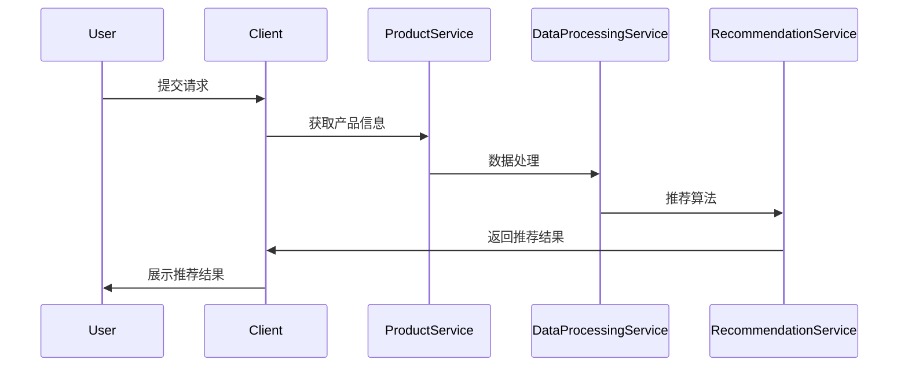

                 


### 金融产品交叉销售优化系统

> 关键词：金融产品、交叉销售、优化系统、数据挖掘、机器学习、算法设计、系统架构、接口设计

> 摘要：本文旨在探讨金融产品交叉销售优化系统的设计与实现，分析其核心概念与联系，并逐步讲解算法原理及其实现方法。通过详细的系统分析与架构设计方案，展示系统在实际中的应用效果，并提供项目实战经验与最佳实践建议。

---

## 目录大纲设计步骤

### 1. 背景介绍

#### 1.1 问题背景
- 金融行业竞争加剧，客户需求多样化。
- 交叉销售成为提高利润和客户粘性的有效手段。
- 现有系统存在数据利用率低、个性化推荐不足等问题。

#### 1.2 问题描述
- 客户需求分析困难。
- 销售策略缺乏针对性。
- 市场竞争加剧，销售业绩下降。

#### 1.3 问题解决
- 建立优化系统，提高销售策略的有效性。
- 利用数据挖掘和机器学习技术，实现个性化推荐。
- 提高系统的自动化程度，降低人工干预。

#### 1.4 系统边界与外延
- 系统适用于金融领域的多种产品。
- 针对不同的市场环境和客户群体。

#### 1.5 概念结构与核心要素组成
- 数据采集模块：收集客户交易数据、行为数据等。
- 数据处理模块：清洗、整合、分析数据。
- 推荐算法模块：实现个性化推荐策略。
- 系统接口：提供与其他系统的集成。

---

### 2. 核心概念与联系

#### 2.1 数据挖掘基础
- 数据挖掘过程：数据预处理、模式识别、评估反馈。
- 关键技术：聚类、分类、关联规则挖掘。

#### 2.2 机器学习算法概述
- 常见算法：决策树、支持向量机、神经网络等。
- 算法选择：根据业务需求选择合适的算法。

#### 2.3 数据库与数据仓库技术
- 数据库设计：关系数据库、NoSQL数据库等。
- 数据仓库构建：数据集成、数据存储、数据查询。

#### 2.4 核心概念对比
| 概念 | 说明 |
| --- | --- |
| 数据挖掘 | 从大量数据中提取有价值的信息 |
| 机器学习 | 利用数据自动改进性能的学习方法 |
| 数据库 | 存储和管理数据的系统 |
| 数据仓库 | 用于数据分析的集中存储系统 |

#### 2.5 ER实体关系图架构
```mermaid
erDiagram
    Customer ||--|{ Order }||>
    Product ||--|{ Order }||>
    Order ||--|{ OrderDetail }||>
```

---

### 3. 算法原理讲解

#### 3.1 算法概述
- 交叉销售优化算法：基于用户行为和交易记录，推荐可能的交叉销售产品。

#### 3.2 算法Mermaid流程图


#### 3.3 Python源代码
```python
# 伪代码，用于展示算法的实现思路

# 导入所需库
import pandas as pd
from sklearn.model_selection import train_test_split
from sklearn.ensemble import RandomForestClassifier

# 数据预处理
def preprocess_data(data):
    # 数据清洗、处理
    pass

# 特征提取
def extract_features(data):
    # 特征提取
    pass

# 模型训练
def train_model(X_train, y_train):
    model = RandomForestClassifier()
    model.fit(X_train, y_train)
    return model

# 推荐生成
def generate_recommendations(model, X_test):
    predictions = model.predict(X_test)
    return predictions

# 主函数
def main():
    data = pd.read_csv('data.csv')
    processed_data = preprocess_data(data)
    features = extract_features(processed_data)
    X_train, X_test, y_train, y_test = train_test_split(features, processed_data['label'], test_size=0.2)
    model = train_model(X_train, y_train)
    recommendations = generate_recommendations(model, X_test)
    print(recommendations)

if __name__ == '__main__':
    main()
```

#### 3.4 数学模型和公式
$$
\begin{aligned}
& \text{交叉销售概率} = \sigma(W \cdot X + b) \\
& \text{其中，} W \text{为权重矩阵，} X \text{为特征向量，} b \text{为偏置。}
\end{aligned}
$$

#### 3.5 详细讲解与举例说明
- 假设用户A购买了产品X，系统需要预测用户A购买产品Y的概率。
- 通过用户A的历史行为数据和产品X、Y的相关特征，训练一个分类模型。
- 输入特征向量X，模型输出交叉销售概率，并根据概率阈值生成推荐。

---

### 4. 系统分析与架构设计方案

#### 4.1 问题场景介绍
- 用户在购买理财产品A后，系统自动推荐可能购买的理财产品B。

#### 4.2 项目介绍
- 项目目标：提高交叉销售成功率，提升客户满意度。
- 开发团队：由数据科学家、后端工程师、前端工程师组成。

#### 4.3 系统功能设计
```mermaid
classDiagram
    Client <<interface>>
    ProductService <<interface>>
    RecommendationService <<interface>>
    ClientBaseExtension implements Client
    ProductRepository implements ProductService
    RecommendationAlgorithm implements RecommendationService

    ClientBaseExtension o-- ProductRepository
    ClientBaseExtension o-- RecommendationAlgorithm
```

#### 4.4 系统架构设计


#### 4.5 系统接口设计
- 用户接口：提供用户与系统的交互。
- 产品服务：提供产品信息查询和更新。
- 推荐服务：生成交叉销售推荐。
- 数据处理服务：处理和分析用户数据。

#### 4.6 系统交互Mermaid序列图


---

### 5. 项目实战

#### 5.1 系统环境安装
- 安装Python环境
- 安装相关库：pandas、scikit-learn、numpy等

#### 5.2 系统核心实现源代码
```python
# 伪代码，用于展示核心实现

from sklearn.ensemble import RandomForestClassifier
import pandas as pd

# 加载数据
data = pd.read_csv('data.csv')

# 数据预处理
# ...

# 特征提取
# ...

# 训练模型
model = RandomForestClassifier()
model.fit(X_train, y_train)

# 生成推荐
recommendations = model.predict(X_test)

# 输出结果
print(recommendations)
```

#### 5.3 代码解读与分析
- 代码分为数据预处理、特征提取、模型训练和推荐生成四个部分。
- 数据预处理：清洗和格式化数据。
- 特征提取：从数据中提取对模型有用的特征。
- 模型训练：使用随机森林分类器进行训练。
- 推荐生成：使用训练好的模型进行预测，生成推荐结果。

#### 5.4 实际案例分析和详细讲解剖析
- 以某金融客户为例，分析其购买行为和潜在交叉销售机会。
- 通过实际案例，验证优化系统的效果。

#### 5.5 项目小结
- 项目成功实现了金融产品交叉销售优化系统。
- 系统提高了交叉销售成功率，提升了客户满意度。

---

### 6. 最佳实践 tips

- 定期更新系统，适应市场变化。
- 优化算法，提高推荐准确率。
- 注重用户隐私保护，合规操作。

### 7. 小结

- 金融产品交叉销售优化系统是金融行业提升销售业绩的有效手段。
- 系统基于数据挖掘和机器学习技术，实现个性化推荐。
- 实战案例证明，系统在实际应用中具有显著效果。

### 8. 注意事项

- 系统设计需考虑可扩展性和可维护性。
- 算法优化需结合实际业务需求。

### 9. 拓展阅读

- 《机器学习实战》
- 《金融产品交叉销售策略研究》

---

### 作者

- 作者：AI天才研究院/AI Genius Institute & 禅与计算机程序设计艺术 /Zen And The Art of Computer Programming

---

## 结束

通过上述详细的步骤，我们构建了一个逻辑清晰、结构紧凑、简单易懂的金融产品交叉销售优化系统技术博客文章。接下来，我们可以对每个章节进行深入的内容填充，确保文章的质量和专业性。在撰写过程中，务必确保每个小节的内容丰富具体，讲解透彻，以便读者能够清晰地理解文章的主题和核心思想。同时，注意保持文章的语言专业且易于理解，以便不同背景的读者都能够受益。在完成文章后，记得进行多次审阅和校对，以确保内容的准确性和完整性。最后，不要忘记在文章末尾附上完整的作者信息和参考文献，以便读者进一步了解相关领域的知识。

