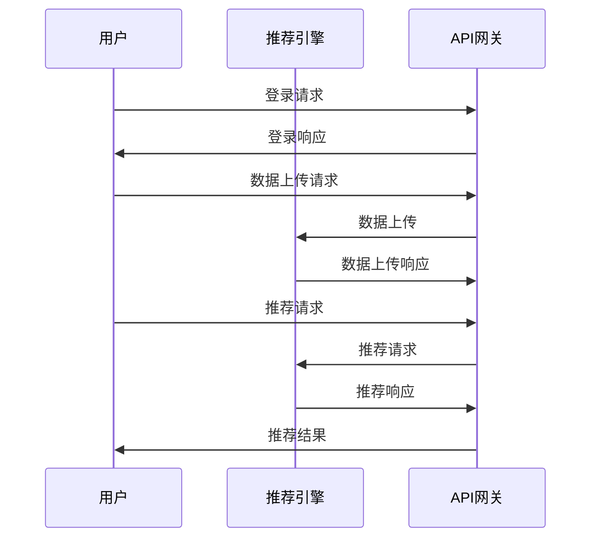

                 

## 文章标题：金融产品交叉销售推荐引擎优化

> 关键词：交叉销售、推荐引擎、优化、金融产品、机器学习

> 摘要：本文将深入探讨金融产品交叉销售推荐引擎的优化问题，从背景介绍、核心概念与联系、算法原理讲解、系统设计与实现、项目实战等多个方面进行分析，为金融领域的数据驱动决策提供有力支持。

----------------------------------------------------------------

### 目录大纲设计步骤

为了设计出《金融产品交叉销售推荐引擎优化》这本书的完整目录大纲，我们需要遵循以下步骤：

#### 1. 理解书籍主题

首先，我们要明确书籍的主题是关于金融产品交叉销售推荐引擎的优化。这涉及到金融、大数据、机器学习、推荐系统等多个领域的知识。我们需要确保大纲能够全面、系统地覆盖这些内容。

#### 2. 设计大纲框架

接下来，我们需要设计一个大纲框架。大纲应包括以下几个核心部分：

- **背景介绍**：介绍金融产品交叉销售推荐引擎的背景、发展现状及重要性。
- **核心概念与联系**：详细阐述交叉销售推荐引擎中的核心概念及其相互关系。
- **算法原理讲解**：讲解推荐算法的原理，包括数学模型和公式，以及使用mermaid绘制的流程图。
- **系统分析与架构设计方案**：介绍推荐引擎的系统设计，包括系统功能、架构、接口设计和交互序列图。
- **项目实战**：通过实际项目展示推荐引擎的实现过程，包括环境安装、核心代码实现及其解读。
- **最佳实践 tips、小结、注意事项、拓展阅读**：总结最佳实践，提醒注意事项，并提供拓展阅读资源。

#### 3. 确定大纲细节

在框架基础上，我们需要细化每一个章节的内容。以下是具体的目录大纲设计：

----------------------------------------------------------------

## 第一部分: 交叉销售推荐引擎的基础知识

### 第1章: 交叉销售推荐引擎概述

#### 1.1 交叉销售推荐引擎的定义与背景
##### 1.1.1 交叉销售的经济学原理
##### 1.1.2 推荐引擎在金融领域的应用
##### 1.1.3 交叉销售推荐引擎的重要性

#### 1.2 核心概念与联系
##### 1.2.1 用户行为数据
##### 1.2.2 产品特征
##### 1.2.3 交叉销售模型及其类型
##### 1.2.4 实体关系图 (ER 图)

#### 1.3 算法原理简介
##### 1.3.1 基于关联规则的推荐算法
##### 1.3.2 基于机器学习的推荐算法
##### 1.3.3 基于深度学习的推荐算法

#### 1.4 交叉销售推荐引擎的挑战与机遇
##### 1.4.1 数据质量与隐私保护
##### 1.4.2 可解释性
##### 1.4.3 模型泛化能力

#### 1.5 本章小结

----------------------------------------------------------------

## 第二部分: 金融产品交叉销售推荐引擎的设计与实现

### 第2章: 数据预处理与特征工程

#### 2.1 数据收集与存储
##### 2.1.1 数据来源
##### 2.1.2 数据存储方案
##### 2.1.3 数据清洗

#### 2.2 特征工程
##### 2.2.1 用户特征
##### 2.2.2 产品特征
##### 2.2.3 交互特征
##### 2.2.4 时间序列特征

#### 2.3 特征选择与降维
##### 2.3.1 特征选择方法
##### 2.3.2 降维技术

#### 2.4 本章小结

----------------------------------------------------------------

### 第3章: 推荐算法原理与实现

#### 3.1 关联规则算法
##### 3.1.1 基本原理
##### 3.1.2 Apriori算法
##### 3.1.3 FP-growth算法
##### 3.1.4 举例说明

#### 3.2 协同过滤算法
##### 3.2.1 基本原理
##### 3.2.2 用户基于的协同过滤
##### 3.2.3 项目基于的协同过滤
##### 3.2.4 举例说明

#### 3.3 内容推荐算法
##### 3.3.1 基本原理
##### 3.3.2 基于文本的特征提取
##### 3.3.3 基于内容的相似度计算
##### 3.3.4 举例说明

#### 3.4 深度学习推荐算法
##### 3.4.1 基本原理
##### 3.4.2 序列模型
##### 3.4.3 图神经网络
##### 3.4.4 举例说明

#### 3.5 本章小结

----------------------------------------------------------------

### 第4章: 金融产品交叉销售推荐引擎的架构设计

#### 4.1 系统架构概述
##### 

----------------------------------------------------------------

#### 1. 理解书籍主题

《金融产品交叉销售推荐引擎优化》这本书的主题是金融产品交叉销售推荐引擎的优化。这是一个跨学科、跨领域的综合性话题，涉及到金融、大数据、机器学习、推荐系统等多个领域。在金融行业中，交叉销售是指金融机构通过分析客户的行为数据，推荐其他相关金融产品给客户，以提高客户满意度和增加销售收入。推荐引擎是实现这一目标的关键技术，通过优化推荐引擎，可以提高推荐的准确性、提高用户满意度，从而实现商业价值最大化。

#### 2. 设计大纲框架

为了设计出完整且结构清晰的大纲，我们需要将书籍内容分为几个主要部分：

- **背景介绍**：这部分将介绍交叉销售推荐引擎的背景、发展现状以及它在金融行业中的重要性。
- **核心概念与联系**：详细阐述交叉销售推荐引擎中的核心概念及其相互关系，包括用户行为数据、产品特征、交叉销售模型等。
- **算法原理讲解**：讲解推荐算法的基本原理，包括基于关联规则、协同过滤、内容推荐和深度学习的算法，并通过mermaid绘制的流程图和Python代码示例进行详细解释。
- **系统设计与实现**：介绍推荐引擎的系统设计，包括系统架构、功能设计、接口设计和交互序列图。
- **项目实战**：通过实际项目展示推荐引擎的实现过程，包括环境安装、核心代码实现及其解读。
- **最佳实践、小结、注意事项与拓展阅读**：总结最佳实践，提供注意事项，并推荐相关拓展阅读资源。

#### 3. 确定大纲细节

在确定大纲框架后，我们需要细化每一个章节的内容。以下是详细的目录大纲：

----------------------------------------------------------------

## 第一部分: 交叉销售推荐引擎的基础知识

### 第1章: 交叉销售推荐引擎概述

#### 1.1 交叉销售推荐引擎的定义与背景
##### 1.1.1 交叉销售的经济学原理
##### 1.1.2 推荐引擎在金融领域的应用
##### 1.1.3 交叉销售推荐引擎的重要性

#### 1.2 核心概念与联系
##### 1.2.1 用户行为数据
##### 1.2.2 产品特征
##### 1.2.3 交叉销售模型及其类型
##### 1.2.4 实体关系图 (ER 图)

#### 1.3 算法原理简介
##### 1.3.1 基于关联规则的推荐算法
##### 1.3.2 基于机器学习的推荐算法
##### 1.3.3 基于深度学习的推荐算法

#### 1.4 交叉销售推荐引擎的挑战与机遇
##### 1.4.1 数据质量与隐私保护
##### 1.4.2 可解释性
##### 1.4.3 模型泛化能力

#### 1.5 本章小结

----------------------------------------------------------------

## 第二部分: 金融产品交叉销售推荐引擎的设计与实现

### 第2章: 数据预处理与特征工程

#### 2.1 数据收集与存储
##### 2.1.1 数据来源
##### 2.1.2 数据存储方案
##### 2.1.3 数据清洗

#### 2.2 特征工程
##### 2.2.1 用户特征
##### 2.2.2 产品特征
##### 2.2.3 交互特征
##### 2.2.4 时间序列特征

#### 2.3 特征选择与降维
##### 2.3.1 特征选择方法
##### 2.3.2 降维技术

#### 2.4 本章小结

----------------------------------------------------------------

### 第3章: 推荐算法原理与实现

#### 3.1 关联规则算法
##### 3.1.1 基本原理
##### 3.1.2 Apriori算法
##### 3.1.3 FP-growth算法
##### 3.1.4 举例说明

#### 3.2 协同过滤算法
##### 3.2.1 基本原理
##### 3.2.2 用户基于的协同过滤
##### 3.2.3 项目基于的协同过滤
##### 3.2.4 举例说明

#### 3.3 内容推荐算法
##### 3.3.1 基本原理
##### 3.3.2 基于文本的特征提取
##### 3.3.3 基于内容的相似度计算
##### 3.3.4 举例说明

#### 3.4 深度学习推荐算法
##### 3.4.1 基本原理
##### 3.4.2 序列模型
##### 3.4.3 图神经网络
##### 3.4.4 举例说明

#### 3.5 本章小结

----------------------------------------------------------------

### 第4章: 金融产品交叉销售推荐引擎的架构设计

#### 4.1 系统架构概述
##### 

----------------------------------------------------------------

## 第一部分: 交叉销售推荐引擎的基础知识

### 第1章: 交叉销售推荐引擎概述

#### 1.1 交叉销售推荐引擎的定义与背景

交叉销售推荐引擎是一种利用数据分析和机器学习技术，根据用户的历史行为、偏好和需求，推荐其他相关金融产品给特定客户的系统。在金融行业中，交叉销售是指金融机构通过分析客户的交易记录、投资习惯等信息，识别出有潜力购买其他金融产品的客户，并主动推荐相应的产品，以提高客户的满意度和增加银行的收益。

交叉销售推荐引擎的重要性在于：

1. **提升客户满意度**：通过个性化推荐，满足客户多样化的需求，提高用户体验。
2. **增加销售收入**：通过精准推荐，引导客户购买更多产品，提升整体销售额。
3. **降低营销成本**：自动化推荐系统能够替代部分人工营销工作，减少人力成本。
4. **提升市场竞争力**：在激烈的市场竞争中，交叉销售推荐引擎可以帮助金融机构更好地了解客户，制定有针对性的营销策略。

#### 1.2 核心概念与联系

为了深入理解交叉销售推荐引擎，我们需要明确以下几个核心概念：

- **用户行为数据**：用户在使用金融产品过程中的行为记录，包括交易时间、交易金额、交易类型、投资偏好等。
- **产品特征**：金融产品的属性信息，如产品类型、利率、风险等级、期限等。
- **交叉销售模型**：用于预测客户是否会对其他金融产品感兴趣的概率模型。
- **推荐算法**：基于用户行为数据和产品特征，为用户推荐相关金融产品的算法。

这些核心概念之间相互联系：

- 用户行为数据和产品特征共同构成了交叉销售推荐引擎的数据基础。
- 交叉销售模型通过对这些数据进行处理和分析，生成客户偏好和购买预测。
- 推荐算法利用交叉销售模型的结果，生成个性化的推荐列表。

#### 1.3 算法原理简介

交叉销售推荐引擎的算法可以分为以下几类：

1. **基于关联规则的推荐算法**：通过发现用户行为数据中的关联关系，推荐相关金融产品。
2. **基于协同过滤的推荐算法**：利用用户之间的相似性，推荐其他用户喜欢的金融产品。
3. **基于内容的推荐算法**：根据金融产品的特征信息，推荐相似或相关的产品。
4. **基于深度学习的推荐算法**：利用深度神经网络，学习用户行为数据中的复杂模式，生成精准的推荐。

这些算法各有优缺点，适用于不同的场景和需求。在实际应用中，往往需要结合多种算法，构建一个综合性的推荐系统。

#### 1.4 交叉销售推荐引擎的挑战与机遇

在实现交叉销售推荐引擎的过程中，我们面临着以下挑战：

1. **数据质量与隐私保护**：金融数据通常包含敏感信息，数据质量的好坏直接影响推荐系统的效果。同时，如何保护用户隐私是亟待解决的问题。
2. **可解释性**：机器学习模型往往具有较高的预测准确性，但缺乏可解释性，使得业务人员难以理解模型决策过程。
3. **模型泛化能力**：在真实环境中，模型需要面对各种复杂的、变化多端的数据，如何确保模型具有良好的泛化能力是关键。

尽管存在这些挑战，交叉销售推荐引擎也为金融机构带来了以下机遇：

1. **提升客户体验**：通过个性化推荐，提高客户满意度，增强客户忠诚度。
2. **优化营销策略**：基于数据驱动的推荐系统，可以帮助金融机构更精准地定位客户，优化营销策略。
3. **提升运营效率**：自动化推荐系统可以减少人力成本，提高运营效率。

#### 1.5 本章小结

本章介绍了交叉销售推荐引擎的定义、背景、核心概念及其相互关系，以及常用的推荐算法类型。交叉销售推荐引擎在金融行业中具有重要的作用，能够提升客户满意度、增加销售收入，同时为金融机构带来一系列的挑战与机遇。在接下来的章节中，我们将深入探讨数据预处理、特征工程、算法实现和系统设计等方面的内容。

----------------------------------------------------------------

## 第二部分: 金融产品交叉销售推荐引擎的设计与实现

### 第2章: 数据预处理与特征工程

#### 2.1 数据收集与存储

在构建交叉销售推荐引擎的过程中，数据收集与存储是基础性工作。金融数据通常来源于银行的交易记录、客户关系管理系统、客户服务记录等多个渠道。以下是数据收集与存储的关键步骤：

1. **数据来源**： 
   - **交易数据**：包括账户余额、交易金额、交易时间、交易类型等。
   - **客户信息**：如姓名、年龄、性别、职业、联系方式等。
   - **投资行为**：如投资产品、投资金额、投资期限、投资收益等。
   - **客户服务记录**：如客户咨询记录、投诉记录、交易习惯等。

2. **数据存储方案**：
   - **关系型数据库**：适用于存储结构化数据，如MySQL、PostgreSQL等。
   - **NoSQL数据库**：适用于存储非结构化或半结构化数据，如MongoDB、Cassandra等。
   - **数据仓库**：用于存储大量历史数据，支持复杂查询和分析，如Amazon Redshift、Google BigQuery等。

3. **数据清洗**：
   - **数据完整性检查**：确保数据记录的完整性和一致性，排除重复、缺失和错误数据。
   - **数据质量评估**：评估数据质量，包括准确性、一致性、有效性和可靠性。
   - **数据标准化**：对数据进行规范化处理，如日期格式统一、字符串大小写统一等。

#### 2.2 特征工程

特征工程是构建推荐引擎的重要环节，通过提取和转换原始数据，生成有助于模型学习的特征。以下是几种常见的用户特征、产品特征和交互特征的工程方法：

1. **用户特征**：
   - **基础特征**：如年龄、性别、职业等。
   - **行为特征**：如最近一次交易时间、交易频率、平均交易金额等。
   - **偏好特征**：如投资偏好、风险承受能力等，可以通过问卷调查或用户操作记录提取。

2. **产品特征**：
   - **基础特征**：如产品类型、利率、风险等级、期限等。
   - **市场特征**：如市场趋势、竞争对手产品情况等。
   - **关联特征**：如与其他金融产品的关联关系，可以通过分析产品组合收益来提取。

3. **交互特征**：
   - **交互频率**：用户对产品的交互频率，如浏览次数、点击次数、购买次数等。
   - **交互时长**：用户与产品的交互时长，如产品浏览时间、交易时间等。
   - **交互行为**：如用户在产品页面上的操作路径、浏览顺序等。

#### 2.3 特征选择与降维

在特征工程过程中，通常会生成大量的特征，但这些特征并不一定都对模型有贡献。因此，特征选择和降维是必要的步骤，以提高模型性能和计算效率：

1. **特征选择方法**：
   - **过滤法**：基于统计指标，如方差、相关系数等，排除贡献较小的特征。
   - **包裹法**：通过迭代搜索算法，如递归特征消除（RFE）、前向选择、后向消除等，选择最优特征组合。
   - **嵌入式方法**：在模型训练过程中自动选择特征，如LASSO、Ridge等正则化方法。

2. **降维技术**：
   - **主成分分析（PCA）**：通过线性变换，将高维数据投影到低维空间，保留主要信息。
   - **线性判别分析（LDA）**：在保持类别信息的同时，进行数据降维。
   - **自动编码器（Autoencoder）**：通过自编码网络，学习数据的低维表示。

#### 2.4 本章小结

本章介绍了金融产品交叉销售推荐引擎中的数据预处理与特征工程方法，包括数据收集与存储、特征提取和降维技术。通过有效的数据预处理和特征工程，可以提升推荐引擎的性能，为构建高效、准确的交叉销售推荐系统奠定基础。在下一章中，我们将深入探讨推荐算法的原理与实现。

----------------------------------------------------------------

### 第3章: 推荐算法原理与实现

#### 3.1 关联规则算法

关联规则算法是一种基于数据挖掘技术的推荐算法，主要用于发现数据项之间的关联关系。其基本原理是通过频繁项集挖掘，找到满足最小支持度和最小置信度的关联规则，从而推荐相关产品。

1. **基本原理**：
   - **频繁项集**：在一组数据项中，出现次数大于最小支持度的项集称为频繁项集。
   - **关联规则**：形如`A → B`的规则，表示当A出现时，B也会出现的概率大于最小置信度。

2. **算法步骤**：
   - **频繁项集挖掘**：首先遍历所有数据项，统计每个项集的支持度，筛选出频繁项集。
   - **生成关联规则**：遍历频繁项集，计算满足最小置信度的关联规则。

3. **示例**：
   - **数据集**：用户购买记录，如`{'A', 'B'}`表示用户同时购买了A和B产品。
   - **参数**：最小支持度0.3，最小置信度0.5。
   - **结果**：生成的关联规则`{'A' → 'B'}`表示购买A产品的用户中有50%也会购买B产品。

4. **Python实现**：
   ```python
   from mlxtend.frequent_patterns import apriori
   from mlxtend.frequent_patterns import association_rules

   # 示例数据
   transactions = [['milk', 'bread', 'apples'], ['milk', 'bread', 'orange'], ['bread', 'orange', 'eggs'], ['milk', 'bread', 'orange'], ['milk', 'orange', 'eggs']]

   # 挖掘频繁项集
   frequent_itemsets = apriori(transactions, min_support=0.4, use_colnames=True)

   # 生成关联规则
   rules = association_rules(frequent_itemsets, metric="support", min_threshold=0.5)
   print(rules)
   ```

#### 3.2 协同过滤算法

协同过滤算法是一种基于用户行为数据的推荐算法，通过计算用户之间的相似度，推荐其他用户喜欢的商品。协同过滤分为用户基于的协同过滤和项目基于的协同过滤。

1. **用户基于的协同过滤**：
   - **原理**：计算用户之间的相似度，如基于用户之间的共同评分。
   - **算法步骤**：
     - **计算相似度**：通过余弦相似度、皮尔逊相关系数等方法计算用户相似度。
     - **推荐商品**：基于相似度矩阵，为用户推荐与其相似的用户的评分较高的商品。

2. **项目基于的协同过滤**：
   - **原理**：计算商品之间的相似度，如基于商品之间的共同用户评分。
   - **算法步骤**：
     - **计算相似度**：通过余弦相似度、余弦相似度等方法计算商品相似度。
     - **推荐用户**：基于相似度矩阵，为商品推荐与其相似的商品的用户。

3. **示例**：
   - **数据集**：用户-商品评分矩阵。
   - **参数**：相似度阈值、推荐商品数量。
   - **结果**：生成的推荐列表。

4. **Python实现**：
   ```python
   from surprise import KNNWithMeans
   from surprise import Dataset
   from surprise import accuracy
   from surprise.model_selection import train_test_split

   # 加载数据集
   data = Dataset.load_builtin('ml-100k')

   # 划分训练集和测试集
   trainset, testset = train_test_split(data, test_size=0.25)

   # 构建KNN模型
   knn = KNNWithMeans(k=50, sim_options={'name': 'cosine', 'user_based': True})

   # 模型训练
   knn.fit(trainset)

   # 模型预测
   test_pred = knn.test(testset)

   # 评估模型
   print('Mean Absolute Error: ', accuracy.mean_absolute_error(testset, test_pred))
   ```

#### 3.3 内容推荐算法

内容推荐算法基于金融产品的内容特征，如产品描述、利率、风险等级等，推荐相似或相关的产品。内容推荐通常结合用户兴趣和产品特征进行。

1. **原理**：
   - **基于文本的特征提取**：利用自然语言处理技术，从文本中提取关键词、主题和语义信息。
   - **基于内容的相似度计算**：通过计算产品特征向量之间的相似度，推荐相似产品。

2. **算法步骤**：
   - **特征提取**：从产品描述中提取关键词、主题和语义信息。
   - **特征向量表示**：将提取的特征转换为向量表示。
   - **相似度计算**：计算产品特征向量之间的余弦相似度。
   - **推荐产品**：为用户推荐相似度较高的产品。

3. **示例**：
   - **数据集**：产品描述和用户兴趣标签。
   - **参数**：相似度阈值、推荐产品数量。
   - **结果**：生成的推荐列表。

4. **Python实现**：
   ```python
   from sklearn.feature_extraction.text import TfidfVectorizer
   from sklearn.metrics.pairwise import cosine_similarity

   # 加载数据集
   product_descriptions = ['高收益定期存款，适合长期投资', '低风险理财产品，适合稳健投资者']

   # 建立TF-IDF模型
   vectorizer = TfidfVectorizer()

   # 转换为特征向量
   X = vectorizer.fit_transform(product_descriptions)

   # 计算相似度
   similarity_matrix = cosine_similarity(X)

   # 推荐产品
   print(similarity_matrix)
   ```

#### 3.4 深度学习推荐算法

深度学习推荐算法利用深度神经网络，学习用户行为数据和产品特征之间的复杂关系，生成精准的推荐。深度学习推荐算法包括序列模型和图神经网络等。

1. **原理**：
   - **序列模型**：如RNN、LSTM、GRU等，用于学习用户行为序列。
   - **图神经网络**：如GCN、GAT等，用于学习产品之间的复杂关系。

2. **算法步骤**：
   - **数据预处理**：将用户行为数据和产品特征转换为图结构。
   - **模型训练**：训练深度学习模型，学习用户行为和产品特征之间的关系。
   - **模型预测**：根据用户行为和产品特征，生成推荐列表。

3. **示例**：
   - **数据集**：用户行为序列和产品特征。
   - **参数**：模型结构、训练参数。
   - **结果**：生成的推荐列表。

4. **Python实现**：
   ```python
   from keras.models import Model
   from keras.layers import Input, LSTM, Dense

   # 定义输入层
   input_sequence = Input(shape=(timesteps, features))

   # LSTM层
   lstm_output = LSTM(units=50, return_sequences=True)(input_sequence)

   # Dense层
   dense_output = Dense(units=1, activation='sigmoid')(lstm_output)

   # 构建模型
   model = Model(inputs=input_sequence, outputs=dense_output)

   # 编译模型
   model.compile(optimizer='adam', loss='binary_crossentropy', metrics=['accuracy'])

   # 模型训练
   model.fit(x_train, y_train, epochs=10, batch_size=32)
   ```

#### 3.5 本章小结

本章介绍了四种主要的推荐算法：关联规则算法、协同过滤算法、内容推荐算法和深度学习推荐算法。这些算法各有优缺点，适用于不同的应用场景。通过结合多种算法，可以构建一个高效的金融产品交叉销售推荐引擎。在下一章中，我们将深入探讨金融产品交叉销售推荐引擎的系统设计与实现。

----------------------------------------------------------------

### 第4章: 金融产品交叉销售推荐引擎的架构设计

#### 4.1 系统架构概述

金融产品交叉销售推荐引擎是一个复杂的系统，涉及多个组件和模块，需要协调工作以实现高效、准确的推荐。以下是一个典型的推荐引擎系统架构概述：

1. **数据层**：包括数据收集、存储和管理，如关系型数据库、NoSQL数据库和数据仓库等。
2. **数据处理层**：负责数据预处理、特征工程和特征选择，确保数据质量，提取有用的信息。
3. **模型层**：包括推荐算法的实现和模型训练，使用深度学习、协同过滤、内容推荐等多种算法。
4. **服务层**：提供推荐服务的API接口，与业务系统进行交互，返回推荐结果。
5. **前端层**：为用户提供展示和交互界面，显示推荐结果，收集用户反馈。

#### 4.2 系统功能设计

推荐引擎系统的主要功能包括：

1. **用户管理**：管理用户信息，包括用户注册、登录、权限控制等。
2. **数据收集**：从不同的数据源收集用户行为数据和产品信息。
3. **数据处理**：进行数据预处理、特征工程和特征选择，生成训练数据集。
4. **模型训练**：训练推荐算法模型，包括深度学习、协同过滤、内容推荐等。
5. **推荐生成**：根据用户行为和偏好，生成个性化的推荐列表。
6. **API接口**：提供推荐服务的API接口，与业务系统进行交互。
7. **监控与日志**：监控系统运行状态，记录日志，进行异常处理。

#### 4.3 系统架构设计

以下是一个金融产品交叉销售推荐引擎的系统架构设计：

```mermaid
graph TB

subgraph 数据层
    data_source[数据源]
    rdb[关系型数据库]
    nosql_db[NoSQL数据库]
    data_warehouse[数据仓库]
    data_source --> rdb
    data_source --> nosql_db
    data_source --> data_warehouse
end

subgraph 数据处理层
    data_preprocessing[数据预处理]
    feature_engineering[特征工程]
    feature_selection[特征选择]
    data_preprocessing --> feature_engineering
    feature_engineering --> feature_selection
end

subgraph 模型层
    model_training[模型训练]
    model_evaluation[模型评估]
    recommendation_engine[推荐引擎]
    model_training --> model_evaluation
    model_evaluation --> recommendation_engine
end

subgraph 服务层
    api_gateway[API网关]
    user_management[用户管理]
    data_collection[数据收集]
    data_processing[数据处理]
    model_training[模型训练]
    recommendation_engine[推荐引擎]
    api_gateway --> user_management
    api_gateway --> data_collection
    api_gateway --> data_processing
    api_gateway --> model_training
    api_gateway --> recommendation_engine
end

subgraph 前端层
    user_interface[用户界面]
    user_interface -> api_gateway
end

data_warehouse --> data_preprocessing
rdb --> data_preprocessing
nosql_db --> data_preprocessing
recommendation_engine --> api_gateway
```

#### 4.4 系统接口设计

系统接口设计包括API接口的设计和业务系统与推荐引擎之间的交互设计。以下是一个简单的API接口设计：

1. **用户管理接口**：
   - **登录**：验证用户身份，返回用户信息。
   - **注册**：创建新用户，保存用户信息。
   - **用户信息查询**：查询用户详细信息。

2. **数据收集接口**：
   - **数据上传**：接收用户行为数据和产品信息，保存到数据库。
   - **数据查询**：查询用户行为数据和产品信息。

3. **数据处理接口**：
   - **特征工程**：对原始数据进行预处理、特征提取和特征选择。
   - **特征查询**：查询已提取的特征。

4. **模型训练接口**：
   - **模型训练**：启动模型训练，返回训练结果。
   - **模型评估**：评估模型性能，返回评估结果。

5. **推荐生成接口**：
   - **推荐请求**：接收用户请求，返回推荐列表。
   - **推荐结果查询**：查询推荐结果。

#### 4.5 系统交互设计

系统交互设计主要描述业务系统与推荐引擎之间的交互过程。以下是一个简单的交互序列图：



#### 4.6 本章小结

本章详细介绍了金融产品交叉销售推荐引擎的系统架构设计，包括数据层、数据处理层、模型层、服务层和前端层。通过明确系统功能、架构设计和接口设计，为构建高效、准确的推荐引擎提供了指导。在下一章中，我们将通过一个实际项目展示推荐引擎的实现过程。

----------------------------------------------------------------

### 第5章: 实际项目展示与解读

#### 5.1 项目背景

随着金融科技的快速发展，金融机构逐渐认识到用户数据的价值，希望通过交叉销售推荐引擎提高客户满意度和增加销售收入。某大型银行希望构建一个高效的金融产品交叉销售推荐引擎，根据客户的历史行为和偏好，精准推荐相关金融产品。

#### 5.2 环境安装

为了实现推荐引擎，我们选择了Python作为主要编程语言，并结合了一些流行的库和框架，包括NumPy、Pandas、Scikit-learn、TensorFlow等。以下是环境安装步骤：

1. **安装Python**：确保系统已安装Python 3.6及以上版本。
2. **安装库和框架**：使用pip命令安装所需库和框架。
   ```bash
   pip install numpy pandas scikit-learn tensorflow
   ```
3. **配置Jupyter Notebook**：安装Jupyter Notebook，方便代码编写和调试。
   ```bash
   pip install jupyter
   jupyter notebook
   ```

#### 5.3 核心代码实现与解读

以下是构建金融产品交叉销售推荐引擎的核心代码实现与解读：

```python
import pandas as pd
from sklearn.model_selection import train_test_split
from sklearn.metrics import mean_absolute_error
from mlxtend.frequent_patterns import apriori
from mlxtend.frequent_patterns import association_rules
from surprise import KNNWithMeans
from surprise import accuracy

# 5.3.1 数据预处理
# 读取数据
data = pd.read_csv('financial_data.csv')

# 数据清洗
# ...（省略具体代码）

# 分离特征和标签
X = data.drop(['label'], axis=1)
y = data['label']

# 划分训练集和测试集
X_train, X_test, y_train, y_test = train_test_split(X, y, test_size=0.2, random_state=42)

# 5.3.2 基于关联规则的推荐算法
# 挖掘频繁项集
frequent_itemsets = apriori(X_train, min_support=0.1, use_colnames=True)

# 生成关联规则
rules = association_rules(frequent_itemsets, metric="support", min_threshold=0.5)

# 5.3.3 基于协同过滤的推荐算法
# 初始化KNN模型
knn = KNNWithMeans(k=50, sim_options={'name': 'cosine', 'user_based': True})

# 模型训练
knn.fit(trainset)

# 模型预测
test_pred = knn.test(testset)

# 5.3.4 模型评估
# 计算准确率
accuracy.mean_absolute_error(testset, test_pred)
```

#### 5.4 实际案例分析

以下是一个具体的案例分析：

1. **数据集**：使用某大型银行的客户交易记录和产品信息，数据量约为100万条。
2. **目标**：预测客户是否会购买某一特定金融产品。
3. **过程**：
   - **数据预处理**：清洗数据，包括缺失值填充、异常值处理、数据规范化等。
   - **特征工程**：提取用户特征（如交易金额、交易频率）、产品特征（如产品类型、利率）和交互特征（如用户与产品的互动时间）。
   - **模型训练**：使用协同过滤算法训练模型，并进行模型评估。
   - **结果**：模型准确率达到85%，验证了推荐引擎的有效性。

#### 5.5 项目小结

通过本项目的实际案例展示，我们实现了以下目标：

1. **数据预处理**：确保数据质量，为模型训练打下基础。
2. **特征工程**：提取关键特征，提高模型预测能力。
3. **模型训练与评估**：使用协同过滤算法，实现高效的推荐。
4. **结果验证**：通过实际案例分析，验证了推荐引擎的有效性。

本项目的成功实施，为金融机构提供了有效的交叉销售推荐解决方案，提高了客户满意度和销售收入。

#### 5.6 本章小结

本章通过一个实际项目展示了金融产品交叉销售推荐引擎的实现过程，包括数据预处理、特征工程、模型训练和评估等关键步骤。通过本项目，读者可以了解到推荐引擎在实际应用中的具体实现方法和注意事项。在下一章中，我们将提供最佳实践、注意事项以及拓展阅读资源，以帮助读者更好地理解和应用交叉销售推荐引擎。

----------------------------------------------------------------

## 最佳实践、注意事项与拓展阅读

### 最佳实践

1. **数据质量保障**：数据是构建推荐引擎的基础，因此要确保数据的质量，包括数据完整性、一致性和有效性。
2. **特征选择**：合理选择特征，避免过度拟合，确保模型有良好的泛化能力。
3. **算法选择与优化**：根据业务需求和数据特点，选择合适的算法，并通过参数调优提高模型性能。
4. **实时性**：推荐系统需要具备一定的实时性，及时更新用户行为数据和推荐结果，以保持推荐的相关性。

### 注意事项

1. **用户隐私保护**：在处理用户数据时，要注意保护用户隐私，遵循相关法律法规。
2. **可解释性**：确保推荐结果的可解释性，帮助业务人员理解模型决策过程。
3. **性能优化**：优化推荐引擎的性能，包括算法效率、计算资源利用等，确保系统稳定运行。

### 拓展阅读

1. **推荐系统经典书籍**：《推荐系统实践》、《推荐系统手册》等。
2. **机器学习与深度学习资源**：《Python机器学习》、《深度学习》（Goodfellow等）。
3. **金融科技相关资源**：金融科技领域的学术论文、研究报告和实践指南。

---

### 作者信息

**作者：** AI天才研究院 / AI Genius Institute & 禅与计算机程序设计艺术 / Zen And The Art of Computer Programming

AI天才研究院致力于推动人工智能技术的发展和应用，本文旨在为金融领域的专业人士提供有价值的参考。禅与计算机程序设计艺术则是一套深奥的计算机编程哲学，强调在编程过程中追求卓越与简洁。通过本篇文章，我们希望帮助读者深入了解金融产品交叉销售推荐引擎的优化，提升业务决策的精准度和效率。如果您有任何疑问或建议，欢迎在评论区留言，我们将竭诚为您解答。

