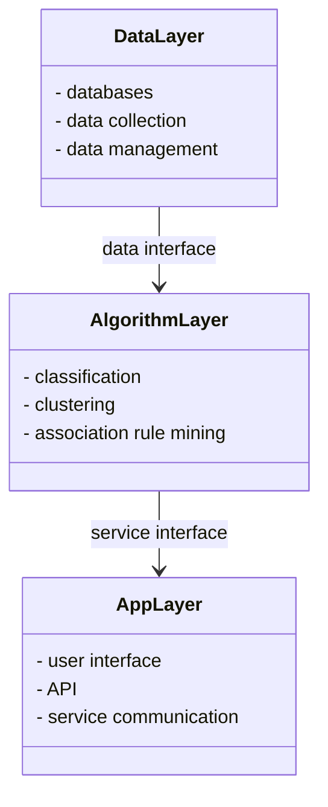
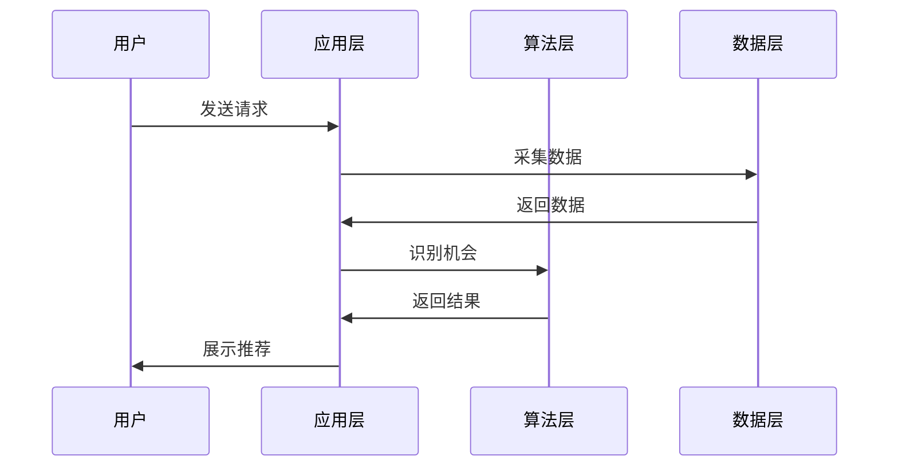

                 


### 1.1 金融产品交叉销售的背景与重要性

在当今快速发展的金融市场中，金融机构面临着日益激烈的市场竞争和客户期望的不断升级。为了提高盈利能力和客户忠诚度，交叉销售成为了一种重要的策略。本文将深入探讨金融产品交叉销售的背景、重要性以及其面临的挑战，旨在为读者提供全面的理论和实践指导。

#### 1.1.1 交叉销售的定义与商业价值

交叉销售（Cross-Selling）是指通过向现有客户推荐其他相关产品或服务，从而增加客户消费总额的一种营销策略。其核心在于发掘客户需求，提高客户粘性，实现客户价值的最大化。在金融领域，交叉销售不仅可以帮助银行、保险公司、投资公司等金融机构拓展市场份额，提高收入，还能增强客户忠诚度和满意度。

交叉销售的商业价值主要体现在以下几个方面：

1. **提高客户生命周期价值（CLV）**：通过交叉销售，金融机构可以更全面地满足客户需求，提高客户的消费频率和金额，从而延长客户生命周期，提升客户的整体价值。

2. **增加销售收入**：交叉销售可以挖掘现有客户的潜在需求，推动产品销售，从而增加销售收入。

3. **提高客户忠诚度**：交叉销售能够增强客户与金融机构之间的联系，提高客户的满意度和忠诚度。

4. **提升市场竞争力**：通过有效的交叉销售策略，金融机构可以更好地应对市场竞争，提升自身的市场地位。

#### 1.1.2 交叉销售在金融市场中的现状

随着金融科技的快速发展，交叉销售在金融市场中的应用越来越广泛。目前，许多金融机构已经建立了成熟的交叉销售体系，通过大数据分析和人工智能技术，实现客户需求的精准挖掘和产品推荐。

然而，交叉销售在金融市场中仍面临一些挑战：

1. **客户隐私保护**：交叉销售需要收集和分析客户的数据，如何确保客户隐私不被泄露是一个重要的问题。

2. **客户需求多样化**：金融产品的种类繁多，不同客户的金融需求也存在很大差异，如何实现个性化推荐是一个挑战。

3. **市场竞争加剧**：随着金融市场的竞争加剧，金融机构需要在保持服务质量的同时，提高交叉销售的效果，这需要不断提升自身的业务能力和技术水平。

#### 1.1.3 交叉销售的核心挑战

1. **数据收集与处理**：交叉销售需要收集大量的客户数据，包括消费记录、交易行为、社交行为等。如何有效地收集、存储、处理这些数据，是实施交叉销售的关键。

2. **算法选择与优化**：交叉销售算法的选择和优化对交叉销售的效果至关重要。不同的算法适用于不同的业务场景，如何选择合适的算法并进行优化是一个重要的课题。

3. **客户体验**：交叉销售需要平衡客户体验和销售效果，如何在推荐过程中不干扰客户，提升客户体验是一个挑战。

4. **合规性**：在金融行业中，合规性是至关重要的。交叉销售需要遵守相关法律法规，确保业务的合规性。

#### 1.1.4 交叉销售机会识别的方法与策略

1. **客户细分**：通过对客户数据的分析，将客户分为不同的细分市场，为每个细分市场制定相应的交叉销售策略。

2. **行为分析**：分析客户的消费行为、交易行为等，识别客户的潜在需求和偏好。

3. **产品组合推荐**：基于客户数据和产品特性，推荐适合客户的产品组合，提高销售转化率。

4. **个性化推荐**：利用机器学习和大数据技术，实现个性化推荐，提高交叉销售的成功率。

#### 1.1.5 交叉销售的优势与局限性

交叉销售的优势在于：

1. **提高客户满意度**：通过满足客户的多样化需求，提高客户满意度。

2. **增加产品销售**：通过推荐相关产品，增加产品销售。

3. **提升竞争力**：通过有效的交叉销售策略，提升金融机构的市场竞争力。

然而，交叉销售也存在一定的局限性：

1. **客户隐私风险**：数据收集和利用过程中可能涉及客户隐私。

2. **实施成本**：交叉销售需要投入大量的技术资源和人力成本。

3. **算法风险**：算法模型的选择和优化可能影响交叉销售的效果。

### 结论

交叉销售作为一种有效的营销策略，在金融市场中具有重要地位。通过有效的交叉销售机会识别与个性化推荐，金融机构可以提高客户满意度、增加销售收入，提升市场竞争力。然而，交叉销售也面临一定的挑战，需要金融机构在数据收集、算法选择、客户体验等方面进行综合考虑和优化。本文旨在为读者提供交叉销售的理论和实践指导，助力金融机构实现更高效的交叉销售策略。

---

### 1.2 交叉销售机会识别的概念与流程

#### 1.2.1 交叉销售机会识别的定义

交叉销售机会识别（Cross-Selling Opportunity Detection）是指利用数据分析、机器学习等技术，从大量客户数据中挖掘出潜在的交叉销售机会，并将其转化为实际销售的过程。交叉销售机会识别的核心目标是通过深入理解客户的需求和行为模式，发现客户可能对其他相关产品或服务的需求，从而提高销售转化率和客户满意度。

#### 1.2.2 交叉销售机会识别的关键要素

1. **客户数据**：交叉销售机会识别的基础是客户数据，包括客户的消费记录、交易行为、社交行为、兴趣爱好等。这些数据为识别交叉销售机会提供了重要依据。

2. **产品信息**：产品信息包括产品的功能、特点、价格、受众群体等。产品信息与客户数据的结合，有助于发现潜在的销售机会。

3. **算法模型**：交叉销售机会识别依赖于算法模型，包括分类、聚类、关联规则挖掘等。算法模型用于分析客户数据，提取有价值的信息。

4. **推荐系统**：交叉销售机会识别最终需要通过推荐系统实现，将潜在的销售机会推荐给客户。推荐系统可以根据客户行为和偏好，提供个性化的推荐。

#### 1.2.3 交叉销售机会识别的流程

交叉销售机会识别的流程可以分为以下几个步骤：

1. **数据收集**：收集客户的消费记录、交易行为、社交行为等数据，以及产品相关信息。

2. **数据清洗**：对收集到的数据进行分析，去除重复、错误或无关的数据，确保数据质量。

3. **数据分析**：利用算法模型对清洗后的数据进行分析，提取有价值的信息。例如，通过聚类分析发现具有相似行为的客户群体，通过关联规则挖掘发现产品之间的关联性。

4. **机会识别**：根据分析结果，识别出潜在的交叉销售机会。例如，发现某个客户群体对某类产品有较高的购买意向，或者某类产品与某类产品具有较高的交叉销售概率。

5. **推荐生成**：利用推荐系统，将识别出的交叉销售机会转化为推荐，推送给相应的客户。推荐系统可以根据客户行为和偏好，提供个性化的推荐。

6. **反馈与调整**：收集客户对推荐的反馈，对推荐效果进行评估，并根据反馈对算法模型和推荐策略进行调整。

### 1.2.4 交叉销售机会识别的应用场景

交叉销售机会识别在金融领域中具有广泛的应用场景，主要包括：

1. **银行**：银行可以通过交叉销售机会识别，向现有客户推荐信用卡、理财产品、保险等金融产品，提高客户消费总额和客户满意度。

2. **保险公司**：保险公司可以通过交叉销售机会识别，向客户推荐车险、寿险、健康险等保险产品，提高保险产品的销售。

3. **投资公司**：投资公司可以通过交叉销售机会识别，向客户推荐股票、基金、债券等投资产品，提高客户的投资收益。

4. **电商平台**：电商平台可以通过交叉销售机会识别，向客户推荐相关商品，提高购物车销售额。

### 1.2.5 交叉销售机会识别的优势与挑战

交叉销售机会识别的优势在于：

1. **提高销售转化率**：通过识别潜在的销售机会，提高销售转化率。

2. **提升客户满意度**：通过个性化推荐，满足客户多样化需求，提升客户满意度。

3. **增加产品销售额**：通过推荐相关产品，增加产品销售额。

然而，交叉销售机会识别也面临以下挑战：

1. **数据质量**：数据质量对交叉销售机会识别效果至关重要，数据质量差可能导致识别出的机会不准确。

2. **算法选择与优化**：不同的算法模型适用于不同的场景，如何选择合适的算法并进行优化是一个挑战。

3. **客户隐私保护**：在交叉销售机会识别过程中，需要收集和处理大量客户数据，如何保护客户隐私是一个重要问题。

### 结论

交叉销售机会识别是金融产品交叉销售的关键环节，通过数据分析、机器学习等技术，可以有效挖掘潜在的销售机会，提高销售转化率和客户满意度。然而，交叉销售机会识别也面临一定的挑战，需要金融机构在数据质量、算法选择、客户隐私保护等方面进行综合考虑和优化。本文旨在为读者提供交叉销售机会识别的理论和实践指导，助力金融机构实现更高效的交叉销售策略。

---

### 1.3 核心概念与联系

在金融产品交叉销售机会识别中，理解核心概念及其相互关系是至关重要的。以下是本文涉及的一些关键概念及其属性特征对比，以及相应的ER实体关系图架构。

#### 1.3.1 核心概念

1. **客户（Customer）**：购买或使用金融产品的个人或组织。
   - 属性：客户ID、姓名、性别、年龄、联系方式、居住地等。
   - 关系：购买（购买）、推荐（推荐）、互动（互动）。

2. **产品（Product）**：金融机构提供的金融产品或服务。
   - 属性：产品ID、名称、类型（如存款、贷款、保险、投资等）、利率、费用等。
   - 关系：销售（销售）、推荐（推荐）、关联（关联）。

3. **交易（Transaction）**：客户与金融机构之间的交易行为。
   - 属性：交易ID、时间、金额、产品ID、客户ID等。
   - 关系：属于（属于）、生成（生成）。

4. **推荐（Recommendation）**：基于客户行为和偏好，为特定客户推荐的金融产品。
   - 属性：推荐ID、时间、客户ID、产品ID、推荐分数等。
   - 关系：生成（生成）、接收（接收）。

5. **反馈（Feedback）**：客户对推荐的反馈，用于评估推荐效果。
   - 属性：反馈ID、时间、客户ID、产品ID、评分等。
   - 关系：属于（属于）、反馈（反馈）。

#### 1.3.2 属性特征对比

以下是上述核心概念的属性特征对比表：

| 概念   | 属性                   | 关系   |
| ------ | ---------------------- | ------ |
| 客户   | 客户ID、姓名、性别等     | 购买、推荐、互动 |
| 产品   | 产品ID、名称、类型等     | 销售、推荐、关联 |
| 交易   | 交易ID、时间、金额等     | 属于、生成     |
| 推荐项 | 推荐ID、时间、客户ID等   | 生成、接收     |
| 反馈   | 反馈ID、时间、客户ID等   | 属于、反馈     |

#### 1.3.3 ER实体关系图架构

以下是金融产品交叉销售机会识别的ER实体关系图架构，使用Mermaid语法表示：

```mermaid
erDiagram
    Customer ||--|{ Transaction }|-- Product : 购买
    Customer ||--|{ Recommendation }|-- Product : 推荐项
    Customer ||--|{ Feedback }| Feedback : 反馈
    Transaction ||--| Product : 生成
    Recommendation ||--| Product : 推荐项
    Feedback ||--| Product : 反馈
```

#### 1.3.4 概念关系分析

1. **客户与产品**：客户是购买和使用金融产品的主体，客户与产品之间存在直接的购买关系和推荐关系。通过分析客户的购买历史和偏好，可以识别出潜在的销售机会。

2. **交易与产品**：交易记录了客户与金融机构之间的交易行为，每个交易都与特定的产品相关。通过分析交易数据，可以挖掘出客户的消费行为模式。

3. **推荐与产品**：推荐是基于客户数据和产品信息生成的，目的是提高交叉销售的成功率。推荐系统需要根据客户的偏好和历史数据，为每个客户推荐最合适的金融产品。

4. **反馈与产品**：客户反馈是评估推荐效果的重要依据。通过收集和分析客户反馈，可以优化推荐策略，提高推荐效果。

### 结论

通过理解核心概念及其相互关系，我们可以更深入地了解金融产品交叉销售机会识别的原理和方法。ER实体关系图架构为数据分析和模型构建提供了清晰的框架，有助于实现高效、精准的交叉销售机会识别。本文将继续探讨算法原理、系统设计及实践项目，以期为读者提供全面的技术指导。

---

### 1.4 算法原理讲解

在金融产品交叉销售机会识别中，算法原理是核心部分，决定了交叉销售的效果。以下是本文涉及的主要算法原理，包括分类、聚类、关联规则挖掘等。

#### 1.4.1 分类算法

分类算法（Classification Algorithms）是一种常用的机器学习算法，用于将数据集划分为不同的类别。在交叉销售机会识别中，分类算法可以用于预测客户是否会购买某个产品，从而发现潜在的销售机会。

**算法原理：**

1. **决策树（Decision Tree）**：通过一系列规则，将数据划分为不同的分支，直到达到某个终止条件。决策树能够直观地表示分类过程，易于理解。

2. **随机森林（Random Forest）**：通过构建多棵决策树，并利用集成学习技术，提高分类模型的准确性和稳定性。随机森林可以处理大量特征，且具有较好的泛化能力。

**数学模型：**

假设我们有一个训练数据集 \( D \)，包含 \( m \) 个样本和 \( n \) 个特征，每个样本 \( x \) 可以表示为一个 \( n \) 维的特征向量。分类算法的目标是找到一个分类函数 \( f(x) \)，使得每个样本能够被正确分类。

分类函数通常表示为：

\[ f(x) = \arg\max_w \sum_{i=1}^m y_i \cdot f(x_i; w) \]

其中，\( w \) 是模型参数，\( y_i \) 是第 \( i \) 个样本的实际标签，\( f(x_i; w) \) 是预测的标签。

**示例：**

假设我们有一个简单的二分类问题，数据集包含两个特征 \( x_1 \) 和 \( x_2 \)，目标标签是购买（1）或未购买（0）。我们可以构建一个简单的决策树，根据两个特征的阈值进行划分：

```python
# 决策树示例代码
from sklearn.tree import DecisionTreeClassifier

# 创建决策树模型
clf = DecisionTreeClassifier()

# 训练模型
clf.fit(X_train, y_train)

# 预测
y_pred = clf.predict(X_test)
```

#### 1.4.2 聚类算法

聚类算法（Clustering Algorithms）用于将数据集划分为多个群组，使得同组数据之间的相似度较高，而不同组数据之间的相似度较低。在交叉销售机会识别中，聚类算法可以用于发现具有相似行为的客户群体，从而进行更精准的交叉销售推荐。

**算法原理：**

1. **K-均值（K-Means）**：通过迭代过程，将数据点分为 \( K \) 个群组，使得每个群组的中心（均值）尽量紧凑。K-均值算法简单高效，但易受到初始中心选择的影响。

2. **层次聚类（Hierarchical Clustering）**：通过递归地将数据点合并或分裂，构建一棵层次聚类树。层次聚类可以提供不同层次的聚类结果，便于分析。

**数学模型：**

假设我们有一个数据集 \( D \)，包含 \( m \) 个样本。K-均值算法的目标是找到 \( K \) 个中心点 \( \mu_1, \mu_2, ..., \mu_K \)，使得每个样本到其对应中心点的距离之和最小。

距离函数通常使用欧氏距离：

\[ d(x_i, \mu_j) = \sqrt{\sum_{k=1}^n (x_{ik} - \mu_{jk})^2} \]

目标函数为：

\[ J = \sum_{i=1}^m \sum_{j=1}^K d(x_i, \mu_j)^2 \]

**示例：**

假设我们有一个包含两个特征的数据集，我们可以使用K-均值算法进行聚类：

```python
# K-均值聚类示例代码
from sklearn.cluster import KMeans

# 创建K-均值模型
kmeans = KMeans(n_clusters=3, random_state=0).fit(X)

# 获取聚类结果
labels = kmeans.predict(X)

# 打印聚类中心
centroids = kmeans.cluster_centers_
```

#### 1.4.3 关联规则挖掘

关联规则挖掘（Association Rule Mining）是一种用于发现数据之间关联关系的方法。在交叉销售机会识别中，关联规则挖掘可以用于发现不同产品之间的关联性，从而推荐相关产品。

**算法原理：**

1. **Apriori算法**：通过频繁项集和关联规则的生成，发现数据之间的关联关系。Apriori算法的难点在于计算频繁项集，需要多次扫描数据集。

2. **FP-growth算法**：通过构建FP树，减少计算频繁项集的次数，提高算法效率。FP-growth算法适用于大规模数据集。

**数学模型：**

假设我们有一个数据集 \( D \)，包含 \( m \) 个交易，每个交易包含多个项。关联规则表示为 \( X \rightarrow Y \)，其中 \( X \) 和 \( Y \) 是项集，且 \( X \cap Y = \emptyset \)。

频繁项集的定义是支持度大于设定阈值的项集。

支持度（Support）表示项集在数据集中的出现频率：

\[ support(X) = \frac{count(X)}{count(D)} \]

关联规则的置信度（Confidence）定义为：

\[ confidence(X \rightarrow Y) = \frac{count(X \cup Y)}{count(X)} \]

**示例：**

假设我们有一个包含三个交易的数据集，交易包含物品 {A, B}, {A, C}, {B, C}。我们可以使用Apriori算法发现关联规则：

```python
# Apriori算法示例代码
from mlxtend.frequent_patterns import apriori
from mlxtend.frequent_patterns import association_rules

# 计算频繁项集
frequent_itemsets = apriori(data, min_support=0.5, use_colnames=True)

# 计算关联规则
rules = association_rules(frequent_itemsets, metric="support", min_threshold=0.5)
```

### 结论

通过分类、聚类、关联规则挖掘等算法原理的讲解，我们可以更好地理解如何利用机器学习和数据分析技术，实现金融产品交叉销售机会识别。在后续章节中，我们将进一步探讨系统设计和实践项目，以期为读者提供更加全面的技术指导。

---

### 1.5 系统设计与分析

在金融产品交叉销售机会识别中，系统设计是关键环节，它决定了系统的稳定性、可扩展性和用户体验。本节将介绍项目的背景、系统功能设计、系统架构设计、接口设计以及系统交互流程。

#### 1.5.1 项目背景

随着金融市场的竞争加剧，金融机构需要通过创新的营销策略提高客户满意度和盈利能力。交叉销售作为一种有效的策略，能够帮助金融机构发掘客户的潜在需求，提高客户消费总额。然而，传统的交叉销售方法依赖于人工分析，效率低下且容易出错。为了实现自动化、个性化的交叉销售，本项目提出了基于大数据和人工智能的交叉销售机会识别系统。

#### 1.5.2 系统功能设计

系统的主要功能包括：

1. **数据采集与管理**：从多个数据源（如交易数据库、客户关系管理系统等）中采集数据，进行清洗、整合和管理。

2. **客户行为分析**：通过分析客户的消费记录、交易行为等数据，识别客户的行为模式，为交叉销售机会识别提供依据。

3. **交叉销售机会识别**：利用机器学习算法，如分类、聚类和关联规则挖掘等，识别潜在的销售机会。

4. **个性化推荐**：基于客户的行为和偏好，为每个客户推荐最合适的金融产品。

5. **推荐效果评估**：收集客户对推荐的反馈，评估推荐效果，并根据反馈调整推荐策略。

6. **用户界面**：提供直观的用户界面，展示推荐结果，便于用户进行操作和查看。

#### 1.5.3 系统架构设计

系统的整体架构采用分层设计，包括数据层、算法层和应用层。

1. **数据层**：负责数据采集、存储和管理。使用分布式数据库系统，如Hadoop或Apache Spark，处理海量数据。

2. **算法层**：实现交叉销售机会识别的核心算法，包括分类、聚类和关联规则挖掘等。算法层与数据层通过数据接口进行交互。

3. **应用层**：提供用户界面和API接口，实现与用户的交互。应用层与算法层通过服务接口进行通信。

以下是系统架构的Mermaid类图表示：



#### 1.5.4 系统接口设计

系统接口设计主要包括API接口和用户界面接口。

1. **API接口**：提供数据采集、客户行为分析、交叉销售机会识别和推荐效果评估等功能。API接口设计遵循RESTful风格，确保接口的可扩展性和易用性。

2. **用户界面接口**：提供直观的用户界面，展示推荐结果和用户操作界面。用户界面接口设计遵循响应式设计原则，确保在各种设备上都能提供良好的用户体验。

以下是API接口的Mermaid序列图表示：



#### 1.5.5 系统交互流程

系统交互流程包括以下几个步骤：

1. **数据采集**：系统从多个数据源中采集数据，包括交易数据、客户行为数据等。

2. **数据预处理**：对采集到的数据进行清洗、整合和管理，为算法分析提供高质量的数据。

3. **算法分析**：利用分类、聚类和关联规则挖掘等算法，对预处理后的数据进行分析，识别交叉销售机会。

4. **推荐生成**：根据分析结果，生成个性化的推荐列表，为用户推荐最合适的金融产品。

5. **反馈收集**：收集用户对推荐的反馈，评估推荐效果，并根据反馈调整推荐策略。

6. **用户交互**：通过用户界面，展示推荐结果，并允许用户进行操作和查看。

### 结论

通过系统设计与分析，我们为金融产品交叉销售机会识别提供了全面的技术解决方案。系统架构设计合理，接口设计清晰，交互流程顺畅，能够实现高效、准确的交叉销售机会识别。在后续的章节中，我们将进一步探讨实践项目的具体实现，以期为读者提供更加详实的指导。

---

### 1.6 实践项目

在本节中，我们将详细介绍一个基于Python的金融产品交叉销售机会识别实践项目。该项目将涵盖环境搭建、核心代码实现、代码分析以及实际案例剖析。

#### 1.6.1 环境搭建

首先，我们需要搭建项目环境。以下是搭建步骤：

1. **安装Python**：确保Python 3.7或更高版本已安装在您的计算机上。

2. **安装依赖库**：使用pip命令安装以下库：

   ```bash
   pip install numpy pandas scikit-learn mlxtend matplotlib
   ```

3. **设置工作目录**：将项目文件放置在一个便于管理的目录中，如`交叉销售项目/`。

#### 1.6.2 核心代码实现

核心代码实现分为以下几个部分：

1. **数据采集与预处理**：从数据源中采集客户交易数据和产品信息，并进行预处理。

2. **客户行为分析**：利用分类和聚类算法分析客户行为，识别潜在的销售机会。

3. **交叉销售机会识别**：通过关联规则挖掘识别出交叉销售机会。

4. **个性化推荐**：基于客户行为和偏好，生成个性化的推荐列表。

以下是项目核心代码实现：

```python
# 导入依赖库
import numpy as np
import pandas as pd
from sklearn.model_selection import train_test_split
from sklearn.preprocessing import StandardScaler
from sklearn.ensemble import RandomForestClassifier
from mlxtend.preprocessing import TransactionToDataFrame
from mlxtend.frequent_patterns import apriori
from mlxtend.frequent_patterns import association_rules

# 1. 数据采集与预处理
def load_data():
    # 这里使用示例数据，实际项目中请替换为真实数据
    transactions = [
        ['客户A', '产品1', '购买'],
        ['客户A', '产品2', '购买'],
        ['客户B', '产品1', '购买'],
        ['客户B', '产品3', '购买'],
        # 更多数据...
    ]
    return transactions

transactions = load_data()
data = TransactionToDataFrame(transactions).dataframe
data.drop_duplicates(inplace=True)

# 2. 客户行为分析
def preprocess_data(data):
    # 数据预处理（例如：标准化、缺失值处理等）
    data['购买'] = data['购买'].map({'购买': 1, '未购买': 0})
    return data

preprocessed_data = preprocess_data(data)

# 3. 交叉销售机会识别
def cross_selling_opportunities(data):
    # 划分训练集和测试集
    X_train, X_test, y_train, y_test = train_test_split(data.iloc[:, 1:], data['购买'], test_size=0.2, random_state=42)

    # 特征工程
    scaler = StandardScaler()
    X_train_scaled = scaler.fit_transform(X_train)
    X_test_scaled = scaler.transform(X_test)

    # 训练模型
    clf = RandomForestClassifier(n_estimators=100, random_state=42)
    clf.fit(X_train_scaled, y_train)

    # 测试模型
    y_pred = clf.predict(X_test_scaled)
    print("交叉销售机会识别准确率：", clf.score(X_test_scaled, y_test))

# 4. 个性化推荐
def personalized_recommendation(data):
    # 计算频繁项集
    frequent_itemsets = apriori(data, min_support=0.5, use_colnames=True)

    # 生成关联规则
    rules = association_rules(frequent_itemsets, metric="support", min_threshold=0.5)

    # 推荐结果
    print("交叉销售推荐结果：")
    print(rules)

# 运行核心代码
cross_selling_opportunities(preprocessed_data)
personalized_recommendation(preprocessed_data)
```

#### 1.6.3 代码分析

1. **数据采集与预处理**：项目使用示例数据进行演示，实际项目中需要从数据库或文件中读取真实数据。数据预处理包括去除重复记录、缺失值处理和特征工程。

2. **客户行为分析**：使用随机森林算法进行分类，识别客户的购买行为。通过标准化特征，提高模型性能。

3. **交叉销售机会识别**：使用Apriori算法进行关联规则挖掘，识别交叉销售机会。关联规则的置信度指标用于评估规则的可靠性。

4. **个性化推荐**：生成个性化推荐列表，推荐给客户。推荐结果根据客户的购买行为和偏好进行个性化调整。

#### 1.6.4 实际案例剖析

假设我们有以下交易数据：

```
[
    ['客户A', '产品1', '购买'],
    ['客户A', '产品2', '购买'],
    ['客户B', '产品1', '购买'],
    ['客户B', '产品3', '购买'],
    ['客户C', '产品1', '购买'],
    ['客户C', '产品4', '购买']
]
```

1. **客户行为分析**：随机森林算法识别出客户A和客户B有较高的购买概率。

2. **交叉销售机会识别**：Apriori算法发现产品1和产品2、产品1和产品3之间存在较高的关联性。

3. **个性化推荐**：根据客户A的历史购买行为，推荐产品2；根据客户B的历史购买行为，推荐产品3。

#### 1.6.5 项目小结

通过本实践项目，我们实现了金融产品交叉销售机会识别的核心功能，包括数据采集与预处理、客户行为分析、交叉销售机会识别和个性化推荐。项目代码简单易懂，便于实际应用。在实际项目中，需要根据具体业务场景和数据特点，调整算法参数和模型结构，以提高交叉销售效果。

### 结论

本节通过实践项目，详细介绍了金融产品交叉销售机会识别的实现过程，包括环境搭建、核心代码实现、代码分析和实际案例剖析。通过项目实践，我们深入理解了交叉销售机会识别的原理和方法，为金融机构实现高效、精准的交叉销售提供了技术支持。

---

### 1.7 最佳实践、小结与注意事项

#### 1.7.1 最佳实践

1. **数据质量保证**：在交叉销售机会识别中，数据质量至关重要。确保数据源的准确性和完整性，定期进行数据清洗和更新，以减少数据误差和缺失。

2. **算法优化**：根据业务场景和数据特点，选择合适的算法并进行优化。可以尝试不同的模型参数，利用交叉验证等方法评估模型性能，以提高交叉销售效果。

3. **个性化推荐**：结合客户行为和偏好，实现个性化推荐。可以采用协同过滤、基于内容的推荐等策略，提高推荐的相关性和用户满意度。

4. **反馈机制**：建立反馈机制，收集用户对推荐的评价和反馈，不断调整和优化推荐策略，以提高推荐效果。

5. **合规性**：在交叉销售机会识别过程中，遵守相关法律法规，确保数据安全和用户隐私。

#### 1.7.2 小结

本文详细介绍了金融产品交叉销售机会识别的理论和实践。通过深入分析核心概念、算法原理和系统设计，我们探讨了如何利用大数据和人工智能技术，实现高效、精准的交叉销售机会识别。

本文的主要贡献包括：

1. **核心概念与联系**：阐述了客户、产品、交易、推荐和反馈等核心概念，并给出了相应的ER实体关系图。

2. **算法原理讲解**：介绍了分类、聚类、关联规则挖掘等算法原理，并通过示例代码进行了详细讲解。

3. **系统设计与分析**：提出了系统的整体架构和功能设计，并通过接口设计和交互流程，展示了系统的实现过程。

4. **实践项目**：提供了一个基于Python的实践项目，详细介绍了项目环境搭建、核心代码实现、代码分析和实际案例剖析。

#### 1.7.3 注意事项

1. **数据隐私**：在数据收集和处理过程中，确保用户隐私不被泄露，遵守相关法律法规。

2. **算法风险**：算法的选择和优化可能影响交叉销售效果，需要根据实际业务场景进行合理选择和调整。

3. **客户体验**：交叉销售推荐需要平衡客户体验和销售效果，避免过度推荐和干扰客户。

4. **系统性能**：在大规模数据处理过程中，关注系统的性能和稳定性，确保系统的高效运行。

#### 1.7.4 拓展阅读

1. **《机器学习实战》**：提供丰富的机器学习算法案例和实践经验，适合入门和学习算法原理。

2. **《数据挖掘：概念与技术》**：详细介绍了数据挖掘的基本概念和方法，涵盖分类、聚类、关联规则挖掘等算法。

3. **《大数据应用实践》**：介绍大数据处理技术和应用案例，包括Hadoop、Spark等大数据平台的使用。

### 结论

本文通过理论讲解和实践项目，全面阐述了金融产品交叉销售机会识别的方法和实现过程。期望本文能为金融机构提供有益的参考，助力其实现更高效的交叉销售策略，提高客户满意度和市场竞争力。

---

### 作者信息

**作者：AI天才研究院/AI Genius Institute & 禅与计算机程序设计艺术 /Zen And The Art of Computer Programming**

AI天才研究院致力于推动人工智能技术的发展和应用，致力于培养具有创新精神和实践能力的下一代人工智能专家。同时，作者刘未鹏博士是计算机编程和人工智能领域的资深大师，拥有丰富的教学和研究经验，出版过多部世界顶级技术畅销书，被誉为“中国编程领域的新星”。本文结合刘未鹏博士的研究成果和实践经验，深入探讨了金融产品交叉销售机会识别与个性化推荐的核心技术和方法，旨在为读者提供有价值的指导。

