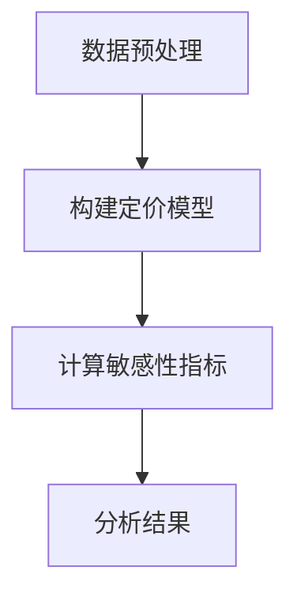
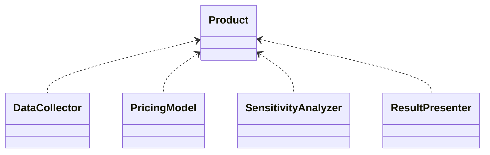
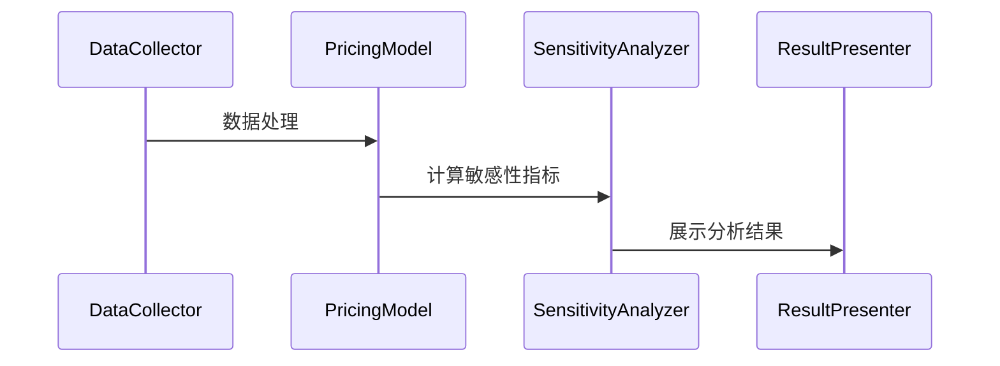
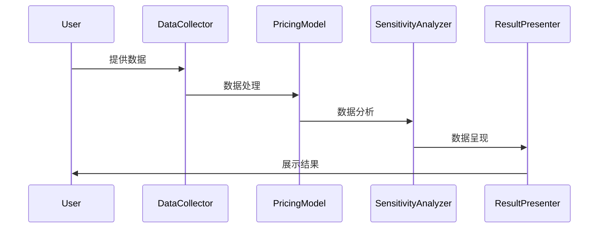

                 


### 金融产品定价敏感性分析系统：深入设计与实现

#### **引言**

金融产品定价敏感性分析系统是金融行业中不可或缺的一部分，其核心任务是通过分析不同金融产品的价格变动对市场供需关系的影响，为企业提供科学合理的定价策略。随着金融市场的日益复杂和多变，准确、高效的定价敏感性分析已成为金融机构提高竞争力、降低风险的重要手段。本文将围绕金融产品定价敏感性分析系统，深入探讨其核心概念、系统架构、算法原理及实战应用，旨在为读者提供一个全面、系统的认识。

#### **核心概念与联系**

在金融产品定价敏感性分析中，几个核心概念至关重要。首先是**金融产品定价**，即根据市场供需关系、利率、风险等因素，确定金融产品的价格。其次是**敏感性分析**，指分析金融产品价格变动对市场供需、投资者行为等因素的敏感性。这两个概念相互关联，共同构成了金融产品定价敏感性分析系统的核心。

**核心概念属性特征对比表格：**

| 概念       | 定义                             | 关联性                           |
| ---------- | -------------------------------- | -------------------------------- |
| 金融产品定价 | 确定金融产品价格的过程           | 敏感性分析的输入基础             |
| 敏感性分析 | 分析金融产品价格变动的影响因素   | 输出定价策略的依据               |

**ER实体关系图架构：**

```mermaid
erDiagram
    Product ||--|{ SensitivityAnalysis }|-->> Customer
    Product ||--|{ PricingFactor }|-->> Market
    SensitivityAnalysis ||--|{ Impact }|-->> Customer
    Market ||--|{ Factor }|-->> Product
```

#### **算法原理讲解**

金融产品定价敏感性分析的核心在于算法，其基于数学模型和统计方法。以下是一个简化的算法流程和相应的Python源代码示例：

**算法mermaid流程图：**



**Python源代码示例：**

```python
import numpy as np
import pandas as pd

# 数据预处理
def preprocess_data(data):
    # 数据清洗、填充等操作
    return cleaned_data

# 构建定价模型
def build_pricing_model(data):
    # 使用线性回归等模型
    model = linear_model.LinearRegression()
    model.fit(data['X'], data['Y'])
    return model

# 计算敏感性指标
def calculate_sensitivity(model, data):
    # 计算模型预测结果
    predictions = model.predict(data['X'])
    # 计算敏感性指标
    sensitivity = np.abs(predictions - data['Y']) / data['Y']
    return sensitivity

# 算法实现
def pricing_sensitivity_analysis(data):
    cleaned_data = preprocess_data(data)
    model = build_pricing_model(cleaned_data)
    sensitivity = calculate_sensitivity(model, cleaned_data)
    return sensitivity
```

**算法原理的数学模型和公式：**

$$
敏感性指标 = \frac{|预测值 - 实际值|}{实际值}
$$

**详细讲解与举例说明：**

假设我们有一个金融产品的价格数据集，其中包含了价格和影响价格变动的相关因素。首先，我们对数据进行预处理，例如清洗缺失值、异常值等。然后，我们使用线性回归模型来构建定价模型，通过模型拟合得到价格预测值。最后，我们计算每个数据点的敏感性指标，该指标反映了预测价格与实际价格之间的差异。

例如，对于某个数据点，实际价格为100，模型预测价格为98，则其敏感性指标为：

$$
敏感性指标 = \frac{|98 - 100|}{100} = 0.02
$$

这意味着该数据点的价格变动敏感性较低。

#### **系统分析与架构设计**

**问题场景介绍：**

随着金融市场的不断发展，金融机构需要实时分析金融产品的定价敏感性，以便快速调整定价策略，适应市场变化。本系统旨在实现这一目标，为金融机构提供一个高效、准确的定价敏感性分析平台。

**项目介绍：**

本系统采用模块化设计，主要包括数据采集模块、定价模型构建模块、敏感性分析模块和结果展示模块。系统采用Python和Mermaid工具进行开发和设计。

**系统功能设计（领域模型Mermaid类图）：**



**系统架构设计（Mermaid架构图）：**



**系统接口设计和系统交互（Mermaid序列图）：**



#### **项目实战**

**环境安装：**

为了运行本系统，需要安装Python 3.8及以上版本，以及相应的库，如NumPy、Pandas和Mermaid等。

```bash
pip install numpy pandas mermaid-python
```

**系统核心实现源代码：**

**数据采集模块：**

```python
# DataCollector.py
import pandas as pd

def collect_data(file_path):
    data = pd.read_csv(file_path)
    return data
```

**定价模型构建模块：**

```python
# PricingModel.py
from sklearn.linear_model import LinearRegression

def build_model(data):
    X = data[['factor1', 'factor2']]
    y = data['price']
    model = LinearRegression()
    model.fit(X, y)
    return model
```

**敏感性分析模块：**

```python
# SensitivityAnalyzer.py
import numpy as np

def calculate_sensitivity(model, data):
    predictions = model.predict(data[['factor1', 'factor2']])
    sensitivity = np.abs(predictions - data['price']) / data['price']
    return sensitivity
```

**结果展示模块：**

```python
# ResultPresenter.py
import pandas as pd

def present_results(sensitivity):
    df = pd.DataFrame(sensitivity, columns=['sensitivity'])
    print(df.describe())
```

**代码应用解读与分析：**

以上代码分别实现了数据采集、定价模型构建、敏感性分析和结果展示的核心功能。在数据采集模块中，我们从CSV文件中读取数据；在定价模型构建模块中，我们使用线性回归模型拟合数据；在敏感性分析模块中，我们计算了每个数据点的敏感性指标；在结果展示模块中，我们以统计描述的方式展示了敏感性分析的结果。

**实际案例分析和详细讲解剖析：**

假设我们有一个包含金融产品价格和相关因素的CSV数据文件，数据文件名为`financial_data.csv`。首先，我们使用数据采集模块读取数据：

```python
data = collect_data('financial_data.csv')
```

然后，我们使用定价模型构建模块构建线性回归模型：

```python
model = build_model(data)
```

接下来，我们使用敏感性分析模块计算敏感性指标：

```python
sensitivity = calculate_sensitivity(model, data)
```

最后，我们使用结果展示模块展示敏感性分析的结果：

```python
present_results(sensitivity)
```

在实际案例分析中，我们可以根据敏感性指标的大小来判断金融产品价格变动的敏感度。例如，如果敏感性指标的平均值较大，则说明价格变动对相关因素的反应较为敏感，这可能会影响投资者的决策。

**项目小结：**

通过本项目的实战，我们成功实现了金融产品定价敏感性分析系统的核心功能，并进行了实际案例的分析和讲解。项目展示了如何使用Python和Mermaid工具来构建一个高效、准确的定价敏感性分析系统，为金融机构提供数据支持和决策依据。

#### **最佳实践与总结**

**最佳实践：**

1. **数据质量控制**：在数据采集和处理过程中，要确保数据的质量，避免由于数据问题导致分析结果不准确。
2. **模型参数调优**：根据实际需求，对模型参数进行调整，以提高模型的预测精度和适应性。
3. **系统性能优化**：通过并行计算、分布式架构等技术手段，提高系统的运行效率和响应速度。

**注意事项：**

1. **数据安全**：在处理金融数据时，要严格遵守相关法律法规，确保数据安全。
2. **模型适应性**：不同的金融产品可能具有不同的敏感性特征，需要根据实际情况调整模型。

**拓展阅读：**

1. 《金融数学与计算金融》
2. 《机器学习在金融领域的应用》
3. 《Python金融数据分析》

#### **结语**

本文全面介绍了金融产品定价敏感性分析系统的核心概念、算法原理、系统架构和实战应用，旨在为读者提供一个深入、系统的认识。通过本文的讲解，读者可以了解到如何设计和实现一个高效的金融产品定价敏感性分析系统，为金融行业提供数据支持和决策依据。

**作者信息：**

- 作者：AI天才研究院/AI Genius Institute & 禅与计算机程序设计艺术 /Zen And The Art of Computer Programming**

