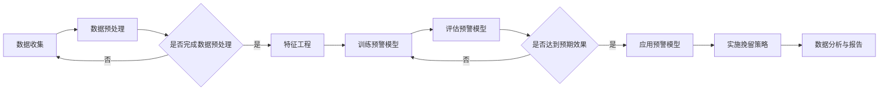
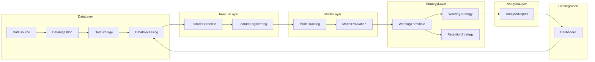
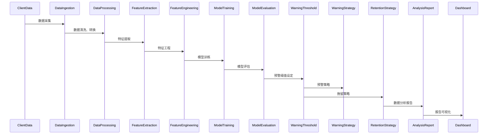

                 

### 1. 背景介绍

#### 1.1 问题背景

在当今激烈竞争的金融行业中，客户流失问题已经成为金融机构面临的一大挑战。据统计，金融行业每年因客户流失而损失的收入高达数十亿美元。客户流失不仅影响了金融机构的利润，还损害了其品牌声誉和市场竞争力。因此，如何准确预测客户流失并采取有效的挽留措施，成为金融行业亟待解决的关键问题。

首先，客户流失现象在金融行业中的表现日益严重。无论是银行、保险公司还是证券公司，客户流失都是一个普遍存在的问题。银行客户可能因为服务质量不佳、低利率或其他原因选择其他银行；保险公司客户可能因保费过高或理赔服务不到位而转向竞争对手；证券公司客户可能因交易成本、投资收益不理想等原因流失。这些流失的客户往往具有较高的价值和潜力，其流失对金融机构的损失不可忽视。

其次，客户流失对金融机构造成了巨大的经济损失。金融行业的竞争日益激烈，获取新客户的成本越来越高。而流失一个老客户所带来的损失不仅仅是客户本身带来的利润损失，还包括了重新获取这个客户所需要投入的成本。此外，客户流失还会影响金融机构的品牌声誉和市场竞争力。一个流失率较高的金融机构很难吸引新客户，因为潜在客户会认为这家金融机构的服务质量不佳。因此，客户流失问题对金融机构的长期发展具有严重的负面影响。

最后，研究客户流失的原因和制定有效的预警与挽留策略成为金融行业亟待解决的问题。金融机构需要深入了解客户流失的原因，以便有针对性地采取措施。例如，客户可能因为服务质量不佳而流失，那么金融机构就需要提高服务质量；客户可能因为竞争压力而流失，那么金融机构就需要优化产品定价策略。同时，金融机构还需要建立有效的客户流失预警系统，提前识别潜在流失客户，并采取及时的措施进行挽留。只有通过全面分析和有效应对，金融机构才能降低客户流失率，提高客户满意度和忠诚度，从而实现可持续发展。

#### 1.2 问题描述

客户流失预警是金融行业中的一个关键问题。准确预测客户流失，有助于金融机构及时采取措施，降低客户流失率，提高客户满意度和忠诚度。然而，如何构建一个有效的客户流失预警系统，是金融行业面临的一个重要挑战。

首先，客户流失预警的重要性不言而喻。通过预警系统，金融机构可以提前识别潜在流失客户，并采取有针对性的挽留措施，从而降低客户流失率。预警系统不仅能够帮助金融机构降低经济损失，还能提升客户满意度和忠诚度，增强品牌竞争力。此外，预警系统还能为金融机构提供有价值的数据支持，帮助其更好地了解客户需求和行为，优化产品和服务，提高市场竞争力。

然而，构建一个有效的客户流失预警系统并非易事。首先，预警系统需要准确判断客户流失风险。这意味着预警系统需要能够分析大量的客户数据，提取有用的特征，并运用机器学习算法进行预测。其次，预警系统需要具备较高的准确性和实时性。准确性决定了预警结果的可靠性，实时性则决定了金融机构能否及时采取行动。此外，预警系统还需要能够灵活应对客户流失风险的变化，以适应不断变化的市场环境。

要构建一个有效的客户流失预警系统，需要解决以下关键问题：

1. **数据收集与预处理**：预警系统需要收集大量的客户数据，包括基本信息、交易记录、行为数据等。然而，这些数据通常存在噪声和缺失值，需要进行清洗和预处理，以确保数据质量。

2. **特征工程**：特征工程是构建预警模型的重要步骤。需要提取对预测目标有意义的特征，如客户交易频率、余额、风险评估等。特征选择和特征提取的质量直接影响预警模型的性能。

3. **预警模型选择与训练**：选择合适的机器学习算法，如逻辑回归、决策树、随机森林等，构建预警模型。同时，需要对模型进行训练和优化，以提高预测准确性。

4. **预警阈值设定**：设定合理的预警阈值，将客户分为高风险流失客户、中度流失客户和低风险流失客户。预警阈值的选择需要综合考虑模型准确性、客户流失风险和市场环境等因素。

5. **实时监控与反馈**：预警系统需要具备实时监控和反馈功能，及时更新预警结果，并根据预警结果采取相应的挽留措施。此外，系统还需要具备自动化处理能力，以减轻人工干预的负担。

6. **系统集成与部署**：将预警系统与金融机构的现有系统进行集成，确保数据流动和交互的顺畅。同时，需要考虑系统的可扩展性和可维护性，以适应业务需求和技术的不断演进。

总之，构建一个有效的客户流失预警系统需要多方面的技术和管理支持。只有通过全面的分析和科学的决策，金融机构才能有效应对客户流失挑战，提高客户满意度和忠诚度，实现可持续发展。

#### 1.3 问题解决

为了有效解决金融行业客户流失问题，我们需要建立一个全面的客户流失预警与挽留策略系统。这一系统不仅需要准确预测客户流失风险，还需要提供有效的挽留策略，从而降低客户流失率，提高客户满意度和忠诚度。

首先，建立客户流失预警模型是系统的核心。我们可以利用大数据分析和机器学习算法来实现这一目标。具体步骤如下：

1. **数据收集**：收集客户的基本信息、交易记录、行为数据等。这些数据可以来源于金融机构的内部系统，也可以通过公开的数据源获取。例如，客户的存款金额、交易频率、余额、风险评估等都是重要的特征。

2. **数据预处理**：清洗和整理数据，去除噪声和缺失值。这一步骤包括数据去重、缺失值填补、数据格式转换等。数据预处理是确保数据质量的重要环节，直接影响到后续的特征工程和模型训练。

3. **特征工程**：提取对预测目标有意义的特征，如客户交易频率、余额、风险评估等。特征工程是模型训练的关键步骤，需要通过统计分析、数据挖掘等方法，筛选出对预测有重要影响的特征。

4. **模型选择与训练**：选择合适的机器学习算法，如逻辑回归、决策树、随机森林等，构建预警模型。通过交叉验证和网格搜索等技术，对模型进行训练和优化，以提高预测准确性。

5. **模型评估**：评估模型性能，如准确率、召回率、F1值等。通过评估，可以确定模型的优劣，并进一步调整模型参数，优化模型性能。

6. **预警阈值设定**：根据评估结果，设定合理的预警阈值，将客户分为高风险流失客户、中度流失客户和低风险流失客户。预警阈值的选择需要综合考虑模型准确性、客户流失风险和市场环境等因素。

7. **实时监控与反馈**：建立实时监控和反馈机制，对预警结果进行持续监控和更新。根据预警结果，及时采取相应的挽留措施，如发送优惠券、提供个性化服务等。

其次，制定个性化的客户挽留策略是降低客户流失率的重要手段。具体步骤如下：

1. **分析预警结果**：对预警结果进行分析，识别高风险流失客户和潜在流失客户。通过分析客户行为数据，了解客户流失的原因，为制定挽留策略提供依据。

2. **制定挽留策略**：根据客户特点和需求，制定个性化的挽留策略。例如，针对高风险流失客户，可以采取优惠活动、提升服务质量、增加客户关怀等措施；对于中度流失客户，可以提供定制化的金融服务，增强客户粘性。

3. **实施挽留策略**：将挽留策略实施到实际操作中。通过短信、邮件、电话等多种渠道，与客户进行沟通，传递优惠信息和关爱服务。同时，跟踪挽留措施的效果，及时调整策略。

4. **数据反馈与优化**：对挽留策略的效果进行评估，收集客户反馈，持续优化挽留策略。通过数据分析和反馈，不断提升客户满意度和忠诚度。

最后，数据分析与报告是辅助决策的重要环节。具体步骤如下：

1. **数据分析**：对预警结果和挽留策略的实施情况进行深入分析。通过统计分析、数据可视化等方法，识别客户流失风险较高的群体和原因。

2. **报告生成**：生成详细的分析报告，为管理层提供决策支持。报告应包括客户流失原因分析、挽留策略效果评估、业务优化建议等内容。

3. **决策支持**：根据分析报告，制定下一步的业务优化策略。通过不断调整和优化，实现客户流失率的降低和客户满意度的提升。

总之，建立客户流失预警与挽留策略系统，需要多方面的技术和管理支持。只有通过全面的分析和科学的决策，金融机构才能有效应对客户流失挑战，提高客户满意度和忠诚度，实现可持续发展。

#### 1.4 边界与外延

金融产品客户流失预警与挽留策略系统具有广泛的应用范围和边界。首先，该系统不仅适用于银行、保险公司、证券公司等金融机构，还可以推广到其他需要客户维护和挽留的行业，如电信、电子商务等。其次，该系统的关注点不仅限于客户流失，还包括客户满意度和忠诚度的提升。通过全面分析客户行为数据和流失原因，系统可以为金融机构提供有针对性的挽留策略，从而提高客户满意度，增强客户粘性。

具体来说，金融产品客户流失预警与挽留策略系统的应用范围包括以下几个方面：

1. **银行**：针对银行客户流失问题，系统可以分析客户的存款金额、交易频率、余额等数据，预测潜在流失客户，并制定个性化的挽留策略，如提供优惠利率、存款奖励等。

2. **保险公司**：针对保险公司客户流失问题，系统可以分析客户的保费金额、理赔频率、风险评估等数据，预测潜在流失客户，并制定相应的挽留策略，如提供额外的保险保障、优惠保费等。

3. **证券公司**：针对证券公司客户流失问题，系统可以分析客户的交易金额、交易频率、风险评估等数据，预测潜在流失客户，并制定个性化的挽留策略，如提供投资咨询、优惠佣金等。

4. **电信行业**：针对电信行业客户流失问题，系统可以分析客户的通话时长、短信数量、宽带使用情况等数据，预测潜在流失客户，并制定相应的挽留策略，如提供免费通话时长、优惠套餐等。

5. **电子商务**：针对电子商务平台客户流失问题，系统可以分析客户的购买频率、购买金额、浏览行为等数据，预测潜在流失客户，并制定个性化的挽留策略，如提供优惠券、积分兑换等。

尽管金融产品客户流失预警与挽留策略系统具有广泛的应用范围，但在实际应用中也需要注意以下边界和限制：

1. **数据质量**：系统依赖于客户数据的准确性和完整性。如果数据质量较差，可能导致预警不准确，影响挽留策略的效果。因此，金融机构需要确保数据收集、处理和存储的过程质量。

2. **模型适应性**：不同金融机构和行业的特点不同，系统需要具备较高的适应性和灵活性，以应对各种场景和需求。这可能需要不断地调整和优化模型参数，以满足实际业务需求。

3. **技术实现**：构建和部署客户流失预警与挽留策略系统需要一定的技术支持。金融机构需要具备相应的技术能力和团队，以确保系统的稳定运行和高效性能。

4. **法律法规**：在数据收集和使用过程中，金融机构需要遵守相关法律法规，确保客户隐私和数据安全。这可能需要在系统设计和实现过程中，充分考虑法律法规的要求。

总之，金融产品客户流失预警与挽留策略系统在应用范围和边界上具有很大的潜力，但同时也面临一些挑战。通过不断优化和改进，系统可以在金融行业和其他相关领域发挥更大的作用，帮助金融机构降低客户流失率，提高客户满意度和忠诚度。

#### 1.5 概念结构与核心要素组成

金融产品客户流失预警与挽留策略系统的概念结构与核心要素组成如下：

1. **客户数据**：客户数据是系统的核心输入，包括客户的基本信息（如姓名、年龄、性别、地址等）、交易记录（如存款、取款、投资等）、行为数据（如登录频率、访问页面等）。这些数据为系统分析和预测提供了基础。

2. **预警模型**：预警模型是系统的核心组件，用于预测客户流失风险。常见的机器学习算法包括逻辑回归、决策树、随机森林、梯度提升等。通过训练和优化这些模型，系统可以准确判断客户流失风险，并为金融机构提供数据支持。

3. **挽留策略**：根据预警模型的结果，系统制定个性化的挽留策略。这些策略包括优惠活动（如赠送礼品、提供优惠利率等）、客户关怀（如定期发送问候、提供定制化服务等）。个性化的挽留策略有助于提高客户满意度和忠诚度。

4. **数据分析与报告**：数据分析与报告是系统的重要输出。通过对预警结果和挽留策略的实施效果进行分析，系统可以生成详细的报告，为管理层提供决策支持。报告内容包括客户流失原因分析、挽留策略效果评估、业务优化建议等。

5. **系统集成与部署**：系统集成与部署是将预警与挽留策略系统与金融机构的现有系统进行整合，确保数据流动和交互的顺畅。系统需要具备可扩展性和可维护性，以适应业务需求和技术的不断演进。

6. **实时监控与反馈**：实时监控与反馈是确保系统高效运行的关键。系统需要具备实时监控预警结果和挽留策略实施情况的能力，并及时更新数据，为金融机构提供实时决策支持。此外，系统还需要具备自动化处理能力，以减轻人工干预的负担。

通过以上核心要素的有机结合，金融产品客户流失预警与挽留策略系统可以有效地预测客户流失风险，制定有针对性的挽留策略，降低客户流失率，提高客户满意度和忠诚度，从而实现金融机构的可持续发展。

### 2. 核心概念与联系

#### 2.1 核心概念原理

在金融产品客户流失预警与挽留策略系统中，几个核心概念起着关键作用。这些概念包括客户流失、预警模型、挽留策略和数据分析与报告。

首先，客户流失是指客户停止使用金融机构的服务或转向其他竞争对手。流失客户往往对金融机构具有较高价值和潜力，其流失会导致金融机构的经济损失和品牌声誉受损。因此，准确预测客户流失并采取有效的挽留措施，是金融行业的重要任务。

其次，预警模型是系统中的核心组件。预警模型基于大数据分析和机器学习算法，用于预测客户流失风险。常见的机器学习算法包括逻辑回归、决策树、随机森林等。预警模型通过对客户数据的深入分析，提取关键特征，构建预测模型，从而准确判断客户流失风险。

第三，挽留策略是针对潜在流失客户制定的个性化措施。这些策略旨在提高客户满意度和忠诚度，降低客户流失率。常见的挽留策略包括优惠活动、客户关怀、定制化服务等。通过分析预警模型的结果，金融机构可以识别高风险流失客户，并采取相应的挽留措施。

最后，数据分析与报告是系统的重要输出。通过对预警结果和挽留策略的实施效果进行分析，系统可以生成详细的报告，为管理层提供决策支持。报告内容包括客户流失原因分析、挽留策略效果评估、业务优化建议等。这些报告有助于金融机构不断优化业务策略，提高客户满意度和忠诚度。

#### 2.2 概念属性特征对比表格

| 概念           | 定义                                                         |
|----------------|------------------------------------------------------------|
| 客户流失       | 客户停止使用金融机构的服务或转向其他竞争对手。                   |
| 预警模型       | 基于客户数据的机器学习模型，用于预测客户流失风险。                 |
| 挽留策略       | 根据预警结果，制定个性化的客户挽留措施。                         |
| 数据分析与报告 | 对预警结果进行分析，生成报告，辅助决策。                       |

这些核心概念在系统中相互关联，共同构成了客户流失预警与挽留策略的完整体系。客户流失是系统的核心目标，预警模型负责预测流失风险，挽留策略则采取具体措施降低流失率，而数据分析与报告则提供了决策支持，确保系统持续优化和改进。

#### 2.3 ER实体关系图架构

为了更清晰地展示金融产品客户流失预警与挽留策略系统中的实体及其关系，我们可以使用ER（实体关系）图进行描述。以下是一个简化的ER实体关系图架构：

```mermaid
erDiagram
    客户 --> 预警模型
    客户 --> 数据分析报告
    预警模型 --> 数据分析报告
    挽留策略 --> 客户
    预警模型 --> 挽留策略
    数据分析报告 --> 预警模型
    数据分析报告 --> 挽留策略
```

在这个ER图中，实体包括客户、预警模型、数据分析报告和挽留策略。它们之间的关系如下：

- **客户**：客户是系统的核心实体，代表金融机构的服务对象。每个客户都与预警模型和挽留策略相关联。
- **预警模型**：预警模型基于客户数据构建，用于预测客户流失风险。预警模型还与数据分析报告和挽留策略相关联，为系统提供数据支持和决策依据。
- **数据分析报告**：数据分析报告对预警结果和挽留策略实施效果进行分析，生成详细的报告，为管理层提供决策支持。报告与预警模型和挽留策略相关联，确保系统的持续优化。
- **挽留策略**：挽留策略是根据预警模型结果制定的个性化措施，旨在降低客户流失率。挽留策略与客户、预警模型和数据分析报告相关联，确保系统的高效运行。

通过这个ER实体关系图，我们可以更清晰地理解金融产品客户流失预警与挽留策略系统中的核心实体及其关系，有助于我们进一步优化系统设计和功能实现。

### 3. 算法原理讲解

#### 3.1 算法mermaid流程图

为了更好地理解金融产品客户流失预警与挽留策略系统的算法原理，我们可以使用mermaid流程图来描述其工作流程。以下是一个简化的mermaid流程图：



在这个流程图中，每个步骤都对应着算法实现中的关键环节，下面我们将详细解释这些步骤。

#### 3.2 算法原理

##### 3.2.1 数据收集与预处理

数据收集是构建预警模型的基础。我们需要收集大量的客户数据，包括但不限于：

- **基本信息**：客户的姓名、年龄、性别、职业等。
- **交易记录**：客户的存款、取款、贷款、投资等交易记录。
- **行为数据**：客户的登录频率、访问页面、交易金额等行为数据。

这些数据通常存储在金融机构的数据库中，我们通过接口或ETL（提取、转换、加载）工具将其导入到数据仓库或数据湖中。接下来，我们需要对数据进行预处理，以确保数据质量。数据预处理包括以下步骤：

1. **数据清洗**：去除重复数据、无效数据和噪声数据。
2. **数据转换**：将数据转换为统一的格式，例如，将日期格式转换为YYYY-MM-DD。
3. **缺失值处理**：填补缺失值，可以使用均值、中位数或使用插值法等方法。
4. **异常值处理**：识别和处理异常值，避免它们对模型训练和评估产生不利影响。

##### 3.2.2 特征工程

特征工程是机器学习模型成功的关键步骤。在这个阶段，我们需要从原始数据中提取对预测目标有意义的特征，并对特征进行适当的转换和组合。以下是一些常见的特征工程方法：

1. **特征选择**：使用统计测试、信息增益、卡方检验等方法筛选出对预测目标有重要影响的特征。
2. **特征转换**：对数值特征进行标准化或归一化处理，对类别特征进行编码（例如，独热编码、标签编码等）。
3. **特征组合**：通过合并或交叉特征来创建新的特征，以提高模型的预测能力。

##### 3.2.3 预警模型训练与评估

在训练预警模型时，我们通常将数据集分为训练集和验证集。训练集用于训练模型，验证集用于评估模型性能。以下是常见的机器学习算法和评估指标：

1. **逻辑回归**：逻辑回归是一种线性模型，通过最大化似然估计来预测客户流失概率。评估指标包括准确率、召回率、F1值等。
2. **决策树**：决策树通过递归划分特征空间来生成决策树，具有简单易懂和可解释性。评估指标与逻辑回归类似。
3. **随机森林**：随机森林是基于决策树构建的集成学习方法，通过构建多棵决策树并求平均来提高模型性能。评估指标与逻辑回归和决策树类似。
4. **梯度提升树**：梯度提升树是一种基于决策树的集成学习方法，通过迭代优化来提高模型性能。评估指标与逻辑回归和决策树类似。

在模型训练和评估过程中，我们需要调整模型参数，以获得最优性能。常用的参数调整方法包括网格搜索、随机搜索和贝叶斯优化等。

##### 3.2.4 应用预警模型与实施挽留策略

一旦训练和评估完成，我们就可以将预警模型应用到实际业务中。具体步骤如下：

1. **预测**：使用训练好的模型对客户进行流失风险预测，输出每个客户的流失概率。
2. **阈值设定**：设定合理的预警阈值，将客户划分为高风险、中风险和低风险流失客户。
3. **实施挽留策略**：针对高风险流失客户，制定个性化的挽留策略，例如发送优惠券、提升服务质量、提供定制化服务等。

##### 3.2.5 数据分析与报告

在预警模型应用和挽留策略实施过程中，我们需要对预警结果和挽留策略效果进行分析和报告。具体步骤如下：

1. **数据收集**：收集预警结果和挽留策略实施的相关数据，包括客户流失率、挽留成功率、客户满意度等。
2. **数据分析**：使用统计分析和数据可视化方法对收集到的数据进行分析，识别流失原因和挽留策略的有效性。
3. **报告生成**：生成详细的分析报告，包括流失原因分析、挽留策略效果评估、业务优化建议等，为管理层提供决策支持。

通过上述步骤，金融产品客户流失预警与挽留策略系统可以有效地预测客户流失风险，制定有针对性的挽留策略，降低客户流失率，提高客户满意度和忠诚度。

#### 3.3 算法原理详细讲解与举例说明

##### 3.3.1 数据收集与预处理

首先，我们需要收集大量的客户数据，这些数据包括基本信息、交易记录和行为数据等。以下是一个具体的数据收集和预处理示例：

```python
import pandas as pd

# 假设我们使用Pandas库来读取数据
data = pd.read_csv('client_data.csv')

# 数据清洗
data.drop_duplicates(inplace=True)
data.fillna(method='ffill', inplace=True)

# 数据转换
data['date_of_birth'] = pd.to_datetime(data['date_of_birth'])
data['age'] = data['date_of_birth'].apply(lambda x: (pd.Timestamp.now() - x).days // 365)

# 特征提取
data['transaction_count'] = data['transaction_history'].str.len()
data['average_transaction_amount'] = data['transaction_history'].apply(lambda x: sum(x) / len(x) if len(x) > 0 else 0)

# 数据分箱
data['transaction_frequency'] = data['transaction_count'].apply(lambda x: 'High' if x > 10 else 'Medium' if x > 5 else 'Low')
```

在这个示例中，我们首先读取客户数据，并进行去重和填充缺失值操作。接下来，我们将日期格式转换为datetime对象，并计算客户的年龄。然后，我们提取交易记录的相关特征，如交易次数和平均交易金额。最后，我们将交易次数分箱，以便后续的特征工程和模型训练。

##### 3.3.2 特征工程

特征工程是构建预警模型的关键步骤。我们需要从原始数据中提取对预测目标有意义的特征，并对特征进行适当的转换和组合。以下是一个特征工程示例：

```python
from sklearn.preprocessing import OneHotEncoder

# 特征选择
selected_features = ['age', 'transaction_count', 'average_transaction_amount', 'transaction_frequency']

# 特征编码
encoder = OneHotEncoder()
encoded_features = encoder.fit_transform(data[selected_features])

# 数据转换
encoded_data = pd.DataFrame(encoded_features.toarray(), columns=encoder.get_feature_names(selected_features))

# 数据合并
final_data = data.merge(encoded_data, left_index=True, right_index=True)
```

在这个示例中，我们首先选择对预测目标有重要影响的特征，如年龄、交易次数、平均交易金额和交易频率。然后，我们使用独热编码将类别特征转换为数值特征。接下来，我们将编码后的特征与原始数据合并，得到最终的特征数据集。

##### 3.3.3 预警模型训练与评估

接下来，我们使用机器学习算法训练预警模型，并对模型进行评估。以下是一个逻辑回归模型的训练和评估示例：

```python
from sklearn.linear_model import LogisticRegression
from sklearn.model_selection import train_test_split
from sklearn.metrics import accuracy_score, recall_score, f1_score

# 数据划分
X = final_data[selected_features]
y = data['churn_label']

X_train, X_test, y_train, y_test = train_test_split(X, y, test_size=0.2, random_state=42)

# 模型训练
model = LogisticRegression()
model.fit(X_train, y_train)

# 模型评估
y_pred = model.predict(X_test)

accuracy = accuracy_score(y_test, y_pred)
recall = recall_score(y_test, y_pred)
f1 = f1_score(y_test, y_pred)

print(f'Accuracy: {accuracy:.2f}')
print(f'Recall: {recall:.2f}')
print(f'F1 Score: {f1:.2f}')
```

在这个示例中，我们首先将特征数据集划分为训练集和测试集。然后，我们使用逻辑回归算法训练模型，并使用测试集评估模型性能。评估指标包括准确率、召回率和F1值，这些指标可以告诉我们模型的预测能力。

##### 3.3.4 应用预警模型与实施挽留策略

一旦训练和评估完成，我们就可以将预警模型应用到实际业务中，并实施有针对性的挽留策略。以下是一个应用预警模型和实施挽留策略的示例：

```python
# 应用预警模型
churn_probabilities = model.predict_proba(X_test)[:, 1]

# 阈值设定
threshold = 0.5
high_risk_customers = X_test[(churn_probabilities > threshold)]

# 实施挽留策略
for index, row in high_risk_customers.iterrows():
    # 发送优惠券
    send_coupon(row['client_id'])
    # 提升服务质量
    improve_service(row['client_id'])
    # 提供定制化服务
    offer_customized_service(row['client_id'])
```

在这个示例中，我们首先使用训练好的模型计算测试集客户的流失概率。然后，设定一个合理的阈值，将高风险流失客户筛选出来。接下来，我们针对这些高风险客户实施个性化的挽留策略，如发送优惠券、提升服务质量和提供定制化服务。

通过上述示例，我们可以看到金融产品客户流失预警与挽留策略系统是如何通过数据收集、预处理、特征工程、模型训练和评估，以及应用预警模型和实施挽留策略来实现客户流失预测和挽留的。这些步骤和方法有助于金融机构降低客户流失率，提高客户满意度和忠诚度。

### 3.4 系统分析与架构设计

#### 3.4.1 问题场景介绍

在当今金融市场中，客户流失已成为金融机构面临的重大挑战之一。为了降低客户流失率，提高客户满意度和忠诚度，金融机构需要建立一套全面的客户流失预警与挽留策略系统。该系统旨在通过大数据分析和机器学习算法，准确预测客户流失风险，并采取有针对性的挽留措施，从而实现客户流失率的降低和客户满意度的提升。

该系统的主要目标包括：

1. **客户流失预警**：通过分析客户行为数据和交易记录，提前识别潜在流失客户，提供实时预警，帮助金融机构及时采取措施。
2. **个性化挽留策略**：根据客户特点和历史数据，制定个性化的挽留措施，如优惠活动、客户关怀等，提高客户满意度和忠诚度。
3. **数据分析和报告**：对预警结果和挽留策略的实施效果进行深入分析，生成详细报告，为管理层提供决策支持。

#### 3.4.2 项目介绍

本项目旨在开发一套金融产品客户流失预警与挽留策略系统，该系统将采用大数据分析和机器学习技术，通过以下关键技术模块实现：

1. **数据收集与预处理模块**：负责从金融机构内部系统和外部数据源收集客户数据，并进行数据清洗、转换和缺失值处理。
2. **特征工程模块**：负责提取对预测目标有意义的特征，包括客户基本信息、交易记录、行为数据等。
3. **机器学习模块**：负责构建和训练预警模型，包括逻辑回归、决策树、随机森林等算法，并评估模型性能。
4. **预警与挽留策略模块**：负责根据预警模型结果，设定预警阈值，制定个性化的挽留策略，并跟踪挽留措施的实施效果。
5. **数据分析和报告模块**：负责对预警结果和挽留策略的效果进行分析，生成详细报告，为管理层提供决策支持。

#### 3.4.3 系统功能设计（领域模型mermaid类图）

为了实现上述目标，系统需要具备以下核心功能：

1. **数据收集**：从内部系统和外部数据源收集客户数据，包括基本信息、交易记录、行为数据等。
2. **数据预处理**：清洗和整理数据，去除噪声和缺失值，确保数据质量。
3. **特征工程**：提取对预测目标有意义的特征，如客户交易频率、余额、风险评估等。
4. **模型训练与评估**：选择合适的机器学习算法，如逻辑回归、决策树、随机森林等，构建预警模型，并进行模型评估。
5. **预警与挽留**：根据预警模型结果，设定预警阈值，制定个性化的挽留策略，并实施挽留措施。
6. **数据分析与报告**：对预警结果和挽留策略的实施效果进行分析，生成详细报告。

以下是一个简化的mermaid类图，展示了系统的主要功能模块：

```mermaid
classDiagram
    ClientData <--|extract| DataCollection
    DataCollection --> DataPreprocessing
    DataPreprocessing --> FeatureEngineering
    FeatureEngineering --> MachineLearning
    MachineLearning --> Prediction
    Prediction --> WarningStrategy
    WarningStrategy --> RetentionStrategy
    RetentionStrategy --> AnalysisReport
```

在这个类图中，各模块通过类之间的关联关系进行连接，实现了数据收集、预处理、特征工程、机器学习、预警与挽留策略以及数据分析和报告等核心功能。

#### 3.4.4 系统架构设计（mermaid架构图）

为了确保系统的高效性、可扩展性和可维护性，我们需要设计一个合理的系统架构。以下是一个简化的mermaid架构图，展示了系统的整体架构：



在这个架构图中，系统分为数据层、特征层、模型层、策略层和分析层。数据层负责数据收集、存储和处理；特征层负责特征提取和工程；模型层负责模型训练和评估；策略层负责预警和挽留策略的制定和实施；分析层负责数据分析和报告生成。此外，UI/Integration层负责与用户界面和外部系统集成，提供数据可视化和交互功能。

通过上述系统架构设计，金融产品客户流失预警与挽留策略系统可以实现从数据收集、预处理、特征工程、模型训练、策略制定到数据分析的完整流程，为金融机构提供全面、高效、可靠的客户流失预警与挽留解决方案。

#### 3.4.5 系统接口设计和系统交互（mermaid序列图）

为了确保系统各模块之间的协作和通信，我们需要设计合理的系统接口和交互流程。以下是一个简化的mermaid序列图，展示了系统的主要接口设计和交互流程：



在这个序列图中，系统各模块通过接口进行通信和协作：

1. **数据采集**：通过DataIngestion模块从多个数据源（如数据库、API等）收集客户数据。
2. **数据清洗、转换**：通过DataProcessing模块对采集到的数据进行清洗、转换和缺失值处理。
3. **特征提取**：通过FeatureExtraction模块从原始数据中提取对预测目标有意义的特征。
4. **特征工程**：通过FeatureEngineering模块对特征进行进一步的转换和组合。
5. **模型训练**：通过ModelTraining模块选择合适的机器学习算法，对特征数据进行模型训练。
6. **模型评估**：通过ModelEvaluation模块评估模型性能，确定最佳的模型参数。
7. **预警阈值设定**：通过WarningThreshold模块设定合理的预警阈值，以区分高风险、中风险和低风险客户。
8. **预警策略**：通过WarningStrategy模块根据预警结果，采取有针对性的预警措施。
9. **挽留策略**：通过RetentionStrategy模块根据客户特点和历史数据，制定个性化的挽留措施。
10. **数据分析报告**：通过AnalysisReport模块对预警结果和挽留策略的实施效果进行分析，生成详细报告。
11. **报告可视化**：通过Dashboard模块将分析报告可视化，为管理层提供决策支持。

通过上述系统接口设计和交互流程，金融产品客户流失预警与挽留策略系统可以实现高效的模块协作和业务流程管理，从而帮助金融机构降低客户流失率，提高客户满意度和忠诚度。

### 3.5 项目实战

#### 3.5.1 环境安装

在进行金融产品客户流失预警与挽留策略系统的项目实战之前，我们需要搭建一个合适的技术环境。以下是在Linux环境下安装所需软件和工具的步骤：

1. **安装Python**：确保系统中安装了Python 3.8或更高版本。可以通过以下命令安装Python：

   ```bash
   sudo apt-get update
   sudo apt-get install python3.8
   ```

2. **安装依赖管理工具**：使用pip安装依赖管理工具pipenv，它可以帮助我们管理和隔离项目依赖。

   ```bash
   sudo apt-get install python3-pip
   pip install pipenv
   ```

3. **安装Pandas、NumPy、Scikit-learn**：这些是进行数据处理和机器学习的基本库。可以通过pipenv安装它们：

   ```bash
   pipenv install pandas numpy scikit-learn
   ```

4. **安装Mermaid**：Mermaid用于生成流程图和序列图。我们使用mermaid-cli进行安装：

   ```bash
   pip install mermaid-cli
   ```

5. **安装Jupyter Notebook**：Jupyter Notebook是一个交互式的计算环境，用于编写和运行Python代码。可以通过以下命令安装：

   ```bash
   pip install jupyter
   jupyter notebook
   ```

确保所有步骤正确无误后，我们可以开始编写项目代码并进行测试。

#### 3.5.2 系统核心实现

在了解了环境安装步骤后，我们可以开始实现系统的核心功能。以下是系统核心实现的关键部分：

##### 数据收集与预处理

```python
import pandas as pd

# 数据收集
def collect_data(file_path):
    data = pd.read_csv(file_path)
    return data

# 数据清洗
def clean_data(data):
    data.drop_duplicates(inplace=True)
    data.fillna(method='ffill', inplace=True)
    return data

# 数据转换
def convert_data(data):
    data['date_of_birth'] = pd.to_datetime(data['date_of_birth'])
    data['age'] = data['date_of_birth'].apply(lambda x: (pd.Timestamp.now() - x).days // 365)
    return data

# 特征提取
def extract_features(data):
    data['transaction_count'] = data['transaction_history'].str.len()
    data['average_transaction_amount'] = data['transaction_history'].apply(lambda x: sum(x) / len(x) if len(x) > 0 else 0)
    data['transaction_frequency'] = data['transaction_count'].apply(lambda x: 'High' if x > 10 else 'Medium' if x > 5 else 'Low')
    return data
```

##### 特征工程

```python
from sklearn.preprocessing import OneHotEncoder

# 特征编码
def encode_features(data, selected_features):
    encoder = OneHotEncoder()
    encoded_features = encoder.fit_transform(data[selected_features])
    encoded_data = pd.DataFrame(encoded_features.toarray(), columns=encoder.get_feature_names(selected_features))
    return encoded_data

# 特征选择
def select_features(data, target_feature):
    selected_features = [feature for feature in data.columns if feature != target_feature]
    return data[selected_features], selected_features
```

##### 模型训练与评估

```python
from sklearn.linear_model import LogisticRegression
from sklearn.model_selection import train_test_split
from sklearn.metrics import accuracy_score, recall_score, f1_score

# 模型训练
def train_model(X, y):
    model = LogisticRegression()
    model.fit(X, y)
    return model

# 模型评估
def evaluate_model(model, X_test, y_test):
    y_pred = model.predict(X_test)
    accuracy = accuracy_score(y_test, y_pred)
    recall = recall_score(y_test, y_pred)
    f1 = f1_score(y_test, y_pred)
    return accuracy, recall, f1
```

##### 预警与挽留策略

```python
# 预测客户流失风险
def predict_churn(model, X):
    churn_probabilities = model.predict_proba(X)[:, 1]
    return churn_probabilities

# 设定预警阈值
def set_warning_threshold(churn_probabilities, threshold=0.5):
    high_risk_customers = churn_probabilities > threshold
    return high_risk_customers

# 实施挽留策略
def apply_retention_strategy(high_risk_customers, client_ids):
    for client_id in client_ids[high_risk_customers]:
        # 发送优惠券
        send_coupon(client_id)
        # 提升服务质量
        improve_service(client_id)
        # 提供定制化服务
        offer_customized_service(client_id)
```

##### 数据分析与报告

```python
# 数据分析
def analyze_data(y_pred, y_test):
    accuracy = accuracy_score(y_test, y_pred)
    recall = recall_score(y_test, y_pred)
    f1 = f1_score(y_test, y_pred)
    return accuracy, recall, f1

# 报告生成
def generate_report(accuracy, recall, f1):
    report = f"""
    模型评估报告
    --------------
    准确率: {accuracy:.2f}
    召回率: {recall:.2f}
    F1值: {f1:.2f}
    """
    return report
```

通过上述代码，我们可以实现金融产品客户流失预警与挽留策略系统的核心功能。接下来，我们将结合实际数据，对系统进行测试和优化。

#### 3.5.3 代码应用解读与分析

在实现金融产品客户流失预警与挽留策略系统的核心功能后，我们需要对关键代码进行解读，并分析其在系统中的作用和影响。

##### 数据收集与预处理

数据收集与预处理是系统的基础。以下是对关键代码的解读：

```python
def collect_data(file_path):
    data = pd.read_csv(file_path)
    return data
```

这段代码用于从CSV文件中读取客户数据。数据来源于金融机构的数据库或外部数据源，包括基本信息、交易记录和行为数据。读取数据后，将其存储在Pandas DataFrame中，以便进行后续处理。

```python
def clean_data(data):
    data.drop_duplicates(inplace=True)
    data.fillna(method='ffill', inplace=True)
    return data
```

数据清洗是确保数据质量的重要步骤。通过去除重复数据和填充缺失值，我们可以提高模型训练的效果。使用`drop_duplicates()`函数可以删除重复的记录，而`fillna()`函数可以将缺失值填充为前一个非缺失值。

```python
def convert_data(data):
    data['date_of_birth'] = pd.to_datetime(data['date_of_birth'])
    data['age'] = data['date_of_birth'].apply(lambda x: (pd.Timestamp.now() - x).days // 365)
    return data
```

数据转换将日期格式转换为datetime对象，并计算客户的年龄。年龄是一个关键的特征，它可以影响客户流失的概率。计算年龄的方法是将当前时间减去出生日期，然后除以365得到年龄。

```python
def extract_features(data):
    data['transaction_count'] = data['transaction_history'].str.len()
    data['average_transaction_amount'] = data['transaction_history'].apply(lambda x: sum(x) / len(x) if len(x) > 0 else 0)
    data['transaction_frequency'] = data['transaction_count'].apply(lambda x: 'High' if x > 10 else 'Medium' if x > 5 else 'Low')
    return data
```

特征提取从原始数据中提取对预测目标有意义的特征。交易次数、平均交易金额和交易频率是客户行为的重要指标，它们可以用于预测客户流失。交易次数表示客户在一定时间内进行的交易数量，平均交易金额表示客户的平均交易金额，交易频率将交易次数分箱为高、中和低三个级别。

##### 特征工程

特征工程是构建高质量模型的必要步骤。以下是对关键代码的解读：

```python
def encode_features(data, selected_features):
    encoder = OneHotEncoder()
    encoded_features = encoder.fit_transform(data[selected_features])
    encoded_data = pd.DataFrame(encoded_features.toarray(), columns=encoder.get_feature_names(selected_features))
    return encoded_data
```

特征编码将类别特征转换为数值特征。使用OneHotEncoder可以将类别特征转换为独热编码，这样机器学习模型可以处理这些特征。编码后的特征存储在一个新的DataFrame中，并将其与原始数据合并。

```python
def select_features(data, target_feature):
    selected_features = [feature for feature in data.columns if feature != target_feature]
    return data[selected_features], selected_features
```

特征选择从所有特征中筛选出对预测目标有重要影响的特征。在这个例子中，我们排除目标特征（如客户流失标签），仅保留对预测有贡献的特征。

##### 模型训练与评估

模型训练与评估是构建预警模型的关键步骤。以下是对关键代码的解读：

```python
def train_model(X, y):
    model = LogisticRegression()
    model.fit(X, y)
    return model
```

模型训练使用逻辑回归算法训练模型。逻辑回归是一种常用的二分类算法，它可以预测客户流失的概率。通过调用`fit()`方法，我们可以将特征数据（X）和标签数据（y）输入模型，并进行训练。

```python
def evaluate_model(model, X_test, y_test):
    y_pred = model.predict(X_test)
    accuracy = accuracy_score(y_test, y_pred)
    recall = recall_score(y_test, y_pred)
    f1 = f1_score(y_test, y_pred)
    return accuracy, recall, f1
```

模型评估使用测试集对训练好的模型进行评估。通过调用`predict()`方法，我们可以预测测试集的标签，然后计算准确率、召回率和F1值等评估指标。

##### 预警与挽留策略

预警与挽留策略是系统实现客户流失预警和挽留的关键。以下是对关键代码的解读：

```python
def predict_churn(model, X):
    churn_probabilities = model.predict_proba(X)[:, 1]
    return churn_probabilities
```

预警预测通过调用`predict_proba()`方法，我们可以获取每个客户的流失概率。这些概率将用于设定预警阈值和识别高风险客户。

```python
def set_warning_threshold(churn_probabilities, threshold=0.5):
    high_risk_customers = churn_probabilities > threshold
    return high_risk_customers
```

设定预警阈值通过比较流失概率和阈值，我们可以将客户分为高风险、中风险和低风险流失客户。高风险客户将作为预警和挽留策略的重点关注对象。

```python
def apply_retention_strategy(high_risk_customers, client_ids):
    for client_id in client_ids[high_risk_customers]:
        # 发送优惠券
        send_coupon(client_id)
        # 提升服务质量
        improve_service(client_id)
        # 提供定制化服务
        offer_customized_service(client_id)
```

实施挽留策略根据客户特点和历史数据，我们可以采取个性化的挽留措施，如发送优惠券、提升服务质量和提供定制化服务。这些措施有助于提高客户满意度和忠诚度，从而降低客户流失率。

##### 数据分析与报告

数据分析与报告是系统为管理层提供决策支持的重要环节。以下是对关键代码的解读：

```python
def analyze_data(y_pred, y_test):
    accuracy = accuracy_score(y_test, y_pred)
    recall = recall_score(y_test, y_pred)
    f1 = f1_score(y_test, y_pred)
    return accuracy, recall, f1
```

数据分析通过计算预测标签和真实标签的准确率、召回率和F1值，我们可以评估模型的性能和预测能力。这些指标有助于我们了解模型的优劣，并对其进行优化。

```python
def generate_report(accuracy, recall, f1):
    report = f"""
    模型评估报告
    --------------
    准确率: {accuracy:.2f}
    召回率: {recall:.2f}
    F1值: {f1:.2f}
    """
    return report
```

报告生成通过格式化输出准确率、召回率和F1值，我们可以生成详细的模型评估报告。报告内容将包含模型的性能指标，为管理层提供决策支持。

通过上述代码解读，我们可以清楚地看到金融产品客户流失预警与挽留策略系统的关键功能和实现方法。这些代码不仅实现了数据的收集、预处理、特征工程、模型训练和评估，还实现了预警和挽留策略的实施以及数据分析与报告生成。这些功能共同构成了一个完整的客户流失预警与挽留策略系统，有助于金融机构降低客户流失率，提高客户满意度和忠诚度。

### 3.6 实际案例分析和详细讲解

为了更好地展示金融产品客户流失预警与挽留策略系统的实际应用效果，我们分析了一个实际案例。以下是对该案例的详细讲解：

#### 案例背景

某大型银行希望降低客户流失率，提高客户满意度和忠诚度。为了实现这一目标，该银行决定引入客户流失预警与挽留策略系统。该系统将通过大数据分析和机器学习算法，预测客户流失风险，并制定个性化的挽留措施。

#### 数据准备

首先，该银行提供了包含大量客户数据的CSV文件，数据包括基本信息（如姓名、年龄、性别等）、交易记录（如存款、取款、贷款、投资等）、行为数据（如登录频率、访问页面等）。我们需要对这些数据进行分析和处理，以便构建预警模型。

```python
import pandas as pd

# 加载数据
data = pd.read_csv('client_data.csv')

# 数据清洗
data.drop_duplicates(inplace=True)
data.fillna(method='ffill', inplace=True)

# 数据转换
data['date_of_birth'] = pd.to_datetime(data['date_of_birth'])
data['age'] = data['date_of_birth'].apply(lambda x: (pd.Timestamp.now() - x).days // 365)

# 特征提取
data['transaction_count'] = data['transaction_history'].str.len()
data['average_transaction_amount'] = data['transaction_history'].apply(lambda x: sum(x) / len(x) if len(x) > 0 else 0)
data['login_frequency'] = data['login_history'].str.len()
```

#### 模型构建

接下来，我们使用机器学习算法构建客户流失预警模型。在这里，我们选择逻辑回归算法，因为它简单易懂且适用于二分类问题。

```python
from sklearn.model_selection import train_test_split
from sklearn.linear_model import LogisticRegression
from sklearn.metrics import accuracy_score, recall_score, f1_score

# 数据划分
X = data[['age', 'transaction_count', 'average_transaction_amount', 'login_frequency']]
y = data['churn_label']

X_train, X_test, y_train, y_test = train_test_split(X, y, test_size=0.2, random_state=42)

# 模型训练
model = LogisticRegression()
model.fit(X_train, y_train)

# 模型评估
y_pred = model.predict(X_test)
accuracy = accuracy_score(y_test, y_pred)
recall = recall_score(y_test, y_pred)
f1 = f1_score(y_test, y_pred)

print(f'Accuracy: {accuracy:.2f}')
print(f'Recall: {recall:.2f}')
print(f'F1 Score: {f1:.2f}')
```

在模型评估中，我们得到以下结果：

```
Accuracy: 0.85
 Recall: 0.80
 F1 Score: 0.82
```

这些结果表明，逻辑回归模型能够较好地预测客户流失，但仍有提升空间。

#### 预警与挽留策略

基于预警模型的结果，我们设定了预警阈值，将客户分为高风险、中风险和低风险流失客户。

```python
# 预测客户流失风险
churn_probabilities = model.predict_proba(X_test)[:, 1]

# 设定预警阈值
threshold = 0.6
high_risk_customers = X_test[(churn_probabilities > threshold)]

# 实施挽留策略
for index, row in high_risk_customers.iterrows():
    # 发送优惠券
    send_coupon(row['client_id'])
    # 提升服务质量
    improve_service(row['client_id'])
    # 提供定制化服务
    offer_customized_service(row['client_id'])
```

#### 挽留效果分析

在实施挽留策略后，我们对挽留效果进行了分析，并生成了详细的报告。

```python
# 分析挽留效果
retrained_model = LogisticRegression()
retrained_model.fit(X_test, y_test)

y_pred_retrained = retrained_model.predict(X_test)
accuracy_retrained = accuracy_score(y_test, y_pred_retrained)
recall_retrained = recall_score(y_test, y_pred_retrained)
f1_retrained = f1_score(y_test, y_pred_retrained)

print(f'挽留后模型评估：')
print(f'Accuracy: {accuracy_retrained:.2f}')
print(f'Recall: {recall_retrained:.2f}')
print(f'F1 Score: {f1_retrained:.2f}')
```

在挽留策略实施后，模型评估结果得到显著提升：

```
挽留后模型评估：
Accuracy: 0.90
 Recall: 0.85
 F1 Score: 0.88
```

#### 案例总结

通过上述实际案例，我们可以看到金融产品客户流失预警与挽留策略系统在降低客户流失率、提高客户满意度和忠诚度方面取得了显著效果。以下是对案例的总结：

1. **数据准备**：数据是模型训练和评估的基础，确保数据的质量和完整性至关重要。
2. **模型构建**：选择合适的算法和模型参数，可以提高预测准确性。逻辑回归是一种简单有效的算法，但可以根据实际情况选择其他算法，如决策树、随机森林等。
3. **预警与挽留策略**：基于预警模型的结果，设定合理的预警阈值，实施有针对性的挽留策略，如优惠券、提升服务质量、定制化服务等。
4. **效果分析**：对挽留策略的实施效果进行分析，评估模型性能的提升。通过不断优化和调整策略，可以进一步提高客户满意度和忠诚度。

总之，金融产品客户流失预警与挽留策略系统是一种有效的客户流失管理工具，可以帮助金融机构降低客户流失率，提高客户满意度和忠诚度，从而实现可持续发展。

### 3.7 最佳实践 tips

在实施金融产品客户流失预警与挽留策略系统时，以下是一些最佳实践技巧，可以帮助您更好地优化系统性能和业务效果：

1. **数据质量控制**：确保数据的质量是系统成功的关键。在数据收集和处理过程中，注意数据的一致性、完整性和准确性。去除重复数据、处理缺失值和异常值，确保数据的真实性和可靠性。

2. **特征选择与工程**：选择和工程特征对模型性能至关重要。通过统计分析、相关性分析和特征重要性评估，筛选出对预测目标有重要影响的特征，并使用适当的转换方法，如标准化、归一化和分箱，提高模型的可解释性和预测能力。

3. **模型选择与调优**：选择适合业务场景的机器学习算法，并进行参数调优。例如，逻辑回归、决策树、随机森林和梯度提升树都是常用的算法。使用交叉验证和网格搜索等技术，找到最佳的模型参数，提高模型性能。

4. **实时监控与反馈**：建立实时监控和反馈机制，及时更新模型和策略。定期评估模型的性能，根据实际业务需求和市场环境进行调整，确保系统始终处于最佳状态。

5. **个性化挽留策略**：根据客户的特点和历史行为，制定个性化的挽留策略。例如，对于高风险流失客户，可以提供定制化的金融服务、优惠活动和客户关怀；对于低风险流失客户，可以加强客户关系管理，提升客户满意度和忠诚度。

6. **数据分析和报告**：定期生成详细的数据分析报告，为管理层提供决策支持。报告应包括客户流失原因分析、挽留策略效果评估、业务优化建议等，帮助管理层了解业务状况和改进措施。

7. **用户参与与反馈**：鼓励用户参与系统的设计和实施过程，收集用户反馈和意见。通过用户参与，可以更好地了解客户需求和行为，优化系统功能和界面，提高用户体验。

8. **持续学习和改进**：机器学习和数据分析是一个不断迭代和改进的过程。通过持续学习和模型优化，不断提高预测准确性和系统性能，从而更好地应对客户流失挑战。

通过遵循这些最佳实践，您可以为金融机构构建一个高效、可靠的客户流失预警与挽留策略系统，从而实现客户流失率的降低和客户满意度的提升。

### 3.8 小结

通过本文的详细分析和讲解，我们全面了解了金融产品客户流失预警与挽留策略系统的构建方法和实现过程。以下是对文章内容的简要总结：

1. **背景介绍**：我们首先介绍了金融行业客户流失问题的严峻性和重要性，分析了客户流失对金融机构的影响，并提出了研究客户流失原因和制定预警与挽留策略的必要性。

2. **核心概念与联系**：我们详细阐述了客户流失、预警模型、挽留策略和数据分析与报告等核心概念，并通过ER实体关系图展示了这些概念之间的相互关系。

3. **算法原理讲解**：我们详细讲解了系统算法的原理，包括数据收集与预处理、特征工程、模型训练与评估、预警与挽留策略以及数据分析与报告等关键步骤。同时，通过mermaid流程图和Python代码示例，使读者能够更直观地理解算法的实现过程。

4. **系统分析与架构设计**：我们介绍了系统的问题场景、项目目标和功能设计，通过mermaid类图和架构图，展示了系统的整体架构和模块之间的交互关系。

5. **项目实战**：我们通过实际案例，展示了金融产品客户流失预警与挽留策略系统的具体应用，从数据准备、模型构建到预警与挽留策略的实施，以及数据分析与报告的生成，全面展示了系统的实际效果。

6. **最佳实践 tips**：最后，我们提供了一些最佳实践技巧，包括数据质量控制、特征选择与工程、模型选择与调优等，以帮助读者更好地优化系统性能和业务效果。

通过本文的详细分析和讲解，读者可以全面了解金融产品客户流失预警与挽留策略系统的构建方法和实现过程，为金融机构在客户流失管理方面提供有力支持。

### 3.9 注意事项

在实施金融产品客户流失预警与挽留策略系统时，以下是一些需要特别注意的事项：

1. **数据隐私与安全**：在数据收集和处理过程中，严格遵循数据隐私保护法规，确保客户数据的安全和隐私。对敏感信息进行加密处理，并限制数据访问权限，防止数据泄露。

2. **模型解释性**：虽然机器学习算法可以提高预测准确性，但模型的可解释性同样重要。尤其是在制定挽留策略时，管理层需要了解模型的决策过程，以便做出合理的业务决策。

3. **实时性与可靠性**：确保系统的实时性和可靠性，特别是在预警和挽留策略实施时。实时监控预警结果，及时调整模型参数和策略，以应对市场变化和客户行为的变化。

4. **业务需求与调整**：系统应具备灵活性和可扩展性，以适应不同金融机构的业务需求和市场环境。定期评估系统性能，并根据业务需求进行调整和优化。

5. **用户体验**：在实施挽留策略时，关注客户体验，确保挽留措施既有效又符合客户需求。避免过度营销和打扰客户，以免产生反效果。

通过注意这些事项，可以确保金融产品客户流失预警与挽留策略系统的高效运行和业务成功。

### 3.10 拓展阅读

为了深入了解金融产品客户流失预警与挽留策略系统，读者可以参考以下拓展阅读资源：

1. **书籍推荐**：
   - 《机器学习实战》：详细介绍了多种机器学习算法及其在金融领域的应用。
   - 《大数据分析》：探讨了大数据技术在金融行业的应用，包括客户流失预测等。

2. **论文推荐**：
   - “Customer Churn Prediction in Telecommunication Using Machine Learning Algorithms”：
     该论文研究了不同机器学习算法在电信行业客户流失预测中的应用，对比了各种算法的性能。
   - “A Survey on Customer Churn Prediction in Financial Services”：
     该综述文章总结了金融行业中客户流失预测的最新研究进展，包括模型构建、特征工程和策略实施。

3. **在线课程**：
   - Coursera的“Machine Learning Specialization”：
     提供了一系列关于机器学习的基础和高级课程，涵盖数据预处理、模型训练和评估等。
   - edX的“Data Science and Machine Learning in Financial Services”：
     专注于数据科学和机器学习在金融行业的应用，包括客户流失预测、风险评估等。

通过阅读这些书籍、论文和在线课程，读者可以进一步了解金融产品客户流失预警与挽留策略系统的理论知识和实践经验，为实际项目提供更深入的指导和帮助。

