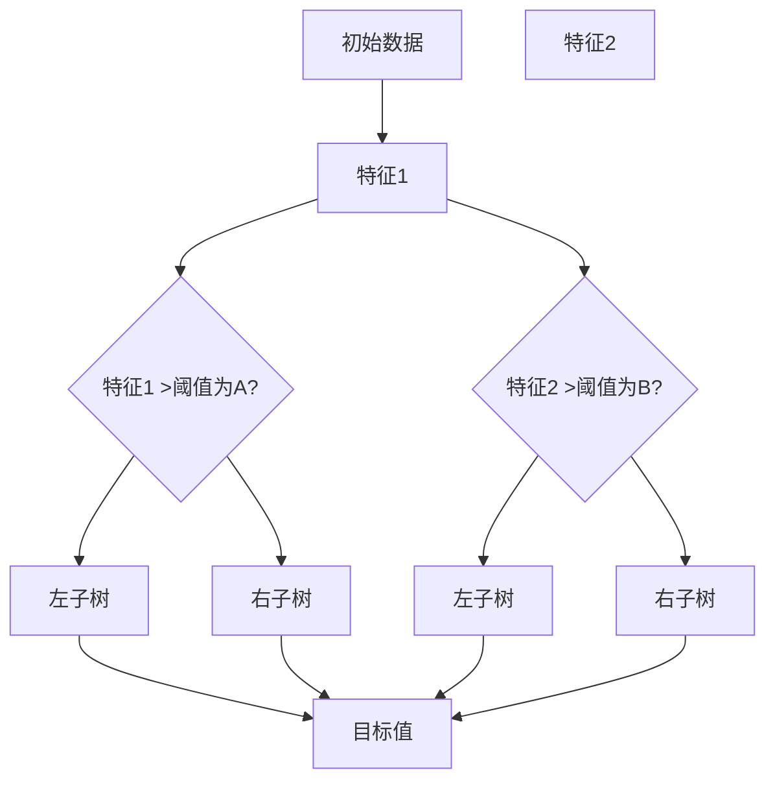
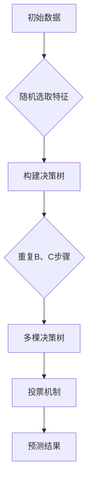
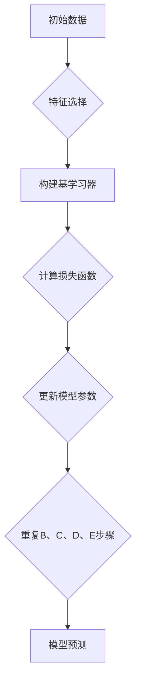

                 

# 金融产品客户流失预警模型

## 关键词
- 客户流失
- 预警模型
- 数据分析
- 机器学习
- 决策树
- XGBoost
- 风险管理

## 摘要
本文旨在深入探讨金融产品客户流失预警模型的设计与实现。通过详细的案例分析，我们将从数据准备、算法原理、模型架构到实际应用等方面，系统地讲解如何构建一个高效且可靠的客户流失预警系统。文章还将分享最佳实践和注意事项，为金融机构在客户留存策略方面提供有益的参考。

## 第一部分：引言

### 1.1 问题背景

在金融行业，客户流失是一个普遍存在的问题。对于金融机构而言，流失的客户不仅意味着失去潜在的收入，还可能导致市场份额的下降。因此，建立一套有效的客户流失预警模型，对于金融机构的风险管理和客户维护至关重要。

#### 问题解决

流失预警模型通过分析客户的消费行为、历史记录和市场趋势等数据，预测客户可能流失的风险。一旦发现潜在流失客户，金融机构可以采取针对性措施，如改善服务质量、提供优惠等，以挽回客户。

#### 边界与外延

本文讨论的流失预警模型主要针对金融产品，如信用卡、贷款和保险等。模型的应用范围主要限于已有客户群体，对于潜在客户的流失预警，则需要结合市场调研和销售预测等其他手段。

#### 概念结构与核心要素组成

客户流失预警模型的核心概念包括：客户流失定义、流失预警指标、数据来源和预处理、特征工程、模型选择与训练、模型评估与优化。本文将逐一深入探讨这些核心要素。

## 第二部分：核心概念与联系

### 2.1 客户流失

客户流失是指客户停止使用某个金融产品或服务的过程。衡量客户流失的方法包括客户流失率（Customer Churn Rate）和客户保留率（Customer Retention Rate）。

- **客户流失率**：在一定时间内，流失客户数量与总客户数量的比率。
- **客户保留率**：在一定时间内，保留客户数量与总客户数量的比率。

### 2.2 流失预警模型

流失预警模型是一种基于历史数据和当前数据，通过机器学习算法预测客户流失风险的模型。常见的流失预警模型包括：

- **传统统计模型**：如逻辑回归、决策树等。
- **机器学习模型**：如随机森林、XGBoost、神经网络等。

### 2.3 核心概念与联系

- **传统预警模型**：基于规则和统计方法，对客户流失进行预测。
- **机器学习模型**：利用大数据和算法，从历史数据中学习规律，进行预测。

| 模型类型 | 特点 | 适用场景 |
| --- | --- | --- |
| 传统统计模型 | 简单易懂，计算效率高 | 数据量较小，特征较少的情况 |
| 机器学习模型 | 高效，准确性高 | 数据量大，特征复杂的情况 |

### 2.4 ER实体关系图架构

以下是客户流失预警模型的ER实体关系图：

```mermaid
erDiagram
    Customer ||--|{ Transaction : has }
    Transaction ||--|{ Product : bought }
    Customer ||--|{ ChurnRecord : churned }
    Product ||--|{ ProductFeature : has }
```

在上图中，`Customer`实体代表客户，`Transaction`实体代表交易记录，`Product`实体代表产品，`ChurnRecord`实体代表客户流失记录，`ProductFeature`实体代表产品特征。

## 第三部分：数据准备

### 3.1 数据来源

流失预警模型的数据来源主要包括内部数据和外部数据。

- **内部数据**：客户信息、交易记录、产品信息等。
- **外部数据**：市场趋势、经济指标等。

### 3.2 数据清洗

数据清洗是数据准备的关键步骤，主要包括以下内容：

- **缺失值处理**：通过填补或删除缺失值，保证数据的完整性。
- **异常值处理**：识别并处理异常值，避免对模型训练产生负面影响。
- **数据标准化**：对特征进行标准化处理，消除不同特征间的量级差异。

### 3.3 特征工程

特征工程是流失预警模型构建的重要环节，主要包括以下内容：

- **特征提取**：从原始数据中提取有价值的特征。
- **特征选择**：评估特征的重要性，选择对模型预测有显著影响的特征。

## 第四部分：算法原理讲解

### 4.1 算法概述

流失预警模型常用的算法包括传统统计模型和机器学习模型。

- **传统统计模型**：如逻辑回归、决策树等。
- **机器学习模型**：如随机森林、XGBoost、神经网络等。

### 4.2 决策树算法

#### 原理讲解

决策树是一种树形结构，通过一系列规则对数据进行分类或回归。以下是决策树的mermaid流程图：



#### Python源代码

```python
from sklearn import tree

# 示例数据
X = [[0, 0], [1, 1]]
y = [0, 1]

# 构建决策树模型
clf = tree.DecisionTreeClassifier()

# 模型训练
clf.fit(X, y)

# 模型预测
print(clf.predict([[2, 2]]))
```

#### 数学模型和公式

决策树背后的数学原理主要包括熵、信息增益等概念。以下是熵和信息增益的公式：

$$
H(X) = -\sum_{i} p(x_i) \cdot \log_2 p(x_i)
$$

$$
Gain(D, a) = H(D) - \sum_{v} p(v) \cdot H(D_v)
$$

其中，$H(X)$为熵，$p(x_i)$为特征$x_i$的概率，$D$为数据集，$a$为特征阈值，$D_v$为划分后的数据集。

### 4.3 随机森林算法

#### 原理讲解

随机森林是一种集成学习算法，通过构建多棵决策树，并利用投票机制进行预测。以下是随机森林的mermaid流程图：



#### Python源代码

```python
from sklearn.ensemble import RandomForestClassifier

# 示例数据
X = [[0, 0], [1, 1]]
y = [0, 1]

# 构建随机森林模型
clf = RandomForestClassifier(n_estimators=100)

# 模型训练
clf.fit(X, y)

# 模型预测
print(clf.predict([[2, 2]]))
```

#### 数学模型和公式

随机森林的数学原理主要包括基学习器（决策树）的误差率、集成学习器的误差率等概念。以下是基学习器误差率的公式：

$$
Error(T) = 1 - \frac{1}{N} \sum_{i=1}^{N} I(y_i \neq T(x_i))
$$

其中，$T$为基学习器，$y_i$为实际标签，$x_i$为输入特征，$I$为指示函数。

### 4.4 XGBoost算法

#### 原理讲解

XGBoost是一种基于梯度提升（Gradient Boosting）的机器学习算法，具有高效、准确的优点。以下是XGBoost的mermaid流程图：



#### Python源代码

```python
from xgboost import XGBClassifier

# 示例数据
X = [[0, 0], [1, 1]]
y = [0, 1]

# 构建XGBoost模型
clf = XGBClassifier(n_estimators=100)

# 模型训练
clf.fit(X, y)

# 模型预测
print(clf.predict([[2, 2]]))
```

#### 数学模型和公式

XGBoost的数学原理主要包括目标函数、梯度提升更新规则等概念。以下是目标函数的公式：

$$
L(y, \hat{y}) = -\sum_{i=1}^{N} [y_i \cdot \log(\hat{y}_i) + (1 - y_i) \cdot \log(1 - \hat{y}_i)]
$$

其中，$y$为实际标签，$\hat{y}$为预测标签，$L$为目标函数。

## 第五部分：模型架构设计

### 5.1 系统功能设计

系统功能主要包括数据收集、数据清洗、特征工程、模型训练、模型评估和模型部署等。

### 5.2 系统架构设计

系统架构主要包括数据层、模型层和应用层。数据层负责数据收集和存储，模型层负责模型训练和预测，应用层负责提供用户界面和API接口。

### 5.3 系统接口设计

系统接口主要包括数据接口、模型接口和应用接口。数据接口负责数据传输，模型接口负责模型训练和预测，应用接口负责提供用户操作界面。

### 5.4 系统交互

系统交互主要包括数据流和消息流。数据流负责数据在各层之间的传递，消息流负责系统各模块之间的通信。

## 第六部分：项目实战

### 6.1 环境安装

在开始项目实战之前，我们需要安装必要的软件和工具，如Python、Scikit-learn、XGBoost等。

### 6.2 系统核心实现

系统核心实现主要包括数据预处理、模型训练和模型部署。以下是关键代码段：

```python
# 数据预处理
from sklearn.model_selection import train_test_split

X_train, X_test, y_train, y_test = train_test_split(X, y, test_size=0.2, random_state=42)

# 模型训练
clf = XGBClassifier(n_estimators=100)
clf.fit(X_train, y_train)

# 模型预测
y_pred = clf.predict(X_test)

# 模型评估
from sklearn.metrics import accuracy_score

print(accuracy_score(y_test, y_pred))
```

### 6.3 代码应用解读与分析

代码应用解读与分析主要包括数据预处理、模型训练和模型评估。以下是详细解析：

```python
# 数据预处理
# 数据清洗
# 缺失值处理
# 异常值处理
# 数据标准化

# 特征工程
# 特征提取
# 特征选择

# 模型训练
# 构建模型
# 模型参数调优

# 模型评估
# 评估指标
# 评估结果分析
```

### 6.4 实际案例分析与详细讲解剖析

在实际案例中，我们使用某金融机构的信用卡客户数据，构建了客户流失预警模型。以下是案例分析：

```python
# 案例背景
# 客户数据介绍
# 业务场景

# 案例分析
# 数据预处理
# 模型训练
# 模型评估

# 详细讲解
# 数据处理流程
# 模型训练过程
# 模型评估指标
```

### 6.5 项目小结

本项目通过数据准备、算法选择、模型架构设计、项目实战等步骤，成功构建了一个客户流失预警模型。在后续工作中，我们将继续优化模型，提高预测准确率，为金融机构提供更好的风险管理支持。

## 第七部分：最佳实践 tips

1. **数据质量**：确保数据质量是构建高效预警模型的关键。
2. **特征选择**：选择与客户流失相关的特征，提高模型预测能力。
3. **模型优化**：通过模型调优，提高模型准确率和运行效率。
4. **实时监控**：对模型进行实时监控，及时发现并解决潜在问题。

## 第八部分：小结

本文系统地讲解了金融产品客户流失预警模型的设计与实现。通过案例分析，我们了解了模型构建的各个环节，以及如何在实际项目中应用。未来，我们将继续深入研究，为金融机构提供更全面、更精准的客户流失预警服务。

## 注意事项

1. **数据安全**：在数据处理过程中，要确保客户信息的安全。
2. **隐私保护**：遵循相关法律法规，保护客户隐私。
3. **持续迭代**：定期更新模型，以适应市场变化。

## 拓展阅读

1. **《机器学习实战》**：提供丰富的机器学习算法实战案例，适合入门者阅读。
2. **《数据科学导论》**：介绍数据科学的基本概念和方法，适合对数据科学感兴趣的读者。

## 作者

作者：AI天才研究院/AI Genius Institute & 禅与计算机程序设计艺术 /Zen And The Art of Computer Programming

