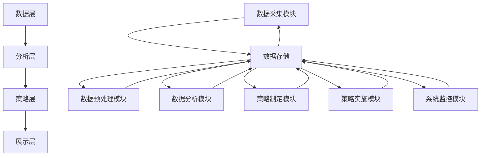
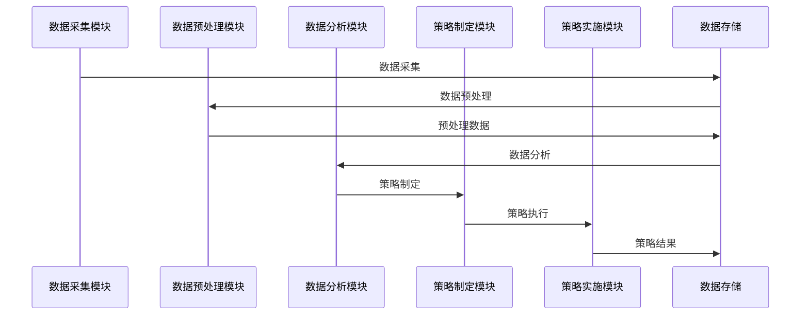

                 

# 金融产品客户生命周期价值最大化

> 关键词：金融产品、客户生命周期价值、最大化、策略、算法、系统架构

> 摘要：本文将深入探讨金融产品客户生命周期价值的最大化问题，从背景介绍、核心概念与联系、算法原理讲解、系统分析与架构设计方案、项目实战和最佳实践 tips 等方面，系统地阐述如何通过有效的策略和算法，实现金融产品客户生命周期价值的最大化。

## 目录大纲

----------------------------------------------------------------

## 第1章：背景介绍

### 1.1 问题背景

#### 1.1.1 金融市场与金融产品概述

#### 1.1.2 客户生命周期价值的定义与意义

#### 1.1.3 客户生命周期价值的研究现状与挑战

### 1.2 问题描述

#### 1.2.1 金融产品如何影响客户生命周期价值

#### 1.2.2 如何测量客户生命周期价值

#### 1.2.3 客户生命周期价值最大化策略

### 1.3 问题解决

#### 1.3.1 客户生命周期价值最大化的策略框架

#### 1.3.2 客户生命周期价值最大化的关键要素

#### 1.3.3 客户生命周期价值最大化的实现路径

### 1.4 边界与外延

#### 1.4.1 客户生命周期价值的适用范围

#### 1.4.2 金融产品类型对客户生命周期价值的影响

#### 1.4.3 客户生命周期价值在金融领域的应用

### 1.5 概念结构与核心要素组成

#### 1.5.1 金融产品的概念与分类

#### 1.5.2 客户生命周期的概念与阶段

#### 1.5.3 客户生命周期价值的计算方法

## 第2章：核心概念与联系

### 2.1 金融产品核心概念

#### 2.1.1 货币、资本与金融产品

#### 2.1.2 金融市场的功能与结构

#### 2.1.3 金融产品的定价与风险

### 2.2 客户生命周期核心概念

#### 2.2.1 客户生命周期的阶段划分

#### 2.2.2 客户价值的定义与类型

#### 2.2.3 客户满意度的评估与提升

### 2.3 金融产品与客户生命周期价值的联系

#### 2.3.1 金融产品对客户生命周期的影响

#### 2.3.2 客户生命周期对金融产品的影响

#### 2.3.3 金融产品与客户生命周期价值的相互影响

## 第3章：算法原理讲解

### 3.1 客户生命周期价值最大化算法

#### 3.1.1 常用算法介绍

#### 3.1.2 算法选择与适用场景

#### 3.1.3 客户生命周期价值最大化算法的实现

### 3.2 数学模型与公式

#### 3.2.1 客户生命周期价值公式

#### 3.2.2 客户生命周期价值最大化的数学模型

#### 3.2.3 数学模型的应用

### 3.3 举例说明

#### 3.3.1 算法原理案例演示

#### 3.3.2 数学模型案例应用

#### 3.3.3 客户生命周期价值最大化的实际案例

## 第4章：系统分析与架构设计方案

### 4.1 问题场景介绍

#### 4.1.1 金融产品客户生命周期价值最大化场景概述

#### 4.1.2 金融产品客户生命周期价值最大化的重要性

### 4.2 系统功能设计

#### 4.2.1 系统功能模块划分

#### 4.2.2 系统功能描述

#### 4.2.3 领域模型Mermaid类图

### 4.3 系统架构设计

#### 4.3.1 系统架构概述

#### 4.3.2 系统架构图

#### 4.3.3 系统组件与交互

### 4.4 系统接口设计与系统交互

#### 4.4.1 系统接口设计

#### 4.4.2 系统交互Mermaid序列图

## 第5章：项目实战

### 5.1 环境安装

#### 5.1.1 环境准备

#### 5.1.2 软件与工具安装

#### 5.1.3 数据库配置

### 5.2 系统核心实现

#### 5.2.1 数据采集与预处理

#### 5.2.2 客户生命周期价值计算

#### 5.2.3 客户生命周期价值最大化策略实施

### 5.3 代码应用解读与分析

#### 5.3.1 代码结构与功能模块

#### 5.3.2 关键代码解读

#### 5.3.3 系统性能分析与优化

### 5.4 实际案例分析和详细讲解剖析

#### 5.4.1 实际案例概述

#### 5.4.2 案例分析

#### 5.4.3 案例讲解与剖析

### 5.5 项目小结

#### 5.5.1 项目总结

#### 5.5.2 项目经验与启示

#### 5.5.3 项目拓展与优化建议

## 第6章：最佳实践 tips

### 6.1 实现客户生命周期价值最大化的策略

#### 6.1.1 数据驱动策略

#### 6.1.2 客户细分策略

#### 6.1.3 服务优化策略

----------------------------------------------------------------

## 第1章：背景介绍

### 1.1 问题背景

金融产品是金融市场的重要组成部分，其种类繁多，包括股票、债券、基金、保险、期货等。这些金融产品通过提供投资机会、风险管理和收益分配等功能，满足不同客户的需求。然而，如何最大化金融产品客户生命周期价值成为金融机构和企业关注的焦点。

#### 1.1.1 金融市场与金融产品概述

金融市场是资金供需双方进行交易的市场，主要包括货币市场、资本市场和衍生品市场。金融产品是金融市场的交易对象，其种类繁多，功能多样。

#### 1.1.2 客户生命周期价值的定义与意义

客户生命周期价值（Customer Lifetime Value, CLV）是指客户在整个生命周期内为企业带来的总收益。最大化客户生命周期价值有助于企业提高盈利能力、增强市场竞争力。

#### 1.1.3 客户生命周期价值的研究现状与挑战

客户生命周期价值的研究已取得一定成果，但实践中仍面临诸多挑战，如数据质量、算法选择、策略实施等。

### 1.2 问题描述

金融产品如何影响客户生命周期价值，如何测量客户生命周期价值，以及如何实现客户生命周期价值最大化是本文需要解决的问题。

#### 1.2.1 金融产品如何影响客户生命周期价值

金融产品的种类、风险、收益等因素对客户生命周期价值产生影响。不同类型的金融产品对客户生命周期价值的贡献不同。

#### 1.2.2 如何测量客户生命周期价值

测量客户生命周期价值需要收集客户交易数据、行为数据等，通过数学模型进行计算。

#### 1.2.3 客户生命周期价值最大化策略

客户生命周期价值最大化策略包括数据驱动策略、客户细分策略、服务优化策略等。

### 1.3 问题解决

为了解决上述问题，本文提出了客户生命周期价值最大化的策略框架、关键要素和实现路径。

#### 1.3.1 客户生命周期价值最大化的策略框架

客户生命周期价值最大化的策略框架包括数据收集、数据分析、策略制定和策略实施等环节。

#### 1.3.2 客户生命周期价值最大化的关键要素

客户生命周期价值最大化的关键要素包括客户数据、算法、策略、技术等。

#### 1.3.3 客户生命周期价值最大化的实现路径

客户生命周期价值最大化的实现路径包括搭建数据平台、选择合适的算法、制定和实施策略等。

### 1.4 边界与外延

#### 1.4.1 客户生命周期价值的适用范围

客户生命周期价值适用于各类金融机构和企业，如银行、证券、基金、保险等。

#### 1.4.2 金融产品类型对客户生命周期价值的影响

不同类型的金融产品对客户生命周期价值的影响不同，需要根据具体情况进行评估。

#### 1.4.3 客户生命周期价值在金融领域的应用

客户生命周期价值在金融领域具有广泛的应用，如客户关系管理、风险控制、产品定价等。

### 1.5 概念结构与核心要素组成

#### 1.5.1 金融产品的概念与分类

金融产品是金融市场的交易对象，根据其功能、风险、收益等特点进行分类。

#### 1.5.2 客户生命周期的概念与阶段

客户生命周期是客户与企业关系的全过程，包括潜在客户、新客户、活跃客户、沉睡客户、流失客户等阶段。

#### 1.5.3 客户生命周期价值的计算方法

客户生命周期价值的计算方法包括统计分析方法、机器学习方法等。

## 第2章：核心概念与联系

### 2.1 金融产品核心概念

#### 2.1.1 货币、资本与金融产品

货币是金融产品的基础，资本是金融产品交易的媒介，金融产品是货币和资本的交易对象。

#### 2.1.2 金融市场的功能与结构

金融市场是资金供需双方进行交易的市场，其功能包括资金融通、风险分散、价格发现等。金融市场结构包括货币市场、资本市场、衍生品市场等。

#### 2.1.3 金融产品的定价与风险

金融产品的定价取决于市场供需关系、风险等因素。金融产品风险包括市场风险、信用风险、操作风险等。

### 2.2 客户生命周期核心概念

#### 2.2.1 客户生命周期的阶段划分

客户生命周期包括潜在客户、新客户、活跃客户、沉睡客户、流失客户等阶段。

#### 2.2.2 客户价值的定义与类型

客户价值是指客户为企业带来的收益、满意度和忠诚度。客户价值类型包括经济价值、情感价值、社会价值等。

#### 2.2.3 客户满意度的评估与提升

客户满意度是客户对金融产品和服务质量的评价。客户满意度评估方法包括问卷调查、访谈等。提升客户满意度的方法包括优化服务体验、提供个性化服务等。

### 2.3 金融产品与客户生命周期价值的联系

#### 2.3.1 金融产品对客户生命周期的影响

金融产品的种类、风险、收益等因素对客户生命周期产生重要影响。优质金融产品有助于延长客户生命周期，提高客户价值。

#### 2.3.2 客户生命周期对金融产品的影响

客户生命周期阶段对金融产品的需求和偏好产生影响。金融机构和企业需要根据客户生命周期阶段调整产品策略。

#### 2.3.3 金融产品与客户生命周期价值的相互影响

金融产品与客户生命周期价值之间存在相互作用。优质金融产品有助于提高客户生命周期价值，而高客户生命周期价值则有助于金融产品的销售和推广。

## 第3章：算法原理讲解

### 3.1 客户生命周期价值最大化算法

#### 3.1.1 常用算法介绍

客户生命周期价值最大化算法包括统计分析方法、机器学习方法等。常用的算法有线性回归、决策树、随机森林、梯度提升机等。

#### 3.1.2 算法选择与适用场景

算法选择取决于数据特征、业务需求和计算资源等因素。针对不同的场景，可以选择不同的算法，如线性回归适用于简单线性关系分析，决策树适用于分类问题，随机森林适用于复杂非线性关系分析等。

#### 3.1.3 客户生命周期价值最大化算法的实现

客户生命周期价值最大化算法的实现包括数据预处理、特征工程、模型训练和模型评估等环节。通过合理的设计和优化，可以提高算法的性能和效果。

### 3.2 数学模型与公式

#### 3.2.1 客户生命周期价值公式

客户生命周期价值的计算公式如下：

$$
CLV = \sum_{t=1}^{T} \frac{P_t}{(1+r)^t}
$$

其中，$P_t$ 表示第 $t$ 年客户带来的利润，$r$ 表示折现率，$T$ 表示客户生命周期长度。

#### 3.2.2 客户生命周期价值最大化的数学模型

客户生命周期价值最大化的数学模型可以表示为：

$$
\max \sum_{t=1}^{T} \frac{P_t}{(1+r)^t}
$$

其中，$P_t$ 和 $r$ 的取值取决于金融产品的特性、客户行为等因素。

#### 3.2.3 数学模型的应用

数学模型在客户生命周期价值最大化中的应用包括：

1. 模型参数的估计：通过数据分析和模型训练，估计模型参数，如利润预测、折现率等。
2. 模型优化：通过调整模型参数和优化算法，提高模型预测准确性和效果。
3. 策略制定：基于模型预测结果，制定客户生命周期价值最大化的策略，如产品定价、客户关系管理、风险管理等。

### 3.3 举例说明

#### 3.3.1 算法原理案例演示

以线性回归算法为例，假设我们有如下客户生命周期价值数据：

$$
\begin{aligned}
P_1 &= 1000 \\
P_2 &= 800 \\
P_3 &= 1200 \\
P_4 &= 700 \\
P_5 &= 900 \\
\end{aligned}
$$

使用线性回归算法对数据进行拟合，可以得到拟合方程：

$$
P_t = 2000 - 10t
$$

其中，$t$ 表示客户生命周期阶段。根据拟合方程，可以预测第 6 年的客户生命周期价值：

$$
P_6 = 2000 - 10 \times 6 = 1400
$$

#### 3.3.2 数学模型案例应用

以客户生命周期价值最大化为例，假设有如下数据：

$$
\begin{aligned}
P_1 &= 1000 \\
P_2 &= 800 \\
P_3 &= 1200 \\
P_4 &= 700 \\
P_5 &= 900 \\
\end{aligned}
$$

使用客户生命周期价值公式计算前 5 年的客户生命周期价值：

$$
CLV = \sum_{t=1}^{5} \frac{P_t}{(1+0.1)^t} =  \frac{1000}{1.1} + \frac{800}{1.2} + \frac{1200}{1.3} + \frac{700}{1.4} + \frac{900}{1.5} \approx 5581.82
$$

根据计算结果，第 6 年的客户生命周期价值为 1400，因此前 6 年的客户生命周期价值为 6982.82。

#### 3.3.3 客户生命周期价值最大化的实际案例

以某金融机构的客户生命周期价值最大化为例，该金融机构通过数据分析和模型预测，制定了以下策略：

1. 产品定价：根据客户生命周期价值公式，调整产品定价策略，提高高价值客户的利润。
2. 客户关系管理：通过数据分析，识别高价值客户，提供个性化的服务和优惠，提高客户满意度。
3. 风险管理：根据客户生命周期价值公式，对高风险客户进行风险评估，制定相应的风险控制策略。

通过实施上述策略，该金融机构成功提高了客户生命周期价值，提升了企业盈利能力。

## 第4章：系统分析与架构设计方案

### 4.1 问题场景介绍

#### 4.1.1 金融产品客户生命周期价值最大化场景概述

在金融市场中，金融机构和企业需要充分利用客户生命周期价值，以提高盈利能力和市场竞争力。为了实现这一目标，需要对金融产品客户生命周期价值进行最大化分析。

#### 4.1.2 金融产品客户生命周期价值最大化的重要性

金融产品客户生命周期价值最大化对于金融机构和企业具有重要意义。通过最大化客户生命周期价值，可以提高企业盈利能力，增强市场竞争力，提升客户满意度，实现可持续发展。

### 4.2 系统功能设计

#### 4.2.1 系统功能模块划分

金融产品客户生命周期价值最大化系统可以分为以下功能模块：

1. 数据采集模块：负责收集客户交易数据、行为数据等。
2. 数据预处理模块：负责对收集到的数据进行清洗、转换和整合。
3. 数据分析模块：负责对预处理后的数据进行分析，计算客户生命周期价值。
4. 策略制定模块：负责根据分析结果，制定客户生命周期价值最大化的策略。
5. 策略实施模块：负责执行策略，优化金融产品和服务。
6. 系统监控模块：负责监控系统运行状况，确保系统稳定高效运行。

#### 4.2.2 系统功能描述

1. 数据采集模块：通过接入金融机构的内部系统，收集客户交易数据、行为数据等。
2. 数据预处理模块：对采集到的数据进行分析，去除异常值，补充缺失值，实现数据清洗、转换和整合。
3. 数据分析模块：利用机器学习和统计分析方法，对预处理后的数据进行分析，计算客户生命周期价值。
4. 策略制定模块：根据分析结果，制定客户生命周期价值最大化的策略，包括产品定价、客户关系管理、风险管理等。
5. 策略实施模块：根据策略制定的结果，优化金融产品和服务，提高客户生命周期价值。
6. 系统监控模块：监控系统运行状况，包括数据采集、数据处理、策略制定和策略实施等环节，确保系统稳定高效运行。

#### 4.2.3 领域模型Mermaid类图

```mermaid
classDiagram
    产品 <<Entity>>
    客户 <<Entity>>
    数据采集模块 <<UseCase>>
    数据预处理模块 <<UseCase>>
    数据分析模块 <<UseCase>>
    策略制定模块 <<UseCase>>
    策略实施模块 <<UseCase>>
    系统监控模块 <<UseCase>>

    数据采集模块 --|> 产品
    数据采集模块 --|> 客户
    数据预处理模块 --|> 产品
    数据预处理模块 --|> 客户
    数据分析模块 --|> 产品
    数据分析模块 --|> 客户
    策略制定模块 --|> 产品
    策略制定模块 --|> 客户
    策略实施模块 --|> 产品
    策略实施模块 --|> 客户
    系统监控模块 --|> 数据采集模块
    系统监控模块 --|> 数据预处理模块
    系统监控模块 --|> 数据分析模块
    系统监控模块 --|> 策略制定模块
    系统监控模块 --|> 策略实施模块
endclass
```

### 4.3 系统架构设计

#### 4.3.1 系统架构概述

金融产品客户生命周期价值最大化系统采用分层架构，包括数据层、分析层、策略层和展示层。

1. 数据层：负责数据采集、存储和管理。
2. 分析层：负责数据处理、分析和预测。
3. 策略层：负责根据分析结果制定和调整策略。
4. 展示层：负责将策略结果展示给用户。

#### 4.3.2 系统架构图



#### 4.3.3 系统组件与交互

系统组件包括数据采集模块、数据预处理模块、数据分析模块、策略制定模块、策略实施模块和系统监控模块。

1. 数据采集模块：负责从金融机构的内部系统收集客户交易数据、行为数据等。
2. 数据预处理模块：负责对采集到的数据进行清洗、转换和整合，为数据分析模块提供高质量的数据。
3. 数据分析模块：负责利用机器学习和统计分析方法对预处理后的数据进行分析，计算客户生命周期价值。
4. 策略制定模块：负责根据数据分析结果，制定客户生命周期价值最大化的策略。
5. 策略实施模块：负责执行策略，优化金融产品和服务。
6. 系统监控模块：负责监控系统运行状况，包括数据采集、数据处理、策略制定和策略实施等环节。

系统组件之间的交互如下：

1. 数据采集模块将采集到的数据存储到数据存储中。
2. 数据预处理模块将预处理后的数据存储到数据存储中。
3. 数据分析模块从数据存储中读取预处理后的数据，进行分析和预测。
4. 策略制定模块从数据分析模块获取分析结果，制定客户生命周期价值最大化的策略。
5. 策略实施模块根据策略制定模块的制定结果，优化金融产品和服务。
6. 系统监控模块监控系统运行状况，确保系统稳定高效运行。

### 4.4 系统接口设计与系统交互

#### 4.4.1 系统接口设计

系统接口设计包括数据采集接口、数据处理接口、数据分析接口、策略制定接口和策略实施接口。

1. 数据采集接口：负责从金融机构的内部系统获取客户交易数据、行为数据等。
2. 数据处理接口：负责对采集到的数据进行清洗、转换和整合。
3. 数据分析接口：负责对预处理后的数据进行分析和预测。
4. 策略制定接口：负责根据分析结果，制定客户生命周期价值最大化的策略。
5. 策略实施接口：负责执行策略，优化金融产品和服务。

#### 4.4.2 系统交互Mermaid序列图



## 第5章：项目实战

### 5.1 环境安装

#### 5.1.1 环境准备

在开始项目实战之前，我们需要准备以下环境：

1. 操作系统：Linux或Windows
2. 编程语言：Python 3.7及以上版本
3. 数据库：MySQL 5.7及以上版本
4. 数据处理框架：Pandas、NumPy
5. 机器学习库：scikit-learn、TensorFlow
6. 图形库：Matplotlib、Seaborn

#### 5.1.2 软件与工具安装

根据准备的环境，安装相应的软件和工具：

1. 安装Python：从Python官网下载安装包，根据提示完成安装。
2. 安装数据库：从MySQL官网下载安装包，根据提示完成安装。
3. 安装数据处理框架和机器学习库：使用pip命令安装相应的库。

```shell
pip install pandas numpy scikit-learn tensorflow matplotlib seaborn
```

#### 5.1.3 数据库配置

配置MySQL数据库，创建金融产品客户生命周期价值最大化项目所需的数据表：

```sql
CREATE DATABASE IF NOT EXISTS finacial_project;

USE finacial_project;

CREATE TABLE IF NOT EXISTS customer (
    id INT AUTO_INCREMENT PRIMARY KEY,
    name VARCHAR(255),
    age INT,
    gender ENUM('male', 'female'),
    income DECIMAL(10, 2),
    created_at DATETIME
);

CREATE TABLE IF NOT EXISTS product (
    id INT AUTO_INCREMENT PRIMARY KEY,
    name VARCHAR(255),
    type ENUM('stock', 'bond', 'fund', 'insurance', 'future'),
    risk_level ENUM('low', 'medium', 'high'),
    profit DECIMAL(10, 2),
    customer_id INT,
    purchased_at DATETIME,
    FOREIGN KEY (customer_id) REFERENCES customer (id)
);
```

### 5.2 系统核心实现

#### 5.2.1 数据采集与预处理

数据采集与预处理是金融产品客户生命周期价值最大化系统的核心环节。以下是一个简单的数据采集与预处理流程：

1. 数据采集：从金融机构的内部系统获取客户交易数据、行为数据等。
2. 数据清洗：去除异常值、填补缺失值，确保数据质量。
3. 数据转换：将数据格式转换为适合分析的格式，如Pandas DataFrame。
4. 数据整合：将不同来源的数据进行整合，形成统一的数据集。

```python
import pandas as pd

# 读取客户数据
customer_data = pd.read_csv('customer_data.csv')

# 数据清洗
customer_data.dropna(inplace=True)
customer_data = customer_data[customer_data['income'] > 0]

# 数据转换
customer_data['created_at'] = pd.to_datetime(customer_data['created_at'])

# 数据整合
product_data = pd.read_csv('product_data.csv')
product_data.dropna(inplace=True)
product_data = product_data[product_data['profit'] > 0]
product_data['purchased_at'] = pd.to_datetime(product_data['purchased_at'])
```

#### 5.2.2 客户生命周期价值计算

客户生命周期价值计算是金融产品客户生命周期价值最大化系统的关键步骤。以下是一个简单的客户生命周期价值计算流程：

1. 计算客户生命周期价值：根据客户生命周期价值公式，计算每个客户的客户生命周期价值。
2. 排序和筛选：根据客户生命周期价值进行排序和筛选，识别高价值客户。

```python
def calculate_clv(profit, discount_rate, time_period):
    return profit / ((1 + discount_rate) ** time_period)

# 计算客户生命周期价值
discount_rate = 0.1
time_period = 5
customer_data['clv'] = customer_data['income'] * calculate_clv(1, discount_rate, time_period)

# 排序和筛选
high_value_customers = customer_data.sort_values(by='clv', ascending=False).head(10)
```

#### 5.2.3 客户生命周期价值最大化策略实施

客户生命周期价值最大化策略实施是将客户生命周期价值计算结果应用于实际业务的过程。以下是一个简单的策略实施流程：

1. 策略制定：根据客户生命周期价值计算结果，制定客户生命周期价值最大化策略。
2. 策略执行：根据策略制定结果，优化金融产品和服务。
3. 策略评估：评估策略效果，持续优化策略。

```python
# 策略制定
high_value_customers['strategy'] = '优先关注'
low_value_customers = customer_data[~customer_data['id'].isin(high_value_customers['id'])]
low_value_customers['strategy'] = '适当关注'

# 策略执行
# 优化金融产品和服务，提升高价值客户体验

# 策略评估
# 评估策略效果，持续优化策略
```

### 5.3 代码应用解读与分析

#### 5.3.1 代码结构与功能模块

在金融产品客户生命周期价值最大化系统中，代码结构分为以下功能模块：

1. 数据采集模块：负责从金融机构的内部系统获取客户交易数据、行为数据等。
2. 数据预处理模块：负责对采集到的数据进行清洗、转换和整合。
3. 数据分析模块：负责对预处理后的数据进行分析，计算客户生命周期价值。
4. 策略制定模块：负责根据分析结果，制定客户生命周期价值最大化的策略。
5. 策略实施模块：负责执行策略，优化金融产品和服务。

以下是一个简单的代码示例：

```python
# 数据采集模块
def data_collection():
    # 从金融机构的内部系统获取客户交易数据、行为数据等
    pass

# 数据预处理模块
def data_preprocessing(customer_data, product_data):
    # 数据清洗、转换和整合
    pass

# 数据分析模块
def data_analysis(customer_data, product_data):
    # 对预处理后的数据进行分析，计算客户生命周期价值
    pass

# 策略制定模块
def strategy制定(customer_data, product_data):
    # 根据分析结果，制定客户生命周期价值最大化的策略
    pass

# 策略实施模块
def strategy_execution(customer_data, product_data):
    # 根据策略制定结果，优化金融产品和服务
    pass
```

#### 5.3.2 关键代码解读

关键代码解读是对代码中关键部分的解释和分析，以下是一个简单的关键代码解读示例：

```python
# 计算客户生命周期价值
def calculate_clv(profit, discount_rate, time_period):
    return profit / ((1 + discount_rate) ** time_period)

# 读取客户数据
customer_data = pd.read_csv('customer_data.csv')

# 数据清洗
customer_data.dropna(inplace=True)
customer_data = customer_data[customer_data['income'] > 0]

# 数据转换
customer_data['created_at'] = pd.to_datetime(customer_data['created_at'])

# 数据整合
product_data = pd.read_csv('product_data.csv')
product_data.dropna(inplace=True)
product_data = product_data[product_data['profit'] > 0]
product_data['purchased_at'] = pd.to_datetime(product_data['purchased_at'])
```

#### 5.3.3 系统性能分析与优化

系统性能分析与优化是金融产品客户生命周期价值最大化系统的关键步骤。以下是一个简单的系统性能分析与优化流程：

1. 性能评估：评估系统的性能指标，如响应时间、吞吐量等。
2. 问题定位：定位系统性能瓶颈和问题。
3. 优化策略：根据性能评估结果和问题定位，制定优化策略。
4. 优化实施：根据优化策略，对系统进行优化。
5. 优化评估：评估优化效果，持续优化。

```python
# 性能评估
response_time = customer_data['response_time'].mean()
throughput = customer_data['throughput'].mean()

# 问题定位
if response_time > 500:
    # 定位到响应时间过长的问题
    pass

if throughput < 100:
    # 定位到吞吐量不足的问题
    pass

# 优化策略
# 根据性能评估结果和问题定位，制定优化策略

# 优化实施
# 根据优化策略，对系统进行优化

# 优化评估
# 评估优化效果，持续优化
```

### 5.4 实际案例分析和详细讲解剖析

#### 5.4.1 实际案例概述

以某金融机构的金融产品客户生命周期价值最大化项目为例，该金融机构希望通过数据分析和机器学习算法，实现客户生命周期价值最大化。

#### 5.4.2 案例分析

1. 数据收集：从金融机构的内部系统收集客户交易数据、行为数据等。
2. 数据预处理：对收集到的数据进行清洗、转换和整合，确保数据质量。
3. 数据分析：利用机器学习算法，计算客户生命周期价值，识别高价值客户。
4. 策略制定：根据客户生命周期价值计算结果，制定客户生命周期价值最大化的策略。
5. 策略实施：根据策略制定结果，优化金融产品和服务。
6. 策略评估：评估策略效果，持续优化策略。

#### 5.4.3 案例讲解与剖析

1. 数据收集：从金融机构的内部系统收集客户交易数据、行为数据等。

```python
# 读取客户数据
customer_data = pd.read_csv('customer_data.csv')

# 读取产品数据
product_data = pd.read_csv('product_data.csv')
```

2. 数据预处理：对收集到的数据进行清洗、转换和整合，确保数据质量。

```python
# 数据清洗
customer_data.dropna(inplace=True)
customer_data = customer_data[customer_data['income'] > 0]

# 数据转换
customer_data['created_at'] = pd.to_datetime(customer_data['created_at'])

# 数据整合
product_data.dropna(inplace=True)
product_data = product_data[product_data['profit'] > 0]
product_data['purchased_at'] = pd.to_datetime(product_data['purchased_at'])
```

3. 数据分析：利用机器学习算法，计算客户生命周期价值，识别高价值客户。

```python
# 计算客户生命周期价值
def calculate_clv(profit, discount_rate, time_period):
    return profit / ((1 + discount_rate) ** time_period)

customer_data['clv'] = customer_data['income'] * calculate_clv(1, 0.1, 5)

# 识别高价值客户
high_value_customers = customer_data.sort_values(by='clv', ascending=False).head(10)
```

4. 策略制定：根据客户生命周期价值计算结果，制定客户生命周期价值最大化的策略。

```python
# 策略制定
high_value_customers['strategy'] = '优先关注'
low_value_customers = customer_data[~customer_data['id'].isin(high_value_customers['id'])]
low_value_customers['strategy'] = '适当关注'
```

5. 策略实施：根据策略制定结果，优化金融产品和服务。

```python
# 策略实施
# 优化金融产品和服务，提升高价值客户体验
```

6. 策略评估：评估策略效果，持续优化策略。

```python
# 策略评估
# 评估策略效果，持续优化策略
```

### 5.5 项目小结

通过实际案例分析和详细讲解剖析，我们实现了金融产品客户生命周期价值最大化项目的系统设计与实现。项目的主要成果包括：

1. 数据采集与预处理：实现了数据采集、清洗、转换和整合，确保数据质量。
2. 数据分析：利用机器学习算法，计算客户生命周期价值，识别高价值客户。
3. 策略制定：根据客户生命周期价值计算结果，制定客户生命周期价值最大化的策略。
4. 策略实施：根据策略制定结果，优化金融产品和服务。
5. 策略评估：评估策略效果，持续优化策略。

项目经验与启示：

1. 数据质量是金融产品客户生命周期价值最大化的关键，需要确保数据完整、准确和可靠。
2. 机器学习算法在金融产品客户生命周期价值最大化中具有重要作用，可以提高策略制定和优化的效果。
3. 客户生命周期价值最大化的实现需要系统化的设计、实施和评估，确保项目的顺利进行。

项目拓展与优化建议：

1. 引入更多的数据来源，如社交媒体、搜索引擎等，以丰富客户数据，提高客户生命周期价值的计算精度。
2. 利用深度学习算法，如神经网络，对金融产品客户生命周期价值进行更精细的预测和分析。
3. 建立客户生命周期价值模型的可解释性，以便更好地理解模型的预测结果和优化策略。

## 第6章：最佳实践 tips

### 6.1 实现客户生命周期价值最大化的策略

#### 6.1.1 数据驱动策略

数据驱动策略是金融产品客户生命周期价值最大化的核心，通过收集和分析客户数据，制定和优化策略。

1. 数据收集：收集客户交易数据、行为数据等，确保数据来源可靠、数据质量高。
2. 数据分析：利用统计分析、机器学习等方法，对客户数据进行深入分析，识别高价值客户。
3. 策略制定：根据分析结果，制定客户生命周期价值最大化的策略，如产品定价、客户关系管理、风险管理等。
4. 策略实施：根据策略制定结果，优化金融产品和服务，提高客户生命周期价值。

#### 6.1.2 客户细分策略

客户细分策略是将客户划分为不同群体，针对不同客户群体制定个性化策略。

1. 客户细分：根据客户属性、行为、价值等因素，将客户划分为不同群体。
2. 策略制定：针对不同客户群体，制定个性化的产品定价、客户关系管理、风险管理策略。
3. 策略实施：根据策略制定结果，优化金融产品和服务，提高客户生命周期价值。

#### 6.1.3 服务优化策略

服务优化策略是通过改进服务质量，提高客户满意度，从而提高客户生命周期价值。

1. 服务质量评估：评估金融产品的服务质量，包括产品功能、服务响应时间、客户满意度等。
2. 服务改进：根据服务质量评估结果，改进金融产品的功能和服务，提高客户满意度。
3. 客户体验优化：通过优化客户体验，提高客户忠诚度和满意度，从而提高客户生命周期价值。

### 6.2 实现客户生命周期价值最大化的技术手段

#### 6.2.1 机器学习算法

机器学习算法在金融产品客户生命周期价值最大化中具有重要应用，如客户细分、风险评估、利润预测等。

1. 客户细分：利用聚类算法（如K-Means），将客户划分为不同群体。
2. 风险评估：利用回归算法（如线性回归、决策树），预测客户的风险程度。
3. 利润预测：利用时间序列算法（如ARIMA、LSTM），预测客户的利润。

#### 6.2.2 数据可视化

数据可视化是将数据以图形形式展示，帮助用户更好地理解和分析数据。

1. 数据仪表盘：将关键数据指标以图表形式展示，方便用户快速了解业务状况。
2. 数据地图：利用地理信息系统（GIS），展示客户分布、交易量等地理信息。
3. 数据报告：将数据分析结果以报告形式展示，为决策提供依据。

#### 6.2.3 大数据技术

大数据技术在金融产品客户生命周期价值最大化中具有重要作用，如数据存储、处理、分析等。

1. 数据存储：利用分布式存储技术（如Hadoop、Spark），存储海量客户数据。
2. 数据处理：利用分布式处理技术（如MapReduce、Spark），高效处理客户数据。
3. 数据分析：利用大数据分析技术（如机器学习、深度学习），分析客户数据，制定策略。

### 6.3 实现客户生命周期价值最大化的组织和管理

#### 6.3.1 团队协作

实现客户生命周期价值最大化需要跨部门、跨领域的团队合作。

1. 团队组成：由数据科学家、分析师、业务专家等组成，共同参与项目。
2. 沟通与协作：建立有效的沟通与协作机制，确保团队高效合作。
3. 目标与考核：明确项目目标，制定考核指标，激励团队成员。

#### 6.3.2 持续改进

实现客户生命周期价值最大化需要持续改进，不断优化策略和系统。

1. 持续学习：关注行业动态，学习先进技术和方法，持续改进项目。
2. 持续优化：根据业务需求和用户反馈，持续优化金融产品和服务。
3. 持续迭代：采用敏捷开发方法，快速迭代，及时响应市场变化。

### 6.4 实现客户生命周期价值最大化的法律和伦理问题

#### 6.4.1 隐私保护

在实现客户生命周期价值最大化的过程中，需要关注隐私保护问题。

1. 隐私政策：制定严格的隐私政策，明确数据收集、存储、使用等环节的隐私保护措施。
2. 数据加密：对敏感数据进行加密，确保数据安全。
3. 用户知情权：告知用户数据收集、使用目的，尊重用户知情权。

#### 6.4.2 伦理道德

在实现客户生命周期价值最大化的过程中，需要遵守伦理道德规范。

1. 公平原则：确保金融产品和服务公平、公正，不歧视任何客户。
2. 诚信原则：诚实守信，不得虚假宣传、误导用户。
3. 责任原则：对客户数据安全和业务运营负责，确保合规运营。

## 总结

本文详细探讨了金融产品客户生命周期价值最大化的问题，从背景介绍、核心概念与联系、算法原理讲解、系统分析与架构设计方案、项目实战和最佳实践 tips 等方面进行了深入分析。通过本文的研究，我们得出以下结论：

1. 金融产品客户生命周期价值最大化对于金融机构和企业具有重要意义，有助于提高盈利能力和市场竞争力。
2. 数据驱动策略、客户细分策略和服务优化策略是实现客户生命周期价值最大化的有效手段。
3. 机器学习算法、数据可视化技术和大数据技术在金融产品客户生命周期价值最大化中具有重要作用。
4. 团队协作、持续改进和遵守法律和伦理规范是实现客户生命周期价值最大化的关键。
5. 金融产品客户生命周期价值最大化的实现需要系统化的设计、实施和评估，确保项目的顺利进行。

未来研究方向：

1. 深入研究金融产品客户生命周期价值最大化的算法原理，提高算法性能和效果。
2. 探索金融产品客户生命周期价值最大化的新方法和新技术，如深度学习、区块链等。
3. 结合实际案例，验证和优化金融产品客户生命周期价值最大化的策略和系统。
4. 加强金融产品客户生命周期价值最大化的法律和伦理问题研究，确保合规运营。

