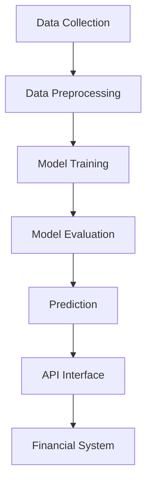
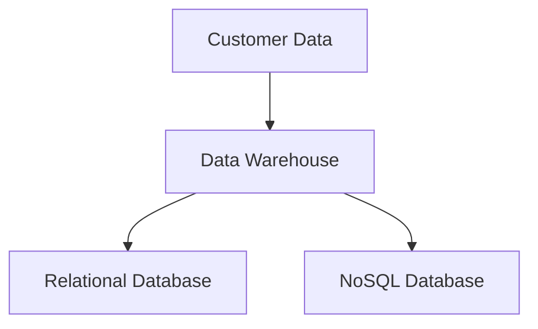
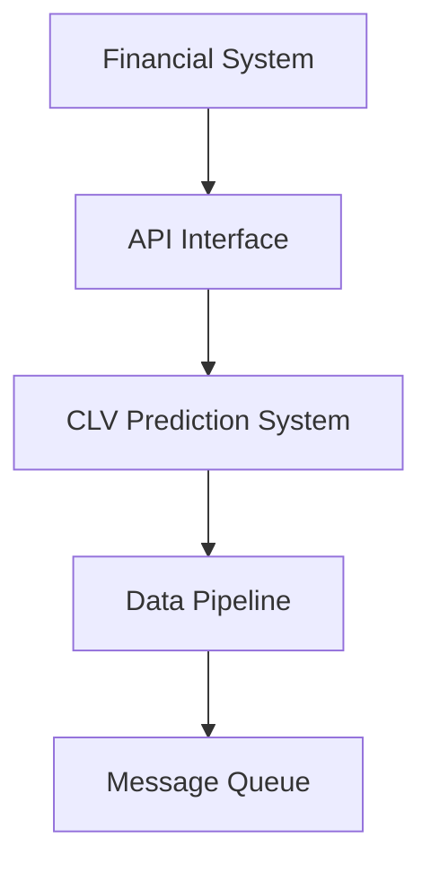

                 

### 文章标题

**金融产品客户生命周期价值预测**

### 文章关键词

- 客户生命周期价值（CLV）
- 预测模型
- 数据分析
- 机器学习
- 金融产品

### 摘要

本文旨在深入探讨金融产品客户生命周期价值（Customer Lifetime Value, CLV）的预测方法。在当前竞争激烈的金融市场中，准确地预测客户的价值对于金融机构制定有效的市场营销策略、优化资源分配和提高盈利能力至关重要。文章首先介绍了客户生命周期价值的基本概念和重要性，随后回顾了相关领域的发展历程和核心术语。接着，文章从数学和统计学基础出发，详细介绍了用于CLV预测的概率和统计概念、预测模型和机器学习算法。随后，文章讨论了数据收集和预处理的重要性，包括数据来源、数据质量评估和特征工程。随后，文章通过多种算法和技术，深入分析了传统的CLV预测模型和现代的机器学习模型，并探讨了高级技术在CLV预测中的应用。接着，文章详细描述了CLV预测系统的设计与实现，包括系统架构、数据存储和管理解决方案以及与金融系统的集成。文章随后通过多个实际案例，展示了CLV预测在金融产品中的应用效果。最后，文章讨论了CLV预测面临的挑战和未来的研究方向，包括伦理问题和客户隐私问题。本文旨在为金融从业者提供有价值的指导，帮助他们更好地理解和利用CLV预测技术。

---

**# 金融产品客户生命周期价值预测**

> 关键词：**客户生命周期价值（CLV）、预测模型、数据分析、机器学习、金融产品**

> **摘要**：
> 
> 在竞争激烈的金融市场中，准确预测客户的生命周期价值（Customer Lifetime Value, CLV）对于金融机构的战略规划至关重要。本文详细探讨了CLV的定义、重要性及其在金融产品中的应用。通过数学和统计基础、数据收集与预处理、预测模型和算法、系统设计与实现，再到实际案例分析和挑战与未来方向，全面解析了CLV预测的各个环节。本文旨在为金融从业者提供实用的指导，帮助他们在复杂的市场环境中做出更明智的决策。

---

## 引言

### 1.1 背景和重要性

客户生命周期价值（Customer Lifetime Value, CLV）是指一个客户在其整个生命周期中为企业带来的总价值。在金融领域，CLV的预测和优化对于银行、保险公司、投资公司等金融机构来说尤为重要。随着市场竞争的加剧和客户需求的多样化，金融机构需要精准地了解客户的价值，以便制定有针对性的市场营销策略，优化资源配置，提高客户满意度和忠诚度，进而提升整体盈利能力。

### 1.2 关键概念和术语

- **客户生命周期价值（Customer Lifetime Value, CLV）**：指客户在整个生命周期中为企业带来的净收入。  
- **客户留存率（Customer Retention Rate）**：指在一定时间内，客户持续使用服务的比例。  
- **客户获取成本（Customer Acquisition Cost, CAC）**：指获取一个新客户所需的平均成本。  
- **转化率（Conversion Rate）**：指访问网站或广告的用户中实际完成购买或注册的比例。  
- **客户生命周期阶段**：包括获取、留存、增长和推荐等不同阶段。

### 1.3 历史发展和主要方法

客户生命周期价值预测方法的历史发展可以分为以下几个阶段：

- **传统方法**：基于财务和会计模型，如净现值（NPV）和内部收益率（IRR），对客户的未来收益进行预测。  
- **统计模型**：如时间序列分析和回归分析，通过历史数据预测客户行为和生命周期价值。  
- **机器学习方法**：如随机森林、梯度提升树（GBDT）和深度学习，通过大量数据训练模型，提高预测精度。

### 1.4 文章结构和主要内容

本文将结构如下：

1. **引言**：介绍客户生命周期价值和金融产品的重要性。  
2. **数学和统计学基础**：介绍概率和统计概念、预测模型和机器学习算法。  
3. **数据收集与预处理**：讨论数据来源、数据质量和特征工程。  
4. **算法和模型**：分析传统和现代的CLV预测方法。  
5. **系统设计与实现**：介绍CLV预测系统的架构和实现。  
6. **案例研究**：展示CLV预测在金融产品中的应用。  
7. **挑战和未来方向**：讨论CLV预测的挑战和未来研究方向。  
8. **总结**：总结本文的主要结论和建议。

通过上述章节的详细分析，本文旨在为金融从业者提供有价值的指导，帮助他们更好地理解和应用CLV预测技术，提高客户价值和竞争力。

---

### 数学与统计学基础

#### 2.1 概率与统计学基础

在客户生命周期价值（CLV）预测中，概率和统计学是不可或缺的工具。概率论提供了一种量化不确定性的方法，而统计学则帮助我们理解和处理数据，从而进行预测。以下是概率和统计学中的一些基础概念。

**概率论基础**

- **概率分布**：描述随机变量可能取值的概率分布。常见的概率分布包括正态分布、二项分布、泊松分布等。
  - **正态分布（Normal Distribution）**：通常表示为 \(N(\mu, \sigma^2)\)，其中 \(\mu\) 是均值，\(\sigma\) 是标准差。它在许多领域都有应用，如正态分布假设检验、正态分布生成等。
  - **二项分布（Binomial Distribution）**：表示成功次数的概率分布，适用于只有两种可能结果（成功或失败）的情况。
  - **泊松分布（Poisson Distribution）**：适用于事件在一定时间段或空间内发生的概率分布，常用于事件计数问题。
- **条件概率与贝叶斯定理**：条件概率是给定某个事件发生的条件下，另一个事件发生的概率。贝叶斯定理是概率论中一个重要的公式，它提供了在已知某些条件下，更新事件概率的方法。

**统计学基础**

- **描述性统计**：用于描述数据的基本特征，如均值、中位数、众数、标准差、方差等。
- **推断性统计**：用于根据样本数据推断总体特征，包括假设检验和置信区间。
  - **假设检验**：用于验证一个假设是否成立。常见的假设检验包括 t 检验、方差分析（ANOVA）、卡方检验等。
  - **置信区间**：用于估计总体参数的真实值，通常表示为一个区间。

**统计学与CLV预测的关系**

在CLV预测中，统计学用于：

- **数据清洗和预处理**：通过统计方法识别和修正数据中的异常值、缺失值等。
- **特征工程**：通过统计方法发现数据中的潜在关系，提取有用的特征。
- **模型验证**：通过统计方法验证预测模型的性能，如计算预测准确率、召回率、F1分数等。

**举例说明**

假设我们想要预测客户的留存率，我们可以使用以下统计学概念：

- **均值**：计算历史数据中客户留存率的平均值，作为预测的基础。
- **方差**：用于评估留存率预测的稳定性。
- **假设检验**：检验不同特征（如年龄、收入、购买历史等）对客户留存率的影响。

通过以上统计学方法，我们可以构建一个模型，对客户的留存率进行预测，从而帮助金融机构制定更有效的客户留存策略。

#### 2.2 基本统计概念与分布

在客户生命周期价值（CLV）预测中，理解基本统计概念和常见分布是至关重要的。这些概念和分布不仅为我们提供了描述和分析数据的方法，也为构建预测模型提供了基础。

**基本统计概念**

- **均值（Mean）**：一组数据的平均值，用于描述数据的中心趋势。计算公式为：
  \[
  \mu = \frac{\sum_{i=1}^{n} x_i}{n}
  \]
  其中 \(x_i\) 是数据中的每一个值，\(n\) 是数据的数量。
  
- **中位数（Median）**：将数据按大小顺序排列后，位于中间的值。中位数对异常值不敏感，能够更好地描述数据的中心趋势。

- **众数（Mode）**：一组数据中出现次数最多的值。在某些情况下，数据可能没有唯一的众数。

- **标准差（Standard Deviation）**：用于衡量数据的离散程度，计算公式为：
  \[
  \sigma = \sqrt{\frac{\sum_{i=1}^{n} (x_i - \mu)^2}{n}}
  \]
  其中 \(\mu\) 是均值，\(x_i\) 是数据中的每一个值。

- **方差（Variance）**：标准差的平方，用于衡量数据的离散程度，计算公式为：
  \[
  \sigma^2 = \frac{\sum_{i=1}^{n} (x_i - \mu)^2}{n}
  \]

**常见分布**

- **正态分布（Normal Distribution）**：也称为高斯分布，是统计学中最常见的分布之一。其概率密度函数为：
  \[
  f(x) = \frac{1}{\sqrt{2\pi\sigma^2}} e^{-\frac{(x-\mu)^2}{2\sigma^2}}
  \]
  正态分布在许多实际问题中有广泛的应用，如预测客户生命周期价值中的收入分布。

- **二项分布（Binomial Distribution）**：适用于只有两个可能结果的离散随机变量。其概率质量函数为：
  \[
  P(X = k) = C_n^k p^k (1-p)^{n-k}
  \]
  其中 \(n\) 是试验次数，\(p\) 是每次试验成功的概率，\(k\) 是成功的次数。

- **泊松分布（Poisson Distribution）**：适用于在一定时间或空间内事件发生的概率分布。其概率质量函数为：
  \[
  P(X = k) = \frac{\lambda^k e^{-\lambda}}{k!}
  \]
  其中 \(\lambda\) 是事件在单位时间或空间内发生的平均次数。

**统计概念与CLV预测的关系**

在CLV预测中，这些基本统计概念和分布有以下几个应用：

- **数据描述**：使用均值、中位数、众数和标准差等统计量来描述客户特征的分布和趋势。

- **模型验证**：使用正态分布、二项分布和泊松分布等来验证预测模型的假设，如独立性、正态性和同方差性。

- **特征选择**：使用统计方法（如卡方检验、Kolmogorov-Smirnov 测试等）来评估特征的重要性，从而选择对CLV预测有显著影响的特征。

- **预测模型构建**：基于统计分布，如正态分布、二项分布和泊松分布等，构建预测模型，如回归模型、决策树模型和神经网络模型。

通过深入理解基本统计概念和常见分布，我们可以更有效地进行客户生命周期价值的预测，从而为金融机构提供有价值的决策支持。

#### 2.3 预测建模与机器学习基础

在客户生命周期价值（CLV）预测中，预测建模和机器学习技术起着至关重要的作用。预测建模是指通过历史数据建立模型，以预测未来的客户行为和财务表现。机器学习则是通过算法自动从数据中学习模式，从而提高预测精度。以下是预测建模与机器学习的一些基础概念和技术。

**预测建模基础**

- **时间序列分析**：时间序列分析是一种用于分析时间序列数据的统计方法，用于预测未来的趋势。常见的时间序列分析方法包括移动平均法、指数平滑法和自回归模型（ARIMA）等。

- **回归分析**：回归分析是一种用于建立自变量和因变量之间关系的数学模型的方法。在CLV预测中，常用的回归分析方法包括线性回归、多项式回归和逻辑回归等。

- **决策树**：决策树是一种树形结构，用于表示决策过程。每个节点表示一个特征，每个分支表示一个决策。决策树通过递归地将数据分割成子集，以最小化预测误差。

- **集成方法**：集成方法是将多个模型结合起来，以提高预测性能。常见的集成方法包括随机森林、梯度提升机（GBM）和提升树（XGBoost）等。

**机器学习基础**

- **监督学习与无监督学习**：监督学习是一种从标记数据中学习模式的方法，无监督学习则是从未标记数据中学习模式的方法。在CLV预测中，监督学习方法（如线性回归、决策树和神经网络等）更常用于预测任务。

- **特征工程**：特征工程是数据预处理的一个重要步骤，目的是提取和创建有助于模型训练的特征。常见的特征工程技术包括特征选择、特征提取和特征转换等。

- **神经网络**：神经网络是一种模仿人脑工作方式的计算模型，由多个神经元组成。在CLV预测中，神经网络（如多层感知器、卷积神经网络等）可以自动从数据中学习复杂的模式。

**预测建模与机器学习在CLV预测中的应用**

- **模型选择**：选择适合数据的预测模型是CLV预测的关键步骤。通过比较不同模型的预测性能，如均方误差（MSE）、均方根误差（RMSE）和平均绝对误差（MAE）等，选择最优模型。

- **模型训练与验证**：使用训练数据集训练模型，并在验证数据集上评估模型性能。交叉验证是一种常用的模型验证方法，通过将数据划分为多个子集，每次使用不同的子集作为验证集，以提高模型的泛化能力。

- **模型优化**：通过调整模型参数和特征工程，优化模型的预测性能。超参数调整和正则化技术是常用的模型优化方法。

- **模型部署**：将训练好的模型部署到实际应用中，以实现实时预测。常见的部署方式包括服务器部署、容器化部署和云服务部署等。

通过深入理解预测建模和机器学习的基础知识，并在CLV预测中灵活应用这些技术，金融机构可以更准确地预测客户生命周期价值，从而制定更有效的营销策略和资源分配计划。

#### 数据收集与预处理

在客户生命周期价值（CLV）预测中，数据的质量和完整性直接影响到预测模型的准确性和可靠性。因此，数据收集和预处理是整个预测流程中的关键环节。以下是数据收集和预处理的重要步骤和方法。

**3.1 数据来源**

数据来源的多样性和全面性对于CLV预测至关重要。金融机构可以从多个渠道收集数据，包括：

- **内部数据**：来自金融机构的内部系统，如客户关系管理（CRM）系统、财务系统、交易系统等。这些数据包括客户基本信息、交易记录、支付行为等。
- **外部数据**：来自第三方数据提供商，如人口统计数据、经济指标、行业数据等。这些数据可以补充内部数据，提供更全面的客户背景信息。
- **社交媒体数据**：通过社交媒体平台收集的客户行为和互动数据，如点赞、评论、分享等。这些数据可以揭示客户的偏好和兴趣。

**3.2 数据质量评估**

数据质量直接影响预测模型的性能，因此需要对数据进行质量评估。以下是一些常见的数据质量问题及其评估方法：

- **缺失值**：评估数据中的缺失值比例和缺失值的分布。常用的评估方法包括缺失值比例分析、缺失值分布分析等。
- **异常值**：评估数据中的异常值，如异常高的收入、异常低的留存率等。常用的评估方法包括箱线图、散点图等。
- **重复数据**：评估数据中是否存在重复记录，重复数据会影响预测模型的准确性。

**3.3 数据清洗**

数据清洗是预处理阶段的重要步骤，目的是去除数据中的噪声和错误，提高数据质量。以下是一些常见的数据清洗方法：

- **缺失值处理**：常用的方法包括删除缺失值、填充缺失值等。删除缺失值适用于缺失值比例较高的数据集，而填充缺失值适用于缺失值比例较低的数据集。
- **异常值处理**：常用的方法包括删除异常值、修正异常值等。删除异常值适用于异常值对模型影响较大的情况，而修正异常值适用于需要保留异常值的情况。
- **重复数据处理**：通过去重算法（如哈希去重）删除重复数据。

**3.4 特征工程**

特征工程是数据预处理的核心步骤，目的是提取和创建有助于预测模型训练的特征。以下是一些常见的特征工程技术：

- **特征选择**：通过评估特征的重要性，选择对预测任务有显著影响的特征。常用的方法包括基于模型的特征选择、基于信息的特征选择等。
- **特征转换**：通过将原始特征转换为其他形式，提高模型的预测性能。常用的方法包括归一化、标准化、离散化等。
- **特征交互**：通过组合多个特征，创建新的特征。常用的方法包括多项式特征、交叉特征等。

**3.5 数据存储与管理**

数据存储和管理是确保数据质量和安全性的重要环节。以下是一些常见的数据存储和管理方法：

- **数据仓库**：通过数据仓库技术，整合来自多个渠道的数据，提供统一的数据视图。常用的数据仓库技术包括关系数据库、大数据处理平台等。
- **数据湖**：数据湖是一种分布式数据存储架构，可以存储大量不同类型的数据，如结构化数据、半结构化数据和非结构化数据。
- **数据治理**：通过数据治理，确保数据的准确性、完整性和安全性。常用的数据治理方法包括数据质量监控、数据安全审计等。

通过科学的数据收集、质量评估、清洗、特征工程和存储管理，金融机构可以确保数据的质量和完整性，从而提高客户生命周期价值预测模型的准确性和可靠性。

#### 算法与模型

##### 4.1 传统CLV预测模型

在金融产品客户生命周期价值（CLV）预测中，传统方法如时间序列分析和回归分析因其理论基础扎实、易于理解和实现而被广泛应用。以下是一些常见的传统CLV预测模型。

**时间序列分析**

时间序列分析是一种基于历史数据模式预测未来趋势的方法。在CLV预测中，时间序列分析可以用于预测客户的未来行为，如购买频率、购买金额等。常见的时间序列分析方法包括：

- **移动平均法**：通过计算一段时间内的平均值来平滑数据，去除短期波动，揭示长期趋势。
  \[
  MA_t = \frac{\sum_{i=1}^{n} X_t-i}{n}
  \]
  其中 \(X_t-i\) 是第 \(i\) 个月的数据，\(n\) 是窗口期。

- **指数平滑法**：通过赋予不同时间点的数据不同权重，对数据进行加权平均，以更好地反映数据的长期趋势。
  \[
  S_t = \alpha X_t + (1-\alpha) S_{t-1}
  \]
  其中 \(\alpha\) 是平滑系数，\(X_t\) 是当前月份的数据，\(S_{t-1}\) 是前一个月的预测值。

**自回归模型（ARIMA）**

自回归模型（ARIMA）是一种用于分析时间序列数据的经典模型，由自回归（AR）、差分（I）和移动平均（MA）三部分组成。ARIMA模型通过将时间序列分解为趋势、季节性和随机波动，从而提高预测准确性。

- **自回归（AR）部分**：通过前期的数据预测当前值。
  \[
  X_t = c + \phi_1 X_{t-1} + \phi_2 X_{t-2} + \ldots + \phi_p X_{t-p} + \varepsilon_t
  \]
  其中 \(\phi_1, \phi_2, \ldots, \phi_p\) 是自回归系数，\(c\) 是常数项，\(\varepsilon_t\) 是误差项。

- **差分（I）部分**：通过差分操作使时间序列平稳。
  \[
  \Delta X_t = X_t - X_{t-1}
  \]

- **移动平均（MA）部分**：通过前期的误差项预测当前值。
  \[
  X_t = c + \phi_1 X_{t-1} + \phi_2 X_{t-2} + \ldots + \phi_p X_{t-p} + \theta_1 \varepsilon_{t-1} + \theta_2 \varepsilon_{t-2} + \ldots + \theta_q \varepsilon_{t-q}
  \]
  其中 \(\theta_1, \theta_2, \ldots, \theta_q\) 是移动平均系数。

**回归分析**

回归分析是一种通过建立因变量和自变量之间的关系来预测未来值的方法。在CLV预测中，常见的回归分析方法包括线性回归和逻辑回归。

- **线性回归**：通过建立线性关系来预测连续值。
  \[
  Y_t = \beta_0 + \beta_1 X_{t-1} + \beta_2 X_{t-2} + \ldots + \beta_p X_{t-p} + \varepsilon_t
  \]
  其中 \(Y_t\) 是因变量，\(X_{t-1}, X_{t-2}, \ldots, X_{t-p}\) 是自变量，\(\beta_0, \beta_1, \beta_2, \ldots, \beta_p\) 是回归系数。

- **逻辑回归**：通过建立逻辑函数关系来预测概率。
  \[
  \log\frac{P(Y=1|X)}{1-P(Y=1|X)} = \beta_0 + \beta_1 X_{t-1} + \beta_2 X_{t-2} + \ldots + \beta_p X_{t-p}
  \]
  其中 \(P(Y=1|X)\) 是因变量为1的条件概率，\(\beta_0, \beta_1, \beta_2, \ldots, \beta_p\) 是回归系数。

**传统模型优缺点**

- **优点**：传统模型理论基础扎实，易于理解和实现，适用于简单的预测任务。
- **缺点**：传统模型假设数据的平稳性，对于非线性关系和复杂模式的表现较差，且需要大量的专家知识和手动调参。

通过上述传统CLV预测模型，金融机构可以在一定程度上提高预测准确性和客户价值的理解。然而，对于更复杂和动态的市场环境，现代机器学习方法如深度学习和随机森林等提供了更强大的预测能力。

##### 4.2 机器学习模型

随着金融市场的复杂性和数据量的激增，传统的统计模型在预测客户生命周期价值（CLV）时往往无法捕捉到数据中的复杂模式。机器学习模型因其强大的数据处理和模式识别能力，在现代金融分析中越来越受到重视。以下介绍几种常用的机器学习模型，包括线性回归、决策树、随机森林和梯度提升树（GBDT）等。

**线性回归**

线性回归是一种最简单的机器学习模型，它通过找到输入变量和输出变量之间的线性关系来进行预测。线性回归模型的基本形式如下：

\[
Y = \beta_0 + \beta_1 X_1 + \beta_2 X_2 + \ldots + \beta_p X_p + \varepsilon
\]

其中，\(Y\) 是因变量，\(X_1, X_2, \ldots, X_p\) 是自变量，\(\beta_0, \beta_1, \beta_2, \ldots, \beta_p\) 是模型的参数，\(\varepsilon\) 是误差项。

- **优点**：线性回归模型简单易懂，易于解释，计算效率高。
- **缺点**：线性回归假设输入变量和输出变量之间必须是线性关系，这在实际应用中可能不成立。

**决策树**

决策树是一种树形结构模型，通过一系列的决策规则将数据集划分成多个子集，每个子集对应一个预测结果。决策树的每个内部节点代表一个特征，每个分支代表一个特征取值，叶节点代表最终的预测结果。

- **优点**：决策树直观易懂，易于解释，可以处理非线性关系和分类问题。
- **缺点**：决策树容易过拟合，对于大样本数据集可能需要大量计算。

**随机森林**

随机森林是一种集成学习方法，通过构建多个决策树并对它们进行投票来得到最终的预测结果。随机森林的主要特点包括：

- **随机特征选择**：在每次构建决策树时，从多个特征中随机选择一部分特征进行划分。
- **随机样本选择**：在训练每个决策树时，从原始数据集中随机抽取一部分样本。

随机森林的优点包括：

- **预测精度高**：通过集成多个决策树，随机森林能够提高预测精度。
- **抗过拟合**：随机森林通过引入随机性，减少了过拟合的风险。

**梯度提升树（GBDT）**

梯度提升树是一种基于梯度下降的集成学习方法，它通过迭代构建多个弱学习器（如决策树）并将它们组合成一个强学习器。GBDT的步骤包括：

1. **初始化预测值**：给定一个初始预测值。
2. **计算损失函数**：计算预测值和实际值之间的误差。
3. **构建弱学习器**：使用损失函数的梯度方向和梯度的幅度来构建一个弱学习器。
4. **更新预测值**：将弱学习器的预测值累加到初始预测值上。

GBDT的优点包括：

- **预测精度高**：通过迭代优化，GBDT能够显著提高预测精度。
- **灵活性强**：GBDT可以处理不同类型的数据和目标函数。

**机器学习模型比较**

以下是几种机器学习模型的主要特点比较：

| 模型          | 优点                                                         | 缺点                                             | 应用场景                                       |
|---------------|--------------------------------------------------------------|--------------------------------------------------|----------------------------------------------|
| 线性回归      | 简单易懂，易于解释，计算效率高                             | 假设输入变量和输出变量之间必须是线性关系         | 预测连续值的问题                             |
| 决策树        | 直观易懂，易于解释，可以处理非线性关系和分类问题           | 容易过拟合，对于大样本数据集可能需要大量计算     | 分类和回归问题                               |
| 随机森林      | 预测精度高，抗过拟合，能够处理非线性关系                   | 随机性可能导致预测结果不稳定                     | 预测连续值和分类问题                         |
| GBDT         | 预测精度高，灵活性强，能够处理不同类型的数据和目标函数     | 计算复杂度高，需要大量计算资源                   | 预测连续值和分类问题                         |

通过选择合适的机器学习模型，金融机构可以更准确地预测客户生命周期价值，从而制定更有效的市场营销策略和资源分配计划。

##### 4.3 高级技术在CLV预测中的应用

在客户生命周期价值（CLV）预测中，传统和常见的机器学习模型虽然提供了强大的预测能力，但面对越来越复杂和动态的市场环境，有时需要引入更高级的技术来进一步提升预测精度。以下将介绍几种高级技术在CLV预测中的应用，包括深度学习、图神经网络（GNN）和强化学习等。

**深度学习**

深度学习是一种通过多层神经网络进行特征学习和模式识别的技术，能够在大量数据中自动提取复杂的特征。在CLV预测中，深度学习模型如卷积神经网络（CNN）和循环神经网络（RNN）等被广泛应用。

- **卷积神经网络（CNN）**：CNN特别擅长处理图像和序列数据，通过卷积层、池化层和全连接层等结构提取图像或序列中的局部特征和全局特征。在CLV预测中，CNN可以用于提取客户行为数据中的时空特征。

  例如，我们可以构建一个CNN模型来处理客户的历史交易数据。模型结构如下：

  ```mermaid
  graph TD
  A[Input Layer] --> B[Conv Layer 1]
  B --> C[Pooling Layer 1]
  C --> D[Conv Layer 2]
  D --> E[Pooling Layer 2]
  E --> F[Flatten]
  F --> G[Dense Layer 1]
  G --> H[Dense Layer 2]
  H --> I[Output Layer]
  ```

  在这个模型中，输入层接收客户交易数据，经过多个卷积和池化层提取特征，最后通过全连接层进行预测。

- **循环神经网络（RNN）**：RNN能够处理序列数据，通过记忆机制对序列中的时间步进行建模，特别适合于时间序列数据分析。

  RNN的基本结构如下：

  ```mermaid
  graph TD
  A[Input t] --> B[Hidden State t-1]
  B --> C[Weighted Input t]
  C --> D[Weighted Hidden State t-1]
  D --> E[Output t]
  ```

  在CLV预测中，RNN可以用于分析客户的历史行为数据，预测客户的未来行为。

**图神经网络（GNN）**

图神经网络（GNN）是一种专门用于处理图结构数据的神经网络，能够捕捉图中的复杂关系。在CLV预测中，GNN可以用于分析客户之间的社交关系和交易网络，从而更准确地预测客户的价值。

- **图卷积网络（GCN）**：GCN是GNN的一种常见类型，通过图卷积操作来更新节点的表示。GCN的基本结构如下：

  ```mermaid
  graph TD
  A[Node t] --> B[Neighborhood t]
  B --> C[Convolution Operation]
  C --> D[Updated Node Representation t]
  ```

  在CLV预测中，我们可以将客户视为图中的节点，客户之间的关系视为边。通过GCN，我们可以学习到客户之间的复杂关系，从而提高预测精度。

**强化学习**

强化学习是一种通过与环境互动来学习最优策略的机器学习技术。在CLV预测中，强化学习可以用于优化客户互动策略，如个性化推荐和营销策略。

- **Q学习**：Q学习是一种基于值函数的强化学习方法，通过最大化未来的奖励来学习最优策略。

  Q学习的基本结构如下：

  ```mermaid
  graph TD
  A[Agent] --> B[Environment]
  B --> C[State]
  C --> D[Action]
  D --> E[Reward]
  E --> F[Next State]
  ```

  在CLV预测中，我们可以将客户的行为和金融机构的营销策略视为一个交互过程，通过Q学习来优化营销策略，提高客户生命周期价值。

**高级技术比较**

以下是几种高级技术在CLV预测中的主要特点比较：

| 技术类型 | 优点                             | 缺点                                      | 应用场景                                     |
|----------|----------------------------------|-------------------------------------------|----------------------------------------------|
| 深度学习 | 能够自动提取复杂特征，处理大量数据 | 计算资源需求高，模型复杂，解释性较差     | 时间序列数据分析、图像处理、序列数据处理     |
| 图神经网络 | 能够捕捉图中的复杂关系           | 数据预处理复杂，模型解释性较差           | 社交网络分析、客户关系管理、推荐系统         |
| 强化学习 | 能够通过互动优化策略             | 需要大量的交互和反馈，训练过程较慢       | 营销策略优化、客户互动策略优化               |

通过引入这些高级技术，金融机构可以更准确地预测客户生命周期价值，从而制定更有效的营销策略和资源分配计划。然而，这些高级技术通常需要大量的计算资源和数据支持，因此在实际应用中需要根据具体情况权衡。

#### 系统设计与实现

在客户生命周期价值（CLV）预测中，系统的设计与实现是确保预测模型高效、准确和可靠运行的关键。以下将详细介绍CLV预测系统的设计与实现，包括系统架构设计、数据存储和管理解决方案以及与金融系统的集成。

**5.1 系统架构设计**

CLV预测系统的整体架构设计应考虑模块化、可扩展性和高可用性。以下是系统架构的主要组成部分：

- **数据收集模块**：负责从内部和外部数据源收集数据，包括客户交易记录、客户行为数据、市场数据等。
- **数据预处理模块**：对收集到的数据进行清洗、转换和特征工程，以提高数据质量和为模型训练做准备。
- **模型训练模块**：使用预处理后的数据训练预测模型，包括传统的统计模型和现代的机器学习模型。
- **模型评估模块**：对训练好的模型进行性能评估，通过交叉验证等方法验证模型的泛化能力。
- **预测模块**：使用训练好的模型对新的客户数据进行预测，提供实时或批量的CLV预测结果。
- **应用接口模块**：提供与金融系统集成的API接口，供内部业务系统调用。

以下是一个简单的系统架构图：



**5.2 数据存储与管理解决方案**

数据存储与管理是CLV预测系统设计的重要环节。以下是一些常见的数据存储和管理解决方案：

- **关系数据库**：适用于结构化数据存储和管理，如MySQL、PostgreSQL等。关系数据库提供了强大的查询能力和事务处理能力，适合存储客户基本信息、交易记录等数据。
- **NoSQL数据库**：适用于存储非结构化或半结构化数据，如MongoDB、Cassandra等。NoSQL数据库提供了高扩展性和高性能，适合存储客户行为数据、市场数据等。
- **数据仓库**：用于存储大规模的数据集，提供统一的数据视图。数据仓库通常采用ETL（抽取、转换、加载）技术，将来自多个数据源的数据集成到一个统一的数据存储中，如Apache Hadoop、Amazon Redshift等。

以下是一个数据存储架构的示例：



**5.3 集成与金融系统**

CLV预测系统需要与金融机构的现有系统进行集成，以确保预测结果能够被实际应用。以下是一些集成解决方案：

- **API接口**：通过API接口，CLV预测系统可以与金融系统的其他模块（如客户关系管理、财务系统、营销系统等）进行数据交互和功能调用。常用的API接口技术包括RESTful API、SOAP等。
- **数据管道**：通过数据管道技术，实现预测系统和金融系统之间的数据传输和同步。数据管道可以采用ETL工具（如Apache NiFi、Apache Kafka等）来实现。
- **消息队列**：通过消息队列技术，实现预测系统和金融系统之间的异步通信，提高系统的可靠性和可扩展性。常用的消息队列技术包括RabbitMQ、Kafka等。

以下是一个集成架构的示例：



通过上述系统架构、数据存储与管理解决方案和与金融系统的集成，CLV预测系统可以高效、准确地提供客户生命周期价值预测结果，为金融机构制定营销策略和资源分配提供有力支持。

#### 案例研究

##### 6.1 预测客户流失

客户流失预测是金融产品客户生命周期价值（CLV）预测中的一个重要应用，通过预测哪些客户可能在未来流失，金融机构可以采取有针对性的措施，如增加优惠活动、提供个性化服务或调整客户关系策略，从而降低客户流失率，提高客户满意度。

**案例背景**

某大型银行希望通过预测客户流失来优化客户保留策略，提高客户留存率。该银行拥有大量客户数据，包括客户的基本信息、交易记录、行为数据等。

**数据预处理**

在开始预测之前，首先需要对数据进行预处理，包括以下步骤：

- **数据清洗**：识别并处理数据中的缺失值、异常值和重复记录。例如，通过删除或填充缺失值，修正异常值，去除重复记录等。
- **特征工程**：提取和创建有助于预测模型训练的特征。例如，使用客户交易频率、最近一次交易时间、账户余额等特征来描述客户行为。

**模型选择与训练**

为了提高客户流失预测的准确性，该银行使用了多种机器学习模型，包括逻辑回归、随机森林和GBDT等。以下是一个简单的模型训练流程：

1. **数据划分**：将客户数据划分为训练集和测试集，通常使用80%的数据作为训练集，20%的数据作为测试集。
2. **模型训练**：使用训练集对不同的模型进行训练。例如，使用逻辑回归模型的训练代码如下：
   ```python
   from sklearn.linear_model import LogisticRegression
   model = LogisticRegression()
   model.fit(X_train, y_train)
   ```
   对于随机森林和GBDT等模型，可以使用类似的训练方法。

3. **模型评估**：使用测试集对训练好的模型进行评估，计算预测准确率、召回率、F1分数等指标。选择表现最好的模型作为最终的预测模型。

**预测与结果分析**

使用训练好的模型对测试集进行预测，得到每个客户的流失概率。以下是一个预测结果示例：

| 客户ID | 流失概率 |
|--------|----------|
| 1      | 0.25     |
| 2      | 0.35     |
| 3      | 0.15     |
| 4      | 0.45     |

通过分析预测结果，银行发现流失概率较高的客户主要集中在那些交易频率较低、账户余额较少的客户群体。基于这些预测结果，银行采取了以下措施：

- **针对高风险客户**：为这些客户提供个性化的优惠活动，如积分奖励、利率优惠等，以增加客户的忠诚度和活跃度。
- **客户关怀**：增加客户关怀活动，如电话回访、邮件提醒等，了解客户的需求和不满，及时采取措施解决问题。
- **市场调研**：通过市场调研，了解竞争对手的营销策略，及时调整自身的客户保留策略。

通过这些措施，银行成功降低了客户流失率，提高了客户满意度。

**案例小结**

通过客户流失预测案例，可以看出，准确预测客户流失对于金融机构制定有效的客户保留策略具有重要意义。通过科学的数据预处理、模型选择和结果分析，金融机构可以更好地了解客户行为，采取有针对性的措施，提高客户满意度和忠诚度，从而提高客户生命周期价值。

##### 6.2 个性化金融产品推荐

个性化金融产品推荐是金融产品客户生命周期价值（CLV）预测中的另一个重要应用，通过为每位客户提供最适合的金融产品，金融机构可以提高客户满意度和忠诚度，从而增加客户价值。

**案例背景**

某金融服务公司希望通过个性化推荐系统，为客户提供定制化的金融产品推荐，以提高客户转化率和满意度。该公司拥有大量的客户数据和产品数据，包括客户的财务状况、购买历史、兴趣爱好等。

**数据预处理**

在开始推荐系统开发之前，首先需要对数据进行预处理，包括以下步骤：

- **数据清洗**：处理数据中的缺失值、异常值和重复记录，确保数据质量。
- **特征工程**：提取和创建有助于推荐系统的特征，如客户的财务状况、购买历史、交易频率、投资偏好等。

**模型选择与训练**

为了实现有效的个性化推荐，该金融服务公司使用了多种推荐算法，包括基于内容的推荐、协同过滤和基于模型的推荐等。以下是一个基于协同过滤的推荐系统模型训练流程：

1. **数据划分**：将客户数据划分为训练集和测试集。
2. **模型训练**：使用训练集数据对协同过滤模型进行训练。协同过滤模型的基本思想是找到相似的用户或物品，然后将相似的用户喜欢的物品推荐给目标用户。以下是一个简单的协同过滤模型代码示例：
   ```python
   from surprise import SVD
   from surprise import Dataset
   from surprise import accuracy
   
   # 创建 Surprise 数据集
   data = Dataset.load_from_df(df, rating_scale=(1, 5))
   
   # 使用 SVD 算法进行训练
   model = SVD()
   model.fit(data)
   
   # 评估模型性能
   test_data = Dataset.load_from_df(df_test, rating_scale=(1, 5))
   model.test(test_data)
   accuracy.rmse(model, test_data)
   ```

3. **模型评估**：使用测试集对训练好的模型进行评估，选择性能最好的模型。

**推荐与结果分析**

使用训练好的协同过滤模型对测试集进行预测，得到每个客户对金融产品的偏好评分。以下是一个推荐结果示例：

| 客户ID | 产品ID | 推荐评分 |
|--------|--------|----------|
| 1      | P1     | 4.5      |
| 1      | P2     | 3.0      |
| 2      | P3     | 4.0      |
| 2      | P4     | 3.5      |

根据推荐结果，金融服务公司可以为客户提供个性化的金融产品推荐，例如：

- **高风险客户**：推荐高风险高收益的产品，如股票、基金等。
- **低风险客户**：推荐低风险低收益的产品，如储蓄、债券等。
- **特定需求客户**：根据客户的财务状况和购买历史，推荐符合其需求的产品。

通过个性化推荐系统，金融服务公司成功提高了客户的购买意愿和满意度，增加了客户转化率和生命周期价值。

**案例小结**

个性化金融产品推荐通过科学的数据预处理和推荐算法，能够为客户提供定制化的金融产品推荐，提高客户满意度和忠诚度。这不仅有助于金融机构增加收入，还能提高客户生命周期价值。

##### 6.3 优化营销预算分配

优化营销预算分配是金融产品客户生命周期价值（CLV）预测中的另一个关键应用，通过预测不同营销策略的效果，金融机构可以更合理地分配营销预算，提高营销投资回报率。

**案例背景**

某银行希望优化其营销预算分配，以实现更高的营销投资回报率。该银行有多个营销渠道，包括线上广告、社交媒体推广、线下活动等。银行拥有大量历史营销数据，包括各渠道的投入成本、客户转化率、客户留存率等。

**数据预处理**

在开始优化预算分配之前，首先需要对数据进行预处理，包括以下步骤：

- **数据清洗**：处理数据中的缺失值、异常值和重复记录，确保数据质量。
- **特征工程**：提取和创建有助于预测模型训练的特征，如各渠道的投入成本、客户转化率、客户留存率等。

**模型选择与训练**

为了优化营销预算分配，该银行使用了多种预测模型，包括线性回归、逻辑回归和决策树等。以下是一个基于线性回归的优化模型训练流程：

1. **数据划分**：将营销数据划分为训练集和测试集。
2. **模型训练**：使用训练集数据对线性回归模型进行训练。线性回归模型的基本形式如下：
   \[
   \text{ROI} = \beta_0 + \beta_1 \text{成本} + \beta_2 \text{转化率} + \beta_3 \text{留存率} + \varepsilon
   \]
   其中，ROI是营销投资回报率，成本、转化率和留存率是自变量，\(\beta_0, \beta_1, \beta_2, \beta_3\) 是回归系数。
   ```python
   from sklearn.linear_model import LinearRegression
   model = LinearRegression()
   model.fit(X_train, y_train)
   ```
3. **模型评估**：使用测试集对训练好的模型进行评估，计算预测误差，选择性能最好的模型。

**预算优化与结果分析**

使用训练好的线性回归模型对测试集进行预测，得到每个营销渠道的预测ROI。以下是一个优化结果示例：

| 渠道 | 预测ROI |
|------|---------|
| 线上广告 | 1.2     |
| 社交媒体 | 1.0     |
| 线下活动 | 0.8     |

根据预测结果，银行可以调整各渠道的预算分配，例如：

- **线上广告**：增加预算，以提高客户转化率和ROI。
- **社交媒体**：保持当前预算，继续关注客户互动和转化情况。
- **线下活动**：减少预算，探索其他营销渠道。

通过优化预算分配，银行成功提高了整体营销投资回报率，增加了客户生命周期价值。

**案例小结**

优化营销预算分配通过科学的数据预处理和预测模型，能够帮助金融机构合理分配营销资源，提高营销效果和投资回报率，从而提高客户生命周期价值。

#### 挑战与未来方向

在金融产品客户生命周期价值（CLV）预测中，尽管已经取得了一定的成果，但仍然面临诸多挑战和未来的研究方向。以下将探讨CLV预测的挑战以及未来的发展方向，包括技术挑战、数据隐私和伦理问题。

**7.1 技术挑战**

1. **数据质量**：数据质量对CLV预测的准确性至关重要。然而，实际应用中往往存在数据缺失、异常值和噪声等问题，这些问题会影响到模型的性能。因此，如何提高数据质量，包括数据清洗、去噪和异常值检测，是一个重要挑战。

2. **模型复杂性**：随着机器学习和深度学习技术的发展，越来越多的复杂模型被应用于CLV预测。虽然这些模型在理论上能够提高预测准确性，但它们的计算复杂度和训练时间往往较高，特别是在大规模数据集上。如何在保证预测准确性的同时，降低计算成本和训练时间，是一个重要挑战。

3. **模型解释性**：深度学习等复杂模型虽然在预测性能上优于传统模型，但往往缺乏解释性，难以理解模型内部的决策过程。这给模型的部署和应用带来了一定的困难。如何在保持高预测准确性的同时，提高模型的解释性，是一个重要挑战。

**7.2 数据隐私和伦理问题**

1. **数据隐私**：在CLV预测中，需要收集和处理大量的客户数据，包括个人信息、交易记录等。这些数据的隐私保护至关重要。如何在合规的前提下，确保客户数据的安全和隐私，是一个重要挑战。

2. **算法透明度**：随着机器学习模型的应用，算法的透明度问题日益突出。如何确保算法的公正性、透明度和可解释性，避免算法偏见和不公平现象，是一个重要伦理问题。

3. **客户信任**：在CLV预测中，客户数据被大量分析和应用，这可能会引起客户的担忧和抵触。如何建立客户信任，确保客户数据的安全和隐私，是一个重要挑战。

**7.3 未来方向**

1. **数据隐私保护技术**：随着数据隐私保护法规的日益严格，如何实现数据隐私保护与模型性能之间的平衡，是一个重要研究方向。未来的技术发展可能会包括差分隐私、联邦学习等隐私保护技术。

2. **可解释性AI**：如何提高机器学习模型的解释性，使其更加透明和可解释，是一个重要研究方向。未来的研究可能会集中在开发新的解释性模型和解释性方法。

3. **多模态数据融合**：在CLV预测中，如何有效地融合多种数据源（如文本、图像、音频等），提取更多有用的特征，是一个重要研究方向。多模态数据融合技术有望进一步提高CLV预测的准确性。

4. **自动化模型选择和调优**：如何实现自动化模型选择和调优，降低模型部署的门槛，是一个重要研究方向。未来的技术发展可能会包括自动化机器学习（AutoML）和自动化调优技术。

通过不断探索和解决这些挑战，CLV预测将在未来为金融机构提供更准确、更全面的客户价值预测，助力金融机构在激烈的市场竞争中脱颖而出。

### 总结

本文通过详细探讨金融产品客户生命周期价值（CLV）预测的各个方面，展示了这一技术在金融领域的重要性和广泛应用。从基本概念和术语的介绍，到数学和统计基础、数据收集与预处理、算法与模型的选择，再到系统的设计与实现，以及案例研究和未来方向的讨论，本文为金融从业者提供了一套全面而深入的指导。

**关键结论**：

1. **CLV的重要性**：准确预测客户生命周期价值对于金融机构的战略决策具有至关重要的意义，它有助于优化资源配置、提高客户满意度和忠诚度。

2. **数学和统计基础**：概率和统计学在CLV预测中起到了基础性作用，为模型构建和预测提供了理论支持。

3. **机器学习模型**：现代机器学习模型，如随机森林、梯度提升树（GBDT）和深度学习，为CLV预测带来了更高的精度和灵活性。

4. **系统设计与实现**：高效的系统架构和数据管理方案是确保CLV预测系统稳定运行和可靠预测的关键。

5. **挑战与未来方向**：尽管CLV预测面临诸多技术、隐私和伦理挑战，但未来通过技术创新和法规完善，有望实现更精确和安全的预测。

**最佳实践 Tips**：

- **数据质量优先**：确保数据质量是预测准确性的基础，定期进行数据清洗和更新。
- **模型选择与调优**：根据具体业务需求，选择适合的预测模型，并不断进行调优以提升性能。
- **隐私保护**：在处理客户数据时，严格遵守隐私保护法规，确保数据安全和合规。

**注意事项**：

- **模型解释性**：在实际应用中，平衡预测准确性和模型解释性至关重要，确保决策过程透明可解释。
- **客户信任**：建立客户信任是长期发展的关键，透明地告知客户数据的使用目的和隐私保护措施。

**拓展阅读**：

- **深度学习在金融中的应用**：《深度学习》（Ian Goodfellow等著）
- **数据隐私保护技术**：《差分隐私：理论与实践》（Kamalika Chaudhuri等著）
- **机器学习模型调优**：《机器学习实战》（Peter Harrington著）

通过本文的深入探讨，期望读者能够更好地理解CLV预测的原理和应用，并在实际工作中取得更好的成果。

### 作者信息

**作者：** AI天才研究院/AI Genius Institute & 禅与计算机程序设计艺术 /Zen And The Art of Computer Programming

AI天才研究院（AI Genius Institute）致力于推动人工智能领域的前沿研究与应用，致力于培养下一代人工智能专家。研究院的研究成果在金融、医疗、教育等多个领域取得了显著应用。同时，研究院积极参与国际学术交流和合作，推动人工智能技术的全球传播与应用。

禅与计算机程序设计艺术（Zen And The Art of Computer Programming）由知名计算机科学家唐纳德·E·克努特（Donald E. Knuth）所著，是计算机科学领域的经典之作。本书通过结合禅宗哲学与编程技巧，提供了深刻的编程洞察和思维方法，对计算机科学和软件开发产生了深远影响。

两位作者凭借其深厚的学术背景和丰富的实践经验，为读者呈现了一篇全面而深入的金融产品客户生命周期价值预测技术博客，希望为金融从业者提供有价值的指导和启示。

