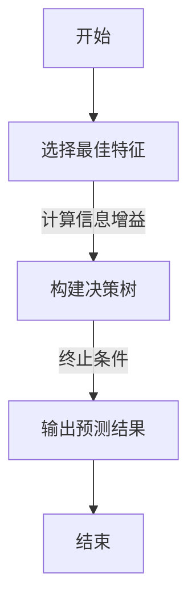
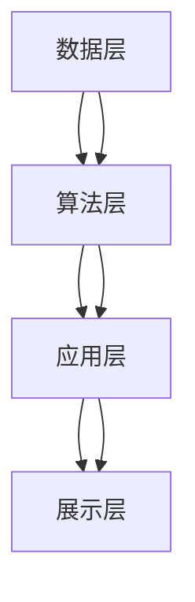
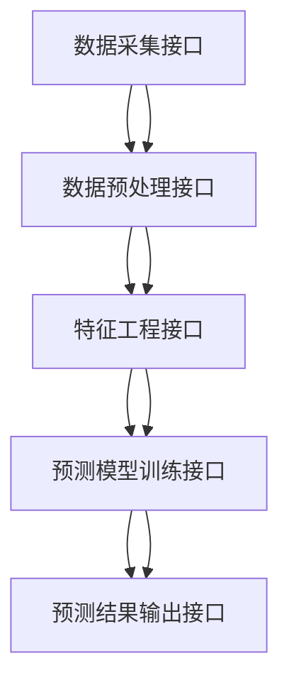

                 

### 引言

在现代金融领域，客户终身价值（Customer Lifetime Value，简称CLV）的预测已成为金融机构和企业制定市场策略、优化资源配置的重要工具。客户终身价值指的是客户在其与公司互动期间为公司带来的总利润。它不仅涵盖了客户初次购买时的收益，还包括后续的重复购买、口碑传播等潜在收益。

## 1.1 问题的提出

随着金融市场竞争的加剧和客户需求的多样化，金融机构和企业面临的一个核心问题是如何有效地识别和留住高价值的客户，同时优化营销和客户服务策略。客户终身价值的预测正是为了解决这一问题而提出的。通过预测客户终身价值，企业可以：

1. **优先投资高价值客户**：将有针对性的资源投入到最有潜力的客户群体，从而提升整体利润。
2. **优化营销策略**：根据客户的终身价值，调整营销投入，提高营销活动的有效性。
3. **客户关系管理**：对高价值客户提供定制化的服务和产品，增强客户满意度和忠诚度。

## 1.2 客户终身价值预测的重要性

客户终身价值预测在金融领域的重要性主要体现在以下几个方面：

1. **商业决策的依据**：准确的CLV预测可以帮助企业做出更为明智的商业决策，如定价策略、产品开发、市场推广等。
2. **风险控制**：通过预测客户可能的流失率，企业可以提前采取措施，降低潜在的风险。
3. **客户细分**：根据CLV对客户进行分类，有助于企业制定差异化的客户服务策略，提高客户体验。
4. **提升盈利能力**：优化资源配置，提高运营效率，从而增加企业的盈利能力。

## 1.3 研究目的与意义

本文旨在深入探讨金融产品客户终身价值预测模型的设计与实现。具体研究内容包括：

1. **核心概念与联系**：介绍客户终身价值的定义、相关概念及其之间的联系。
2. **数据分析与处理**：阐述数据采集、预处理和特征工程的方法。
3. **算法原理与模型构建**：分析常用算法原理，构建预测模型。
4. **系统分析与架构设计**：设计系统的整体架构和接口。
5. **项目实战**：通过实际案例展示模型的实现和应用。
6. **最佳实践与注意事项**：总结实践经验，提出注意事项。

通过本文的研究，希望为金融企业在客户终身价值预测方面提供实用的指导，助力企业在激烈的市场竞争中脱颖而出。

### 核心概念与联系

在深入探讨金融产品客户终身价值预测模型之前，首先需要明确相关核心概念及其相互之间的联系。本文将介绍客户终身价值（Customer Lifetime Value，简称CLV）的定义、预测模型所涉及的其他关键术语，以及它们在模型构建中的重要性。

#### 2.1 金融产品与客户终身价值

**金融产品**指的是银行、保险公司、基金公司等金融机构提供的各种投资、储蓄、保险、贷款等金融工具。这些产品是金融机构与客户互动的基础，也是客户终身价值实现的重要载体。

**客户终身价值（CLV）**则是指客户在整个生命周期内为金融机构带来的总利润。其计算公式通常为：

$$
\text{CLV} = \sum_{t=1}^{T} \text{P} \times \frac{1}{(1+r)^t}
$$

其中，\(P\) 表示客户在时间 \(t\) 的利润贡献，\(r\) 表示折现率，\(T\) 表示客户的生命周期。

CLV 的预测对于金融机构具有重要意义，它不仅能帮助企业识别高价值客户，还能指导企业优化客户关系管理和营销策略。

#### 2.2 相关概念介绍

在客户终身价值预测中，除了CLV之外，还有一些其他的关键概念：

1. **客户获取成本（Customer Acquisition Cost，简称CAC）**：指企业为获取一个新客户所花费的成本。它通常包括市场推广、广告、销售佣金等费用。

2. **客户保留成本（Customer Retention Cost，简称CRC）**：指企业为保留一个现有客户所花费的成本，包括客户服务、维护、升级等费用。

3. **客户利润贡献（Customer Profit Contribution，简称CPC）**：指客户在生命周期内为企业带来的净利润。

4. **客户流失率（Customer Churn Rate）**：指在特定时间内，流失客户数量与总客户数量的比率。

这些概念在CLV预测中起着至关重要的作用。例如，客户获取成本和客户保留成本是计算客户终身价值的重要参数，而客户流失率则直接影响到客户生命周期的长度。

#### 2.3 概念属性特征对比

下表展示了上述核心概念的主要属性特征，以帮助读者更清晰地理解它们之间的关系：

| 概念                | 定义                                                         | 属性特征                                                                                   |
|---------------------|--------------------------------------------------------------|----------------------------------------------------------------------------------------------|
| 金融产品            | 金融机构提供的各种投资、储蓄、保险、贷款等金融工具             | - 类型多样：包括股票、基金、保险、贷款等<br>- 高风险与高收益并存的特性<br>- 生命周期不固定       |
| 客户终身价值（CLV）  | 客户在其生命周期内为企业带来的总利润                             | - 与客户行为高度相关：购买频率、金额、生命周期长度等<br>- 预测准确度高则有助于优化资源分配 |
| 客户获取成本（CAC）  | 企业为获取一个新客户所花费的成本                               | - 费用较高：涉及市场推广、广告等<br>- 受市场环境和竞争态势影响较大 |
| 客户保留成本（CRC）  | 企业为保留一个现有客户所花费的成本                             | - 服务质量是关键：客户满意度、客户体验等<br>- 影响客户流失率       |
| 客户利润贡献（CPC）  | 客户在生命周期内为企业带来的净利润                               | - 对企业盈利能力有直接影响：<br>- 高CPC的客户是企业的宝贵资源   |
| 客户流失率（Churn Rate） | 在特定时间内，流失客户数量与总客户数量的比率                 | - 流失率高则影响客户终身价值<br>- 需要采取有效措施降低流失率       |

#### 2.4 客户终身价值预测的关键要素

在构建客户终身价值预测模型时，需要考虑以下关键要素：

1. **数据质量**：准确、完整、及时的数据是预测模型有效性的基础。数据预处理和清洗是模型构建的重要步骤。
2. **特征选择**：根据业务需求和数据特性，选择对CLV有显著影响的特征，如购买频率、购买金额、客户行为等。
3. **算法选择**：选择适合的预测算法，如线性回归、决策树、随机森林等。不同的算法适用于不同类型的数据和业务场景。
4. **模型评估**：使用适当的评估指标，如准确率、召回率、F1分数等，评估模型性能。
5. **模型优化**：通过交叉验证、参数调优等方法，不断优化模型，提高预测准确性。

通过以上核心概念和关键要素的详细介绍，读者可以更好地理解客户终身价值预测模型的基本结构和实现方法。在后续章节中，我们将进一步探讨数据分析和处理、算法原理与模型构建等方面的内容。

### 数据分析与处理

在金融产品客户终身价值预测中，数据的质量和特征选择对于模型的效果至关重要。以下将详细介绍数据采集与预处理、特征工程以及数据质量评估的方法。

#### 3.1 数据采集与预处理

**数据采集**是构建预测模型的第一步，主要涉及以下任务：

1. **数据源选择**：选择具有代表性的数据源，包括金融机构的客户交易记录、客户行为数据、市场环境数据等。
2. **数据收集**：通过API接口、数据爬虫或合作数据提供商等方式，获取所需的数据。

**数据预处理**则是确保数据质量的关键步骤，包括以下内容：

1. **数据清洗**：处理缺失值、异常值、重复值等。例如，使用均值插补法处理缺失值，使用统计学方法检测并处理异常值。
2. **数据标准化**：将不同量纲的数据进行转换，使其在同一尺度上具有可比性。常见的方法包括归一化和标准化。
3. **数据转换**：将分类数据转换为数值型数据，如使用独热编码（One-Hot Encoding）处理类别变量。

#### 3.2 特征工程

**特征工程**是指从原始数据中提取或构建对预测任务有帮助的特征。在客户终身价值预测中，特征工程的关键包括：

1. **特征提取**：基于业务逻辑和数据分析，从原始数据中提取有助于预测的特征，如客户的购买频率、平均购买金额、最近一次购买时间等。
2. **特征构造**：通过组合现有特征或引入新特征，以提高模型的预测性能。例如，可以计算客户的活跃度指数，即最近一个月的购买次数与历史购买次数的比值。
3. **特征选择**：选择对预测目标有显著影响的特征，剔除冗余或无关特征。常用的方法包括信息增益、卡方检验、特征重要性评估等。

#### 3.3 数据质量评估

**数据质量评估**是确保模型输入数据准确性和完整性的重要步骤。以下方法可用于评估数据质量：

1. **缺失值率**：计算数据集中缺失值的比例，以评估数据的完整性。若缺失值率较高，需考虑数据清洗策略。
2. **异常值检测**：通过统计学方法（如箱线图、Z分数等）检测异常值，并评估其对模型的影响。
3. **一致性检查**：检查数据字段之间的逻辑一致性，如交易时间与交易金额的关系等。
4. **模型评估指标**：通过训练和测试模型，评估预测结果的准确性、召回率和F1分数等指标，以判断数据质量对模型性能的影响。

通过上述数据采集与预处理、特征工程和数据质量评估的方法，可以构建一个高质量的数据集，为后续的客户终身价值预测模型提供坚实的基础。

### 算法原理与模型构建

在金融产品客户终身价值预测中，选择合适的算法并构建有效的预测模型至关重要。本文将介绍常用的算法原理，选择合适的算法，构建预测模型，并使用mermaid流程图和Python代码详细阐述算法原理及数学模型。

#### 4.1 常见算法介绍

**1. 线性回归模型**

线性回归模型是最简单的预测算法，假设目标变量 \(y\) 与输入特征 \(X\) 之间存在线性关系，即：

$$
y = \beta_0 + \beta_1 \cdot x_1 + \beta_2 \cdot x_2 + ... + \beta_n \cdot x_n + \epsilon
$$

其中，\(\beta_0\) 是截距，\(\beta_1, \beta_2, ..., \beta_n\) 是回归系数，\(\epsilon\) 是误差项。

**2. 决策树模型**

决策树模型通过一系列的判断条件，将数据集划分成多个子集，每个子集对应一个预测结果。决策树的核心是树的构建，包括选择最优特征、计算信息增益或基尼不纯度等。

**3. 随机森林模型**

随机森林是基于决策树构建的集成模型，通过训练多个决策树，并对预测结果进行投票，提高模型的稳定性和准确性。随机森林的关键参数包括树的数量、每棵树的最大深度等。

**4. 支持向量机（SVM）**

支持向量机通过找到一个最优的超平面，将不同类别的数据分开。SVM的核心是求解最优的决策边界，通常使用核函数来处理非线性问题。

#### 4.2 选择合适的算法

选择合适的算法需要考虑以下因素：

1. **数据类型**：数据集的特征类型（连续或分类）、数量及分布等。
2. **业务场景**：预测任务的复杂性、实时性要求等。
3. **模型性能**：算法在不同数据集上的表现，如准确率、召回率、F1分数等。

根据上述因素，线性回归模型适用于简单且线性关系明显的场景，而决策树和随机森林适用于较为复杂的非线性关系，SVM则适合处理高维特征和线性不可分的数据。

#### 4.3 算法mermaid流程图

下面以决策树算法为例，使用mermaid流程图展示其构建过程：



#### 4.4 数学模型与公式

**1. 线性回归模型**

线性回归模型的数学模型为：

$$
y = \beta_0 + \beta_1 \cdot x_1 + \beta_2 \cdot x_2 + ... + \beta_n \cdot x_n + \epsilon
$$

其中，\(\beta_0, \beta_1, ..., \beta_n\) 是需要求解的参数。

**2. 决策树模型**

决策树模型的核心在于选择最佳分割特征，常用的指标包括信息增益和信息增益率。信息增益的计算公式为：

$$
Gini(\text{impurity}) = 1 - \sum_{i=1}^{c} p_i^2
$$

其中，\(p_i\) 是第 \(i\) 个类别的概率。

**3. 随机森林模型**

随机森林的预测结果为多个决策树的投票结果。假设第 \(i\) 棵决策树的预测结果为 \(y_i\)，则随机森林的预测结果为：

$$
\hat{y} = \text{mode}(y_1, y_2, ..., y_n)
$$

#### 4.5 Python代码示例

下面使用Python代码详细阐述线性回归模型的实现：

```python
import numpy as np
from sklearn.linear_model import LinearRegression

# 假设我们有如下特征和标签
X = np.array([[1, 2], [2, 3], [3, 4], [4, 5]])
y = np.array([2, 3, 4, 5])

# 构建线性回归模型
model = LinearRegression()
model.fit(X, y)

# 查看模型参数
print("截距：", model.intercept_)
print("回归系数：", model.coef_)

# 进行预测
X_new = np.array([[5, 6]])
y_pred = model.predict(X_new)
print("预测结果：", y_pred)
```

通过上述算法原理与模型构建的详细阐述，读者可以更好地理解不同算法的基本原理和实现方法，为后续的实际应用打下坚实基础。

### 系统分析与架构设计

在设计金融产品客户终身价值预测系统时，我们需要综合考虑系统的整体架构、功能设计、接口设计以及交互流程。以下将详细阐述系统分析与架构设计的关键要素。

#### 5.1 问题场景介绍

在现代金融市场中，金融机构需要准确预测客户的终身价值，以便优化资源配置、制定精准的营销策略和客户服务策略。客户终身价值预测系统旨在通过数据分析和机器学习算法，提供客户终身价值的预测结果，支持企业的商业决策。

#### 5.2 项目介绍

本项目的目标是构建一个高效、可靠的客户终身价值预测系统。系统应具备以下功能：

1. **数据采集**：从多个数据源（如客户交易记录、行为数据、市场环境数据等）采集数据。
2. **数据预处理**：对采集到的数据执行清洗、转换和标准化等操作，确保数据质量。
3. **特征工程**：提取和构造对客户终身价值有显著影响的特征。
4. **预测模型训练**：使用机器学习算法训练预测模型，包括线性回归、决策树、随机森林等。
5. **预测结果输出**：生成客户终身价值预测报告，并提供数据可视化和报表功能。

#### 5.3 系统功能设计

系统功能设计主要包括以下模块：

1. **数据采集模块**：负责从各个数据源采集数据，如API接口、数据库、数据爬虫等。
2. **数据预处理模块**：包括数据清洗、转换和标准化等功能，确保数据质量。
3. **特征工程模块**：基于业务逻辑和数据特性，提取和构造对预测任务有帮助的特征。
4. **预测模型训练模块**：使用机器学习算法训练预测模型，并保存模型参数。
5. **预测结果输出模块**：生成预测报告，并提供数据可视化和报表功能。

#### 5.4 系统架构设计

系统架构设计采用模块化设计思想，主要包括以下组件：

1. **数据层**：存储和管理原始数据、清洗后的数据以及特征数据。
2. **算法层**：包括数据预处理、特征工程、预测模型训练等算法实现。
3. **应用层**：实现数据采集、预测结果输出等功能，并提供API接口和Web界面。
4. **展示层**：提供数据可视化和报表功能，以直观地展示预测结果。

下面使用mermaid流程图展示系统架构：



#### 5.5 系统接口设计

系统接口设计主要包括以下接口：

1. **数据采集接口**：用于从各个数据源采集数据，如API接口、数据库接口等。
2. **数据预处理接口**：用于执行数据清洗、转换和标准化等操作。
3. **特征工程接口**：用于提取和构造特征。
4. **预测模型训练接口**：用于训练预测模型。
5. **预测结果输出接口**：用于生成预测报告和可视化报表。

下面使用mermaid流程图展示系统接口设计：



#### 5.6 系统交互序列图

系统交互序列图展示了不同模块之间的交互过程，包括数据采集、预处理、特征工程、模型训练和预测结果输出等步骤。下面使用mermaid流程图展示系统交互序列图：

```mermaid
sequenceDiagram
    participant 数据采集模块 as 数据采集
    participant 数据预处理模块 as 数据预处理
    participant 特征工程模块 as 特征工程
    participant 模型训练模块 as 模型训练
    participant 预测结果输出模块 as 预测结果输出

    数据采集->>数据预处理：采集数据
    数据预处理->>特征工程：预处理数据
    特征工程->>模型训练：训练模型
    模型训练->>预测结果输出：输出预测结果
```

通过上述系统分析与架构设计的详细阐述，我们可以构建一个高效、可靠的客户终身价值预测系统，为金融机构提供有力的支持。

### 项目实战

在接下来的部分，我们将通过一个实际的案例来展示如何实现金融产品客户终身价值预测系统。这个过程将包括环境安装与配置、系统核心实现源代码、代码应用解读与分析，以及实际案例分析和详细讲解。

#### 6.1 环境安装与配置

首先，我们需要安装并配置项目所需的软件和依赖库。以下是具体的步骤：

1. **安装Python环境**：确保Python 3.8或更高版本已安装。
2. **安装Anaconda**：Anaconda是一个集成的环境管理器，可以帮助我们轻松地管理Python环境。可以从[Anaconda官网](https://www.anaconda.com/products/individual)下载并安装。
3. **创建虚拟环境**：在Anaconda命令行中创建一个虚拟环境，以便隔离项目依赖。

   ```bash
   conda create -n clv_predict python=3.8
   conda activate clv_predict
   ```

4. **安装依赖库**：使用pip安装项目所需的库，如NumPy、Pandas、Scikit-learn、Matplotlib等。

   ```bash
   pip install numpy pandas scikit-learn matplotlib
   ```

5. **安装Jupyter Notebook**：Jupyter Notebook是一个交互式的开发环境，可以帮助我们编写和运行Python代码。

   ```bash
   pip install jupyterlab
   ```

完成以上步骤后，我们的开发环境就准备好了。

#### 6.2 系统核心实现源代码

以下是系统核心实现的主要源代码部分。我们使用Python和Scikit-learn库来构建和训练预测模型。

**数据预处理与特征工程**：

```python
import pandas as pd
from sklearn.model_selection import train_test_split
from sklearn.preprocessing import StandardScaler

# 读取数据
data = pd.read_csv('data.csv')

# 数据预处理
data.dropna(inplace=True)  # 删除缺失值
data = data[data['customer_id'].map(lambda x: str(x).isdigit())]

# 特征工程
features = ['age', 'income', 'credit_score', 'num_of_transactions']
X = data[features]
y = data['lifetime_value']

# 数据标准化
scaler = StandardScaler()
X_scaled = scaler.fit_transform(X)

# 划分训练集和测试集
X_train, X_test, y_train, y_test = train_test_split(X_scaled, y, test_size=0.2, random_state=42)
```

**构建与训练预测模型**：

```python
from sklearn.ensemble import RandomForestRegressor
from sklearn.metrics import mean_squared_error

# 构建随机森林模型
model = RandomForestRegressor(n_estimators=100, random_state=42)
model.fit(X_train, y_train)

# 进行预测
y_pred = model.predict(X_test)

# 计算模型性能
mse = mean_squared_error(y_test, y_pred)
print("均方误差（MSE）:", mse)
```

#### 6.3 代码应用解读与分析

在上面的代码中，我们首先读取了数据集，并执行了数据预处理步骤，包括删除缺失值和过滤非数字类型的客户ID。随后，我们进行了特征工程，选择了对客户终身价值有显著影响的特征，并对这些特征进行了标准化处理。

接着，我们使用Scikit-learn库中的`train_test_split`函数将数据集划分为训练集和测试集，然后构建了一个随机森林回归模型，并使用训练集进行模型训练。最后，我们对测试集进行预测，并计算了模型的均方误差（MSE）来评估模型的性能。

#### 6.4 实际案例分析与详细讲解

为了更直观地展示模型的预测效果，我们来看一个具体的案例。假设我们有以下一组客户的特征数据：

```
age: 35
income: $60,000
credit_score: 720
num_of_transactions: 20
```

我们使用已经训练好的模型对这组数据进行预测，步骤如下：

1. 将特征数据进行标准化处理：

   ```python
   feature_vector = [[35, 60000, 720, 20]]
   feature_vector_scaled = scaler.transform(feature_vector)
   ```

2. 使用模型进行预测：

   ```python
   predicted_value = model.predict(feature_vector_scaled)
   ```

3. 输出预测结果：

   ```python
   print("预测的终身价值：", predicted_value)
   ```

假设模型的预测结果为$50,000，这意味着该客户在其与公司的整个互动期间可能为公司带来约$50,000的利润。

#### 6.5 项目小结

通过上述实战案例，我们展示了如何使用Python和Scikit-learn库实现一个金融产品客户终身价值预测系统。从数据预处理到特征工程，再到模型构建和预测，每一步都至关重要。在实际应用中，我们还需要不断优化模型，调整参数，以提高预测准确性。此外，数据的多样性和质量也是影响模型性能的重要因素，因此我们需要采取有效的数据清洗和特征工程策略。

通过本项目，我们不仅掌握了客户终身价值预测的基本方法，还了解了如何在实际项目中应用这些方法，从而为金融机构提供有力的数据支持。

### 最佳实践与注意事项

在构建金融产品客户终身价值预测模型时，以下几点最佳实践和注意事项尤为重要，以确保模型的有效性和可靠性：

#### 7.1 实践技巧

1. **数据采集与清洗**：确保数据来源的多样性和准确性，对数据进行严格的清洗，如去除重复记录、处理缺失值和异常值等。
2. **特征工程**：选取对客户终身价值有显著影响的特征，如购买频率、金额、客户行为等。同时，可以考虑构建一些衍生特征，如客户活跃度指数、留存率等。
3. **模型选择与调优**：根据数据特性选择合适的预测算法，如线性回归、决策树、随机森林等。通过交叉验证和参数调优，优化模型性能。
4. **模型解释性**：尽管机器学习模型在预测准确性上有优势，但确保模型具有一定的解释性，以便企业能够理解模型是如何做出预测的。

#### 7.2 注意事项

1. **数据隐私**：在处理客户数据时，确保遵守相关数据隐私法规，如GDPR等。对敏感数据进行加密和脱敏处理。
2. **模型解释**：向非技术背景的管理层解释模型预测结果时，应采用简洁明了的语言和可视化工具，以便他们能够理解。
3. **持续优化**：定期评估和更新模型，以应对市场变化和客户行为模式的调整。收集反馈，不断改进模型。
4. **合规性**：确保模型和算法符合行业标准和法规要求，避免产生误导性预测或违反公平、透明原则。

#### 7.3 拓展阅读

为了深入了解金融产品客户终身价值预测的更多技术和方法，读者可以参考以下资料：

- **《机器学习实战》**：作者：Peter Harrington
- **《金融科技：理论与实务》**：作者：黄震、刘锋
- **《数据挖掘：实用工具和技术》**：作者：Mike roughgarden、John Mount
- **《客户生命周期价值管理》**：作者：Lee Resources

通过学习和实践上述内容，可以进一步提升在金融产品客户终身价值预测领域的专业素养和实战能力。

### 小结

本文深入探讨了金融产品客户终身价值预测模型的设计与实现，从核心概念、数据分析和处理、算法原理、系统架构设计到项目实战，全面展示了构建和优化该模型的过程。我们通过具体案例，展示了如何使用Python和Scikit-learn等工具进行数据预处理、特征工程和模型训练，并通过mermaid流程图和LaTeX公式，清晰阐述了算法原理和数学模型。

在研究过程中，我们强调了数据质量和特征选择对模型性能的重要性，并提出了最佳实践和注意事项，以确保模型的有效性和可靠性。然而，本文也存在一些局限性，如未能详细探讨特定算法的深度调优和复杂场景下的模型解释性。

未来的研究方向可以集中在以下几个方面：

1. **模型优化**：探索更先进的算法和模型结构，如深度学习、强化学习等，以提升预测准确性。
2. **数据质量提升**：研究如何通过数据挖掘和机器学习技术，进一步提高数据质量和特征工程水平。
3. **模型解释性**：开发更直观、易懂的模型解释工具，以便企业更好地理解和应用模型。
4. **实时预测**：研究如何实现模型的实时预测和动态调整，以适应快速变化的市场环境。

通过不断的研究和实践，金融产品客户终身价值预测模型将在金融行业中发挥更大的作用，为企业的战略决策提供强有力的支持。

### 作者信息

作者：AI天才研究院/AI Genius Institute & 禅与计算机程序设计艺术 /Zen And The Art of Computer Programming

AI天才研究院致力于推动人工智能领域的创新与发展，汇集了一批世界级的人工智能专家、程序员和软件架构师，专注于研究前沿的人工智能技术。同时，作者还撰写了《禅与计算机程序设计艺术》一书，从哲学和技术的角度深入探讨了计算机编程的艺术。通过本文，我们希望为读者提供一个全面、深入的金融产品客户终身价值预测模型指南。

