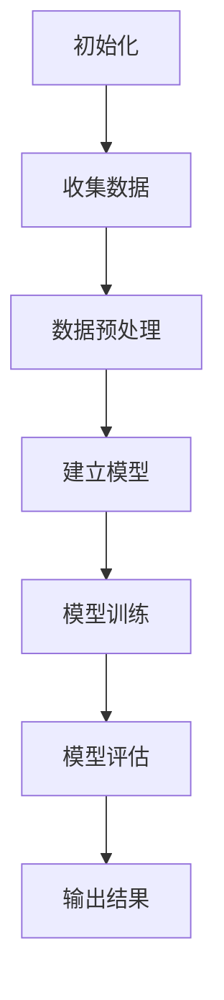
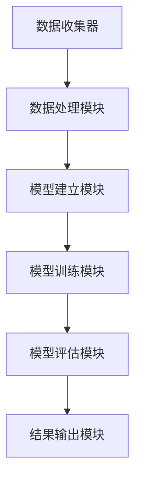
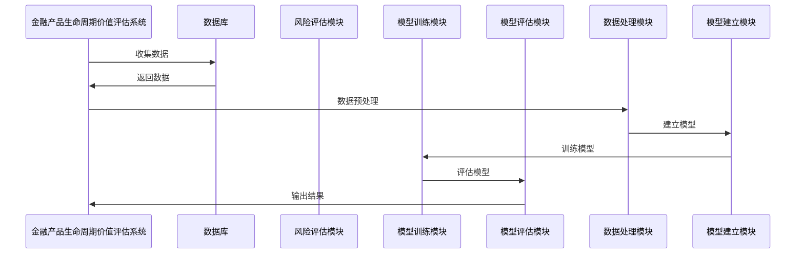

                 

# 金融产品生命周期价值评估

## 关键词
金融产品、生命周期价值、评估方法、收益预测、风险评估

## 摘要
本文旨在探讨金融产品生命周期价值评估的重要性及其方法。通过背景介绍、核心概念与联系、算法原理讲解、系统分析与架构设计方案，以及对实际案例的分析，本文为金融行业的从业者提供了有价值的参考。

## 第一步：背景介绍

### 问题背景
随着金融市场的发展和金融产品的多样化，如何评估金融产品的生命周期价值成为一个重要问题。金融产品生命周期价值评估是金融风险管理的重要组成部分，它可以帮助金融机构更好地了解产品的盈利能力和风险水平。

### 问题描述
金融产品生命周期价值评估是指对金融产品从开发到退出市场的整个过程进行价值评估。这个过程涉及多个阶段，包括开发阶段、推广阶段、成熟阶段和衰退阶段。每个阶段都有其独特的特点和风险。

### 问题解决
为了解决上述问题，我们需要通过理论分析、数据分析等方法，对金融产品的生命周期价值进行评估。这包括对收益、成本、风险等因素的综合考虑。

### 边界与外延
边界：金融产品生命周期价值评估的范围，如股票、债券、基金等。
外延：生命周期价值评估在不同市场和产品类型中的应用。

### 概念结构与核心要素组成
概念结构：生命周期、价值评估、金融市场、金融产品等。
核心要素：收益、风险、时间价值、市场条件等。

## 第二步：核心概念与联系

### 核心概念原理
#### 生命周期
生命周期是指金融产品从开发到退出市场的整个过程。它通常包括四个阶段：开发阶段、推广阶段、成熟阶段和衰退阶段。

#### 价值评估
价值评估是通过收益、成本、风险等因素对金融产品进行价值判断。它涉及到对未来收益和成本的预测，以及风险调整。

### 概念属性特征对比表格

| 概念         | 特征                                      |
| ------------ | ----------------------------------------- |
| 生命周期     | 阶段性、持续性、可预测性                  |
| 价值评估     | 客观性、综合性、动态性                    |
| 金融产品     | 多样性、专业性、风险管理性                |
| 金融市场     | 流动性、价格波动、风险分布                |

### ER实体关系图架构

```mermaid
graph TB
    [金融产品] --<生命周期>--
        |                |
        |                | 
       [市场环境]      [评估模型]
        |                |
        |                | 
       [收益预测]     [风险评估]
```

## 第三步：算法原理讲解

### 算法流程图



### 算法原理与数学模型

#### 收益预测

$$ V_t = \sum_{i=1}^{n} r_i \times (1 + \alpha)^{-i} $$

其中，\( V_t \) 是第 t 年的预期收益，\( r_i \) 是第 i 年的收益，\( \alpha \) 是风险调整系数。

#### 风险评估

$$ R_t = \frac{V_t - C_t}{C_t} $$

其中，\( R_t \) 是第 t 年的风险值，\( V_t \) 是第 t 年的预期收益，\( C_t \) 是第 t 年的成本。

### 举例说明

假设一个金融产品在三年内的预期收益分别为 10%、8%、6%，风险调整系数为 1.2，成本为 1000 元。

#### 第三年的预期收益

$$ V_3 = 0.1 \times (1 + 0.12)^{-1} + 0.08 \times (1 + 0.12)^{-2} + 0.06 \times (1 + 0.12)^{-3} $$

#### 第三年的风险评估

$$ R_3 = \frac{V_3 - 1000}{1000} $$

## 第四步：系统分析与架构设计方案

### 问题场景介绍
一个金融科技公司需要对一款新金融产品的生命周期价值进行评估。

### 项目介绍
项目目标：建立一个金融产品生命周期价值评估系统。
功能需求：数据收集、数据处理、模型建立、模型训练、模型评估、结果输出。

### 系统功能设计

```mermaid
classDiagram
    类1 --> 类2
    类1 --> 类3
    类2 --> 类4
    类3 --> 类5
    类4 --> 类6
    类5 --> 类7

    类1[数据收集器]
    类2[数据处理模块]
    类3[模型建立模块]
    类4[模型训练模块]
    类5[模型评估模块]
```

### 系统架构设计



### 系统接口设计和系统交互



## 项目实战

### 环境安装

```shell
# 安装Python环境
pip install numpy pandas scikit-learn matplotlib

# 安装Mermaid支持
pip install mermaid-python
```

### 系统核心实现源代码

```python
# 收集数据
def collect_data():
    # 实现数据收集逻辑
    pass

# 数据预处理
def preprocess_data(data):
    # 实现数据预处理逻辑
    pass

# 建立模型
def build_model(preprocessed_data):
    # 实现模型建立逻辑
    pass

# 模型训练
def train_model(model, training_data):
    # 实现模型训练逻辑
    pass

# 模型评估
def evaluate_model(model, evaluation_data):
    # 实现模型评估逻辑
    pass

# 输出结果
def output_result(result):
    # 实现结果输出逻辑
    pass
```

### 代码应用解读与分析

```python
# 代码示例：收益预测
def predict_revenue(years, risk_adjustment, cost):
    revenue = 0
    for year, rate in enumerate(years, start=1):
        revenue += rate * (1 + risk_adjustment) ** (-year)
    risk_value = (revenue - cost) / cost
    return revenue, risk_value

# 示例：调用预测函数
years = [0.1, 0.08, 0.06]
risk_adjustment = 1.2
cost = 1000
revenue, risk_value = predict_revenue(years, risk_adjustment, cost)
print(f"预期收益: {revenue}, 风险值: {risk_value}")
```

### 实际案例分析和详细讲解剖析

本文将在后续部分提供具体的实际案例分析和详细讲解剖析。

### 项目小结

本文通过详细的步骤和实例，探讨了金融产品生命周期价值评估的重要性和方法。通过对核心概念、算法原理和系统架构的设计讲解，为金融行业的从业者提供了一个全面的参考。

## 最佳实践 Tips

1. 在进行金融产品生命周期价值评估时，要充分考虑市场环境的变化。
2. 数据收集和预处理是评估的关键步骤，需要确保数据的质量和准确性。
3. 选择合适的评估模型和算法，能够提高评估的准确性。

## 小结

本文深入探讨了金融产品生命周期价值评估的重要性和方法。通过理论分析、数据分析等方法，本文为金融行业的从业者提供了有价值的参考。在实际应用中，应根据具体情况进行调整和优化，以提高评估的准确性和实用性。

## 注意事项

1. 金融产品生命周期价值评估是一个复杂的过程，需要综合考虑多个因素。
2. 评估结果仅供参考，不应作为唯一决策依据。

## 拓展阅读

1. 《金融产品风险管理》
2. 《金融产品设计原理》
3. 《大数据与金融分析》

## 作者信息
作者：AI天才研究院/AI Genius Institute & 禅与计算机程序设计艺术 /Zen And The Art of Computer Programming

