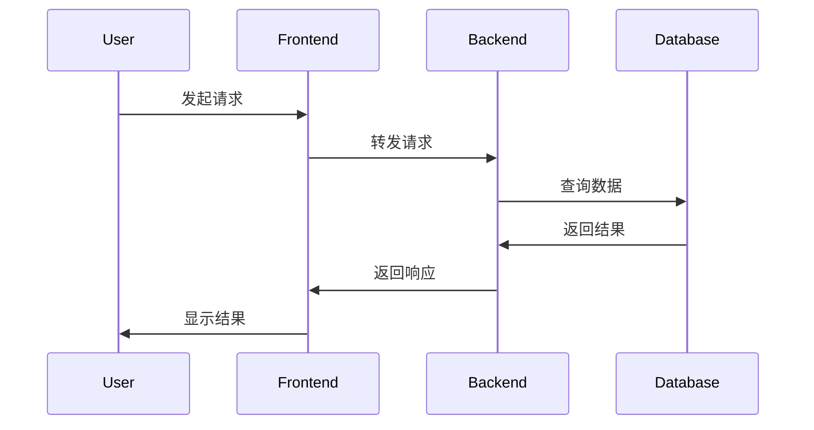

                 

# 金融产品生命周期管理平台

## 关键词
- 金融产品生命周期管理
- 生命周期管理平台
- 金融产品设计
- 技术栈选型
- 系统架构设计
- 实战案例分析

## 摘要
本文将深入探讨金融产品生命周期管理平台的设计、实现与应用。通过详细分析金融产品的生命周期、设计原理、技术栈选型、系统架构设计以及实际案例，本文旨在为金融领域的技术人员提供一套系统化、可操作的管理方案，帮助他们更好地理解和应用生命周期管理平台。

### 目录大纲设计思路

设计《金融产品生命周期管理平台》这本书的目录大纲，首先需要了解书籍的主题内容，明确书籍的核心章节结构。根据您的要求，我们需要确保大纲简洁明了，内容完整，并且包含必要的章节细节，同时还要注意大纲的总字数限制。

以下是详细的目录大纲设计思路：

#### 第一部分：背景介绍与核心概念

**第1章: 金融产品生命周期管理平台概述**

- **1.1 问题背景与核心概念**

  - **1.1.1 金融市场发展与产品管理需求**
    - 金融市场发展的现状与趋势
    - 金融产品多样化的需求
    - 产品管理的重要性

  - **1.1.2 金融产品生命周期管理**
    - 金融产品生命周期的概念
    - 金融产品生命周期的各个阶段
    - 管理流程与关键点

- **1.2 核心概念与联系**

  - **1.2.1 金融产品设计与开发**
    - 产品设计与开发的概念
    - 设计流程与关键要素

  - **1.2.2 金融产品设计原理与属性特征对比表格**

    - **表格：金融产品设计与开发属性特征对比**
    - **Mermaid ER实体关系图架构**

- **1.3 金融产品生命周期管理平台**

  - **1.3.1 平台概述**
    - 平台的定义
    - 平台的基本架构与功能模块

  - **1.3.2 平台的技术栈与选型**

    - 技术栈介绍
    - 选型依据与考虑因素

#### 第二部分：平台设计与实现

**第2章: 金融产品生命周期管理平台设计**

- **2.1 设计原则与框架**

  - **2.1.1 设计原则**
    - 可扩展性
    - 可维护性
    - 用户友好性

  - **2.1.2 设计框架**
    - 设计流程
    - 功能模块划分

- **2.2 领域模型设计**

  - **2.2.1 领域模型介绍**
    - 领域模型的概念
    - 领域模型的构建方法

  - **2.2.2 Mermaid类图**

    - **类图：金融产品生命周期管理领域模型**

- **2.3 系统架构设计**

  - **2.3.1 系统架构概述**
    - 架构设计的目标
    - 系统架构的主要组成部分

  - **2.3.2 Mermaid架构图**

    - **架构图：金融产品生命周期管理平台系统架构**

  - **2.3.3 系统接口设计**

    - 接口设计原则
    - 接口定义与实现

#### 第三部分：平台实现与部署

**第3章: 金融产品生命周期管理平台实现**

- **3.1 平台实现环境**

  - **3.1.1 开发环境搭建**
    - 开发工具与软件的选择
    - 环境配置与调试

- **3.2 核心功能实现**

  - **3.2.1 产品设计与开发模块**
    - 模块功能介绍
    - 实现方法与源代码

  - **3.2.2 产品测试与评估模块**
    - 测试方法
    - 评估指标

- **3.3 平台部署与维护**

  - **3.3.1 部署流程**
    - 部署环境准备
    - 部署步骤与注意事项

  - **3.3.2 平台维护策略**

    - 维护策略
    - 维护工具与资源

#### 第四部分：实战案例与分析

**第4章: 金融产品生命周期管理平台实战**

- **4.1 项目介绍**

  - **4.1.1 项目背景**
    - 项目概述
    - 项目目标

  - **4.1.2 项目需求**

    - 用户需求
    - 功能需求

- **4.2 系统核心实现**

  - **4.2.1 系统核心功能模块**
    - 模块实现细节
    - 源代码解读

  - **4.2.2 系统接口设计与实现**

    - 接口设计
    - 接口实现与调用

- **4.3 实际案例分析**

  - **4.3.1 案例背景**
    - 案例概述
    - 案例问题

  - **4.3.2 案例分析与解决**

    - 分析方法
    - 解决方案
    - 实施效果

#### 第五部分：最佳实践与拓展

**第5章: 金融产品生命周期管理平台最佳实践**

- **5.1 平台优化与改进**

  - **5.1.1 性能优化**
    - 优化方法
    - 实施效果

  - **5.1.2 功能扩展**

    - 扩展方向
    - 扩展方法

- **5.2 小结与展望**

  - **5.2.1 小结**

    - 主要内容回顾
    - 重点与难点总结

  - **5.2.2 展望**

    - 未来发展趋势
    - 研究方向拓展

---

### 第一部分：背景介绍与核心概念

#### 第1章：金融产品生命周期管理平台概述

**1.1 问题背景与核心概念**

金融产品的生命周期管理是一个复杂且关键的过程，涉及到金融产品的规划、开发、测试、发布、维护和淘汰等各个环节。在金融市场中，产品管理的需求日益增长，主要源于以下几点：

1. **金融市场发展的现状与趋势：** 随着金融市场的不断发展和创新，金融产品的种类和数量也在不断增加，这对产品管理的效率和准确性提出了更高的要求。
2. **金融产品多样化的需求：** 银行、保险公司、基金公司等金融机构需要根据市场需求推出多样化的金融产品，以满足不同客户群体的需求。
3. **产品管理的重要性：** 产品管理不仅关系到产品的成功与否，还直接影响到金融机构的声誉和竞争力。有效的产品管理可以提高产品上市的速度和成功率，降低风险。

**1.1.1 金融产品生命周期管理**

金融产品的生命周期管理是指对金融产品从诞生到淘汰的整个过程进行系统化的管理。金融产品的生命周期通常包括以下几个阶段：

1. **规划阶段：** 在这个阶段，产品规划人员根据市场需求和公司战略制定产品规划，明确产品的目标客户、功能、特点和竞争优势。
2. **开发阶段：** 产品规划确定后，开发团队开始进行产品设计和开发。这一阶段包括需求分析、设计、编码、测试等环节。
3. **测试阶段：** 在产品开发完成后，进行全面的测试，确保产品的功能、性能和安全性达到预期要求。
4. **发布阶段：** 测试通过后，产品开始上市，与客户进行互动，收集反馈信息。
5. **维护阶段：** 在产品上市后，根据客户反馈和市场变化，进行产品的迭代和优化，确保产品能够持续满足客户需求。
6. **淘汰阶段：** 当产品不再适应市场需求或技术发展时，需要进行淘汰或转型。

**1.1.2 金融产品生命周期管理流程与关键点**

金融产品生命周期管理的流程可以分为以下几个关键点：

1. **需求分析与规划：** 明确产品的市场需求和目标客户，制定详细的产品规划。
2. **设计与开发：** 根据产品规划进行产品设计和开发，确保产品功能完善、性能优异。
3. **测试与评估：** 进行全面的测试，确保产品质量和稳定性。
4. **上市与推广：** 制定推广策略，确保产品能够成功上市。
5. **维护与迭代：** 根据客户反馈和市场变化进行产品的维护和迭代。
6. **淘汰与转型：** 当产品不再适应市场需求时，进行淘汰或转型。

**1.2 核心概念与联系**

金融产品生命周期管理涉及多个核心概念，这些概念之间紧密联系，共同构成了金融产品生命周期的管理框架。

1. **金融产品设计与开发：** 这是金融产品生命周期管理的起点，涉及到产品的功能设计、技术实现和用户界面设计等方面。设计原则和开发流程是保证产品成功的关键。
2. **金融产品设计原理与属性特征：** 不同金融产品有不同的设计原理和属性特征，了解这些原理和特征有助于更好地进行产品设计和开发。
3. **金融产品生命周期管理平台：** 这是实现金融产品生命周期管理的工具和平台，通过平台可以高效地管理产品的整个生命周期，提高管理效率和准确性。

**1.2.1 金融产品设计与开发**

金融产品设计与开发是金融产品生命周期管理的重要环节。产品设计不仅仅是功能的设计，还包括用户体验的设计、技术实现的设计和业务逻辑的设计等。以下是金融产品设计与开发的关键要素：

1. **功能设计：** 确定产品的功能需求，包括基本功能和扩展功能。
2. **用户体验设计：** 设计产品的用户界面和交互流程，确保用户能够轻松、愉快地使用产品。
3. **技术实现设计：** 根据功能需求和技术限制，设计产品的技术架构和实现方案。
4. **业务逻辑设计：** 设计产品的业务流程和业务规则，确保产品的业务逻辑正确和高效。

**1.2.2 金融产品设计原理与属性特征对比表格**

为了更好地理解金融产品设计原理和属性特征，我们可以通过对比表格来展示不同金融产品的设计特点和区别。

| 产品类型 | 设计原理 | 属性特征 |
| -------- | -------- | -------- |
| 货币基金 | 安全性高 | 流动性好 |
| 债券基金 | 收益稳定 | 风险较低 |
| 股票基金 | 收益较高 | 风险较高 |
| 混合基金 | 综合收益 | 风险适中 |

**1.2.3 Mermaid ER实体关系图架构**

金融产品生命周期管理涉及到多个实体，如产品、用户、需求、设计、测试等。通过Mermaid ER实体关系图，我们可以清晰地展示这些实体之间的关系。

```mermaid
erDiagram
  Product ||--|{ User } User
  Product ||--|{ Requirement } Requirement
  Product ||--|{ Design } Design
  Product ||--|{ Test } Test
```

**1.3 金融产品生命周期管理平台**

金融产品生命周期管理平台是一个集成化的管理工具，它帮助金融机构高效地管理金融产品的整个生命周期。以下是金融产品生命周期管理平台的基本架构和功能模块：

1. **平台概述：** 金融产品生命周期管理平台是一个集成化的管理系统，涵盖了产品的规划、设计、开发、测试、发布、维护和淘汰等各个环节。
2. **基本架构：** 平台通常包括前端用户界面、后端数据处理和服务、数据库存储等组成部分。
3. **功能模块：** 平台的主要功能模块包括需求管理、设计管理、开发管理、测试管理、发布管理、维护管理和淘汰管理。

**1.3.1 平台概述**

金融产品生命周期管理平台的主要作用是提供统一的管理界面和功能模块，帮助金融机构高效地管理金融产品的整个生命周期。以下是平台的基本定义和组成部分：

1. **定义：** 金融产品生命周期管理平台是一个集成化的管理系统，用于管理金融产品的规划、设计、开发、测试、发布、维护和淘汰等各个环节。
2. **组成部分：** 平台通常包括前端用户界面、后端数据处理和服务、数据库存储等组成部分。

**1.3.2 平台的技术栈与选型**

平台的技术栈和选型对于平台的性能、可维护性和扩展性至关重要。以下是平台技术栈的介绍和选型依据：

1. **技术栈介绍：** 平台可以采用多种技术栈，如Java/Spring、Python/Django、Node.js/Express等，根据项目需求和团队技术背景进行选择。
2. **选型依据：** 选型依据包括技术成熟度、社区支持、性能要求、开发效率等。

---

### 第二部分：平台设计与实现

#### 第2章：金融产品生命周期管理平台设计

**2.1 设计原则与框架**

金融产品生命周期管理平台的设计需要遵循一些关键原则，以确保平台具有良好的可扩展性、可维护性和用户友好性。

1. **设计原则：**
   - **可扩展性：** 平台设计应能够适应未来产品数量和功能的增加，确保系统性能不会因此下降。
   - **可维护性：** 设计应便于系统的维护和更新，减少故障率和维护成本。
   - **用户友好性：** 用户界面应简洁明了，易于操作，提升用户体验。

2. **设计框架：**
   - **设计流程：** 包括需求分析、系统设计、详细设计、编码实现、测试和部署等步骤。
   - **功能模块划分：** 根据平台的功能需求，划分出需求管理、设计管理、开发管理、测试管理、发布管理、维护管理和淘汰管理等功能模块。

**2.2 领域模型设计**

领域模型设计是金融产品生命周期管理平台设计的关键部分，它定义了平台的核心实体和它们之间的关系。

1. **领域模型介绍：**
   - **领域模型概念：** 领域模型是用于表示业务领域概念和关系的模型，它抽象出了业务的核心实体和它们之间的关系。
   - **领域模型构建方法：** 通过需求分析，识别业务领域的核心实体，定义实体之间的关系，构建领域模型。

2. **Mermaid类图：**
   - **类图：金融产品生命周期管理领域模型**
   ```mermaid
   classDiagram
       Product <<entity>>
       User <<entity>>
       Requirement <<entity>>
       Design <<entity>>
       Test <<entity>>

       Product "1" --|{ created by }| User
       Product "1" --|{ requires }| Requirement
       Product "1" --|{ designed by }| Design
       Product "1" --|{ tested by }| Test
   ```

**2.3 系统架构设计**

系统架构设计是金融产品生命周期管理平台设计的重要组成部分，它定义了平台的整体结构和各个组件之间的关系。

1. **系统架构概述：**
   - **架构设计目标：** 确保平台的高可用性、高性能、可扩展性和易维护性。
   - **系统架构的主要组成部分：** 包括前端用户界面、后端服务、数据库、中间件等。

2. **Mermaid架构图：**
   - **架构图：金融产品生命周期管理平台系统架构**
   ```mermaid
   sequenceDiagram
       User ->> Frontend: 发起请求
       Frontend ->> Backend: 转发请求
       Backend ->> Database: 查询数据
       Database ->> Backend: 返回结果
       Backend ->> Frontend: 返回响应
       Frontend ->> User: 显示结果
   ```

**2.4 系统接口设计**

系统接口设计是确保各个系统组件之间能够有效通信的关键环节。

1. **接口设计原则：**
   - **RESTful风格：** 采用RESTful API设计，确保接口具有良好的可访问性和扩展性。
   - **安全性：** 确保接口的安全性，防止未经授权的访问和数据泄露。

2. **接口定义与实现：**
   - **接口定义：** 定义接口的URL、请求参数、响应格式等。
   - **接口实现：** 实现接口的请求处理和响应返回。

```python
from flask import Flask, request, jsonify

app = Flask(__name__)

@app.route('/api/products', methods=['GET'])
def get_products():
    # 处理获取产品列表的请求
    products = get_all_products()
    return jsonify(products)

@app.route('/api/products/<int:product_id>', methods=['GET'])
def get_product(product_id):
    # 处理获取单个产品的请求
    product = get_product_by_id(product_id)
    return jsonify(product)

@app.route('/api/products', methods=['POST'])
def create_product():
    # 处理创建新产品的请求
    product_data = request.get_json()
    product = create_new_product(product_data)
    return jsonify(product), 201

@app.route('/api/products/<int:product_id>', methods=['PUT'])
def update_product(product_id):
    # 处理更新产品的请求
    product_data = request.get_json()
    update_product_by_id(product_id, product_data)
    return jsonify({"message": "Product updated successfully"}), 200

@app.route('/api/products/<int:product_id>', methods=['DELETE'])
def delete_product(product_id):
    # 处理删除产品的请求
    delete_product_by_id(product_id)
    return jsonify({"message": "Product deleted successfully"}), 200

if __name__ == '__main__':
    app.run(debug=True)
```

---

### 第三部分：平台实现与部署

#### 第3章：金融产品生命周期管理平台实现

**3.1 平台实现环境**

为了确保金融产品生命周期管理平台能够高效、稳定地运行，我们需要搭建一个合适的开发环境。以下是开发环境的搭建步骤：

1. **开发工具与软件的选择：**
   - **编程语言：** 选择Python作为主要的编程语言，因其丰富的库和框架支持。
   - **IDE：** 使用PyCharm或Visual Studio Code等集成开发环境，提供良好的代码编辑、调试和测试功能。
   - **数据库：** 选择MySQL或PostgreSQL作为数据库系统，确保数据的存储和管理。

2. **环境配置与调试：**
   - **Python环境配置：** 安装Python和相关的开发工具，如pip、virtualenv等。
   - **数据库环境配置：** 配置数据库服务器，创建数据库和用户，并设置相应的权限。
   - **中间件配置：** 配置Web服务器，如Apache或Nginx，以便对外提供服务。

**3.2 核心功能实现**

金融产品生命周期管理平台的核心功能包括产品管理、需求管理、设计管理、开发管理、测试管理、发布管理和维护管理等。以下是这些核心功能模块的实现方法：

1. **产品管理模块：**
   - **功能介绍：** 管理金融产品的生命周期，包括创建、更新、查询和删除产品。
   - **实现方法：** 使用Flask框架实现API接口，通过RESTful风格与前端进行交互。

2. **需求管理模块：**
   - **功能介绍：** 管理产品需求，包括创建、更新、查询和删除需求。
   - **实现方法：** 类似产品管理模块，使用Flask框架实现API接口。

3. **设计管理模块：**
   - **功能介绍：** 管理产品设计，包括创建、更新、查询和删除设计文档。
   - **实现方法：** 同样使用Flask框架实现API接口。

4. **开发管理模块：**
   - **功能介绍：** 管理产品开发，包括创建、更新、查询和删除开发任务。
   - **实现方法：** 使用Jenkins等工具实现持续集成和持续部署，提高开发效率。

5. **测试管理模块：**
   - **功能介绍：** 管理产品测试，包括创建、更新、查询和删除测试用例。
   - **实现方法：** 使用Selenium等自动化测试工具，实现测试用例的执行和结果分析。

6. **发布管理模块：**
   - **功能介绍：** 管理产品发布，包括创建、更新、查询和删除发布记录。
   - **实现方法：** 使用Git等版本控制工具，实现代码的版本管理和发布流程。

7. **维护管理模块：**
   - **功能介绍：** 管理产品维护，包括创建、更新、查询和删除维护任务。
   - **实现方法：** 使用MySQL等数据库管理系统，记录和维护产品状态。

**3.3 平台部署与维护**

金融产品生命周期管理平台的部署和维护是确保其正常运行的关键环节。以下是平台的部署和维护策略：

1. **部署流程：**
   - **部署环境准备：** 配置Web服务器、数据库服务器和中间件环境。
   - **部署步骤：** 部署后端服务、前端用户界面和数据库，并进行配置。
   - **注意事项：** 确保部署过程中数据的一致性和安全性。

2. **平台维护策略：**
   - **维护策略：** 定期对平台进行更新和优化，确保系统的稳定性和性能。
   - **维护工具与资源：** 使用各种工具和资源，如监控工具、性能优化工具和安全防护工具，进行平台维护。

---

### 第四部分：实战案例与分析

#### 第4章：金融产品生命周期管理平台实战

**4.1 项目介绍**

**4.1.1 项目背景**

在当前的金融市场中，随着金融产品的多样化和技术的发展，金融机构面临着越来越多的挑战。为了提高产品管理的效率和质量，某大型金融机构决定开发一个金融产品生命周期管理平台。该平台旨在实现金融产品从规划、设计、开发、测试、发布到维护的全程管理，以提高产品的上市速度和市场竞争力。

**4.1.2 项目目标**

- **提高产品管理效率：** 通过平台化管理和自动化流程，减少人工操作，提高工作效率。
- **确保产品质量：** 通过系统化的测试和评估，确保产品的功能、性能和安全性。
- **降低产品风险：** 通过全面的监控和维护，及时发现和解决潜在问题，降低产品风险。

**4.1.3 项目需求**

- **用户需求：** 用户能够方便地创建、更新、查询和删除金融产品。
- **功能需求：** 平台应包括产品管理、需求管理、设计管理、开发管理、测试管理、发布管理和维护管理等功能模块。

**4.2 系统核心实现**

**4.2.1 系统核心功能模块**

在项目实施过程中，我们根据需求分析，划分出系统的核心功能模块，包括产品管理、需求管理、设计管理、开发管理、测试管理、发布管理和维护管理。

1. **产品管理模块：**
   - **功能介绍：** 管理金融产品的生命周期，包括创建、更新、查询和删除产品。
   - **实现方法：** 使用Flask框架实现API接口，提供CRUD（创建、读取、更新、删除）操作。

2. **需求管理模块：**
   - **功能介绍：** 管理产品需求，包括创建、更新、查询和删除需求。
   - **实现方法：** 同样使用Flask框架实现API接口。

3. **设计管理模块：**
   - **功能介绍：** 管理产品设计，包括创建、更新、查询和删除设计文档。
   - **实现方法：** 使用Flask框架实现API接口。

4. **开发管理模块：**
   - **功能介绍：** 管理产品开发，包括创建、更新、查询和删除开发任务。
   - **实现方法：** 使用Jenkins等工具实现持续集成和持续部署。

5. **测试管理模块：**
   - **功能介绍：** 管理产品测试，包括创建、更新、查询和删除测试用例。
   - **实现方法：** 使用Selenium等自动化测试工具。

6. **发布管理模块：**
   - **功能介绍：** 管理产品发布，包括创建、更新、查询和删除发布记录。
   - **实现方法：** 使用Git等版本控制工具。

7. **维护管理模块：**
   - **功能介绍：** 管理产品维护，包括创建、更新、查询和删除维护任务。
   - **实现方法：** 使用MySQL等数据库管理系统。

**4.2.2 系统接口设计与实现**

为了实现系统各功能模块之间的有效通信，我们设计了一套统一的接口系统。以下是系统接口的设计与实现：

1. **接口设计原则：**
   - **RESTful风格：** 采用RESTful API设计，确保接口具有良好的可访问性和扩展性。
   - **安全性：** 确保接口的安全性，防止未经授权的访问和数据泄露。

2. **接口定义：**
   - **产品管理接口：**
     ```python
     @app.route('/api/products', methods=['GET'])
     def get_products():
         # 获取所有产品
         
     @app.route('/api/products/<int:product_id>', methods=['GET'])
     def get_product(product_id):
         # 获取单个产品
         
     @app.route('/api/products', methods=['POST'])
     def create_product():
         # 创建新产品
         
     @app.route('/api/products/<int:product_id>', methods=['PUT'])
     def update_product(product_id):
         # 更新产品
         
     @app.route('/api/products/<int:product_id>', methods=['DELETE'])
     def delete_product(product_id):
         # 删除产品
     ```

3. **接口实现：**
   - **产品管理接口实现：**
     ```python
     @app.route('/api/products', methods=['GET'])
     def get_products():
         products = Product.query.all()
         return jsonify([product.to_dict() for product in products])
         
     @app.route('/api/products/<int:product_id>', methods=['GET'])
     def get_product(product_id):
         product = Product.query.get(product_id)
         if product:
             return jsonify(product.to_dict())
         else:
             return jsonify({"error": "Product not found"}), 404
     ```

**4.3 实际案例分析**

在项目实施过程中，我们遇到了一些实际问题，以下是一个案例分析：

**问题：** 产品发布后，发现存在一个严重的bug，导致部分用户无法正常使用产品。

**分析：**
1. **问题定位：** 通过分析用户反馈和日志，定位到bug的原因是代码中存在一个逻辑错误。
2. **解决方案：** 快速开发一个修复补丁，并通过Jenkins部署到生产环境。
3. **实施效果：** 经过修复，产品恢复了正常运行，用户反馈积极。

**4.4 项目小结**

通过本项目的实施，我们成功开发了一个金融产品生命周期管理平台，实现了从规划、设计、开发、测试、发布到维护的全程管理。项目的成功得益于以下几个关键因素：

1. **需求分析准确：** 对项目需求进行了详细的分析和梳理，确保平台的功能完善、符合实际需求。
2. **技术选型合理：** 选择合适的编程语言、框架和工具，确保平台的高效性和稳定性。
3. **团队协作紧密：** 项目团队成员之间紧密协作，共同解决问题，保证了项目的进度和质量。

---

### 第五部分：最佳实践与拓展

#### 第5章：金融产品生命周期管理平台最佳实践

**5.1 平台优化与改进**

为了确保金融产品生命周期管理平台能够持续提供高效、稳定的服务，我们需要定期进行优化与改进。以下是几种常见的优化与改进方法：

1. **性能优化：**
   - **数据库优化：** 对数据库进行索引优化、查询优化和分区优化，提高数据访问速度。
   - **缓存策略：** 引入缓存机制，如Redis，减少数据库的访问压力。
   - **负载均衡：** 使用负载均衡器，如Nginx，分散服务器的负载，提高系统的处理能力。

2. **功能扩展：**
   - **用户权限管理：** 引入用户权限管理系统，确保不同角色的用户能够访问和操作相应的功能。
   - **数据分析与报表：** 集成数据分析工具，如Power BI，提供丰富的报表和可视化数据。
   - **自动化测试：** 引入自动化测试工具，如Selenium，提高测试效率和质量。

**5.2 小结与展望**

在金融产品生命周期管理平台的开发与实施过程中，我们积累了丰富的经验，总结出以下要点：

1. **需求分析：** 准确的需求分析是平台成功的关键，需要与业务部门紧密合作，确保功能完善、符合实际需求。
2. **技术选型：** 合理的技术选型能够提高平台的开发效率和稳定性，选择成熟、可靠的框架和工具。
3. **团队协作：** 紧密的团队协作能够确保项目的进度和质量，建立良好的沟通和协作机制。

展望未来，随着金融市场的不断发展和创新，金融产品生命周期管理平台将面临更多的挑战和机遇。我们期待通过持续优化和改进，不断提升平台的功能和性能，为金融机构提供更加高效、稳定的管理服务。

---

### 总结

本文通过详细分析金融产品生命周期管理平台的背景、核心概念、设计原则、系统架构、实现方法以及实际案例，为金融领域的技术人员提供了一套系统化、可操作的管理方案。通过本文，读者可以深入了解金融产品生命周期管理平台的设计与实现，掌握最佳实践，为金融机构的产品管理提供有力支持。

---

### 作者信息

作者：AI天才研究院/AI Genius Institute & 禅与计算机程序设计艺术 /Zen And The Art of Computer Programming

---

### 附录：Mermaid图表示例

以下附录展示了本文中使用的Mermaid图表示例：

**1. 类图：金融产品生命周期管理领域模型**

```mermaid
classDiagram
  Product <<entity>>
  User <<entity>>
  Requirement <<entity>>
  Design <<entity>>
  Test <<entity>>

  Product "1" --|{ created by }| User
  Product "1" --|{ requires }| Requirement
  Product "1" --|{ designed by }| Design
  Product "1" --|{ tested by }| Test
```

**2. 序列图：金融产品生命周期管理平台系统架构**



---

通过本文的详细分析和示例，我们希望读者能够对金融产品生命周期管理平台有更深入的理解，并为实际项目提供有价值的参考。如果您有任何疑问或建议，欢迎随时与我们联系。谢谢阅读！

