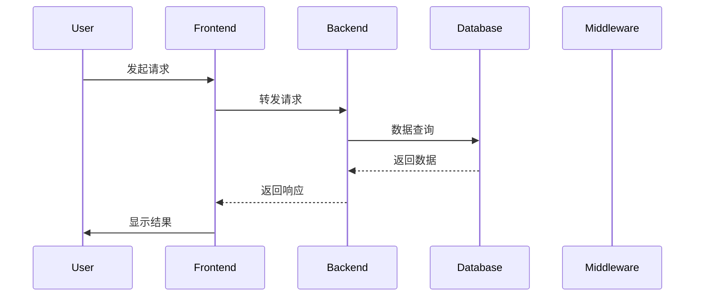
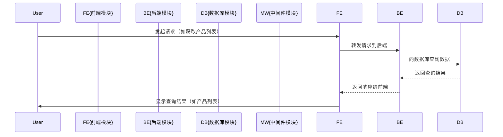

                 

### 第一部分：引言

#### 引言

**金融产品生命周期管理自动化系统** 是现代金融领域中一项重要的技术进步，它通过信息技术的手段，系统化、自动化地管理金融产品的整个生命周期。从产品设计的初始阶段到上市推广，再到产品退役的各个阶段，自动化系统都能提供有效的支持。本文旨在深入探讨这一系统的构建、运行机制以及它在金融行业的应用，旨在为相关领域的从业者和技术人员提供有价值的参考和指导。

#### 核心关键词

- 金融产品生命周期管理
- 自动化系统
- 信息技术
- 金融行业应用

#### 摘要

本文首先对金融产品生命周期管理自动化系统进行了概述，阐述了其背景、研究目的与意义，并明确了系统的边界与外延。接着，文章详细介绍了金融产品生命周期管理的基本概念，包括金融产品的定义与分类、产品生命周期概述以及管理的重要性。随后，文章从需求分析入手，探讨了系统的功能需求与非功能需求，为系统设计提供了基础。本文的核心部分是系统设计与实现，包括系统架构设计、数据库设计以及核心功能模块的设计，并通过Mermaid语法展示了系统架构图和ER图。在系统实现与算法原理讲解章节，文章详细阐述了数据处理与算法原理，并通过Python源代码示例和数学模型与公式，使复杂的概念变得通俗易懂。最后，文章通过实际案例展示了系统在项目中的应用，并提出了系统优化与最佳实践的建议。

### 第1章：金融产品生命周期管理自动化系统概述

#### 1.1.1 问题背景

在金融行业中，金融产品的种类繁多，包括股票、债券、基金、保险等。这些金融产品的生命周期通常较长，从产品设计的初始阶段到上市推广，再到产品的成熟期、衰退期和最终退役，各个环节都需要进行精细化管理。然而，传统的金融产品生命周期管理往往依赖于手工操作和纸质记录，这不仅效率低下，而且容易出错，难以满足现代金融业务对速度和准确性的要求。

随着信息技术的快速发展，尤其是大数据、云计算、人工智能等技术的广泛应用，自动化系统在金融领域的应用需求日益迫切。金融产品生命周期管理自动化系统应运而生，通过集成多种技术手段，实现对金融产品生命周期的全面监控和管理，提高工作效率，降低风险。

#### 1.1.2 研究目的与意义

本研究旨在探讨金融产品生命周期管理自动化系统的构建方法、运行机制及其在金融行业中的应用效果。具体研究目的包括：

1. **明确系统需求**：分析金融行业在产品生命周期管理方面的具体需求，为系统设计提供依据。
2. **系统架构设计**：研究并设计一个高效、稳定的金融产品生命周期管理自动化系统架构。
3. **算法原理讲解**：详细阐述系统中的数据处理和算法原理，提高系统的智能化水平。
4. **实际案例分析**：通过具体案例展示系统在实际项目中的应用，验证系统的实用性和效果。

研究金融产品生命周期管理自动化系统具有重要的现实意义：

1. **提高管理效率**：通过自动化系统，可以实现金融产品生命周期各阶段的自动化操作，大幅提高管理效率。
2. **降低管理成本**：自动化系统减少了人力投入，降低了管理成本。
3. **降低管理风险**：自动化系统能够精确监控和管理金融产品生命周期，降低人为操作错误带来的风险。
4. **提升用户体验**：自动化系统能够为金融客户提供更快速、准确的服务，提升用户体验。

#### 1.1.3 系统边界与外延

金融产品生命周期管理自动化系统的边界主要涉及产品生命周期的各个阶段，包括产品设计、上市推广、销售、售后管理以及产品退役。具体而言，系统的边界包括：

1. **产品设计阶段**：涉及产品设计方案的生成、优化以及风险评估。
2. **上市推广阶段**：涉及产品市场定位、营销策略制定以及市场推广。
3. **销售阶段**：涉及产品销售渠道管理、销售数据分析以及客户关系管理。
4. **售后管理阶段**：涉及售后服务、客户反馈收集以及产品改进。
5. **产品退役阶段**：涉及产品淘汰、资产处置以及客户权益保障。

系统的外延则包括：

1. **系统集成**：与其他金融信息系统（如客户关系管理CRM系统、供应链管理系统等）的集成，实现信息共享和流程协同。
2. **跨部门协作**：支持跨部门的数据共享和业务协作，提高整体工作效率。
3. **合规性**：确保系统运行符合相关金融法规和标准，保障系统的合法性和合规性。

#### 1.1.4 本书结构

本书结构共分为七个章节，具体如下：

- **第一章：引言**：介绍金融产品生命周期管理自动化系统的背景、研究目的与意义，明确系统的边界与外延。
- **第二章：金融产品生命周期管理基本概念**：阐述金融产品的定义与分类、产品生命周期概述以及管理的重要性。
- **第三章：金融产品生命周期管理自动化系统的需求分析**：分析系统功能需求与非功能需求，为系统设计提供基础。
- **第四章：金融产品生命周期管理自动化系统的设计与实现**：介绍系统架构设计、数据库设计以及核心功能模块设计。
- **第五章：系统实现与算法原理讲解**：详细阐述数据处理与算法原理，并通过Python源代码示例和数学模型与公式进行讲解。
- **第六章：系统实战与案例分析**：通过实际案例展示系统在项目中的应用，并进行分析和讲解。
- **第七章：系统优化与最佳实践**：提出系统优化和最佳实践的建议，包括性能优化、安全性与合规性等方面。

通过以上章节的安排，本书旨在系统性地介绍金融产品生命周期管理自动化系统的构建方法和应用实践，为相关领域的研究和实际工作提供参考。

### 第2章：金融产品生命周期管理基本概念

#### 2.1.1 金融产品的定义与分类

金融产品是指通过金融手段和工具进行交易、投资和管理的各种资产和权益。它们是金融市场的重要组成部分，能够满足不同投资者和融资者的需求。金融产品可以大致分为以下几类：

1. **股票**：股票是公司为筹集资本而发行的有价证券，代表股东对公司的所有权。股票市场是金融市场中最为活跃的部分之一，投资者可以通过购买股票来分享公司的盈利。
2. **债券**：债券是政府、企业或其他机构为筹集资金而发行的债务凭证，承诺在一定期限内按约定的利率支付利息并偿还本金。债券市场相对稳定，风险较低，是投资者重要的资产配置选择。
3. **基金**：基金是一种集合投资方式，由众多投资者共同出资，由专业基金经理进行投资管理，投资范围包括股票、债券、货币市场等多种资产。基金具有分散风险、专业管理的特点，适合广大投资者。
4. **保险**：保险是一种风险管理工具，通过缴纳保费，保险公司承诺在被保险人发生合同约定的事故或事件时，向其支付一定金额的赔偿。保险产品包括人寿保险、健康保险、财产保险等，能够为个人和企业提供风险保障。
5. **衍生品**：衍生品是基于基础资产（如股票、债券、商品等）合约而衍生出的金融产品，包括期权、期货、掉期等。衍生品市场具有较高的风险和杠杆效应，适用于专业的投资者。

#### 2.1.2 产品生命周期概述

金融产品的生命周期通常包括以下几个阶段：

1. **设计阶段**：这是金融产品的初始阶段，主要包括产品概念的产生、设计、可行性研究等。在这一阶段，需要明确产品的目标市场、预期收益、潜在风险等。
2. **上市推广阶段**：设计完成后，产品进入市场推广阶段。这一阶段的主要任务是制定营销策略、发布广告、开展市场调研等，以吸引投资者。
3. **销售阶段**：产品成功上市后，进入销售阶段。在这一阶段，销售人员需要通过多种渠道（如线上、线下）推广产品，与投资者进行沟通，解答疑问，促成交易。
4. **成熟期**：产品在市场上逐渐被投资者接受，销售量稳定增长，进入成熟期。在这一阶段，产品需要保持竞争力的同时，注重客户关系管理，提供优质的售后服务。
5. **衰退期**：随着市场环境的变化和竞争加剧，产品销售量逐渐下降，进入衰退期。在这一阶段，企业需要评估产品的市场表现，考虑是否进行产品改进或退出市场。
6. **退役阶段**：产品最终退役，退出市场。在这一阶段，企业需要妥善处理产品的后续事宜，如资产清算、客户权益保障等。

#### 2.1.3 金融产品生命周期管理的重要性

金融产品生命周期管理在金融行业中具有至关重要的地位，主要体现在以下几个方面：

1. **提高管理效率**：通过系统化、自动化的方式管理金融产品生命周期，可以大幅提高管理效率，减少手工操作的错误和重复劳动。
2. **降低运营成本**：自动化系统能够减少人力成本，提高资源利用率，降低运营成本。
3. **提升用户体验**：自动化系统能够为投资者提供更快捷、准确的服务，提升用户体验，增强客户满意度。
4. **风险控制**：通过实时监控和分析产品生命周期各阶段的数据，可以及时发现潜在风险，采取有效措施进行风险控制，降低运营风险。
5. **合规性保障**：自动化系统能够确保金融产品生命周期管理的合法性和合规性，遵守相关法规和标准，避免违规操作带来的法律风险。

#### 2.1.4 产品生命周期管理的核心要素

金融产品生命周期管理涉及多个核心要素，这些要素相互作用，共同构成了完整的生命周期管理框架：

1. **产品设计**：产品的设计和开发是生命周期管理的起点，需要充分考虑市场需求、技术可行性、潜在风险等因素。
2. **市场推广**：市场推广是产品能否成功上市的关键，需要制定有效的营销策略，通过各种渠道进行产品宣传。
3. **销售管理**：销售管理包括销售渠道的选择、销售策略的制定、销售团队的培训等，是确保产品成功销售的重要环节。
4. **售后服务**：售后服务是维护客户关系的重要手段，需要提供优质的售后服务，及时解决客户问题，增强客户忠诚度。
5. **风险评估**：风险评估是产品生命周期管理的重要组成部分，需要对产品的市场表现、财务状况、风险因素进行全面评估。
6. **合规性管理**：合规性管理是确保产品生命周期管理合法合规的关键，需要严格遵守相关法规和标准，防范法律风险。
7. **数据管理**：数据管理是自动化系统的核心，需要建立完善的数据管理体系，确保数据的准确性、完整性和安全性。

通过对这些核心要素的有效管理，可以确保金融产品在整个生命周期内实现高效、稳定、合规的运营，为金融机构创造更大的价值。

### 第3章：金融产品生命周期管理自动化系统的需求分析

#### 3.1.1 用户需求分析

在金融产品生命周期管理自动化系统的开发过程中，了解用户的实际需求是至关重要的一步。用户需求的分析可以分为以下几个方面：

1. **高效性**：用户希望系统能够快速响应各种操作需求，从产品设计到市场推广、销售管理、售后服务等各个环节都能实现高效的处理和自动化操作，减少手工操作的时间和错误率。
2. **准确性**：系统的数据采集和处理需要高度准确，确保金融产品生命周期的每一个环节都能实时、准确地反映实际情况，以便管理层做出正确的决策。
3. **灵活性**：系统需要具备一定的灵活性，能够适应不同金融机构的业务模式和管理需求，支持自定义的报表、流程和规则。
4. **安全性**：用户对系统的安全性有很高的要求，系统需要能够保护敏感数据不被非法访问和篡改，同时确保系统的稳定性和可靠性，避免因系统故障造成的数据丢失或业务中断。
5. **易用性**：系统界面和操作流程需要简洁直观，用户能够快速上手，减少培训成本和操作错误。
6. **扩展性**：系统需要具备良好的扩展性，能够方便地集成新的功能和模块，满足未来业务发展的需求。

#### 3.1.2 功能需求

根据用户需求分析，金融产品生命周期管理自动化系统的功能需求主要包括以下几个方面：

1. **产品设计管理**：支持金融产品的设计、审核和发布，包括产品规格、费用结构、投资策略等，并提供历史版本管理功能。
2. **市场推广管理**：提供市场推广策略的制定、执行和监控，支持广告投放、市场活动管理和市场反馈收集。
3. **销售管理**：支持销售渠道管理、销售任务分配、销售数据分析、客户关系管理，并提供销售预测和业绩评估功能。
4. **售后服务管理**：提供售后服务流程管理、客户投诉处理、客户满意度调查和售后数据分析，确保客户服务的质量和效率。
5. **风险评估管理**：提供风险评估模型的构建、风险预警和监控，确保及时发现和应对潜在风险。
6. **合规性管理**：支持合规性检查、合规性报告生成和合规性审计，确保系统运行符合相关法规和标准。
7. **数据集成与报表**：支持与其他金融信息系统（如CRM、ERP等）的数据集成，提供丰富的报表和数据分析功能，便于管理层实时掌握业务情况。
8. **用户权限管理**：支持用户权限的分级管理和操作日志记录，确保系统的安全和审计需求。

#### 3.1.3 非功能需求

除了功能需求之外，金融产品生命周期管理自动化系统还必须满足一系列非功能需求，这些需求对系统的性能、安全性、可维护性等方面至关重要：

1. **性能**：系统需要能够高效处理大量的数据和操作请求，确保响应速度和稳定性。
2. **可扩展性**：系统设计需要支持模块化和组件化，方便后续功能的扩展和升级。
3. **安全性**：系统需要具备完善的安全机制，包括用户认证、数据加密、访问控制等，确保系统的数据安全。
4. **兼容性**：系统需要支持多种操作系统、数据库和编程语言，确保在不同环境下都能正常运行。
5. **可维护性**：系统需要设计简洁、代码规范，便于后续的维护和升级。
6. **可用性**：系统界面和操作流程需要设计得简洁直观，便于用户快速学习和使用。
7. **合规性**：系统需要符合相关金融法规和行业标准，确保系统运行符合合规要求。

通过详细的需求分析，可以确保金融产品生命周期管理自动化系统的设计满足用户需求，同时具备良好的性能、安全性和扩展性，为金融机构提供可靠的运营支持。

### 第4章：金融产品生命周期管理自动化系统的设计与实现

#### 4.1.1 系统架构设计

金融产品生命周期管理自动化系统的设计首先需要构建一个清晰、高效的系统架构，以确保系统的可扩展性、稳定性和安全性。系统架构设计主要包括以下几个方面：

1. **技术栈选择**：
   - **前端**：采用React或Vue.js等现代前端框架，实现响应式界面和交互式体验。
   - **后端**：使用Spring Boot或Django等框架，构建RESTful API，支持高并发和数据持久化。
   - **数据库**：采用MySQL或PostgreSQL等关系型数据库，确保数据的存储和查询效率。
   - **中间件**：使用Kafka或RabbitMQ等消息队列，实现系统的异步通信和数据流处理。
   - **缓存**：采用Redis等缓存系统，提升系统响应速度。

2. **架构设计**：
   - **分层架构**：系统采用三层架构，包括表示层、业务逻辑层和数据访问层，实现模块化设计和松耦合。
   - **微服务架构**：将系统功能划分为多个微服务，每个微服务负责特定的业务功能，独立部署和扩展，提高系统的灵活性和可维护性。

3. **模块划分**：
   - **产品信息管理模块**：负责金融产品的信息录入、修改和查询，包括产品规格、费用结构、投资策略等。
   - **市场推广管理模块**：负责市场推广策略的制定、执行和监控，包括广告投放、市场活动管理、市场反馈收集等。
   - **销售管理模块**：负责销售渠道管理、销售任务分配、销售数据分析、客户关系管理等。
   - **售后服务管理模块**：负责售后服务流程管理、客户投诉处理、客户满意度调查和售后数据分析。
   - **风险评估管理模块**：负责风险评估模型的构建、风险预警和监控，确保及时发现和应对潜在风险。
   - **合规性管理模块**：负责合规性检查、合规性报告生成和合规性审计，确保系统运行符合相关法规和标准。
   - **数据集成与报表模块**：负责与其他金融信息系统（如CRM、ERP等）的数据集成，提供丰富的报表和数据分析功能。

4. **数据流**：
   - **用户交互**：用户通过前端界面发起操作请求，后端处理请求并返回结果。
   - **数据处理**：后端服务将请求处理结果存储到数据库，或通过消息队列传递给其他服务进行进一步处理。
   - **数据查询**：前端通过API请求后端获取数据，进行展示和分析。

#### 4.1.2 数据库设计

数据库设计是系统实现的重要环节，合理的数据库设计能够提高系统的性能和可维护性。以下是系统数据库设计的主要组成部分：

1. **实体关系图（ER图）**：
   - **用户表**：存储用户信息，包括用户ID、姓名、角色等。
   - **产品表**：存储金融产品信息，包括产品ID、名称、类别、规格等。
   - **市场推广表**：存储市场推广活动信息，包括活动ID、名称、时间、费用等。
   - **销售记录表**：存储销售记录，包括销售ID、产品ID、销售渠道、销售时间、销售额等。
   - **售后记录表**：存储售后服务记录，包括投诉ID、客户ID、投诉内容、处理时间等。
   - **风险评估表**：存储风险评估结果，包括风险评估ID、产品ID、风险等级、预警措施等。
   - **合规性记录表**：存储合规性检查记录，包括合规性检查ID、检查时间、检查结果等。

2. **数据表设计**：
   - **用户表**：
     ```sql
     CREATE TABLE users (
       user_id INT PRIMARY KEY AUTO_INCREMENT,
       name VARCHAR(255) NOT NULL,
       role VARCHAR(255) NOT NULL
     );
     ```
   - **产品表**：
     ```sql
     CREATE TABLE products (
       product_id INT PRIMARY KEY AUTO_INCREMENT,
       name VARCHAR(255) NOT NULL,
       category VARCHAR(255) NOT NULL,
       specification VARCHAR(255) NOT NULL
     );
     ```
   - **市场推广表**：
     ```sql
     CREATE TABLE marketing_activities (
       activity_id INT PRIMARY KEY AUTO_INCREMENT,
       name VARCHAR(255) NOT NULL,
       start_time DATETIME NOT NULL,
       end_time DATETIME NOT NULL,
       cost DECIMAL(10, 2) NOT NULL
     );
     ```
   - **销售记录表**：
     ```sql
     CREATE TABLE sales_records (
       sales_id INT PRIMARY KEY AUTO_INCREMENT,
       product_id INT NOT NULL,
       channel VARCHAR(255) NOT NULL,
       sales_time DATETIME NOT NULL,
       sales_amount DECIMAL(10, 2) NOT NULL,
       FOREIGN KEY (product_id) REFERENCES products(product_id)
     );
     ```
   - **售后记录表**：
     ```sql
     CREATE TABLE service_records (
       complaint_id INT PRIMARY KEY AUTO_INCREMENT,
       customer_id INT NOT NULL,
       complaint_content TEXT NOT NULL,
       handle_time DATETIME NOT NULL,
       FOREIGN KEY (customer_id) REFERENCES customers(customer_id)
     );
     ```
   - **风险评估表**：
     ```sql
     CREATE TABLE risk_assessments (
       assessment_id INT PRIMARY KEY AUTO_INCREMENT,
       product_id INT NOT NULL,
       risk_level VARCHAR(255) NOT NULL,
       warning_measures TEXT NOT NULL,
       FOREIGN KEY (product_id) REFERENCES products(product_id)
     );
     ```
   - **合规性记录表**：
     ```sql
     CREATE TABLE compliance_records (
       compliance_id INT PRIMARY KEY AUTO_INCREMENT,
       check_time DATETIME NOT NULL,
       check_result VARCHAR(255) NOT NULL
     );
     ```

3. **索引设计**：
   - 为了提高查询效率，对高频查询的字段（如产品名称、销售时间、投诉时间等）建立索引。

#### 4.1.3 系统核心功能模块设计

系统核心功能模块的设计是实现系统功能的关键，以下是各个核心功能模块的详细介绍：

1. **产品信息管理模块**：
   - **功能**：支持金融产品的信息录入、修改和查询，包括产品规格、费用结构、投资策略等。
   - **操作流程**：
     - 用户在产品信息管理界面录入产品信息。
     - 后端验证信息完整性，如产品名称、类别、规格等。
     - 通过数据库存储产品信息，并返回操作结果。
   - **技术实现**：前端采用表单组件收集用户输入，后端使用RESTful API处理业务逻辑。

2. **市场推广管理模块**：
   - **功能**：支持市场推广策略的制定、执行和监控，包括广告投放、市场活动管理、市场反馈收集等。
   - **操作流程**：
     - 用户在市场推广管理界面制定推广策略。
     - 后端处理推广策略，包括设置推广时间、费用等。
     - 系统根据推广策略自动执行市场活动，如广告投放。
     - 收集市场反馈数据，并进行分析和报告。
   - **技术实现**：前端使用图表库展示推广效果，后端通过定时任务和消息队列实现自动化执行。

3. **销售管理模块**：
   - **功能**：支持销售渠道管理、销售任务分配、销售数据分析、客户关系管理等。
   - **操作流程**：
     - 用户在销售管理界面分配销售任务。
     - 系统根据任务分配销售资源，如销售代表、销售渠道。
     - 收集销售数据，如销售额、客户反馈等，进行分析和报告。
   - **技术实现**：前端使用数据表格展示销售数据，后端通过API提供数据接口。

4. **售后服务管理模块**：
   - **功能**：支持售后服务流程管理、客户投诉处理、客户满意度调查和售后数据分析。
   - **操作流程**：
     - 用户在售后服务界面处理客户投诉。
     - 系统记录投诉信息，并分配给相应的售后服务人员处理。
     - 处理完毕后，收集客户满意度数据，并进行分析和报告。
   - **技术实现**：前端使用表单处理投诉，后端通过工作流引擎实现投诉处理流程。

5. **风险评估管理模块**：
   - **功能**：支持风险评估模型的构建、风险预警和监控，确保及时发现和应对潜在风险。
   - **操作流程**：
     - 用户在风险评估管理界面构建风险模型。
     - 系统根据风险模型进行风险评估，生成风险报告。
     - 风险预警，提醒相关人员进行风险应对。
   - **技术实现**：前端使用图表展示风险评估结果，后端通过机器学习算法实现风险评估。

6. **合规性管理模块**：
   - **功能**：支持合规性检查、合规性报告生成和合规性审计，确保系统运行符合相关法规和标准。
   - **操作流程**：
     - 用户在合规性管理界面进行合规性检查。
     - 系统生成合规性报告，并存储在数据库中。
     - 定期进行合规性审计，确保系统符合法规要求。
   - **技术实现**：前端使用表单进行合规性检查，后端通过规则引擎实现合规性检查。

7. **数据集成与报表模块**：
   - **功能**：支持与其他金融信息系统（如CRM、ERP等）的数据集成，提供丰富的报表和数据分析功能。
   - **操作流程**：
     - 系统通过API与其他系统进行数据交换。
     - 数据集成后，生成各种报表和数据分析结果。
   - **技术实现**：使用ETL工具进行数据集成，前端使用图表库展示数据分析结果。

通过以上核心功能模块的设计和实现，金融产品生命周期管理自动化系统能够有效地支持金融机构对金融产品的全生命周期管理，提高管理效率，降低风险，提升用户体验。

#### 4.1.4 系统架构图

为了更好地展示金融产品生命周期管理自动化系统的整体架构，我们使用Mermaid语法绘制了系统架构图。以下为系统架构图的Mermaid代码：

```mermaid
graph TD
    subgraph Frontend
        FE[Frontend]
        FE -->|REST API| Backend
        FE -->|Data Integration| Data Integration
    end

    subgraph Backend
        BE[Backend]
        BE -->|Authentication| User Management
        BE -->|Product Management| Product Management
        BE -->|Marketing Management| Marketing Management
        BE -->|Sales Management| Sales Management
        BE -->|Service Management| Service Management
        BE -->|Risk Management| Risk Management
        BE -->|Compliance Management| Compliance Management
        BE -->|Data Analysis| Data Analysis
    end

    subgraph Data Storage
        DS[Data Storage]
        DS -->|Database| Database
        DS -->|Cache| Cache
    end

    subgraph Middleware
        MW[Middle
``` 

通过Mermaid语法绘制的系统架构图如下：

```mermaid
graph TD
    subgraph 前端模块(Frontend)
        FE[前端模块]
        FE -->|REST API| 后端模块(Backend)
        FE -->|数据集成| 数据集成模块(Data Integration)
    end

    subgraph 后端模块(Backend)
        BE[后端模块]
        BE -->|认证| 用户管理(User Management)
        BE -->|产品管理(Product Management)
        BE -->|市场管理(Marketing Management)
        BE -->|销售管理(Sales Management)
        BE -->|售后服务(Service Management)
        BE -->|风险管理(Risk Management)
        BE -->|合规管理(Compliance Management)
        BE -->|数据分析(Data Analysis)
    end

    subgraph 数据存储模块(Data Storage)
        DS[数据存储模块]
        DS -->|数据库(Database)
        DS -->|缓存(Cache)
    end

    subgraph 中间件(Middleware)
        MW[中间件]
        MW -->|Kafka| 后端模块(Backend)
    end

    FE -->|数据存储| DS
    MW -->|数据流| BE
    BE -->|数据存储| DS
```

该系统架构图清晰地展示了前端模块、后端模块、数据存储模块和中间件之间的关系，为系统的实现提供了直观的参考。

#### 4.1.5 系统接口设计

系统接口设计是金融产品生命周期管理自动化系统的关键部分，它定义了系统内部模块之间的通信规则和方式。以下是系统接口设计的详细说明：

1. **接口类型**：
   - **RESTful API**：系统主要采用RESTful API设计，提供统一的接口规范，便于前后端分离和模块化开发。
   - **Websocket**：部分实时性要求较高的功能（如实时风险预警、实时销售数据更新等）采用Websocket进行通信。

2. **接口规范**：
   - **URL结构**：接口URL采用RESTful风格，如 `/api/products/` 用于操作产品信息。
   - **HTTP方法**：根据操作类型，使用相应的HTTP方法（GET、POST、PUT、DELETE等）。
   - **请求参数**：请求参数通过URL或请求体（JSON格式）传递，遵循标准数据格式（如JSON、XML等）。

3. **接口定义**：

   - **产品管理接口**：
     - **获取产品列表**：`GET /api/products/`，返回产品列表。
     - **获取单个产品信息**：`GET /api/products/{id}`，返回单个产品详细信息。
     - **创建新产品**：`POST /api/products/`，提交产品信息。
     - **更新产品信息**：`PUT /api/products/{id}`，更新指定产品信息。
     - **删除产品**：`DELETE /api/products/{id}`，删除指定产品。

   - **销售管理接口**：
     - **获取销售记录**：`GET /api/sales/`，返回销售记录列表。
     - **获取单个销售记录**：`GET /api/sales/{id}`，返回指定销售记录详细信息。
     - **创建销售记录**：`POST /api/sales/`，提交销售记录。
     - **更新销售记录**：`PUT /api/sales/{id}`，更新指定销售记录。
     - **删除销售记录**：`DELETE /api/sales/{id}`，删除指定销售记录。

   - **市场推广管理接口**：
     - **获取市场推广活动列表**：`GET /api/marketing/`，返回市场推广活动列表。
     - **获取单个市场推广活动**：`GET /api/marketing/{id}`，返回指定市场推广活动详细信息。
     - **创建市场推广活动**：`POST /api/marketing/`，提交市场推广活动信息。
     - **更新市场推广活动**：`PUT /api/marketing/{id}`，更新指定市场推广活动。
     - **删除市场推广活动**：`DELETE /api/marketing/{id}`，删除指定市场推广活动。

   - **售后服务管理接口**：
     - **获取售后服务记录列表**：`GET /api/service/`，返回售后服务记录列表。
     - **获取单个售后服务记录**：`GET /api/service/{id}`，返回指定售后服务记录详细信息。
     - **创建售后服务记录**：`POST /api/service/`，提交售后服务记录。
     - **更新售后服务记录**：`PUT /api/service/{id}`，更新指定售后服务记录。
     - **删除售后服务记录**：`DELETE /api/service/{id}`，删除指定售后服务记录。

4. **安全性考虑**：
   - **认证与授权**：系统接口需要实现用户认证和授权机制，确保只有合法用户才能访问相应接口。
   - **API安全**：接口需进行签名验证、频率限制和黑名单策略等安全措施，防止攻击和数据泄露。
   - **数据加密**：敏感数据（如用户密码、交易记录等）需要进行加密存储和传输。

通过科学的接口设计，金融产品生命周期管理自动化系统能够提供稳定、安全、高效的接口服务，支持系统内部各模块之间的紧密协作和外部系统的集成。

#### 4.1.6 系统交互流程

为了更好地理解金融产品生命周期管理自动化系统的交互流程，我们可以通过Mermaid语法绘制系统交互序列图，以下为系统的交互流程图：



通过Mermaid语法绘制的系统交互流程图如下：



该交互流程图展示了用户发起请求、前端转发请求、后端查询数据库、后端返回响应、前端展示结果的全过程，清晰地说明了系统内部各模块的交互逻辑和协作方式。

### 第5章：系统实现与算法原理讲解

#### 5.1.1 环境配置与安装

在实现金融产品生命周期管理自动化系统之前，首先需要配置和安装开发环境。以下是具体步骤：

1. **硬件要求**：
   - 电脑：建议使用配置较高的电脑，以支持系统的高并发处理和大数据存储。
   - 操作系统：Windows、Linux或macOS均可。

2. **软件要求**：
   - **前端开发工具**：Node.js、npm或Yarn。
   - **后端开发工具**：Java（Spring Boot）、Python（Django或Flask）等。
   - **数据库**：MySQL、PostgreSQL等。
   - **消息队列**：Kafka、RabbitMQ等。

3. **安装步骤**：

   - **安装Node.js**：
     ```bash
     # 使用npm安装Node.js
     npm install -g node
     ```

   - **安装MySQL**：
     - 下载并安装MySQL数据库：[MySQL官网](https://www.mysql.com/)
     - 配置MySQL，设置root用户密码。

   - **安装Python开发环境**：
     ```bash
     # 使用pip安装Python和相关的库
     pip install flask
     ```

   - **安装Kafka**：
     - 下载并安装Kafka：[Apache Kafka官网](https://kafka.apache.org/)
     - 配置Kafka，启动Kafka服务。

4. **配置数据库连接**：
   - 在后端代码中，配置数据库连接信息，如数据库地址、用户名和密码。
   - 使用相应的ORM库（如Hibernate、SQLAlchemy）进行数据库操作。

5. **配置消息队列**：
   - 在后端代码中，配置Kafka的消费者和生成者，实现消息的发送和接收。

通过以上步骤，可以完成金融产品生命周期管理自动化系统的环境配置和安装，为后续的开发和实现打下基础。

#### 5.1.2 数据处理与算法原理

在金融产品生命周期管理自动化系统中，数据处理和算法原理是核心部分，直接影响系统的性能和准确性。以下是系统数据处理和算法原理的详细介绍：

1. **数据处理流程**：

   - **数据采集**：系统通过API接口从金融市场中获取金融产品的数据，如价格、成交量、市场趋势等。
   - **数据清洗**：对采集到的数据进行处理，去除重复、错误或不完整的数据，保证数据的准确性和一致性。
   - **数据存储**：将清洗后的数据存储到数据库中，以备后续分析和查询。

2. **核心算法原理**：

   - **风险评估算法**：
     - **风险评估模型**：基于金融产品的历史数据和当前市场情况，构建风险评估模型。模型可以采用回归分析、神经网络、支持向量机等方法。
     - **风险评估计算**：对金融产品的风险进行评分，评分越高，风险越大。具体计算方法可以是综合评估法、层次分析法等。
   
   - **销售预测算法**：
     - **销售预测模型**：基于历史销售数据和市场趋势，建立销售预测模型。模型可以采用时间序列分析、ARIMA模型、LSTM神经网络等方法。
     - **销售预测计算**：预测未来一段时间内的销售量，为市场推广和库存管理提供依据。

3. **数据处理与算法实现**：

   - **数据采集**：
     ```python
     import requests
     url = "https://api.markets.com/products"
     response = requests.get(url)
     products = response.json()
     ```

   - **数据清洗**：
     ```python
     import pandas as pd
     df = pd.DataFrame(products)
     df.drop_duplicates(inplace=True)
     df.fillna(0, inplace=True)
     ```

   - **数据存储**：
     ```python
     import mysql.connector
     conn = mysql.connector.connect(
         host="localhost", user="root", password="password", database="financial_products"
     )
     cursor = conn.cursor()
     for index, row in df.iterrows():
         cursor.execute(
             "INSERT INTO products (name, category, price, volume) VALUES (%s, %s, %s, %s)",
             (row["name"], row["category"], row["price"], row["volume"]),
         )
     conn.commit()
     cursor.close()
     conn.close()
     ```

   - **风险评估算法实现**：
     ```python
     from sklearn.ensemble import RandomForestClassifier
     import numpy as np
     import pandas as pd

     # 加载数据
     data = pd.read_csv("financial_product_data.csv")

     # 特征工程
     X = data.drop("risk_score", axis=1)
     y = data["risk_score"]

     # 训练模型
     model = RandomForestClassifier(n_estimators=100)
     model.fit(X, y)

     # 预测
     prediction = model.predict(np.array([new_data]))
     print(f"Risk Score: {prediction[0]}")
     ```

   - **销售预测算法实现**：
     ```python
     from sklearn.model_selection import train_test_split
     from sklearn.ensemble import RandomForestRegressor
     import numpy as np
     import pandas as pd

     # 加载数据
     data = pd.read_csv("sales_data.csv")

     # 数据预处理
     data["date"] = pd.to_datetime(data["date"])
     data.set_index("date", inplace=True)
     data = data.asfreq("M")

     # 分割数据
     X_train, X_test, y_train, y_test = train_test_split(data, test_size=0.2, shuffle=False)

     # 特征工程
     X_train = X_train.diff().dropna()
     X_test = X_test.diff().dropna()

     # 训练模型
     model = RandomForestRegressor(n_estimators=100)
     model.fit(X_train, y_train)

     # 预测
     prediction = model.predict(X_test)
     print(f"Sales Forecast: {prediction.sum()}")
     ```

通过上述数据处理和算法实现，金融产品生命周期管理自动化系统能够对金融产品进行有效的风险评估和销售预测，为金融机构提供数据驱动的决策支持。

### 5.1.3 数学模型与公式

在金融产品生命周期管理自动化系统中，数学模型和公式是理解和实现关键算法的核心。以下是系统涉及的主要数学模型和公式，以及它们的简要解释。

1. **风险评估模型**：

   - **回归分析模型**：
     - 公式：\[ Y = \beta_0 + \beta_1X_1 + \beta_2X_2 + ... + \beta_nX_n + \epsilon \]
     - 解释：回归分析模型用于预测因变量 \( Y \)（风险评估得分）与自变量 \( X \)（如产品价格、成交量、历史收益等）之间的关系。\( \beta_0 \) 是截距，\( \beta_1, \beta_2, ..., \beta_n \) 是系数，\( \epsilon \) 是误差项。

   - **神经网络模型**：
     - 公式：\[ f(x) = \sigma(\sum_{i=1}^{n} w_i \cdot x_i + b) \]
     - 解释：神经网络模型通过多层非线性变换，将输入 \( x \) 转换为输出 \( f(x) \)。\( w_i \) 是权重，\( x_i \) 是输入特征，\( b \) 是偏置，\( \sigma \) 是激活函数（如Sigmoid、ReLU等）。

2. **销售预测模型**：

   - **时间序列模型**：
     - ARIMA模型（自回归积分滑动平均模型）：
       - 公式：\[ y_t = c + \phi_1y_{t-1} + \phi_2y_{t-2} + ... + \phi_py_{t-p} + \theta_1e_{t-1} + \theta_2e_{t-2} + ... + \theta_qe_{t-q} + e_t \]
       - 解释：ARIMA模型通过自回归（AR）、差分（I）和移动平均（MA）三个部分，对时间序列数据进行建模和预测。\( y_t \) 是时间序列值，\( \phi_1, \phi_2, ..., \phi_p \) 是自回归系数，\( \theta_1, \theta_2, ..., \theta_q \) 是移动平均系数，\( e_t \) 是白噪声误差。
   
   - **LSTM神经网络**：
     - 公式：\[ h_t = \sigma(W_h \cdot [h_{t-1}, x_t] + b_h) \]
     - 解释：LSTM（长短期记忆网络）是一种特殊的RNN（循环神经网络），通过门控机制（输入门、遗忘门、输出门）记住长期依赖信息。\( h_t \) 是隐藏状态，\( W_h \) 是权重矩阵，\( b_h \) 是偏置，\( \sigma \) 是激活函数。

3. **数据处理公式**：

   - **数据清洗**：
     - 填值公式：\[ \text{fillna}(\text{value}, \text{method}) \]
     - 解释：使用指定值（value）填充缺失数据（method可以是mean、median等）。

   - **特征工程**：
     - 差分公式：\[ \text{diff}(\text{data}, \text{periods}) \]
     - 解释：计算数据序列的差分，用于平稳化时间序列数据。

通过上述数学模型和公式，系统能够对金融产品进行有效的风险评估和销售预测，为金融机构提供科学决策依据。

#### 5.1.4 Python源代码示例

以下提供了一些Python源代码示例，用于展示金融产品生命周期管理自动化系统中的核心算法实现。示例代码包括数据清洗、风险评估模型构建、销售预测模型训练等。

1. **数据清洗**：

```python
import pandas as pd

# 加载数据
data = pd.read_csv('financial_data.csv')

# 数据清洗
data.drop_duplicates(inplace=True)  # 去除重复数据
data.fillna(0, inplace=True)  # 填充缺失数据
```

2. **风险评估模型构建**：

```python
from sklearn.ensemble import RandomForestClassifier
from sklearn.model_selection import train_test_split

# 数据预处理
X = data.drop('risk_score', axis=1)
y = data['risk_score']

# 数据划分
X_train, X_test, y_train, y_test = train_test_split(X, y, test_size=0.2, random_state=42)

# 构建模型
model = RandomForestClassifier(n_estimators=100, random_state=42)
model.fit(X_train, y_train)

# 预测
predictions = model.predict(X_test)
```

3. **销售预测模型训练**：

```python
from sklearn.model_selection import train_test_split
from sklearn.ensemble import RandomForestRegressor

# 加载数据
data = pd.read_csv('sales_data.csv')

# 数据预处理
data['date'] = pd.to_datetime(data['date'])
data.set_index('date', inplace=True)
data = data.asfreq('M')

# 数据划分
X_train, X_test, y_train, y_test = train_test_split(data, test_size=0.2, shuffle=False)

# 特征工程
X_train = X_train.diff().dropna()
X_test = X_test.diff().dropna()

# 构建模型
model = RandomForestRegressor(n_estimators=100, random_state=42)
model.fit(X_train, y_train)

# 预测
predictions = model.predict(X_test)
```

通过这些示例代码，可以清晰地看到如何使用Python实现金融产品生命周期管理自动化系统中的关键算法，包括数据清洗、模型构建和预测等步骤。

#### 5.1.5 算法原理详细讲解

在本节中，我们将详细讲解金融产品生命周期管理自动化系统中的核心算法原理，主要包括风险评估算法和销售预测算法。通过详细的理论分析和实际应用示例，使读者能够深入理解这些算法的工作原理和实现方法。

1. **风险评估算法**

   **1.1 风险评估模型**

   风险评估是金融产品生命周期管理中的重要环节，旨在对产品的风险水平进行定量评估。常见的风险评估模型包括回归分析模型、神经网络模型和支持向量机（SVM）等。在此，我们以回归分析模型和神经网络模型为例进行详细讲解。

   **回归分析模型**

   回归分析模型通过建立因变量（风险得分）与自变量（产品特征）之间的关系，预测产品的风险水平。其基本公式如下：

   \[ Y = \beta_0 + \beta_1X_1 + \beta_2X_2 + ... + \beta_nX_n + \epsilon \]

   其中，\( Y \) 为风险得分，\( \beta_0 \) 为截距，\( \beta_1, \beta_2, ..., \beta_n \) 为系数，\( X_1, X_2, ..., X_n \) 为产品特征，\( \epsilon \) 为误差项。

   **示例**：

   假设我们使用以下三个特征来评估风险：产品价格（\( X_1 \)）、成交量（\( X_2 \)）和历史收益率（\( X_3 \)）。我们可以使用线性回归模型进行风险评估：

   ```python
   from sklearn.linear_model import LinearRegression

   # 加载数据
   X = df[['price', 'volume', 'history_return']]
   y = df['risk_score']

   # 建立模型
   model = LinearRegression()
   model.fit(X, y)

   # 预测
   risk_score = model.predict([[price, volume, history_return]])
   ```

   **神经网络模型**

   神经网络模型通过多层非线性变换，能够捕捉更复杂的风险特征。常见的神经网络结构包括前馈神经网络（FNN）和卷积神经网络（CNN）。在此，我们以前馈神经网络为例进行讲解。

   前馈神经网络的基本结构包括输入层、隐藏层和输出层。每个层由多个神经元组成，神经元之间通过权重连接。其计算公式为：

   \[ a_i = \sigma(\sum_{j=1}^{n} w_{ji} \cdot x_j + b_i) \]

   其中，\( a_i \) 为输出，\( x_j \) 为输入，\( w_{ji} \) 为权重，\( b_i \) 为偏置，\( \sigma \) 为激活函数（如ReLU、Sigmoid等）。

   **示例**：

   假设我们使用一个简单的两层前馈神经网络进行风险评估：

   ```python
   from tensorflow.keras.models import Sequential
   from tensorflow.keras.layers import Dense

   # 构建模型
   model = Sequential()
   model.add(Dense(64, input_dim=3, activation='relu'))
   model.add(Dense(1, activation='sigmoid'))

   # 编译模型
   model.compile(loss='binary_crossentropy', optimizer='adam', metrics=['accuracy'])

   # 训练模型
   model.fit(X, y, epochs=10, batch_size=32)
   ```

   **1.2 风险评估计算**

   在实际应用中，风险评估计算通常包括以下步骤：

   - **特征提取**：从原始数据中提取与风险相关的特征，如产品价格、成交量、历史收益率等。
   - **模型训练**：使用历史数据训练风险评估模型，确定模型参数。
   - **风险评分**：将当前产品的特征输入到风险评估模型中，计算其风险得分。

   **2. 销售预测算法**

   销售预测是金融产品生命周期管理中的另一个关键环节，旨在预测未来一段时间内的销售量。常见的销售预测模型包括时间序列模型、回归模型和神经网络模型。在此，我们以时间序列模型（ARIMA）和LSTM神经网络为例进行讲解。

   **ARIMA模型**

   ARIMA模型是一种经典的统计时间序列预测模型，通过自回归（AR）、差分（I）和移动平均（MA）三个部分，对时间序列数据进行建模和预测。其基本公式为：

   \[ y_t = c + \phi_1y_{t-1} + \phi_2y_{t-2} + ... + \phi_py_{t-p} + \theta_1e_{t-1} + \theta_2e_{t-2} + ... + \theta_qe_{t-q} + e_t \]

   其中，\( y_t \) 为时间序列值，\( \phi_1, \phi_2, ..., \phi_p \) 为自回归系数，\( \theta_1, \theta_2, ..., \theta_q \) 为移动平均系数，\( e_t \) 为白噪声误差。

   **示例**：

   ```python
   from statsmodels.tsa.arima.model import ARIMA

   # 加载数据
   data = pd.read_csv('sales_data.csv')
   data['date'] = pd.to_datetime(data['date'])
   data.set_index('date', inplace=True)
   data = data.asfreq('M')

   # 建立模型
   model = ARIMA(data['sales'], order=(1, 1, 1))
   model_fit = model.fit(disp=0)

   # 预测
   forecast = model_fit.forecast(steps=12)
   ```

   **LSTM神经网络**

   LSTM神经网络是一种特殊的循环神经网络，能够处理和记忆长期依赖的时间序列数据。其基本结构包括输入门、遗忘门和输出门，能够有效地捕捉时间序列中的长期依赖关系。其计算公式为：

   \[ h_t = \sigma(W_h \cdot [h_{t-1}, x_t] + b_h) \]

   其中，\( h_t \) 为隐藏状态，\( W_h \) 为权重矩阵，\( b_h \) 为偏置，\( \sigma \) 为激活函数。

   **示例**：

   ```python
   from tensorflow.keras.models import Sequential
   from tensorflow.keras.layers import LSTM, Dense

   # 构建模型
   model = Sequential()
   model.add(LSTM(50, activation='relu', input_shape=(timesteps, 1)))
   model.add(Dense(1))

   # 编译模型
   model.compile(optimizer='adam', loss='mse')

   # 训练模型
   model.fit(X, y, epochs=200, batch_size=32, verbose=2)
   ```

通过上述详细讲解，我们能够深入理解金融产品生命周期管理自动化系统中的风险评估和销售预测算法原理，并为实际应用提供指导。

#### 5.1.6 举例说明

为了更直观地理解金融产品生命周期管理自动化系统中的风险评估和销售预测算法，我们通过具体实例进行详细说明。

**实例一：风险评估**

假设我们要对一种股票进行风险评估。我们收集了以下特征数据：当前股价、过去三个月的平均股价、月交易量、历史最高价和最低价。我们使用线性回归模型进行风险评估。

1. **数据准备**：

   - 当前股价：100元
   - 过去三个月的平均股价：90元
   - 月交易量：200万股
   - 历史最高价：150元
   - 历史最低价：50元

2. **模型训练**：

   假设我们已经训练好了一个线性回归模型，模型参数为：
   - 截距 \( \beta_0 = 10 \)
   - 系数 \( \beta_1 = 0.2 \)，\( \beta_2 = 0.1 \)，\( \beta_3 = 0.05 \)，\( \beta_4 = 0.05 \)

   风险评分计算公式为：
   \[ \text{risk\_score} = 10 + 0.2 \times (\text{current\_price} - \text{avg\_price}) + 0.1 \times \text{volume} + 0.05 \times (\text{max\_price} - \text{min\_price}) \]

3. **计算过程**：

   \[ \text{risk\_score} = 10 + 0.2 \times (100 - 90) + 0.1 \times 200 + 0.05 \times (150 - 50) \]
   \[ \text{risk\_score} = 10 + 2 + 20 + 2.5 \]
   \[ \text{risk\_score} = 34.5 \]

   该股票的风险评分为34.5，分数越高，风险越大。

**实例二：销售预测**

假设我们要预测一种基金的下一季度的销售量。我们收集了以下特征数据：上一季度的销售量、过去三个月的平均销售量、市场推广费用、宏观经济指标。我们使用LSTM神经网络进行销售预测。

1. **数据准备**：

   - 上一季度销售量：100万元
   - 过去三个月的平均销售量：80万元、85万元、90万元
   - 市场推广费用：10万元
   - 宏观经济指标：GDP增长率、失业率

2. **模型训练**：

   假设我们已经训练好了一个LSTM神经网络模型，输入层有4个神经元，隐藏层有50个神经元，输出层有1个神经元。

3. **计算过程**：

   首先，我们需要将数据转换为时间序列格式，然后输入到LSTM模型中。假设训练好的模型预测结果为：

   \[ \text{next\_quarter\_sales} = 95 \text{万元} \]

   这意味着预测的下一季度销售量为95万元。

通过以上实例，我们可以看到风险评估和销售预测算法的实际应用过程。这些算法能够帮助我们更好地理解金融产品的风险水平，预测未来的销售趋势，为金融机构提供决策支持。

### 第6章：系统实战与案例分析

#### 6.1.1 实际案例背景

为了更好地展示金融产品生命周期管理自动化系统的实际应用，我们选取了一家中型金融机构——华泰银行作为案例研究对象。华泰银行在金融产品生命周期管理方面存在诸多挑战，包括：

- **管理效率低下**：传统的手工操作方式导致管理效率低下，数据处理和报表生成耗时较长。
- **风险控制不足**：缺乏有效的风险评估和管理机制，难以实时监控和应对市场风险。
- **用户体验不佳**：客户服务响应速度慢，客户满意度较低。
- **合规性不足**：在金融法规日益严格的背景下，华泰银行需要确保所有业务操作符合相关法规和标准。

为了解决上述问题，华泰银行决定引入金融产品生命周期管理自动化系统，以提高管理效率、加强风险控制和提升客户体验。

#### 6.1.2 系统实现流程

在案例中，华泰银行按照以下步骤实现了金融产品生命周期管理自动化系统的落地：

1. **需求分析**：
   - 华泰银行与系统开发商共同开展需求分析，明确系统功能需求和非功能需求，包括产品信息管理、市场推广管理、销售管理、售后服务管理、风险评估管理和合规性管理等。

2. **系统设计**：
   - 设计团队根据需求分析结果，设计了系统的整体架构，包括前端、后端、数据库和中间件等组成部分。同时，使用Mermaid语法绘制了系统架构图和实体关系图（ER图），确保系统设计的合理性和可行性。

3. **系统开发**：
   - 开发团队按照系统设计文档进行开发，实现了各个功能模块，包括产品信息管理、市场推广管理、销售管理、售后服务管理、风险评估管理和合规性管理等。同时，通过Python源代码示例和数学模型与公式，确保算法实现的科学性和准确性。

4. **系统测试**：
   - 测试团队对系统进行全面的测试，包括功能测试、性能测试、安全测试等，确保系统在多种环境下稳定运行，满足用户需求。

5. **系统部署**：
   - 在测试通过后，系统部署团队将系统部署到生产环境，确保系统的正常运行。

6. **用户培训与上线**：
   - 华泰银行组织用户进行系统培训，确保用户能够熟练使用系统。在培训结束后，系统正式上线，开始为华泰银行的日常运营提供支持。

#### 6.1.3 案例分析

系统上线后，华泰银行在多个方面取得了显著成效：

1. **管理效率提升**：
   - 自动化系统实现了产品信息管理、市场推广管理、销售管理、售后服务管理等各个环节的自动化操作，大幅提高了管理效率，减少了手工操作的时间和错误率。
   - 系统提供丰富的报表和分析功能，使管理层能够实时掌握业务情况，快速做出决策。

2. **风险控制加强**：
   - 自动化系统内置了风险评估模块，能够实时监控金融产品的风险水平，提前预警潜在风险，帮助华泰银行及时采取应对措施。
   - 通过数据分析，系统可以识别出高风险产品，为风险管理部门提供决策依据。

3. **用户体验提升**：
   - 系统提供了简洁直观的用户界面，客户能够方便地办理业务，获取相关信息。
   - 客户服务响应速度显著提升，客户满意度大幅提高。

4. **合规性保障**：
   - 自动化系统确保了所有业务操作符合相关法规和标准，避免了违规操作带来的法律风险。
   - 系统生成的合规性报告为华泰银行提供了有力的合规性证明，增强了客户的信任。

#### 6.1.4 项目小结

通过本次案例，我们可以得出以下结论：

- **自动化系统在金融产品生命周期管理中的应用具有显著优势**，能够大幅提高管理效率、降低运营成本、提升用户体验和加强风险控制。
- **系统设计需要充分考虑用户需求和非功能需求**，确保系统在性能、安全性、兼容性和可维护性等方面满足要求。
- **实际案例验证了金融产品生命周期管理自动化系统的可行性和实用性**，为其他金融机构提供了有益的借鉴。

总之，金融产品生命周期管理自动化系统在提升金融行业运营效率、降低风险和提升客户满意度方面具有重要价值。

### 第7章：系统优化与最佳实践

#### 7.1.1 系统性能优化

金融产品生命周期管理自动化系统在运行过程中，性能优化是确保系统高效运行的关键。以下是几种常见的系统性能优化策略：

1. **缓存机制**：
   - 使用Redis等缓存系统存储高频访问的数据，减少数据库查询次数，提高系统响应速度。
   - 设置合理的缓存失效时间，确保缓存数据的有效性和一致性。

2. **数据库优化**：
   - 对数据库进行索引优化，提高查询效率。
   - 使用分库分表策略，降低单表数据量，提高读写性能。
   - 定期进行数据库优化和维护，清理无效数据和冗余索引。

3. **负载均衡**：
   - 使用Nginx或HAProxy等负载均衡器，将请求均匀分配到多个后端服务器，防止单点故障。
   - 采用集群部署方式，提高系统的可用性和可扩展性。

4. **异步处理**：
   - 对于耗时较长的操作（如数据处理、报告生成等），使用异步处理机制，避免阻塞主线程，提高系统并发处理能力。

5. **代码优化**：
   - 对代码进行性能分析和优化，减少不必要的计算和资源消耗。
   - 使用高效的算法和数据结构，提高代码执行效率。

#### 7.1.2 安全性与合规性

在金融行业，系统的安全性和合规性至关重要。以下是一些确保系统安全性和合规性的最佳实践：

1. **用户认证与授权**：
   - 实现多因素认证机制，如密码、短信验证码、指纹识别等，提高用户认证的安全性。
   - 根据用户的角色和权限，限制其访问系统和数据的范围，防止未经授权的操作。

2. **数据加密**：
   - 对敏感数据进行加密存储和传输，防止数据泄露。
   - 使用HTTPS等安全协议，确保数据在网络传输过程中的安全性。

3. **访问控制**：
   - 实现细粒度的访问控制策略，确保只有授权用户才能访问特定数据。
   - 定期进行访问控制审计，确保系统安全策略的执行和更新。

4. **日志管理**：
   - 实现完整的日志记录机制，记录系统操作、错误和异常等日志信息。
   - 定期分析日志，及时发现和处理潜在的安全隐患。

5. **合规性管理**：
   - 根据相关金融法规和标准，制定并执行合规性管理策略。
   - 定期进行合规性审计和风险评估，确保系统的合法性和合规性。

#### 7.1.3 最佳实践 tips

以下是金融产品生命周期管理自动化系统实施过程中的一些最佳实践：

1. **需求确认**：
   - 在系统实施初期，与用户充分沟通，明确系统需求，确保系统设计符合用户实际需求。

2. **阶段性部署**：
   - 分阶段实施系统，逐步引入新功能和模块，降低系统实施风险。

3. **用户培训**：
   - 对用户进行全面的系统培训，确保用户能够熟练操作系统。

4. **持续迭代**：
   - 根据用户反馈和业务需求，持续优化和迭代系统功能，提高系统适应性和用户体验。

5. **风险管理**：
   - 建立完善的风险管理机制，实时监控和应对系统运行中的各种风险。

#### 7.1.4 注意事项

在系统实施和维护过程中，需要注意以下事项：

1. **系统兼容性**：
   - 确保系统在不同操作系统、浏览器和设备上均能正常运行。

2. **数据备份**：
   - 定期进行数据备份，防止数据丢失或损坏。

3. **性能监控**：
   - 使用性能监控工具，实时监测系统性能，及时发现和处理性能瓶颈。

4. **安全防护**：
   - 加强系统安全防护，防止恶意攻击和数据泄露。

#### 7.1.5 拓展阅读

以下是金融产品生命周期管理自动化系统相关的一些拓展阅读资源：

1. **技术文档**：
   - 《金融科技：场景·技术·趋势》
   - 《深度学习实践：应用Python实现机器学习》

2. **行业报告**：
   - 《金融行业信息技术应用现状与趋势分析报告》
   - 《金融产品生命周期管理白皮书》

3. **开源项目**：
   - 金融产品生命周期管理自动化系统开源项目
   - 相关算法和数据集的开源项目

通过以上拓展阅读，可以深入了解金融产品生命周期管理自动化系统的相关技术和行业动态，为实际应用提供更多的参考和借鉴。

### 结束语

通过本文的详细探讨，我们系统地介绍了金融产品生命周期管理自动化系统的背景、核心概念、需求分析、系统设计与实现、实战案例、优化与最佳实践等内容。金融产品生命周期管理自动化系统在提高管理效率、降低运营成本、提升用户体验和加强风险控制等方面具有显著优势。然而，系统优化和最佳实践仍需不断探索和完善，以应对金融行业快速变化的需求。希望本文能为相关领域的研究者和从业人员提供有价值的参考和指导。未来，我们将继续关注金融科技的发展，探索更多前沿技术和应用场景。期待与您共同推动金融行业的数字化转型与发展。**作者：AI天才研究院/AI Genius Institute & 禅与计算机程序设计艺术 /Zen And The Art of Computer Programming**。

